# AWS 사용 방법 살펴보기

## AWS 루트 사용자

> 루트 사용자 : AWS 계정 내 모든 AWS 서비스 및 리소스에 액세스할 수 있는 권한을 가지며 AWS 관리 콘솔에 접근할 수 있다.
- 루트 사용자는 AWS 계정 내 모든 권한을 가지고 있으므로 보안에 주의해야 한다.

## 레벨별 AWS를 사용하는 방법

- AWS는 사용자가 다양한 레벨에서 AWS를 활용할 수 있도록 사용 방법을 제공한다.

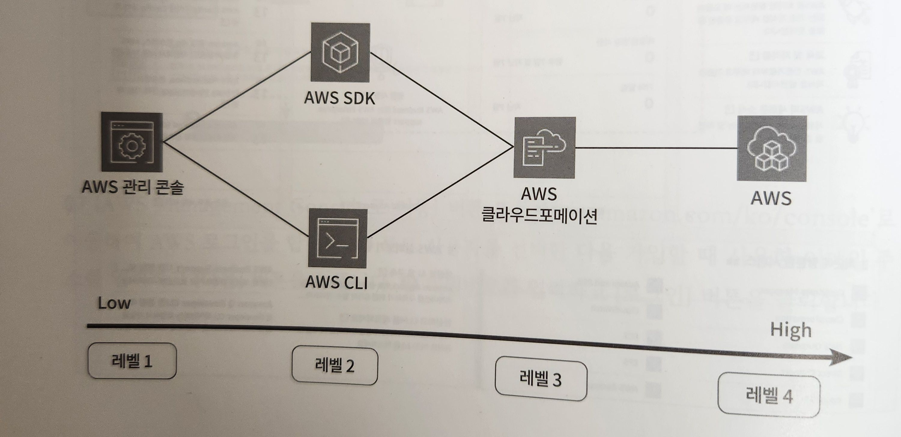
- 레벨 1 : 사용자 인터페이스(UI) 사용이 가능한 **AWS 관리 콘솔**
    - AWS 관리 콘솔은 UI를 통해 직관적인 AWS 사용이 가능하지만 생성한 AWS 리소스가 늘어날수록 관리하기 힘들어진다.
- 레벨 2 : **AWS SDK와 AWS CLI**로 스크립트와 터미널을 이용
    - AWS SDK(Software Development Kit) : 자바, 자바스크립트, 파이썬 등 자주 사용되는 언어를 바탕으로 AWS를 호출하여 웹, 모바일 웹 애플리케이션을 구축할 수 있도록 돕는다.
- 레벨 3 : **IaC(Infrastucture as Code) 툴인 클라우드포메이션**을 이용하여 JSON, YAML 형식으로 클라우드 인프라를 정의하여 다수의 AWS 리소스를 생성 및 관리
- 레벨 4 : **AWS CDK(Cloud Development Kit)**는 사용자가 익숙한 프로그래밍 언어를 사용하여 클라우드 인프라를 정의할 수 있어 더 직관적인 환경 제공
    - 특정 프로젝트나 팀의 요구사항에 따라 프로그래밍 언어가 달라진다.

# VS Code로 클라우드포메이션 템플릿 관리하기

- 비주얼 스튜디오 코드에서 클라우드포메이션 확장 프로그램인 클라우드포메이션 린터(CloudFormation Linter)를 설치
- 클라우드포메이션 린터 : JSON과 YAML 문법을 검사하여 클라우드포메이션 템플릿 형식을 유지하도록 돕는다. →코드 효율적 관리 & 템플릿의 품질 향상

## 윈도우에서 클라우드포메이션 템플릿 관리하기

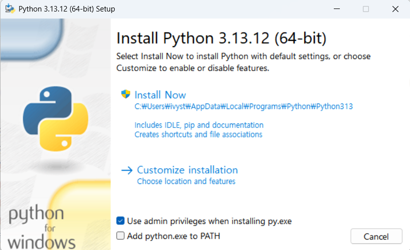
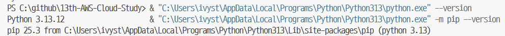
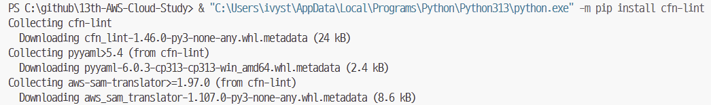
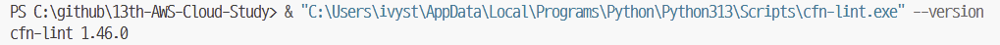

- 로컬 환경에 파이썬 설치 확인
- 파이썬 패키지인 pip를 최신 버전으로 업그레이드
- pip를 이용하여 클라우드 포메이션 린터 설치
- 클라우드포메이션 린터 버전 확인

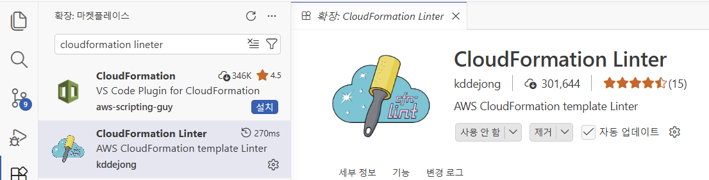


> 클라우드포메이션 린터는 클라우드포메이션 코드를 검사하여 문법 오류나 잠재적인 문제를 찾아내는 도구
- VS Code는 클라우드포메이션 린터가 잘못된 코드를 표시하는 편리한 기능도 있다.

# 클라우드포메이션 사용해보기

> 아마존 VPC(Amazon Virtual Private Cloud) : 클라우드의 네트워크 환경을 구축하고 관리할 수 있는 서비스
- chapter0/VPC/VPC.yml 참고


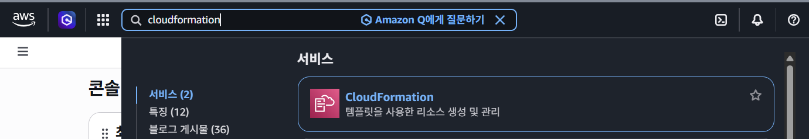

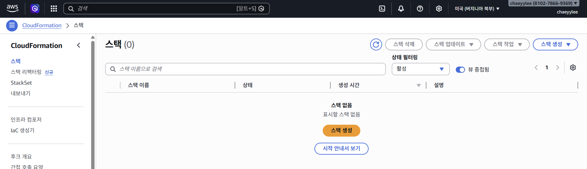

- AWS 관리 콘솔에서 CloudFormation 검색
- 클라우드포메이션 콘솔 화면에서 스택 생성 화면으로 이동하며 스택 생성과 관리를 할 수 있다.

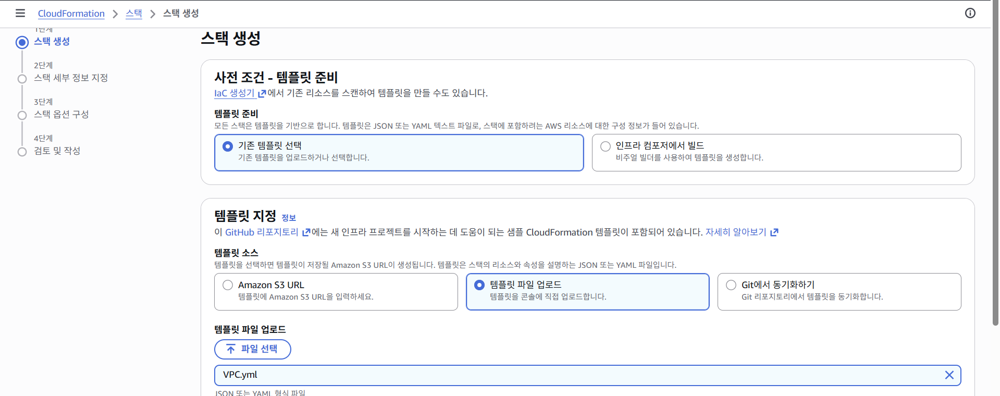

- 템플릿 준비에서 준비된 템플릿을 선택하고 템플릿 지정으로 넘어와 템플릿 파일 업로드 선택
- chapter0의 VPC.yml 파일을 선택하여 업로드

> VPC.yml 파일은 AWS에서 네트워크를 생성하고 관리하는 코드를 담고 있다.
>

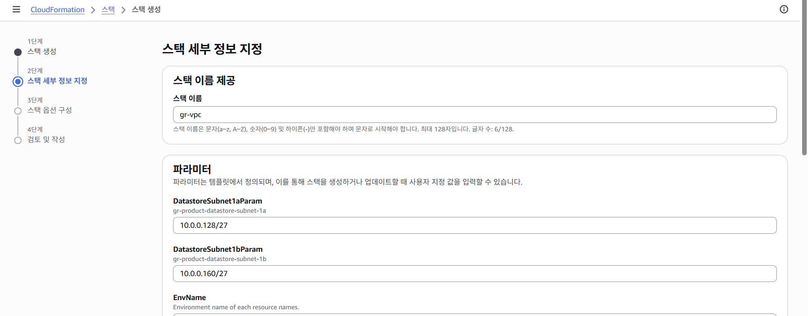

- 스택 세부 정보 지정에서 스택 이름 등 정보를 입력
- 클라우드포메이션 템플릿은 AWS에서 스택이라는 이름으로 생성되어 관리된다.
- 클라우드포메이션은 템플릿에서 정의되며 파라미터의 각 항목에서 사용자 지정 값을 입력
- VPC의 CIDR 또는 비밀번호, 시스템 이름, 환경 이름과 같이 데이터를 코드에 직접 입력해야 하는 하드코딩이 필요한 값은 파라미터를 통해 관리함으로써 코드를 더 간결하게 구성
- 스택 옵션 구성의 각 항목은 기본값 유지

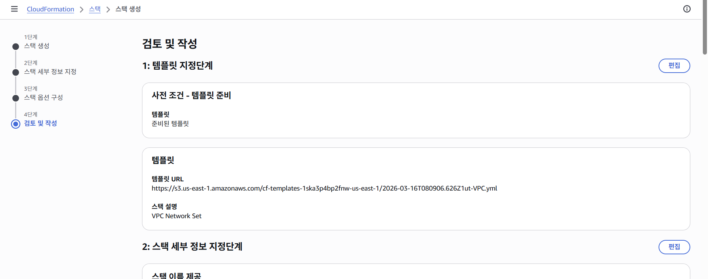

- 생성할 템플릿을 확인하고 클라우드포메이션 스택을 생성한다.

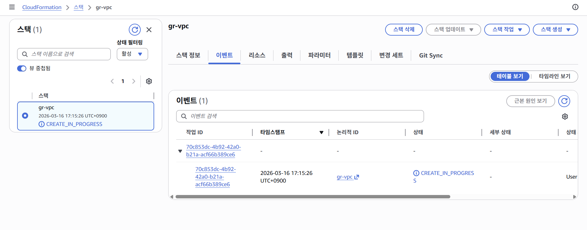

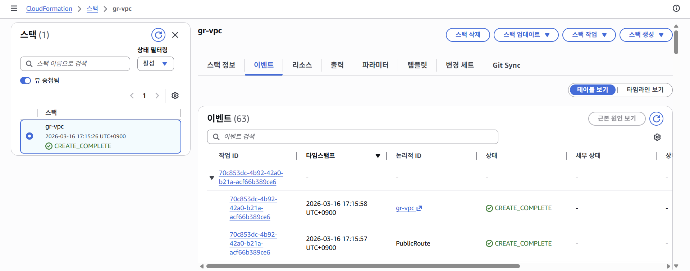

- ‘CREATE_IN_PROGRESS’를 거쳐 ‘CREATE_COMPLETE’로 변경되는 스택 생성 과정 확인
- 이벤트 탭에서 생성된 리소스 확인

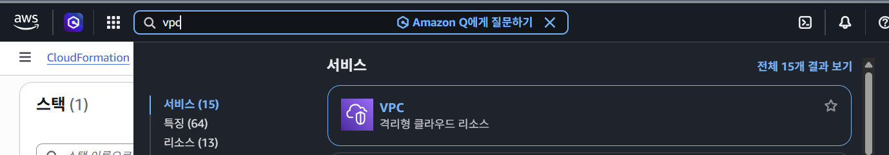

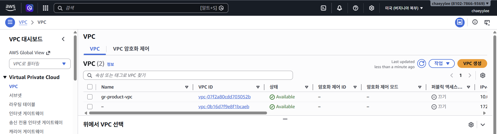

- VPC 콘솔 화면에서 생성된 리소스 확인
- 왼쪽 카테고리에서 VPC, 서브넷, 라우팅 테이블 등 다양한 AWS 네트워크 서비스 확인 가능
- VPC를 클릭하면 클라우드포메이션으로 생성된 VPC를 확인할 수 있다.

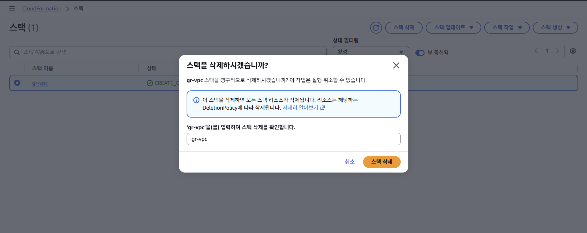

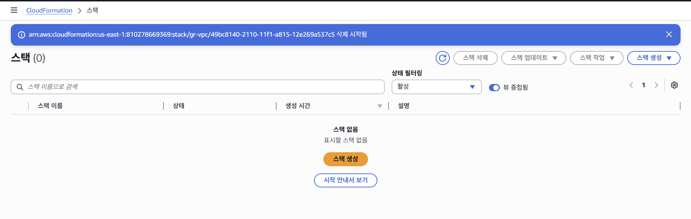

- 스택 삭제는 클라우드포메이션의 스택 화면에서 진행
- 상태가 ‘DELETE_IN_PROGRESS’로 변경된다.

> 실수로 인한 스택 삭제를 방지하기 위해 종료 방지 기능도 지원한다.
(스택 작업 → 종료 방지 편집)


# AWS에서 생성형 AI 활용 방안

> 실무엣 생성형 AI를 활용하는 방법 : 코드 작성, 솔루션과 트러블 슈팅


## 코드 작성

- AWS에서는 인프라 구축을 위한 IaC 코드나 IAM 권한 설정을 위한 JSON 코드를 작성해야 하는 경우가 많다.
- 하나의 서비스에 포함된 수많은 파라미터를 일일이 찾아가며 코드를 작성하는 일은 많은 시간과 노력을 요구한다.
- 이런 상황에서 생성형 AI를 활용하면 업무 생산성을 크게 높일 수 있다.

### IaC 코드를 생성형 AI에게 요청할 때

- ChatGPT를 활용해 클라우드포메이션 코드를 YAML 언어로 작성해달라고 요청하고, 각 리소스의 이름 규칙을 명확히 전달한다.
- 가용 영역(Availability Zone)을 하드코딩하지 않고 동적으로 설정하도록 부탁하며, 필요한 최소한의 파라미터(네트워크 CIDR)를 안내한다.
- 실제로 코드가 제대로 동작하는지 테스트하고 검증하는 과정 필수
- **ChatGPT에게 클라우드포메이션 코드 작성을 부탁한 결과**

    ```
    다음 파라미터를 이용해서 CloudFormation 코드(YAML)를 작성해줘
    
    각 리소스의 이름은 {EnvName}-{SystemName}-resourcename
    ex) {EnvName}-{SystemName}-vpc
    
    AvailabilityZone 값을 !Select와 !GetAZs를 활용해 하드코딩 없이 동적으로 설정하도록 해줘
    
    Region : seoul
    VPC CIDR : 10.0.0.0/16
    Public Subnet1 CIDR : 10.0.1.0/24
    Public Subnet2 CIDR : 10.0.2.0/24
    Private Subnet1 CIDR : 10.0.11.0/24
    Private Subnet2 CIDR : 10.0.12.0/24
    EnvName : gr
    SystemName : prd
    ```

    ```yaml
    AWSTemplateFormatVersion: '2010-09-09'
    Description: VPC with 2 public subnets and 2 private subnets in Seoul region
    
    Parameters:
      EnvName:
        Type: String
        Default: gr
    
      SystemName:
        Type: String
        Default: prd
    
      VpcCidr:
        Type: String
        Default: 10.0.0.0/16
    
      PublicSubnet1Cidr:
        Type: String
        Default: 10.0.1.0/24
    
      PublicSubnet2Cidr:
        Type: String
        Default: 10.0.2.0/24
    
      PrivateSubnet1Cidr:
        Type: String
        Default: 10.0.11.0/24
    
      PrivateSubnet2Cidr:
        Type: String
        Default: 10.0.12.0/24
    
    Resources:
      VPC:
        Type: AWS::EC2::VPC
        Properties:
          CidrBlock: !Ref VpcCidr
          EnableDnsSupport: true
          EnableDnsHostnames: true
          Tags:
            - Key: Name
              Value: !Sub '${EnvName}-${SystemName}-vpc'
    
      InternetGateway:
        Type: AWS::EC2::InternetGateway
        Properties:
          Tags:
            - Key: Name
              Value: !Sub '${EnvName}-${SystemName}-igw'
    
      VPCGatewayAttachment:
        Type: AWS::EC2::VPCGatewayAttachment
        Properties:
          VpcId: !Ref VPC
          InternetGatewayId: !Ref InternetGateway
    
      PublicSubnet1:
        Type: AWS::EC2::Subnet
        Properties:
          VpcId: !Ref VPC
          CidrBlock: !Ref PublicSubnet1Cidr
          AvailabilityZone: !Select [0, !GetAZs '']
          MapPublicIpOnLaunch: true
          Tags:
            - Key: Name
              Value: !Sub '${EnvName}-${SystemName}-public-subnet1'
    
      PublicSubnet2:
        Type: AWS::EC2::Subnet
        Properties:
          VpcId: !Ref VPC
          CidrBlock: !Ref PublicSubnet2Cidr
          AvailabilityZone: !Select [1, !GetAZs '']
          MapPublicIpOnLaunch: true
          Tags:
            - Key: Name
              Value: !Sub '${EnvName}-${SystemName}-public-subnet2'
    
      PrivateSubnet1:
        Type: AWS::EC2::Subnet
        Properties:
          VpcId: !Ref VPC
          CidrBlock: !Ref PrivateSubnet1Cidr
          AvailabilityZone: !Select [0, !GetAZs '']
          MapPublicIpOnLaunch: false
          Tags:
            - Key: Name
              Value: !Sub '${EnvName}-${SystemName}-private-subnet1'
    
      PrivateSubnet2:
        Type: AWS::EC2::Subnet
        Properties:
          VpcId: !Ref VPC
          CidrBlock: !Ref PrivateSubnet2Cidr
          AvailabilityZone: !Select [1, !GetAZs '']
          MapPublicIpOnLaunch: false
          Tags:
            - Key: Name
              Value: !Sub '${EnvName}-${SystemName}-private-subnet2'
    
      PublicRouteTable:
        Type: AWS::EC2::RouteTable
        Properties:
          VpcId: !Ref VPC
          Tags:
            - Key: Name
              Value: !Sub '${EnvName}-${SystemName}-public-rt'
    
      PublicDefaultRoute:
        Type: AWS::EC2::Route
        DependsOn: VPCGatewayAttachment
        Properties:
          RouteTableId: !Ref PublicRouteTable
          DestinationCidrBlock: 0.0.0.0/0
          GatewayId: !Ref InternetGateway
    
      PublicSubnet1RouteTableAssociation:
        Type: AWS::EC2::SubnetRouteTableAssociation
        Properties:
          SubnetId: !Ref PublicSubnet1
          RouteTableId: !Ref PublicRouteTable
    
      PublicSubnet2RouteTableAssociation:
        Type: AWS::EC2::SubnetRouteTableAssociation
        Properties:
          SubnetId: !Ref PublicSubnet2
          RouteTableId: !Ref PublicRouteTable
    
      PrivateRouteTable1:
        Type: AWS::EC2::RouteTable
        Properties:
          VpcId: !Ref VPC
          Tags:
            - Key: Name
              Value: !Sub '${EnvName}-${SystemName}-private-rt1'
    
      PrivateRouteTable2:
        Type: AWS::EC2::RouteTable
        Properties:
          VpcId: !Ref VPC
          Tags:
            - Key: Name
              Value: !Sub '${EnvName}-${SystemName}-private-rt2'
    
      PrivateSubnet1RouteTableAssociation:
        Type: AWS::EC2::SubnetRouteTableAssociation
        Properties:
          SubnetId: !Ref PrivateSubnet1
          RouteTableId: !Ref PrivateRouteTable1
    
      PrivateSubnet2RouteTableAssociation:
        Type: AWS::EC2::SubnetRouteTableAssociation
        Properties:
          SubnetId: !Ref PrivateSubnet2
          RouteTableId: !Ref PrivateRouteTable2
    
    Outputs:
      VpcId:
        Description: VPC ID
        Value: !Ref VPC
    
      PublicSubnet1Id:
        Description: Public Subnet 1 ID
        Value: !Ref PublicSubnet1
    
      PublicSubnet2Id:
        Description: Public Subnet 2 ID
        Value: !Ref PublicSubnet2
    
      PrivateSubnet1Id:
        Description: Private Subnet 1 ID
        Value: !Ref PrivateSubnet1
    
      PrivateSubnet2Id:
        Description: Private Subnet 2 ID
        Value: !Ref PrivateSubnet2
    ```


## 솔루션과 트러블 슈팅

- 솔루션 아키텍트의 업무 중 대부분은 코드 작성보다 AWS 관련 솔루션 설계와 트러블슈팅에 더 많은 시간을 투자한다.
- 인프라 환경에서는 ‘완벽한 상태’를 추구해야 하므로, 끊임없이 발생하는 트러블슈팅에 신속히 대응하고 문제를 최소화하는 것이 매우 중요
- 퍼플렉시티는 인터넷을 검색하여 최신 정보를 제공하며, 출처를 명확히 표시해 신뢰성을 높인다.
- 생성형 AI는 관련 공식 문서뿐 아니라 커뮤니티 포럼, 최신 블로그 글 등을 참고해 문제의 원인을 신속히 분석한다.
- 이후 적절한 조치 방법을 제시하여, 사용자는 보다 빠르게 문제 해결 가능
- 복잡한 트러블 슈팅 과정도 효율적으로 진행할 수 있으며, 실무자들의 부담을 크게 줄여준다.
