# AWS 입문하기

## AWS란 무엇인가?

> AWS : 아마존에서 제공하는 클라우드 컴퓨팅으로 인프라 환경을 구축하고 운영하는 데 필요한 다양한 온라인 서비스를 제공한다.

- 클라우드 컴퓨팅 유형에 따라서 서비스를 제공하는 방법뿐 아니라 컴퓨팅 리소스, 스토리지, 데이터베이스, 네트워킹, 데이터 분석, 머신러닝 등 다양한 서비스를 선택하여 사용 가능
- 사용자가 지역별 요구사항에 맞게 서비스를 선택하고 최적의 인프라를 활용할 수 있도록 글로벌 IT 환경을 확장하고 있다.

## AWS, 어떻게 탄생했고 왜 많은 사람이 사용하는가?

> Amazon Web Service

- 원래 아마존 인터넷 쇼핑몰 운영에서 늘어나는 트래픽과 주문량을 감당할 목적으로 구축한 사내용 고성능의 인프라 시스템이였다.
- 이 시스템을 전 세계 기업에 제공하는 클라우드 서비스로 확대

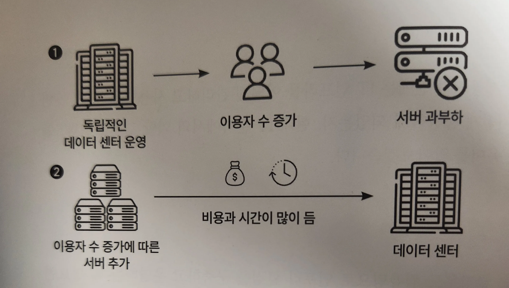
- 당시에는 각 회사가 독립적으로 서버, 스토리지 및 네트워크 장비를 보유하고 관리하는 데이터센터를 운영
- 사용자 수가 증가함에 따라 데이터센터 서버에 과부하가 걸리게 되면, 새로운 서버를 추가하여 부하를 분산하고 서비스의 가용성을 유지해야 했다.
- 그러나 데이터센터에 서버를 추가하는 것은 쉬운 작업이 아니었으며, 새로운 서버를 추가하는 프로세스는 주로 몇 주에서 몇 개월까지 소요되어 비즈니스의 빠른 변화에 대응하기 어려웠음
- 또한 24시간 가동되어야 하는 데이터센터에는 많은 비용과 물리적인 서버와 장비들을 냉각시켜야 했음
- 이런 상황에서 클라우드 컴퓨팅의 등장으로 인해 기업들은 데이터센터에서 클라우드로의 이전을 고려하기 시작

> AWS는 종량과금제를 제공하여 필요한 만큼의 자원만 사용하고 지불할 수 있는 장점이 있었다.

- 기업이 신속하게 인프라를 확장하고 축소할 수 있도록 지원
- 인프라 비용을 절감하고 비즈니스의 민첩성을 향상시킬 수 있었다.

> AWS는 2006년 아마존 S3라는 스토리지 서비스를 시작으로 아마존 EC2라는 가상 클라우드 서버를 출시했다.

- 초기에는 기술적으로 숙련된 사용자를 대상으로 한 API 중심의 서비스였음
- 현재는 AWS 관리 콘솔이라는 사용자 친화적인 UI 환경을 구축
- 최종적으로 아마존은 클라우드 컴퓨팅을 만들었으며, 당시 ‘클라우드’라는 단어보다는 ‘웹 서비스’라는 단어가 주류였기 때문에 아마존 웹 서비스 라고 부르게 되었다.
- 서비스 지향 아키텍처 (Service Oriented Architecture, SOA)
    - 타 회사도 사용할 수 있도록 서비스를 공개
    - 인프라를 쉽게 확장하고 관리할 수 있는 솔루션을 제공
- 이러한 AWS의 등장으로 기업들은 AWS의 클라우드 기술을 활용하여 물리적 IT 인프라를 구축하지 않고도 안정적이고 편리한 서비스를 운영할 수 있게 된다.

> 부하 분산 : 다수의 중앙 처리 장치 또는 저장 장치와 같은 컴퓨터 자원에 작업을 나누어 처리하는 것

## ‘AWS’와 ‘Amazon’ 접두사는 무얼 의미하는가?

- AWS가 붙은 서비스는 유틸리티 서비스로 혼자 사용되지 않고 다른 서비스와 함께 쓰인다.
    - AWS 클라우드포메이션은 다른 AWS를 생성하고 관리하는 데 사용되는 유틸리티 서비스로 다른 AWS 서비스와 연결되어 효과적으로 동작하고 통합된다.
    - AWS 람다는 다른 서비스에 의해 관련 작업이 자동으로 실행되는 서비스
- Amazon이 붙은 서비스는 독립형 실행 서비스로 사용자에게 단독으로 실행 가능한 서비스를 제공
    - Amazon EC2를 독립적 가상 컴퓨팅 리소스로 제공받으면서 AWS 이외의 다른 서비스와 함께 사용할 수도 있다.
- Elastic Load Balancer와 같이 AWS, Amazon이 붙어 있지 않은 서비스도 있다.

# AWS를 쓰려면 알아두면 유용한 클라우드 지식

## 온프레미스

> 온프레미스(On-premise) : 조직이 자체적으로 IT 인프라를 소유하여 관리 및 운영하는 것 (회사가 직접 저장소를 관리하는 것)

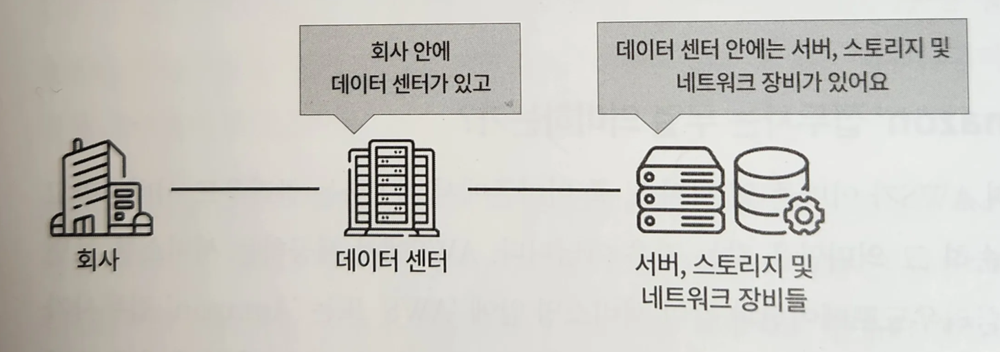
- 자체 운영을 위한 온프레미스 도입은 물리적인 서버 등 IT 리소스를 설치해야 하며 많은 투자 비용과 시간이 소요된다.
- 자체 IT 인프라를 관리하는 데 있어 설정, 구현, 업데이트, 오류 해결 등 유지 비용이 발생한다.

## 클라우드

- 온프레미스의 불편한 점을 해소하고자 등장한 것이 클라우드이다.

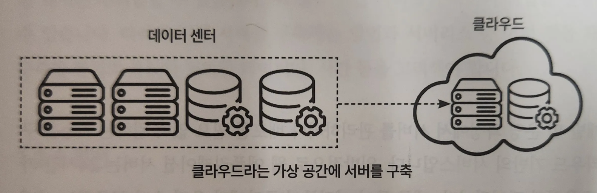
> 클라우드는 서버를 가상화하여 제3자가 사용자에게 저장소를 제공하는 형태

- 온프레미스와 같이 물리적 IT 리소스를 설치할 필요가 없다.
    - 회사 내 저장소를 따로 만드는 등 인프라에서 발생하는 높은 초기 구축 비용과 유지보수, 확장성이 문제되지 않는다.
- 클라우드를 사용하면 단기간 내에 서버 구축과 확장이 가능하며 운영 효율성과 자원 활용성이 증가한다.

## 하이브리드 클라우드

> 하이브리드 클라우드(hybrid cloud) : 기존의 온프레미스 환경과 클라우드 인프라의 이점을 결헙한 최적의 인프라를 구축하는 방식

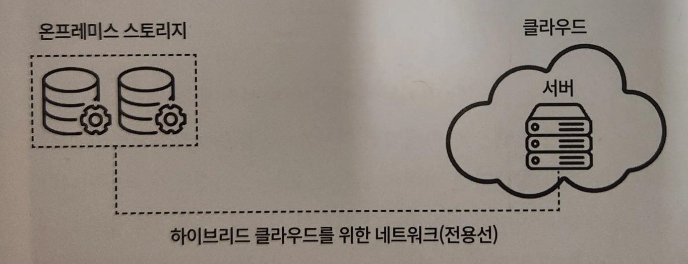
- 온프레미스의 데이터와 시스템 보안 및 기밀성을 유지하는 기능을 가져가면서 클라우드의 확장성과 유연성을 활용하여 필요한 서비스를 구현
- 비용과 시간을 절약하고 안정성과 성능을 유지
- 현대적인 IT 인프라 구축에 중요한 전략 중 하나이지만 온프레미스나 클라우드로 구축한 환경에 비해 시스템 구성이 복잡해지며 운영 및 관리가 어려울 수 있다.
- 온프레미스와 클라우드를 연결하는 별도의 네트워크망(전용선)을 확보해야 한다.

## 서버리스

> 서버리스(serverless) : 개발 및 운영 과정에서 서버를 관리하거나 배포할 필요 없이 원하는 기능을 구현하고 실행하는 클라우드 기반의 서비스

- 일반적으로 웹 애플리케이션 서버는 24시간 가동되기 때문에 효율성이 떨어진다.
- 하지만 서버리스를 사용하면 필요한 시점에만 리소스를 활용할 수 있어서 비용을 절약할 수 있고 개발 및 운영 과정에서 더 효율적으로 작업할 수 있다.

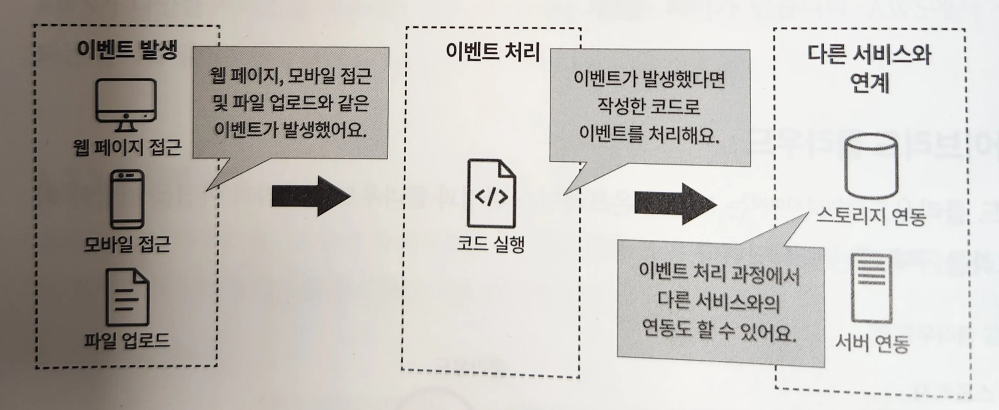
> 서버리스 처리 : 애플리케이션에서 발생하는 다양한 이벤트에 대응하여 사전에 작성한 코드가 실행되는 것

- 사용자의 웹 애플리케이션 액세스, 파일 업로드, 데이터베이스에서 새로운 데이터의 입출력 등 이벤트가 발생하면 서버리스 함수 또는 스크립트가 작동
- 서버리스는 데이터베이스와 연계를 통해 데이터를 저장하거나 필요한 정보를 가져올 수 있다.
- 데이터 관리를 위해 별도의 서버를 구축할 필요 없이 데이터베이스와의 연결을 통해 효율적으로 데이터를 관리할 수 있음을 의미한다.
- 서버리스는 다른 서비스와 연계가 가능하며 개발자는 서버 인프라의 관리나 운영에 대한 걱정을 줄일 수 있다.
- 다만 대량의 데이터를 처리하는 배치 처리와 같은 경우 서버리스 사용이 권장X
    - AWS 람다와 같은 서버리스 함수는 최대 15분 동안만 실행될 수 있기 때문에 배치 처리 작업처럼 긴 처리 시간이 필요한 때에는 부적합
    - 이 경우 직접 서버를 구축하여 작업을 진행하는 것이 더 적합
- 직접 서버를 구축하는 방법과 서버리스 중 어떤 것을 채택할지 결정할 때는 구축할 환경의 용도와 처리할 데이터양, 시간 등을 고려해야 한다.

## 리전

> 리전 : 서비스가 제공되는 물리적인 국가/도시 단위의 지역

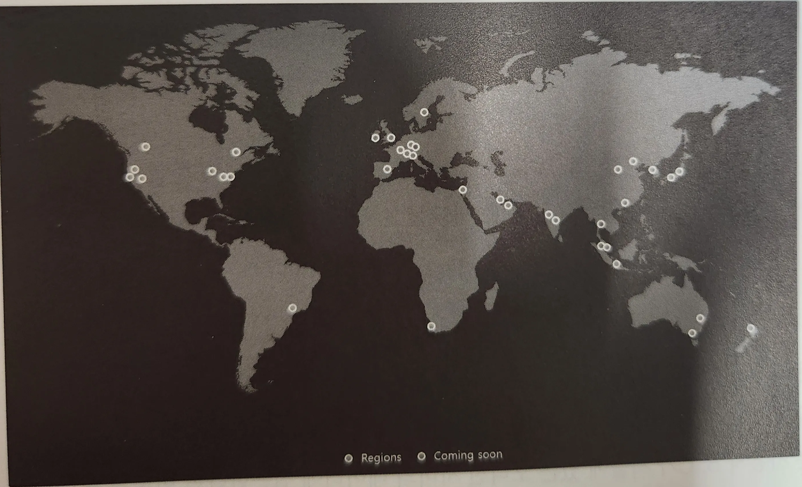
- AWS의 글로벌 인프라 구성은 리전(region)과 가용 영역(availability zone), 에지 로케이션(edge location)으로 구성
- 사용자에게 물리적인 거리를 좁혀 네트워크 속도를 향상시킴으로써 더 빠르고 안정적인 서비스를 제공한다.
- 해당 지역의 서비스를 이용하지 못하는 일이 발생할 때 대신 다른 지역의 서비스를 이용하고 서버를 유지하며 지속적인 서비스를 제공할 수 있다.
- 각 리전에는 고유 코드가 존재하며 한국 서울 리전은 [ap-northeast-2]이다.

## 가용 영역

> 가용 영역(availability zone) : AWS 리전 내에 서버, 스토리지, 네트워크 장비를 저장하는 하나 이상의 물리적인 개별 데이터센터로 구성되며 각각 독립적으로 운영된다.

- AWS에서는 가용 영역에 데이터센터 발전기와 물리적인 보안 시설을 갖추고 있으며 해당 가용 영역에 서버, 스토리지, 네트워크를 구성하여 클라우드 환경을 구축할 수 있다.
- 가용 영역은 리전의 이름 뒤에 알파벳으로 구분된다.
    - ex. 서울 리전 → [ap-northeast-2a], [ap-northeast-2b], [ap-northeast-2c], [ap-northeast-2d] 4가지 가용 영역을 운영하고 있다.
- 서로 다른 물리적인 위치에 있어 자연재해 등으로부터의 영향을 최소화하고 시스템 가동 중지를 최소화하도록 보장한다.

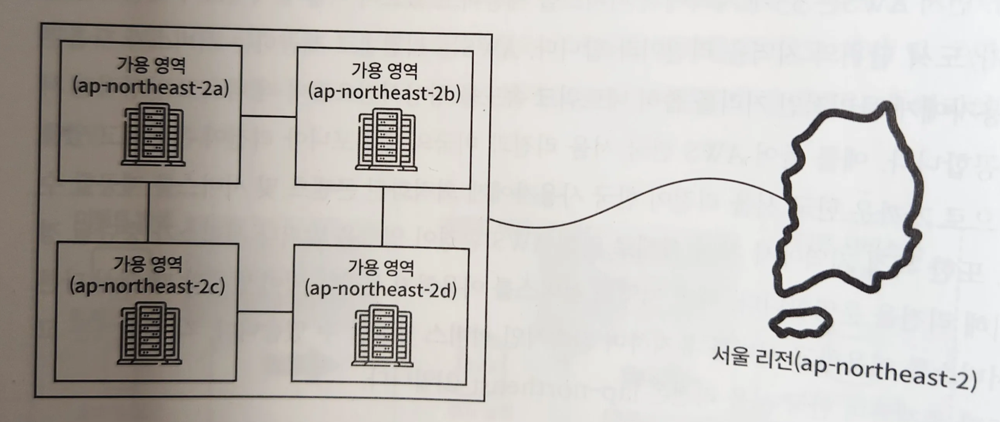
- 가용 영역들은 물리적으로는 분리되어 있지만 네트워크를 통해 서로 연결되어 있다.

  → 한 가용 영역이 중단되더라도 다른 가용 영역을 통해 시스템을 계속할 수 있음

- 사용자에게 안정적이고 신뢰할 수 있는 클라우드 인프라를 제공

## 에지 로케이션

> 에지 로케이션 : 오리진 서버의 콘텐츠를 서로 다른 지역에서 빠르게 접근할 수 있도록 만드는 캐시 서버의 모음

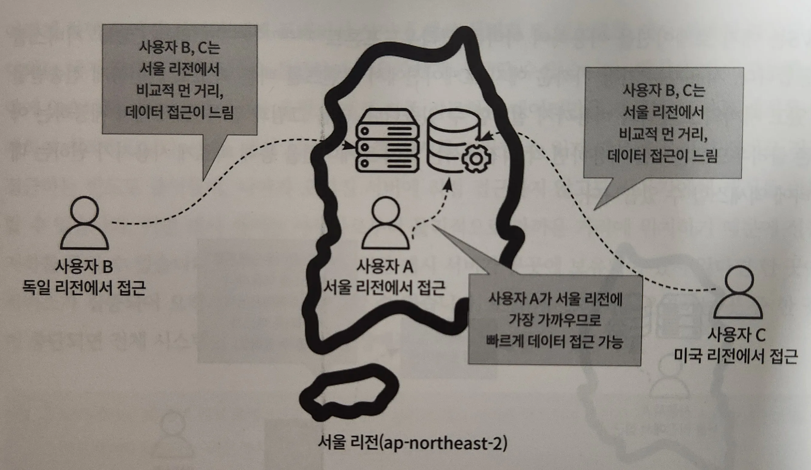
- 그림과 같이 서로 다른 지역의 사용자 A, B, C가 있을 때 독일, 미국에서 거주하는 사용자 B, C가 서울에 있는 오리진 서버의 데이터에 접근한다면 어떻게 될까?
- 사용자 A가 데이터 접근이 가장 빠르고 사용자 B, C는 느릴 것이다.
- 이를 해결하려면 사용자 B, C가 접근하고자 하는 데이터를 중간에 캐시하면 된다.
- 에지 로케이션은 사용자와 오리진 서버 사이에서 데이터를 캐시하는 역할

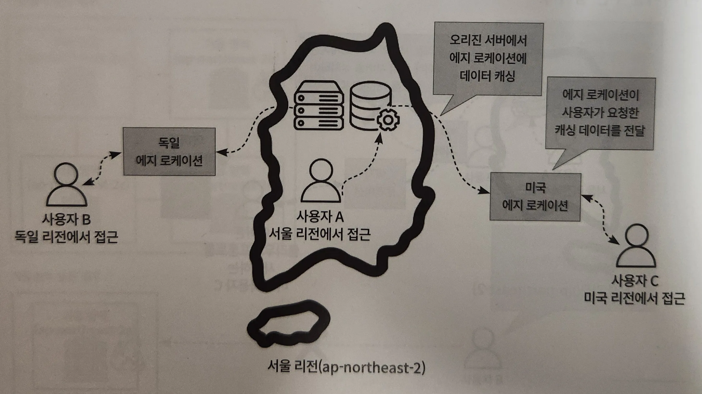
- 만약 에지 로케이션에 캐시가 남아 있다면, 사용자에게 캐시를 반환하고, 캐시가 없다면 오리진 서버에서 데이터를 검색하여 에지 로케이션에 캐시를 저장한 다음 사용자에게 반환

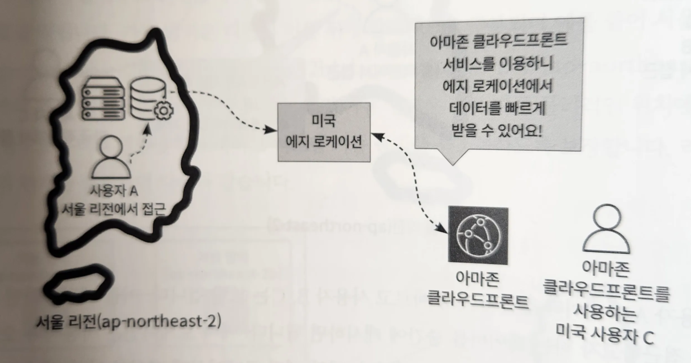
> 아마존 클라우드프론트를 사용하면 각 리전에서는 에지 로케이션을 통해 빠르게 사용자가 원하는 데이터에 액세스할 수 있다.

- AWS는 에지 로케이션을 이용하여 아마존 클라우드프론트(Amazon CloudFront)라는 CDN(Content Delivery Network) 서비스를 제공한다.
- 사용자는 가장 가까운 에지 로케이션에서 콘텐츠를 빠른 속도로 안전하게 전송받을 수 있고 서버의 트래픽과 비용까지 절감할 수 있다.

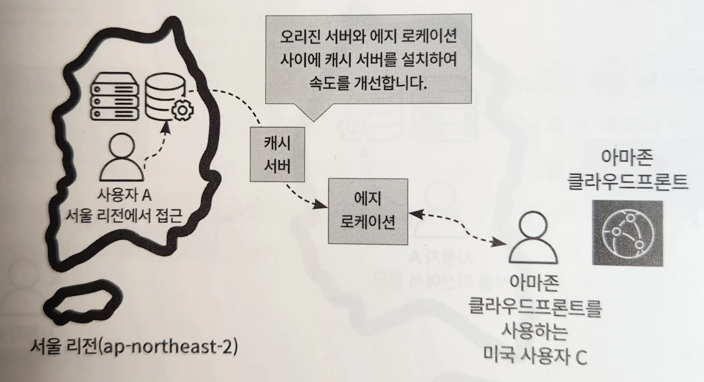
- 에지 로케이션에 캐시가 남아있지 않다면 오리진 서버에서 콘텐츠를 취득해야 하는데,
- 오리진 서버와 에지 로케이션 사이에 캐시 서버를 둬서 문제 해결
    - 캐시 서버에 저장된 데이터는 에지 로케이션에서 바로 접근하여 사용자에게 제공
- 에지 로케이션은 용량 문제로 자주 접근하는 데이터만을 캐시하고, 다른 캐시를 삭제하여 최적화
- 캐시 서버는 더 큰 캐시를 저장할 수 있음
    - 오리진 서버로 직접 접근하는 빈도도 줄어들고, 직접 접근하지 않고도 사용자에게 캐시 반환
- 캐시 서버는 사용자로부터 물리적으로 가까운 거리에 위치하기 때문에 성능 저하를 줄일 수 있다.
- 그러나 CDN을 위한 캐시 서버가 곳곳에 보유되어 있지 않다면 한 곳에 서비스가 집중되어 오히려 트래픽이 증가할 수 있다.
- 또한 캐시 서버를 운영하는 곳 중 한 곳이 중단되면 전체 시스템이 중단되는 단일 장애점 문제 발생

## 가용성

> 가용성(availability) : 리전 내 자연 재해와 같은 여러 상황이 발생하여 시스템 장애가 나도 정상적으로 작동할 수 있는 정도

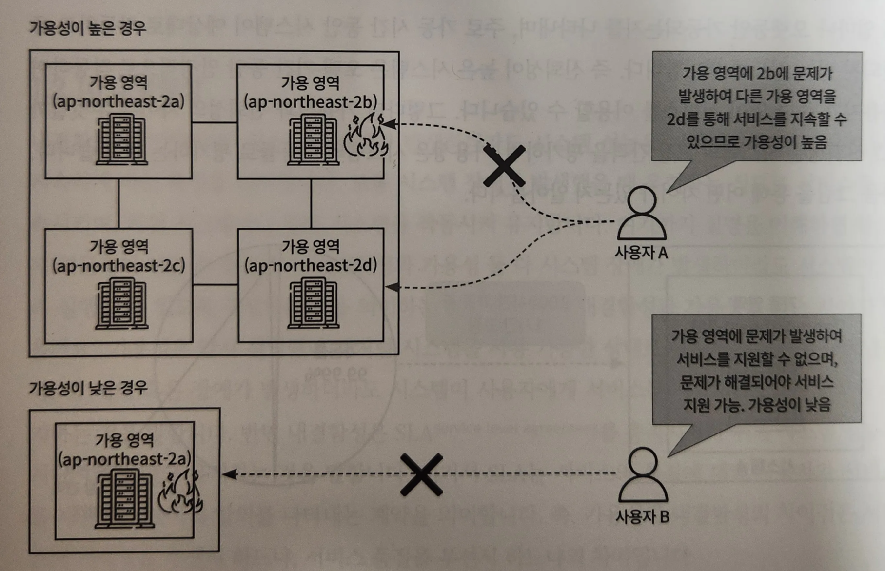
- 시스템은 사용 가능한 시간이 길수록 가용성이 높고 시스템 오류 등으로 중지되는 시간이 길수록 가용성은 저하된다.
- 일정 시간 동안의 가동 시간 비율
- 가용 가능한 가동률을 99% 또는 99.9%와 같이 백분율로 표시

> 고가용성(high availability) : 시스템이나 서비스가 지속적으로 정상 운영이 되는 능력

- 고가용성의 시스템은 시스템 장애가 발생하는 빈도가 극히 드물고, 장애가 발생하더라도 빠르게 복구하여 서비스 중단 시간을 최소화한다.

## 신뢰성

> 신뢰성(reliability) : 서버 혹은 시스템이 얼마나 오랫동안 가동되는지  
가동 시간 동안 시스템이 예상대로 작동하고 중단되지 않는 정도

- 신뢰성이 높은 시스템은 오랜 기간 동안 안정적으로 작동하여 사용자가 중단 없이 서비스를 이용할 수 있다.

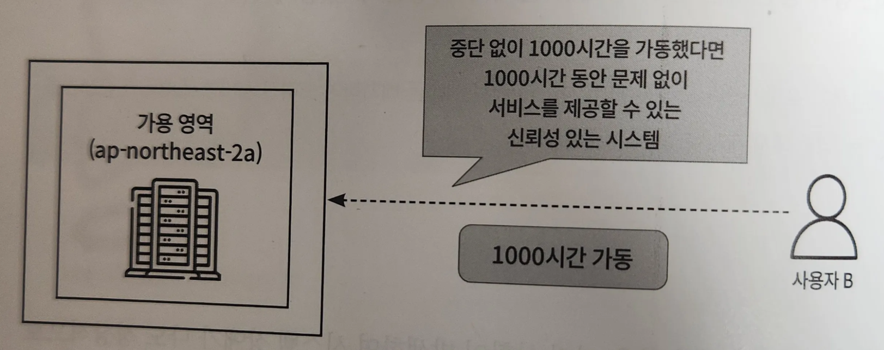
> 신뢰성은 시스템의 고장 간격을 평가하며, 가용성은 시스템의 가동률로 평가한다.

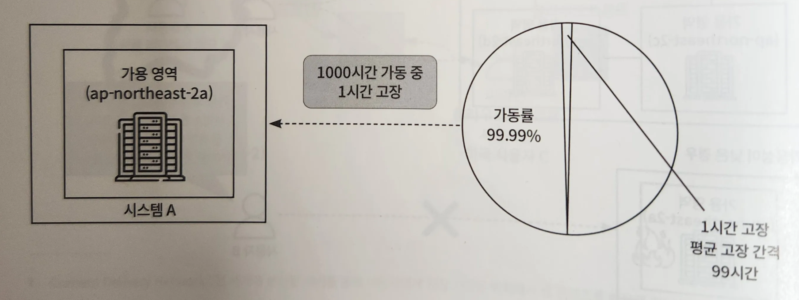
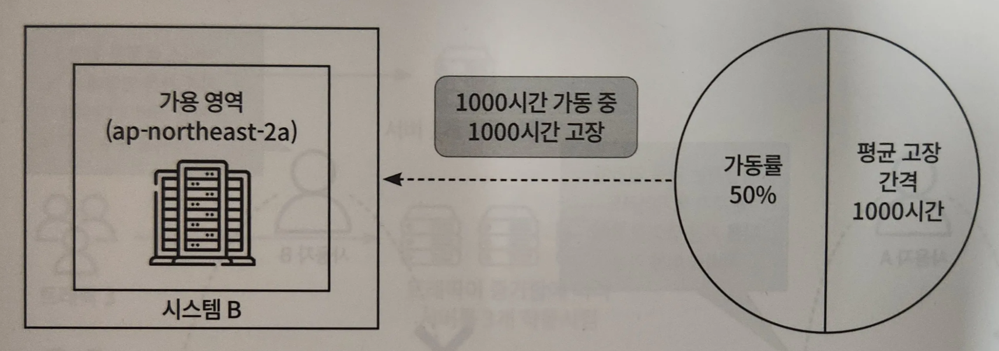
- 가용성은 시스템이 사용 가능한 시간의 비율로 평가되며, 이는 시스템이 서비스를 제공할 수 있는 정도를 나타낸다.
- 시스템의 가동률로 표현되며, 시스템이 얼마나 오랫동안 가동되었는지에 따라 결정
- 시스템 B가 1000시간의 고장 간격을 보인다고 하더라도, 이는 신뢰성과 관련된 지표이며 가용성과 직접적으로 연관은 X
- 그러므로 시스템 B가 1000시간 동안 가동되었다고 했을 때, 이는 가용성 측면에서 100%의 가동률
- 하지만 가용성을 평가할 때는 시스템이 고장 없이 얼마나 오랫동안 가동되었는지와 함께, 시스템이 복구되는 데 걸리는 시간도 고려되어야 한다.
- 시스템이 1000시간 동안 가동되었지만 중간에 고장이 발생하고 시스템이 1000시간 동안 복구 시간을 가졌다면, 이는 가동률이 50%로 나타날 것
- 따라서 신뢰성은 시스템의 고장 간격을 기반으로 하지만 가용성은 시스템의 가동률을 기반으로 한다. (이 두 지표는 서로 관련되어 있지만 완전히 다른 개념)

## 내결함성

> 내결함성(fault tolerance) : 시스템에 장애가 발생하더라도 시스템 성능을 저하시키지 않고 서비스를 지속하게 하는 특성

- 시스템 장애가 발생했을 때 우회하는 식으로 서비스를 지속시키며, 하위 시스템이나 중복 시스템을 작동시켜 유지한다.
- 내결함성과 가용성 둘 다 시스템 장애가 발생하더라도 시스템이 계속 실행할 수 있도록 구성하는 것을 의미하는 것인데 도대체 내결함성과 가용성은 무슨 차이가 있을까?
    - 가용성 : 시스템을 사용 가능한 상태로 유지하는 능력

  → 재해 혹은 장애가 발생하더라도 시스템이 사용자에게 서비스를 제공할 수 있는 상태를 유지하는 것

    - 내결함성 : SLA(service level agreement)를 충족시키기 위해 시스템 성능을 저하시키지 않고 유지하는 것
        - SLA : 서비스의 품질에 대해 사용자와 서비스를 제공하는 사이의 합의를 나타내는 계약
- 즉, 가용성과 내결함성의 차이는 서비스의 지속성을 우선시 하느냐, 서비스 품질을 우선시 하느냐

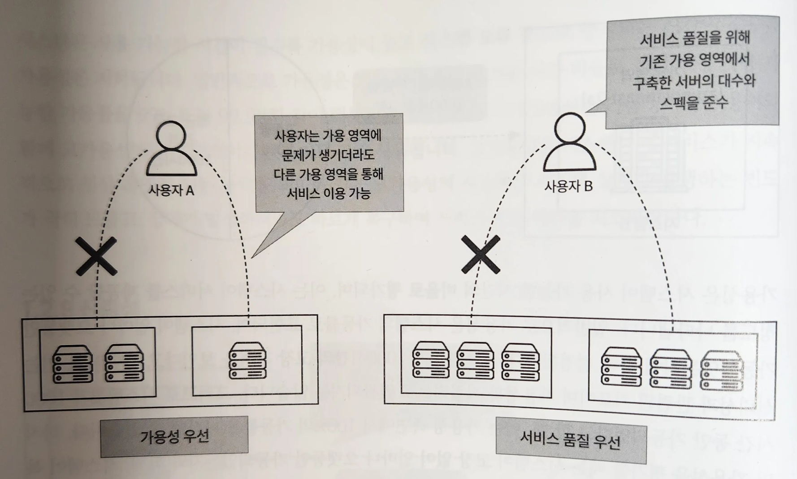
- 가용성은 서비스의 지속성을 우선시
  → 하나의 가용 영역에 문제가 발생했을 때 다른 가용 영역에서 서비스를 지속할 수 있다면 가용성을 충족시킨다.
- 내결함성은 서비스 품질을 우선으로
  → 하나의 가용 영역에서 세 대의 서버가 가동 중이었다면 다른 가용 영역에서도 동일하게 세 대의 서버를 가동하여 서비스 품질을 만족시켜야 한다.
    - 그러나 서비스 품질을 위해 최소 여섯 대의 서버를 유지해야 하므로 비용은 가용성보다 많이 든다.

## 탄력성

> 탄력성(Elasticity) : 시스템이 비즈니스 상황에 따라 트래픽이나 부하에 대응하여 유연하게 자동으로 조정하는 능력

> 변화에 빠르게 대응하여 시스템 성능을 유지하고 정상적인 작동을 할 수 있도록 가용성을 높이는 데 중점을 둔다.

- ex. 트래픽이 1일 때는 서버 수를 적게 운영하다가 트래픽이 3으로 증가하면 그에 따라 서버 수 증가

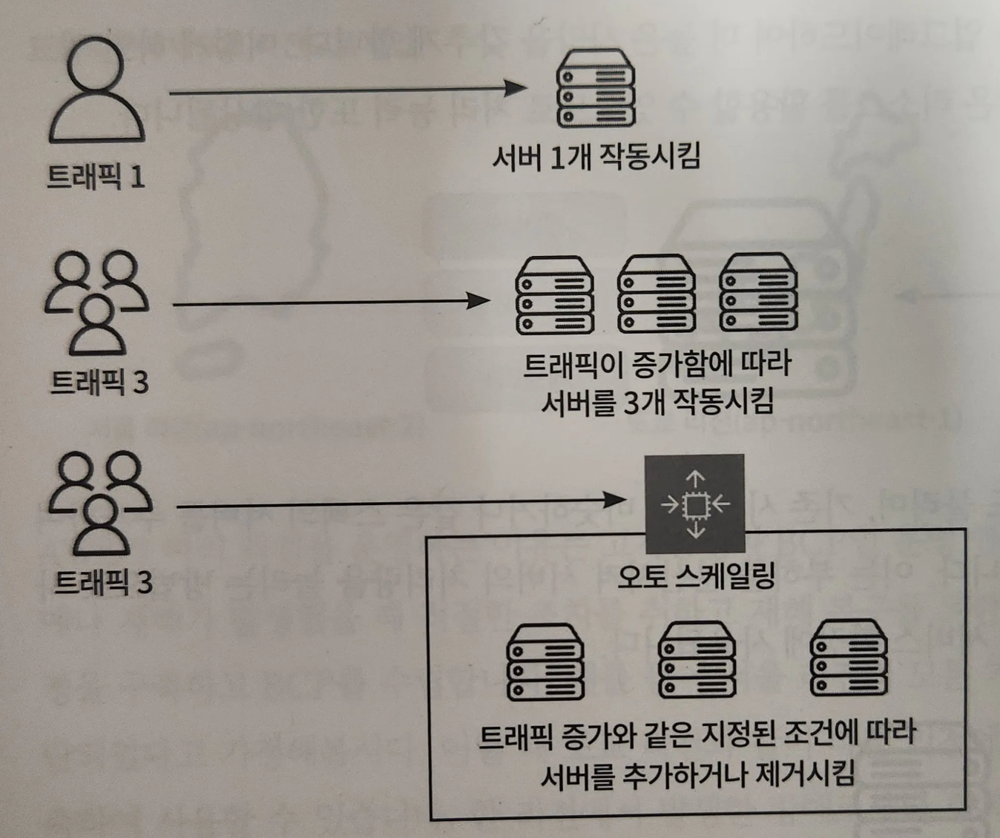

### 오토 스케일링

> 오토 스케일링(auto scaling) : CPU 사용률, 네트워크 트래픽 등 미리 정의된 조건에 따라 서버를 추가하거나 제거함으로써 탄력성을 유지하게 도와준다.

> 각 서버에 과도한 부하가 걸리는 것을 방지하고 시스템의 성능을 일정 수준으로 유지할 수 있다.

- 탄력성은 트래픽을 조절하는 데도 도움이 되지만, 자동으로 조정하는 능력에 따라 불필요한 자원을 사용하지 않기 때문에 비용 최적화에 필수적인 기능

## 확장성

> 확장성(Scalability) : 비즈니스가 성장함에 따라 서버 용량이 한계에 도달할 때 인프라를 확장하는 것

- 탄력성의 경우 기존에 있는 서버의 처리 능력을 향상시켜 트래픽을 부하 감당했다면 확장성의 스케일아웃은 트래픽을 분산할 목적으로 서버 수를 늘린다.
- AWS는 오토 스케일링을 통해 스케일업과 스케일아웃을 구현하여 확장성을 확보한다.
- 트래픽이나 작업 부하 등에 따라 자동으로 서버 수를 조절하여 요구에 맞게 확장하거나 축소하는 기능을 제공하며 사용자가 서버의 스펙을 변경할 수 있다.

### 스케일업

> 수직 확장. 기존 서버의 성능을 향상시키는 방법

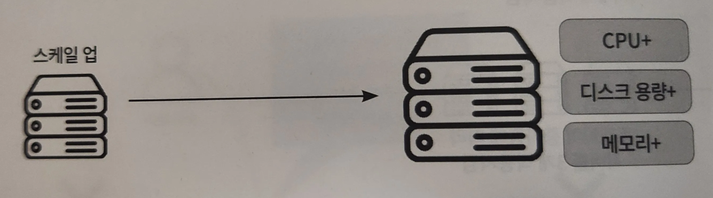
- 기존 서버의 성능이 한계에 다다랐을 때, 기존 서버를 확장시키는 스케일업을 통해 해소
- 서버의 디스크 용량, 메모리, CPU 등을 업그레이드하여 더 높은 사양을 갖추게 한다.
- 업그레이드된 기존 시스템에서 더 많은 리소스를 활용할 수 있으므로 처리 능력 또한 향상

### 스케일아웃

> 수평 확장. 기존 시스템과 비슷하거나 같은 스펙의 서버를 추가하여 전체 시스템 성능을 향상시킨다.

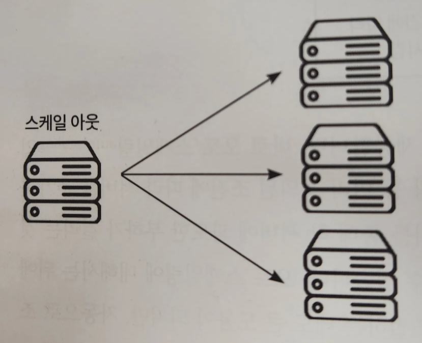
- 부하를 분산시켜 서버의 처리량을 늘리는 방법
- 사용자 증가나 트래픽 증가에 따른 서비스 확장에 사용된다.

## 비즈니스 연속성 계획

> 비즈니스 연속성 계획(BCP(business continuity plan)) : 시스템 운영에 영향을 주는 재해와 장애를 방지하고 복구하는 대책

> AWS에서는 시스템 장애와 재해에 대비하고 복구를 위한 BCP를 수립하고 있다.

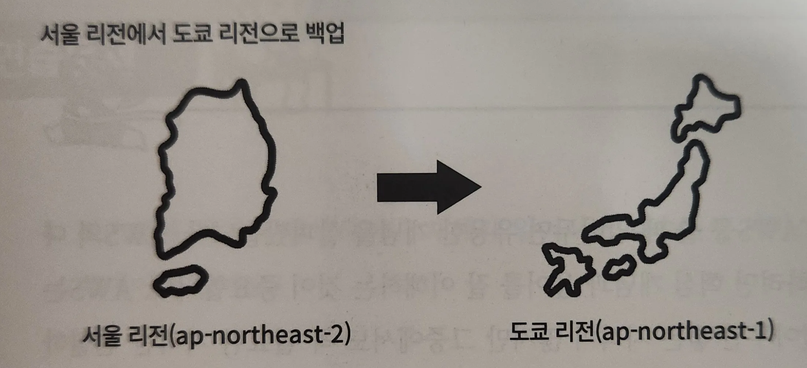
- AWS가 여러 리전을 운영하는 이유는 고가용성과 BCP인 운영 연속성을 위해서
- 시스템 장애나 재해가 발생했을 때 적절한 조치를 취하고 재해 복구를 위한 DR(disaster recovery)(재해 복구) 환경을 구축하고 BCP를 수립
- ex. 서울 리전의 모든 가용 영역이 자연 재해로 인해 중단되었을 때
    - 도쿄 리전과 같이 다른 리전에 백업 서버 및 데이터를 미리 구축하여 사용
- 한 리전에서 발생한 장애로부터 회복을 위해 다른 리전에 백업 서버 및 데이터를 준비하여 서비스 중단 기간을 최소화하고 서비스 지속성 확보
