# 백엔드 서비스 유형 파악하기

> 백엔드 : 사용자가 볼 수 없는 데이터 처리, 보안과 같은 부분을 담당
>

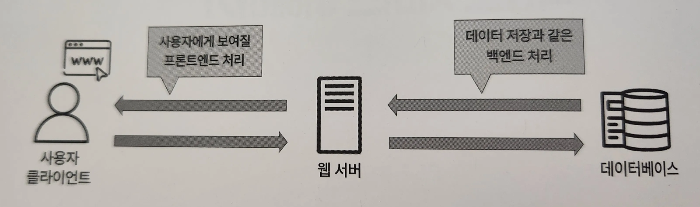
- 데이터베이스로부터 데이터를 처리하거나 호출하는 등 사용자가 확인할 수 없는 작업을 수행한다.
- AWS에서는 아마존 EC2 오토스케일링, 아마존 ECS, 아마존 다이나모DB, 아마존 API 게이트웨이, AWS 람다, 탄력적 로드 밸런서 등을 제공

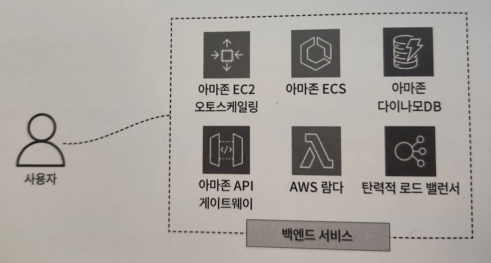
- 이를 통해 서비스의 안정성, 효율성, 확장성을 보장하고 사용자에게 보다 안정적인 서비스를 제공할 수 있다.

# 부하 분산 서비스, 탄력적 로드 밸런서란?

> 탄련적 로드 밸런서를 사용하며 사용자가 급증하더라도 적절하게 트래픽을 부하 분산할 수 있어, 안정적으로 서버를 운영할 수 있다.


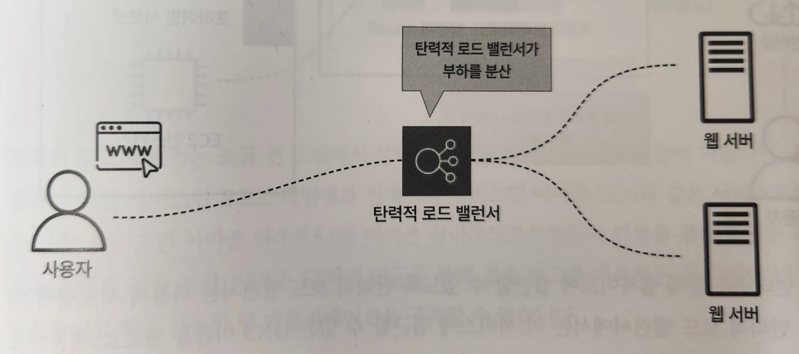
- 탄력적 로드 밸런서는 웹 서버 앞에 배치되며, 사용자는 이 탄력적 로드 밸런서를 여유해 웹사이트로 접근하게 된다.
- 이 방법으로 외부로 웹 서버를 공개할 필요가 없어지며, 사용자는 탄력적 로드 밸런서를 통해서만 웹 서버에서 제공하는 웹사이트에 접근할 수 있다.
- 개발자는 웹 서버에서 작업을 안전하게 수행할 수 있다.

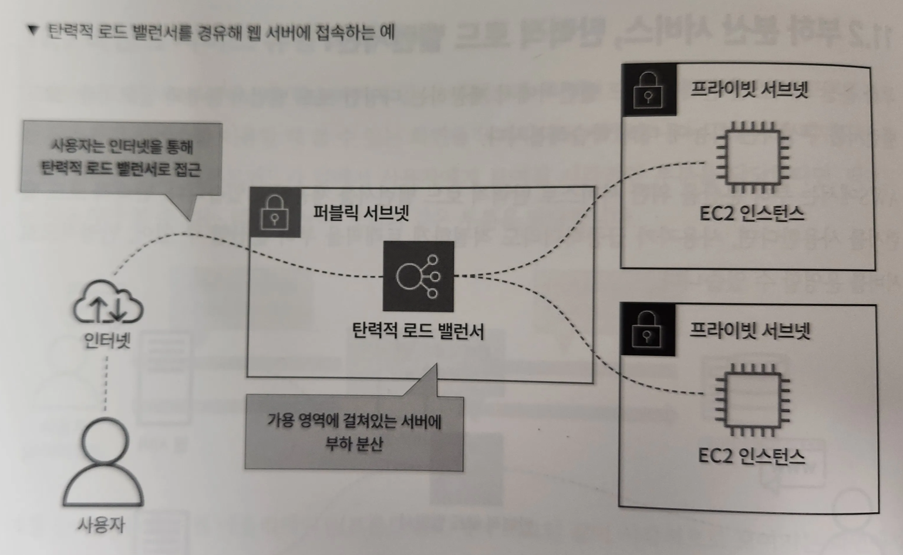
- 사용자가 인터넷을 통해 웹사이트에 접근할 수 있도록 탄력적 로드 밸런서는 퍼블릭 서브넷에 배치된다.
- 탄력적 로드 밸런서에서는 이 서비스에 접근할 수 있는 DNS 이름을 별도로 제공하고 있으며, 아마존 라우트53와 연동해 별도로 도메인을 할당할 수 있다.
- EC2 인스턴스에 도메인을 할당하는 것이 아닌 탄련적 로드 밸런서에 goldenrabbit.co.kr이라는 도메인을 할당
- 사용자는 탄련적 로드 밸런서의 도메인을 사용해 웹사이트에 접근하면서도 사용자와 EC2 인스턴스 간 직접적인 접근을 완전히 차단
- 프라이빗 서브넷에 있는 EC2 인스턴스로 부하 분산을 시도하며, 여러 가용 영역에 걸쳐 부하 분산을 실시할 수 있어 하나의 가용 영역이 무너지더라도, 다른 가용 영역에서 서비스를 지속할 수 있다.

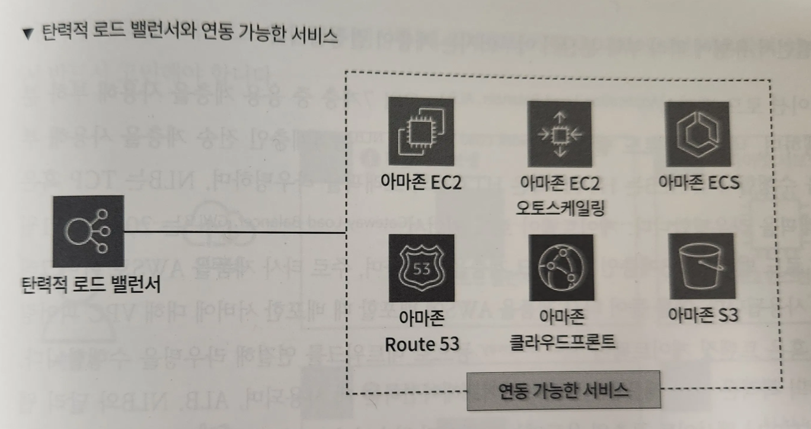
- 아마존 라우트53, 아마존 EC2, 아마존 EC2 오토스케일, 아마존 클라우드프론트, 아마존 S3 서비스와도 연동 가능

# 탄력적 로드 밸런서 살펴보기

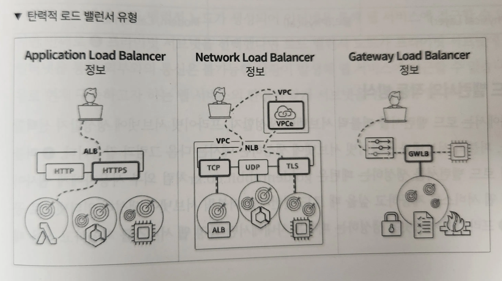
- ALB (Application Load Balancer) : OSI 7계층 중 응용 계층을 사용해 부하 분산을 수행
    - HTTP 혹은 HTTPS의 트래픽을 라우팅
- NLB (Network Load Balancer) : 4계층인 전송 계층을 사용해 부하 분산을 수행
    - TCP 혹은 UDP 트래픽을 라우팅
- GWLB (Gateway Load Balancer) : 3계층인 네트워크 계층 사용, 주로 타사 제품을 AWS로 마이그레이션할 때 사용
    - 타사 제품을 AWS에 배포할 때 배포한 서버에 대해 VPC 피어링 혹인 트랜짓 게이트웨이 등으로 네트워크를 연결해 라우팅 수행
    - 웹 애플리케이션이나 웹사이트 구축의 용도에는 적합X

| TCP/IP | OSI 모델 | 프로토콜 |
| --- | --- | --- |
| 응용 계층 (Application Layer) | 응용 (Application) | HTTP, SMTP, FTP, NFS, Telnet |
|  | 표현 (Presentation) | JPEG, MPEG, DCR, SMB, AFP |
|  | 세션 (Session) | TLS, SSH, ISO, 8327, RPC |
| 전송 계층 (Transport Layer) | 전송 (Transport) | TCP, UDP, RTP, SCTP, SPX |
| 네트워크 계층 (Network Layer) | 네트워크 (Network) | IP, ICMP, ARP, BGP, IPX |
| 데이터 링크 계층 (Data Link) | 데이터 링크 (Data Link) | Ethernet, ATM, LAN, Wifi |
| 물리 계층 (Physical Layer) | 물리 (Physical) | Modem, Cable, Fiber |

## 로드 밸런서의 작동 방식

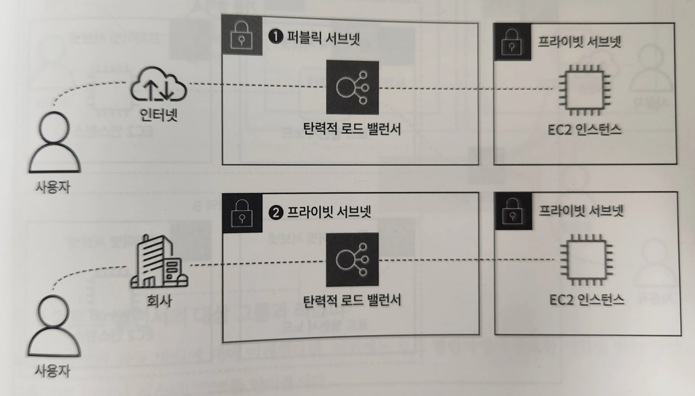
- 로드 밸런서를 퍼블릭 서브넷에 생성할지, 프라이빗 서브넷에 생성할지 선택할 수 있다. (설계 단계에서 반드시 고민)
1. 퍼블릭 서브넷에 로드 밸런서를 생성 : goldenrabbit.co.kr처럼 외부 사용자에게 웹사이트를 공개해 웹 서비스를 제공하고 싶을 때 로드 밸런서를 퍼블릭 서브넷에 생성해 인터넷으로 공개
2. 프라이빗 서브넷에 생성 : 사내에서만 특정 웹 서비스를 제공하고 싶을 때
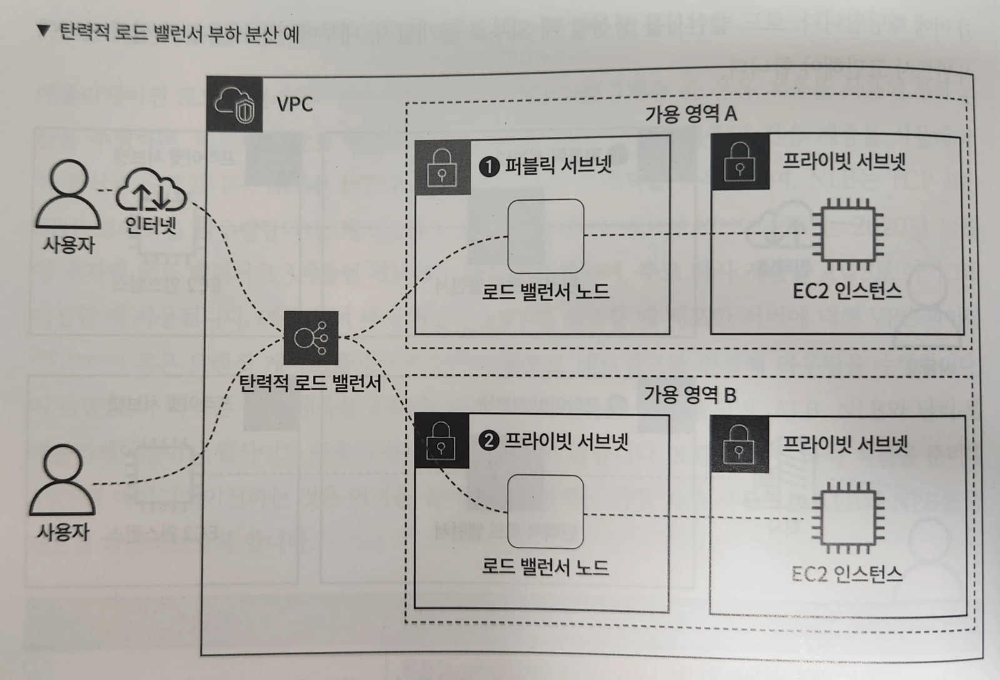

- 로드 밸런서는 가용 영역을 어떻게 구분하고 부하 분산을 실시할까?
    - 각 가용 영역에 로드 밸런서의 부하 분산을 도와주는 로드 밸런서 노드가 생성된다.
    - 로드 밸런서를 생성하면, 선택한 서브넷에 로드 밸런서 노드가 생성되며, 이 로드 밸런서 노드로 인해 각 가용 영역을 구분짓고 부하 분산을 수행
- 인터넷을 통해 웹 서비스에 접근해야 하는 경우 가정
1. 퍼블릭 서브넷 : 로드 밸런서 노드 생성 → 인터넷을 통해 웹 서비스 접근
2. 프라이빗 서브넷 : 로드 밸런서 노드가 프라이빗 서브넷에 생성되므로 인터넷을 통한 외부와의 통신 불가능 → 웹 서비스 접근 불가
- 현재 구축하고자 하는 웹 서비스의 환경에 맞게 서브넷을 선택해야 한다.

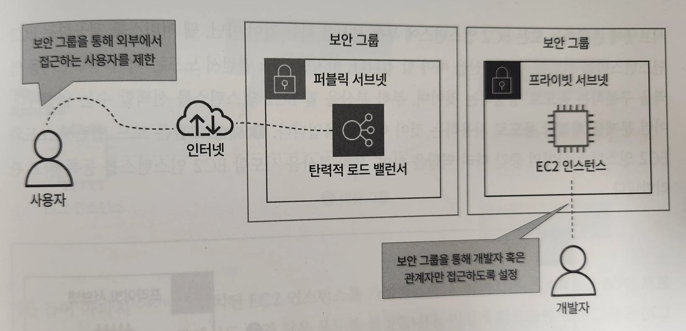
- 로드 밸런서는 EC2 인스턴스와 동일하게 보안 그룹을 설정할 수 있으며, 이 보안 그룹을 통해 로드 밸런서로 접근하고자 하는 사용자를 제한할 수 있다.
- 외부에 공개되는 웹사이트 → 보안 그룹 완전히 오픈
- 이후 EC2 인스턴스의 보안 그룹을 수정해 로드 밸런서의 접근만을 허용하면, 외부 사용자는 로드 밸런서에만 접근 가능 (직접적으로 EC2 인스턴스에는 접근X)
- EC2 인스턴스에는 개발자나 관리자와 같은 특정 사용자 그룹만 접근하도록 보안 그룹을 설정한다면, 보안성을 높일 수 있다.

## 로드 밸런서의 대상 그룹과 리스너

- 각 가용 영역에 있는 EC2 인스턴스는 로드 밸런서가 어떻게 구분할까?
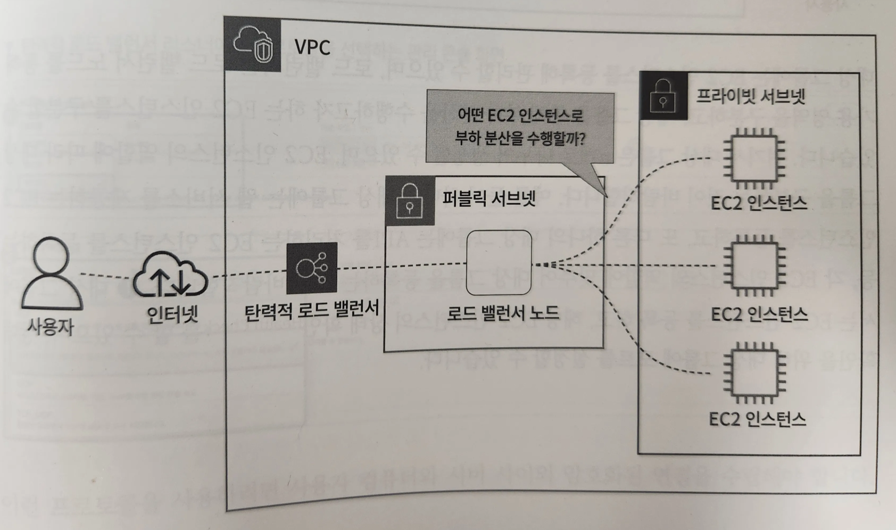

- 서브넷에 존재하는 모든 EC2 인스턴스에 부하 분산을 하는 것이 아니라, 웹 서비스를 제공하는 EC2 인스턴스만을 선택해 부하 분산을 해야 한다.
- 하지만 로드 밸런서 노드는 어디까지나 가용 영역을 구분하는 용도로 생성되는 것이며 부하 분산을 할 EC2 인스턴스를 선택할 수는 없다.

### 대상 그룹

> 대상 그룹 : 로드 밸런서 노드와 EC2 인스턴스 사이의 중간 다리 역할을 하며, 부하 분산을 시도할 EC2 인스턴스를 등록하고 관리한다.


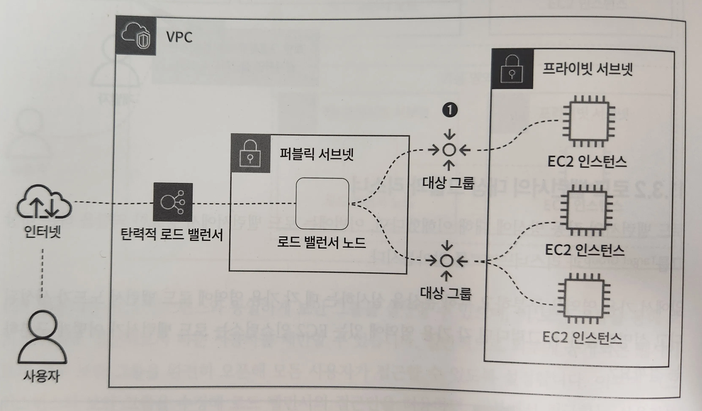

- 대상 그룹에는 EC2 인스턴스를 등록해 관리할 수 있으며, 로드 밸런서는 로드 밸런서 노드를 통해 가용 영역을 구분하고, 대상 그룹을 통해 부하 분산을 수행하고자 하는 EC2 인스턴스를 구분할 수 있다.
- 대상 그룹은 n개로 나누어 생성할 수 있으며, EC2 인스턴스 역할에 따라 대상 그룹을 구분하는 것이 바람직
- ex. 하나의 대상 그룹에는 웹 서비스를 제공하는 EC2 인스턴스를 등록하고, 또 다른 하나의 대상 그룹에는 API를 처리하는 EC2 인스턴스를 등록하는 등, 각 EC2 인스턴스의 역할에 맞추어 대상 그룹을 등록하는 것이 바람직하다.

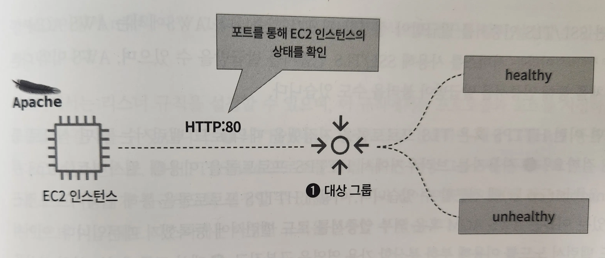
- 대상 그룹에서는 EC2 인스턴스를 등록하고, 해당 EC2 인스턴스의 상태 확인(Health Check)를 할 수 있으며, 상태 확인을 위해 대상 그룹에 포트를 설정할 수 있다.
- ex. 아파치(Apache)가 설치된 EC2 인스턴스 가정
    - 아파치는 기본적으로 80번 포트를 사용하므로 대상 그룹에서도 이와 같은 포트 설정
    - 이렇게 함으로써 대상 그룹은 EC2 인스턴스의 웹 서버 동작을 확인할 수 있다.
    - EC2 인스턴스가 80번 포트를 통해 문제없이 웹 서버로써의 기능을 하면 대상 그룹은 healthy를 반환 (반대는 unhealthy)
- 그런데 EC2 인스턴스가 HTTP를 사용한다면 접속하는 사용자도 HTTP를 사용해야 하는 걸까?
- 더 안전한 프로토콜인 HTTPS를 사용할 수는 없는 것인가?

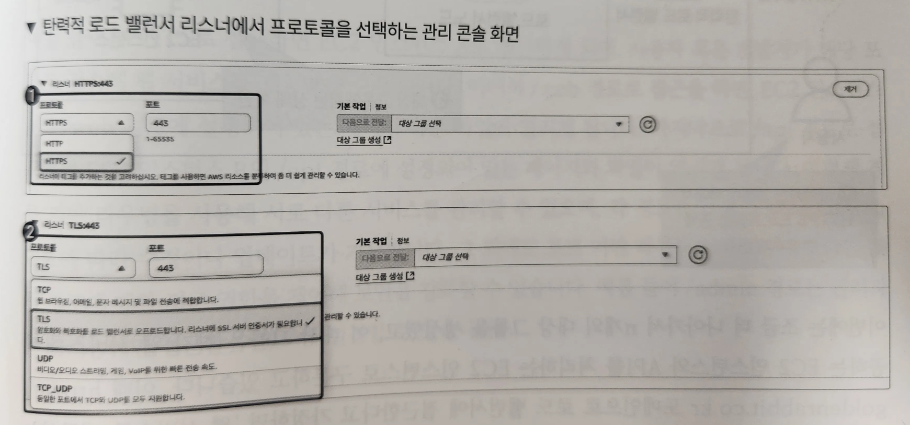
- 로드 밸런서에서는 더 안전한 통신인 HTTPS 즉 443 포트 사용을 지원한다.
1. ALB에서는 443 포트를 사용하는 HTTPS 프로토콜을 지정할 수 있다.
2. NLB에서는 443 포트를 사용하는 TLS 프로토콜을 지정할 수 있다.
- 이런 프로토콜을 사용하려면 사용자 컴퓨터와 서버 사이의 암호화된 연결을 수립해야 한다.
    - SSL/TLS 인증서 발급 및 설정 필요
    - AWS ACM(AWS Certificate Manager)를 통해 발급 가능

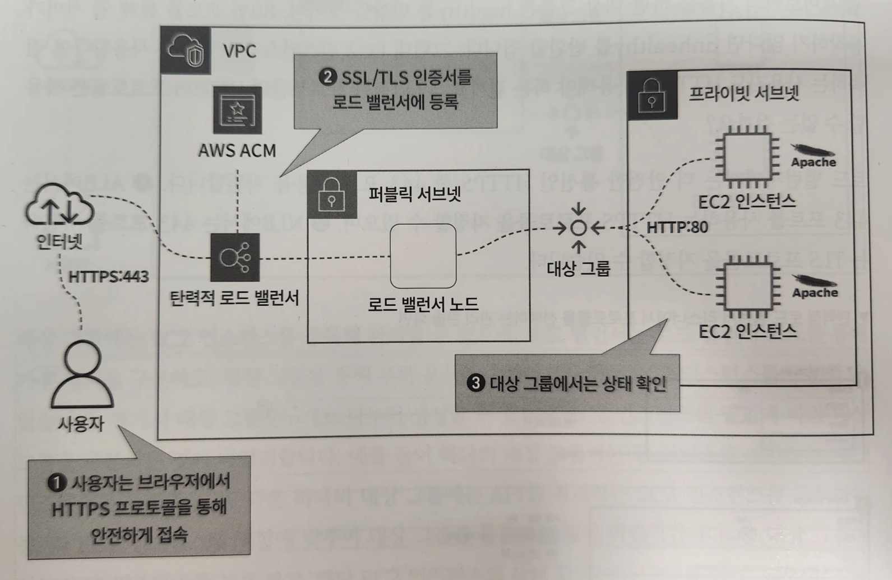
- HTTPS 혹은 TLS 프로토콜을 지정했을 때의 로드 밸런서는 어떤 식으로 동작할까?
1. 사용자는 브라우저에서 HTTPS 프로토콜을 이용해 웹사이트에 접근
    1. AWS ACM 혹은 외부 인증서를 로드 밸런서에 등록했기 때문에 가능
2. 로드 밸런서 노드를 이용해 부하 분산할 가용 영역을 구분짓는다.
3. 대상 그룹에서는 부하 분산을 관리하며 상태를 확인

### 리스너

- n개의 대상 그룹 생성, 이 대상 그룹은 각각 웹 서비스를 제공하는 EC2 인스턴스와 API를 처리하는 EC2 인스턴스로 구분
- https://goldenrabbit.co.kr 도메인으로 로드 밸런서에 접근한다고 가정하면
    - 웹서비스를 제공하는 EC2에 접근하게 되는 건지?
    - 아니면 API를 처리하는 EC2 인스턴스에 접근하는건지?

> 리스너 : n개의 대상 그룹을 운영할 때 어떠한 방식으로 접근을 할지 설정할 수 있는 기능


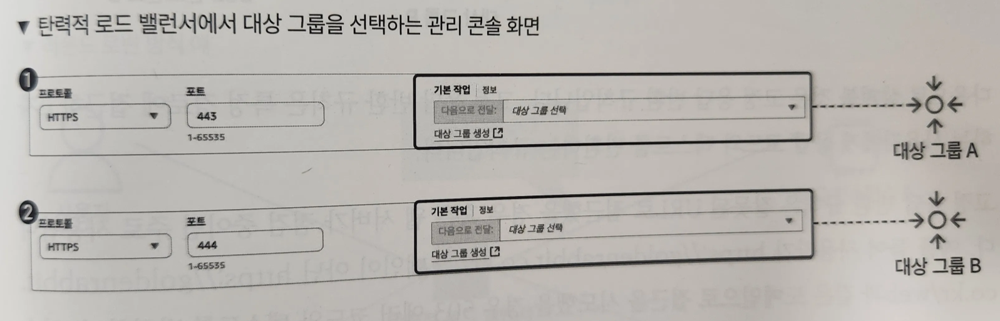
- 리스너에서는 리스너 규칙을 설정 할 수 있으며, 이 규칙에서는 프로토콜과 포트를 지정하고 대상 그룹을 연결지을 수 있다.
1. HTTPS:443 프로토콜로 접속하면 대상 그룹 A에 등록되어 있는 EC2 인스턴스로,
2. HTTPS:444 프로토콜로 접속하면 대상 그룹 B에 등록되어 있는 EC2 인스턴스로 사용자가 접근
- 이와 같이 포트를 이용해 접근 방법을 설정할 수 있으며 이 외에도 리스너에는 다양한 규칙을 설정할 수 있다.

> 포트 기반 라우팅 : HTTPS:443, HTTPS:444의 포트 기반으로 어떠한 EC2 인스턴스로 접근할지 라우팅을 설정한다.


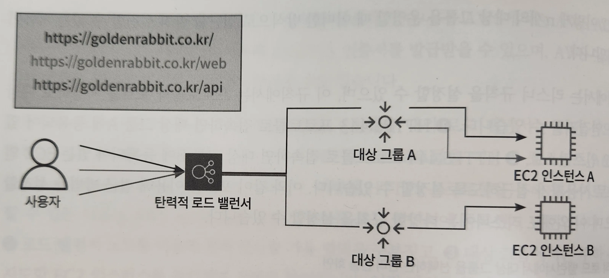
> 경로 기반 라우팅 : 경로를 기반으로 해 특정 서버로 라우팅하는 방법

- ex. HTTPS로 접근하면 EC2 인스턴스 A로 접근하게 되며, 사용자가 해당 포트로 접속해 웹 서비스를 제공받을 수 있다.
- /web 경로로 접근을 하면, EC2 인스턴스 A의 /web 경로에 설정되어 있는 페이지 혹은 파일이 열리게 된다.
- /api 경로로 접근하면 EC2 인스턴스 B의 /api 경로에 설정되어 있는 페이지와 파일이 열린다.

> 경로 기반 라우팅을 사용해 서로 다른 서비스를 관리할 수 있으며, 각 경로는 개별적으로 관리되며, 필요에 따라 수정이나 업데이트가 가능하다.
>
- 그 외에도 포트 기반 라우팅과 함께 사용한다면 특정 경로에 대한 접근 권한을 제어해 보안을 강화할 수 있다.
    - ex. /admin 경로는 관리자 전용 기능에만 접근할 수 있도록 설정

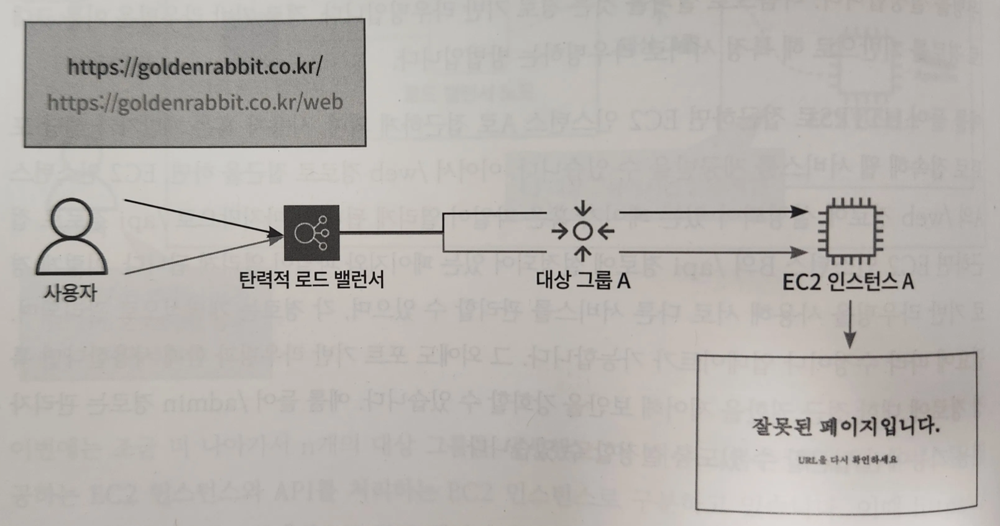
> 고정 응답 반환 규칙 : 특정 경로에 접근하고자하는 사용자에게 응답 코드와 텍스트를 반환하는 규칙

- 잘못된 URL로 접근했을 경우 혹은 웹 서버가 점검 중이면 주로 사용
- ex. 사용자가 잘못된 도메인으로 접근을 시도했을 경우 503 에러 코드와 텍스트를 반환할 수 있다.
    - 반환 텍스트 : HTML, 자바스크립트, JSON 등

## 부하 분산을 위한 로드 밸런서의 알고리즘

> 라운드 로빈 방식 (Round Robin Method) : 클라이언트로부 받은 요청을 로드밸런싱 대상 서버에 순서대로 할당받는 방식

- 첫 번째 요청은 첫 번째 서버, 두 번째 요청은 두 번째 서버에 할당
- 부하 분산할 대상 서버의 성능이 동일하고 처리 시간이 짧은 애플리케이션의 경우, 균등하게 분산이 이루어지기 때문에 주로 이 방식을 사용

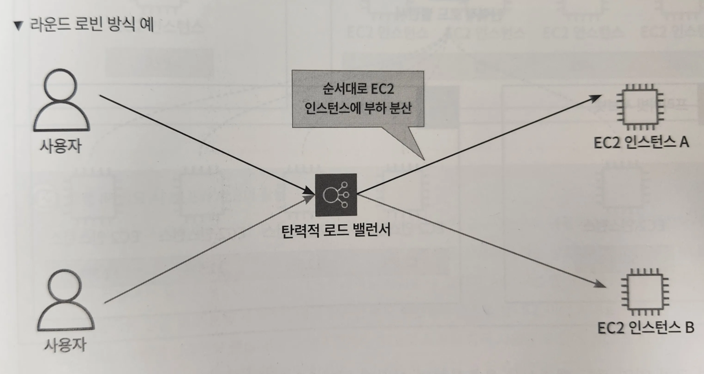
> 가중치 랜덤 (Weighted random Method) : 정상 작동하는 서버에 임의의 순서로 요청을 라우팅


- 가중치 랜덤 알고리즘은 ATW(Automatic Target Weights)를 대응하며, 이는 ALB 뒤에 있는 대상 서버의 장애, 성능 저하를 감지해 다른 서버로 자동으로 트래픽을 전달하는 기능
- 가중치 랜덤이라는 부하 분산 알고리즘과 함께 사용되어, 비정상적인 대상을 식별하고 트래픽을 삭제하고 오류가 발생하지 않은 대상에 자동으로 트래픽을 전달

> 최소 미해결 요청 (Least outstanding requests) : 연결 수가 가장 적은 서버로 라우팅한다.


- 동적인 분산 알고리즘으로 각 서버에 대한 현재 연결 수를 동적으로 카운트할 수 있고, 동적으로 변하는 요청에 대한 부하를 분산시킬 수 있다.
- 이런 로드 밸런서 알고리즘은 ALB에서 사용되며, NLB에서는 AWS 하이퍼플래인(AWS Hyperplane)이라는 AWS의 독자적인 부하 분산 기술을 사용하고 있다.
- ALB와 NLB에서 교차 영역 로드 밸런싱(Cross Zone Load Balancer)을 이용할 수 있는데, ALB는 항상 교차 영역 로드 밸런싱이 유효화되어 있는 상태로 무효화시킬 수 없다.
- NLB는 교차 영역 로드 밸런싱을 유효화할지 무효화할지 선택할 수 있다.
- 교차 영역 로드 밸런싱을 무효화한 상태라면 다음과 같이 부하 분산을 실시한다.

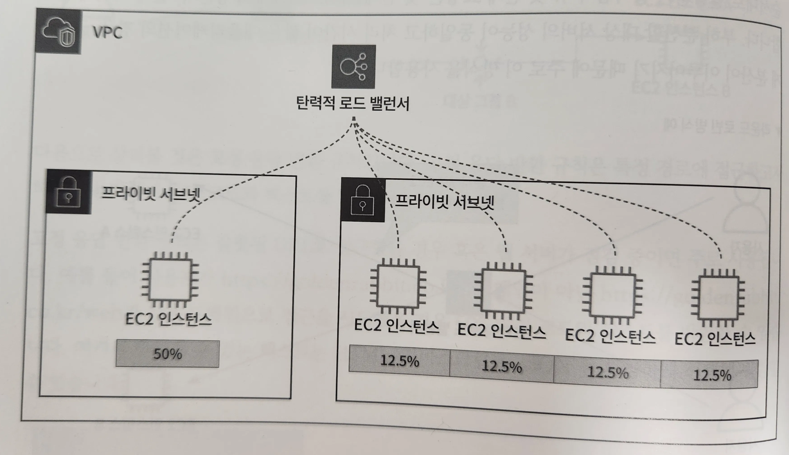
- 두 개의 가용 영역이 나누어졌다고 가정하며, 하나의 가용 영역에 생성되어 있는 EC2 인스턴스에는 50%, 또 다른 가용 영역에 생성되어 있는 EC2 인스턴스에는 각각 12.5%로 부하 분산을 실시
- 가용 영역에 따라 균등하게 부하 분산을 수행하고 있지 않다.
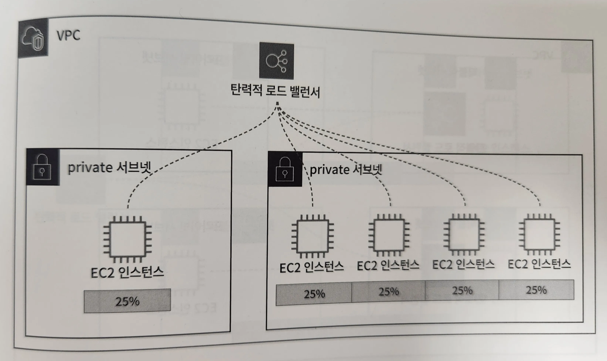

- 교차 영역 로드 밸런싱을 유효화하면 균등하게 각 각용 영역으로 부하 분산을 수행한다.

## 환경별 로드 밸런서 구성 패턴 살펴보기

- 각 환경별로 나누어서 개발을 진행할 때 로드 밸런서는 어떻게 구현하는 게 좋을까?

### 환경별로 로드 밸런서를 나누기
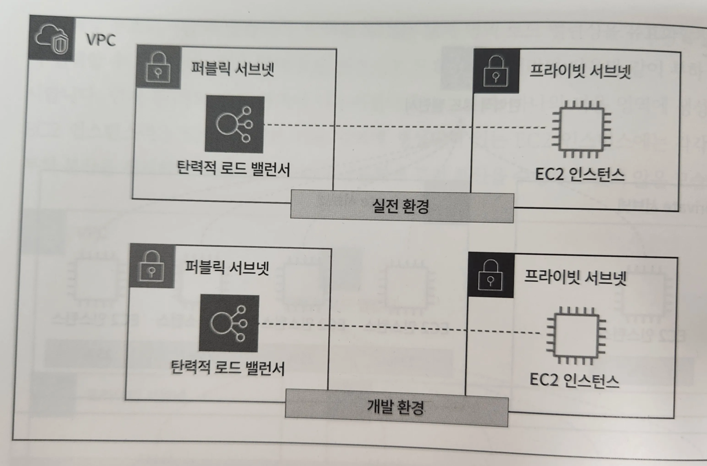

- 실전 환경과 개발 환경에 로드 밸런서를 생성했으며, 각 환경별로 로드 밸런서를 생성해 관리
- 별도의 리스너 규칙을 추가할 필요 없이 실전 환경과 개발 환경을 나누어 접속할 수 있다.
- 각 환경마다 로드 밸런서를 나눔으로써 각 환경에 발생하는 문제를 분산시킬 수 있다.
    - 개발 환경에서 발생한 문제를 실전 환경에 영향을 미치지 않도록 할 수 있다.
- 트래픽과 리소스 사용률을 분리하고 관리할 수 있다.
- 각 환경에 맞는 액세스 제어 정책을 적용할 수 있다.
- 각 환경별로 로드 밸런서를 독립적으로 확장할 수 있으며, 각 환경에 따라 성능을 조절할 수 있다.

### 하나의 로드 밸런서로 실전 환경과 개발 환경 제어하기
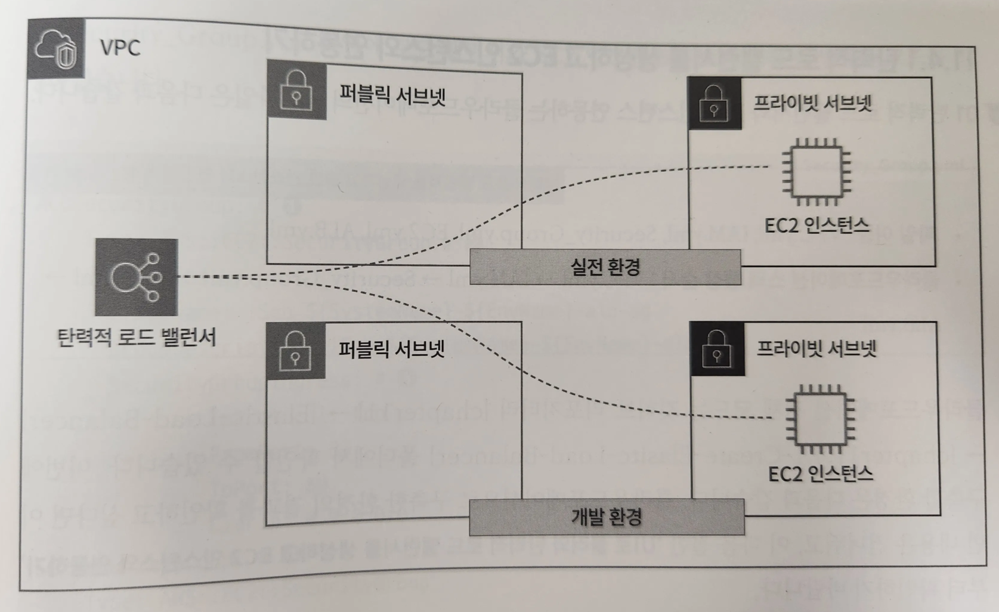

- 로드 밸런서에 장애가 발생했을 때 실전 환경과 개발 환경 모두에 영향을 미친다.
- 포트 기반 라우팅을 통해 실전 환경은 443번 포트, 개발 환경은 444번 포트와 같이 리스너 규칙을 추가해서 접근
- 경로 기반 라우팅을 사용해 개발 환경에 접속할 때는 goldenrabbit.co.kr/dev/와 같은 경로로 접속할 수 있도록 리스너 규칙 추가
- 그러나 이는 리스너 규칙을 복잡하게 만들 수 있고, 관리가 어렵다.
- 결과적으로 두 방법 모두 가능하지만 환경별로 로드 밸런서를 나누는 것이 더 이점이 있다.
- 포트 기반 라우팅과 경로 기반 라우팅은 같은 EC2 인스턴스나 같은 환경에서 여러 경로로 나누고 싶을 때 유용하다.

# 탄력적 로드 밸런서 활용하기

> 탄력적 로드 밸런서를 생성하고, EC2 인스턴스와 연동해 탄력적 로드 밸런서를 통해 EC2 인스턴스로 접속하는 과정을 진행한다.
>

## 탄력적 로드 밸런서를 생성하고 EC2 인스턴스와 연동하기

> VPC.yml → IAM.yml → Security_Group.yml → EC2.yml → ALB.yml 순서로 클라우드포메이션 스택을 생성해야 한다.
>

https://github.com/classmethodjaewook/aws-developer/tree/main/chapter11

- 퍼블릭 서브넷에 로드 밸런서를 생성하며, 대상 그룹에는 아파치가 인스톨된 EC2 인스턴스가 등록되어 있다.
- 사용자는 HTTP 80번 포트를 이용해 로드 밸런서로 접근하면 아파치 웹페이지가 출력된다.
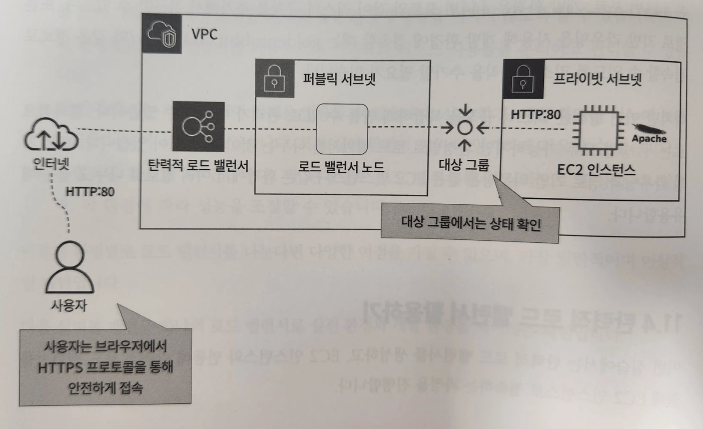

- Security_Group.yml 파일에 로드 밸런서와 EC2 인스턴스의 보안 그룹 생성하는 코드 작성

```yaml
# Security_Group.yml

  ALBSecurityGroup: # 로드 밸런서의 보안 그룹 리소스 이름 지정
    Type: AWS::EC2::SecurityGroup # 보안 그룹을 생성
    Properties:
      GroupName: !Sub ${SystemName}-${EnvName}-alb-sg # 보안 그룹 이름을 지정
      GroupDescription: !Sub ${SystemName}-${EnvName}-alb-sg # 보안 그룹 설명
      SecurityGroupIngress: # HTTP 80번 포트로 인터넷을 통해 접근할 수 있도록 설정
        - IpProtocol: tcp
          FromPort: 80
          ToPort: 80
          CidrIp: 0.0.0.0/0
      VpcId:
        Fn::ImportValue: !Sub ${EnvName}-vpc
      Tags:
        - Key: Name
          Value: !Sub ${SystemName}-${EnvName}-alb-sg
        - Key: Env
          Value: !Sub ${EnvName}
  EC2SecurityGroup: # EC2 인스턴스의 보안 그룹
    Type: AWS::EC2::SecurityGroup # 보안 그룹을 생성
    Properties:
      GroupName: !Sub ${SystemName}-${EnvName}-ec2-sg # 보안 그룹 이름을 지정
      GroupDescription: !Sub ${SystemName}-${EnvName}-ec2-sg # 보안 그룹 설명
      SecurityGroupIngress: # EC2 인스턴스에서는 로드 밸런서를 통한 접근만을 허용
        - IpProtocol: tcp
          FromPort: 80
          ToPort: 80
          SourceSecurityGroupId: !GetAtt ALBSecurityGroup.GroupId # 로드 밸런서의 보안 그룹 지정
```

- EC2.yml 파일에 아파치를 인스톨할 사용자 데이터 추가
- EC2 인스턴스에는 기존과 다르게 사용자 데이터가 삽입된다.
    - 사용자가 서버로 접속해 직접 인스톨하지 않아도, EC2 인스턴스가 생성됨과 동시에 아파치가 인스톨되도록 설정

```yaml
# EC2.yml

      UserData:
        Fn::Base64: |
          #!/bin/bash
          # Use this for your user data (script from top to bottom)
          # install httpd (Linux 2 version)
          sudo yum update -y
          sudo yum install httpd-2.4.51 -y
          sudo systemctl start httpd
          sudo systemctl enable httpd
          sudo httpd -v
          sudo cp /usr/share/httpd/noindex/index.html /var/www/html/index.html
```

- ALB.yml 파일에 로드 밸런서의 대상 그룹을 생성할 코드를 작성

```yaml
# ALB.yml

  ALBTargetGroup: # 로드 밸런서의 대상 그룹 리소스 이름 지정
    Type: AWS::ElasticLoadBalancingV2::TargetGroup # 대상 그룹을 생성할 타입 지정
    Properties:
      VpcId: # 대상 그룹이 생성될 VPC 지정
        Fn::ImportValue: !Sub ${EnvName}-vpc
      Name: !Sub ${SystemName}-${EnvName}-tgp
      Protocol: HTTP # 대상 그룹에서 사용할 포트와 프로토콜, 상태 확인 Health Check에 사용할 값들 지정
      Port: 80
      HealthCheckProtocol: HTTP
      HealthCheckPath: "/"
      HealthCheckPort: "traffic-port"
      HealthyThresholdCount: 5 # 정상 임계 값
      UnhealthyThresholdCount: 2 # 비정상 임계값
      HealthCheckTimeoutSeconds: 5 # 제한 시간
      HealthCheckIntervalSeconds: 60 # 간격
      Matcher:
        HttpCode: 200 # 성공 코드
      Tags:
        - Key: Name
          Value: !Sub ${SystemName}-${EnvName}-tgp
        - Key: Env
          Value: !Sub ${EnvName}
      Targets: # 대상 그룹에 추가할 EC2 인스턴스 지정
        - Id:
            Fn::ImportValue: !Sub ${EnvName}-ec2
          Port: 80
```

- ALB.yml 파일에 로드 밸런서를 생성할 코드 작성

```yaml
# ALB.yml

  InternetFacingALB: # 로드 밸런서의 리소스 이름 지정
    Type: AWS::ElasticLoadBalancingV2::LoadBalancer # 로드 밸런서를 생성할 타입 지정
    Properties:
      Name: !Sub ${SystemName}-${EnvName}-alb
      Tags:
        - Key: Name
          Value: !Sub ${SystemName}-${EnvName}-alb
        - Key: Env
          Value: !Sub ${EnvName}
      Scheme: "internet-facing" # Scheme는 로드 밸런서를 외부로 공개할지, 내부에서만 사용할지 선택하는 옵션 (이 코드에서는 외부에 공개)
      LoadBalancerAttributes: # 로드 밸런서의 속성값 지정
        - Key: "deletion_protection.enabled" # true로 설정하면 실수로 인한 로드 밸런서 삭제를 방지
          Value: false
        - Key: "idle_timeout.timeout_seconds" # EC2 인스턴스와 로드 밸런서의 연결 설정으로 해당 시간 동안 아무런 데이터를 보내지 않으면 연결 종료
          Value: 60
      SecurityGroups: # 로드 밸런서의 보안 그룹 지정
        - Fn::ImportValue: !Sub ${EnvName}-alb-sg
      Subnets: # 서브넷 지정
        - Fn::ImportValue: !Sub ${EnvName}-public-subnet-1a
        - Fn::ImportValue: !Sub ${EnvName}-public-subnet-1b
      Type: application # 로드 밸런서의 타입 지정
```

- ALB.yml 파일에 로드 밸런서의 리스너 규칙 추가를 위한 코드 작성

```yaml
# ALB.yml

  ALBListenerHTTP: # 로드 밸런서의 리스너 규칙 추가를 위한 리소스 이름 지정
    Type: AWS::ElasticLoadBalancingV2::Listener # 로드 밸런서의 리스너 규칙을 추가할 타입 지정
    Properties: # 접속하고자 하는 포트와 프로토콜 지정
      Port: 80
      Protocol: HTTP
      DefaultActions: # 대상 그룹 지정 
        - TargetGroupArn: !Ref ALBTargetGroup
          Type: forward # 로드 밸런서에 도착한 요청을 대상 그룹으로 전달하는 방식 지정 (forward : 로드 밸런서에서 수신한 요청을 지정된 대상 그룹으로 직접 전달)
      LoadBalancerArn: !Ref InternetFacingALB # 리스너 규칙을 추가할 로드 밸런서 지정
```

## UI로 불러와 탄력적 로드 밸런서를 생성하고 EC2 인스턴스와 연동하기

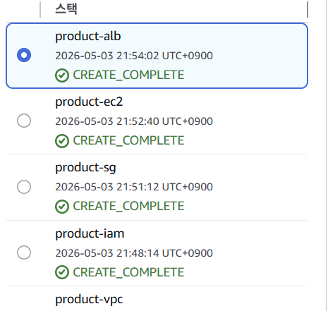
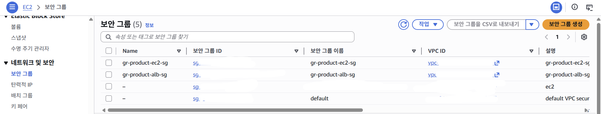
- EC2 콘솔 화면에서 [보안 그룹] 카테고리를 확인하면 EC2 인스턴스와 로드 밸런서의 보안 그룹을 확인할 수 있으며, 로드 밸러서의 경우 HTTP 80번 포트를 통해 누구나 접속할 수 있게 설정되어 있다.

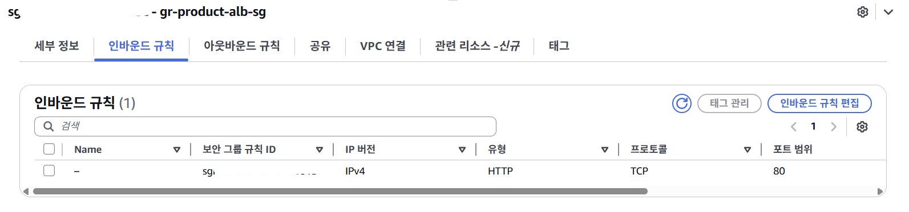


- EC2 인스턴스의 보안 그룹은 로드 밸런서와 동일하게 HTTP 80번 포트가 설정되어 있지만, 소스에는 로드 밸런서의 보안 그룹만을 허용한다.
- 이런 설정으로 사용자는 외부에서 EC2 인스턴스로 직접 접근은 할 수 없다.

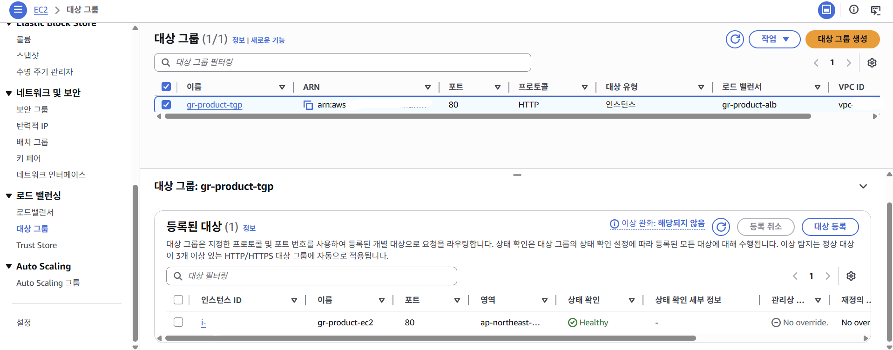

- EC2 콘솔 화면에서 [대상 그룹] 카테고리를 통해 생성한 대상 그룹을 확인할 수 있다.
- 등록된 대상을 확인하면, EC2 인스턴스가 등록되어 있으며 상태 확인에서 상태 확인에 성공했는지, 실패했는지 확인할 수 있다.
    - 성공 : Healthy, 실패 : Unhealthy

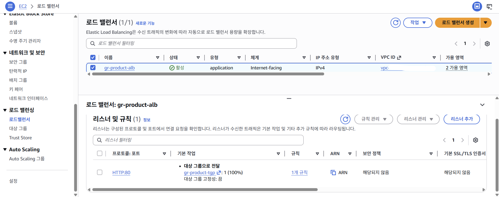

- EC2 콘솔 화면에서 [로드 밸런서] 카테고리를 통해 생성한 로드 밸런서를 확인할 수 있다.
- 리스너 및 규칙 탭을 클릭하면 해당 로드 밸런서의 리스너 규칙을 확인할 수 있다.

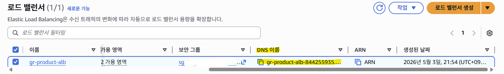
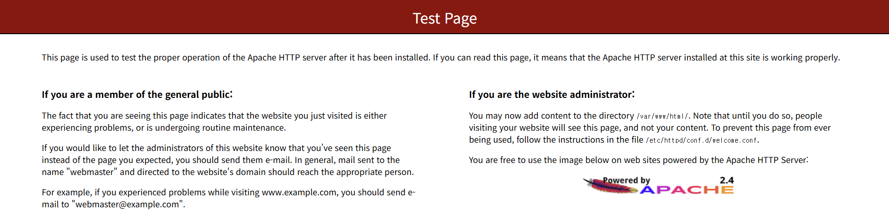

- 로드 밸런서를 통해 웹 서버로 접근한다.
- 로드 밸런서의 DNS 이름을 복사하여 브라우저에 입력하면 아파치 페이지가 표시된다.
- EC2 인스턴스에 설정해놓은 아파치 테스트 페이지인 index.html이 화면에 표시되는 것으로 로드 밸런서를 통해 성공적으로 웹 서버에 접근했음을 확인