# 클라우드 서버 최적화, 아마존 EC2 오토스케일링이란?

> 오토 스케일링 : 스케일업(scale up)과 스케일아웃(scale out) 그리고 스케일인(scale in)을 구현하는 데 사용된다.


> 오토스케일링은 EC2 인스턴스와 함께 사용되며, 스케일업과 스케일아웃, 스케일인을 조절해 클라우드 서버를 최적화하는 데 사용된다.
>
- 스케일업 : 서버의 성능을 향상시킬 목적으로 기존 EC2 인스턴스의 사양을 업그레이드
    - CPU, 메모리, 디스크 용량 등의 리소스를 늘리는 것
- 스케일아웃 : 시스템의 성능을 향상시킬 목적으로 같은 사양의 추가 서버를 추가하는 것
    - 시스템에 대한 부하를 분산시키고 가용성을 향상시킨다.
- 스케일아웃 목적으로 생성된 서버가 더는 필요 없다면 스케일인을 수행해 서버를 삭제할 수 있다.

## AWS 오토스케일링 vs 아마존 EC2 오토스케일링

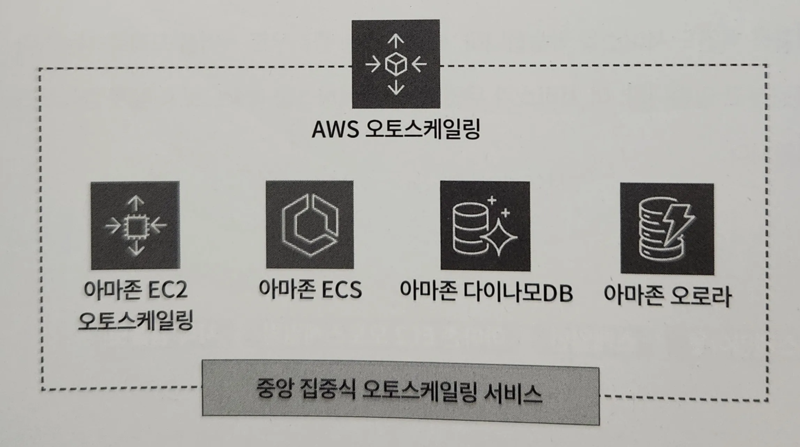
- AWS 오토스케일링 : 아마존 EC2 오토스케일링을 포함해 아마존 ECS, 아마존 다이나모DB, 아마존 오로라와 같은 다양한 서비스에 대한 스케일링 작업을 수행
- 다양한 AWS 서비스에 대한 오토 스케일링을 중앙 집중식으로 관리하고 통합할 수 있다.
- 애플리케이션 및 서비스 전반에 걸친 일관된 스케일링 전략을 구현할 수 있고, 복잡성을 줄이고 운영을 간소화할 수 있다.

# 클라우드 서버 최적화 서비스, 아마존 EC2 오토스케일링 살펴보기

- 아마존 EC2 오토스케일링은 오토스케일링 그룹을 생성해 EC2 인스턴스에 대한 스케일업과 스케일아웃, 스케일인을 구현할 수 있다.
- 오토스케일링 그룹을 생성하려면 기본적인 EC2 인스턴스의 구성(인스턴스 유형, 보안 그룹, AMI 등)을 설정할 필요가 있다.
- 시작 템플릿(Launch Template) : EC2 인스턴스의 구성을 설정할 때 사용

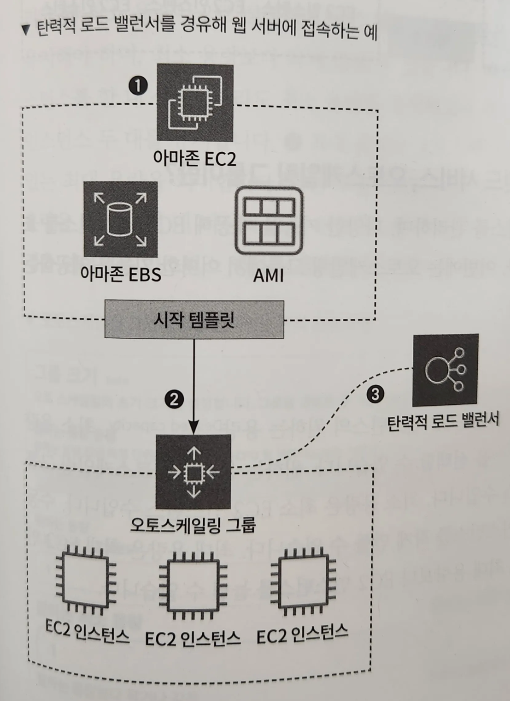
1. 시작 템플릿에서 EC2 인스턴스를 구성하는 설정을 적용
    1. EC2 인스턴스를 생성했을 때와 동일하게 AMI, 인스턴스 유형, EBS 볼륨, 네트워크 설정과 같은 값들 입력
    2. 설정된 값들 바탕으로 시작 템플릿 생성
2. 이를 바탕으로 오토 스케일링 그룹을 생성하면 시작 템플릿에 설정한 값과 같은 설정값을 가진 EC2 인스턴스가 생성된다.
3. 오토스케일링 그룹은 탄력적 로드 밸런서와 함께 사용될 수 있다.

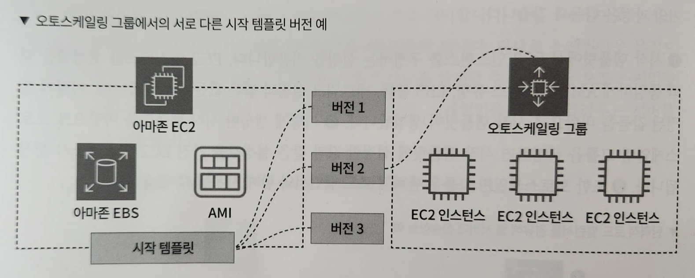
- EC2 인스턴스는 오토스케일링 그룹에 속하며 오토스케일링 그룹을 통해 EC2 인스턴스들을 관리할 수 있다.
- 시작 템플릿은 복수의 버전을 만들어 관리 가능
- 서로 다른 설정을 가진 시작 템플릿의 버전을 생성하고, 상황에 맞추어 오토스케일링 그룹에 적용 가능
- 다양한 시작 템플릿 버전을 통해 스케일업으로 서버 인스턴스의 스펙을 업그레이드할 수 있으며, 생성되는 EC2 인스턴스에 다양한 설정 적용 가능

## 클라우드 서버 최적화 백엔드 서비스, 오토스케일링 그룹이란?

> 오토스케일링 그룹에서는 EC2 인스턴스를 관리하며, 다양한 기능을 제공해 EC2 인스턴스를 효율적으로 관리하고 운영할 수 있다.
>

### 오토스케일링 그룹 크기

> 생성하고자 하는 EC2 인스턴스의 원하는 용량(Desired capacity), 최소 용량(Minimum capacity), 최대 용량(Maximum capacity)을 선택할 수 있다.
>
- 원하는 용량 : 오토스케일링 그룹을 만들 때 생성할 초기 EC2 인스턴스 수
- 최소 용량 : 최소 EC2 인스턴스 수
    - 수동 또는 자동으로 최소 용량 보다 EC2 인스턴스를 작게 만들 수 없다.
- 최대 용량 : 최대 EC2 인스턴스 수
    - 수동 또는 자동으로 최대 용량 보다 EC2 인스턴스를 늘릴 수 없다.
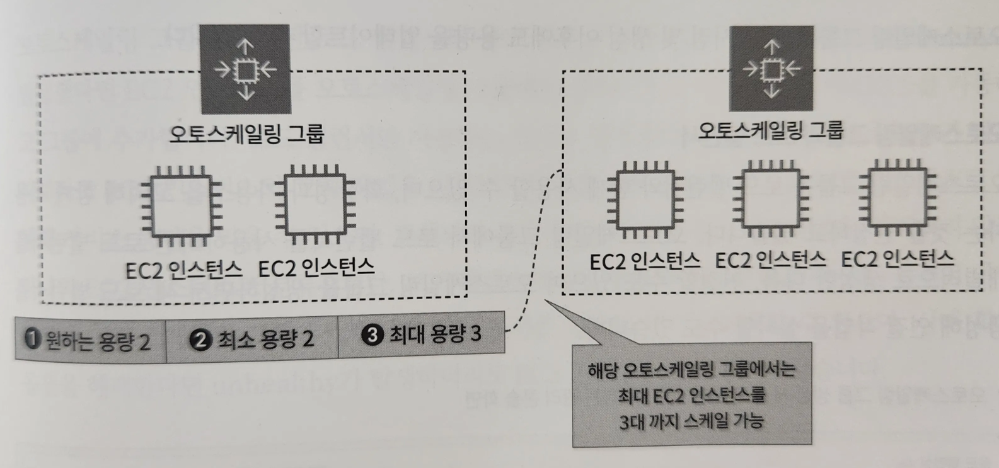

- ex. 원하는 용량 2, 최소 용량 2, 최대 용량 3으로 설정
1. 원하는 용량이 2로 설정되어 있으므로 오토스케일링 그룹이 생성될 때 2대의 EC2 인스턴스가 생성된다.
2. 최소 용량이 2로 설정되어 있기 때문에 이 그룹은 반드시 두 대 이상의 EC2 인스턴스를 유지해야 하며, 최소 용량보다 작게 만들 수 없다.
    1. 오토스케일링 그룹에 속한 EC2 인스턴스를 한 대 삭제하더라도 최소 용량을 유지하고자 새로운 EC2 인스턴스를 생성해 항상 EC2 인스턴스 두 대를 유지
3. 최대 용량은 오토스케일링 그룹에서 EC2 인스턴스를 생성할 수 있는 최대 용량
    1. 최대 용량을 초과해 세 대 이상의 EC2 인스턴스를 생성할 수 없다.

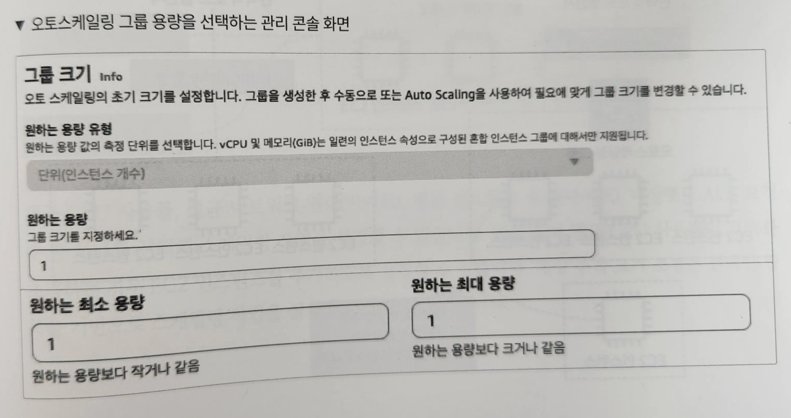
- 오토스케일링 그룹은 생성 시점 및 생성 이후에도 용량을 업데이트할 수 있다.

### 오토스케일링 그룹과 로드 밸런서

- 오토스케일링 그룹은 로드 밸런서와 함께 사용할 수 있으며, 확장성과 가용성을 고려해 함께 사용하는 것을 권장
- 로드 밸런서를 개별적으로 생성한 다음 연결할 수도 있고, 오토스케일링 그룹을 생성하면서 새 로드 밸런서를 생성해 연결 작업을 실시할 수도 있다.

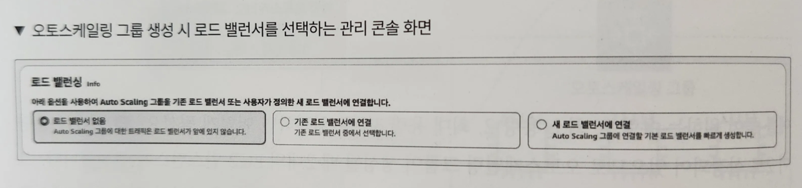
- 오토스케일링 그룹과 연결된 로드 밸런서는 별도로 [탄력적 로드 밸런서 상태 확인 켜기] 기능을 제공한다.

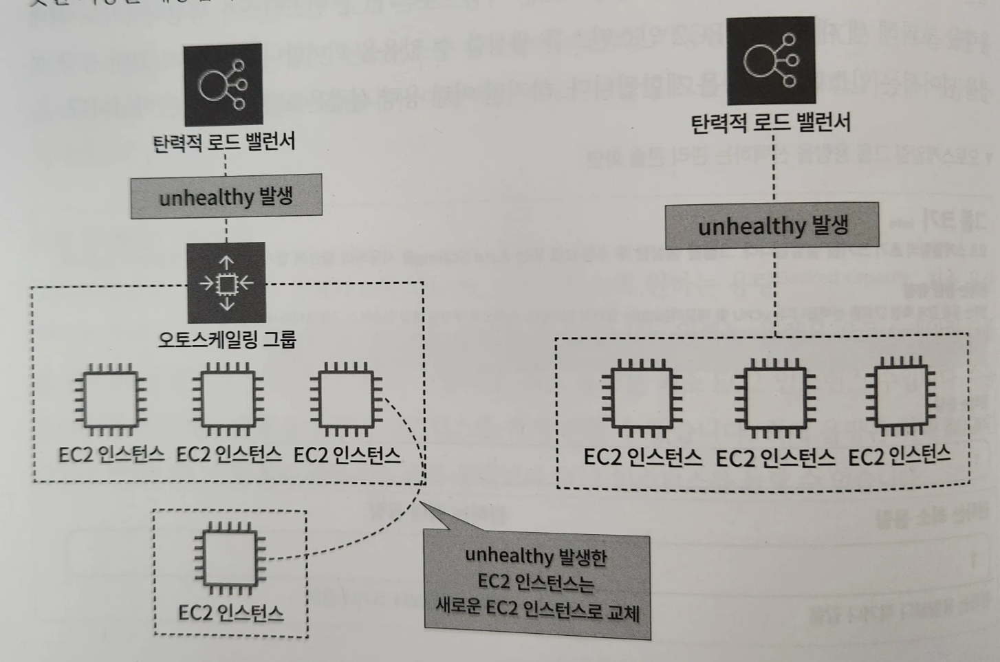
- 로드 밸런서는 상태 확인을 통해 EC2 인스턴스에서 unhealthy가 발생했다면 EC2 인스턴스를 오토스케일링 그룹에서 제외시키고 새로운 EC2 인스턴스를 가동하고 그룹에 추가한다.
- 로드 밸런서만 사용하는 경우는 상태 확인에 실패하고 unhealthy가 발생하더라도 EC2 인스턴스의 교체 작업은 이루어지지 않는다.
- 새로운 EC2 인스턴스로 교체해 서비스 중단을 막을 수 있으며, 교체되어 그룹에서 빠져나온 EC2 인스턴스는 삭제되지 않고 하나의 EC2 인스턴스로 분류된다.
- 로드 밸런서에서의 상태 확인은 선택할 수 있는 옵션이 아니었으나, 오토스케일링 그룹에서의 상태 확인 옵션은 사용자 임의로 선택할 수 있으며, 상태 확인 옵션을 해제한다면 unhealthy가 발생하더라도 EC2 인스턴스를 교체하지 않는다.

### 오토스케일링 그룹 스케일 정책

- 오토스케일링 그룹에서는 사용자가 용량을 편집해 수동으로 EC2 인스턴스를 스케일할 수 있지만, 별도로 정책을 통해 자동으로 스케일할 수도 있다.

#### 동적 크기 조정 정책
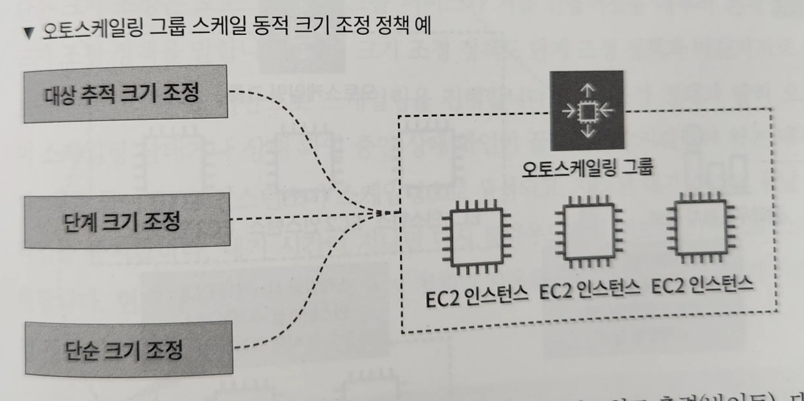

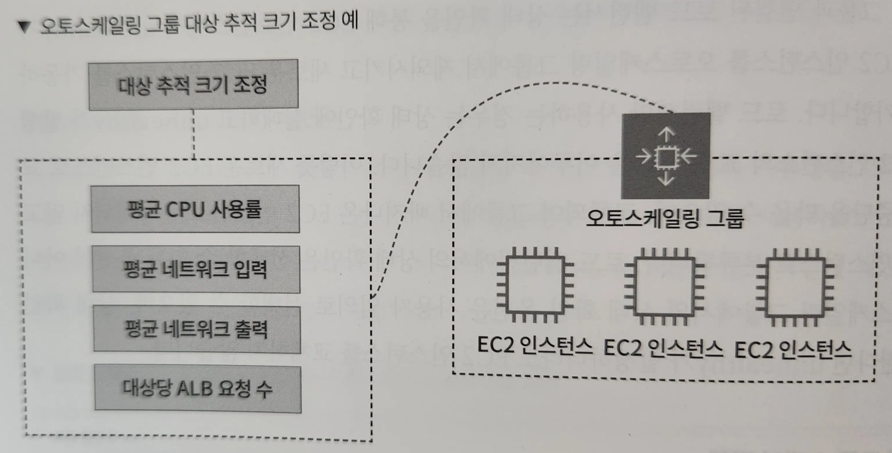
- 대상 추적 크기 조정 : 선택한 지표 유형을 기반으로 오토 스케일링 작업 수행
    - 선택한 항목을 기반으로 스케일링 작업을 실시할 수 있도록 도와준다.
- 평균 CPU 사용률, 평균 네트워크 입력(바이트), 평균 네트워크 출력(바이트), 대상별로 ALB 요청 수 중 하나를 선택해 스케일링 작업을 설정
- ex. 평균 CPU 사용률이 70%를 초과하는 경우 EC2 인스턴스를 추가하도록 설정

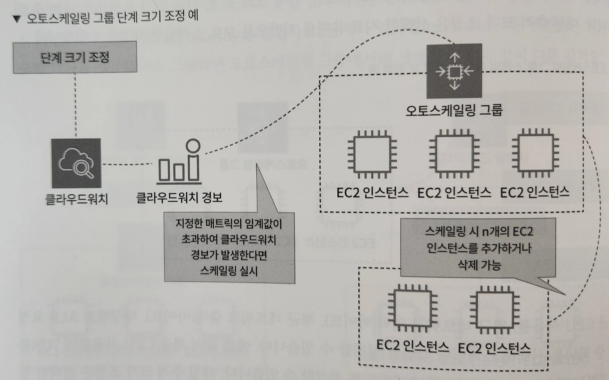
- 단계 크기 조정 : 클라우드워치 경보를 기반으로 스케일링 작업을 실행
- 클라우드워치 경보 : 특정 지표(ex. CPU 사용률, 메모리 사용량 등)을 모니터링해 지정된 임곗값을 초과하면 사용자에게 경고를 보내는 서비스
- ex. CPU 사용률이 70%를 초과하는 경우 EC2 인스턴스를 추가하거나 삭제하고, 추가 또는 삭제할 EC2 인스턴스 수를 설정할 수 있다.

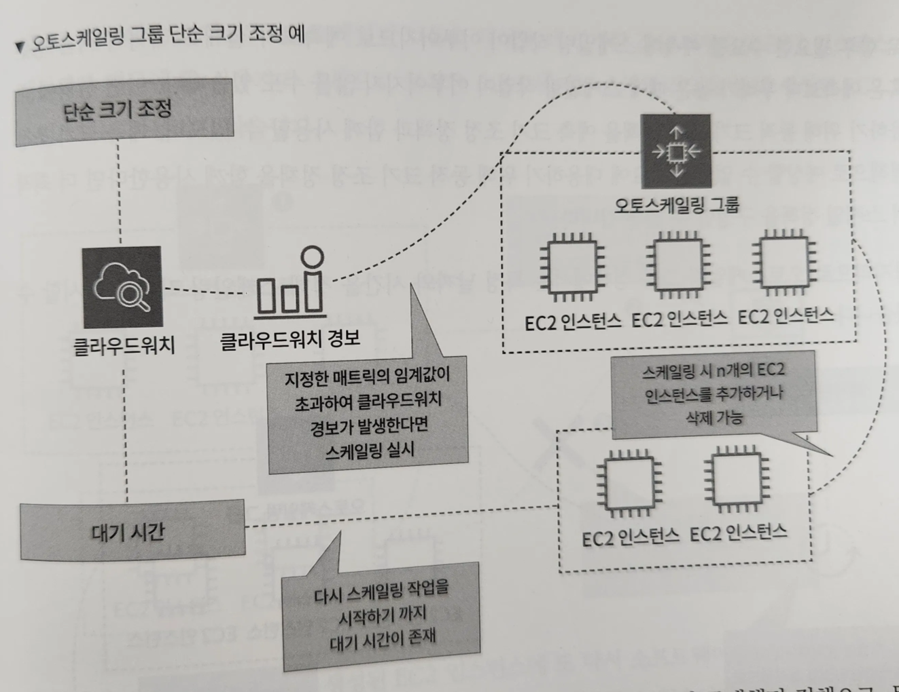
- 단순 크기 조정 : 동적 크기 조정 정책을 말한다. 클라우드워치 경보(CloudWatch Alarm)를 기반으로 스케일링을 진행한다.
- 단계 조정 정책과 달리 오토스케일링 그룹이 스케일링 상태거나 상태 확인 중인 상태 확인이 끝나기까지 기다려야 하는 대기 시간이 있다.
- ex. EC2 인스턴스가 스케일링으로 생성되고, 지정된 대기 시간이 끝날 때까지 스케일링 작업을 중지
- 대기 시간이 지나면 다시 클라우드워치 경보를 기반으로 스케일링 작업 진행
- 현재는 이런 단순 크기 조정 정책의 사용을 권장X → 대기 시간이 없는 단계 조정 정책 권장

#### 예측 크기 조정 정책

> 머신러닝을 사용해 클라우드워치의 24시간 기록 데이터를 기반으로 향후 필요한 수요를 미리 예측
>
- 특정 요일 혹은 시간에 트래픽이 증가하는 때에 적합한 정책
- 예측보다 실제 트래픽이 적은 경우 혹은 예측보다 부하가 높은 때에 스케일링 작업이 이루어지지 않을 수도 있다.
- 이에 대비하기 위해 동적 크기 조정 정책을 예측 크기 조정 정책과 함께 사용할 수 있으며, 예측 크기 조정 정책으로 예상할 수 없었던 수요에 대응하기 위해 동적 크기 조정 정책을 함께 사용한다면 더 최적의 스케일 정책을 구성할 수 있다.
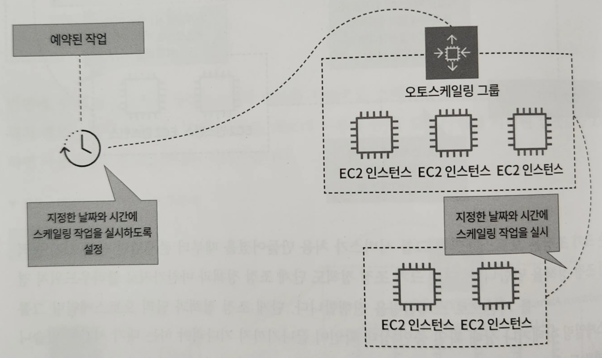

- 오토스케일링 그룹 정책에서는 특정 날짜와 시간을 정해 스케일링 작업을 실시할 수 있다.
- 예약된 작업 : 지정한 날짜와 시간에 스케일링 작업을 실시하기 때문에 급격하게 트래픽이 증가하는 시간대를 알고 있는 경우 유용하게 사용할 수 있다.
- 반복 작업도 가능하기 때문에 작업을 정기적으로 반복 설정 가능

### 오토스케일링 그룹과 AMI

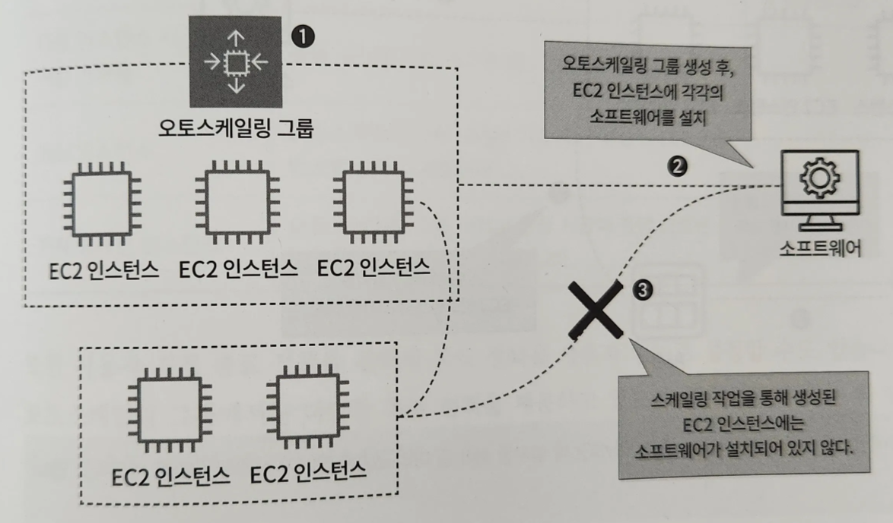
1. 오토스케일링 그룹을 통해서 EC2 인스턴스 생성
2. 각 EC2 인스턴스에 필요한 소프트웨어 설치
- 이 상황에서 스케일 작업을 통해 EC2 인스턴스가 생성되었다면, 생성된 EC2 인스턴스에도 소프트웨어가 설치된 상태로 생성되는 걸까?
- 오토스케일링 그룹을 생성할 때 설정한 값을 바탕으로 EC2 인스턴스가 생성되기 때문에
1. 사용자가 수동으로 설치한 소프트웨어는 스케일 작업을 통해 생성된 EC2 인스턴스에는 적용X

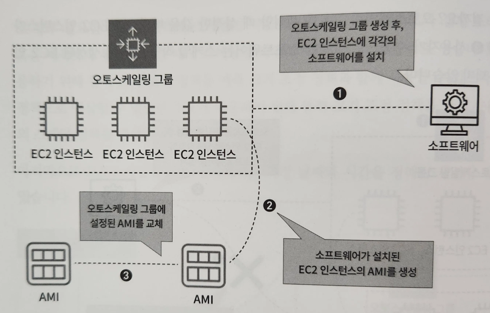
- 스케일 작업을 통해 생성된 EC2 인스턴스에 또 다시 소프트웨어를 설치해야 하는가?

→ AMI를 교체하는 것으로 해결

1. 오토스케일링 그룹으로 생성된 EC2 인스턴스에 소프트웨어 설치
2. 그 상태에서 이 EC2 인스턴스의 AMI 생성
    1. AMI에는 설치한 소프트웨어 및 사용자가 설정한 값들이 포함
    2. 이런 AMI를 기반으로 새로운 EC2 인스턴스를 생성하면 이전 EC2 인스턴스와 같은 구성과 소프트웨어 환경을 가진 인스턴스가 생성된다.
3. 이 점을 활용해 기존 오토스케일링 그룹의 AMI와 교체 작업을 실시한다면 새로 생성되는 EC2 인스턴스는 소프트웨어 및 사용자가 설정한 값들이 포함된 EC2 인스턴스가 생성될 것
- AWS에서는 워드프레스가 설치된 AMI, MySQL이 설치된 AMI 등 미리 소프트웨어가 설치된 AMI를 배포하고 있다.

### 오토스케일링 그룹 종료 정책

| 종료 정책 | 작업 | 비고 |
| --- | --- | --- |
| 기본값 | 순서대로 조건에 일치하는 EC2 인스턴스를 찾아내는 종료 정책입니다. 먼저 가용 영역 내에서 종료 방지 기능이 설정되지 않은 EC2 인스턴스를 찾아 삭제합니다. 혹은 가장 오래된 시작 템플릿이 있는 인스턴스를 찾아 삭제합니다. 이런 조건에 해당하는 EC2 인스턴스가 여러 대 존재할 경우 결제 시간이 가장 가까운 EC2 인스턴스를 찾아 삭제합니다. |  |
| 할당 전략 | 인스턴스의 유형(스팟 인스턴스 혹은 온디맨드 인스턴스)의 배포 전략에 맞추는 종료 정책입니다. |  |
| 가장 오래된 시작 템플릿 | 가장 오래된 시작 템플릿을 사용하는 EC2 인스턴스를 삭제합니다. |  |
| 가장 오래된 시작 구성 | 가장 오래된 시작 설정을 가진 EC2 인스턴스를 삭제합니다. | 오래된 시작 설정이란 오래된 버전의 AMI, 인스턴스 유형, 보안 그룹 등이 이 시작 구성에 포함됩니다. |
| 다음 인스턴스 시간과 가장 가까움 | 결제 시간에 가장 가까운 EC2 인스턴스를 삭제합니다. |  |
| 최신 인스턴스 | 오토스케일링 그룹 내에서 가장 최근 생성된 EC2 인스턴스를 찾아 삭제합니다. |  |
| 가장 오래된 인스턴스 | 오토스케일링 그룹 내에서 생성 시간이 가장 오래된 EC2 인스턴스를 찾아 삭제합니다. |  |
- 사용자 지정 종료 정책을 선택해 종료 정책을 사용자 임의로 설정할 수도 있다.
- 오토스케일링 그룹에서는 다양한 종료 정책을 제공하고 있으며, 구성하고자 하는 환경에 맞추어 종료 정책을 선택해야 한다.

# 아마존 EC2 오토스케일링 생성해보기

## 오토스케일링 그룹 생성해보기

> VPC.yml → IAM.yml → Security_Group.yml → Auto_Scaling_Group.yml 순서로 클라우드포메이션 스택을 생성해야 한다.
>

https://github.com/classmethodjaewook/aws-developer/tree/main/chapter12

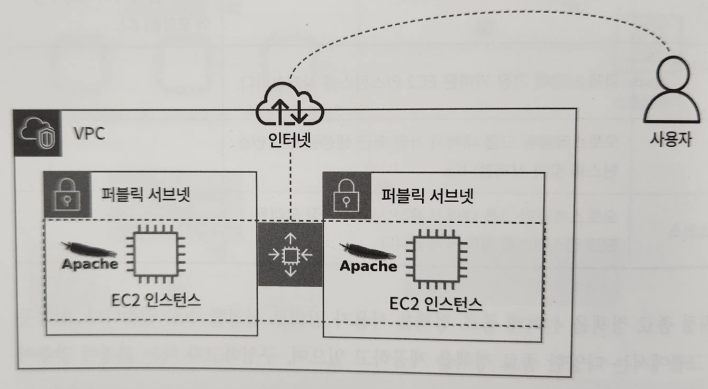
- 먼저 퍼블릭 서브넷에 EC2 인스턴스가 생성되도록 오토스케일링 그룹을 생성
- 각 EC2 인스턴스에는 아파치가 설치되어 있어 사용자는 해당 EC2 인스턴스로 접속하면 아파치 웹페이지가 표시된다.
- Security_Group.yml 파일에 EC2 인스턴스의 보안 그룹 생성

```yaml
# Security_Group.yml

  EC2SecurityGroup:
    Type: AWS::EC2::SecurityGroup # 보안 그룹을 생성
    Properties:
      GroupName: !Sub ${SystemName}-${EnvName}-ec2-sg # 보안 그룹 이름을 지정
      GroupDescription: !Sub ${SystemName}-${EnvName}-ec2-sg # 보안 그룹 설명
      SecurityGroupIngress: # 아파치가 설치된 EC2 인스턴스에 접속해 아파치 웹페이지가 출력되었는지 확인할 목적으로 HTTP 80번 포트를 열어둔다.
        - IpProtocol: tcp
          FromPort: 80
          ToPort: 80
          CidrIp: 0.0.0.0/0
```

- IAM.yml 파일에 IAM의 Arn을 내보내는 코드 작성
    - Arn(Amazon Resource Name) : 리소스의 이름을 의미하며 해당 리소스의 고유 식별자

```yaml
# IAM.yml

Outputs:
  # IAM Profile
  InstanceProfile: # 내보낸 EC2InstanceProfile을 EC2 인스턴스에 적용
    Value: !Ref EC2InstanceProfile
    Export:
      Name: !Sub ${EnvName}-ec2-role
  InstanceProfileArn: # EC2InstanceProfile의 Arn을 적용
    Value: !GetAtt EC2InstanceProfile.Arn
    Export:
      Name: !Sub ${EnvName}-ec2-role-arn
```

- Auto_Scaling_Group.yml 파일에 오토스케일링 그룹을 생성하는 데 사용할 파라미터 정의

```yaml
# Auto_Scaling_Group.yml

Parameters:
  SystemName:
    Description: "System name of each resource names."
    Type: String
    Default: "gr"
  EnvName:
    Description: "Environment name of each resource names."
    Type: String
    Default: "product"
  KeyPairName: # 생성한 EC2 인스턴스에 사용할 키 페어 이름 지정
    Description: gr-product-ec2 EC2 Key Pair
    Type: String
    Default: gr-product-ec2-key
  EC2AMI: # EC2 인스턴스의 AMI 지정
    Description: gr-product-ec2 EC2 AMI
    Type: String
    Default: ami-02d081c743d676996
  InstanceType: # EC2 인스턴스 유형을 지정
    Description: gr-product-ec2 EC2 instance type
    Type: String
    Default: t3.micro
```

- Auto_Scaling_Group.yml 파일에 EC2 인스턴스에서 사용할 키 페어를 생성

```yaml
# Auto_Scaling_Group.yml

  NewKeyPair:
    Type: AWS::EC2::KeyPair
    Properties:
      KeyName: !Ref KeyPairName # 키 페어 이름은 파라미터에서 정의한 이름으로 지정
```

- Auto_Scaling_Group.yml 파일에 EC2 인스턴스를 생성하는 데 사용할 시작 템플릿 구성

```yaml
# Auto_Scaling_Group.yml

  WebLaunchTemplate:
    Type: AWS::EC2::LaunchTemplate # 타입 입력하여 시작 템플릿 생성
    Properties: # 시작 템플릿의 속성에는 EC2 인스턴스에서 사용할 IAM 역할, 볼륨 크기, 네트워크, 보안 그룹과 같은 설정을 다룬다.
      LaunchTemplateName: !Sub ${SystemName}-${EnvName}-AppLaunchConfiguration
      LaunchTemplateData:
        IamInstanceProfile:
          Arn:
            Fn::ImportValue: !Sub ${EnvName}-ec2-role-arn
        BlockDeviceMappings:
          - DeviceName: /dev/sda1
            Ebs:
              VolumeType: gp3
              VolumeSize: 100
              DeleteOnTermination: true
              Encrypted: true
        NetworkInterfaces:
          - AssociatePublicIpAddress: true
            DeviceIndex: 0
            Groups:
              - Fn::ImportValue: !Sub ${EnvName}-ec2-sg
        ImageId: !Ref EC2AMI
        InstanceType: !Ref InstanceType
        KeyName: !Ref KeyPairName
```

- Auto_Scaling_Group.yml 파일에 EC2 인스턴스의 사용자 데이터를 사용해 아파치 서버를 설치
    - 사용자 데이터를 설치함으로써 앞으로 스케일 작업에 의해 EC2 인스턴스가 생성될 때 아파치가 설치된 EC2 인스턴스가 생성될 것이다.

```yaml
# Auto_Scaling_Group.yml

UserData: !Base64 |
          #!/bin/bash
          # Use this for your user data (script from top to bottom)
          # install httpd (Linux 2 version)
          sudo yum update -y
          sudo yum install httpd-2.4.51 -y
          sudo systemctl start httpd
          sudo systemctl enable httpd
          sudo httpd -v
          sudo cp /usr/share/httpd/noindex/index.html /var/www/html/index.html
```

- Auto_Scaling_Group.yml 파일에 오토스케일링 그룹을 생성하는 코드를 작성

```yaml
# Auto_Scaling_Group.yml

  WebAutoScalingGroup:
    Type: AWS::AutoScaling::AutoScalingGroup # 오토스케일링 그룹을 생성할 타입 지정
    Properties:
      AutoScalingGroupName: !Sub ${SystemName}-${EnvName}-asg # 오토스케일링 그룹의 이름 지정
      LaunchTemplate: # 오토스케일링 그룹에서 사용할 시작 템플릿 지정 / 최신 버전의 시작 템플릿 사용
        LaunchTemplateId: !Ref WebLaunchTemplate
        Version: !GetAtt WebLaunchTemplate.LatestVersionNumber
      MetricsCollection: # 오토스케일링 그룹에서 집계된 데이터를 클라우드워치로 보낼 설정값 지정
        - Granularity: 1Minute # 클라우드워치로 보낼 빈도 설정 (여기서는 1분 간격)
          Metrics: # 어떠한 데이터를 집계해보낼지 설정
            - GroupMinSize # 오토스케일링 그룹의 최소 용량
            - GroupMaxSize # 최대 용량
      HealthCheckType : EC2 # 상태 확인을 진행할 서비스 선택, 상태 확인에는 기본적으로 EC2 인스턴스를 선택할 수 있지만, 로드 밸런서가 있다면 로드 밸런서를 선택할 수도 있다.
      MaxSize: '3' # 오토스케일링 그룹에 의해 생성될 EC2 인스턴스의 용량 설정
      MinSize: '2'
      DesiredCapacity: '2'
      HealthCheckGracePeriod : '300'
      VPCZoneIdentifier: # EC2 인스턴스가 생성될 서브넷 지정
        - "Fn::ImportValue": !Sub ${EnvName}-public-subnet-1a
        - "Fn::ImportValue": !Sub ${EnvName}-public-subnet-1b
      Tags: # 생성된 EC2 인스턴스에 추가할 태그 지정
        - Key: Name
          Value: !Sub ${SystemName}-${EnvName}-ec2
          PropagateAtLaunch: true
        - Key: Env
          Value: !Sub ${EnvName}
          PropagateAtLaunch: true
```

## UI로 불러와 오토스케일링 그룹 생성하기

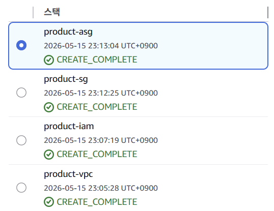
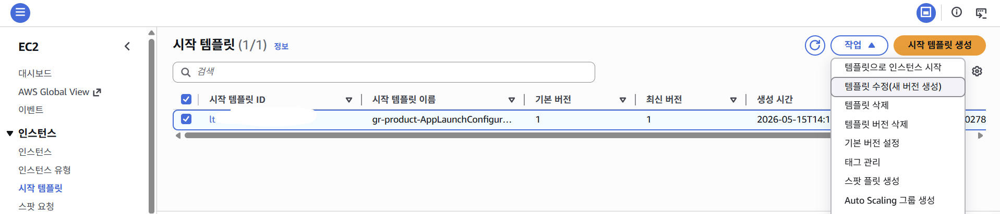
- EC2 콘솔 화면에서 [시작 템플릿] 카테고리를 선택하면 생성된 시작 템플릿 확인 가능
- 작업 메뉴에서 해당 템플릿의 새로운 버전을 생성하는 등 여러 작업 수행 가능

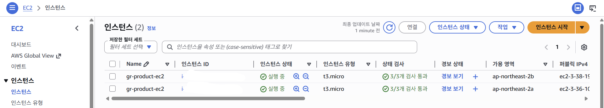
- [인스턴스] 카테고리에서 두 대의 EC2 인스턴스가 생성된 것을 확인
    - ap-northeast-2a, ap-northeast-2b에 생성

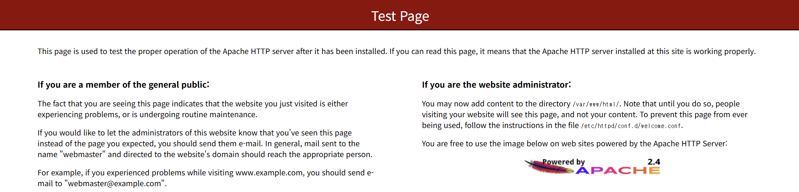
- EC2 인스턴스의 퍼블릭 DNS 혹은 퍼블릭 IP를 브라우저에 입력하면 아파치 페이지가 표시된다.

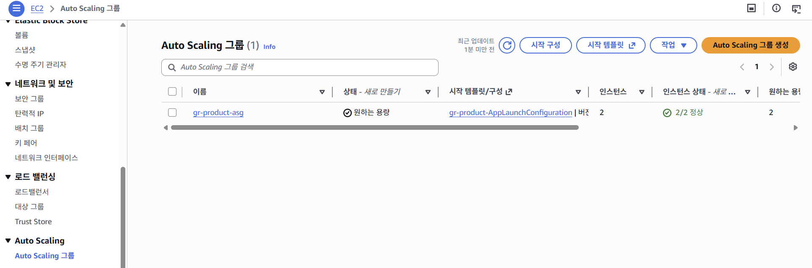
- [Auto Scaling 그룹]을 선택하면 생성된 오토스케일링 그룹을 확인할 수 있다.
- 이 오토스케일링 그룹에 설정된 시작 템플릿과 버전, 생성된 인스턴스와 용량, 가용 영역 등을 확인

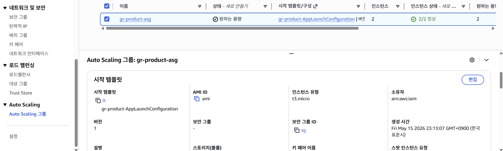
- 오토스케일링 그룹을 클릭하면 [세부 정보]를 포함해 생성된 EC2 인스턴스의 정보나 그룹 정책과 같은 정보를 확인할 수 있다.
- [편집]을 클릭하여 그룹 정책을 생성하거나 시작 템플릿의 버전을 변경하거나 생성하고자 하는 EC2 인스턴스의 용량을 변경하는 등 다양한 작업 가능

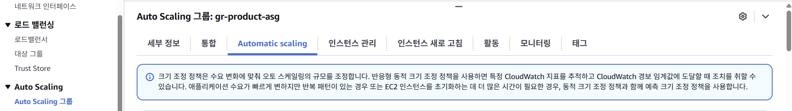

- 스케일 작업을 테스트하기 위해서 [Automatic scaling] 카테고리에서 [예약된 작업 생성]을 클릭

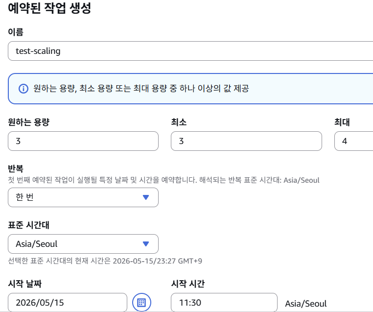
- 오토스케일링 그룹의 예약된 작업을 설정
- 현재 오토스케일링 그룹에 설정되어 있는 용량은 원하는 용량 2, 최소 용량 2, 최대 용량 3으로 설정되어 있기 때문에 이 설정값을 예약된 작업에도 동일하게 설정하면 스케일링 작업이 실시되지 않는다.
- EC2 인스턴스를 한 대 추가하려면 최소 용량을 늘릴 필요가 있으므로 최소 용량을 2에서 3으로 늘려준다.

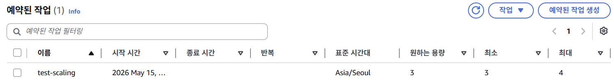
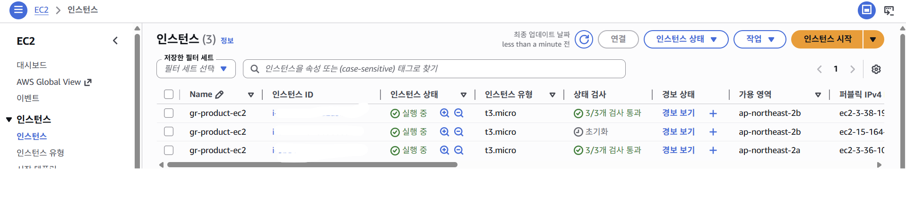
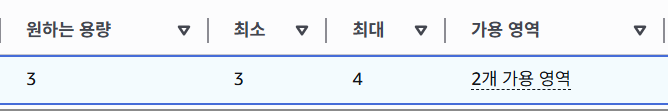
- 예약된 작업을 통한 EC2 인스턴스 스케일을 실시한다.
- 지정한 시간이 되면 스케일 작업을 실시하며 EC2 인스턴스가 한 대 추가된 것을 확인할 수 있다.
- 오토스케일링 그룹을 확인하면 용량이 변경된 것을 확인
- 트래픽이 증가하는 시간대를 알고 있다면 예약된 작업을 사용해 EC2 인스턴스 대수를 추가
- 해당 시간대 이후에는 원래의 용량으로 되돌리는 예약 작업을 통해 유연하게 사용자에게 서비스를 제공할 수 있다.