# 컨테이너 서비스, 아마존 ECS란?

> 아마존 ECS(Elastic Container Service) : AWS에서 도커 컨테이너를 배포하고 운영, 관리하는 완전 관리형 컨테이너 서비스


> 도커 : 환경 불일치(Environment Disparity)를 해결하는 오픈 소스 프로젝트
>

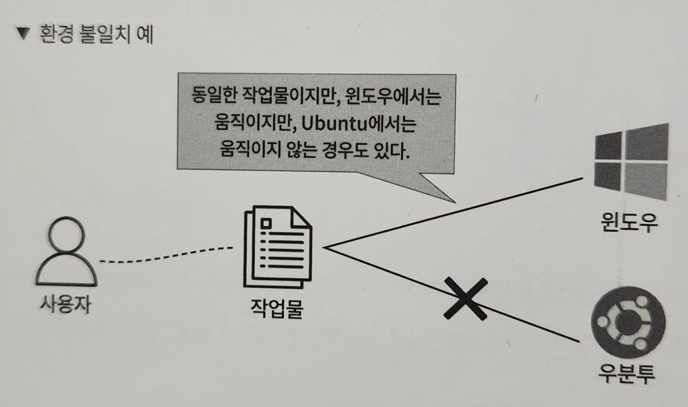
- ex. 환경 불일치 : 윈도우에서는 정상적으로 동작하지만 우분투 혹은 그 외 OS에서는 동작하지 않는 경우도 있다.
- 도커는 다른 컴퓨터에서도 같은 개발 환경을 구성할 수 있으며 이를 통해 환경 불일치를 해결
    - 도커파일(Dockerfile) 생성 or 도커허브(DockerHub)에서 도커 이미지를 내려 받기

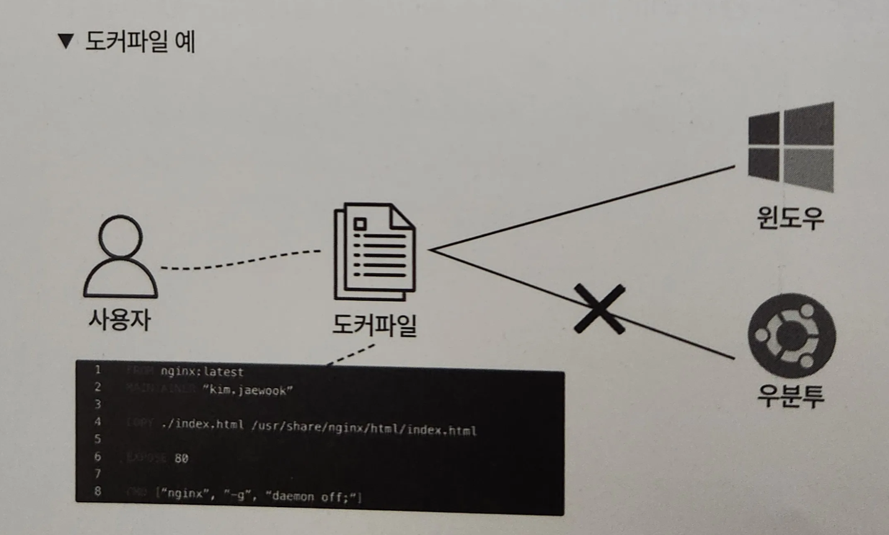

- 이 도커파일은 엔진엑스(Nginx) 환경을 구성하는 설정 파일
- 파일명 : ‘Dockerfile’ or ‘dockerfile’
- FROM : 베이스 이미지 지정. 엔진엑스의 최신 버전을 베이스 이미지로 지정하고 있다.
- MAINTAINER : 도커파일의 작성자 혹은 수정한 사람의 이름을 지정
- COPY : 호스트 파일을 지정된 디렉터리에 복사하는 명령
    - 로컬 환경의 `./index.html` 경로에 있는 파일을 컨테이너 내부에 있는 웹 서버의 경로(`/usr/share/nginx/html/`)에 복사하는 명령어
- EXPOSE : 컨테이너가 노출할 포트를 지정하는 명령
    - 해당 포트로 접속하면 엔진엑스의 `/usr/share/nginx/html/index.html` 파일이 열린다.
- CMD : 도커파일에서 사용되는 지시문. 컨테이너가 시작될 때 실행될 기본 명령 지정
    - 예시에서는 엔진엑스를 시작하는 명령어를 담고 있다.
- 이렇게 설정한 도커파일을 사용해 하나의 컨테이너를 구성한다면 같은 개발 환경을 구성할 수 있으며 어떠한 OS에서도 문제없이 사용할 수 있다.

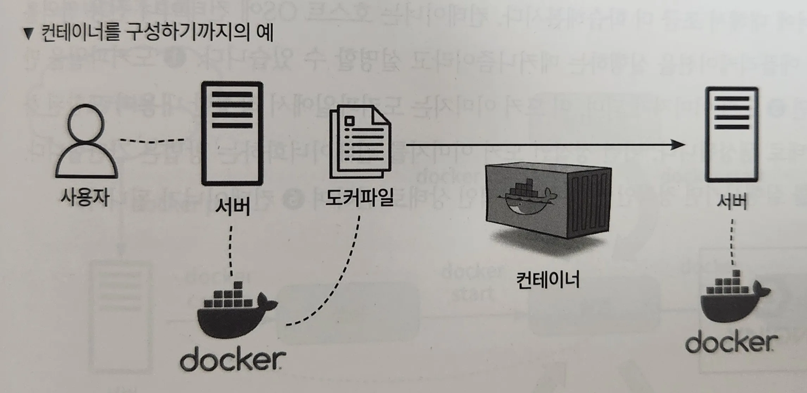
- 사용자는 로컬 환경 혹은 현재 개발을 진행하고자 하는 서버에 도커를 설치
- 사용자가 구성하고자 하는 환경을 바탕으로 도커파일 작성
- 작성한 도커파일을 다른 서버로 업로드하고 이 서버에도 동일하게 도커를 설치한 다음, 업로드된 도커파일을 빌드해 같은 개발 환경을 구성할 수 있다.
- 이렇게 구성한 가상의 개발 환경을 컨테이너(Container)라고 한다.
- 직접 사용자가 도커파일을 만드는 방법도 존재하지만 도커허브에 접속해 다른 사람들이 만들어둔 도커파일을 다운로드해 개발 환경을 구성할 수도 있다.

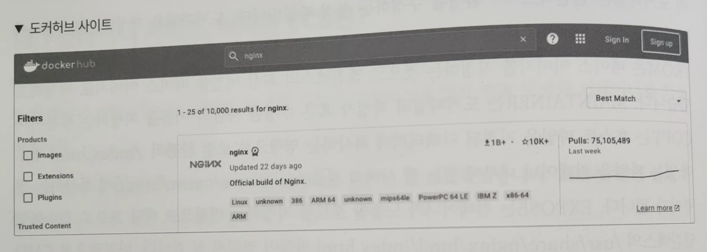
> 도커퍼브 : 자신이 만든 도커파일을 업로드할 수 있으며, 다른 업로더가 만든 도커파일을 내려받을 수도 있는 공유 플랫폼
>
- 사용자들은 서로의 도커 이미지를 공유하고 재사용함으로써 개발 환경을 효율적으로 관리할 수 있다.
- EC2 인스턴스의 커뮤니티 AMI 또한 사용자가 만든 AMI를 업로드하고 공유할 수 있다는 점에서 비슷한 목적을 가지며, 각 환경에서 소프트웨어를 관리하고 공유하는 데 사용된다.

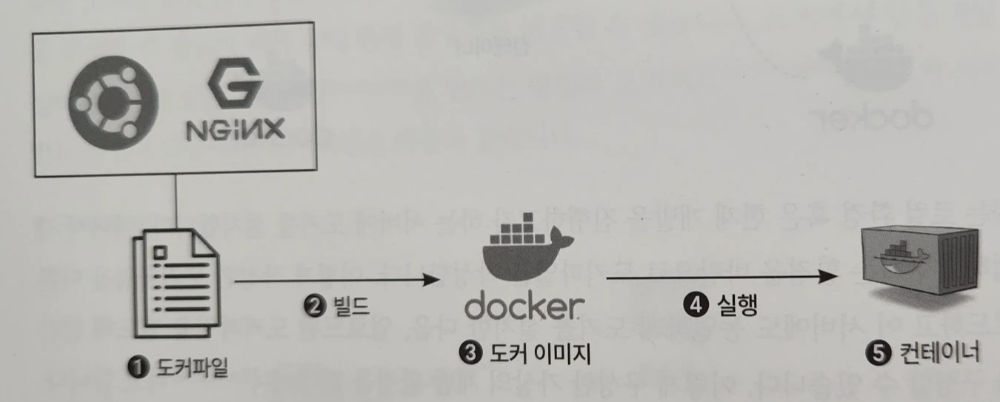
- 컨테이너는 호스트 OS에 컨테이너 전용 영역을 만들고 그 위에 애플리케이션을 실행하는 메커니즘
- 도커파일을 만들고 빌드하면 도커 이미지가 되며, 이 도커 이미지는 도커파일에서 작성한 내용이 포함된 하나의 정적인 상태로 생성된다.
- 도커 이미지를 실행시키면 정적인 상태에서 동적인 상태로 변하며 컨테이너가 된다.

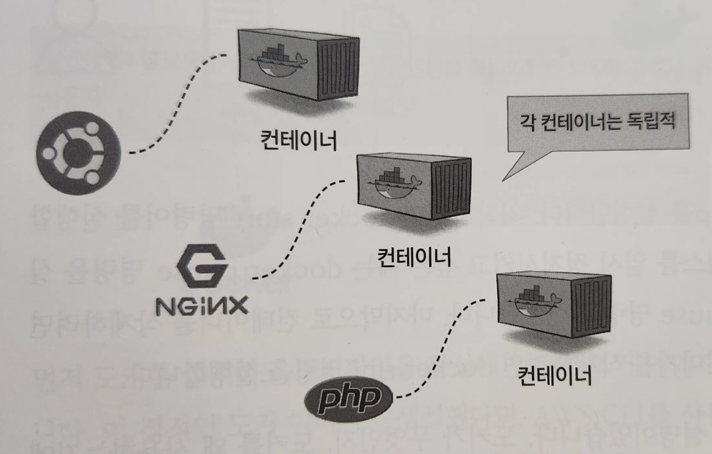
- 컨테이너는 독립적이다.
- 하나의 서버에 복수의 컨테이너를 만들어 관리 및 서비스할 수 있다.
- ex. Ubuntu OS 환경을 위한 컨테이너와 엔진엑스 환경을 위한 컨테이너, 마지막으로 PHP 개발 환경의 컨테이너 등 각각 다른 환경의 컨테이너를 만들어 운영 및 관리할 수 있다.
- 컨테이너는 새 프로젝트를 진행할 때마다 AWS에서 EC2 인스턴스를 생성하거나 물리 서버를 구입해 설정할 필요가 없다.

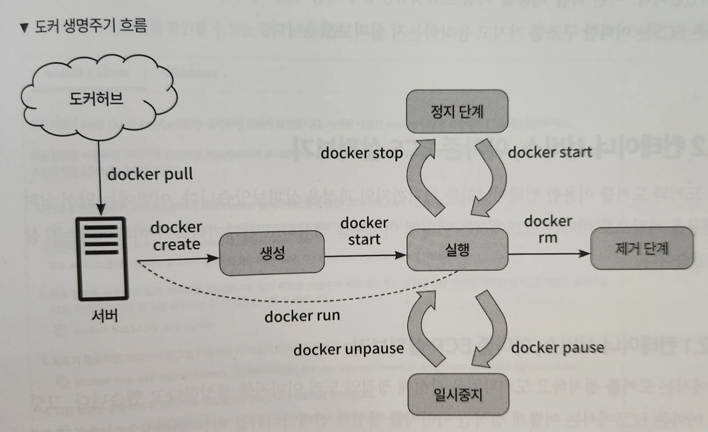
- 도커허브에서 도커 이미지를 찾아 다운로드
- docker pull과 docker run이라는 두 가지 명령으로 내려받을 수 있다.
- docker pull : 도커허브에서 도커 이미지만을 다운로드. 이 도커 이미지는 정적인 상태이므로 사용하려면 컨테이너화를 해야 한다.
    - 컨테이너화를 하려면 docker create 명령을 사용
    - docker start 명령을 사용해 컨테이너를 시작
- docker run : 도커 이미지를 다운로드를 하고 곧 바로 컨테이너 시작
    - 이 명령은 실행할 때마다 컨테이너를 생성하므로 컨테이너화가 필요할 때에만 실행하는 것이 좋다.
- 컨테이너를 중지하려면 docker stop, 시작하려면 docker start 실행
- docker pause : 컨테이너의 내부 프로세스를 일시 정지, docker unpause : 재시작
- docker rm : 컨테이너 삭제, docker rmi : 도커 이미지 삭제

# 컨테이너 서비스, 아마존 ECS 살펴보기

## 컨테이너 서비스, 아마존 ECR 살펴보기

> 아마존 ECR(Elastic Container Registry) : 아마존 ECS에서 정적인 이미지를 보관하는 서비스


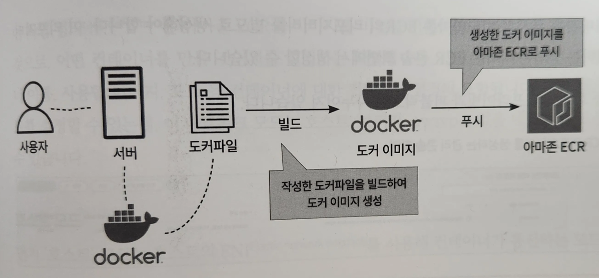
- 도커를 설치하고 도커파일을 작성해 정적인 도커 이미지 생성
- AWS CLI를 사용해 아마존 ECR로 푸시 작업을 수행
- 푸시 된 정적인 도커 이미지는 아마존 ECR에서 관리
- AWS에서는 아마존 ECR로 푸시하는 명령어를 아마존 ECR 콘솔 화면에서 제공하고 있다.

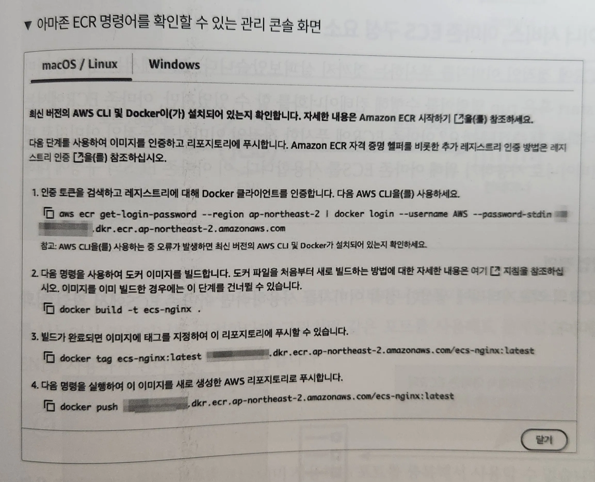
- 이렇게 제공받은 명령어를 바탕으로 푸시 작업을 수행한다면 별도의 환경에서 도커 이미지를 관리할 필요 없이 AWS에서 중앙집중식으로 이미지를 관리할 수 있다.
- 아마존 ECR에 정적인 이미지를 푸시하려면 아마존 ECR의 리포지터리를 별도로 생성해야 한다.
- 리포지터리는 아마존 ECR 콘솔 화면에서 생성할 수 있다.

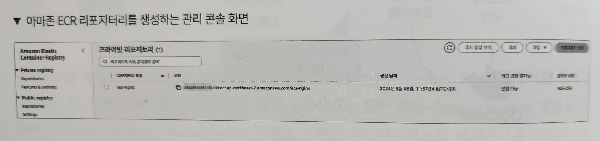
- ECR 콘솔 화면에서 프라이빗과 퍼블릭으로 나누어져 있다.
- 프라이빗 리포지터리는 IAM 혹은 특정 권한이 할당된 사용자만이 사용할 수 있으며, 퍼블릭은 누구나 사용 가능하다.
- 리포지터리가 생성된 후 재설정하는 것은 불가능

## 컨테이너 서비스, 아마존 ECS 구성 요소

> 아마존 ECR에 푸시한 정적인 이미지를 동적인 이미지로 변환해 하나의 컨테이너로 사용하기 위해 아마존 ECS를 사용한다.
>

### 아마존 ECS 작업 정의

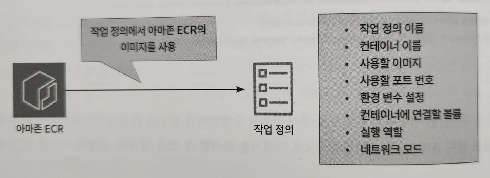
> 작업 정의(task definition) : 아마존 ECR의 이미지를 비롯한 컨테이너의 전체적인 구성을 정의


> 어떤 컨테이너를 만들 것인지를 설정하는 작업
>
- 작업 이름, 컨테이너 이름, 사용할 이미지, 포트 등 컨테이너에 대한 전반적인 설정 포함
- 네트워크 모드 : 호스트, 브리지, awsvpc, 없음 네 가지 모드를 선택

### 호스트 모드

> 호스토 모드 : 호스트의 ENI(Elastic network interface)를 사용해 컨테이너가 통신하는 모드

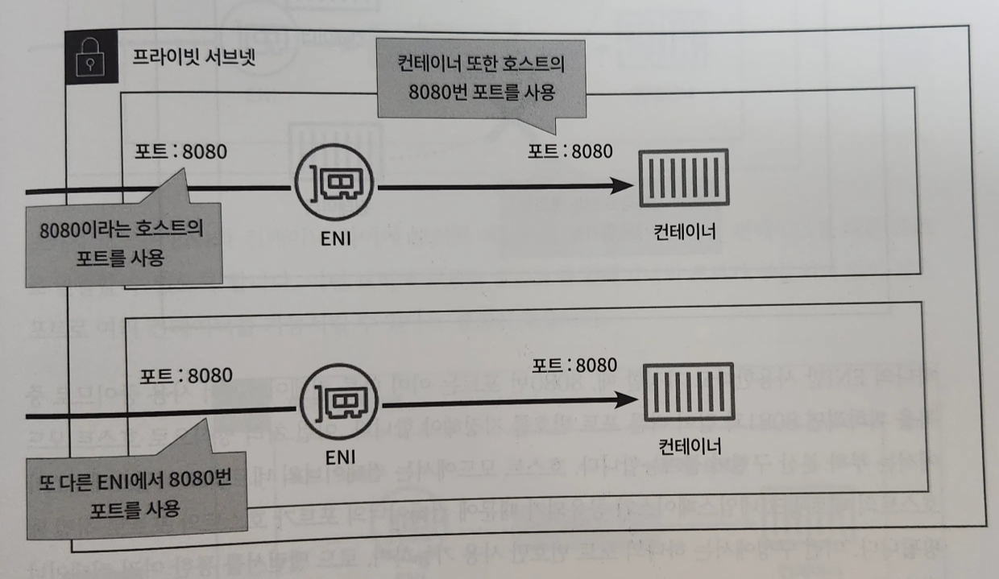

- 호스트에서 사용하는 포트가 컨테이너 포트가 된다.
- 호스트 모드의 경우 ENI를 나누어서 컨테이너를 구성한다면 그림처럼 같은 포트를 사용해도 문제없다.
- 하지만 같은 ENI를 사용하게 된다면 문제가 발생한다.
    - ENI : 가상 네트워크 인터페이스를 의미하며, 생성한 리소스에 연결되어 IP 주소를 부여한다.

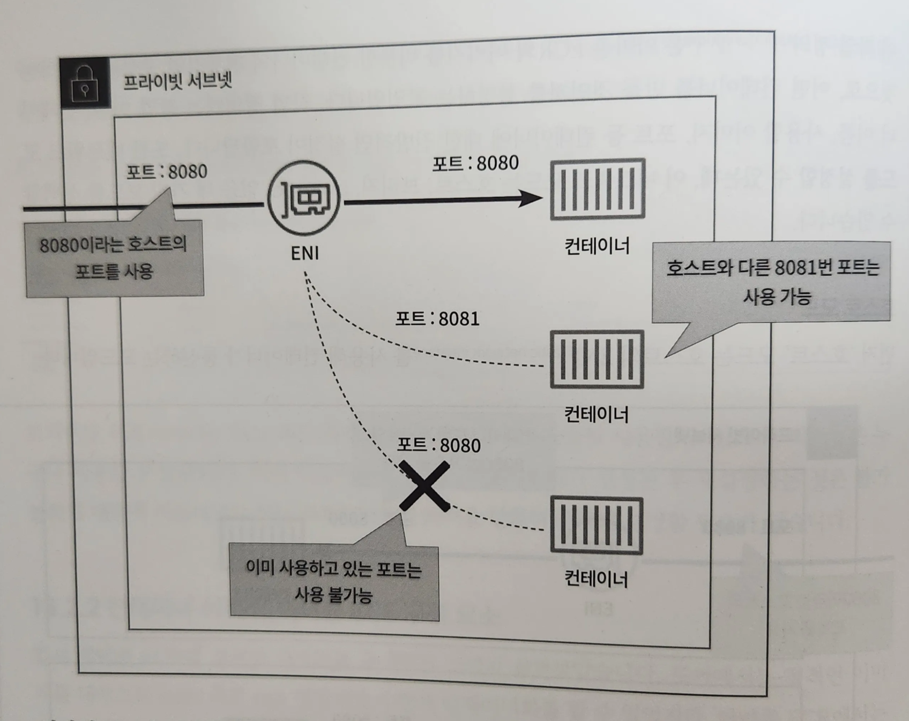
- 호스트 모드에서는 이미 사용하는 포트를 중복해서 사용할 수 없다.
- 하나의 ENI만 사용한다고 가정할 때, 8080번 포트는 이미 다른 컨테이너에서 사용 중이므로 중복을 피하려면 8081과 같이 다른 포트 번호를 지정해야 한다.
- 이런 처리 방식으로 호스트 모드에서는 부하 분산 구현이 불가능
- 호스트 모드에서는 컨테이너의 네트워크 네임스페이스가 호스트의 네트워크 네임스페이스와 공유되기 때문에 컨테이너의 포트가 호스트의 포트로 직접 매핑된다.
- 이런 구성에서는 하나의 포트 번호만 사용 가능하며, 로드 밸런서를 통한 여러 컨테이너 간의 부하 분산이 불가능하다.

### 브리지 모드

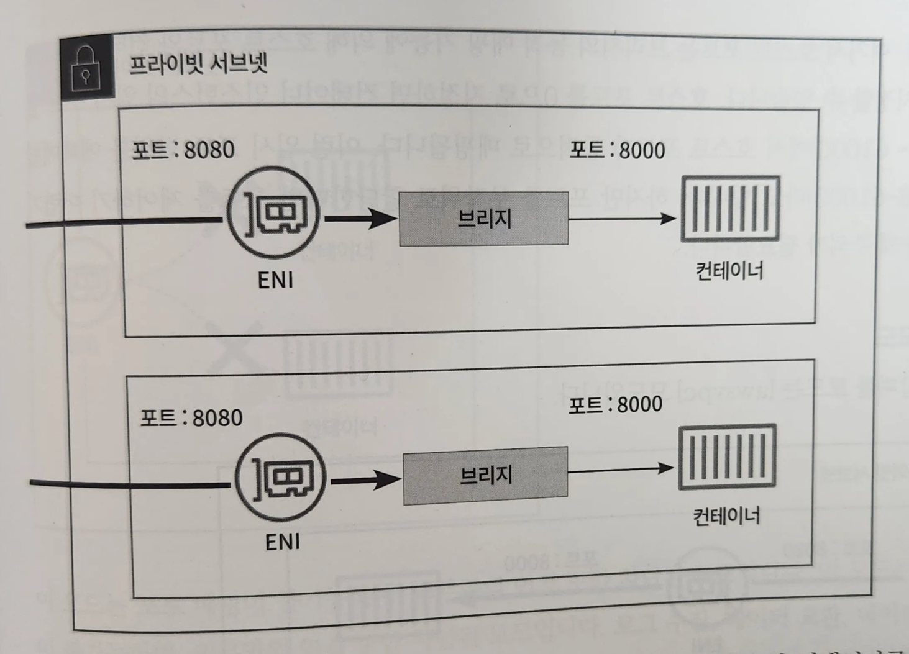
> 브리지 모드 : ENI와 컨테이너 사이에 브리지 레이어를 추가해, 호스트와 컨테이너를 다른 포트로 연결할 수 있도록 한다.

- 호스트와 컨테이너의 포트가 구분되어 있어 같은 포트로 여러 컨테이너를 가동시킬 수 있다.
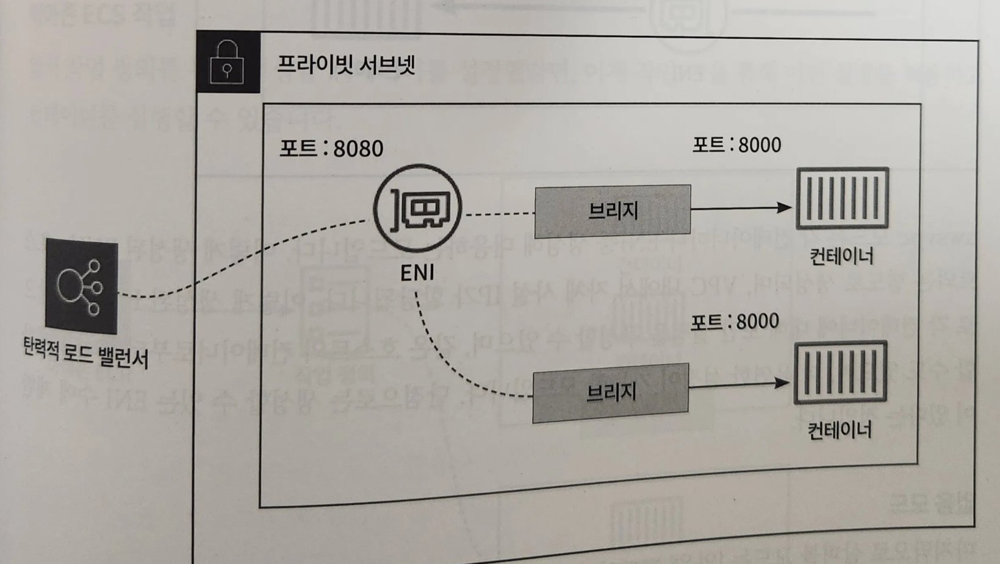

- 같은 포트로 여러 컨테이너를 가동시킬 수 있어 로드 밸런서를 사용해 부하 분산을 수행할 수 있다.
- 여기서 호스트 포트는 브리지의 동적 매핑 기능에 의해 호스트 포트와 컨테이너 포트를 별도로 지정할 수 있다.
- 호스트 포트를 0으로 지정하면 컨테이너 인스턴스의 임시 포트 번위(32768~61000)에서 호스트 포트가 동적으로 매핑된다.
    - 이런 임시 포트 범위를 에페메랄 포트(32768~61000)라고 한다.
- 하지만 포트를 무작위로 할당한다면 포트를 제어하기 어렵기 때문에 사용에 주의가 필요하다.

### awsvpc 모드

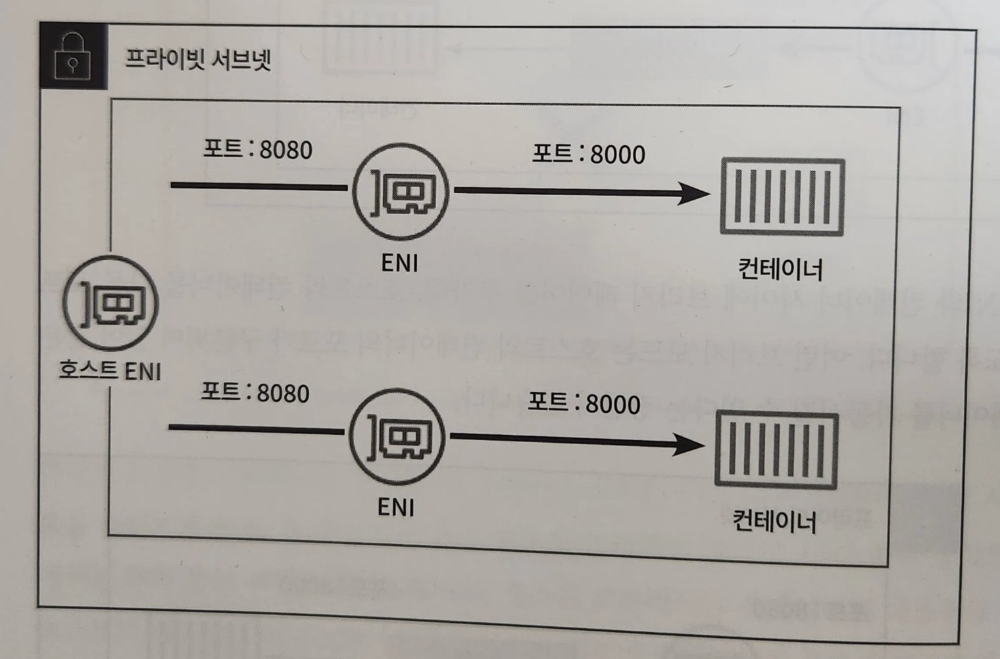
> awsvpc 모드 : 각 컨테이너마다 ENI를 생성해 대응하는 모드


- 생성된 ENI는 호스트와는 별도로 생성되며, VPC 내에서 자체 사설 IP가 할당된다.
- 이렇게 생성된 ENI를 바탕으로
    - 각 컨테이너에 대해 보안 설정을 구성
    - 같은 호스트의 컨테이너로부터 통신을 제한
    - 더 유연한 설정이 가능한 모드
- 생성할 수 있는 ENI 수에 제한이 있다는 것이 단점

### 없음 모드
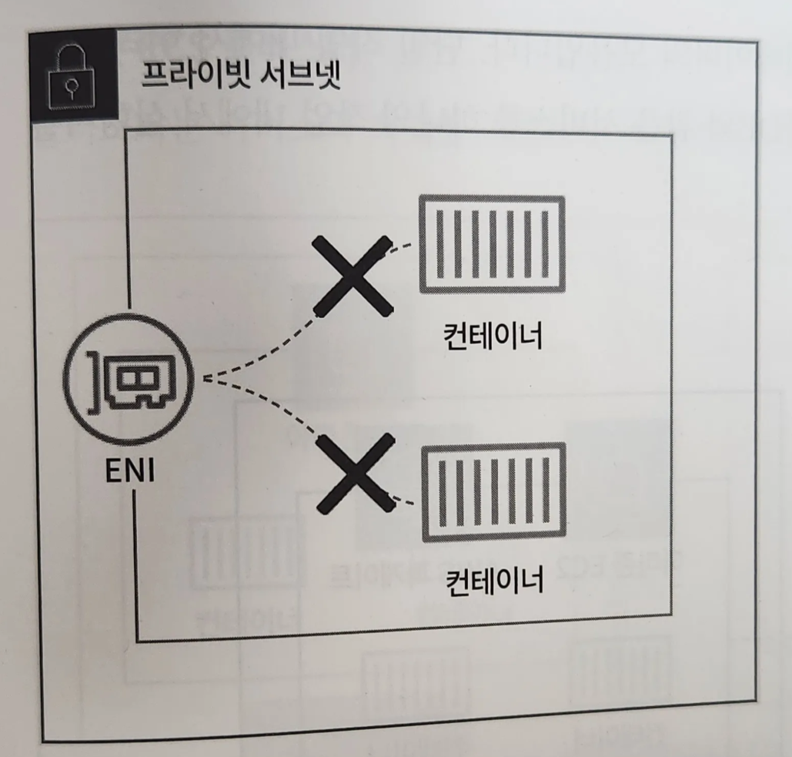

> 없음 모드 : 포트 매핑이 불가능하며, 외부와의 연결 또한 차단된 모드


- 로그 수집, 데이터 교환, 데이터베이스 등 네트워크 기능을 불필요할 때 사용하는 모드
- 이렇게 작업 정의에서 컨테이너를 사용하기 위한 다양한 설정을 할 수 있다.

### 아마존 ECS 작업

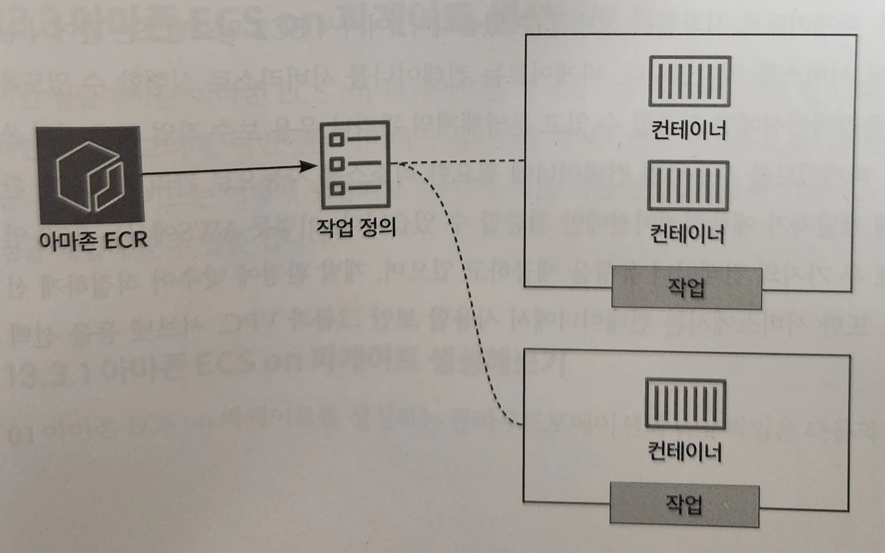
- 앞서 작업 정의를 통해 생성할 컨테이너를 설정했다면, 이제 작업(task)을 통해 이런 설정을 적용하고 컨테이너를 실행할 수 있다.
- 이 작업은 작업 정의를 기반으로 시작한 컨테이너의 모음이다.
- 단일 작업 내에서 여러 컨테이너를 시작할 수도 있으며, 엔진엑스와 마리아DB와 같은 서비스를 하나의 작업 내에서 실행시킬 수 있다.

### 아마존 ECS 서비스

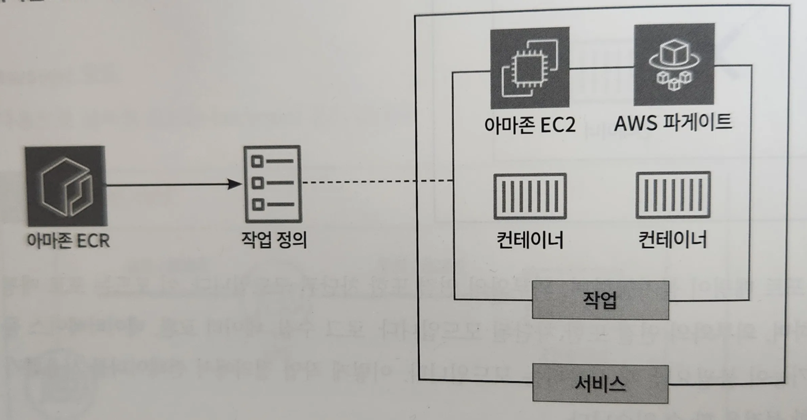
- 서비스는 작업을 관리한다.
- 작업 중 하나가 실패하거나 문제가 발생해 중지되는 경우 서비스에서 설정한 필요한 작업 수에 따라 자동으로 새 작업이 시작된다.
- ex. 작업 수를 2로 설정했다면 작업 수가 2가 유지되도록 관리하는 역할
- 이런 서비스의 기능으로 원하는 작업 수를 유지할 수 있다.
- 컨테이너의 시작 유형을 선택할 수 있는데, EC2 인스턴스로 시작할지, 파게이트로 시작할지 선택 가능
    - EC2 인스턴스 → 컴퓨팅 서비스
    - 파게이트 : 컨테이너를 서버리스로 실행할 수 있도록 한다. 사용자는 애플리케이션에만 집중할 수 있고 운영체제의 관리나 운용 보수 작업 등을 신경 쓰지 않아도 된다.
- AWS에서는 EC2 인스턴스와 파게이트 두 가지의 컨테이너 유형을 제공하고 있으며, 개발 환경에 맞추어 적절하게 선택할 수 있다.
- 서비스에서는 컨테이너에서 사용할 보안 그룹과 VPC, 서브넷 등을 선택할 수 있다.

### 아마존 ECS 클러스터

> 클러스터 : 서비스와 작업을 포함하는 컨테이너 관리 및 배포를 위한 컴퓨팅 자원의 집합

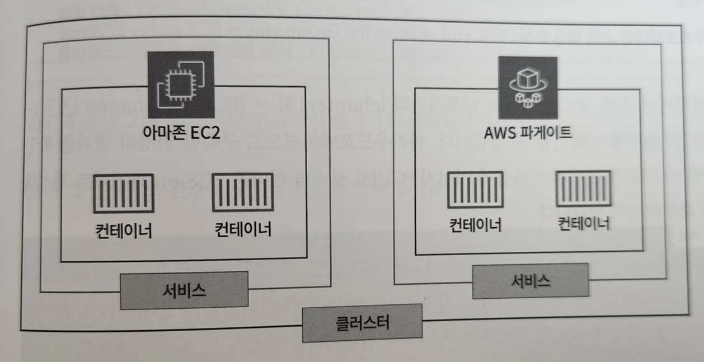

- 클러스터는 여러 EC2 인스턴스나 파게이트 작업으로 구성되어 있으며, 이를 통해 여러 서비스 및 작업을 실행하고 관리할 수 있다.

# 아마존 ECS on 파게이트 생성해보기

- 서버리스 서비스인 파게이트를 생성하고 관리하는 과정을 실습해보자.
- 파게이트는 어떻게 생성되고 관리되는지를 확인하고 서버리스 환경의 특징과 장점을 체험해보자.

## 아마존 ECS on 파게이트 생성해보기

> VPC.yml → Security_Group.yml → EC2.yml → ECS.yml 순서로 클라우드포메이션 스택을 생성해야 한다.
>

https://github.com/classmethodjaewook/aws-developer/tree/main/chapter13

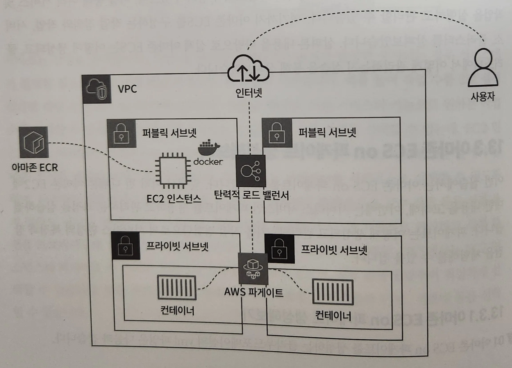
- 퍼블릭 서브넷에 EC2 인스턴스를 생성하고 도커를 설치
- 설치한 도커를 바탕으로 엔진엑스를 설치하고 기동하는 도커 이미지를 생성하고 ECR에 이미지를 푸시
- 푸시한 이미지를 바탕으로 컨테이너를 생성하고, 사용자는 로드 밸런서를 이용해 컨테이너에 접근한다.

> VPC.yml → Security_Group.yml → EC2.yml 순서로 클라우드포메이션 스택을 생성해야 한다.
>
1. 우선 VPC와 보안 그룹, EC2 인스턴스까지 순서대로 생성한다.

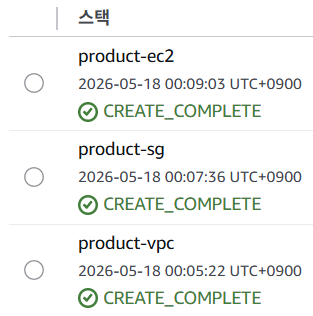
2. EC2 인스턴스 환경을 구성했다면, 도커를 설치한다.
- EC2 인스턴스에 접속해 도커 설치 명령어를 입력
- 마지막으로 도커 images 명령어를 입력하고 REPOSITORY, TAG, IMAGE ID가 출력된다면 도커 설치와 기동에 성공

```bash
# 도커 설치 명령어

sudo -i
yum install docker
systemctl start docker
docker images
-> REPOSITORY TAG   IMAGE ID  CREATED  SIZE
```
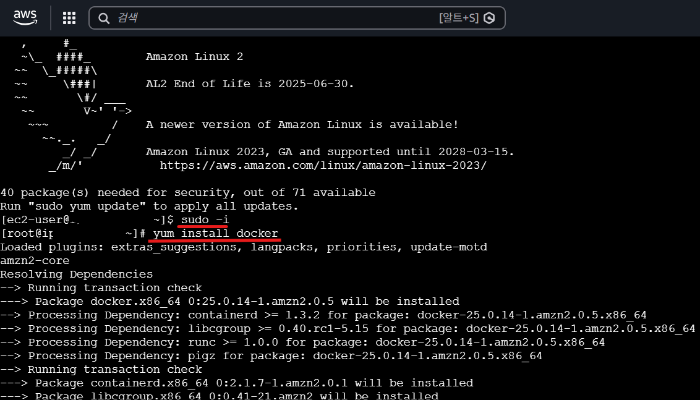

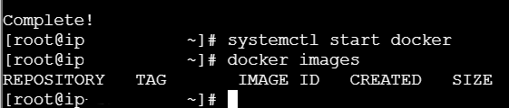
3. index.html 파일을 생성해 웹 서버에 접속했을 때 출력할 텍스트 입력
- dockerfile-folder를 만들고 `index.html` 파일 생성
- 아마존 ECS on 파게이트에 접속하면 이 index.html에 적어둔 hello ecs!가 출력된다.

```bash
# 웹 서버에 출력할 index.html 파일 내용을 작성

mkdir dockerfile-folder
cd dockerfile-folder/

vi index.html
<!doctype html>
<h1>hello ecs!</h1>
```

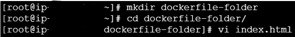
4. 도커파일 작성
- vi 명령어로 도커파일 작성, 엔진엑스를 설치하는 명령어 추가
- COPY 명령어로 조금 전 생성한 `index.html`을 `/usr/share/nginx/html` 경로로 복사해 접속 시 hello ecs!가 출력되도록 한다.

```docker
# 도커파일 생성

vi dockerfile

FROM nginx:latest
MAINTAINER "lee.chaeyoung"
COPY ./index.html /usr/share/nginx/html/index.html
EXPOSE 80
CMD ["nginx", "-g", "daemon off;"]
```

5. 도커 이미지 빌드
- docker build 명령어로 도커파일을 빌드한다.
- 태그 명은 ecs-nginx로 설정하며, [.]은 도커파일의 경로를 의미한다.
- 빌드가 끝나고 docker images를 입력하면 생성된 이미지를 확인할 수 있다.

```bash
# 도커파일 빌드 명령어

docker build -t ecs-nginx .
docker images
```

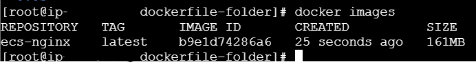
6. 도커 이미지 검증
- docker create 명령어로 컨테이너 생성
- [-p] 옵션은 호스트 포트와 컨테이너의 포트를 의미
- [db68383e6d13]에는 docker images 명령어를 통해 확인할 수 있었던 ecs-nginx의 IMAGE ID를 입력
- 이렇게 컨테이너를 생성하고 docker ps -a 명령어를 통해 컨테이너의 ID를 확인할 수 있으며, 이 ID를 바탕으로 컨테이너를 실행

```bash
# 도커 설치 명령어

docker create -i -t --name ecs-nginx-container -p 80:80 b9e1d74286a6
docker ps -a
docker start 1b1016d2faa7
```
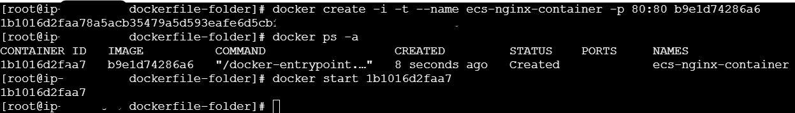
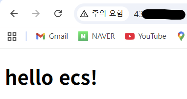
- EC2 인스턴스의 보안 그룹에 HTTP 포트를 열고, EC2 인스턴스의 IP를 웹브라우저에 입력하면 hello ecs!가 출력되는 것을 확인할 수 있다.
7. 아마존 ECR을 리포지터리에 생성한다.
- 아마존 ECR 콘솔 화면으로 진입하며 [Repositories] 카테고리를 클릭하고 [리포지토리 생성]을 클릭. 리포지터리 이름은 ecs-nginx로 지정

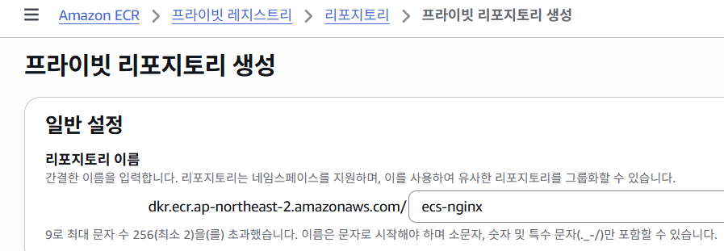
8. 생성한 리포지터리를 바탕으로 ECR에 이미지를 푸시한다.
- 생성한 리포지터리를 선택한 다음 [푸시 명령 보기]를 클릭.
- AWS에서는 ECR로 이미지를 푸시하는 명령어를 OS별로 제공하고 있다.
- 조금 전 검증 단계에서는 docker build 과정을 이미 진행했기 때문에 1, 3, 4의 명령어를 복사해 실행
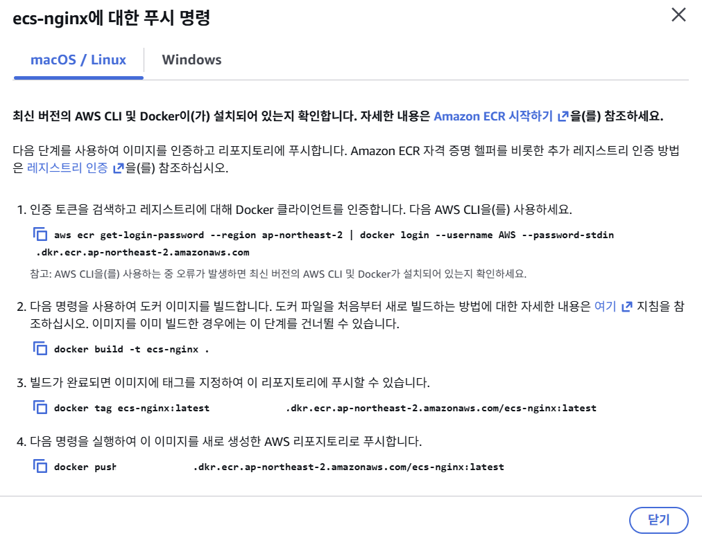

- 푸시 작업이 무사히 끝났다면, 생성한 리포지터리를 클릭하여 생성한 이미지를 확인할 수 있다.

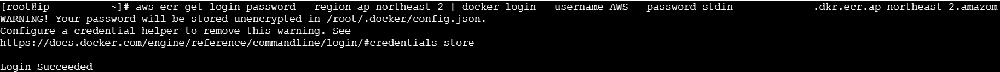
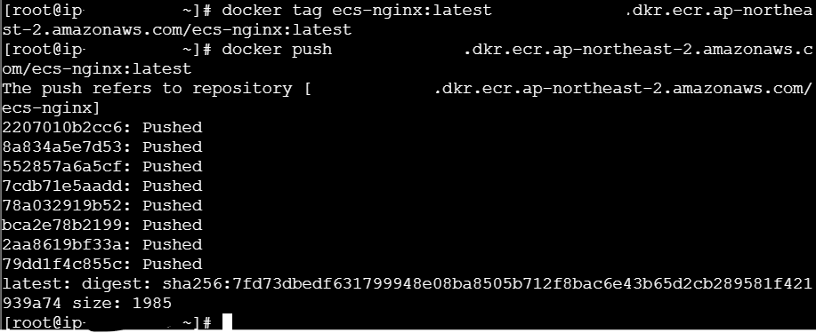
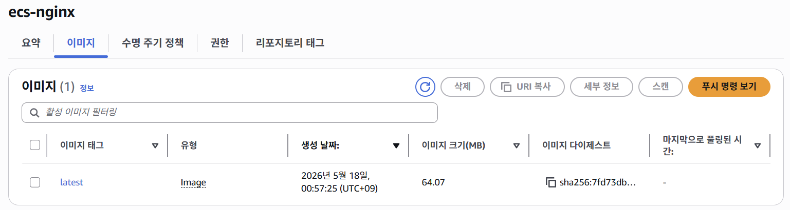
9. ECS.yml 파일에 ECS를 위한 IAM 권한을 생성

```yaml
# ECS.yml

  ECSTaskExecutionRole:
      ManagedPolicyArns: 
        - arn:aws:iam::aws:policy/service-role/AmazonECSTaskExecutionRolePolicy # ECS 작업을 실행하는 데 필요한 주요 권한
      Policies:
        - PolicyName: !Sub ${SystemName}-${EnvName}-ecs-task-allow-pullthrough
          PolicyDocument:
            Version: "2012-10-17"
            Statement:
              - Effect: Allow
                Action:
                  - ecr:CreateRepository # ECR의 리포지터리를 생성할 수 있는 권한
                  - ecr:BatchImportUpstreamImage # ECR에 외부 이미지를 가져올 수 있는 권한
```

10. ECS.yml 파일에 ECS를 위한 IAM 권한을 생성

```yaml
# ECS.yml

  TaskRole: # 아마존 ECS Exec를 사용하기 위한 권한 생성. Exec: 컨테이너에 로그인할 수 있는 기능
            Action:
              - "ssmmessages:CreateControlChannel"
              - "ssmmessages:CreateDataChannel"
              - "ssmmessages:OpenControlChannel"
              - "ssmmessages:OpenDataChannel"
```

11. ECS.yml 파일에 클러스터 생성을 위한 코드 작성

```yaml
# ECS.yml

  ECSCluster:
    Type: AWS::ECS::Cluster # 클러스터 타입과 이름 입력
    Properties:
      ClusterName: !Sub ${SystemName}-${EnvName}-cluster
```

12. ECS.yml 파일에 서비스를 생성하는 코드 작성

```yaml
# ECS.yml

  ECSService:
    Type: AWS::ECS::Service
    DependsOn: # ECS보다 로드 밸런서가 먼저 생성되도록 설정
      - InternetFacingALB
    Properties:
      ServiceName: !Sub ${SystemName}-${EnvName}-service # 서비스의 이름 지정
      Cluster: !Ref ECSCluster # 생성한 클러스터 지정
      EnableExecuteCommand: true # true: Exec를 사용해 컨테이너에 로그인할 수 있다.
      DesiredCount: 2 # 생성할 인스턴스 개수 (기본값: 1)
      LaunchType: FARGATE # 파게이트 지정
      LoadBalancers: # 로드 밸런서와 컨테이너의 정보 입력, 컨테이너 포트는 작업 정의에서 지정한 포트와 동일해야 한다.
        - ContainerName: !Sub ${SystemName}-task
          ContainerPort: 80
          TargetGroupArn: !Ref ALBTargetGroup
      TaskDefinition: !Ref ECSTaskDefinition # 작업 정의 지정
      NetworkConfiguration: # 컨테이너의 보안 그룹과 서브넷 지정
        AwsvpcConfiguration:
          SecurityGroups:
            - Fn::ImportValue: !Sub ${EnvName}-fargate-sg
          Subnets:
            - Fn::ImportValue: !Sub ${EnvName}-web-subnet-1a
            - Fn::ImportValue: !Sub ${EnvName}-web-subnet-1b
```

13. ECS.yml 파일에 작업을 정의하는 코드 작성

```yaml
# ECS.yml

  ECSTaskDefinition:
    Type: AWS::ECS::TaskDefinition
    Properties:
      Family: !Sub ${SystemName}-${EnvName}-task # 작업 이름 지정
      ContainerDefinitions: # 컨테이너의 포트와 호스트 포트를 지정하며, ECR에 푸시한 이미지를 지정
        - Name: !Sub ${SystemName}-task
          PortMappings:
            - ContainerPort: 80
              HostPort: 80
              Protocol: tcp
          Image: !Sub ${AWS::AccountId}.dkr.ecr.${AWS::Region}.amazonaws.com/ecs-nginx:latest
      Cpu: 512 # 서버의 CPU와 메모리를 지정
      Memory: 2048
      ExecutionRoleArn: !GetAtt ECSTaskExecutionRole.Arn # 컨테이너가 맡을 수 있는 실행 역할을 의미하며, 작업의 컨테이너에는 이 역할에 지정된 접근 허가가 부여된다.
      RequiresCompatibilities: # 파게이트 지정
        - FARGATE
      NetworkMode: awsvpc # 파게이트의 경우 EC2 인스턴스를 생성하는 것이 아니라 컨테이너만으로 서비스가 움직이기 때문에 컨테이너 본인이 ENI 관리. 이런 이유로 각 작업에 대해 ENI를 생성하고 관리할 수 있는 awsvpc 모드를 파게이트에서 사용해야 한다.
      TaskRoleArn: !GetAtt TaskRole.Arn # 사용자를 대신해 작업 내 컨테이너에 AWS API를 호출할 수 있는 권한 설정
```

## UI로 불러와 아마존 ECS on 파게이트 생성하기

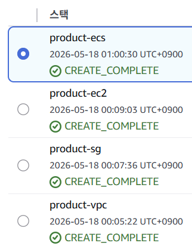
1. ECS 콘솔 화면에서 클러스터, 서비스, 작업을 확인한다.
- ECS 콘솔 화면에서 [클러스터] 클릭하면 생성된 클러스터를 확인할 수 있으며, 클러스터를 클릭해 [서비스] 카테고리를 확인하면 서비스 유형과 실행 중인 작업 등을 확인할 수 있다.
- [태스크] 카테고리에서는 실행 중인 작업을 확인할 수 있으며 해당 작업이 생성된 파게이트(서버)를 의미

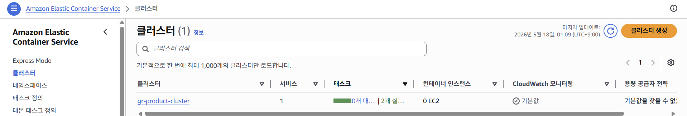
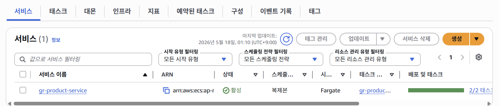
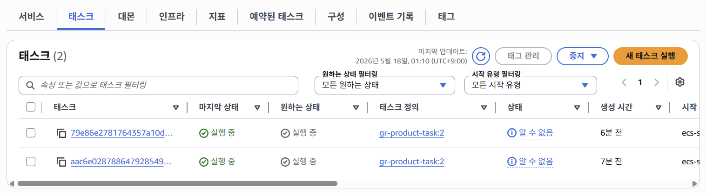
2. EC2 콘솔 화면에서 대상 그룹의 정보를 확인한다.
- EC2 콘솔 화면에서 [대상 그룹] 카테고리로 들어와 확인하면, 대상 그룹이 생성되어 있으며, 등록된 대상에 파게이트가 등록된 것을 확인할 수 있다.

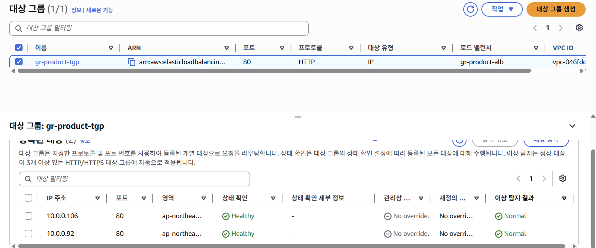
3. 로드 밸런서를 확인하고 접속한다.
- [로드밸런서] 카테고리를 클릭하여 생성된 로드 밸런서를 확인한 다음 DNS 이름을 브라우저에 입력해 접근하면 성공적으로 hello ecs!가 출력된다.

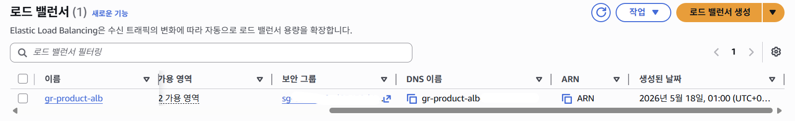
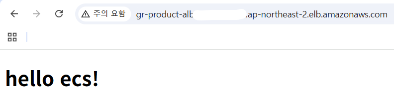