# 이벤트 기반 코드 실행 서비스, AWS 람다란?

> AWS 람다 : AWS에서 제공하는 서버리스 서비스로 서버를 구축하지 않고도 작성한 코드를 실행할 수 있는 이벤트 구동형 프로그램 실행 환경


> 넓은 의미로 보면 서버리스, 더 명확하게 표현하자면 FaaS(Functions-as-a-Service)
>

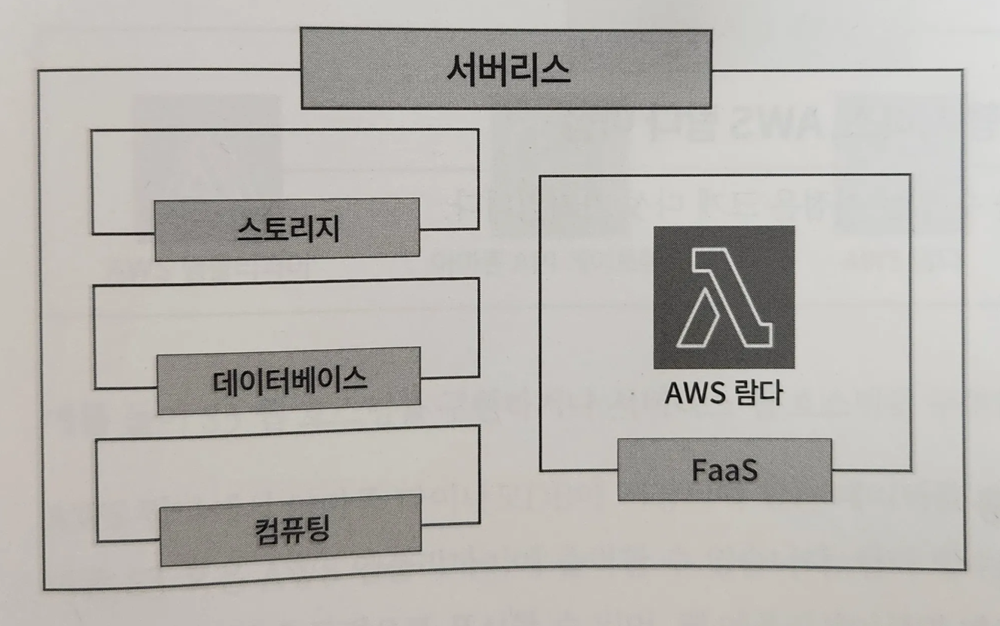
- 서버리스는 다양한 서비스 범주에 중점을 두며, 스토리지, 데이터베이스, 컴퓨팅 등이 포함된다.
- FaaS를 사용하면 개발자는 직접 개발한 개별 함수를 클라우드에서 실행할 수 있으며 필요에 따라 다른 함수와 결합해 애플리케이션을 개발할 수 있다.
    - 애플리케이션 개발에 필요한 서버 준비와 관리에 걸리는 시간을 생략할 수 있다.
- FaaS : 서버리스 아키텍처라고도 하며 개발자는 특정 이벤트나 요청이 발생할 때 실행되는 함수를 작성하기만 하면 된다. (ex. AWS 람다)
- IaaS(Infrastructure as a Service) : 스토리지, 네트워크, 서버와 같은 하드웨어 리소스를 제공하며, 개발자는 이를 바탕으로 애플리케이션을 개발 (ex. 아마존 EC2)
- PaaS(Platform as a Service) : 개발자에게 애플리케이션을 개발하고 테스트, 배포하기 위한 환경을 제공
    - 개발자는 애플리케이션 개발에만 집중할 수 있도록 도와준다.
    - ex. AWS 엘라스틱 빈스토크(AWS Elastic Beanstalk), 아마존 S3
- SaaS(Software as a Service) : 최종 사용자를 위한 소프트웨어
    - 사용자는 웹사이트 혹은 애플리케이션을 통해 소프트웨어에 접근
    - ex. 구글 닥스(Google Docs)

# 이벤트 기반 코드 실행 서비스, AWS 람다 살펴보기

> AWS 람다 : 이벤트 기반 아키텍처를 기반으로 하며, 특정 이벤트가 발생하면 해당 이벤트를 처리하는 별도의 함수를 생성해 실행하는 서버리스 컴퓨팅 서비스


- 특정 이벤트에 대한 핸들러로 구성되어 있으며, 이벤트가 발생하면 핸들러가 실행되어 코드를 실행하는 구조

## 이벤트 기반 코드 실행 서비스, AWS 람다 이점

- 비용 절감
    - AWS 람다는 코드 실행 시간과 요청 수에 따라 비용이 청구된다.
    - 이벤트가 많지만 실행 시간이 짧은 때는 비용이 절감될 수 있음
    - 아마존 EC2와는 달리 별도의 서버를 준비할 필요가 없기 때문에 서버 관리에 대한 비용도 절감 가능
- 보다 안전한 실행 환경
    - AWS에서 실행 환경을 관리하기 때문에 개발자는 개인이나 회사에서 직접 실행 환경을 관리하는 것보다 안전한 환경에서 코드를 실행할 수 있다.
    - AWS는 보안 전문가 팀이 24시간 시스템을 모니터링해 관리하고 있으므로 사용자는 관리에 대해 걱정할 필요가 없다.
- 장애 위험 부담 감소
    - AWS가 서버 관리를 담당하므로 람다 함수 하나에 장애가 발생해도 AWS가 대응한다.
- 다양한 프로그래밍 언어 제공
    - 사용자는 직접 코드를 작성하거나 AWS에서 제공하는 템플릿을 사용해 람다 함수를 생성할 수 있다.
- 다른 AWS 서비스와의 연동
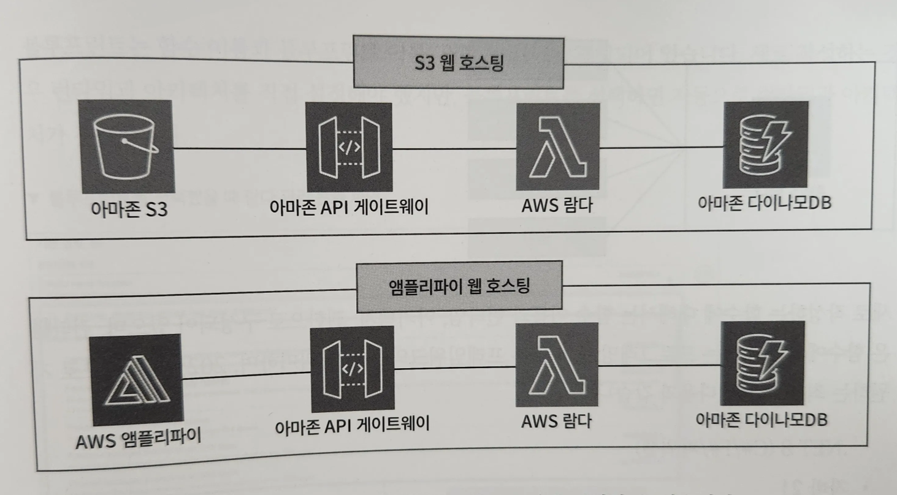

    - ex. S3 웹 호스팅을 구현하거나 서버리스 웹 호스팅을 구현할 수 있다.
    - AWS 람다에서 아마존 다이나모DB에 저장되어 있는 데이터를 가져와 웹사이트를 호스팅하는 아마존 S3 혹은 AWS 앰플리파이에 출력할 수 있다.
    - 람다 함수가 데이터를 처리하고 처리된 결과를 웹페이지에 동적으로 표시
    - 웹 애플리케이션의 데이터 업데이트 및 실시간 반영 등 다양한 기능 구현 가능
    - 슬랙과 같은 커뮤니케이션 도구와 연동해 AWS 사용 요금 혹은 EC2 인스턴스의 중지와 실행 이벤트 등 여러 알림을 받아볼 수 있다.

## 이벤트 기반 코드 실행 서비스, AWS 람다 구성 요소

### AWS 람다 함수 새로 작성

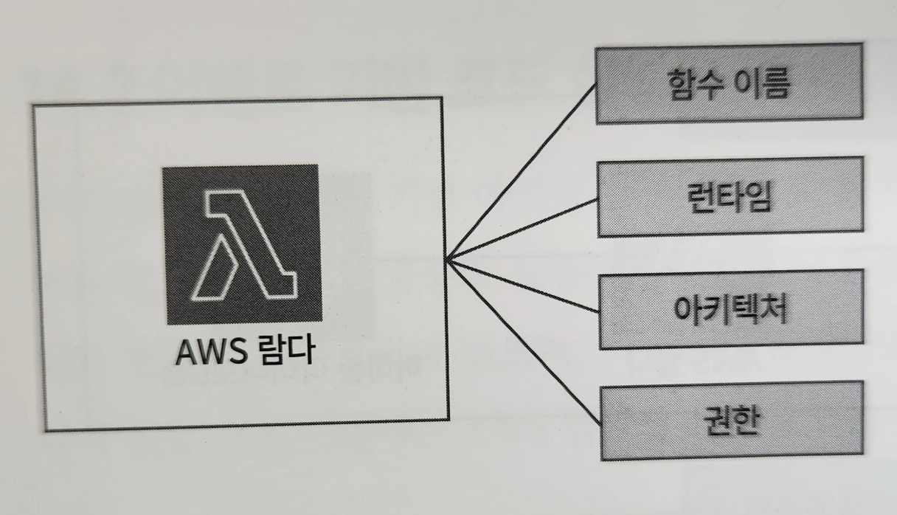
- 새로 작성하는 함수에 대해서는 함수 이름과 런타임, 아키텍처, 권한으로 구성되어 있다.
- 런타임 : 함수에서 사용하는 프로그래밍 언어 또는 프레임워크의 버전
- 아키텍처 : 사용하고자 하는 컴퓨터 프로세서의 유형을 선택
- 권한 : 다양한 AWS 서비스와 연동되어 사용될 수 있기 때문에 연동하려는 각 서비스에 대한 권한이 필요
    - IAM 서비스를 이요해 람다 함수에 필요한 권한을 부여

### AWS 람다 함수 블루프린트 사용

- 블루프린트를 사용하면 람다 함수에서 샘플 코드를 제공받아 더 간편하게 함수를 작성할 수 있다.

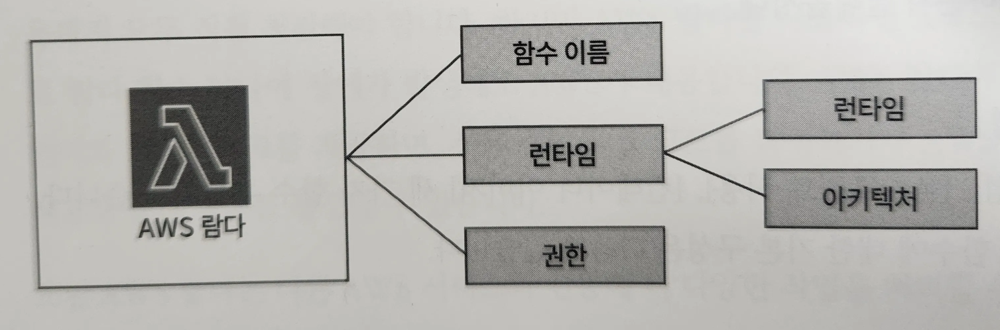
- 함수 이름, 블루프린트 이름, 권한 세 가지로 구성
- 새로 작성하는 경우 런타임과 아키텍처를 직접 설정해야 했지만, 블루프린트를 선택하면 자동으로 런타임과 아키텍처가 결정된다.

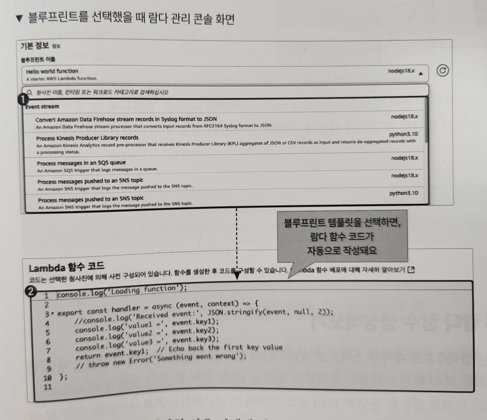
- 다양한 사용 사례에 따른 템플릿을 선택 가능
- 선택한 템플릿에 따라 람다 함수 코드가 자동으로 작성된다.

### AWS 람다 함수 컨테이너 이미지

- 람다 함수를 컨테이너화하는 것으로 아마존 ECR에 푸시한 이미지를 AWS에 배포할 수 있다.
- 기존 람다 함수를 사용할 때는 외부 라이브러리나 미들웨어를 도입하는 경우, 라이브러리 버전이 일치해야 하거나 특정 미들웨어를 도입해야 하는 등의 문제가 발생

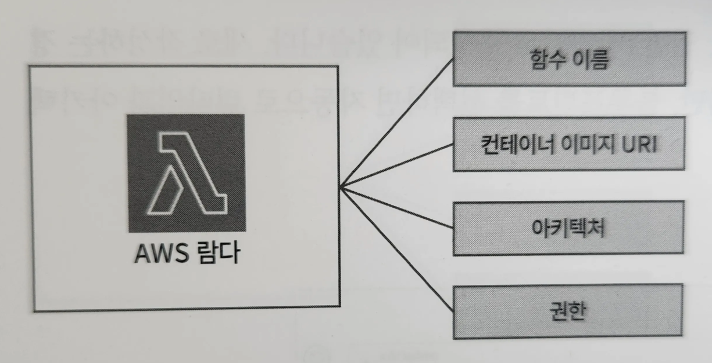
- 함수 이름, 컨테이너 이미지 URI, 아키텍처, 권한으로 구성
- 컨테이너 이미지 URI를 요구하기 때문에 사전에 아마존 ECR로 이미지를 푸시해야 함
- 여러 함수에 라이브러리를 공유하는 방법으로 람다 계층(Lambda Layers)를 사용하는 방법도 있다.
    - 람다 계층을 사용하면 람다 함수에서 필요로 하는 외부 라이브러리나 미들웨어를 별도로 관리할 수 있다.

# AWS 람다 함수 생성해보기

## AWS 람다 함수로 Hello World 출력해보기

https://github.com/classmethodjaewook/aws-developer/tree/main/chapter14

1. 람다에서 사용하기 위한 IAM 역할 생성
- 람다 함수에서는 반드시 IAM 역할을 지정해야 한다.
- AWS 콘솔로 람다 함수를 생성하면서 [기본 Lambda 권한을 가진 새 역할 생성] 옵션을 지정하면,
    - 사용자가 직접 IAM 역할을 생성할 필요X
    - 클라우드포메이션에서는 사용자가 직접 IAM 역할을 생성할 필요가 있다.

```yaml
# lambda.yml

  LambdaIAMRole:
    Type: AWS::IAM::Role
    DeletionPolicy: Delete
    Properties:
      RoleName: !Sub ${SystemName}-${EnvName}-lambdarole
      AssumeRolePolicyDocument:
        Version: "2012-10-17"
        Statement:
          - Effect: "Allow"
            Principal:
              Service:
                - "lambda.amazonaws.com"
            Action:
              - "sts:AssumeRole"
      Path: "/"
      ManagedPolicyArns:
        - "arn:aws:iam::aws:policy/AWSLambda_FullAccess" # 람다 함수의 모든 권한을 가지고 있다.
```

2. 람다 함수 생성

```yaml
# lambda.yml

  LambdaFunction:
    Type: AWS::Lambda::Function # 람다 함수 생성
    Properties:
      FunctionName: !Sub ${SystemName}-${EnvName}-function
      Code: # 람다 함수에서 실행할 코드 입력
        ZipFile: |
          import json

          def lambda_handler(event, context):
              # TODO implement
              return {
                  'statusCode': 200,
                  'body': json.dumps('Hello from Lambda!')
              }
      Handler: index.lambda_handler # 람다가 실행할 메서드 이름
      Role: !GetAtt LambdaIAMRole.Arn # 생성한 IAM 역할 지정
      Runtime: python3.12
      Timeout: 30 # Lambda가 함수를 중지하기 전에 실행할 수 있는 시간
```

## UI로 불러와 AWS 람다 함수로 Hello World 출력해보기

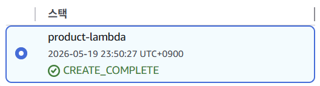
1. AWS 람다 콘솔 화면에서 [함수]를 클릭하고 생성된 람다 함수를 확인

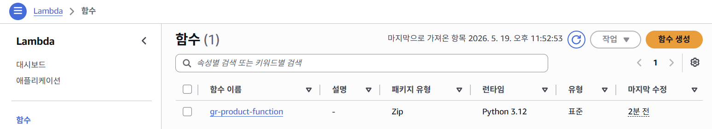
2. 생성한 람다 함수 정보를 확인하고 코드 실행
- 람다 함수를 생성하면 함수 개요가 출력되며 해당 화면에서는 현재 람다 함수에서 사용하는 람다 계층(ex. 라이브러리 등)과 연동하는 AWS 서비스를 확인할 수 있다.
- 코드 카테고리를 클릭하면 파이썬 코드를 확인할 수 있으며, 해당 람다 함수를 실행하기 위해 [Test] 클릭
- 클릭하면 람다 함수의 이벤트를 생성하거나 기존 이벤트를 선택할 수 있다.

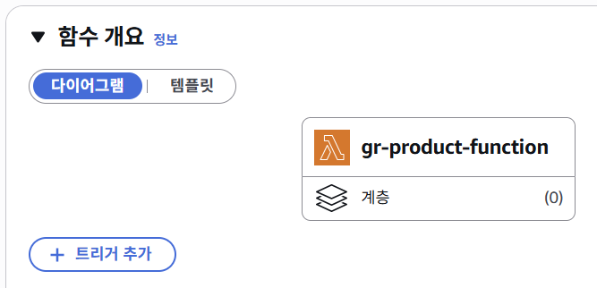
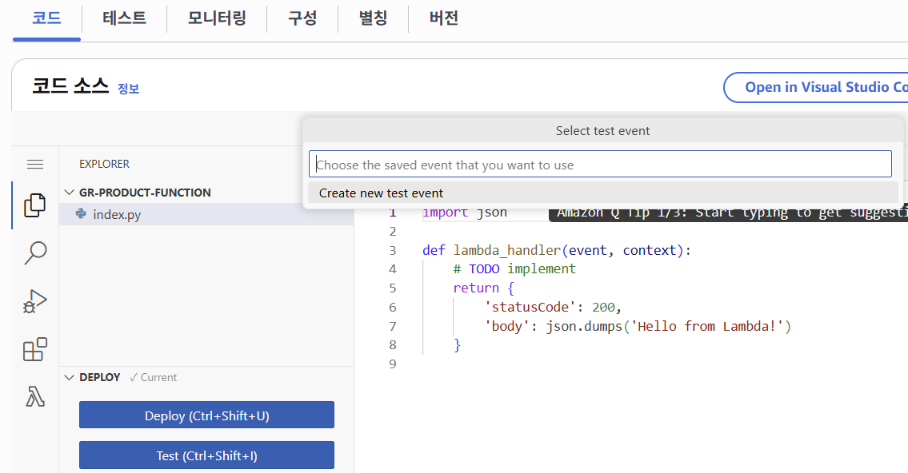
3. 람다 함수의 이벤트 생성
- 람다 함수의 이벤트 이름을 입력하고 “hello-world”를 출력하는 디폴트 템플릿 선택

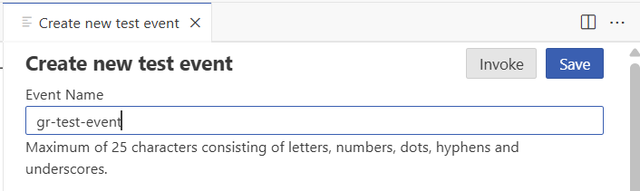
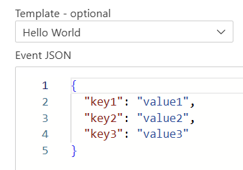

4. 람다 함수를 실행해 결과를 확인한다.
- 이벤트를 생성했다면 다시 [Test]를 클릭해 결과를 확인
- Response로 “Hello from Lambda”가 출력된 것을 확인할 수 있다.

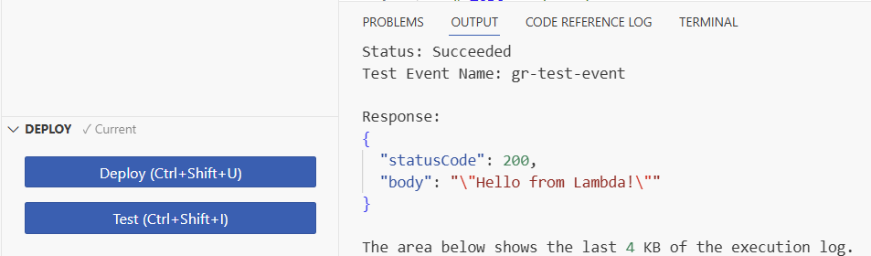