# API 관리 백엔드 서비스, 아마존 API 게이트웨이란?

> API (Application Programming Interface) : 소프트웨어나 애플리케이션 기능의 일부를 외부에 공개하는 것


> 프로그래밍으로 애플리케이션을 연결하는 것
>

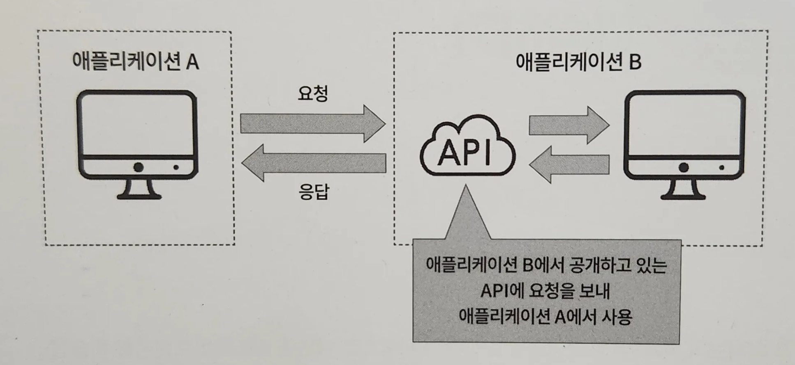
- 애플리케이션 A에서 애플리케이션 B의 기능을 사용할 때 API를 이용해 요청을 보내고 응답을 받아 작동한다.
- ex. 개발자가 쇼핑몰 사이트를 개발할 때 결제 기능을 포함해야 한다고 가정
    - 결제 기능을 직접 개발하는 대신, 신용카드 운영 회사나 은행에서 제공하는 API를 이용할 수 있다.
    - API를 통해 카드 번호나 성명 등의 정보를 포함한 요청을 보내면 결제 여부를 나타내는 응답이 반환된다.
    - 이렇게 하면 쇼핑몰 사이트는 독자적으로 결제 기능을 개발하거나 보안 문제를 직접 처리할 필요가 없어진다.
- AWS에서 제공하는 아마존 API 게이트웨이는 API를 간편하게 구축하고 게시하고 모니터링할 수 있게 도와주는 완전 관리형 서비스이다.
- 쉽고 빠르게 API를 만들 수 있으며, AWS 람다와 연계해 다양한 이벤트 처리를 수행할 수 있다.

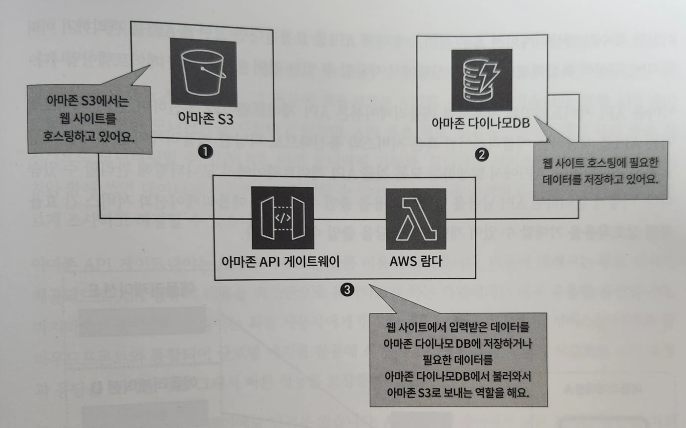
- 아마존 S3에서 웹 호스팅을 하고 있고, 아마존 다이나모DB라는 데이터베이스에 웹 호스팅에 필요한 정보를 저장한다고 가정
- 이 경우 웹 호스팅에 필요한 데이터를 데이터베이스에서 불러오거나,
- 웹 호스팅 사이트에서 입력한 데이터를 데이터베이스에 저장하는 이벤트를 처리할 때 API 게이트웨이를 사용해 API를 생성
- 이를 통해 AWS 람다 함수를 호출해 해당 작업을 처리한다.

# API 관리 백엔드 서비스, 아마존 API 게이트웨이 살펴보기

- 아마존 API 게이트웨이를 사용하지 않는다면 API를 요청하는 애플리케이션은 각 API와 개별적으로 통신한다.
- ex. 애플리케이션에서 결제 서비스, 장바구니, 주문 목록, 재고 관리에 대한 API를 요청해 사용하고자 한다.
    - 애플리케이션은 각 API에 대해서 개별적으로 통신을 수행하며 총 네 번의 통신이 발생한다.

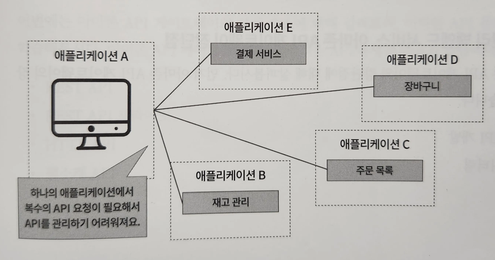
- 복수의 애플리케이션 혹은 서비스에 대해 API를 요청한다면 그만큼 API를 관리하기 어려워지며, 구성이 복잡해진다.

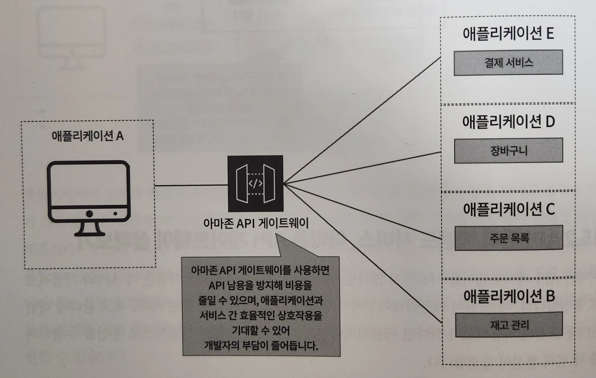
- 아마존 API 게이트웨이를 사용하면 애플리케이션은 API 게이트웨이와 통신
- API 게이트웨이는 API를 제공하는 애플리케이션 혹은 서비스와 통신
- 다양한 애플리케이션에 대한 특정 요청을 조합하거나, API에서 발생하는 모든 것을 API 게이트웨이에서 모니터링해 관리할 수 있다.
- API 남용을 방지해 비용을 줄일 수 있고 애플리케이션과 서비스 간 효율적인 상호작용 가능

## API 관리 백엔드 서비스, 아마존 API 게이트웨이 장단점

- 효율적인 API 개발
    - API 게이트웨이는 개발자에게 특정 API의 다양한 버전을 실행하고 최소한의 노력으로 API를 테스트하고 반복 및 업데이트할 수 있는 환경 제공
- 간편한 모니터링
    - API 호출 정보, 오류율, 데이터 대기 시간 등을 실시간으로 모니터링
    - 모니터링 서비스인 아마존 클라우드워치와 함께 쓰면 데이터를 시각적으로 확인할 수 있어 API 성능을 추적하고 문제의 원인을 빠르게 조사하고 해결할 수 있다.
- 비용 절감
    - 무료 티어가 제공되므로 API 활용 비용을 최소한으로 유지하고자 하는 기업에게는 매우 유용
- 생산성
    - 아마존 클라우드프론트와 통합되어 글로벌 에지를 활용
    - 최종 사용자에게 최적의 대기 시간으로 API 요청과 응답을 처리
- API 게이트웨이에서 모든 API를 통합해 처리하기 때문에 해당 API 게이트웨이에 문제가 발생하면 전체 API의 동작이 멈춘다.
- 다른 서비스나 애플리케이션의 API를 사용하는 경우 해당 API의 보안에 개발자가 직접 관여할 수 없다.

## API 관리를 위한 백엔드 서비스, 아마존 API 게이트웨이 구성 요소

### REST API

> REST API : REST(Representational State Transfer) 규칙으로 만든 API


- 주소 가능성(Addressability), 상태 비저장(Stateless), 연결성(Connectability), 통일 인터페이스(Uniform interface)

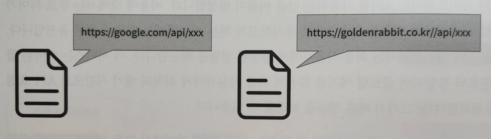
- 주소 가능성 : 제공하는 정보가 URI를 통해 표현될 수 있음
- 각 정보는 고유한 URI를 가지며 해당 URI를 사용해 특정 정보에 접근할 수 있다.

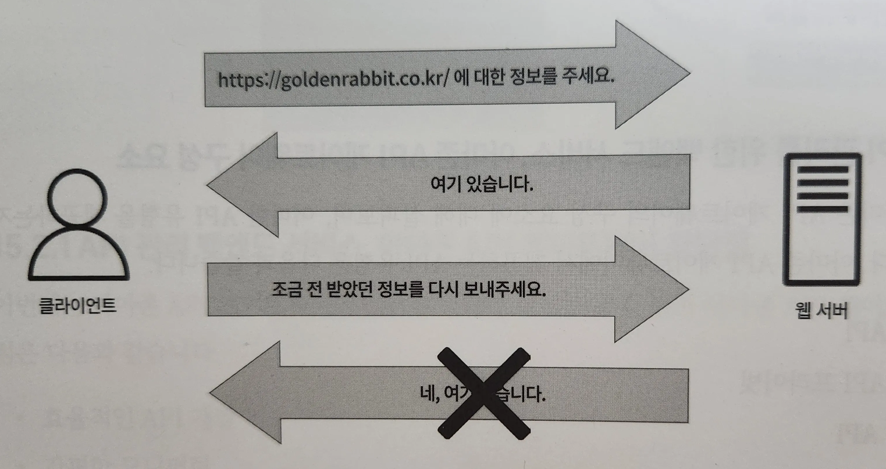
- 상태 비저장 : 정보를 교환할 때 상태를 유지하지 않고 요청과 응답을 한 번만 사용해 완료하는 것
- 정보를 교환할 때 상태를 유지하지 않는다.
- 재차 이전 정보를 요청하면 요청에 답을 할 수 없기 때문에 다시 정보를 요청해야 함

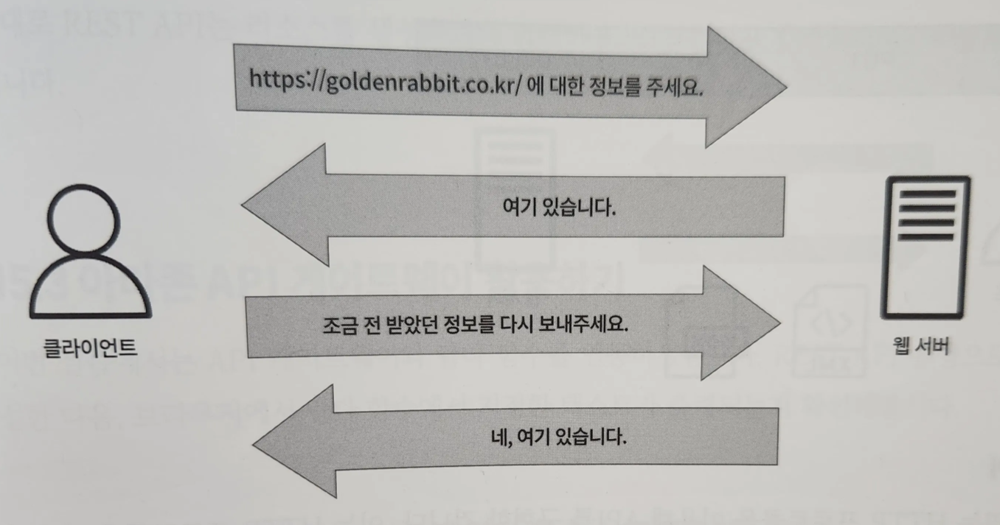
- 상태 저장 : 요청과 응답 간의 상태를 유지해 연속적인 상호작용을 가능하게 한다.

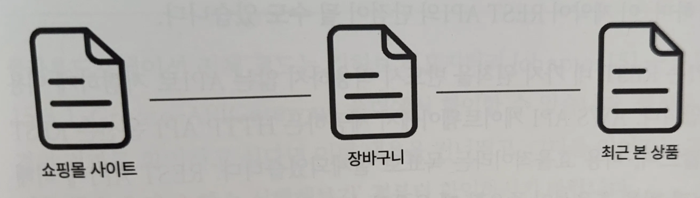
- 연결성 : 정보 내에 다른 리소스에 대한 링크가 포함되어 있음
- ex. 쇼핑몰 메인 페이지에서 장바구니, 최근 본 상품 등 다양한 링크가 기재되어 있으며 이런 링크를 클릭하면 해당 정보에 접근할 수 있다.

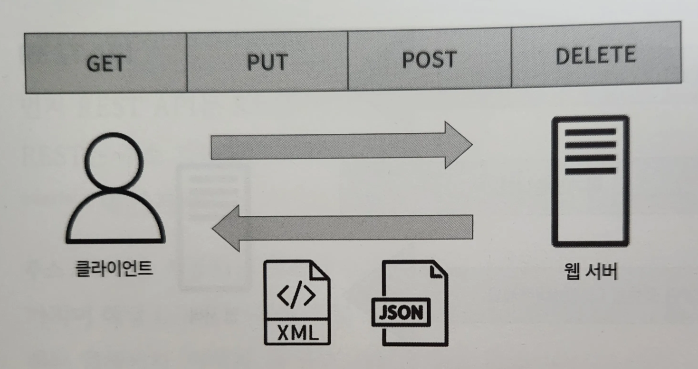
- 통일 인터페이스 : 미리 정의한 공유 방식
- 통일 메서드를 사용해 정보 조작 (ex. HTTP 메서드(GET, PUT, POST, DELETE))
- 서버와 클라이언트가 공통 인터페이스를 가지며 특정 정보에 일관된 방식으로 접근 가능

- 이렇게 생성한 API를 바탕으로 람다 함수를 실행허거나 데이터베이스의 쿼리를 작성, 애플리케이션을 호출할 수 있다.
- REST API 프라이빗 : REST API와 동일하지만 VPC 내에서만 접근할 수 있도록 제한된 API
- 리소스를 생성하거나 검색하고 업데이트 및 삭제와 같은 작업에 적합

### HTTP API

> HTTP API : HTTP 프로토콜을 사용하는 애플리케이션 간의 통신을 제공하는 규칙


- 개발자가 직접 URL과 HTTP 메서드를 설계해야 하기 때문에 API 간의 통일성이 부족할 수 있다.
- REST API는 HTTP API의 한 종류
    - 시스템의 확장성과 독립성을 향상시키지만, 일관성과 통일성을 유지하려면 제약을 지켜야 함
- HTTP API는 REST 네 가지 원칙을 반드시 적용하지 않는다.
- AWS API 게이트웨이에서 제공하는 HTTP API 옵션은 REST API에 비해 대기 시간이 짧으며, 비용 효율적이다.

### 웹소켓 API

> 웹소켓 : 양방향 통신 프로토콜

- HTTP 프로토콜과 달리 통신이 설정된 이후 서버와 클라이언트 간 자유롭게 데이터를 교환 가능
- 요청마다 새 연결을 만들 필요가 없으며 하나의 TCP 연결로 통신할 수 있다.
- 송신과 수신을 동시에 실시 → 실시간 데이터 교환 가능
- HTTP에 비해 헤더가 작아 통신 효율이 좋아진다.
- 서버와 클라이언트가 양방향 통신을 하고, 상태 저장으로 연결이 설정되면 통신이 계속 이어진다.
- 실시간성이 높아 즉각적인 통신이 가능해 주로 채팅, 게임 등에서 사용

# 아마존 API 게이트웨이 활용하기

- API 게이트웨이와 람다 함수를 연동해보자
- REST API 유형으로 API를 생성한 다음, 브라우저에서 람다 함수에서 지정한 텍스트 출력 확인

## API 게이트웨이를 활용해 람다 함수 실행해보기

https://github.com/classmethodjaewook/aws-developer/tree/main/chapter15

1. 람다 함수와 API 게이트웨이를 통합한다.

```yaml
# APIGateway.yml

  LambdaInvokePermission:
    Type: AWS::Lambda::Permission # 람다 함수와 API 게이트웨이 통합 코드 작성
    Properties:
      Action: lambda:InvokeFunction # 람다 함수에서 사용할 수 있는 작업 정의 (여기서는 지정된 람다 함수 사용)
      FunctionName: !Ref LambdaFunction # 대상이 되는 람다 함수 지정
      Principal: apigateway.amazonaws.com # 람다 함수를 호출하는 AWS 서비스 지정
      SourceArn: # API 게이트웨이의 Arn 입력
        Fn::Sub: arn:aws:execute-api:${AWS::Region}:${AWS::AccountId}:${ApiGatewayRestApi}/*/ANY/
```

2. API 게이트웨이 생성
- API를 람다 함수로 라우팅하는 API 게이트웨이 생성

```yaml
# APIGateway.yml

  ApiGatewayRestApi:
    Type: AWS::ApiGateway::RestApi # API 유형을 REST API로 선택
    Properties:
      Name: !Sub ${SystemName}-${EnvName}-api
      EndpointConfiguration:
        Types:
          - REGIONAL # API 엔드포인트 유형은 지역(REGIONAL)로 설정
```

3. API 게이트웨이의 메서드 생성

```yaml
# APIGateway.yml

  ApiGatewayMethod:
    Type: AWS::ApiGateway::Method # Get 혹은 Post와 같은 요청을 받았을 때, 생성한 람다 함수로 라우팅하도록 설정
    Properties:
      AuthorizationType: NONE
      HttpMethod: ANY
      ResourceId: # API 게이트웨이에서 리소스를 고유하게 식별하는 데 사용하는 식별자
        Fn::GetAtt: [ApiGatewayRestApi, RootResourceId]
      RestApiId:
        Ref: ApiGatewayRestApi
      Integration: # 람다로 라우팅해야 하므로 Integration 옵션 지정해 람다와 API 게이트웨이 통합
        Type: AWS_PROXY
        IntegrationHttpMethod: POST
        Uri: # 통합할 람다 함수 지정
          Fn::Join:
            - ""
            - - "arn:"
              - Ref: AWS::Partition
              - ":apigateway:"
              - Ref: AWS::Region
              - ":lambda:path/2015-03-31/functions/"
              - Fn::GetAtt:
                  - LambdaFunction
                  - Arn
              - "/invocations"
      MethodResponses:
        - StatusCode: 200
```

4. API를 배포한다.

```yaml
# APIGateway.yml

  ApiGatewayDeployment:
    Type: AWS::ApiGateway::Deployment
    Properties:
      RestApiId: !Ref ApiGatewayRestApi
      StageName: !Sub ${SystemName}-${EnvName}-stage
    DependsOn: # 메서드가 먼저 생성되기까지 기다린 다음, 배포 진행 / 특정 리소스가 다른 리소스에 의존할 때 사용 -> 특정 리소스가 다른 리소스가 모두 생성된 후에 생성되도록
      - ApiGatewayMethod
```

## UI로 불러와 API 게이트웨이를 활용해 람다 함수 실행해보기

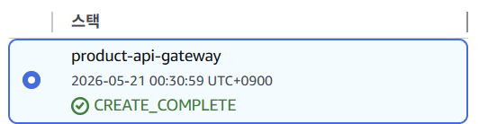
1. 람다 함수 이벤트를 생성하고 실행 결과 확인
- 람다 콘솔 화면으로 진입해 생성된 람다 함수 확인
- [Test] 클릭해 이벤트를 생성하고, 생성한 이벤트를 바탕으로 재차 [Test] 클릭

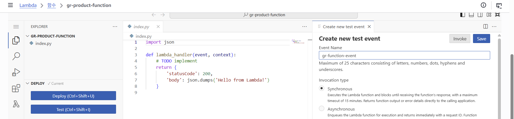
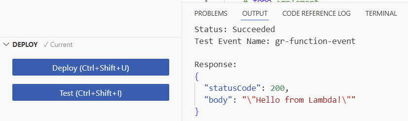
2. API 게이트웨이 콘솔 화면 진입
- [API] 카테고리 클릭하여 생성된 API를 확인하고 클릭한다.
- 생성된 API를 클릭하면 [리소스] 카테고리가 표시되며, 해당 리소스 카테고리를 클릭하면 생성된 메서드를 확인할 수 있다.

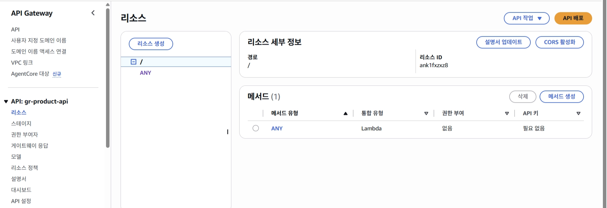
3. 생성한 스테이지 확인
- 클라우드포메이션에서 `AWS::apigateway::Deployment`를 생성해 배포를 진행했기 때문에 API가 배포되어 스테이지가 생성되었다.
- [스테이지]를 클릭하면, 해당 스테이지의 URL을 확인할 수 있다.

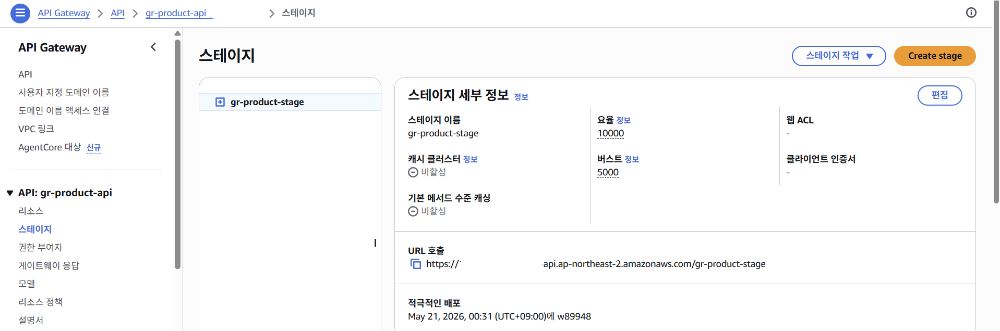

4. API 엔드포인트로 접근
- 람다 함수에서 [구성] 클릭
- [트리거]에서 접속할 수 있는 API 엔드포인트의 URI를 확인할 수 있다.
- 접속할 때는 API 엔드포인트의 URI를 클릭해서 접속
- 해당 URI를 클릭하면 람다 함수에서 지정한 텍스트가 출력된다.

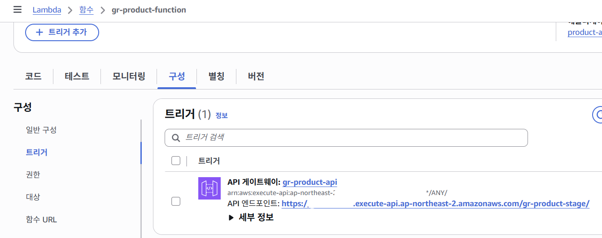

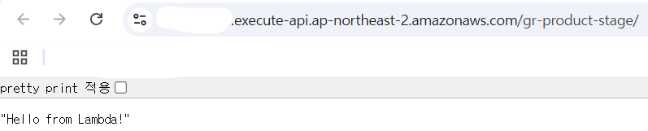