# 유연한 NoSQL 데이터베이스 서비스, 아마존 다이나모DB란?

> NoSQL 데이터베이스는 비관계형 데이터베이스로 SQL을 사용하지 않으며 고정된 스키마가 없다.
>

> 대신 데이터를 고유한 키와 값으로 저장하는 키-밸류 형식이나 JSON과 같은 형식으로 저장할 수 있다.
>
- AWS는 NoSQL 데이터베이스로 아마존 다이나모DB를 제공한다.
- 구조가 단순하여 높은 확장성과 빠른 처리 속도를 제공

→ 실시간 데이터 분석, IoT, 모바일 애플리케이션 등 데이터 처리 작업에 적합

- 확장성 : 수평적 확장이 용이해, 서버를 추가하여 데이터를 처리할 수 있다.
- 유연한 스키마 : 고정된 스키마 없이 데이터를 저장할 수 있어 다양한 자료 형식에 적합
- NoSQL의 특징
    - 고성능 : 대용량 데이터 처리와 높은 읽기/쓰기 성능을 제공
    - 분산 처리 : 데이터를 여러 서버에 분산 저장하여 장애에 강하고 가용성이 높다.
    - 빅데이터 처리에 적합 : 비정형 데이터 및 대규모 데이터를 효율적으로 처리할 수 있다.
- 아마존 다이나모DB의 특징
    - 완전 관리형 : 인프라 관리를 하지 않아도 되는 완전 관리형 NoSQL 데이터베이스
    - 고가용성 및 확장성 : 자동으로 수평 확장이 가능하고, 전 세계적으로 분산된 데이터센터를 통해 고가용성 제공
    - 무제한 스케일링 : 테이블 크기에 제한이 없으며, 성능에 영향을 주지 않고 대규모 트래픽을 처리
    - 초저지연성 : 읽기 및 쓰기 작업에서 매우 낮은 지연 시간(밀리초 단위) 제공
    - 내구성 : 세 개의 가용 영역에 자동으로 데이터를 복제하여 데이터의 내구성을 보장
    - 보안 통합 : AWS IAM(Identity and Access Management)과 통합되어 세부적인 보안 관리 가능
    - 서버리스 모델 : 용량 계획 없이 사용한 만큼만 비용을 지불하는 서버리스 운영

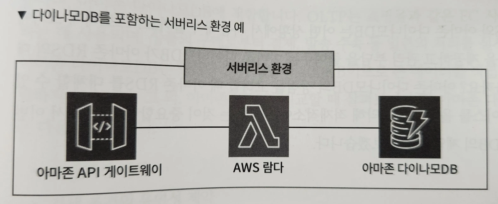

- 아마존 다이나모DB는 아마존 API 게이트웨이와 AWS 람다와 함께 연동해 주로 서버리스 환경을 구축하는 데 사용된다.

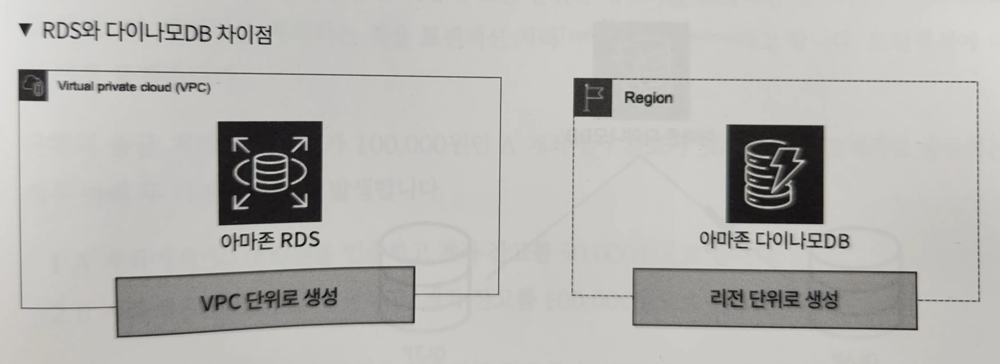
- 아마존 RDS의 경우 네트워크를 설계해 VPC를 생성하고, 별도의 구축 과정과 인스턴스 유형, 스토리지 용량 조정 등을 고려해야 한다.
- 그러나 아마존 다이나모DB는 이런 복잡한 설정 필요X
- 아마존 RDS를 생성하려면 먼저 VPC를 설계하고 구축해야 하며 이렇게 구축한 아마존 RDS는 VPC 내부에 생성된다.
- 반면 아마존 다이나모 DB는 VPC 설계 없이도 생성 가능, 리전 단위로 관리
- 운영해서도 OS 패치 적용과 같은 정기 유지보수는 AWS에서 직접 처리
- 데이터의 용량과 트래픽이 증가하더라도 퍼포먼스가 떨어지는 일은 거의 없기 때문에 성능관리나 확장 대응을 위한 별도의 시스템 운영 부담이 줄어든다.
- 서버와 같은 인프라 유지보수를 클라우드에 맡겨 개발자는 온전히 개발에 집중할 수 있으며, 서버리스의 장점을 최대한 살리 수 있는 것이 아마존 다이나모DB

# 유연한 NoSQL 데이터베이스 서비스, 아마존 다이나모DB 살펴보기

- 아마존 다이나모DB와 아마존RDS는 어떤 상황에서 사용해야 할까?
- 유스 케이스를 올바르게 파악해 적재적소에 사용하는 것이 중요

## 유연한 NoSQL 데이터베이스 서비스, 아마존 다이나모DB 제약

> 아마존 다이나모DB는 키밸류 형태의 NoSQL 데이터베이스이므로 OLAP(Online Analytical Processing)라고 하는 데이터 분석 처리에는 적합하지 않다.

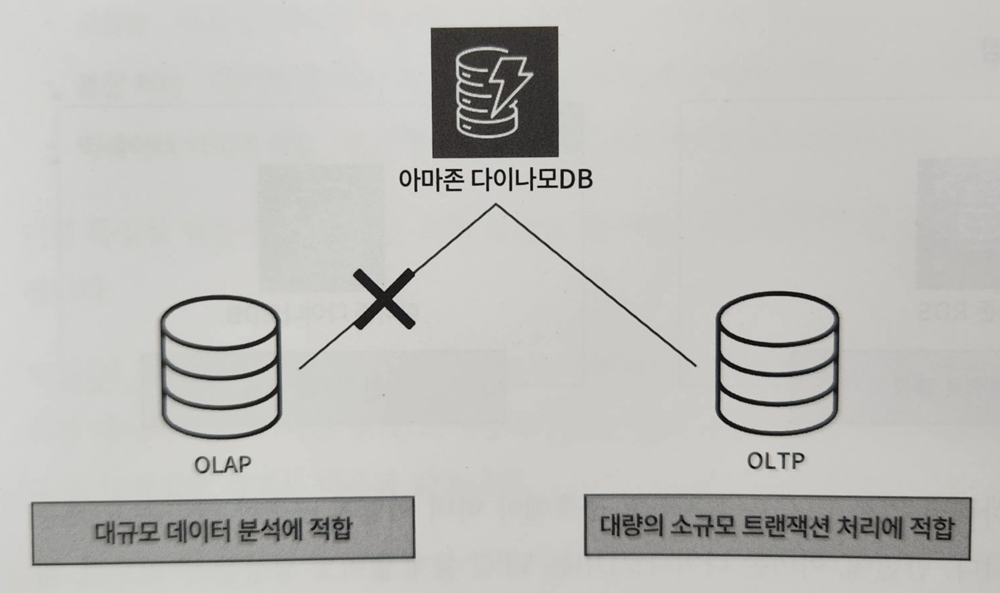

- OLAP : 데이터를 다차원적으로 분석하고 그 결과를 신속하게 사용자에게 반환하는 기법 또는 도구
    - ex. 시장 분석, 성과 관리 등
    - Online : 실시간으로 분석한 결과를 반환하는 것
    - 대규모 데이터 분석에 적합하기 때문에 아마존 다이나모DB와는 어울리지 않는다.
    - 반대로 미리 정해진 시간에 처리하는 것을 배치 처리라고 한다.
- OLTP(Online Transaction Processing) : 주로 트랜잭션 처리 및 실시간 데이터 읽기 및 쓰기에 중점을 둔 작업
    - 소규모 데이터를 대량으로 처리하는 데 탁월한 기술이며, 아마존 다이나모DB에 적합
    - 쇼핑몰과 같은 EC 사이트에서 구매를 처리하는 데 사용되며, 상품의 구매로부터 결제, 발송 수속 등 일련의 처리를 실시할 수 있다.
- 아마존 다이나모DB는 항목당 크기 상한이 400KB이므로 큰 데이터를 직접 저장하는 용도로는 적합하지 않다.
- 아마존 RDS와 비교할 때 살펴보아야 할 아마존 다이나모DB의 제약사항
    - 트랜잭션 제약
    - 검색 조건의 유연성 제약
    - JOIN 제약

> 트랜잭션(Transaction) : 여러 프로세스를 하나로 모은 단위와 데이터


- 이렇게 모은 단위와 데이터를 트랜잭션 데이터(Transaction data), 이 데이터를 처리하는 것을 트랜잭션 처리(Transaction Processing)라고 한다.

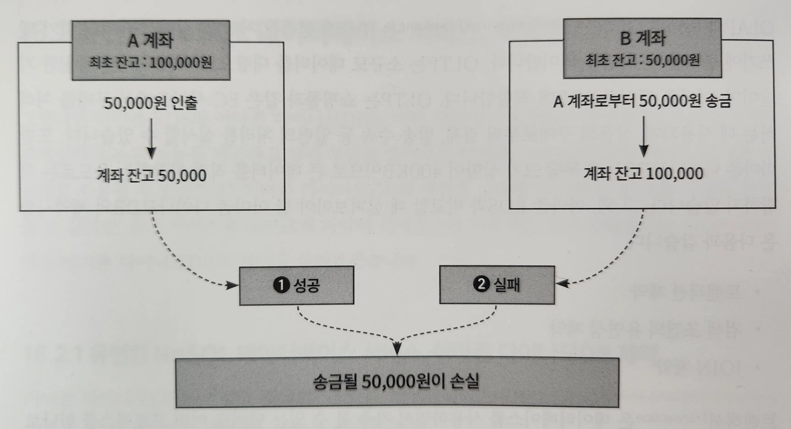
- ex. 은행의 송금 처리에서 잔고가 100,000원인 A 계좌에서 잔고가 50,000원인 B계좌로 송금하는 경우 아래 두 가지의 처리가 발생한다.
    1. A 계좌에서 50,000원을 인출하고 계좌 잔고를 50,000원으로 한다.
    2. B 계좌에 50,000원을 송금하고, 계좌 잔고를 100,000원으로 한다.
    - 여기서 A 계좌에서 50,000원을 인출하고 잔고를 50,000원으로 했지만, B 계좌 송금에 실패했다고 가정하면, A 계좌로부터 B 계좌로 송금될 50,000원이 소실되어 버리며, 이 두 가지 처리를 독립시키는 것은 부정합 처리가 발생할 위험이 있다.

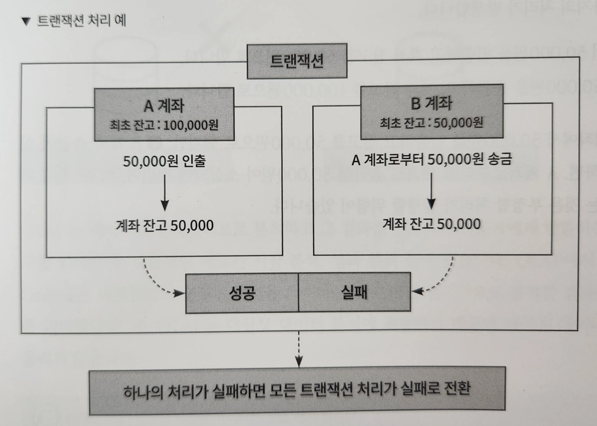
- 이런 사태를 막고자 등장한 것이 트랜잭션 처리
- 트랜잭션 처리는 두 개 이상의 처리를 합쳐 트랜잭션 내의 모든 작업이 성공해야만 트랜잭션 처리가 완료된다.
- 만일 어떤 작업이라도 실패한다면 이전에 수행된 작업은 모두 취소되어 데이터베이스를 이전 상태로 되돌린다.
- 이런 방식으로 데이터베이스의 무결성을 보장할 수 있다.
- 아마존 다이나모DB은 이런 트랜잭션 처리를 지원하고 있으며, 현재 단일 트랜잭션 내의 개별 작업을 최대 100건까지 설정할 수 있다.
- 구성한 아마존 RDS의 스펙에 따라 다르지만, 수천 혹은 수백만 개의 트랜잭션을 처리할 수 있는 아마존 RDS에 비하면 적은 처리 양이다.
- 아마존 다이나모DB는 테이블의 데이터에 효율적으로 접근하기 위해 기본키 속성에 대한 인덱스를 만들어 유지한다.
- 따라서 애플리케이션은 기본키의 값을 지정해 신속하게 데이터를 검색할 수 있다.
- 아마존 다이나모DB는 두 가지 유형의 보조 인덱스를 지원하는데, 글로벌 보조 인덱스와 같은 인덱스 구조로 인해 많은 검색 패턴에 대응이 가능하지만 SQL에 비하면 유연성이 부족하다.
- SQl은 다양한 JOIN 및 복잡한 쿼리 패턴을 활용해 데이터를 유연하게 검색할 수 있지만, NoSQL 데이터베이스에서는 일반적으로 JOIN 연산이 지원되지 않거나 제한적이다.
- NoSQL 데이터베이스의 쿼리 언어는 SQL보다 간단하고 직관적이지만, 일부 복잡한 쿼리 패턴을 처리하는 데는 제약이 있을 수 있다.
- 아마존 다이나모DB는 데이터베이스의 인덱스 구조에 크게 의존하므로 검색 조건의 유연성에 제약이 있을 수 있다.
- 아마존 다이나모DB로 복수 테이블을 취급할 수도 있지만, 이 테이블 간의 JOIN은 할 수 없다.
- JOIN : 두 개 이상의 테이블을 연결해 데이터를 검색하는 방법
- JOIN을 할 수 없기 때문에 여러 번 쿼리를 실행해 데이터를 결합하거나 단일 테이블에 항목을 정리해 데이터를 취득할 수 있도록 설계해야 한다.
- 가능한 단일 테이블에 항목을 정리하는 것을 싱글 테이블이라고 하며, 이 싱글 테이블은 아마존 다이나모DB의 설계 지침 중 하나이다.
- NoSQL 데이터베이스는 일반적으로 단순한 키값 쌍 구조를 가지며 JOIN 연산을 지원하지 않는다.

| 구분    | 아마존 다이나모DB                                    | 아마존 RDS                                            |
|-------|-----------------------------------------------|----------------------------------------------------|
| 유형    | NoSQL                                         | SQL                                                |
| 관계 조건 | 사전에 지정된 키 또는 인덱스로만 검색 가능                      | SQL 문을 사용하여 관계 검색 가능                               |
| 검색 처리 | JOIN 연산을 지원하지 않기 때문에 복잡한 검색 처리를 할 수 없음        | JOIN 연산을 통한 복잡한 검색 처리 가능                           |
| 확장성   | 높은 확장성(오토 스케일링)을 제공하여 많은 양의 트래픽 처리 가능         | SQL 기반 쿼리 처리는 뛰어나지만, 리드 복제본 생성 등 스케일에 대한 추가 설정이 필요 |
| 사용 사례 | 실시간 애플리케이션, 모바일 애플리케이션 및 IoT 디바이스의 데이터 관리에 적합 | 복잡한 관계와 일관된 트랜잭션 처리가 필요한 비즈니스 애플리케이션 및 금융 시스템에 적합  |

## 유연한 NoSQL 데이터베이스 서비스, 아마존 다이나모DB 구성 요소

### 파티션과 키

> 아마존 다이나모DB 데이터 : 파티션을 저장하고 분산하는 단위
>
- 여러 파티션에 분산되어 저장된다.
- 데이터가 어느 파티션에 저장되었는지는 파티션 키를 바탕으로 결정된다.
- 정렬 키가 설정된 경우 데이터는 파티션 내에서 정렬 키를 기준으로 정렬되어 물리적으로 가깝게 배치
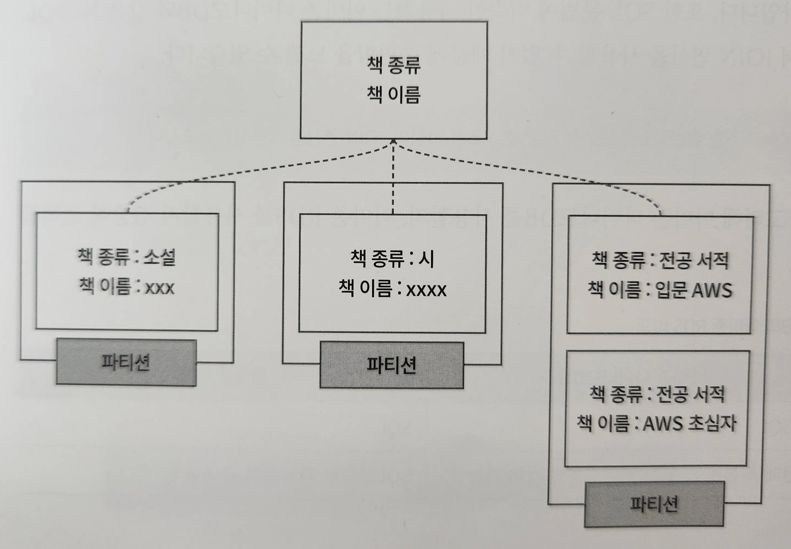

- ex. 책을 관리하는 테이블이 있다고 가정
- 각 책의 종류가 파티션 키로 사용될 수 있다.
- 각 파티션에는 해당 종류의 책에 대한 여러 속성(책 이름 등)이 저장된다.
- 정렬 키로는 책 이름을 선택할 수 있으며, 이렇게 선택된 정렬 키를 바탕으로 같은 종류의 책이 해당 파티션에 모두 저장되고 책 이름에 따라 각 항목이 정렬된다.
- 이를 통해 데이터베이스에서 책 종류와 이름에 따라 효과적으로 조회와 정렬을 할 수 있다.
- 기본키 : 데이터를 고유하게 식별하는 키
    - 파티션 키 또는 파티션 키와 정렬 키의 복합 키
- 기본적으로 데이터를 읽고 쓰는 것은 기본키를 지정해 수행되며, 데이터 접근의 특징에 따라 파티션 키와 정렬 키를 적절하게 설계하는 것이 좋다.

### 보조 인덱스

- 테이블의 파티션 키와 정렬 키만으로 충분하지 않은 경우 다른 파티션 키와 정렬 키를 설정할 수 있는 기능인 글로벌 보조 인덱스, 로컬 보조 인덱스 기능을 제공
- ex. 게임 점수를 저장하는 게임 스코어 테이블이 있다고 가정

| 사용자 아이디     | 게임 이름 | 최고 스코어 | 플레이 시간   | 날짜         |
|-------------|-------|--------|----------|------------|
| KimJaewook  | 테트리스  | 4560   | 17:24:32 | 2024-03-10 |
| KeumSangwon | 스코어러  | 5300   | 12:32:55 | 2022-05-08 |
| ChoiHyemin  | 브루마블  | 5500   | 43:20:05 | 2025-08-04 |
- 파티션 키 : 사용자 아이디 / 정렬 키 : 게임 이름
- 각 게임의 최고 점수를 가진 사용자를 찾아내고 싶은 겨우
    - 게임 이름을 파티션 키로 지정하고, 최고 스코어를 정렬 키로 다른 테이블을 생성

| 게임 이름 | 최고 스코어 | 사용자 아이디     |
|-------|--------|-------------|
| 테트리스  | 4560   | KimJaewook  |
| 스코어러  | 5300   | KeumSangwon |
| 브루마블  | 5500   | ChoiHyemin  |
- 이렇게 생성한 테이블을 바탕으로 각 게임의 최고 스코어를 가진 사용자를 효율적으로 찾아낼 수 있다.
- 보조 인덱스 : 어느 한 테이블을 바탕으로 다른 파티션 키와 정렬 키 테이블을 작성하는 구조
- 로컬 보조 인덱스 : 어느 한 테이블을 바탕으로 파티션 키는 유지하며, 다른 정렬 키를 지정해 테이블을 작성하는 것

| 포럼 이름    | 주제                | 마지막 수정 시간           | 강사          |
|----------|-------------------|---------------------|-------------|
| DynamoDB | 초심자를 위한 다이나모DB    | 2024-03-10 16:32:42 | KimJaewook  |
| RDS      | 초심자를 위한 RDS       | 2024-02-23 19:43:12 | KeumSangwon |
| EC2      | EC2 잘하는 엔지니어 되는 법 | 2024-03-03 04:10:32 | ChoiHyemin  |
- 포럼 이름을 파티션 키로 주제를 정렬 키를 가지는 테이블
- 각 포럼마다 과거 갱신이 있었던 주제의 리스트를  표시하고 싶음.

| 포럼 이름    | 마지막 수정 시간           | 주제                |
|----------|---------------------|-------------------|
| DynamoDB | 2024-03-10 16:32:42 | 초심자를 위한 다이나모DB    |
| RDS      | 2024-02-23 19:43:12 | 초심자를 위한 RDS       |
| EC2      | 2024-03-03 04:10:32 | EC2 잘하는 엔지니어 되는 법 |
- 이 경우 파티션 키는 그대로 포럼 이름을 유지하며, 정렬 키를 마지막 수정 시간으로 변경한 상태로 테이블을 생성
- 새로운 테이블에 주제 추가
- 주의할 점 : 글로벌 보조 인덱스는 테이블 작성 후 설정 가능, 로컬 보조 인덱스는 테이블을 생성할 때 설정

### 아마존 다이나모DB 엑셀러레이터

> 아마존 다이나모DB 엑셀러레이터 : 다이나모DB와 호환되는 완전 관리형 인메모리 캐시 서비스


- 밀리초에서 마이크로초로 퍼포먼스를 올려 고속화할 수 있다.

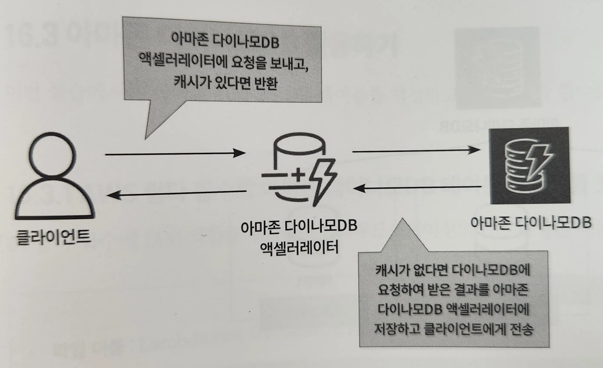
- 먼저 클라이언트가 아마존 다이나모DB 엑셀러레이터로 요청을 보낸다.
- 아마존 다이나모DB 엑셀러레이터에 캐시가 있다면 결과를 클라이언트로 반환하고, 없다면 아마존 다이나모DB에 요청을 한다.
- 마지막으로 다이나모DB로부터 요청받은 결과를 아마존 다이나모DB 엑셀러레이터에 보존하고 결과를 클라이언트로 반환한다.

### 용량 모드

- 프로비저닝 모드 : 오토스케일링 기능 사용 가능
    - 일정 시간 내 네트워크상에서 전송되는 데이터량의 변화에 따라 용량을 자동으로 조정해준다.
- 온디맨드 모드 : 읽기 및 쓰기 용량 설정X
    - 자동으로 용량을 스케일링해 트래픽 처리 → 트래픽을 예측할 수 없을 때 유용
- 프로비저닝 모드 : 읽기와 쓰기 용량 설정O
    - 설정한 용량을 상한으로 트래픽을 처리
    - 트래픽을 예측할 수 있을 때 유용
    - 오토스케일링을 사용해 용량을 자동으로 조정할 수 있다.

### 가용성과 내구성

- 아마존 다이나모DB는 다중 AZ를 지원한다.
- 같은 리전 내 3개의 가용 영역간 데이터가 실시간으로 복제된다.

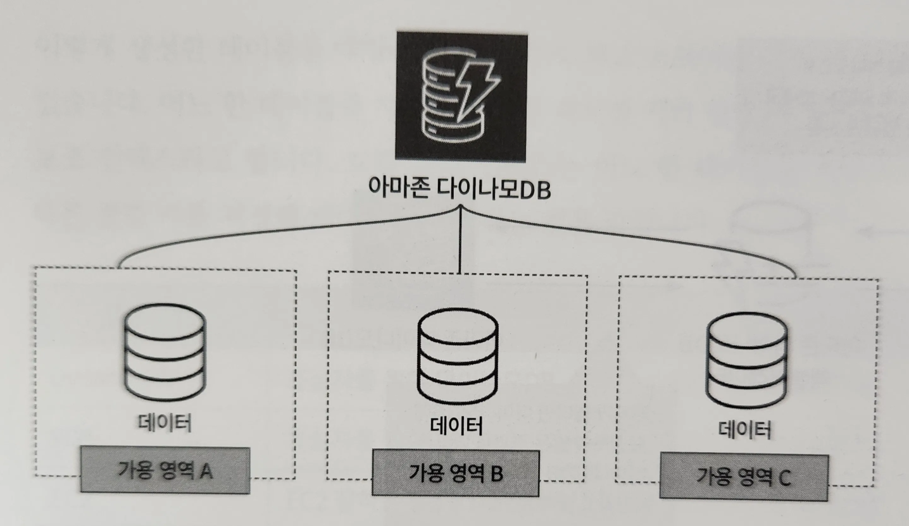
- 글로벌 테이블을 생성해 다중 리전에 걸쳐 테이블을 복제하고 빠르게 읽거나 쓸 수 있으며 높은 가용성을 제공한다.
- 글로벌 테이블을 사용하면 자체적으로 복제 솔루션을 구축하고 관리할 필요 없이 각 리전에 같은 테이블을 생성하고 데이터 변경 내용을 모든 리전에 전파할 수 있다.
- 이는 대규모 애플리케이션에 적합하며, 사용자가 어디에 있든 낮은 대기 시간으로 데이터 제공 가능
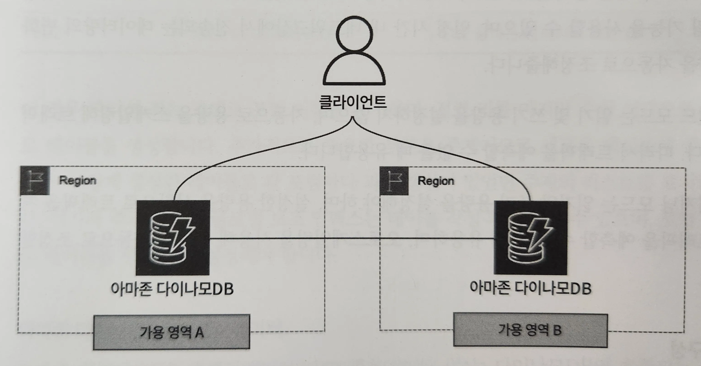

# 아마존 다이나모DB 활용하기

- 아마존 다이나모DB 테이블을 생성하고, AWS 람다 함수로 호출해보자.

## AWS 람다 함수로 아마존 다이나모DB 테이블 데이터를 호출해보기

> Lambda.yml → DynamoDB.yml 순서로 클라우드포메이션 스택을 생성해야 한다.
>

https://github.com/classmethodjaewook/aws-developer/tree/main/chapter16

1. 람다 함수에 권한을 할당할 IAM 역할 생성

```yaml
# Lambda.yml

Service: # 이전에는 ec2.amazon.com으로 지정했지만, 이번에는 AWS 람다에 역할을 할당하기 때문에 lambda 입력
                - "lambda.amazonaws.com"
            Action:
              - "sts:AssumeRole"
      Path: "/"
      ManagedPolicyArns: # 해당 역할에 AWS 관리 정책 할당
        - "arn:aws:iam::aws:policy/AmazonDynamoDBFullAccess" # 다이나모DB에 대한 전체 접근 권한 허용
        - "arn:aws:iam::aws:policy/service-role/AWSLambdaDynamoDBExecutionRole" # 다이나모DB 스트림에 대한 목록 및 읽기 접근 권한 부여
```

2. 다이나모DB 테이블에서 데이터를 호출할 람다 함수 생성

```yaml
# Lambda.yml

  GetDataLambdaFunction:
    Type: AWS::Lambda::Function
    Properties:
      FunctionName: !Sub ${SystemName}-${EnvName}-GetData
      Code: # 람다 함수 코드에는 다이나모DB 테이블을 참조해, 데이터를 스캔 / 스캔한 데이터는 response에 저장해 반환
            # boto3 : 파이썬용 AWS SDK
        ZipFile: |
          import boto3
          dynamodb = boto3.resource('dynamodb')
          table = dynamodb.Table("gr-product-db")

          def lambda_handler(event, context):
              response = table.scan()
              return response['Items']
      Handler: index.lambda_handler
      Role: !GetAtt LambdaIAMRole.Arn # 생성한 IAM 역할을 람다 함수에 연결
      Runtime: python3.12
      Timeout: 30
```

3. 다이나모DB 테이블 생성

```yaml
# DynamoDB.yml

  MyDynamoDBTable:
    Type: AWS::DynamoDB::Table # DynamoDB 테이블의 Id, name, description 항목은 콘솔 화면에서 별도로 생성하도록 합시다.
    Properties: # 테이블의 이름과 파티션 키, 파티션 키의 타입 지정
      TableName: !Sub ${SystemName}-${EnvName}-db
      AttributeDefinitions:
        - AttributeName: id # 파티션 키
          AttributeType: S  # 파티션 키는 문자열
      KeySchema: # 기본키
        - AttributeName: id
          KeyType: HASH
      BillingMode: PAY_PER_REQUEST  # 온디맨드 모드
```

## UI로 불러와 AWS 람다 함수로 아마존 다이나모DB 테이블 데이터를 호출해보기

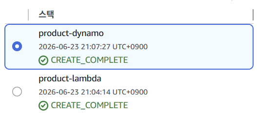
1. 아마존 다이나모DB 콘솔 화면에서 [테이블] 클릭. [작업]에서 [항목 탐색] 클릭. 현재 어떠한 항목도 생성되어 있지 않기 때문에 [항목 생성]을 클릭해 항목 생성 진행

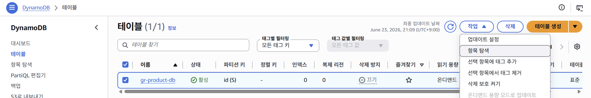
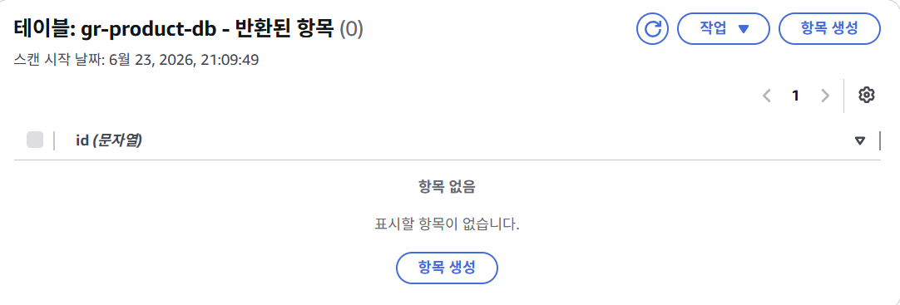
2. 아마존 다이나모DB 테이블 세부 정보 입력. id를 파티션 키로 설정하고 있으며, 추가 속성으로는 name과 description을 가지고 있는 항목을 생성. [새 속성 추가]에서 문자열을 클릭하면 속성이 추가된다. 이어서 속성값을 입력하고 [항목 생성] 클릭.
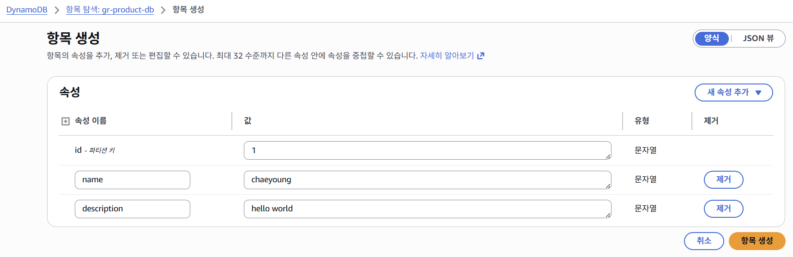

3. AWS 람다 콘솔 화면에서 [함수] 클릭. 생성한 람다 함수 클릭

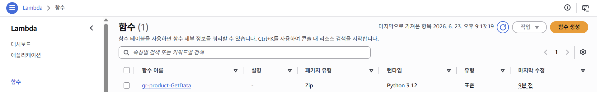
4. 람다 함수를 배포하고 실행해 결과 확인. [Test]를 클릭해 이벤트 핸들러 작성. 함수를 실행하면 다이나모DB 테이블의 항목을 불러오는 것을 확인할 수 있다.

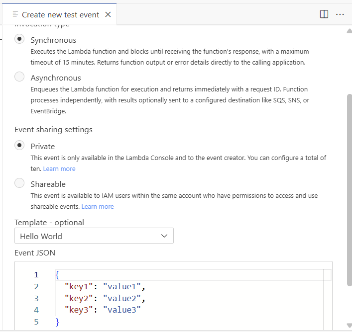
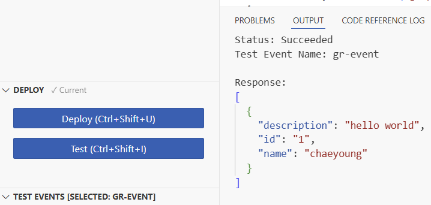