# AWS를 관리하는 서비스 유형 파악하기

- AWS는 구축한 환경을 관리하는 다양한 서비스를 제공하고 있으며, 안정성을 유지하려면 반드시 고려할 서비스도 있다.
- AWS 환경을 효율적으로 관리하고 안정성을 높이는 주요 서비스
    - AWS 백업 : 백업 및 복원 관리 서비스
    - AWS 시스템 관리자 : 인프라 관리 서비스
    - AWS 클라우드워치 : 모니터링 및 로깅 서비스
    - AWS WAF : 외부 공격으로부터 보호하는 방화벽 서비스
    - VPC 플로우 로그 : 네트워크 트래픽 로깅 서비스
    - 관리형 접두사 목록 : 네트워크 구성을 효율화하는 서비스
- 이처럼 다양한 서비스들을 활용해 AWS 환경을 효율적으로 관리하고 모니터링함으로써, 안정적이고 안전한 클라우드 운영을 할 수 있다.

# 백업 및 복원 관리 서비스 파악하기

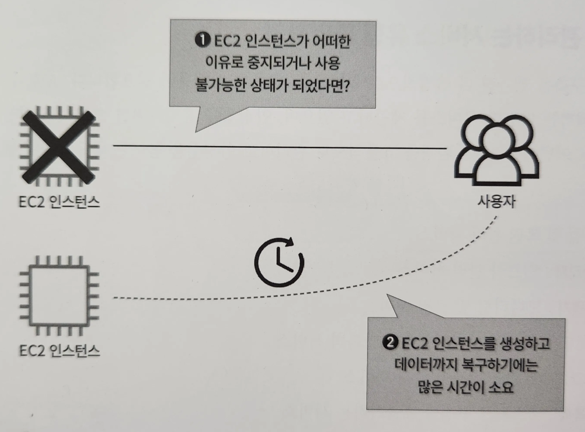
- EC2 인스턴스를 구축하고 운영하는 과정에서 어떠한 이유로 EC2 인스턴스가 중지되거나 사용 불가능한 상태를 가정해보자
- 신속하게 EC2 인스턴스를 생성한다고 하더라도 EC2 인스턴스 내부 데이터까지 복구하기까지 많은 시간이 걸린다.
- AWS에서는 이런 문제를 해결하는 데 유용한 AWS 백업이라는 서비스를 제공

## 백업 및 복원 관리를 위한 서비스, AWS 백업이란?

> AWS 백업 : 백업할 시간대를 지정할 수 있으며, 사용자가 원하는 시점으로 복원할 수 있다.


> 특정 리소스의 문제를 신속하게 해결하고 클라우드 환경을 안정적으로 유지하려면, AWS 백업을 이용한 백업과 복원 절차를 필수적으로 활용해야 한다.
>
- 사용자가 직접 EC2 인스턴스를 새로 생성해 데이터를 복원하는 것보다 훨씬 빠르게 복원할 수 있다.
- 서버내에 바이러스에 감염되어 복원이 필요하다면, 바이러스에 감염되기 전으로 복원할 수 있다.
- 아마존 EC2, RDS, EBS, S3, 오로라, AWS 클라우드포메이션 등 다양한 서비스 백업 및 복원 가능

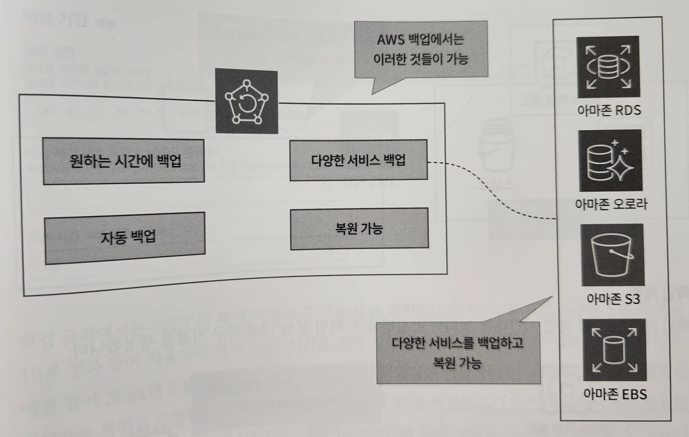
## 백업 및 복원 관리 서비스, AWS 백업 살펴보기

### 백업 볼트

> 백업 볼트 : 백업을 구성하는 컨테이너. EC2 인스턴스를 백업할 때 생성되는 AMI와 스냅샷을 정리해 관리하는 그릇 역할

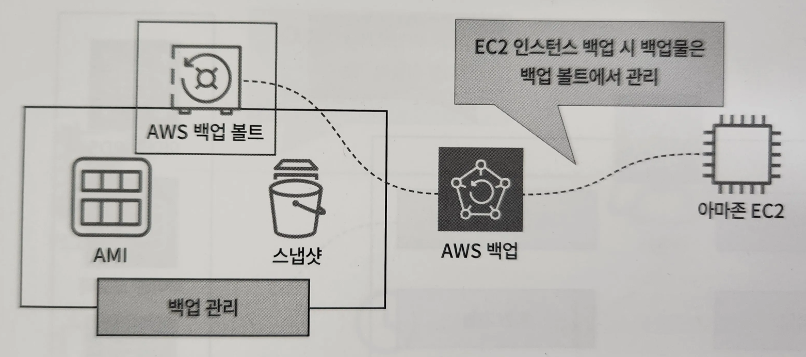

- KMS 암호화를 설정해 데이터를 일관되게 보호할 수 있다.

### 백업 계획

> 백업 계획 : 백업 작업 시간대를 정의하고 실행하며, 백업 볼트 내에 복구 지점을 생성

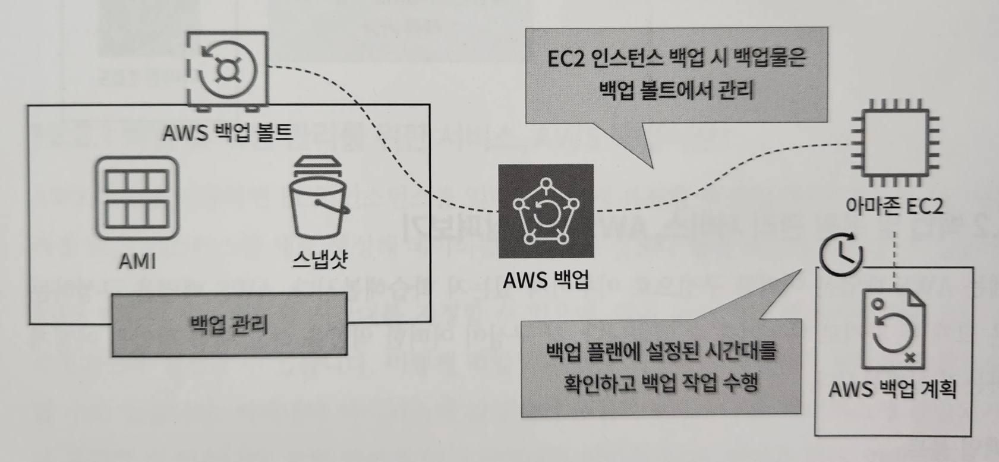

- 백업 계획은 하나 이상의 백업 규칙을 포함하고 있다.
- 백업 규칙에서는 백업 빈도와 백업 시간대, 백업 볼트 등을 지정할 수 있다.
- 백업 빈도 : 시간당 백업을 수행할지, 매일 백업을 수행할지 매주 백업을 수행할지 지정
- 한 번만 백업을 수행하도록 ‘온디맨드 백업(on-demangd backup)을 생성해 백업 작업 수행

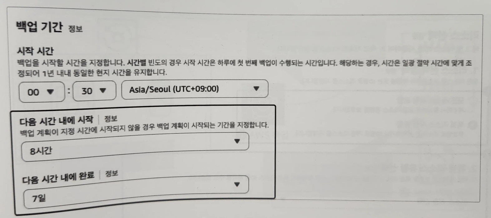
- [다음 시간 내에 시작]과 [다음 시간 내에 완료] 항목을 활용해 백업을 시작하고 종료해야 하는 기간을 정의할 수 있다.
- 지정한 기간 내에 백업이 시작되지 않으면 백업은 만료된 것으로 표시된다.
- 백업 규칙에서는 PITR 즉 특정 시점 복구 기능을 지원한다.
    - 5분 전 혹은 10분 전과 같이 사용자가 특정 날짜, 시간을 정해 원하는 시점으로 복원할 수 있는 것
- 특정 시점 복구는 현재 아마존 RDS와 아마존 S3만 지원

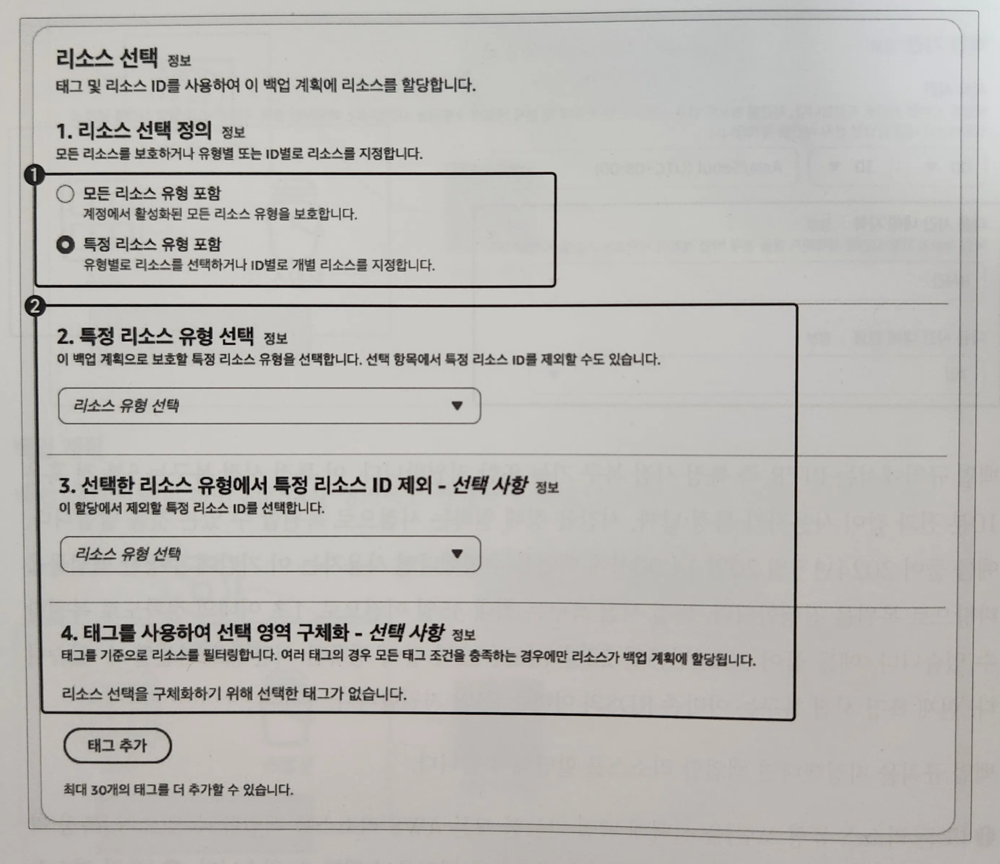
- 백업 규칙을 지정했다면 백업할 리소스를 할당해야 한다.
- [모든 리소스 유형 포함]을 선택해 백업 가능한 모든 AWS 리소스를 백업할 수 있으며 [특정 리소스 유형 포함]을 선택해 사용자가 지정한 리소스만 백업 수행
- [특정 리소스 유형 포함]에는 EC2 인스턴스 혹은 아마존 RDS와 같은 특정 리소스 유형을 선택해 해당 모든 리소스를 백업하거나 사용자가 지정한 리소스만 백업
- 백업에 제외하고 싶은 리소스를 선택할 수도 있으며 태그를 기준으로 특정 태그를 사용하는 리소스를 백업할 수도 있다.

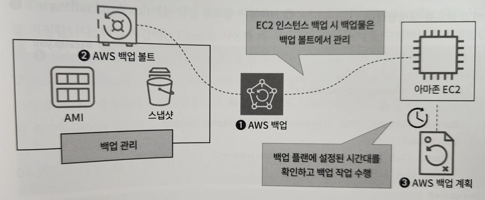
- AWS 백업은 백업 볼트와 백업 계획으로 구성되어 있다.
- 백업 볼트 : 백업 데이터를 저장하고 관리하는 컨테이너 역할
- 백업 계획 : 백업의 주기와 보존 기간 등을 정의
- 이런 구성 설정을 통해 AWS 백업은 아마존 EC2, 아마존 RDS, 아마존 다이나모DB 등 다양한 AWS 리소스를 체계적으로 백업할 수 있다.
- 이를 적절히 활용하면 예상치 못한 데이터 손실에 대비해 중요한 데이터를 안전하게 보호하고, 신속하게 복구할 수 있다.
- AWS 백업의 통합된 관리 기능을 통해 백업 작업을 자동화하고, 백업 정책을 일관성 있게 적용할 수 있어 클라우드 환경을 더욱 안정적으로 운영할 수 있다.

# AWS 백업 활용하기

- AWS 백업을 활용해 EC2 인스턴스를 백업하고 복원해보자.
- 백업에 사용할 백업 볼트와 백업 계획은 클라우드포메이션으로 생성할 수 있지만, 복원 작업은 콘솔 화면에서 수행해야 하므로 클라우드포메이션 스택을 생성하고 콘솔 화면에서 복원 작업 수행

## AWS 백업을 활용해 EC2 인스턴스 백업 및 복원해보기

> VPC.yml → Security_Group.yml → EC2.yml → Backup.yml 순서로 클라우드포메이션 스택을 생성해야 한다.
>

https://github.com/classmethodjaewook/aws-developer/tree/main/chapter19

1. 백업 볼트 생성

```yaml
# Backup.yml

  EC2BackupVault:
    Type: "AWS::Backup::BackupVault" # 백업 볼트 생성
    Properties: # 백업 볼트 이름과 태그 지정
      BackupVaultName: !Sub ${SystemName}-${EnvName}-bv-ec2
      BackupVaultTags:
        Name: !Sub ${SystemName}-${EnvName}-bv-ec2
        Env: !Sub ${EnvName}
```

2. 백업 계획 생성

```yaml
# Backup.yml

  EC2BackupPlan:
    Type: AWS::Backup::BackupPlan # 백업 계획 생성
    Properties:
      BackupPlan: # 백업 규칙 설정
        BackupPlanName: !Sub ${SystemName}-${EnvName}-bp-ec2
        BackupPlanRule:
          - RuleName: !Sub ${SystemName}-${EnvName}-bprule-ec2
            TargetBackupVault: !Ref EC2BackupVault # 백업 볼트 지정
            ScheduleExpression: cron(0 * * * ? *) # 백업 시간대 지정
            ScheduleExpressionTimezone: Asia/Seoul # 서울 기준
            StartWindowMinutes: 60 # 1시간 이내에 백업 시작
            CompletionWindowMinutes: 120 # 2시간 이내에 백업 종료
            Lifecycle: # 백업물을 7일 동안 보관
              DeleteAfterDays: 7
      BackupPlanTags:
        Name: !Sub ${SystemName}-${EnvName}-bp-ec2
        Env: !Sub ${EnvName}
```

3. 백업할 리소스 지정

```yaml
# Backup.yml

  EC2BackupSelection:
    Type: AWS::Backup::BackupSelection
    Properties:
      BackupPlanId: !Ref EC2BackupPlan
      BackupSelection: # 백업할 리소스 지정
        SelectionName: !Sub ${SystemName}-${EnvName}-selection-ec2
        IamRoleArn: !GetAtt EC2BackupRole.Arn # IAM 역할 할당 (백업 수행 + 복원 수행 권한)
        ListOfTags: # 백업은 특정 태그를 사용하는 리소스를 대상으로 하며, 생성한 EC2 인스턴스의 이름을 대상으로 하고 있다.
          - ConditionType: "STRINGEQUALS"
            ConditionKey: Name
            ConditionValue: gr-product-ec2
```

## UI로 불러와 EC2 인스턴스 백업 및 복원해보기

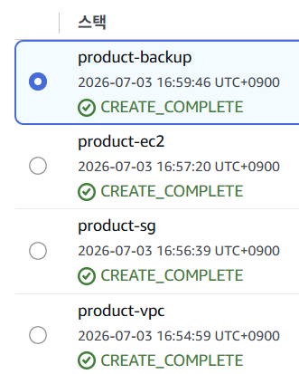
1. 생성된 백업 볼트 확인
- AWS 백업 콘솔 화면으로 진입해 [볼트]를 클릭하면 생성된 백업 볼트를 확인할 수 있다.
- 해당 백업 볼트를 클릭하면 백업 볼트의 상세 정보와 복구 시점 확인 가능

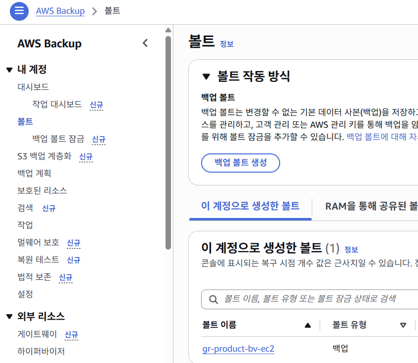
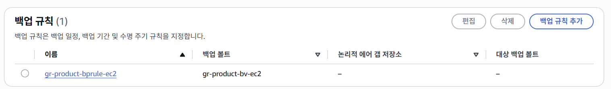
2. 생성된 백업 계획 확인
- [백업 계획] 클릭

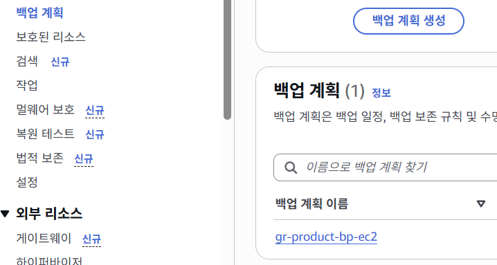

3. 백업 계획에서 백업 규칙 확인

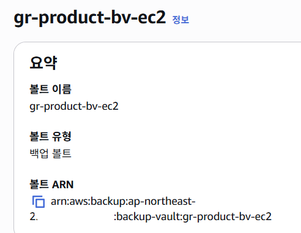
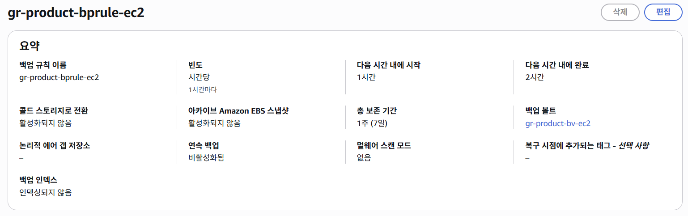
4. 백업 계획에서 할당된 리소스 확인
- [리소스 할당] 클릭하면, 어떠한 리소스를 백업하는지 백업 대상을 확인 가능

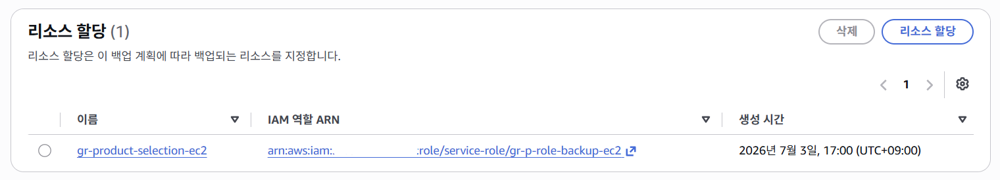
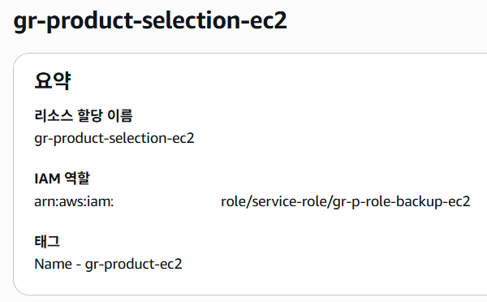
5. 백업 상황 확인
- [작업]을 클릭하면 백업 작업이 수행된 것을 확인할 수 있다.
- EC2 콘솔 화면에서 AMI로 진입하면 AMI가 생성된 것을 확인
- 이렇게 생성된 AMI를 바탕으로 EC2 인스턴스를 생성해 EC2 인스턴스 복원
- 한 시간마다 백업 작업이 진행되므로 백업 작업이 시작하기까지 조금 기다려야 한다.

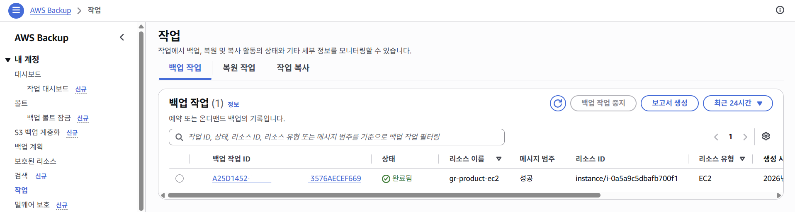
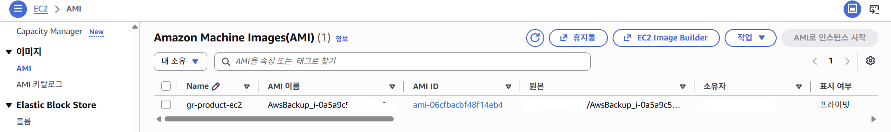
6. 복구 시점 확인
- AWS Backup 콘솔 화면에서 [보호된 리소스]에 들어가 [복구 시점] 확인하면 지정한 시간대에 백업이 완료된 것을 확인할 수 있다.
- [복원]을 클릭하면 복원 페이지로 넘어가게 된다.
- 이 페이지는 백업한 EC2 인스턴스와 같은 설정으로 복원을 진행할 수 있도록 작성되어 있다.
- 하지만 퍼블릭 IP 주소 사용과 같은 미세한 설정은 불가능
    - AWS CLI로 복원하거나 복원된 AMI를 바탕으로 직접 EC2 인스턴스를 생성
- 복구 시점은 [볼트]에서도 확인 가능

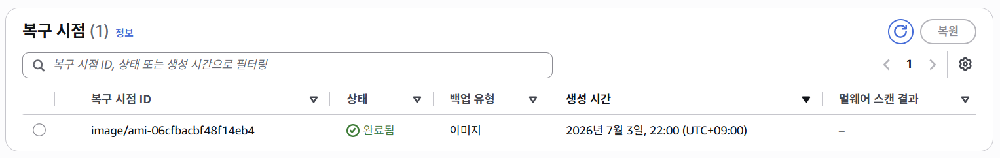
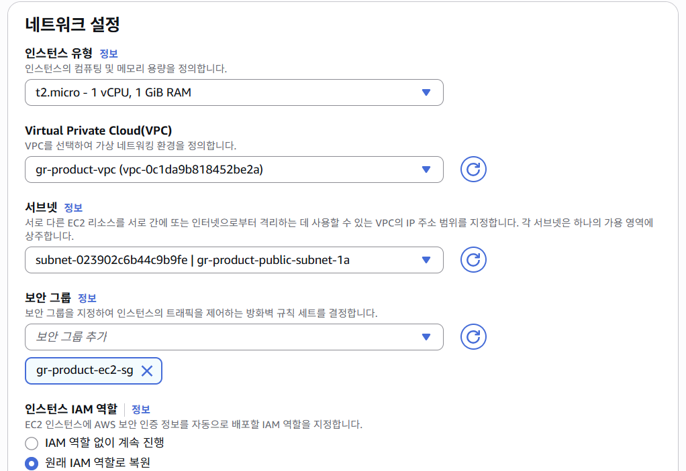
7. 복원 설정값을 확인하고 복원 실시
- 역할 복원에는 [기본 역할] 선택, [보호된 리소스 태그]는 체크하여 백업한 EC2 인스턴스와 같은 태그를 가지도록 한다.
- [백업 복원] 클릭

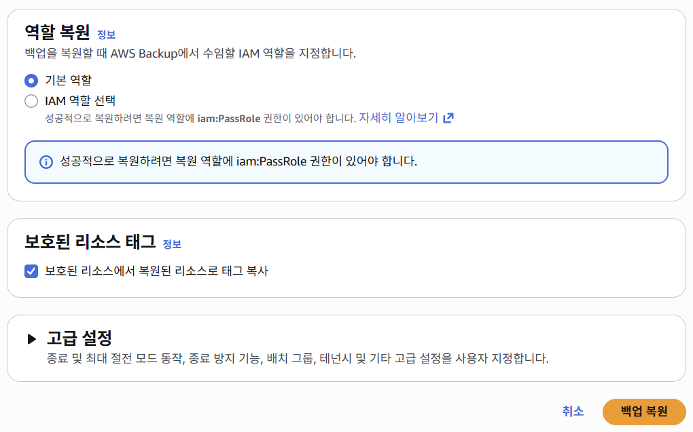
8. 복원 결과 확인
- 복원 작업에서 상태가 [완료됨]이 출력된 다음 [리소스 ID]를 확인
- 이어서 EC2 콘솔 화면에서 인스턴스 목록을 확인하면 EC2 인스턴스가 복원된 것을 확인할 수 있다.

> 복원 : 백업한 결과물과 같은 리소스를 생성하는 것
>

> 복원 후 기존 리소스가 불필요하다면 삭제하거나 중지시켜 추가 비용이 발생하지 않도록 관리 필
>

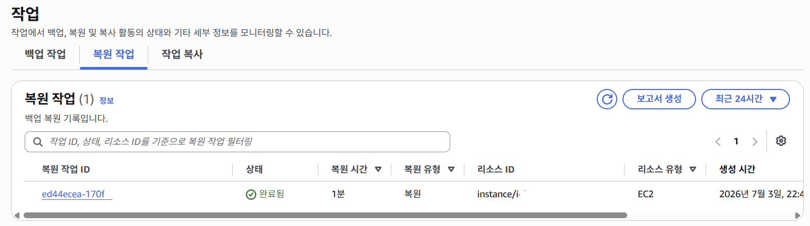
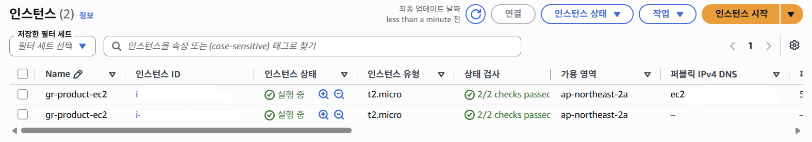