# 네트워크 동작 구조와 원리 파악하기

## 네트워크란 무엇인가?

> 네트워크(Network) : 두 대 이상의 컴퓨터가 연결되어 통신할 수 있는 형태

> 여러 대의 컴퓨터가 통신 기술을 이용하여 그물망처럼 상호 연결되어 있는 구조

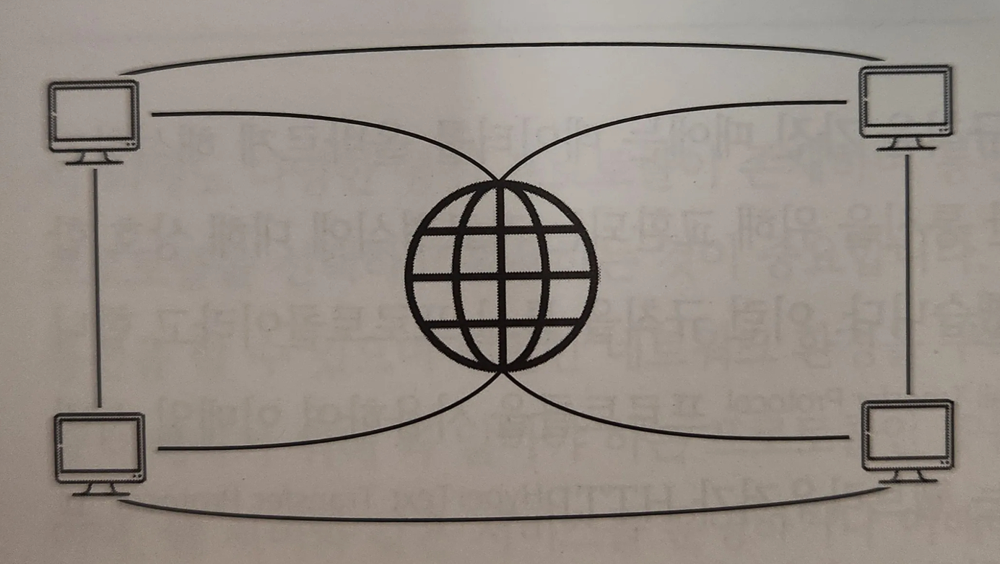
- 네트워크 상에 있는 컴퓨터들은 서로 데이터를 전송하거나 파일을 공유할 수 있음
- 이러한 데이터 통신을 가능하게 하기 위해 네트워크에서는 다양한 프로토콜과 기술을 사용한다.

## 통신 규약, 프로토콜

> 프로토콜(Protocol) : 컴퓨터에서 데이터를 교환하기 위해 정해진 순서나 규약, 신호의 전기적 규칙, 통신에서의 송수신 순서 등을 정한 규칙의 세계

> 통신하기 위해 지켜야 할 약속이자 규칙
>

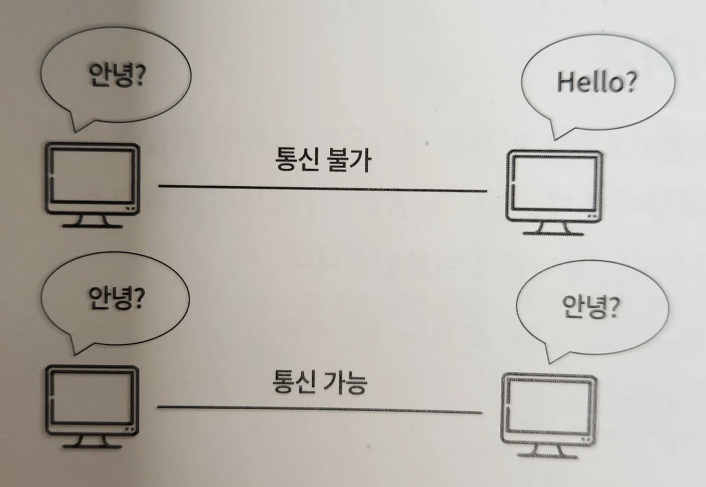
- 컴퓨터 간의 통신에서 서로 다른 규칙을 가진 때에는 데이터를 올바르게 해석하기 어렵다.
- 원활한 통신을 위해 교환되는 자료형식에 대해 상호 합의를 하고 어떤 프로토콜을 사용할지 규칙을 정함
- 이메일을 보낼 때는 SMTP(Simple Mail Transfer Protocol) 프로토콜을 사용
- 홈페이지를 열람할 때는 웹브라우저가 HTTP(HyperText Transfer Protocol) 프로토콜을 사용

| 이름 | 용도 |
| --- | --- |
| IP(Internet Protocol) | 인터넷에서 데이터를 주고받는 프로토콜로 인터넷과 연결된 모든 장치에 고유한 IP 주소를 부여하여 통신합니다. |
| FTP(File Transfer Protocol) | 파일 전송용 프로토콜입니다. |
| SMTP(Simple Mail Transfer Protocol) | 인터넷을 통해 이메일을 주고받는 데 사용되는 프로토콜입니다. |
| HTTP(Hypertext Transfer Protocol) | 인터넷에서 데이터를 주고받기 위해 사용되는 프로토콜입니다. 흔히 웹페이지를 전송에 사용합니다. |
| TCP(Transmission Control Protocol) | 서버와 클라이언트 간에 데이터를 안정적으로 전송하는 연결형 프로토콜입니다. 신뢰성 있는 통신을 보장합니다. |
| UDP(User Datagram Protocol) | 신속한 데이터 전송용 비연결형 프로토콜로 속도를 중시하는 애플리케이션에 적합합니다. |
| DHCP(Dynamic Host Configuration Protocol) | 네트워크에 연결된 장치에 자동으로 IP, 서브넷, 게이트웨이 주소를 할당하는 프로토콜입니다. 일정 기간 주소를 동적 할당 방식으로 임대합니다. |
| ARP(Address Resolution Protocol) | IP 주소를 MAC 주소로 대응하는 프로토콜입니다. |
| RARP(Reverse Address Resolution Protocol) | MAC 주소를 IP 주소로 변환하는 프로토콜입니다. |
| NTP(Network Time Protocol) | 네트워크로 연결된 장치들이 같은 시간을 유지하는 데 사용되는 프로토콜로 네트워크를 통해 컴퓨터 간 시간을 동기화합니다. |
- 통신에 필요한 상황과 요구사항을 고려하여 적절한 프로토콜을 선택하고 활용하는 것이 중요
- 적절한 프로토콜을 이용해 효율적이고 안전한 통신을 할 수 있고 원활한 네트워크 환경을 구축할 수 있다.

## IP

> IP(Internet Protocol) : 인터넷에 연결된 장치를 식별할 수 있도록 각각에 부여된 고유 주소

> 각 IP 주소는 해당 컴퓨터의 신원을 나타내며 이를 기반으로 데이터를 주고받을 수 있다.
>

### IPv4와 IPv6

- IPv4 : 32비트 주소로 약 43억 개의 IP 주소를 제공
    - 전세계적으로 사용된 첫 번째 인터넷 프로토콜이자 현재까지 가장 널리 사용되는 버전
    - 사용자 수가 급증하면서 고갈될 문제 상황에 처함
- IPv6 : IPv4의 주소 체계를 128비트 크기로 확장하여 제공
    - 340간 개의 IP 주소
    - 그러나 현재 대다수의 웹사이트와 네트워크가 아직은 IPv4를 주로 사용하고 있어 기존의 인프라와 호환성 문제 등이 아직 많다.
- AWS는 IPv4와 IPv6 두 가지 버전을 지원하고 있지만 아직까지 IPv4 네트워크 환경 구성이 주를 이루고 있다.

### IP 주소 구조 살펴보기

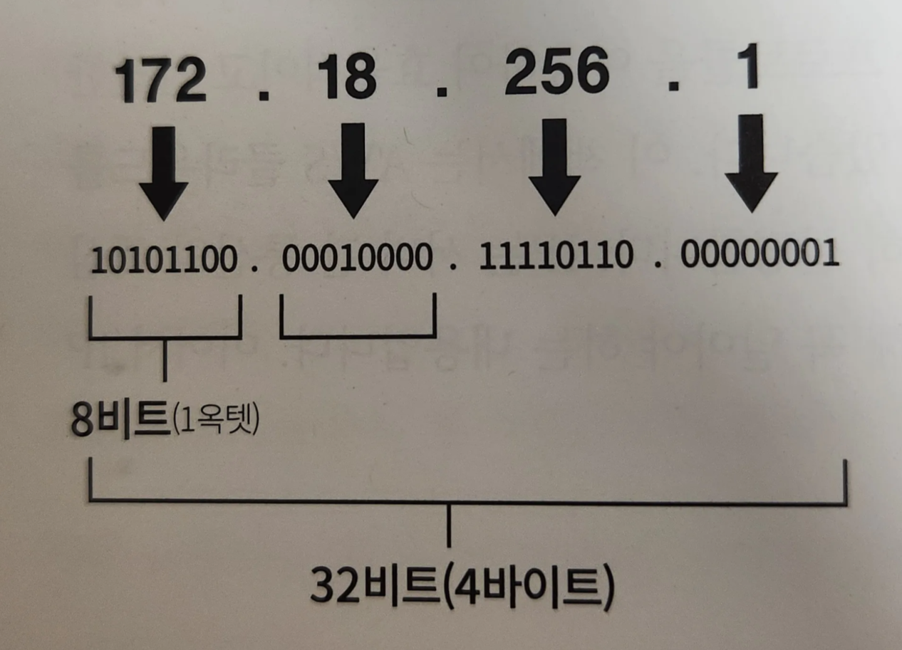
- 우리가 보는 IP 주소는 사람이 이해하기 쉽도록 10진수로 변환하여 사용하고 있지만, 사실은 이진수 32자리로 구성되어 있다.
- IP는 일반적으로 4개의 숫자 사이에 마침표로 구분하여 표시하며, 이 4개의 숫자는 각각 8비트씩 4 그룹으로 나누어졌다.
- 이렇게 8개의 비트가 한데 모인 것을 옥텟(octet)이라 한다.

## IP 주소 체계

- IP 주소 체계에서는 네트워크 주소와 브로드캐스트 주소가 존재하며, 이 주소들은 사용할 수 없는 주소로 간주된다.
- 네트워크 주소 : 해당 네트워크의 첫 번째 주소
    - 네트워크 전체 대역대를 의미하기 때문에 사용할 수 없는 주소
    - ex. 192.168.1.0은 네트워크의 첫 번째 주소로 ‘192.168.1.1 ~ 192.168.1.5는 192.168.1.0의 네트워크에 속해 있다’라고 말할 수 있다.
- 브로드캐스트 주소 : 해당 네트워크의 마지막 주소
    - 해당 네트워크 상의 모든 장치에게 데이터를 전송하는 데 사용되는 주소
      → 브로드캐스트 주소 또한 사용할 수 없음
    - ex. 192.168.1.255는 네트워크 마지막 주소인 브로드캐스트 주소를 나타낸다.

### IP의 종류

- IP 주소는 공인 IP 주소와 사설 IP 주소로 나누어지게 되며, 공인 IP 주소는 인터넷에서 전 세계적으로 유일한 주소로 사용된다.
- 공인 IP 주소와 사설 IP 주소로 나누어진 이유는 IPv4의 주소 고갈 문제 때문
- 모든 네트워크 장치에 공인 IP 주소를 할당하는 것은 현실적으로 불가능
- 인터넷에 직접 연결되는 컴퓨터나 라우터에는 인터넷 서비스 제공업체를 통해 공인 IP 주소를 할당받고, 가정이나 회사 내부의 컴퓨터와 장치들은 사설 IP 주소를 사용
- 사설 IP 주소는 비공개적인 네트워크에서 사용되는 주소 (개인적인 네트워크나 회사 내부 네트워크)

### 네트워크 규모로 나눈 IP 클래스 이해하기

| 클래스 | 네트워크 ID | 공인 IP 주소 범위 | 사설 IP 주소 범위 | 할당 가능한 호스트 ID 수 (IP 수) | 용도 |
| --- | --- | --- | --- | --- | --- |
| A 클래스 | 8비트 | 0.0.0.0 ~ 127.255.255.255 | 10.0.0.0 ~ 10.255.255.255 | 16,777,214 개 | 대규모 네트워크 |
| B 클래스 | 16비트 | 128.0.0.0 ~ 191.255.255.255 | 172.16.0.0 ~ 172.31.255.255 | 65,534 개 | 중형 네트워크 |
| C 클래스 | 24비트 | 192.0.0.0 ~ 223.255.255.255 | 192.168.0.0 ~ 192.168.255.255 | 254 개 | 소규모 네트워크 |
- D와 E 클래스는 멀티캐스트 혹은 연구 및 특수 용도로 사용되므로 일반적으로 A~C 클래스 사용

### 클래스와 네트워크 ID와 호스트 ID 관계

> 클래스에서 네트워크 ID는 특정 네트워크를 식별하는 데 사용된다.
>
- ex. 회사에서 C 클래스의 192.168.1.0 네트워크 주소를 할당했다면, 이 네트워크를 식별하는 네트워크 ID는 192.168.1.0이다.
- 호스트 ID는 네트워크 내에서 특정한 컴퓨터를 식별하는 데 사용된다.

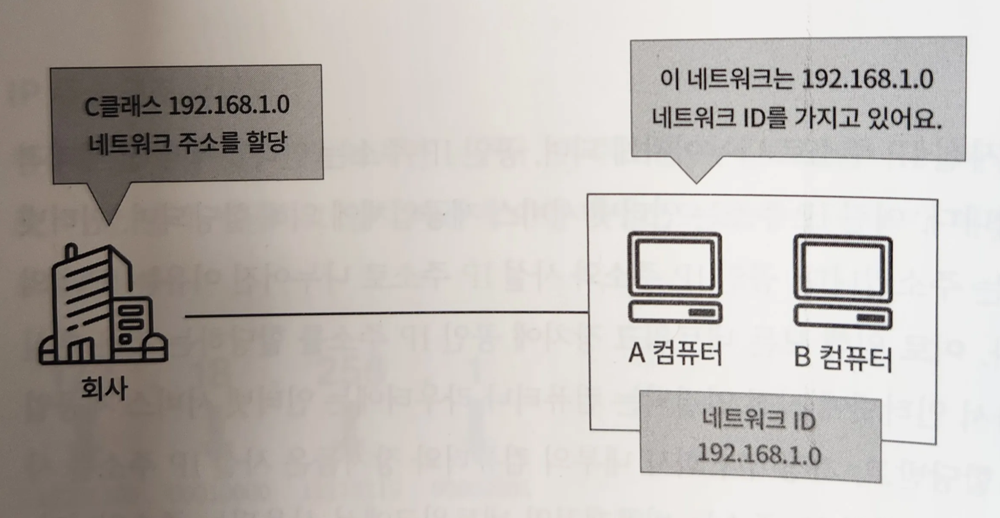
- 네트워크 주소가 192.168.1.0이라면, 네트워크 주소(192.168.1.0)와 브로드캐스트 주소(192.168.1.255)를 제외하고 192.168.1.1~192.168.1.254까지의 IP 주소를 호스트에 할당할 수 있다.
- 따라서 이 192.168.1.0/24 네트워크 대역에서 A 컴퓨터에는 192.168.1.1 IP 주소를 할당하고, B 컴퓨터에는 192.168.1.2 IP 주소를 할당하여 네트워크 내에서 각 컴퓨터를 식별하는 데 사용
- 192.168.1.1과 192.168.1.2는 각각 완전한 IP 주소이며, 이 중 호스트 부분에 해당하는 1과 2가 각 컴퓨터를 구별하는 호스트 ID이다.

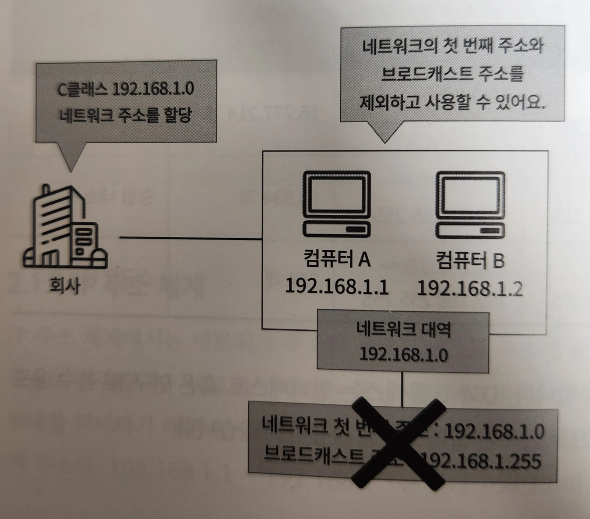
## 서브넷팅

> 서브넷팅(Subneting) : 각 클래스의 네트워크를 작은 단위로 나누어 운영해 네트워크가 혼잡해지는 문제를 해결할 수 있다.

- A 클래스는 매우 큰 네트워크 주소 범위를 가지고 있어 IP 주소 16,777,214개를 할당 가능

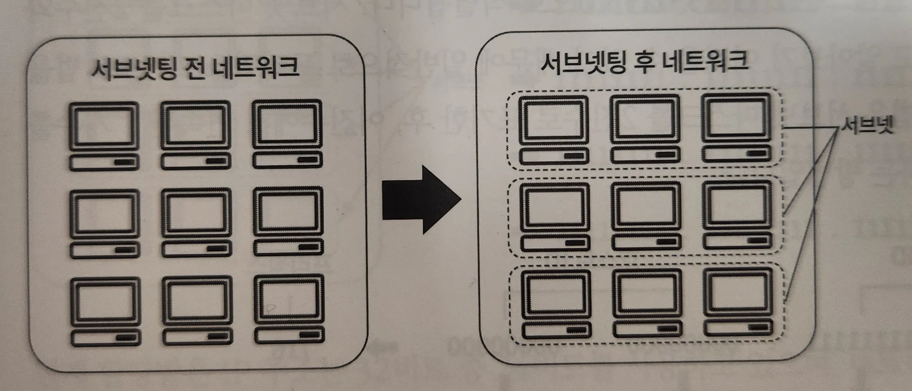
> 주어진 IP 주소 범위를 여러 작은 네트워크로 나누는 과정
>
- 나누어진 각 네트워크를 서브넷(Subnet)이라고 한다.
- 서브넷팅을 통해 작은 단위로 나누어진 서브넷을 네트워크를 더욱 효율적으로 관리할 수 있게 하며, 네트워크를 더욱 보안성 있고 구성할 수 있고, 트래픽을 분산시켜 성능을 향상시킬 수 있다.

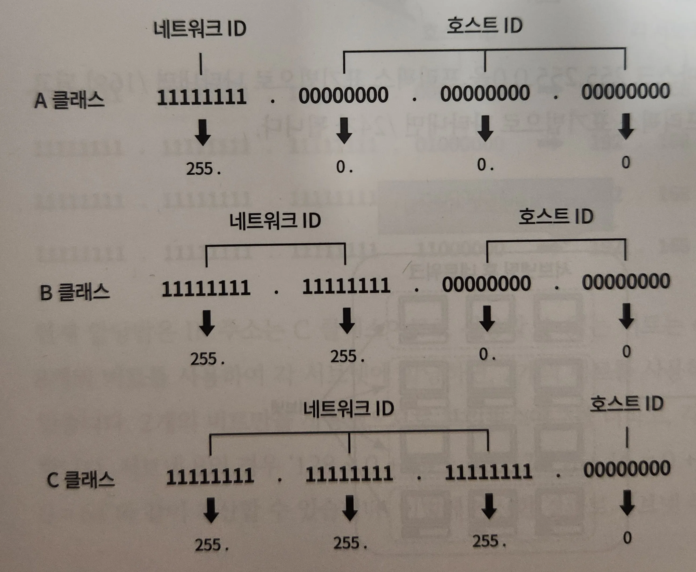
- 서브넷팅을 하면 일반적인 클래스의 네트워크가 더 작은 단위로 나뉘어 IP 주소로 표현된다.
- 작은 단위로 나눈 네트워크는 IP 주소만으로는 네트워크 ID와 호스트 ID를 구별하기 어려울 수 있기 때문에 서브넷 마스크를 사용한다.

> 서브넷 마스크는 IP 주소와 함께 사용되어 네트워크 ID와 호스트 ID를 구분하는 데 사용된다.
>
- 서브넷 마스크는 2진수로 표현되며, IP 주소의 각 비트를 네트워크 ID와 호스트 ID로 식별할 수 있게 나누어준다.
- 서브넷 마스크는 32비트로 A 클래스는 255.0.0.0, B 클래스는 255.255.0.0, C 클래스는 255.255.255.0으로 식별된다.
- 서브넷 마스크를 2진수와 10진수로 표기하면 복잡하기 때문에 일반적으로 프리픽스(prefix) 표기법을 사용한다.

> 프리픽스 표기법 : 서브넷 마스크를 2진수로 표기한 후, 이진수에서 연속된 1개수를 세어서 해당 값을 /로 표기하는 방법
>
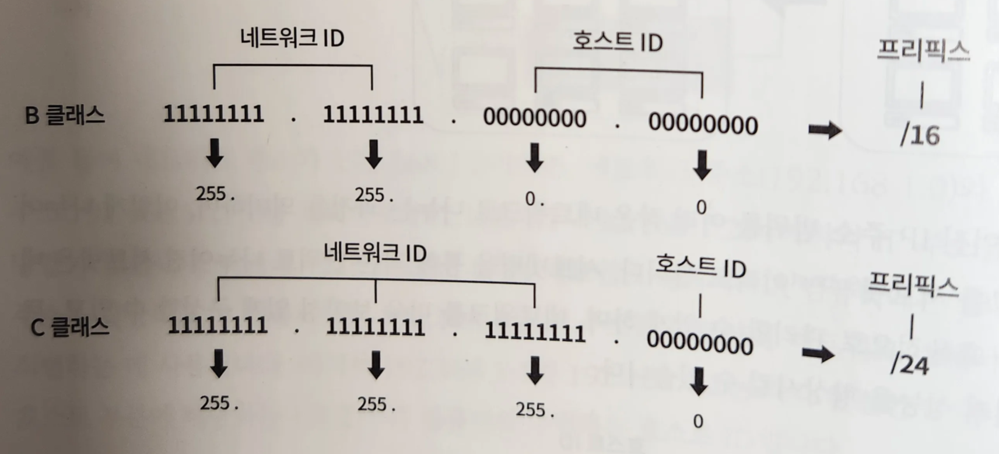

- B 클래스의 서브넷 마스크 255.255.0.0을 프리픽스 표기법으로 나타내면 /16
- C 클래스 255.255.255.0을 프리픽스 표기법으로 나타내면 /24

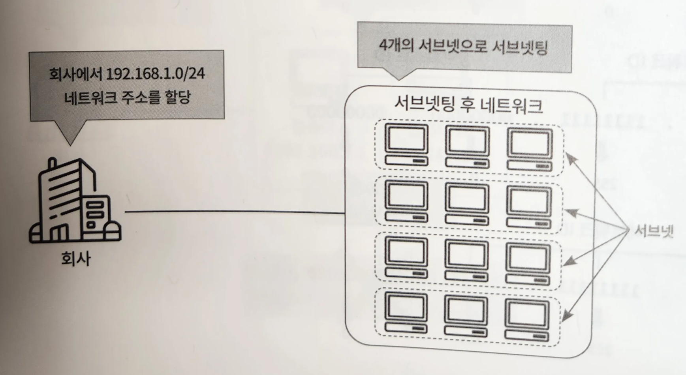

- ex. 회사에서 할당받은 IP 주소가 192.168.1.0/24이고 4개의 서브넷으로 나눈다고 가정

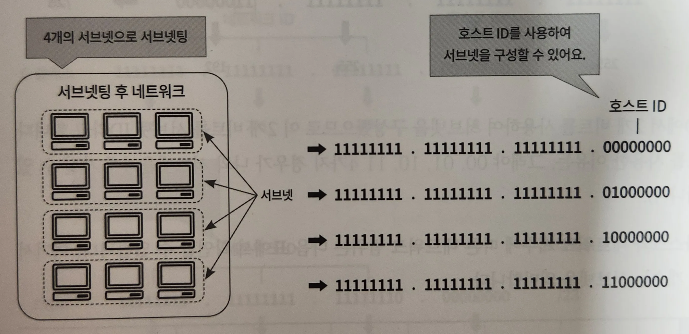
- 현재 할당받은 IP 주소는 32비트 중 24비트를 사용하고 있으며, 네트워크 범위는 192.168.1.0 ~ 192.168.1.255 범위까지 사용할 수 있다.
- 서브넷팅을 할 때는 호스트 ID를 사용하여 서브넷을 구성
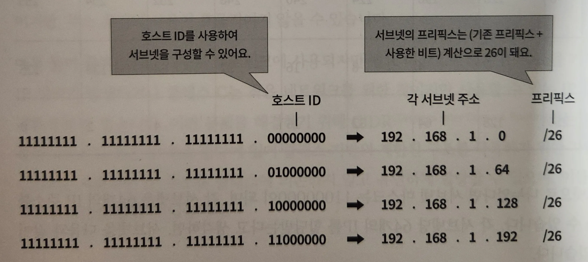

- 현재 할당받은 IP 주소는 C 클래스이므로 사용할 수 있는 비트는 4옥텟 8비트에 해당
- 8개의 비트를 사용하여 각 서브넷에 할당하면, 2개의 비트를 사용하여 4개의 서브넷을 구성할 수 있다.
- 2개의 비트만을 사용했으므로 프리픽스에 2를 더하고, 각 서브넷에 할당한 비트를 계산한다.
- 서브넷 B → 128 x 0 + 64 x 1 + 32 x 0 + 16 x 0 + 8 x 0 + 4 x 0 +2 x 0 + 1 x 0 = 64

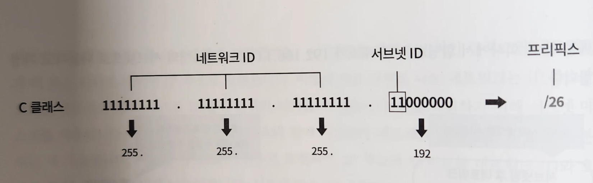
- 호스트 ID에서 2개 비트를 사용하여 서브넷을 구성했으므로 이 2개 비트를 서브넷 ID라고 한다.
    - 2개 비트를 사용한 이유는, 그래야 00, 01, 10, 11 4가지 경우가 나와 서브넷을 4개 가질 수 있다.
- 서브넷 마스크와 네트워크 개수에 따른 네트워크 범위 (네트워크 개수는 서브넷을 의미)

| 서브넷 마스크 (2진수) | 0 | 10000000 | 11000000 | 11100000 | 11110000 | 11111000 | 11111100 | 11111110 | 11111111 |
| --- | --- | --- | --- | --- | --- | --- | --- | --- | --- |
| 서브넷 마스크 (10진수) | 0 | 128 | 196 | 224 | 240 | 248 | 252 | 254 | 255 |
| 네트워크 개수 | 1 | 2 | 4 | 8 | 16 | 32 | 64 | 128 | 125 |
| 네트워크 범위 | 255 | 128 | 64 | 32 | 16 | 8 | 4 | 2 | 0 |
- 4개 서브넷으로 나누었다면 서브넷 마스크는 11000000이 되며, 각 서브넷은 64개의 IP 주소를 할당받을 수 있다.
- 각 서브넷당 64개의 IP를 할당받는다고 생각하면, 서브넷을 다음과 같이 나눌 수 있다.
    - 서브넷 A : 0부터 63까지의 IP 주소를 할당받는다.
    - 서브넷 B : 64부터 127까지의 IP 주소를 할당받는다.
    - 서브넷 C : 128부터 191까지의 IP 주소를 할당받는다.
    - 서브넷 D : 192부터 255까지의 IP 주소를 할당받는다.
- 이렇게 각 서브넷은 서로 겹치지 않는 IP 주소 범위를 할당받아 서브넷팅을 완료할 수 있다.

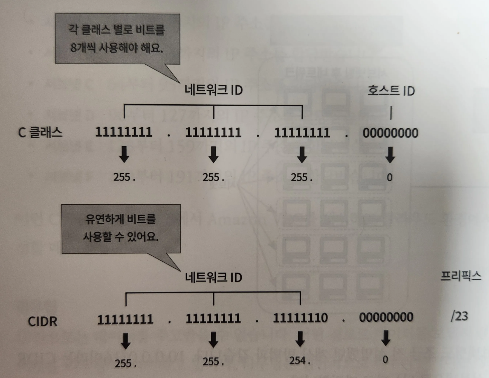
- 클래스 기반의 IP 주소 할당 방식은 주소 공간의 일부를 네트워크 ID로, 나머지를 호스트 ID로 나누어 할당하는 방식
- 이 방식은 간단하고 직관적이지만, 주소 공간의 사용이 효율적이지 않을 수 있다.
- 클래스 A는 대규모 네트워크에 사용되지만 필요 이상으로 많은 IP 주소를 가지고 있어 IP 낭비가 발생하거나 클래스 C는 작은 네트워크를 위한 것이지만 사용할 수 있는 IP 수가 매우 제한적

> CIDR(Classless Inter-Domain Routing) : IP 주소 할당에 있어 클래스 기반의 제한된 구조를 극복하기 위한 기술

> CIDR을 사용하면 IP 주소를 클래스에 의존하지 않고 유연하게 할당할 수 있으며, 이를 통해 IP 주소의 낭비를 줄일 수 있다.
>
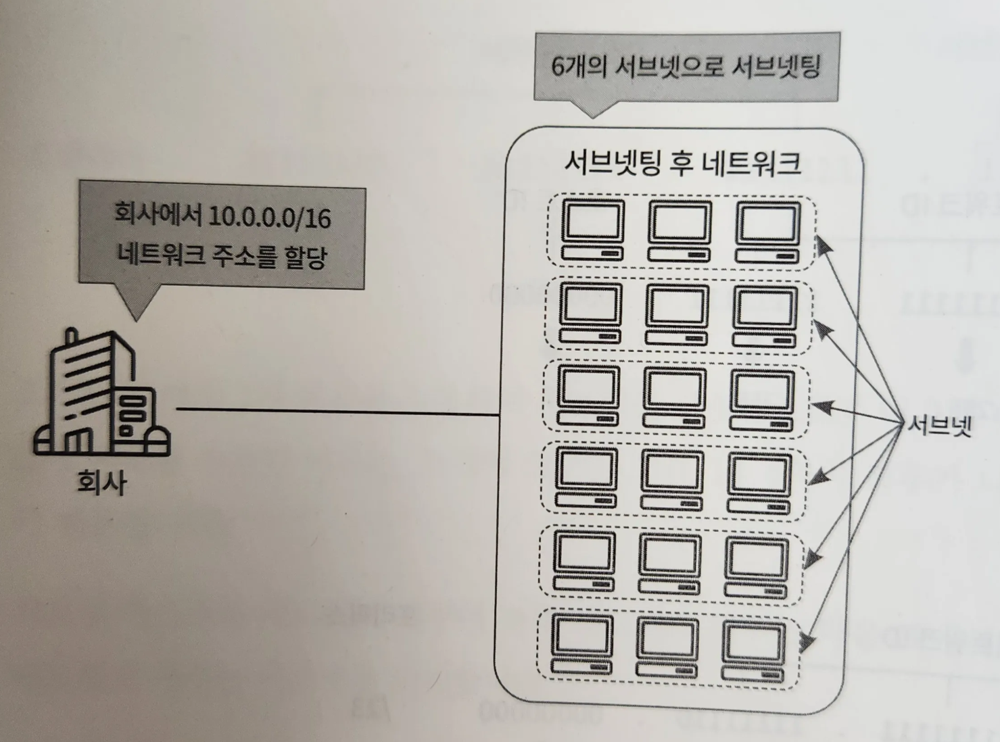
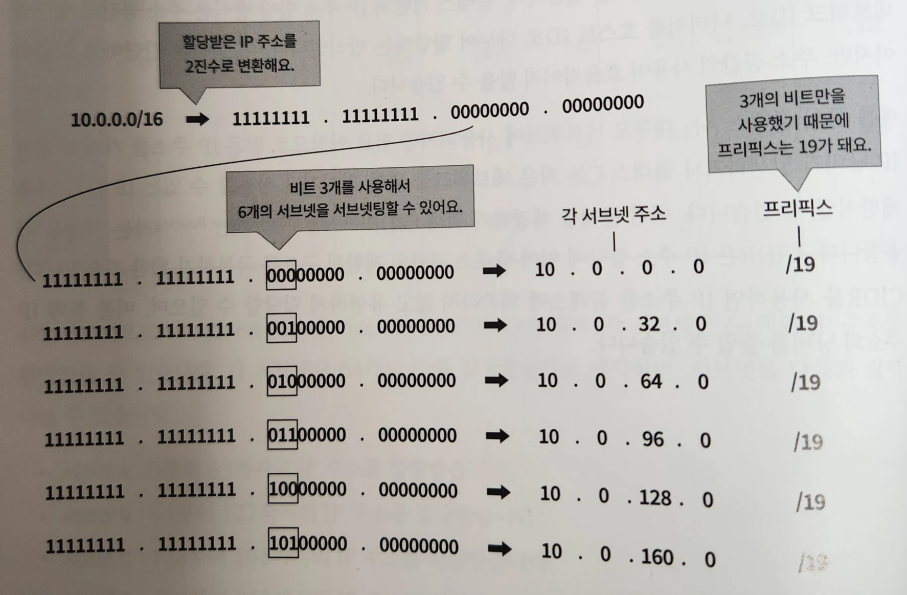

- 10.0.0.0/16이라는 CIDR이 주어졌을 때, 6개의 서브넷으로 나눈다고 가정
- 6개의 서브넷으로 나누는 데 3개의 비트를 사용하기 때문에 프리픽스는 19가 되고, 2진수를 10진수로 변환하면 각 서브넷은 32개 IP 주소를 할당받을 수 있다.
    - 서브넷 A : 0부터 31까지의 IP 주소를 할당받는다.
    - 서브넷 B : 32부터 63까지의 IP 주소를 할당받는다.
    - 서브넷 C : 64부터 95까지의 IP 주소를 할당받는다.
    - 서브넷 D : 96부터 127까지의 IP 주소를 할당받는다.
    - 서브넷 E : 128부터 159까지의 IP 주소를 할당받는다.
    - 서브넷 F : 160부터 191까지의 IP 주소를 할당받는다.
- 이런 CIDR 기술은 AWS에서 Amazon VPC를 생성하고 클라우드 환경에서 네트워크 환경을 구성할 때 사용한다.

### 라우팅

> 라우팅(Routing) : 어떤 경로로 데이터를 보낼지 설정한다.

- 라우팅은 일반적으로 라우터(Router)라는 장비가 수행하며, 라우터를 사용하면 다른 네트워크로 데이터를 보낼 수 있다.
- 라우터에는 라우팅 테이블(Routing Table)이 있어서 경로를 저장하고 관리한다.

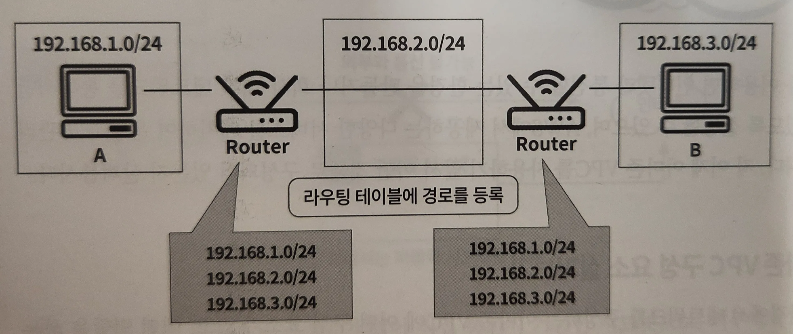
- 192.168.1.0의 IP 주소를 가진 A 컴퓨터에서 B 컴퓨터로 데이터를 전송하려면 라우팅 테이블에 전송하고자 하는 경로를 등록해야 한다.
- AWS에서는 라우터 장비 대신 라우팅 테이블을 별도로 생성하여 라우팅을 관리할 수 있다.
- 이를 통해 사용자는 네트워크 트래픽을 관리하고 효율적으로 라우팅할 수 있다.

# 아마존 VPC란?

> 아마존 VPC(Virtual Private Cloud) : 사용자 전용 가상 네트워크로 AWS의 클라우드 환경에서 네트워크를 구성하고 관리할 수 있는 서비스

> 사용자가 원하는 대로 라우팅 테이블 구성, IP 주소 범위 선택, 서브넷 생성 등으로 구성해 가상 네트워크 환경인 VPC를 생성할 수 있다.
>
- 이렇게 생성된 네트워크는 리소스를 효율적으로 관리하고 보안 및 접근 제어를 강화할 수 있도록 여러 개의 부분 네트워크로 나눈다.
- 나눈 부분 네트워크를 서브넷이라고 하며, 이 안에서도 독립적으로 리소스를 생성하고 관리한다.

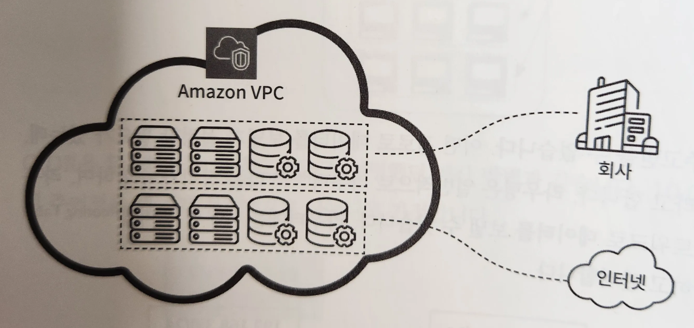
- VPC를 이용하면 인터넷과 통신할 수 있는 환경을 만들거나 회사 내부 네트워크를 통해서만 접속할 수 있도록 설정 가능

## 아마존 VPC 구성 요소 살펴보기

| VPC 요소 이름 | 기능 |
| --- | --- |
| 서브넷 | 서브넷은 아마존 VPC 내에서 네트워크를 더 작은 단위로 나눈 부분 네트워크입니다. |
| 인터넷 게이트웨이 | 인터넷 게이트웨이는 VPC와 인터넷 간의 통신을 가능하게 하는 네트워크 게이트웨이입니다. |
| NAT 게이트웨이 | NAT 게이트웨이는 프라이빗 서브넷 내의 리소스가 VPC 외부 서비스에는 연결할 수 있지만 외부 서비스에서 이 리소스와는 연결을 할 수 없도록 합니다. |
| 라우팅 테이블 | 라우팅 테이블은 VPC 안에서 발생한 네트워크 요청을 어디로 전송해야 하는지 알려주는 역할을 합니다. |
| VPC 엔드포인트 | VPC 엔드포인트는 VPC 내 리소스들이 S3, 다이나모DB(DynamoDB)와 같이 다른 AWS나 외부 리소스에 접근할 때 내부 네트워크를 통해 안전하게 접근할 수 있도록 도와줍니다. |

## 서브넷

> 서브넷(Subnet) : 네트워크를 더 작은 단위로 나눈 것

> AWS의 VPC 안에서도 네트워크를 부분으로 나눌 수 있으며 VPC 하나는 서브넷 N개를 가질 수 있다.
>
- AWS에서 VPC를 생성할 때 사용자는 VPC에 할당할 CIDR 범위를 지정하고 이를 기반으로 서브넷을 나눌 수 있다.

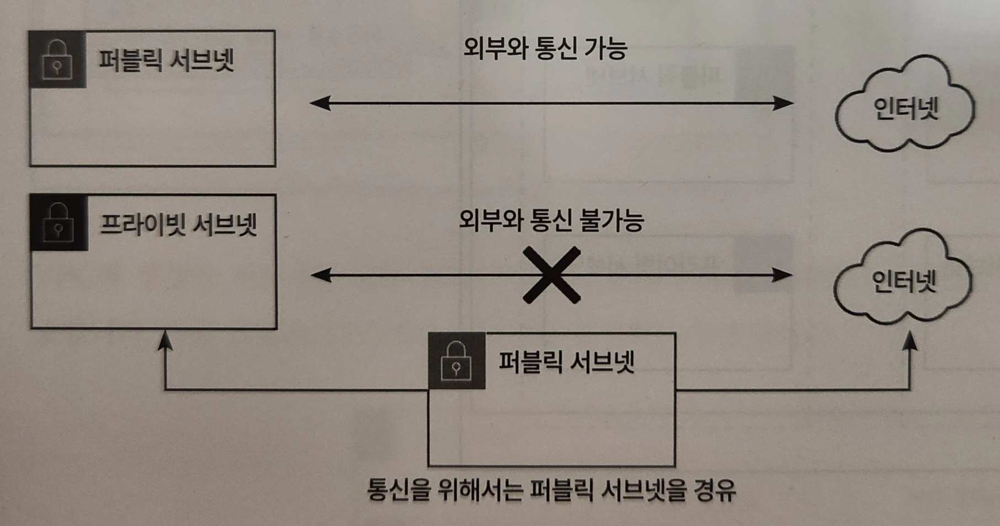
### 퍼블릭 서브넷

> 퍼블릭 서브넷(Public Subnet) : 인터넷과 연결되어 있어 직접 통신이 가능한 서브넷

> 외부에서 접근 가능한 리소스를 호스팅하는 데 사용된다.
>
- 서버나 데이터베이스와 같은 중요 리소스를 배치할 때 보안 관리에 신중해야 한다.

### 프라이빗 서브넷

> 프라이빗 서브넷(Private Subnet) : 외부와의 통신이 불가능하여 주로 내부 서버나 데이터베이스와 같은 중요한 리소스를 배치

> 보안에 민감한 데이터를 주로 저장하여 내부 시스템이나 데이터의 보안을 유지
>
- 직접적으로 외부와 통신이 불가능하여 외부와 통신하려면 퍼블릭 서브넷을 거쳐야 한다.

### VPC에서의 퍼블릭 서브넷과 프라이빗 서브넷

> 퍼블릭 서브넷과 프라이빗 서브넷을 여러 가용 영역에 생성함으로써 안정적인 인프라를 구축할 수 있다.
>
- 일반적으로 가용 영역에 서브넷을 최소한 두 개를 생성한다.
- VPC 하나는 서브넷 N개를 가질 수 있으며, 서브넷은 하나의 가용 영역 내부에만 생성이 가능하여 여러 가용 영역에 걸쳐서 생성하는 것은 불가능
- 아래 그림과 같이 구성하면 서브넷이 여러 가용 영역에 분산되어 있기 때문에 한 가용 영역에서 장애가 발생해도 다른 가용 영역에 있는 서브넷을 통해 서비스를 지속할 수 있어 가용성이 향상된다.
- 다중 가용 영역 서브넷을 구성하면 서버의 분산과 확장이 가능해지므로 트래픽이나 리소스의 증가에 유연하게 대응할 수 있어 확장성을 가진다.
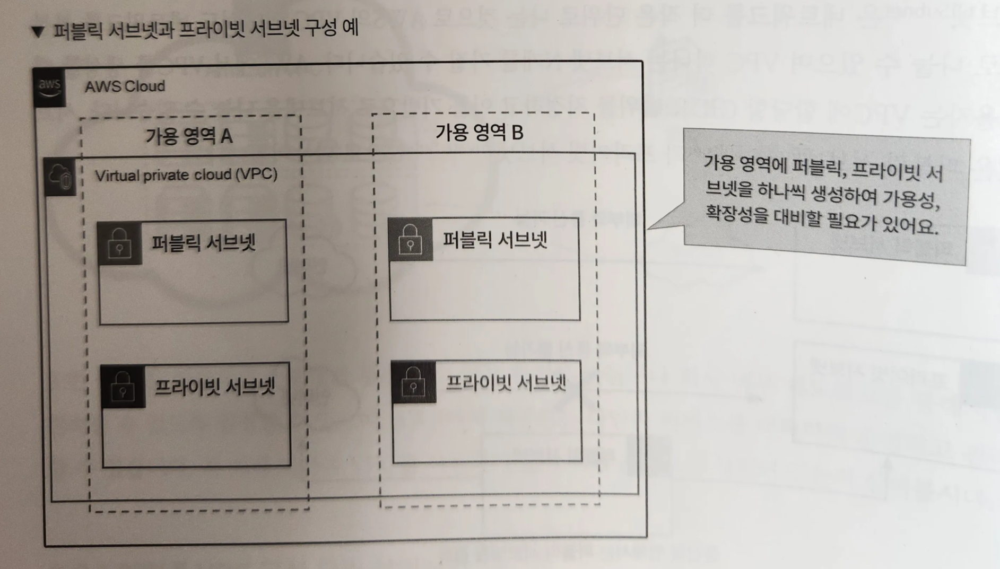

- 자세히 보면 이름만 저렇게 설정한 것이지 실제로는 프라이빗 서브넷이 4개 있는 것과 마찬가지
- AWS에서는 서브넷을 생성할 때 퍼블릭 서브넷이나 프라이빗 서브넷으로 직접 지정하여 생성할 수 없다.

> 서브넷을 생성한 다음 해당 서브넷에 대한 네트워크 설정을 통해 서브넷이 퍼블릭이나 프라이빗 서브넷으로 동작하도록 설정
>

## 인터넷 게이트웨이

> 인터넷 게이트웨이(Internet Gateway) : VPC의 리소스를 인터넷과 통신하는 리전 단위로 생성되는 서비스

> 특정 VPC나 서브넷에 속하지 않으며, 해당 리전 내에서 인터넷 연결을 제공하는 역할
>
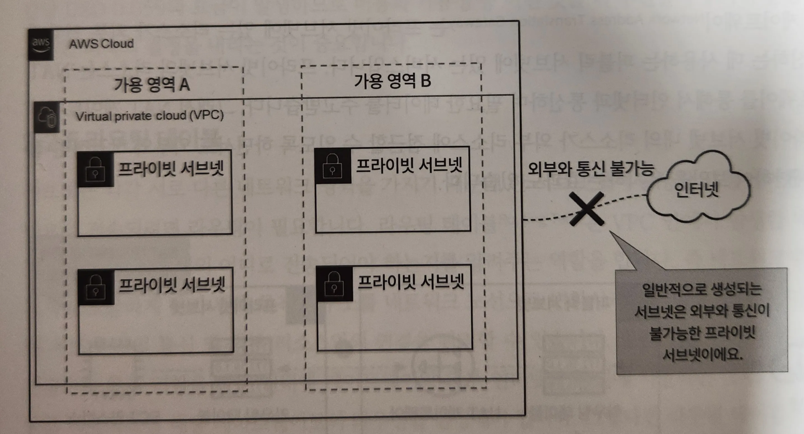

- VPC에 생성한 서브넷은 모두 프라이빗 서브넷이기 때문에 퍼블릭 서브넷으로 바꾸는 작업이 필요하다.

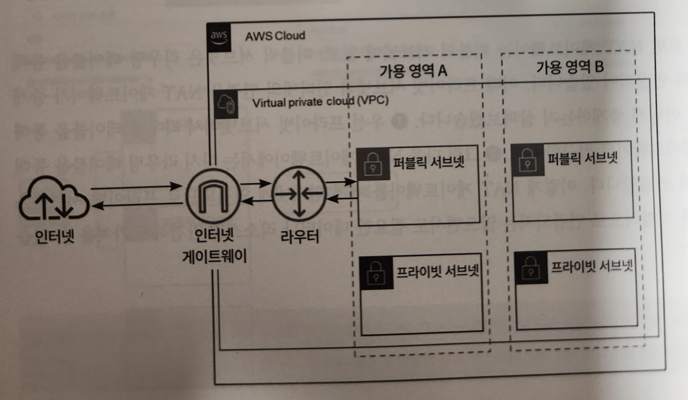
- AWS에서 인터넷 게이트웨이를 생성하고 서브넷에 인터넷 게이트웨이의 라우팅을 설정하면 해당 서브넷은 인터넷과 통신이 가능한 퍼블릭 서브넷이 된다.
- 서브넷이 인터넷 게이트웨이로 향하는 라우팅이 있는 경우 퍼블릭 서브넷이다.

## NAT 게이트웨이

> NAT 게이트웨이(Network Address Translation Gateway) : 프라이빗 서브넷에 있는 리소스가 외부 인터넷과 통신하는 데 사용하는 퍼블릭 서브넷에 있는 서비스

- 프라이빗 서브넷의 리소스는 NAT 게이트웨이를 통해서 인터넷과 통신하며 필요한 데이터를 주고받는다.
- 프라이빗 서브넷 내의 리소스가 외부 리소스에 접근할 수 있도록 하면서도 외부의 직접적인 접근을 제한하여 보안을 유지
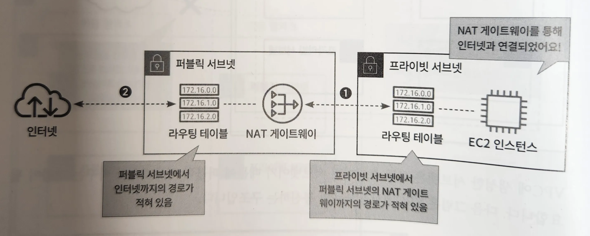

- NAT 게이트웨이는 퍼블릭 서브넷에 있고, 퍼블릭 서브넷은 라우팅 테이블을 통해 인터넷과 연결되어 있다.
- 이때 프라이빗 서브넷과 인터넷의 연결을 NAT 게이트웨이가 중개한다.
- 우선 프라이빗 서브넷에서 라우팅 테이블을 통해 NAT 게이트웨이로 접근
- NAT 게이트웨이에서는 다시 라우팅 테이블을 통해 인터넷과 연결
- 이렇게 NAT 게이트웨이를 거쳐 인터넷에 연결되므로 프라이빗 서브넷은 인터넷과 직접적으로 연결되지는 않으면서도 필요한 데이터나 리소스를 안전하게 가져올 수 있다.
- 프라이빗 서브넷에 있는 라우팅 테이블에는 NAT 게이트웨이까지의 경로가 적혀 있다.
- 보통 가용성을 위해 NAT 게이트웨이는 생성된 퍼블릭 서브넷마다 하나씩 생성하는 것을 권장

## 라우팅 테이블

> 라우팅 테이블(Routing Table) : VPC 안에서 발생한 네트워크 요청이 서브넷 내의 어디로 전송되어야 하는지를 알려주는 역할

> 네트워크에서 목적지에 도달하게 하기 위해 목적지 주소를 네트워클 노선으로 변환시키는 역할
>
- 서브넷은 각각 서로 다른 네트워크 영역을 가지기 때문에 한 서브넷에서 발생한 요청이 다른 서브넷으로 전송되려면 라우팅이 필요
- 이를 통해 서브넷 간의 통신 및 외부 리소스와의 연결을 관리할 수 있다.
- 인터넷과 연결하는 통로 역할을 하는 인터넷 게이트웨이와 외부 인터넷과 통신에 사용하는 NAT 게이트웨이를 사용하려면 해당 게이트웨이로의 라우팅을 설정해야 한다.
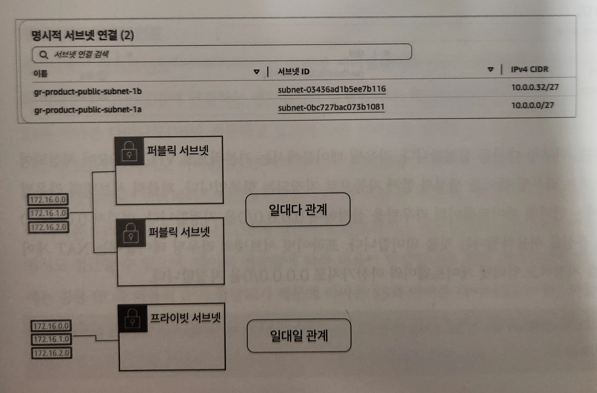

- 퍼블릭 서브넷으로 사용하고자 하는 서브넷을 해당 라우팅 테이블에 연결하고, 인터넷 게이트웨이로의 라우팅을 설정하면 이 라우팅 테이블에 연결된 서브넷은 인터넷에서 접속이 가능한 퍼블릭 서브넷이 된다.
- 퍼블릭 서브넷은 인터넷 게이트웨이를 통해 외부 인터넷과 통신하며, 인터넷 게이트웨이 이외의 별도의 라우팅 설정이 없기 때문에 하나의 라우팅 테이블에 여러 퍼블릭 서브넷을 연결하여 일대다 관계를 유지하는 것이 일반적
- 프라이빗 서브넷에서는 서버, 데이터베이스 등 다양한 리소스가 존재하며, 각 리소스마다 다른 라우팅 대상을 가질 수 있다. 이때는 각 서브넷에 대해 별도의 라우팅 설정을 할 수 있으며, 일대일 관계를 유지하는 것이 일반적
- 같은 라우팅을 공유해야 하는 때에는 프라이빗 서브넷에도 일대다 관계를 설정할 수 있다.

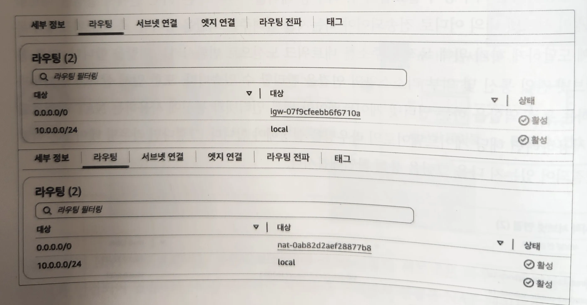
- 라우팅에는 라우팅 대상을 설정하고, 라우팅 테이블에서는 기본적으로 VPC CIDR이 지정되어 있다. 이는 라우팅 테이블 생성과 함께 자동으로 지정되는 항목
- 퍼블릭 서브넷의 라우팅 테이블에는 인터넷 게이트웨이의 라우팅을 설정하며 0.0.0.0/0을 지정 (모든 통신을 허용함)
- 프라이빗 서브넷의 라우팅 테이블에는 NAT 게이트웨이를 지정하고 인터넷 게이트웨이와 마찬가지로 0.0.0.0/0을 지정

## VPC 엔드포인트

> VPC 엔드포인트(VPC Endpoint) : VPC의 외부 서비스나 다른 서비스와 안전하게 연결하는 데 도움을 주는 서비스

### 인터페이스 엔드포인트

> 사설 IP 주소를 할당받아 AWS에서 제공하는 프라이빗 연결 공간인 프라이빗링크(PrivateLink)를 통해 VPC 내의 서버가 인터넷을 거치지 않고돌 AWS의 다른 서비스와 안전하게 통신할 수 있게 한다.
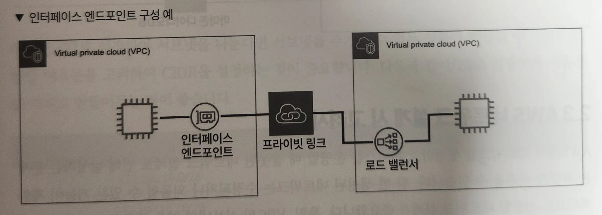

### 게이트웨이 엔드포인트

> 인터넷 게이트웨이와 NAT 게이트웨이 없이 아마존 S3와 아마존 다이나모DB에 연결하는 엔드포인트 유형

> 온프레미스 환경과 다른 리전에서의 사용, 비용, 비공개 IP로의 접근을 고려하여 인터페이스 엔드포인트와 게이트웨이 엔드포인트를 결정
>
- 게이트웨이 엔드포인트에서는 아마존 S3와 아마존 다이나모DB만 지원하고 있음
    - 공용 IP 즉 퍼블릭 IP가 할당되기 때문에 아마존 S3와 아마존 다이나모DB에는 퍼블릭 IP로 접근
    - 온프레미스 네트워크와 다른 AWS 리전에서는 접근X
- 인터페이스 엔드포인트에서도 아마존 S3와 아마존 다이나모DB 지원
    - VPC의 사설 IP 주소 즉, 프라이빗 IP 주소를 사용하여 아마존 S3와 아마존 다이나모 DB에 접근하며, 온프레미스 네트워크와 다른 AWS 리전의 VPC에서도 접근 가능

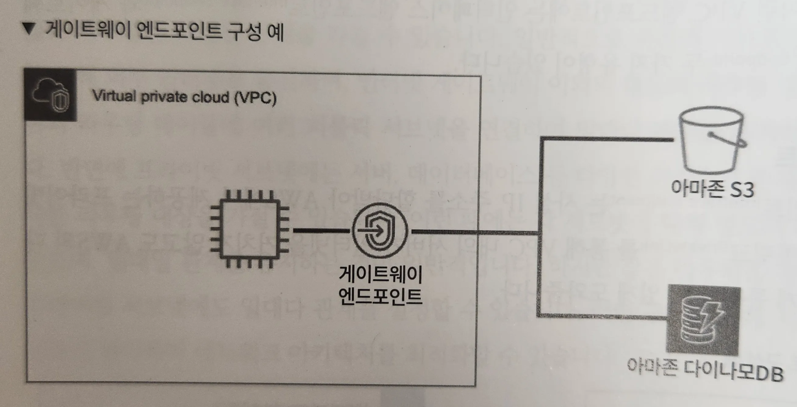
# AWS 네트워크 설계 시 고려사항

- 한 번 생성된 네트워크는 수정되거나 되돌릴 수 있는 기능이 제한적이므로 신중한 네트워크 설계가 중요
- VPC와 서브넷의 경우 잘못된 네트워크 설계로 인해 IP 주소가 부족하더라도 네트워크 설정 수정 불가

## CIDR은 어떻게 나누어야 할까?

- 먼저 할당받은 IP 주소를 바탕으로 현재 구축할 환경에 서브넷을 몇 개 생성해야 할지 생각해야 한다.
- ex. VPC에 172.100.16.0/24를 할당하고 이 VPC를 8개의 서브넷으로 나누고 싶다면 다음과 같이 정확하게 8개 서브넷으로 나눌 수 있으며 각 서브넷은 27개 사용 가능한 호스트 ID 즉 IP 주소를 가질 수 있다.

| 서브넷 | 호스트 ID |
| --- | --- |
| 172.100.16.0/27 | 27 |
| 172.100.16.32/27 | 27 |
| 172.100.16.64/27 | 27 |
| 172.100.16.96/27 | 27 |
| 172.100.16.128/27 | 27 |
| 172.100.16.160/27 | 27 |
| 172.100.16.192/27 | 27 |
| 172.100.16.224/27 | 27 |
- 하지만 /27로 설정하여 서브넷을 나눈다면 서브넷을 추가할 수 없는 상황이 발생할 수 있으므로, 항상 여유분을 고려하여 CIDR을 설정하는 것이 중요
- 아래처럼 /28로 설정하여 여유분을 가지고 만들어두는 것이 좋다.

| 서브넷 | 호스트 ID |
| --- | --- |
| 172.100.16.0/28 | 11 |
| 172.100.16.16/28 | 11 |
| 172.100.16.32/28 | 11 |
| 172.100.16.48/28 | 11 |
| 172.100.16.64/28 | 11 |
| 172.100.16.80/28 | 11 |
| 172.100.16.96/28 | 11 |
| 172.100.16.112/28 | 11 |
| 172.100.16.128/28 | 11 |
| 172.100.16.144/28 | 11 |
| 172.100.16.160/28 | 11 |
| 172.100.16.176/28 | 11 |
| 172.100.16.192/28 | 11 |
| 172.100.16.208/28 | 11 |

> 서브넷을 생성할 때는 사용할 IP 주소의 양과 서브넷의 확장 가능성을 고려해야 한다.
>
- 서브넷을 나눌 때 IP 주소를 우선시할지, 서브넷 확장을 우선시할지 결정하는 것이 중요
- AWS에서 서브넷의 CIDR 중 다음 5가지는 사용할 수 없다.
    - 10.94.4.0 : 네트워크 주소
    - 10.94.4.1 : AWS가 VPC 라우터용으로 예약했다.
    - 10.94.4.2 : AWS에서 예약
    - 10.94.4.3 : 향후 사용을 위해 AWS에서 예약한다.
    - 10.94.4.255 : 네트워크 브로드캐스트 주소
- IP 사용이 필요하게 되는 케이스
    - EC2 인스턴스 생성
    - 탄력적(Elastic) IP 할당
    - NAT 게이트웨이 생성
    - VPC 엔드포인트 생성
    - 로드 밸런서(Load Balancer) 생성
- ELB를 배치하는 서브넷은 /27 이상의 CIDR이며, 적어도 빈 IP를 8개 준비해야 한다.
- 복수의 VPC를 생성할 때에도 VPC CIDR의 중복에 주의해야 한다.
    - ex. VPC CIDR가 172.100.16.0/20으로 설정된 경우, 이는 172.100.16.0부터 172.100.31.255까지의 IP 주소 범위를 포함한다.
    - 만약 두 번째 VPC의 세 번째 옥텟을 16 ~ 31 사이로 지정한다면 IP 주소 범위가 중복된다.
- VPC를 생성할 때는 이미 생성된 다른 VPC의 CIDR 범위와 겹치지 않는지를 확인해야 한다.

## VPC 분할 패턴

- AWS를 사용함에 있어 복수의 VPC를 구성할 수 있고, 목적에 따라 VPC를 나누거나 계정별로 VPC를 나눌 필요가 있다.

### 단일 계정으로 VPC 분할
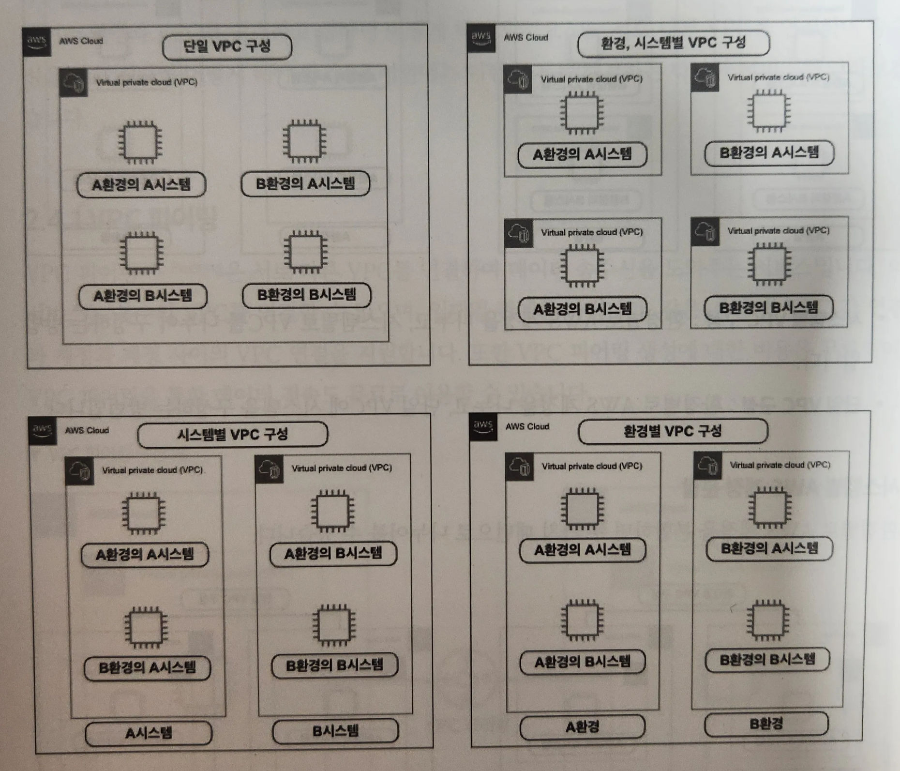

- 단일 VPC 구성 : 단일 VPC에 복수의 환경과 시스템을 구성
- 환경, 시스템별 VPC 구성 : 환경, 시스템에 따라서 VPC를 나누어 구성
- 시스템별 VPC 구성 : 여러 시스템을 각 VPC로 나눈다.
- 환경별 VPC 구성 : 각 환경(ex. 개발, 테스트, 운영)을 별도의 VPC로 나누어 구성

### 환경별 AWS 계정 분할
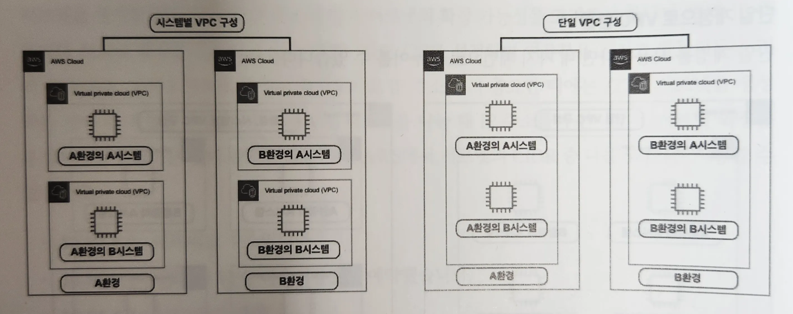

- 시스템별 VPC 구성 : 환경별로 AWS 계정을 나누고, 시스템별로 VPC를 나누어 구성
- 단일 VPC 구성 : 환경별로 AWS 계정을 나누고, 단일 VPC에 시스템을 구성

### 시스템별 AWS 계정 분할
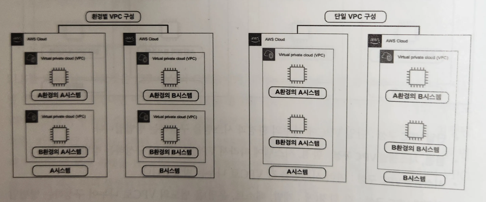

- 환경별 VPC 구성 : 시스템별로 AWS 계정을 나누고, 환경별로 VPC를 나누어 구성
- 단일 VPC 구성 : 시스템별로 AWS 계정을 나누고, 단일 VPC에 환경을 구성

# AWS 네트워크 구축을 위한 다양한 서비스 알아보기

## VPC 피어링

> VPC 피어링(VPC Peering) : 서로 다른 VPC를 연결하여 데이터 송수신을 도와주는 서비스

> 복수의 VPC를 연결할 수 없으며, 일대일 관계를 가진다.
>
- 같은 계정 내 VPC 간 연결과 계정과 계정 사이의 VPC 연결을 지원한다.
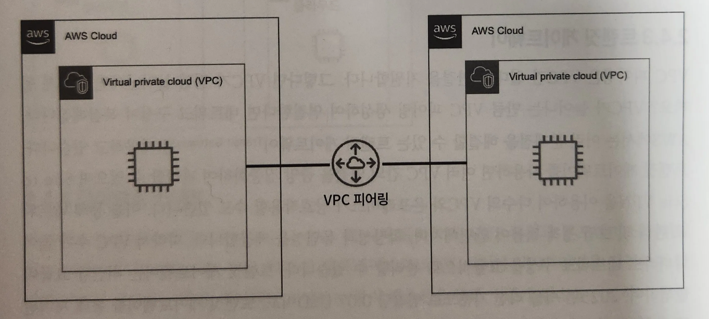

## Site to Site VPN

> AWS와 온프레미스 간에 안전한 연결을 생성하는 서비스

> 온프레미스 네트워크와 AWS 클라우드 간에 암호화된 터널을 설정하여 데이터를 안전하게 전송
>
- Site-to-Site VPN은 IPsec 프로토콜을 사용하여 터널을 설정하며, 고유한 공인 IP 주소를 사용하여 두 지점 간의 통신을 보호
- 이를 통해 민감한 데이터의 안전한 전송과 온프레미스 및 AWS 리소스 간의 확장 가능한 네트워크 연결이 가능해진다.
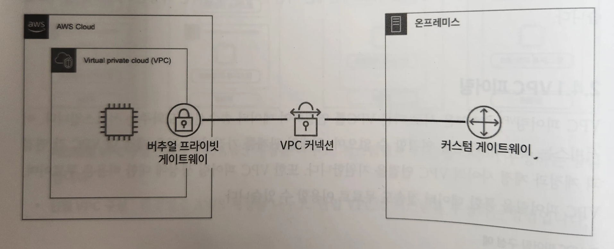

## 트랜짓 게이트웨이

- VPC가 늘어나는 만큼 VPC 피어링을 생성하여 연결한다면 네트워크 구성이 복잡해진다.

→ AWS에서는 이런 문제점을 해결할 수 있는 트랜짓 게이트웨이(Transit Gateway)를 제공한다.

- 여러 VPC 간의 연결을 중앙 집중화하여 관리할 수 있으며 Site to Site VPN을 이용하여 다수의 VPC와 온프레미스가 상호작용할 수도 있다.
- 네트워크 관리 및 보안 정책 적용이 간편해지며, 확장성과 유연성을 제공한다.
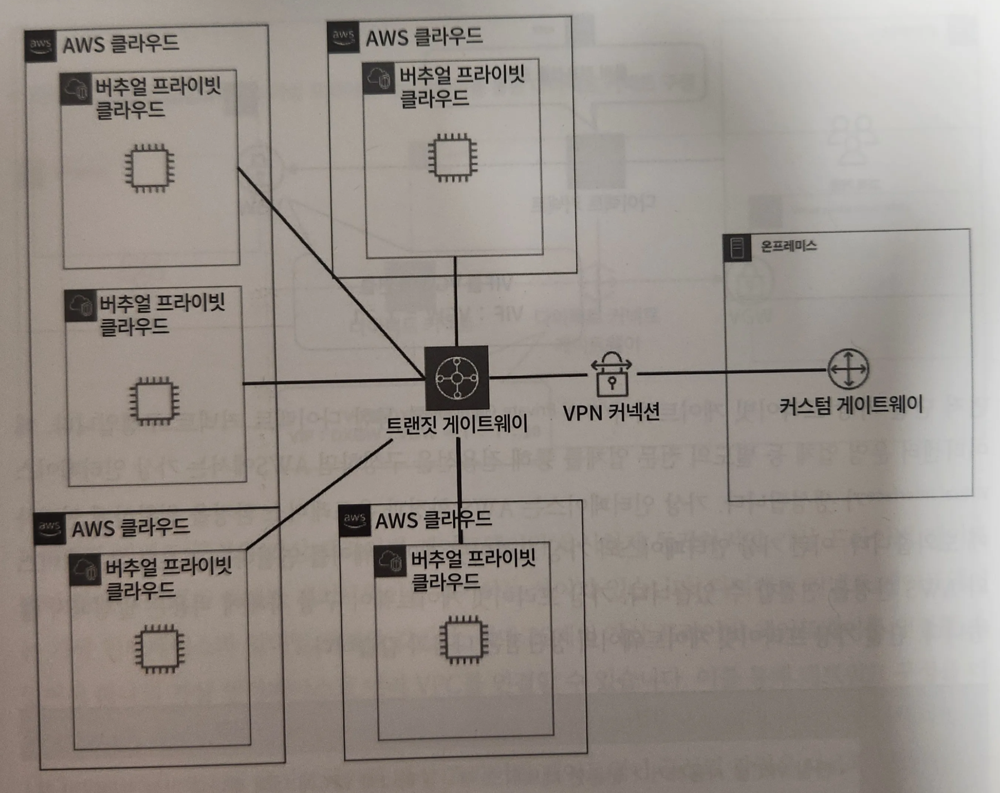

## 다이렉트 커넥트

> 다이렉트 커넥트(Direct Connect) : Site-to-Site VPN과 유사하게 AWS 환경과 온프레미스를 연결하는 서비스

- Site-to-Site VPN은 온프레미스와 AWS 사이에 VPN 터널을 설정하여 안전한 연결을 제공
    - 단기간에 도입이 가능하고 비용이 비교적 낮다.
- 다이렉트 커넥트는 물리 전용선을 통해 비공개 접속을 시도하며, 고속 네트워크 대역에서 안정적인 통신을 제공
    - 초기 설정 및 구축에는 시간과 비용이 더 많이 소요될 수 있다.

### 단일 가상 프라이빗 게이트웨이를 통해 다이렉트 커넥트 구성

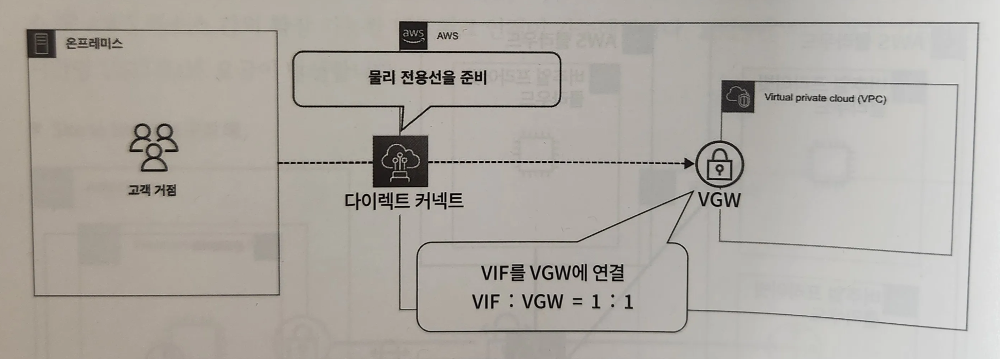
- 데이터센터 운영 업체 등 별도의 전문 업체를 통해 전용선을 구성하면 AWS에서는 가상 인터페이스(Virtual Interface)가 생성된다.
- 가상 인터페이스는 AWS 환경과 온프레미스 환경을 원활하게 연결하게 도와준다.
- 가상 인터페이스와 가상 프라이빗 게이트웨이를 연결하는 것으로 온프레미스와 AWS 환경을 연결할 수 있다.

|  | 장점 | 단점 |
| --- | --- | --- |
| 단일 가상 프라이빗 게이트웨이 | • 단일 VPC를 사용하거나 단순한 네트워크 구성 환경의 경우 가상 프라이빗 게이트웨이만 사용하는 것이 간단하고 효율적입니다.
• VPC마다 통신을 완전히 나누고 싶다면 단일 가상 프라이빗 게이트웨이 구성이 유용합니다. | • 하나의 VPC에 대해 하나의 가상 프라이빗 게이트웨이밖에 연결할 수 없기 때문에 확장성에 제한이 있습니다.
• 여러 VPC를 이용하려면 가상 프라이빗 게이트웨이마다 가상 인터페이스를 생성해야 합니다.
• VPC를 추가할 때마다 가상 인터페이스를 만들어야 하기 때문에 그만큼 비용이 증가합니다. |

### 다이렉트 커넥트 게이트웨이와 가상 프라이빗 게이트웨이를 통한 다이렉트 커넥트 구성

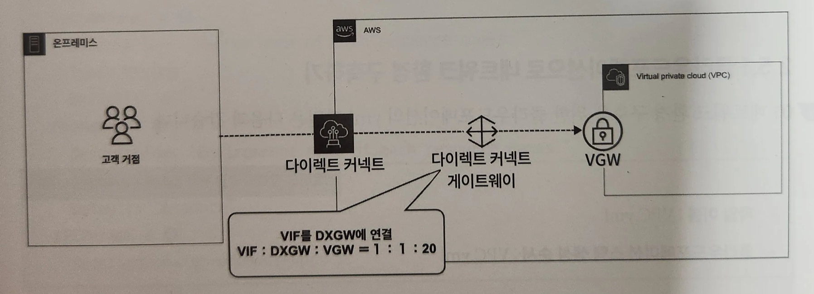
- 다이렉트 커넥트 구성은 가상 프라이빗 게이트웨이와 유사하게 동작하지만 가상 프라이빗 게이트웨이 앞에 다이렉트 커넥트 게이트웨이를 추가하는 차이가 있다.
- 다이렉트 커넥트 게이트웨이는 가상 인터페이스와 일대일 관계를 갖지만, 최대 20개의 가상 프라이빗 게이트웨이를 연결할 수 있어서 하나의 가상 인터페이스로 여러 VPC를 연결할 수 있다.

|  | 장점 | 단점 |
| --- | --- | --- |
| 다이렉트 커넥트 게이트웨이와
가상 프라이빗 게이트웨이 | • 하나의 가상 인터페이스마다 여러 개의 VPC를 이용할 수 있습니다(최대 20개).
• 다이렉트 커넥트 게이트웨이 자체에는 비용이 들지 않기 때문에 단일 가상 프라이빗 게이트웨이 구성과 같은 비용으로 이용할 수 있습니다.
• 다이렉트 커넥트 게이트웨이는 멀티 계정 지원할 수 있습니다.
- 다이렉트 커넥트 게이트웨이를 별도 계정과 공유할 수 있으며, 별도 계정의 가상 프라이빗 게이트웨이에 직접 연결할 수 있습니다.
 - 계정마다 가상 인터페이스를 만들 필요는 없습니다. | • 없음 |
- 현재 AWS에서는 다이렉트 커넥트 게이트웨이와 가상 프라이빗 게이트웨이 구성으로 다이렉트 커넥트를 구성하는 것을 권장

# AWS 네트워크 환경 구축하기

## 클라우드포메이션으로 네트워크 환경 구축하기

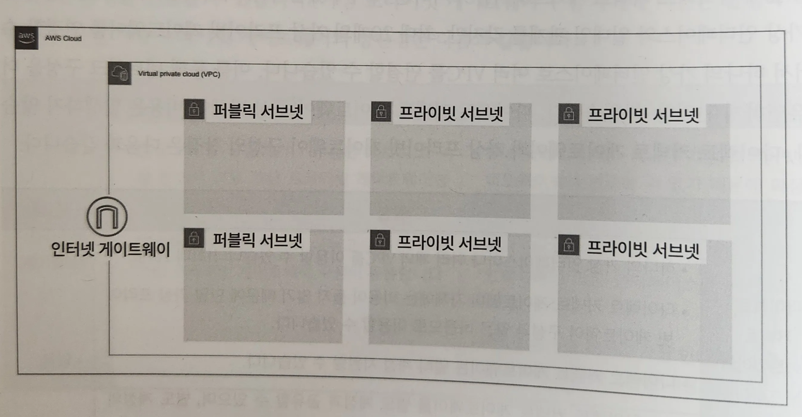
- 네트워크 구성은 2개의 퍼블릭 서브넷과 4개의 프라이빗 서브넷으로 구성
- 인터넷 게이트웨이를 배치하여 퍼블릭 서브넷에서 인터넷과 송수신할 수 있도록 한다.

### Parameters (입력값 설정)

- 사용자 지정 값을 받아 코드 재사용성과 가독성 향상
- 하드코딩 대신 환경별 설정 가능
- 주요 파라미터
    - SystemName → 시스템 이름
    - EnvName → 환경 이름 (dev, prod 등)
    - VPCParam → VPC CIDR
    - PublicSubnet / PrivateSubnet CIDR 정의

### Resources (리소스 생성)

- 실제 AWS 리소스를 정의하는 핵심 영역

#### 기본 구조

- 리소스 이름 → 자유롭게 지정
- Type → 생성할 AWS 서비스
- Properties → 리소스 속성 정의

#### 주요 리소스

- VPC
    - CIDR 설정
    - DNS 설정 (EnableDnsSupport / Hostnames)
- Subnet
    - 가용 영역(AZ) 지정 (Fn::GetAZs)
    - CIDR 설정
    - VPC 연결
- Tag
    - Name, Env 등으로 리소스 식별

### CloudFormation 내장 함수

- `!Ref` : 파라미터 또는 리소스 값 참조
- `!Sub` : 문자열 변수 치환 (ex: 이름 자동 생성)
- `Fn::GetAZs` : 가용 영역 리스트 가져오기

### Internet Gateway (인터넷 연결)

- VPC ↔ 인터넷 연결 역할
- 생성 후 반드시 VPC에 연결 필요
- InternetGateway 생성
- VPCGatewayAttachment로 VPC 연결

### Route Table (라우팅 설정)

- 네트워크 트래픽의 경로 지정
- RouteTable 생성 (VPC 단위)
- Route 추가
    - `0.0.0.0/0 → IGW` (인터넷 연결)
- Subnet ↔ RouteTable 연결

### Routing (경로 설정)

- Route 리소스로 경로 정의
- 목적지 CIDR + 대상(Gateway) 설정

### Subnet ↔ RouteTable 연결

- SubnetRouteTableAssociation 사용
- 각 서브넷이 어떤 라우팅을 사용할지 결정

### Outputs (출력값)

- 생성된 리소스를 외부에서 사용 가능하도록 출력
- Value → 실제 리소스 값
- Export → 다른 스택에서 참조 가능

## UI로 불러와 AWS 네트워크 환경 구축하기
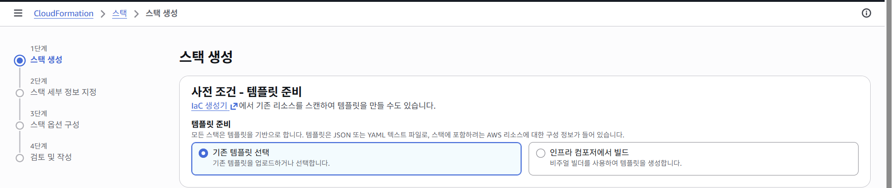

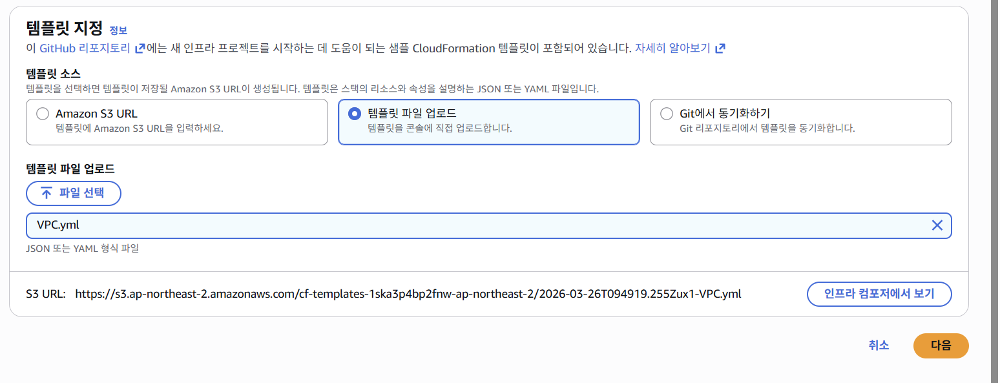

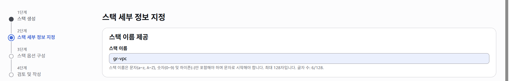

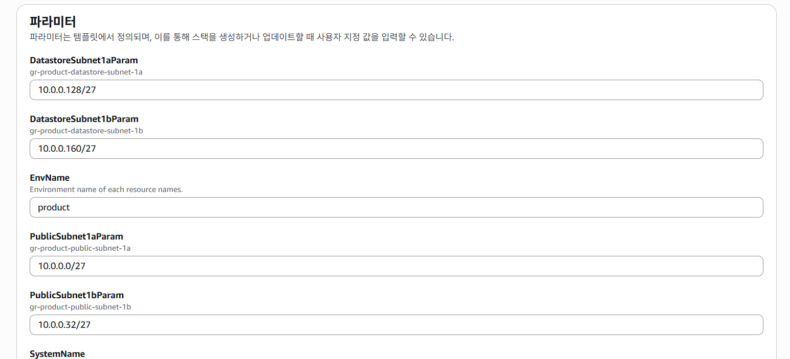

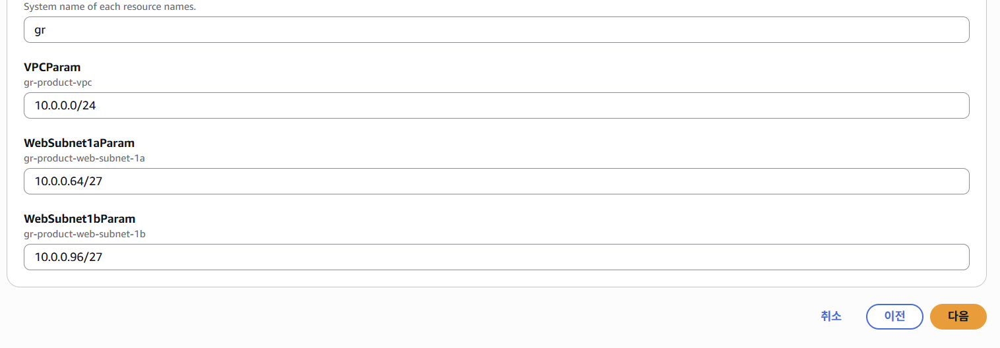

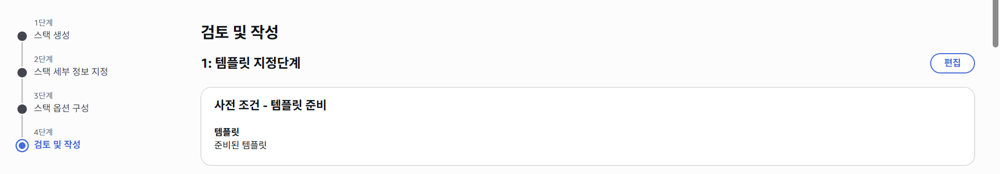

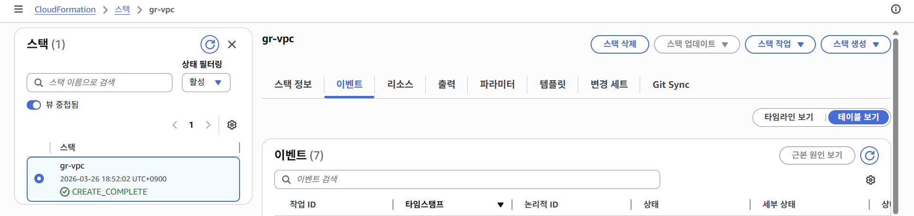

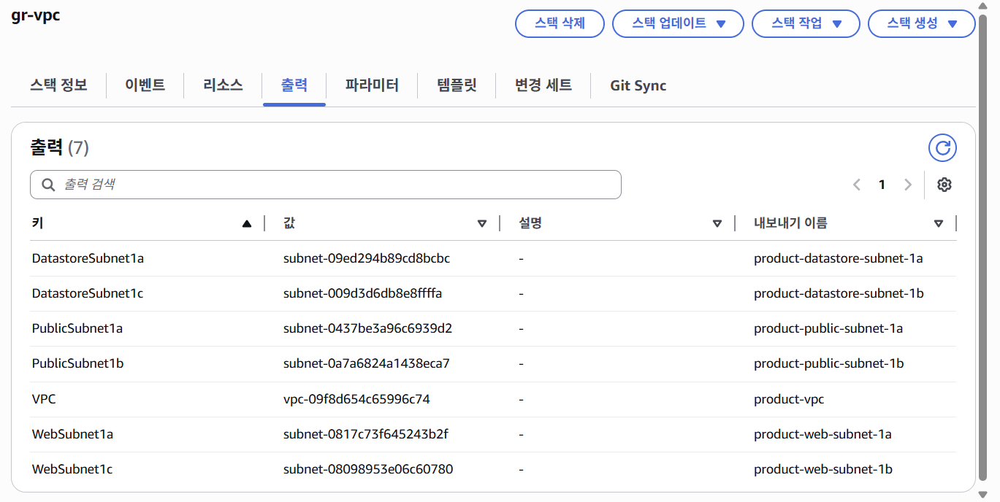

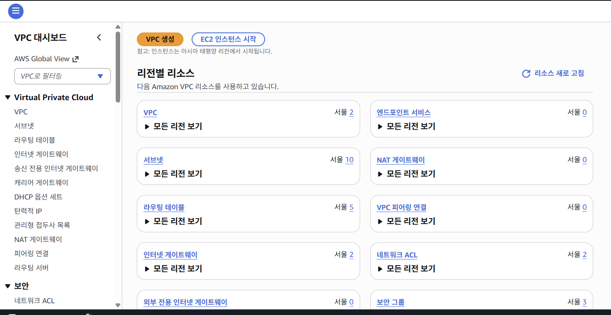
