# 인프라 관리 서비스, AWS 시스템 관리자란?

> AWS 시스템 관리자 : EC2 인스턴스 서버를 효율적으로 관리할 수 있는 도구

- 안티바이러스 정의 업데이트, 소프트웨어 설치 상태 확인, 운용 자동화, 패치 관리 등 다양한 관리 작업을 수행할 수 있다.
- 윈도우와 리눅스 운영체제 모두 지원

# 인프라 관리 서비스, AWS 시스템 관리자 살펴보기

### 작업 관리 서비스

- 탐색기, 옵스센터(OpsCenter), 클라우드워치 대시보드, 인시던트 관리자(Incident Manager) 제공

| 기능          | 비고                                             |
|-------------|------------------------------------------------|
| 탐색기         | AWS 계정 및 리전에 대한 운영 데이터와 항목이 집계된 보기를 표시         |
| 옵스센터        | 상황 정보, 이전 지침 및 빠른 해결 단계를 제공하는 단일 위치로 운영 항목을 통합 |
| 클라우드워치 대시보드 | AWS 리소스에 대한 지표 및 경보를 보여주는 사용자 정의 뷰를 생성         |
| 인시던트 관리자    | AWS에서 호스팅 애플리케이션에 영향을 주는 인시던트를 완화하고 복구하는 데 사용  |

### 애플리케이션 관리 서비스

- 애플리케이션 관리자, 앱컨피그(AppConfig), 파라미터 스토어 제공
- 파라미터 스토어 : 구성 데이터 관리 및 암호 관리를 위한 안전한 계층적 스토리지 제공

| 기능                               | 비고                                                                 |
|----------------------------------|--------------------------------------------------------------------|
| 애플리케이션 관리자 (Application Manager) | 데브옵스(DevOps) 엔지니어가 애플리케이션의 맥락에서 AWS 리소스에 대한 문제를 조사하고 해결할 수 있도록 서포트 |
| 앱컨피그(AppConfig)                  | 애플리케이션 구성을 생성, 관리 및 빠르게 배포                                         |
| **파라미터 스토어**                     | 구성 데이터 관리 및 암호 관리를 위한 안전한 계층적 스토리지를 제공                             |

### 변경 관리 서비스

- 변경 관리자(Change Manager), 자동화, 일정 변경, 유지 관리 기간 기능 제공

| 기능       | 비고                                                                         |
|----------|----------------------------------------------------------------------------|
| 변경 관리자   | 애플리케이션 구성 및 인프라에 대한 운영 변경 사항을 요청, 승인, 구현 및 보고하기 위한 엔터프라이즈 변경 관리 프레임워크      |
| **자동화**  | EC2 인스턴스 및 기타 AWS 리소스의 일반적인 유지 관리 및 배포를 간소화                                |
| 일정 변경    | 지정한 작업이 AWS 계정에서 수행되거나 수행되지 않을 때 날짜 및 시간 범위를 설정                            |
| 유지 관리 기간 | 운영체제 패치, 드라이버 업데이트, 소프트웨어 또는 패치 설치와 같이 노드에서 중단 가능성이 있는 작업 수행 시기에 대한 일정을 정의 |

### 노드 관리 서비스

- 플릿 관리자, 규정 준수, 인벤토리, 하이브리드 활성화, 세션 관리자, 명령 실행, 상태 관리자, 패치 관리자, 배포자 기능 제공

| 기능         | 비고                                                  |
|------------|-----------------------------------------------------|
| **플릿 관리자** | 서버에 원격으로 연결하지 않고도 AWS 및 온프레미스 모드에서 실행하는 인스턴스를 관리 가능 |
| 규정 준수      | 규정 준수 데이터 모니터링 및 플릿 전체 문제 해결                        |
| 인벤토리       | AWS 컴퓨팅 환경에 대한 가시성을 제공                              |
| 하이브리드 활성화  | 한 위치에서 아마존 EC2 인스턴스 및 하이브리드 환경을 중앙에서 관리             |
| **세션 관리자** | EC2 인스턴스에 대한 원클릭 보안 액세스를 제공하는 관리형 서비스               |
| **명령 실행**  | 관리형 노드의 구성을 원격으로 안전하게 관리                            |
| 상태 관리자     | 관리형 노드를 정의된 상태로 유지하는 과정을 자동화                        |
| **패치 관리자** | 보안 관련 및 기타 유형의 업데이트로 관리형 노드를 패치하는 프로세스를 자동화         |
| 배포자        | 패키지를 생성하고 관리형 노드에 배포                                |

### 공유 리소스 서비스

- 문서 기능 제공

| 기능 | 비고                   |
|----|----------------------|
| 문서 | 시스템 관리자가 수행하는 작업을 정의 |

## 애플리케이션 관리, 파라미터 스토어

> 파라미터 스토어 : 파라미터를 저장하는 서비스

- 클라우드포메이션 혹은 애플리케이션 파라미터를 안전하게 저장하는 데 사용된다.
- EC2 인스턴스를 생성할 때 키 페어를 안전하게 보관하기 위해 사용한 서비스
    - 04.3절 ‘아마존 EC2 구축하기’

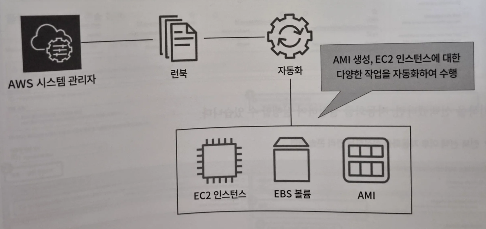
- 보관된 파라미터는 필요에 따라 호출할 수 있으며, 보안 문자열을 이용하면 KMS를 사용해 파라미터를 암호화한다.
- IAM으로 권한이 없는 사람이 파라미터를 읽을 수 없도록 제한 가능
- 평문 혹은 암호화 선택
- 파라미터 스토어에 키 페어를 보관하거나 RDS의 접속 정보와 같은 시크릿 정보를 암호화해 보관
- 시크릿 정보를 정기적으로 교체하고 싶은 경우에는 시크릿 관리자를 고려하는 것이 좋다.

## 변경 관리, 자동화

> 자동화 : EC2 인스턴스 및 기타 AWS 리소스의 일반적인 유지 관리 및 배포를 간소화하는 기능

> 런북(RunBook)이라는 문서를 만들어 시스템 관리자가 수행하는 작업을 정의
>

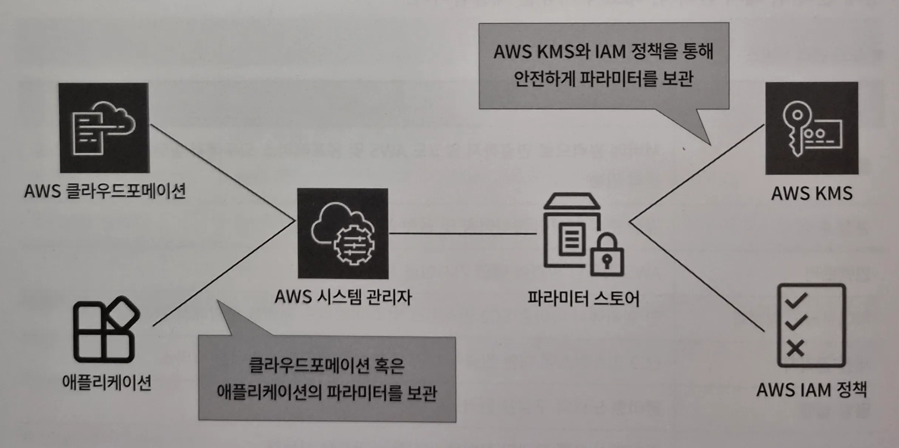
- 런북에는 다양한 자동화 작업이 포함되어 있다.
- AWS에 기존에 만들어둔 템플릿을 사용할 수도 있고, 사용자가 커스텀해 런북을 생성할 수도 있다.
- 런북으로 AMI 생성, 드라이버 업데이트, 윈도우 서버의 암호를 재설정, 리눅스 인스턴스의 SSH 키를 재설정, OS 패치 및 업데이트 자동화를 설정하고 수행할 수 있다.

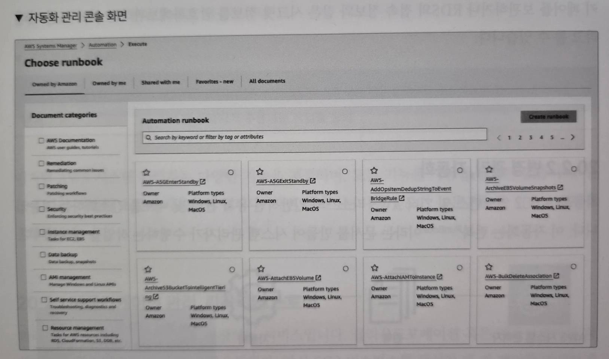
- 자동화 관리 콘솔 화면에서 AWS에서 제공하는 런북을 선택하거나 직접 생성할 수 있다.

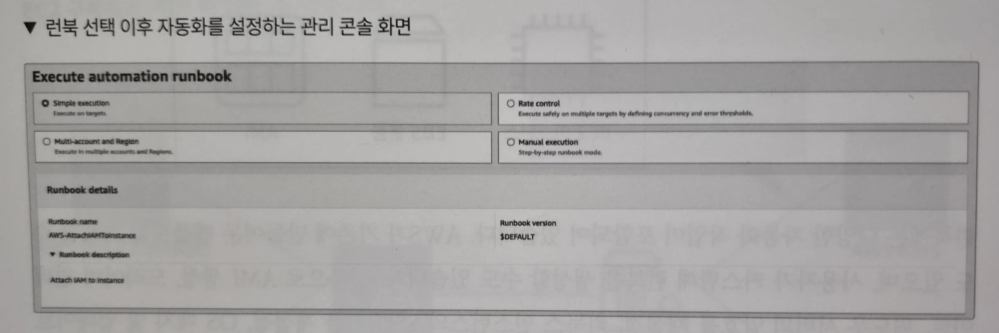
- 런북을 선택했다면, 자동화를 설정하여 실행할 수 있다.
- 런북을 자동화하면 복잡한 IT 작업을 간소화하고, 운영 효율성을 크게 향상시킬 수 있다.
- 대규모 환경이나 복잡한 시스템에서 일관된 관리와 신속한 문제 해결에 매우 유용

## 노드 관리, 플릿 관리자

- 세션 관리자로 접속을 수행하면 리눅스와 윈도우 환경 모두 터미널 환경이 표시되며 명령어로만 작업을 수행할 수 있다.
- AWS에서 UI를 사용해 윈도우 환경을 다룰 수 있도록 플릿 관리자를 지원하고 있다.

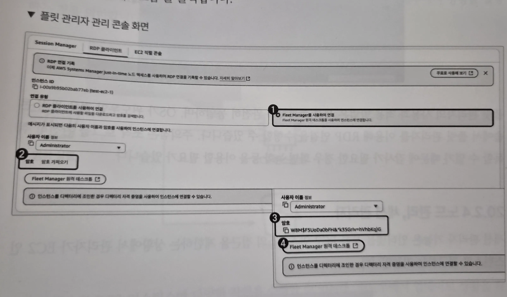

1. 인스턴스 연결 화면에서 ‘Fleet Manager를 사용하여 연결’ 선택
2. ‘암호 가져오기’ 클릭하여 해당 EC2 인스턴스의 키 페어 선택
3. EC2 인스턴스의 키 페어를 선택하여 암호를 불러왔다면 인스턴스 연결 화면에 암호가 표시되는 것을 확인할 수 있다.
4. ‘Fleet Manager 원격 데스크톱’ 클릭

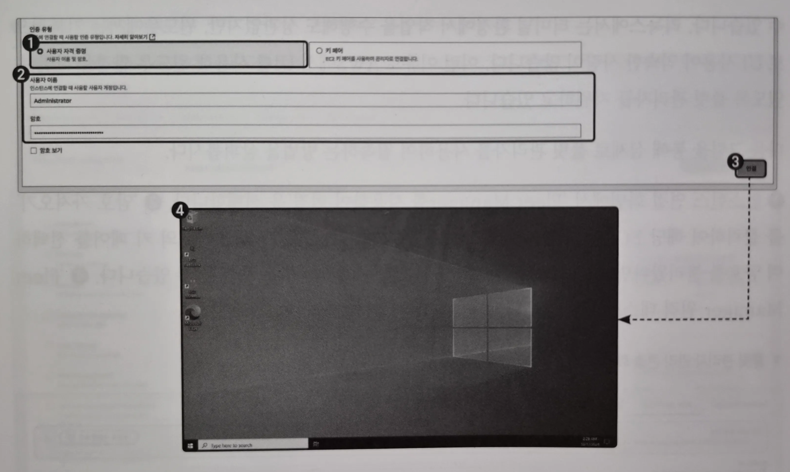
1. ‘사용자 자격증명’ 선택
2. 앞서 확인한 사용자 이름과 암호 입력
3. ‘연결’ 클릭하면 윈도우의 UI 화면이 표시되는 것 확인 가능

- 플릿 관리자의 사용과 적용 방법은 세션 관리자와 완전히 동일
- OS가 윈도우인 경우 관리 콘솔에서 플릿 관리자를 이용해 RDP 연결을 수행할 수 있다.
- 주의점은 조작 로그를 완전히 취득할 수 없기 때문에 감사가 필요한 경우 화면 녹화 등을 이용할 필요가 있다.

## 노드 관리, 세션 관리자

> 세션 관리자 : 인터넷을 통한 EC2 인스턴스의 접근을 제한하는 상황에서 관리자가 EC2 인스턴스로 접근하는 기능

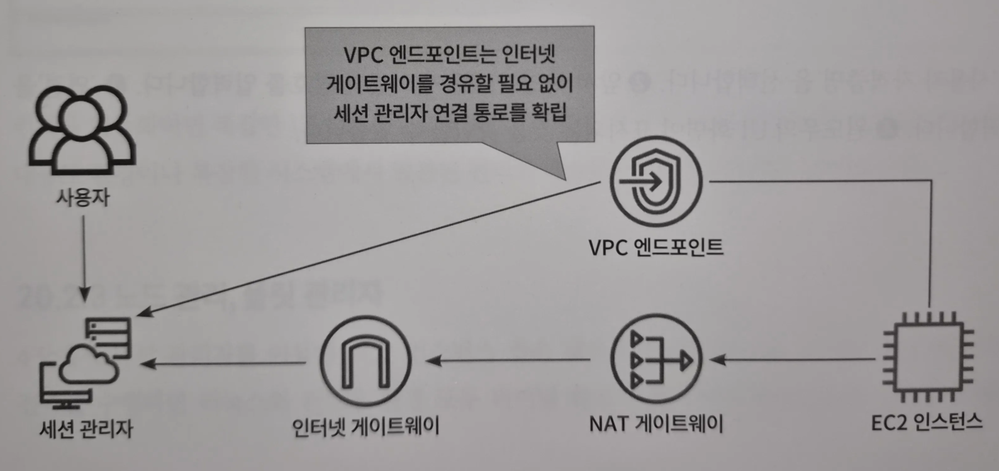
- EC2 인스턴스로 접근하려면 별도의 발판 서버는 불필요하며, EC2 인스턴스가 외부로 나갈 수 있게 NAT 게이트웨이 혹은 VPC 엔드포인트를 생성하는 것이 일반적
- EC2 인스턴스 내부에서 외부로 통하는 경로가 생성되었다면 사용자는 관리 콘솔 화면에서 세션 관리자를 통해 EC2 인스턴스로 접속할 수 있다.

## 노드 관리, 명령 실행

> 명령 실행 : 관리형 노드의 구성을 원격으로 안전하게 관리하는 기능

> EC2 인스턴스 내부에서 명령을 실행
>

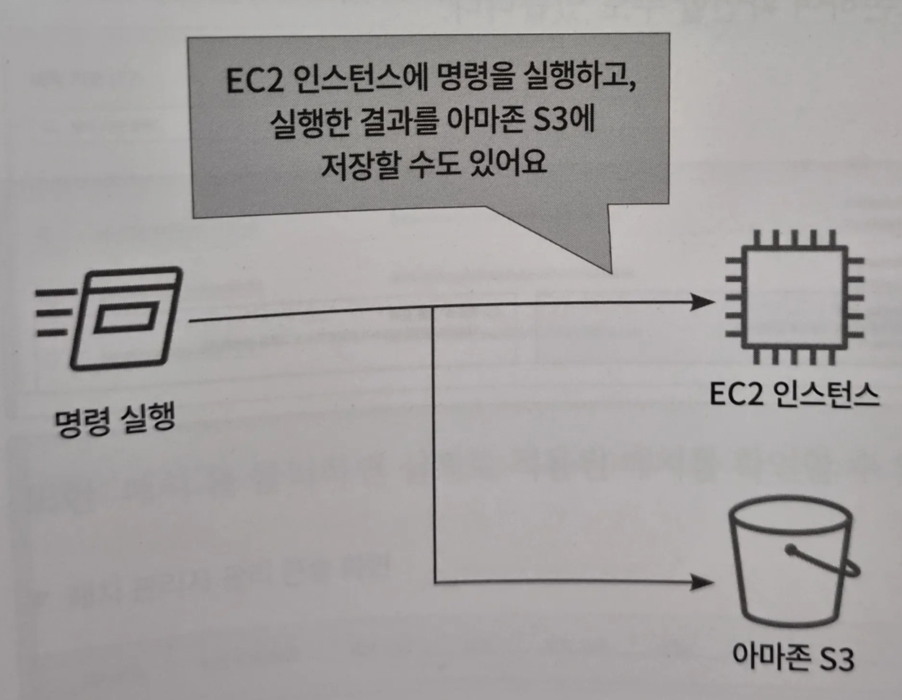
- 윈도우에서 업데이트 상황을 확인하고, 업데이트를 수행하거나, SSM 에이전트를 설치하는 등 AWS에서 제공하는 명령 실행을 사용할 수 있다.
- 사용자가 직접 명령을 커스텀해 EC2 인스턴스에 다양한 명령 적용 가능
- 실행한 명령 로그를 아마존 S3로 보내 결과를 해석할 수도 있다.

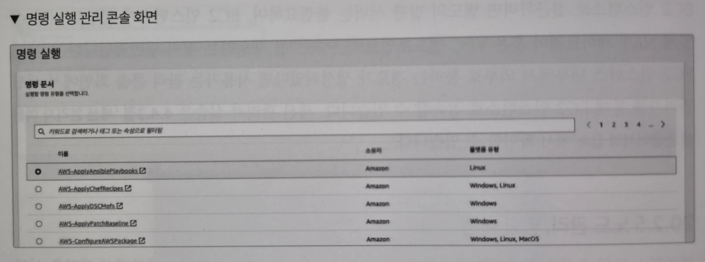
- 명령 실행 관리 콘솔 화면에서는 어떠한 명령을 실행할지 명령 문서를 선택할 수 있다.

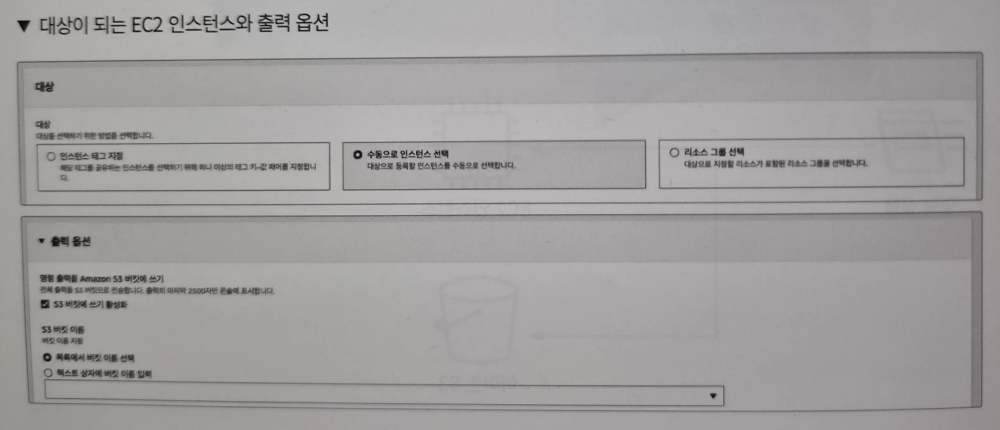
- 명령 문서를 선택했다면, 해당 명령을 실행할 EC2 인스턴스를 선택할 수 있다.
- 추가적인 옵션으로는 명령 실행 결과를 아마존 S3에 보존하여 확인할 수도 있다.
- 이런 명령 실행은 EC2 인스턴스를 구축한 초기에 유용하게 활용 가능하다.

## 노드 관리, 패치 관리자

> 패치 관리자 : 인스턴스에 대한 보안 및 기타 업데이트를 자동으로 적용하는 프로세스를 관리

- 패치가 자동으로 수행되도록 설정
- 특정 시간대에 패치를 적용하거나 수동으로 긴급 패치 수행
- 패치 작업을 중앙에서 효율적으로 관리하고, 보안 취약점을 신속하게 해결할 수 있다.
- 패치 적용 상태를 모니터링하고 보고서를 제공해 인스턴스의 보안 상태를 지속적으로 파악할 수 있게 도와준다.
- AWS에서의 패치 적용은 자동 적용이 모범 사례이지만 프로젝트에 따라 특정 패치만을 허용하는 경우도 있으므로 이 경우 패치 관리자를 사용해 설정할 필요가 있다.

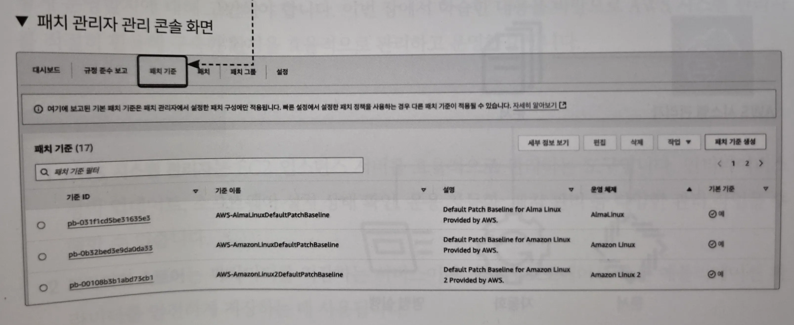
- 패치 관리자 화면에서 ‘패치 기준’을 클릭하면 AWS에서 기본적으로 제공하는 패치 기준을 확인할 수 있으며, 이는 자동 적용이 되어 있다.

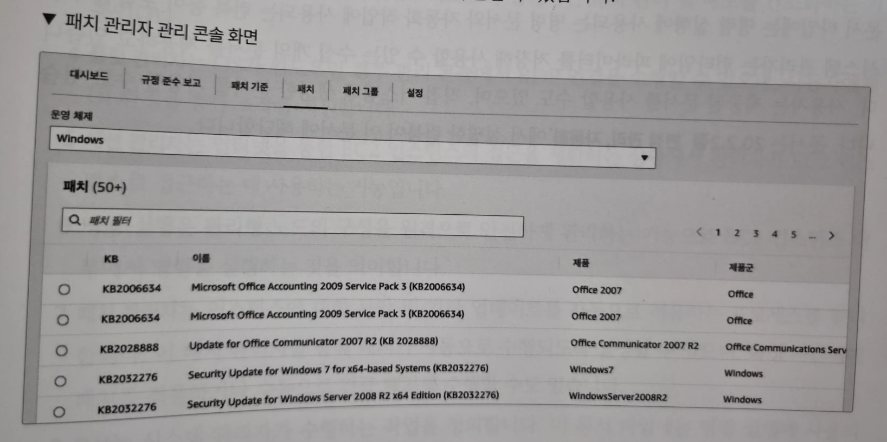
- ‘패치’를 클릭하면 실제로 적용된 패치 확인 가능
- 이외에 언제 패치 작업을 수행할지에 대한 적절한 시간대를 적용할 수 있다.
- AWS에서는 온디맨드 혹은 메이터넌스(Maintenance) 윈도우를 이용한 패치 관리가 모범 사례지만, 프로젝트에 따라 다운 타임을 별도로 관리하고 싶은 경우 패치 관리자 이용

## 공유 리소스, 문서

> 문서 : 시스템 관리자가 수행하는 작업 정의

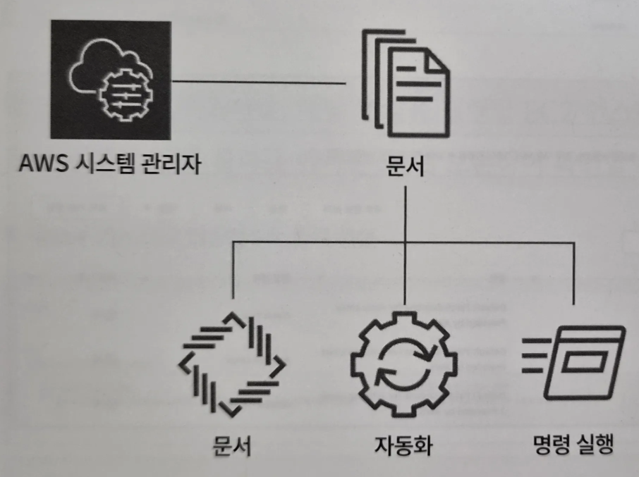
- 문서 타입에는 명령 실행에 사용되는 명령 문서와 자동화 작업에 사용되는 런북 등이 포함된다.
- 시스템 관리자는 런타임에 파라미터를 저장해 사용할 수 있는 수십 개의 문서를 제공하고 있다.
- 사용자는 제공된 문서를 사용할 수도 있으며, 직접 커스텀해 생성한 문서를 사용할 수 있다.