# AWS에서 동작하는 웹 서비스 구조와 원리 파악하기

- AWS의 웹 서비스는 기본적으로 클라우드 기반으로 구축된다.
    - AWS IAM : 사용자 및 AWS 리소스에 대한 액세스를 제어하는 권한 관리 서비스
    - 아마존 EC2 : AWS에서 제공하는 가상 클라우드 서버
    - 아마존 RDS : 다양한 데이터베이스 엔진을 제공하는 관계형 데이터베이스
    - 아마존 S3 : 객체(파일 및 데이터)를 저장하는 객체 스토리지 서비스
- 이 4가지 서비스는 클라우드에서 웹 서비스를 구성하는 기본 서비스이다.
- 클라우드 기반 서버와 스토리지, 데이터베이스, 보안 등의 다양한 기능과 옵션을 제공하여 사용자가 필요한 웹 서비스를 구축하고 운영할 수 있도록 한다.

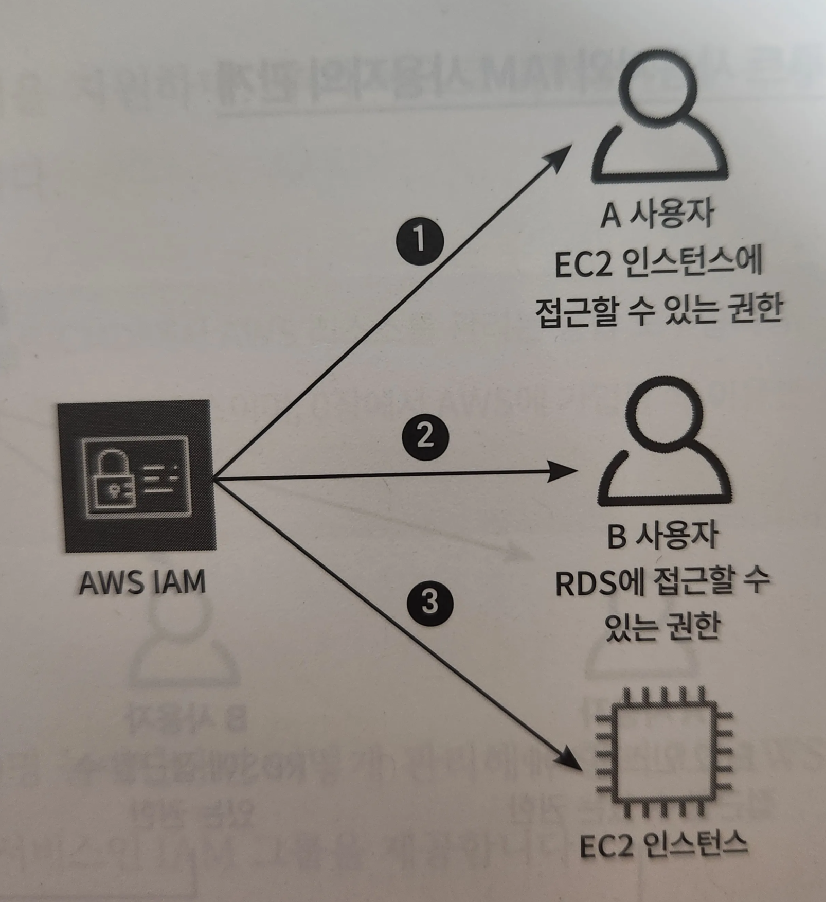
1. 사용자가 AWS 서비스인 세션 관리자(Session Manager)를 이용하여 EC2 인스턴스로 안전하게 접속을 시도
2. EC2 인스턴스에서는 세션 관리자를 이용할 수 있는 권한과 아마존 S3에 대한 액세스 권한을 가진 IAM 역할을 추가
3. 아마존 S3에서는 정적 데이터를 관리하거나, EC2 인스턴스와의 상호작용을 통해 데이터를 주고받는다.
4. EC2 인스턴스에서 RDS로 접근하여 데이터베이스를 관리하거나 쿼리를 관리할 수 있다.
5. 사용자는 설치한 AWS CLI를 이용하여 접속하고자 하는 AWS 확녁으로 세션 관리자 포트 포워딩 세션을 생성
6. 포트 포워딩 세션을 생성하면 사용자 환경과 AWS를 이어주는 세션 관리자 터널(Session Manager Tunnel)이 생성되며, 생성된 터널을 이용하여 사용자 환경에서 EC2 인스턴스 혹은 RDS로 접속할 수 있다.

# 권한 관리 서비스, AWS IAM 파악하기

## AWS IAM이란?

> IAM(Identity and Access Management) : AWS 계정 내에서 각 사용자, 그룹 또는 리소스에 대한 권한을 중앙 집중적으로 관리한다.

> AWS 리소스에 대한 액세스를 제어하고 각 사용자에게 필요한 작업만 수행할 수 있는 권한을 부여한다.
>
- ex. IAM 정책을 사용하여 특정 작업 혹은 리소스에 대한 접근을 세부적으로 제어하고 관리할 수 있다.
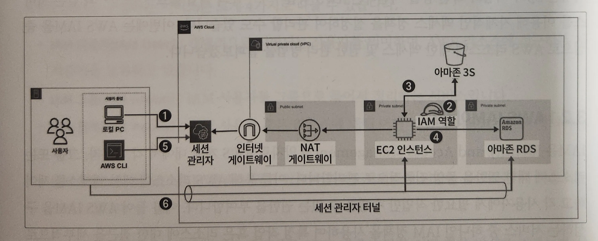

1. A 사용자에게는 EC2 인스턴스에만 접속할 수 있고 다른 작업은 제한하는 권한만을 부여
2. B 사용자는 RDS에 접근할 수 있는 권한을 부여받고, 다른 작업은 할 수 없다.
3. 권한을 사용자뿐만 아니라 리소스에게도 부여하여 특정 작업을 허용할 수도 있다.

## AWS IAM 살펴보기

- IAM 사용자 (IAM User) : 개별적으로 식별되는 사용자를 의미하며, AWS 리소스에 접근하는 자격증명을 보유하고 있다.
- IAM 그룹 (IAM Group) : IAM 사용자를 그룹으로 묶어서 정리하는 서비스
- IAM 정책 (IAM Policy) : 어떤 사용자 혹은 리소스에 대해 어떤 작업이 허용되는지를 정의하는 서비스
- IAM 역할 (IAM Role) : IAM 정책을 담고 있으며, AWS 서비스에 권한을 부여하는 데 사용

### IAM 사용자

> IAM 사용자 : 특정 역할과 권한을 갖는 개별 사용자


> IAM 사용자는 개별적으로 식별되며, 부여받은 권한을 바탕으로 AWS 리소스를 제어할 수 있다.
>
- 루트 사용자에 의해 생성 및 관리되며 AWS 내에서 세분화된 권한 관리와 보안 강화에 사용되는 서비스

### 루트 사용자와 IAM 사용자의 관계

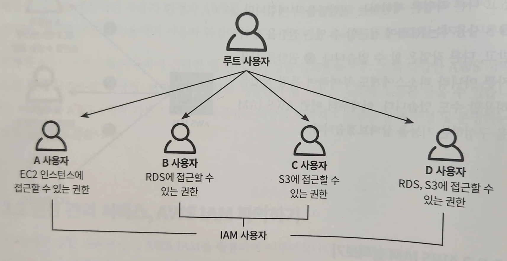
- 루트 사용자 : 모든 사용자의 최상위 계층에 있으며 관리자 권한을 가지고 있기 때문에 AWS의 모든 작업을 수행할 수 있다.
- IAM 사용자 : 보안 목적을 위해 루트 사용자에게서 최소한의 권한만을 부여받아 특정 리소스에 접근할 수 있다.
- 각 개별 사용자에게 필요한 권한을 부여하는 것이 일반적

### IAM 사용자 접속 방법
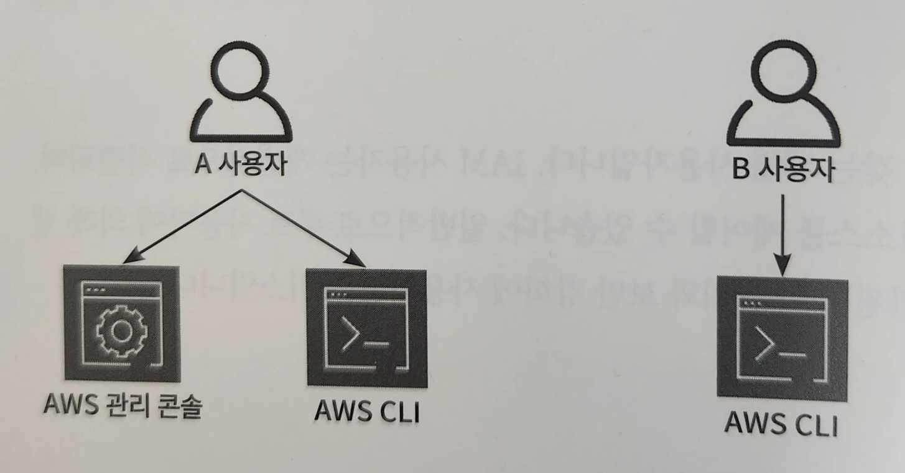

- 기본적으로 AWS CLI(command line interface) 접속 방법을 지원하며, 추가적으로 AWS 관리 콘솔(AWS Management Console) 접속 방법을 선택할 수 있다.

### IAM 그룹

> IAM 그룹 : 같은 권한을 가진 사용자를 묶어 관리하는 서비스

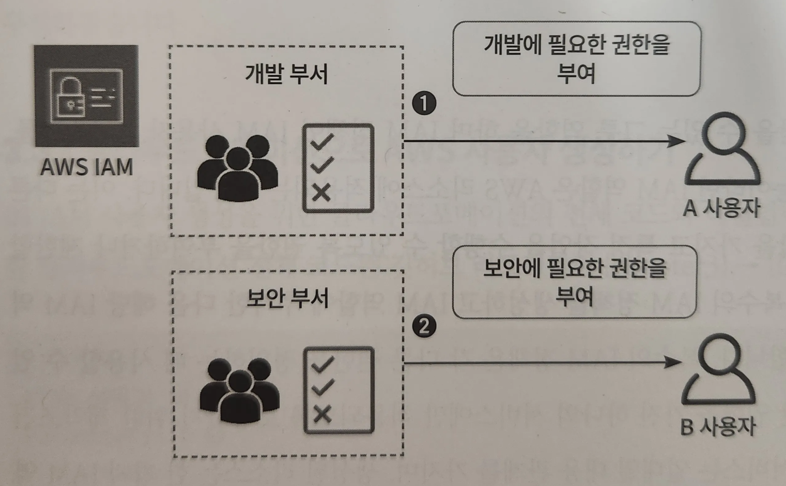

1. 개발 부서는 개발에 필요한 권한만을 부여받는다. 이 권한은 해당 부서에 속한 모든 사용자에게 상속되며 이를 통해 개발 부서는 개발에 필요한 리소스에 접근하고 업무를 수행할 수 있다.
2. 보안 부서도 보안에 필요한 권한만을 부여받으며, 해당 부서에 속한 모든 사용자에게 권한이 상속된다. IAM 그룹 기능을 활용하면 권한에 따라 그룹으로 분리하여 효율적으로 권한 부여와 관리를 할 수 있도록 도와준다.

### IAM 정책

> IAM 정책을 통해 IAM 사용자 또는 IAM 그룹, 리소스에 부여할 권한을 생성할 수 있다.


- AWS 관리형 정책 : AWS가 생성 및 관리하는 정책으로 사용자가 직접 정책을 수정할 수 없으며 정해진 권한만 사용할 수 있다.
- 고객 관리형 정책 : 사용자가 생성하고 관리할 수 있는 정책으로 시각적인 형식이나 JSON 형식으로 권한을 정의할 수 있다. 리소스에 대한 특정 액세스 권한을 부여하거나 제한하고 싶을 때 고객 관리형 정책을 사용하는 것이 유용하다.
- 인라인 정책 : IAM 사용자, IAM 그룹, IAM 역할에 대해 일대일 관계를 유지하는 정책. 하나의 IAM 사용자, IAM 그룹, IAM 역할에 적용되는 기능이며 각각 삭제될 때 적용된 인라인 정책도 함께 삭제된다.

### IAM 역할

> IAM 역할 : IAM 정책을 담을 수 있는 그릇 역할이자 AWS 리소스에 적용되는 기능

- 다른 AWS 서비스에서 IAM 역할을 가지고 특정 작업을 수행할 수 있도록 권한을 부여하거나 제한할 때 사용된다.
- 일반적으로 복수의 IAM 정책을 생성하고 IAM 역할에 추가한 다음 해당 IAM 역할을 특정한 리소스에 추가한다.
- 복수의 IAM 정책은 각 다른 권한을 정의하는 데 사용 가능
- IAM 역할은 특정한 권한 권한을 가진 하나의 서비스에만 적용되도록 보장하기 위한 제약조건

→ IAM 역할과 AWS의 서비스는 일대일 대응 관계를 가지며, 생성된 리소스는 한 가지 IAM 역할 만을 부여받을 수 있다.

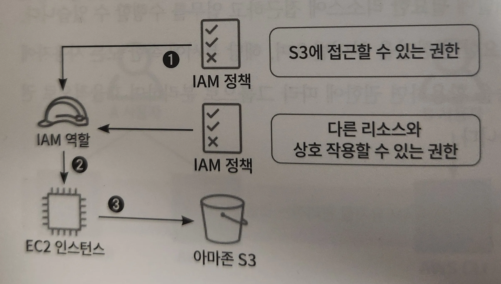
1. AWS S3에 엑세스할 수 있는 IAM 정책과 다른 리소스와 상호 작용할 수 있는 정책을 생성하고, IAM 역할에 추가한다.
2. IAM 역할을 AWS EC2 인스턴스에 추가
3. EC2 인스턴스에서 S3로 액세스할 수 있다.

# AWS IAM 생성하기

## 클라우드포메이션으로 AWS 사용자 생성하기

- **IAM_User.yml**

    ```yaml
    # ------------------------------------------------------------#
    # Input Parameters
    # ------------------------------------------------------------#
    Parameters: # 유저 이름과 비밀번호 입력을 위한 파라미터
      UserName:
        Description: IAM User Name.
        Type: String
      UserPassword: # AWS 콘솔 환경에서의 노출을 피하기 위해 파라미터로 입려받는 것이 좋음
        Description: IAM User Password.
        Type: String
        NoEcho: true # NoEcho를 이용하여 입력한 파라미터값을 숨길 수 있음
    ```

    ```yaml
    # ------------------------------------------------------------#
    #  Create IAM User
    # ------------------------------------------------------------#
    Resources:
      IAMUser:
        Type: AWS::IAM::User
        Properties: # 사용자 이름과 비밀번호, 할당할 권한 지정
          UserName: !Ref UserName # 파라미터에서 입력한 유저 이름을 참조
          LoginProfile:
            Password: !Ref UserPassword # 파라미터에서 입력한 비밀번호를 참조
          ManagedPolicyArns:
            - arn:aws:iam::aws:policy/AdministratorAccess # IAM 사용자에게 관리자 권한을 할당
    ```

    ```yaml
      # ------------------------------------------------------------#
      #  Create IAM AccessKey & SecretKey
      # ------------------------------------------------------------#
      IAMUserAccessKey:
        Type: AWS::IAM::AccessKey # CLI를 사용하기 위해 액세스 및 시크릿 키 생성
        Properties:
          UserName: !Ref IAMUser
    ```

    ```yaml
     # AWS 시크릿 관리자에 액세스 키와 시크릿 키 저장 
       AccessKeySecretManager:
        Type: AWS::SecretsManager::Secret # 액세스 키 및 시크릿 키를 시크릿 매니저에 저장
        Properties: # {"Key":"Value"}
          Name: !Sub ${IAMUser}-credentials
          SecretString: !Sub "{\"accessKeyId\":\"${IAMUserAccessKey}\",\"secretKeyId\":\"${IAMUserAccessKey.SecretAccessKey}\"}"
    ```


## UI로 불러와 AWS 사용자 리소스 생성하기
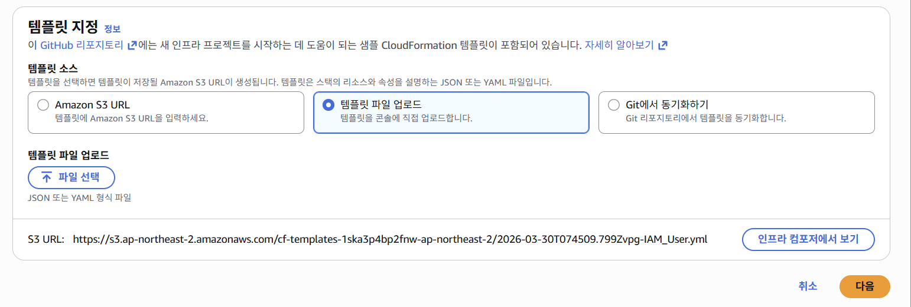
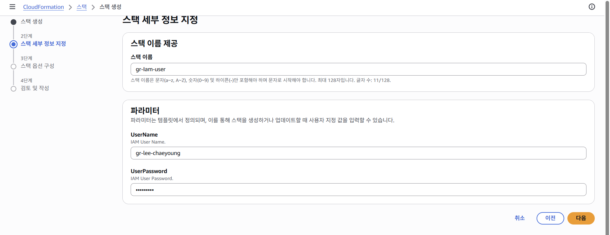
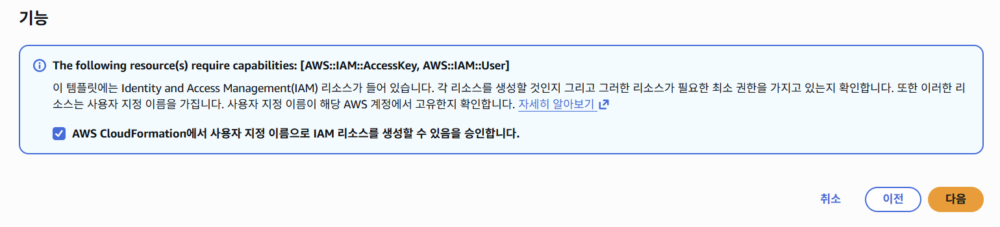
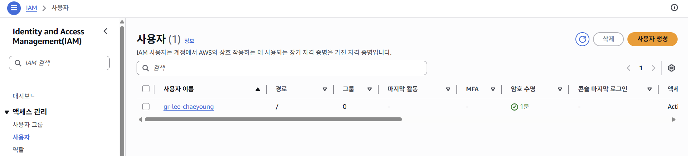
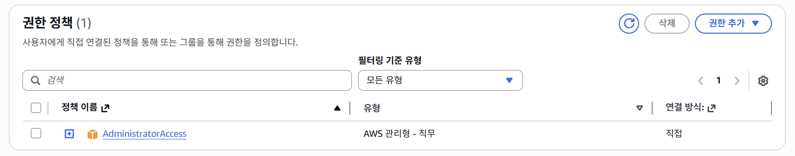
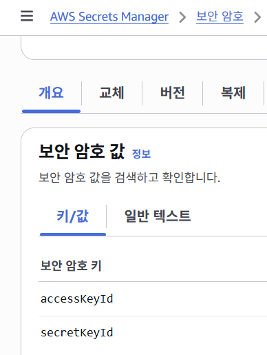

- 계정 ID 확인 및 복사 (사진 없음)
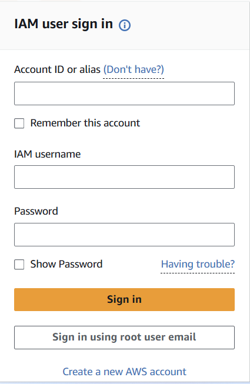

- 계정 ID 입력 및 사용자 이름(gr-lee-chaeyoung)과 암호 입력

- 생성한 IAM 사용자로 로그인에 성공


## AWS CLI 환경 구성하기

> 루트 사용자를 이용해 윈도우에서 AWS CLI 환경을 구성해보자.
>

https://awscli.amazonaws.com/AWSCLIV2.msi → 설치 URL

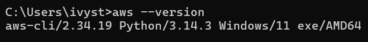
- AWS 관리 콘솔에서 액세스 키와 시크릿 키를 확인한다.
- IAM 사용자 : AWS 시크릿 관리자 콘솔 화면의 보안 암호에 저장되어 있는 액세스 키와 시크릿 키
- 루트 사용자 : 액세스 키와 시크릿 키를 AWS 관리 콘솔에서 생성해야 한다.
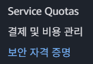

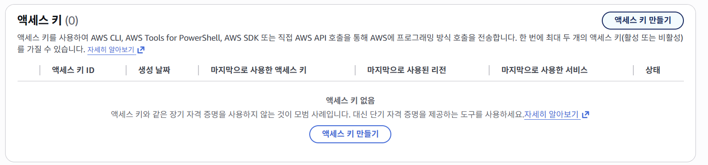
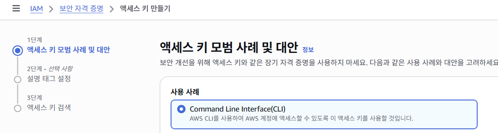
1. AWS 설정 확인
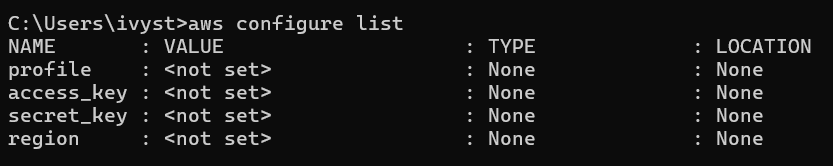

2. AWS 구성 설정 진행
3. 액세스 키, 시크릿 키, 리전, 포맷 형식 입력

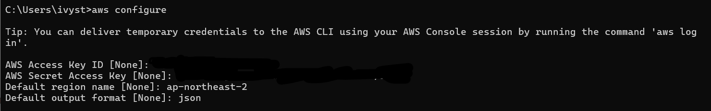
4. AWS 구성 설정 확인

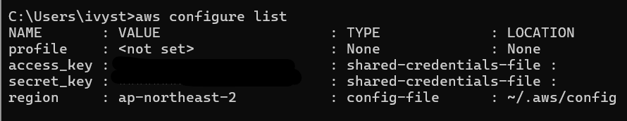
5. AWS 사용자 정보 요청
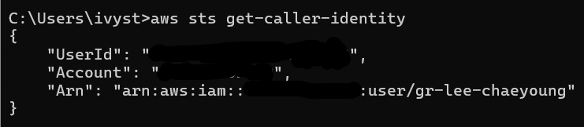

- `C:Users\Administrator\.aws`  혹은 `C:\Users\사용자명\.aws` 경로에 자격증명 파일이 만들어지게 된다.
- 자격증명 파일은 credentials 파일과 config 파일로 나눠지는데 credentials 파일은 민감한 정보를 저장하는 파일로 액세스 키, 시크릿 키에 대한 정보를 저장한다.
- config 파일은 중요하지 않은 정보 즉 리전, 포맷과 같은 정보를 저장
- 각 파일에 대한 정보는 `aws configure` 명령어를 통해 자동으로 설정되어있다.
- 마지막으로 파워셸에서 `aws sts get-caller-identity` 명령어를 입력해 AWS 사용자 정보를 요청하고, 반환된 정보 확인
- 반환된 정보가 있으면 윈도우 환경에서의 AWS CLI 환경 구성이 완료된다.

## AWS MFA 설정하기

> AWS에서는 루트 사용자 또는 IAM 사용자를 이용할 때 보안을 고려해 MFA 설정이 필수이다.
>
1. AWS CLI로 MFA를 설정하기 위해 AWS 사용자를 호출한다.

```bash
aws sts get-caller-identity
```

2. 구성 및 자격증명 파일을 설정한다.
3. 가상 MFA 디바이스의 시리얼 넘버를 확인한다.

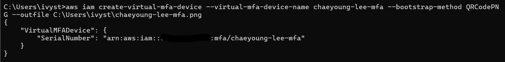
- 가상 MFA 디바이스를 생성하면 시리얼 넘버가 표시된다.
- 지정한 경로에 QR 코드 이미지가 다운로드되었으며, 해당 QR 코드를 이용해 MFA 디바이스 설정을 진행한다.
4. IAM 사용자에게 MFA 디바이스를 설정한다.

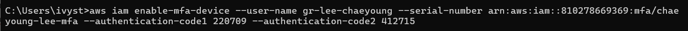
- Google Authenticator 앱 활용하여 QR 코드 스캔 및 MFA 코드 관리
5. AWS에 로그인 시도하여 MFA 코드를 요구하는지 확인
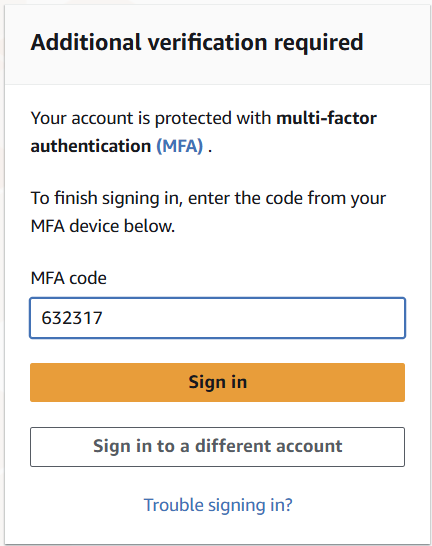

- MFA 코드는 Google Authenticator를 통해 일회용 MFA 코드를 입력
6. 로그인한 사용자 정보를 확인하면, MFA가 설정되어 있다.
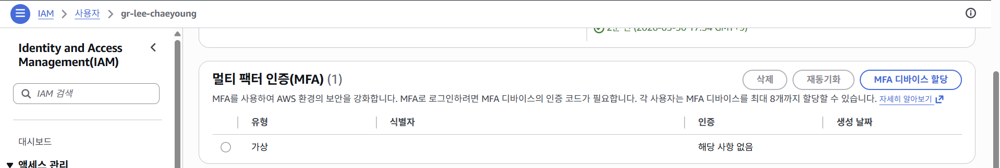

- 이를 통해 더 안전하게 AWS 계정을 보호할 수 있다.