# 가상 클라우드 서버, 아마존 EC2란?

> 아마존 EC2 : AWS에서 제공하는 가상 클라우드 서버


> Amazon Elastic Compute Cloud
>
- 단 몇 분으로 서버를 구축할 수 있으며, 물리 서버 구축과 환경 구축의 어려움을 해소할 수 있다.
- AWS에서의 서버 관리는 주로 가상 클라우드 서버인 아마존 EC2를 활용해 이루어진다.

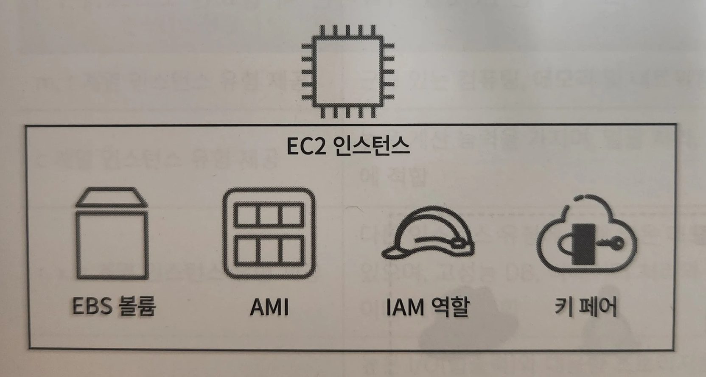
# 가상 클라우드 서버, 아마존 EC2 살펴보기

- AMI(Amazon Machine Image) : EC2 인스턴스를 시작하는 템플릿
- 인스턴스 유형 : CPU, 메모리와 같은 하드웨어의 조합
- 스토리즈 옵션 : 인스턴스 스토어 볼륨, EBS 볼륨으로 구분되며, EC2 인스턴스의 저장 공간
- 보안 그룹 : EC2 인스턴스에 대한 네트워크 트래픽을 제어하는 가상 방화벽
- 키 페어 : EC2 인스턴스 접속에 사용되는 키

## AMI

> AMI(Amazon Machine Image) : 아마존 EC2를 시작하는 데 필요한 소프트웨어 구성을 담고 있는 템플릿


- 소프트웨어 구성에는 OS, 애플리케이션 등을 구성하여 제공하고 있다.
    - ex. 윈도우, 맥OS, 우분투, 레드헷
- AMI를 선택할 수 있는 방법
    - Quickstart AMIs : 빠른 아마존 EC2 구축을 위해 선택할 수 있는 AMI
    - 내 AMI : 내가 직접 만든 AMI
    - AWS Marketplace AMI : 기업이 만든 AMI이며, OS를 포함해 워드프레스와 같은 다양한 소프트웨어가 설치된 AMI를 사용할 수 있다.
    - 커뮤니티 AMI : 사용자가 만든 AMI로, AWS에 의해 검토를 받은 AMI가 아니기 때문에 사용에 주의 필요

## 인스턴스 유형

> 인스턴스 유형 : CPU, 메모리와 같은 하드웨어 조합


- 인스턴스 유형에는 범용, 컴퓨팅 최적화, 메모리 최적화, 스토리지 최적화, 가속화된 컴퓨팅 등 다양한 사례에 최적화된 인스턴스 유형을 제공하고 있다.

| 인스턴스 유형 | 특징 | 사용 사례 |
| --- | --- | --- |
| m, t 계열 인스턴스 유형 제공 | 균형 있는 컴퓨팅, 메모리 및 네트워킹 리소스를 제공 | 범용 |
| c 계열 인스턴스 유형 제공 | 높은 계산 능력을 가지며, 일괄 처리, 동영상 인코딩에 적합 | 컴퓨팅 최적화 |
| r, x, z 계열 인스턴스 유형 제공 | 다른 인스턴스 유형에 비해 많은 메모리를 탑재하고 있으며, 고성능 DB, 빅데이터 처리와 같은 대규모 데이터 처리에 적합 | 메모리 최적화 |
| h, i, d 계열 인스턴스 유형 제공 | 높은 I/O(입출력)와 대용량 스토리지를 가지며, 높은 I/O가 요구되는 분산 파일시스템, NoSQL 데이터베이스 작업에 적합 | 스토리지 최적화 |
| p, g, f 계열 인스턴스 유형 제공 | CPU에서 실행되는 소프트웨어를 보다 효율적으로 처리하며, 기계 학습, 고성능 컴퓨팅, 실시간 비디오 처리에 적합 | 가속화된 컴퓨팅 |
- 인스턴스 유형에서 나타내는 m, t, c, r, x, z와 같은 계열을 인스턴스 패밀리라고 한다.


1. 인스턴스 패밀리라고 하며 인스턴스 패밀리는 사용 사례를 기준으로 범용, 컴퓨팅 최적화, 메모리 최적화, 스토리지 최적화, 그리고 가속화된 컴퓨팅과 같은 다양한 유형으로 분류된다.
2. 인스턴스 세대를 의미하며, 숫자가 큰 쪽이 최신 세대
3. 인스턴스 옵션을 의미하며, 옵션이 없는 인스턴스 유형도 있다.
4. 인스턴스 크기를 의미하며, CPU와 메모리에 따라 인스턴스 크기가 분류된다.
    - nano → micro → medium → small → large → xlarge → 2xlarge
- 인스턴스 유형에 따라 옵션이 존재하며, 다음과 같은 기능을 제공

| 인스턴스 옵션 | 특징 |
| --- | --- |
| a | AMD 프로세서 |
| g | AWS 그라비톤(Graviton) 프로세서 |
| i | 인텔 프로세서 |
| d | 인스턴스 스토어 볼륨(임시 스토리지) |
| n | 네트워크 및 EBS 최적화 |
| e | 추가 스토리지 또는 메모리 |
| z | 고성능 |
| flex | Flex 인스턴스(인스턴스의 저비용 버전 ex: M7iFlex) |

## 스토리지 옵션

- 아마존 EC2에서는 두 가지 스토리지 옵션을 선택할 수 있다.

### 인스턴스 스토어 볼륨

- 휘발성 스토리지이며, EBS 볼륨보다 높은 IOPS 및 처리량, 낮은 대기 시간으로, 높은 I/O 성능이 필요한 스토리지에 이상적인 옵션
- 휘발성이기 때문에 임시 스토리지로 활용되며, 디스크에 장애가 발생하거나, EC2 인스턴스가 중지 혹은 삭제된 경우 데이터가 손실된다.
- EBS처럼 별도 백업 불가능 → 데이터 복원 X, EC2 인스턴스에 분리 불가능
- EC2 인스턴스 중지가 아닌 재부팅의 경우 데이터 손실을 발생하지 않는다.
- IOPS : 스토리지의 성능 지표로서 1초간 읽고 쓸 수 있는 횟수를 의미하며, IOPS가 높을수록 고속으로 데이터를 읽고 쓸 수 있다.
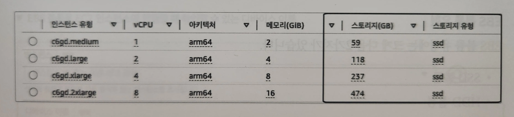

- 인스턴스 유형을 선택할 시, 인스턴스 스토어 볼륨의 사용 유무를 확인할 수 있으며, 스토리지 용량과 유형을 확인할 수 있다.

### EBS 볼륨

- EBS 볼륨은 EC2 인스턴스와는 별개로 독립적으로 관리되는 서비스이며, 별도 비용이 발생한다.

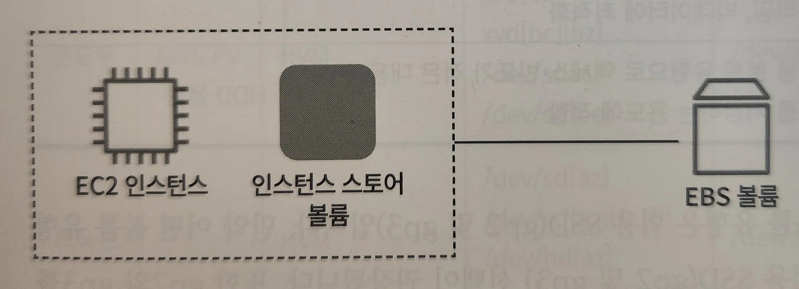
- 복수의 EBS 볼륨을 생성해서 EC2 인스턴스에 연결할 수 있으며, 백업 및 복원을 통해 데이터 손실을 방지할 수 있다.
- EBS 볼륨은 비휘발성이므로 EC2 인스턴스를 중지하거나 삭제해도 데이터 손실이 발생하지 않기 때문에 특수한 상황이 아니라면 EBS 볼륨 사용 권장
- EBS 볼륨 유형에는 SSD 볼륨과 HDD 볼륨이 있다.

| 볼륨 유형 | 특징 | 비고 |
| --- | --- | --- |
| 범용 SSD (gp2, gp3) | 기본 EBS 볼륨 유형이며, 비용과 성능 면에서 밸런스가 좋고 폭넓은 용도로 사용 가능 | SSD 볼륨 |
| 프로비저닝된 IOPS (io1, io2) | 미션 크리티컬하고 높은 I/O 성능이 요구되는 데이터베이스, 애플리케이션에 적합 | SSD 볼륨 |
| 처리량에 최적화된 HDD (st1) | 고속 HDD를 기반으로 사용하며 안정적인 처리량이 필요한 시스템에 적합한 볼륨 유형이며, 로그 관리, 스트리밍, 빅데이터에 최적화 | HDD 볼륨 |
| Cold HDD (sc1) | 저비용 볼륨 유형으로 액세스 빈도가 적은 대용량 데이터를 저장하는 용도에 적합 | HDD 볼륨 |
- 일반적으로 널리 사용되는 EBS 볼륨 유형은 범용 SSD (gp2, gp3)
- gp3는 GB당 최대 20%의 비용 절감을 제공하며, 저렴한 비용으로 더 적은 볼륨을 프로비저닝할 수 있어 더 높은 성능을 유지하는 데 도움이 된다.

### 디바이스 이름

> EC2 인스턴스에서 사용하는 볼륨을 식별하는 데 사용한다.
>
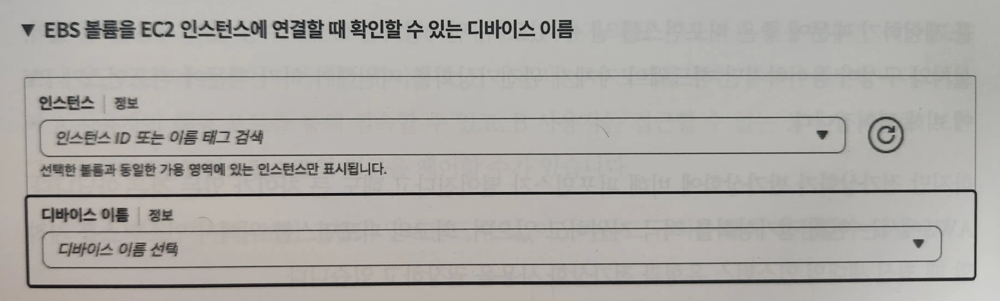

- EBS 볼륨을 EC2 인스턴스에 연결할 때, 대상 인스턴스와 디바이스 이름을 지정할 수 있다.

| OS | 드라이버 타입 | 가상화 | 사용 가능 | 루트용으로 예약됨 | EBS 볼륨으로 권장 |
|----|--------------|--------|-----------|------------------|------------------|
| 윈도우 | AWS PV | HVM | xvd[bz]<br>xvd[bc][az]<br>/dev/sda1<br>/dev/sd[be] | /dev/sda1 | xvd[fz]* |
| 리눅스 | - | HVM | /dev/sd[az]<br>/dev/sd[az][1-15]<br>/dev/hd[az]<br>/dev/hd[az][1-15] | /dev/sda1 | /dev/sd[fp]<br>/dev/sd[fp][1-6] |
| 리눅스 | - | PV (paravirtual) | /dev/sd[a-z]<br>/dev/xvd[a-d][a-z]<br>/dev/xvd[e-z] | /dev/sda1 또는 /dev/xvda | /dev/sd[fp]* |
- 윈도우는 사용 가능한 디바이스 이름을 알기 위해서는 내가 사용하는 혹은 사용할 드라이버 타입을 확인할 필요가 있다.
- EC2 인스턴스에서 AWS가 제공하는 윈도우 서버는 초기 상태에서 반가상화 드라이버 등의 특수 드라이버가 설치되어 있다.
- 리눅스는 가상화로 디바이스 이름이 나누어지며, 가상화는 전가상화(HVM)와 반가상화(PV)로 나누어진다.
    - 전가상화 : 하드웨어 전체를 가상화
        - OS를 수정 없이 사용할 수 있으나 하드웨어 자체가 완전가상화를 지원해야 하기 때문에 퍼포먼스가 PV에 비해 떨어진다.
    - 반가상화 : 하드웨어를 일부 가상화
        - 하이퍼바이저를 통해 하드웨어를 제어하여 좋은 퍼포먼스를 낼 수 있다.
- AWS에서는 전가상화를 적극 지원하고 있으며, 최고의 퍼포먼스를 위해서 인스턴스를 시작할 때 최신 세대의 인스턴스 유형과 전가상화 사용을 권장하고 있다.
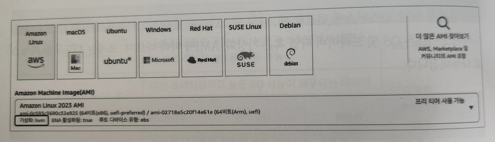

- AMI를 선택할 때 가상화를 확인할 수 있다.

## 보안 그룹

> 보안 그룹 : 네트워크 트래픽을 관리하는 서비스


> 특정 IP 주소, IP 범위, 포트 및 프로토콜을 기반으로 특정 리소스에 대한 접근을 허용하거나 거부할 수 있다.
>

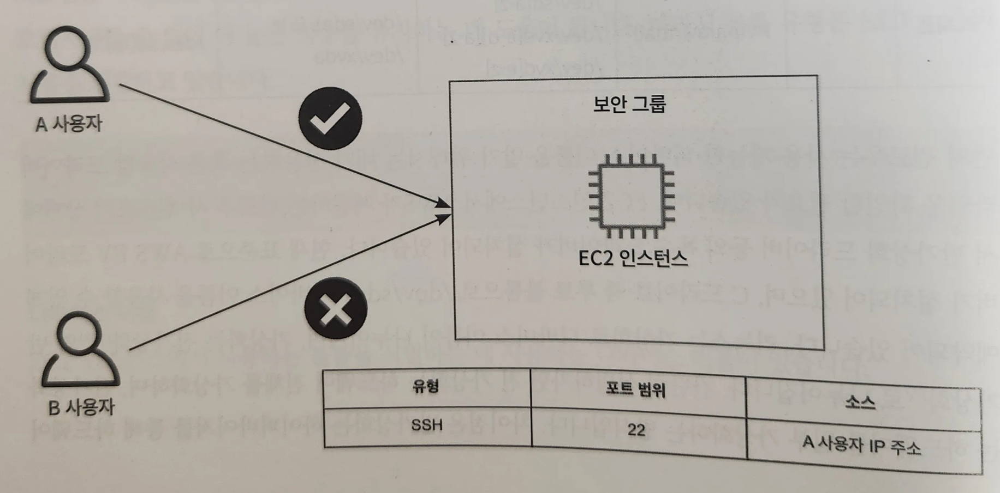
- 보안 그룹에서 22번 포트 접속에 대해 A 사용자의 IP 주소만을 허용했다면, 해당 포트로의 접근 권한이 A 사용자에게만 주어지며, B 사용자는 이 포트를 통한 접속이 차단된다.

→ 보안 그룹을 통한 EC2 인스턴스로의 접근을 제어할 수 있다.

- 이런 접속 허용, 차단을 보안 그룹의 인바운드 규칙, 아웃바운드 규칙을 통해 설정


- EC2 인스턴스에 대한 액세스(인바운드 트래픽)와 인스턴스에서의 액세스(아웃바운드 트래픽)에 대해 방화벽 역할을 하는 것이 보안 그룹이다.
- 인바운드 규칙을 통해 외부에서 EC2 인스턴스로의 접근을 어떻게 허용 또는 제한할지를 결정
- 아웃바운드 트래픽은 기본적으로 EC2 인스턴스에서 외부로 모든 트래픽을 내보낼 수 있도록 설정
- 보안 그룹 설정에서 아웃바운드 트래픽에 대한 특별한 제한이나 규칙이 없다면 EC2 인스턴스는 외부로의 통신에 필요한 모든 네트워크 연결을 수행할 수 있도록 설정된다.
- 각 EC2 인스턴스는 IP 주소를 가지며, 이런 EC2 인스턴스의 IP 주소를 이용하여 온프레미스에서 EC2 인스턴스의 접근을 허용할 수 있다.
- 이를 통해 EC2 인스턴스가 온프레미스 시스템으로 접근할 수 있도록 허용하거나, 온프레미스 시스템에서 EC2 인스턴스로의 접근을 가능하게 한다.
- EC2 인스턴스는 퍼블릭 IP 주소(공인 IP 주소)와 프라이빗 IP 주소(사설 IP 주소)가 할당되어 있다.

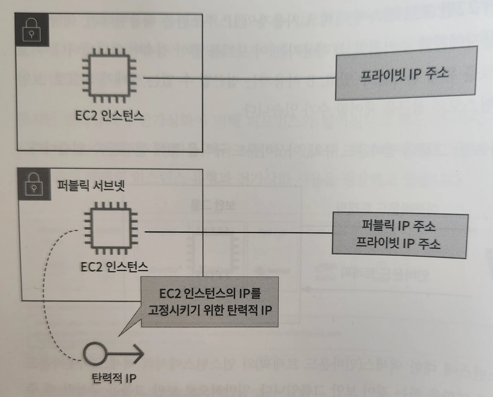
- 프라이빗 서브넷에 생성된 EC2 인스턴스는 외부에 직접 노출되지 않기 때문에 프라이빗 IP 주소만 할당된다.
    - 프라이빗 IP 주소는 해당 서브넷 내에서 고정되어 있어서 변하지 않는다.
- 퍼블릭 서브넷에 생성된 EC2 인스턴스는 외부에서 접근할 수 있어야 하므로 퍼블릭 IP 주소와 프라이빗 IP 주소가 모두 할당된다.
- 그러나 퍼블릭 IP 주소는 EC2 인스턴스를 재부팅하거나 재시작할 때마다 변경될 수 있다.

→ AWS에서 자원을 효율적으로 관리하기 위한 일종의 동적 IP 할당 방식

- AWS에서는 이런 IP 주소를 고정시키는 기능을 제공하는데 이를 탄력적 IP 주소라고 한다.
- IP 주소를 EC2 인스턴스에 할당함으로써 재부팅 혹은 재시작을 하더라도 IP 주소는 변하지 않고 고정된다.
- 탄력적 IP 주소를 사용하면 EC2 인스턴스를 안정적으로 식별하고, IP 주소가 변경되는 문제를 해결할 수 있다.

## 키 페어

> 키 페어 : EC2 인스턴스에 안전하게 접속하는 필수적인 요소로, 해당 키 페어가 없으면 EC2 인스턴스에 로그인하거나 접속하는 것이 불가능하다.

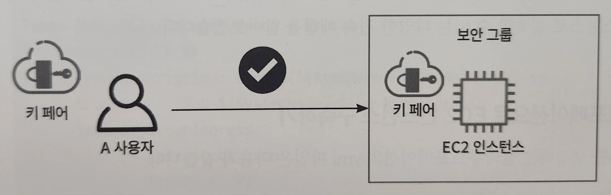

### 키 페어 유형

- RSA : 이전부터 이용되어 왔던 범용 키 페어 형식이며, 어떤 OS에서도 이용 가능
- ED25519 : 2021년 공개된 키 페어 유형으로 리눅스와 맥OS에서만 사용 가능
    - RSA보다 키 길이가 짧고 고속으로 처리할 수 있다.

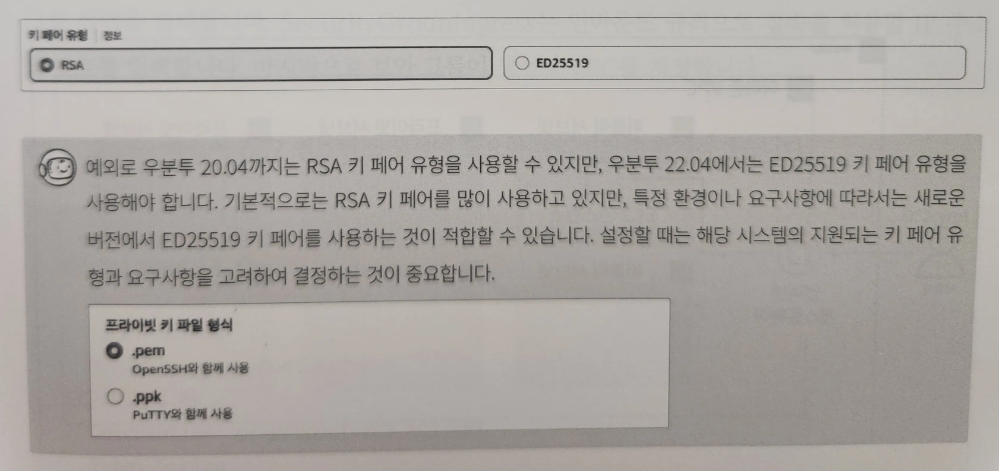
### 키 파일 형식

- .ppm(Privacy Enhanced Mail) : OpenSSH를 사용하는 환경에서 사용
- .ppk(PuTTY Private Key) : PuTTY에서 사용할 수 있는 키 파일 형식

# 아마존 EC2 구축하기

## 클라우드포메이션으로 EC2 인스턴스 구축하기
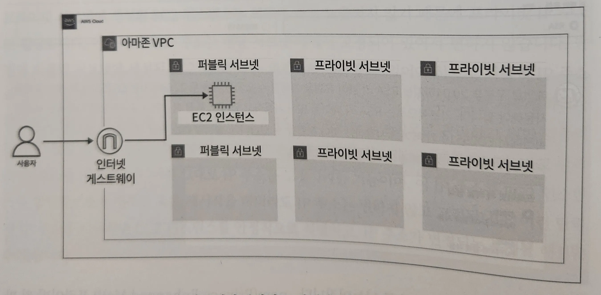

- 네트워크 구성은 2개의 퍼블릭 서브넷과 4개의 프라이빗 서브넷으로 구성
- 퍼블릭 서브넷에 EC2 인스턴스를 배치하고 인터넷 게이트웨이를 통해 EC2 인스턴스로 접속

https://github.com/classmethodjaewook/aws-developer/tree/main/chapter4/EC2/chapter4.3.1-Create-EC2

```yaml
# Security_Group.yml

    Type: AWS::EC2::SecurityGroup # 보안 그룹을 생성
    Properties:
      GroupName: !Sub ${SystemName}-${EnvName}-ec2-sg # 보안 그룹 이름을 지정
      GroupDescription: !Sub ${SystemName}-${EnvName}-ec2-sg # 보안 그룹 설명
      SecurityGroupIngress: # 허용할 IP 주소 설정
        - IpProtocol: tcp
          FromPort: 22
          ToPort: 22
          CidrIp: 0.0.0.0/0
      VpcId:
        Fn::ImportValue: !Sub ${EnvName}-vpc
```

```yaml
# EC2.yml

  KeyPairName: # 키 페어 이름 지정
    Description: gr-product-ec2 EC2 Key Pair
    Type: String
    Default: gr-product-ec2-key
  EC2AMI: # AMI 지정
    Description: gr-product-ec2 EC2 AMI
    Type: String
    Default: ami-02d081c743d676996
  InstanceType: # 인스턴스 유형 지정
    Description: gr-product-ec2 EC2 instance type
    Type: String
    Default: t2.micro
```

```yaml
# EC2.yml

  NewKeyPair:
    Type: AWS::EC2::KeyPair # EC2 인스턴스 키 페어 생성
    Properties:
      KeyName: !Ref KeyPairName
```

- 키 페어는 AWS 관리 콘솔에서 직접 생성해야 했으나 2022년 업데이트를 통해 클라우드포메이션으로도 생성할 수 있게 되었다.
- AWS 관리 콘솔로 키 페어를 생성하면, 생성한 키 페어가 로컬 PC로 즉시 다운로드되지만 클라우드포메이션으로 키 페어를 생성하면 파라미터 스토어에 저장된다.

```yaml
# EC2.yml

    Type: AWS::EC2::Instance
    Properties: # EC2 인스턴스 속성 설정
      ImageId: !Ref EC2AMI # AMI 지정을 위한 ImageId
      InstanceType: !Ref InstanceType # 인스턴스 유형 지정을 위한 InstanceType
      KeyName: !Ref NewKeyPair # 키 페어 사용을 위한 KeyName
      NetworkInterfaces: # EC2 인스턴스의 네트워크 설정
        - DeviceIndex: 0
          SubnetId: { "Fn::ImportValue": !Sub "${EnvName}-public-subnet-1a" }
          GroupSet:
            - Fn::ImportValue: !Sub ${EnvName}-ec2-sg
          AssociatePublicIpAddress: true # 인터넷 게이트웨이를 통해 EC2 인스턴스 접속 -> AssociatePublicAddress을 이용해 퍼블릭 IP 주소 할당
      BlockDeviceMappings: # EBS 볼륨 사용
```

### UI로 불러와 EC2 인스턴스 리소스 생성하기

> VPC.yml → Security_Group.yml → EC2.yml 순서로 클라우드포메이션 스택을 생성해야 한다.
>
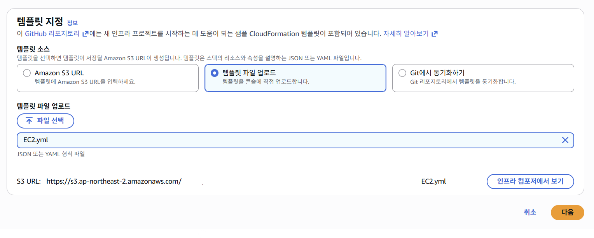
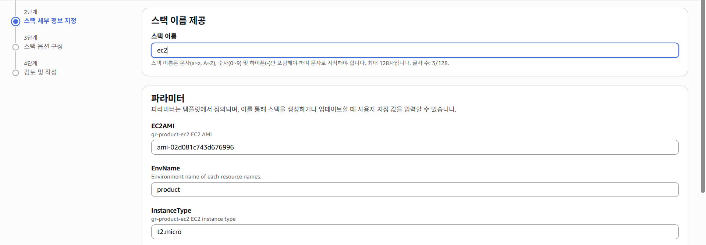
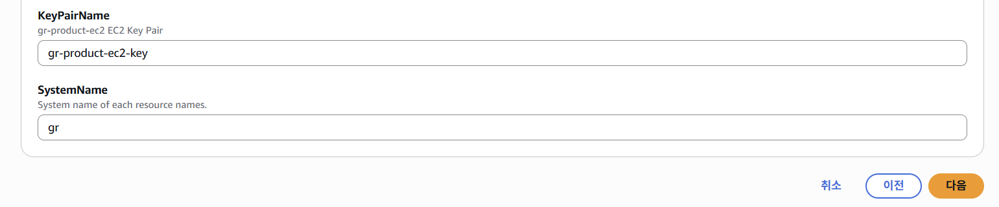
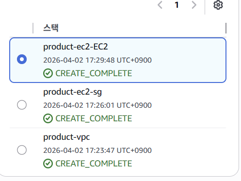


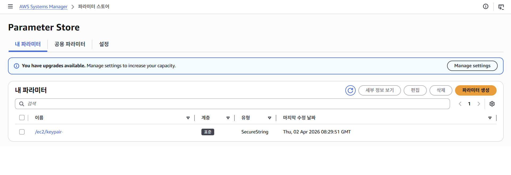
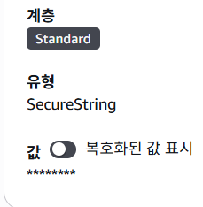

- 복호화된 암호는 ‘BEGIN RSA PRIVATE KEY’부터 시작하여 ‘END RSA PRIVATE KEY’까지 텍스트 형식으로 지정되어 있다.
- 키 페어를 사용하려면 별도로 파일을 생성해야 한다.
- gr-product-ec2-key.pem 파일을 생성한 다음, 다음과 같이 복호화된 암호를 넣으면 키 페어를 이용하여 EC2 인스턴스에 접속할 수 있다.
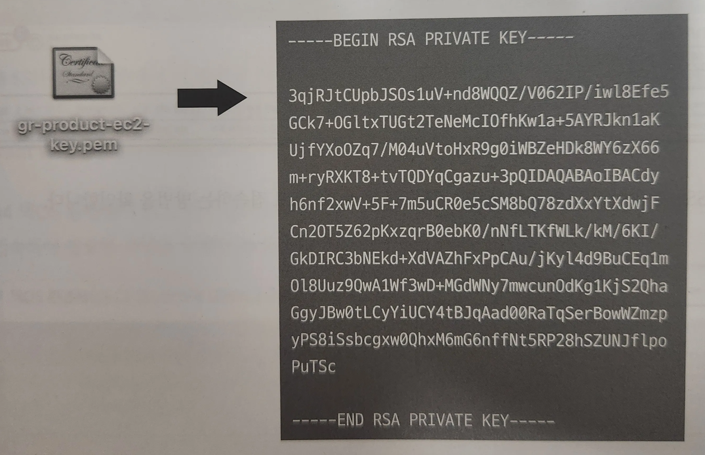

- 윈도우는 텍스트 파일을 생성하여 암호를 입력하고, 확장자를 pem으로 바꿔주면 된다.

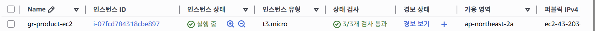
## 윈도우 환경에서 EC2 인스턴스 접속

https://tera-term.softonic.kr/


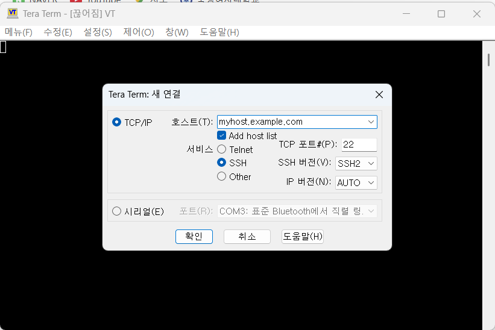
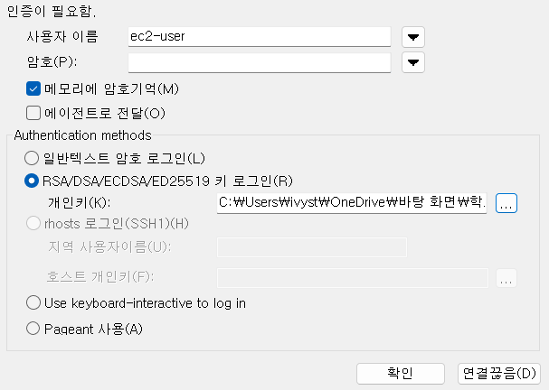
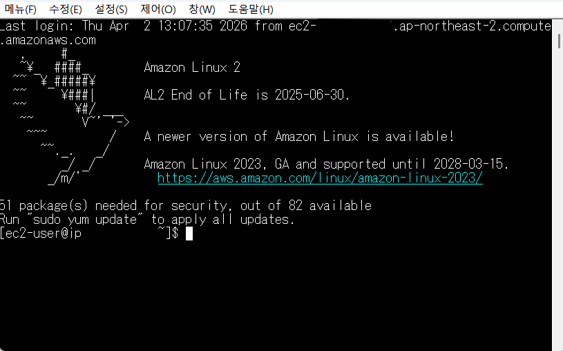

# 아마존 EC2 접속 패턴 살펴보기

- EC2 인스터스를 퍼블릭 환경에 배치하고 인터넷에 노출시키면 보안 문제가 발생할 수 있다.
- EC2 인스턴스를 프라이빗 서브넷에 배치하여 폐쇄망을 통해 접속하는 등 다양한 배치 방법에 따라 접속 방법이 달라지게 된다.

## 인터넷을 통한 EC2 인스턴스 접속

- 윈도우에서 시도했던 접속 방법은 아래와 같다.

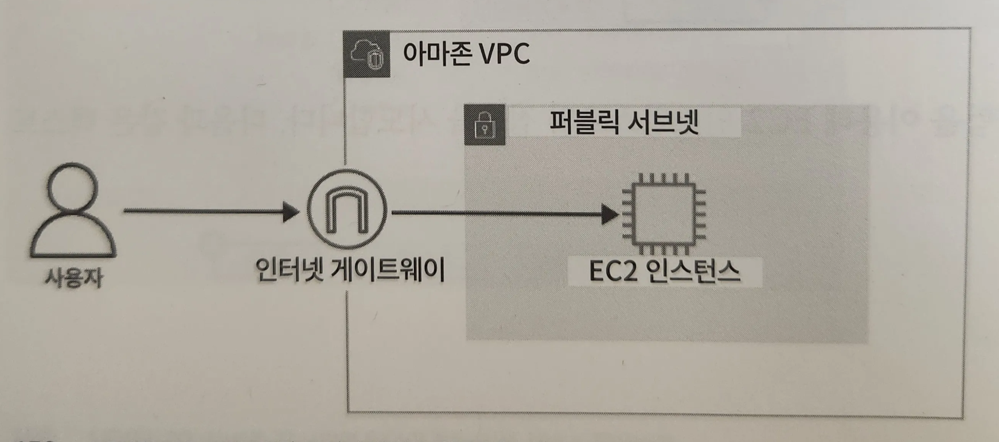
- 터미널 혹은 테라텀을 이요해서 인터넷을 통해 EC2 인스턴스로 접근
- EC2 인스턴스 연결을 이요하여 접속할 수도 있다.
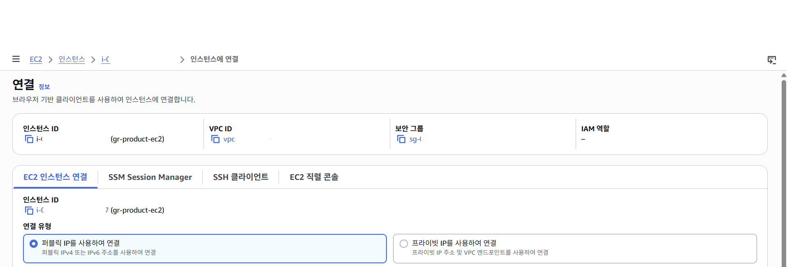

- 이를 통해 AWS 관리 콘솔에서 키 페어 없이 EC2 인스턴스에 접속할 수 있다.
- 별도로 키 페어를 사용할 필요가 없어 편리해보이지만, EC2 인스턴스에 퍼블릭 IP 즈소가 할당되어 있어야 하며, 반드시 EC2 인스턴스가 퍼블릭 서브넷에 배치되어 있어야 한다.
- 인터넷을 통한 접속 방법은 가장 간단하지만 EC2 인스턴스를 인터넷에 노출시키고 있기 때문에 권장하지는 않는다.

## EC2 인스턴스 연결 엔드포인트 이용

> EIC(EC2 Instance Connect Endpoint) : 인터넷 게이트웨이, NAT 게이트웨이 없이 EC2 인스턴스로 접속할 수 있는 서비스
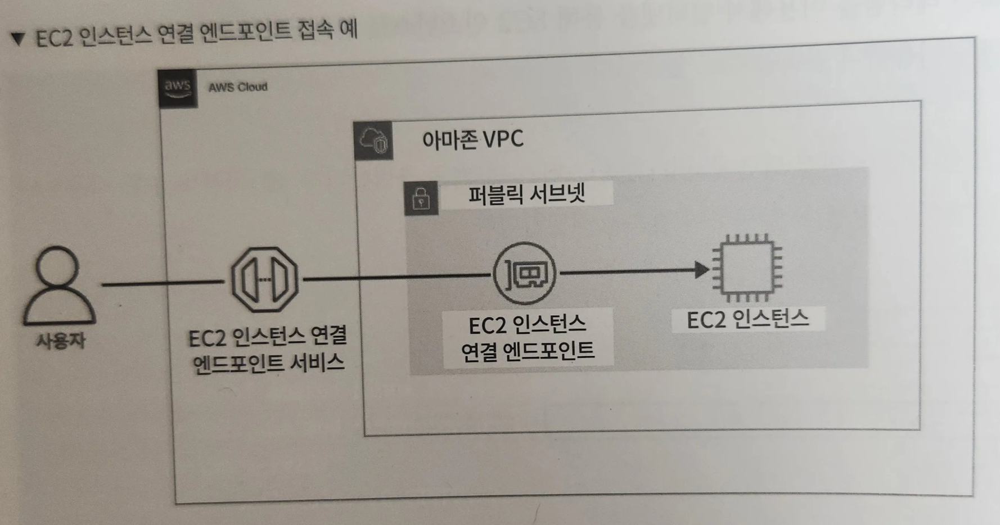


https://github.com/classmethodjaewook/aws-developer/tree/main/chapter4/EC2/chapter4.4.2-Create-EIC

> VPC.yml → Security_Group.yml → EC2.yml 순서로 클라우드포메이션 스택을 생성해야 한다.
>
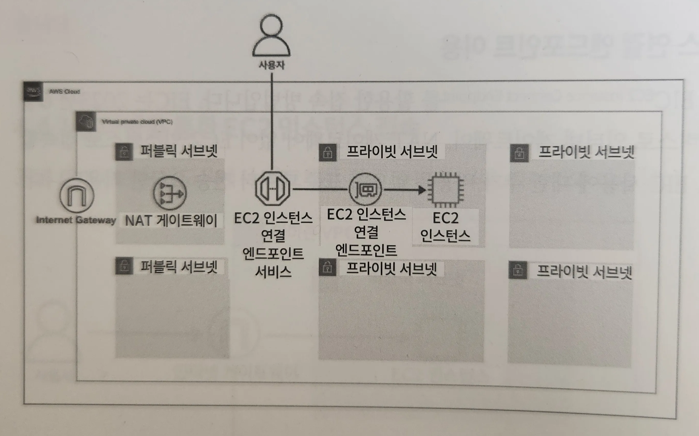

- 사용자는 EC2 인스턴스 연결 엔드포인트를 통해 EC2 인스턴스로 접근
- EIC를 이용한다면 인터넷 게이트웨이와 NAT 게이트웨이 생성은 불필요하지만 외부와의 통신이 완전히 차단된 상황이기 때문에 yum 패키지 사용 등이 필요하다면 NAT 게이트웨이를 생성해야 한다.

```yaml
# EC2.yml

      SecurityGroupIds: # 퍼블릭 IP 할당이 불필요하므로 NetworkInterfaces와 Associate PublicIpAddress를 삭제하여 서브넷과 보안 그룹을 개별적으로 설정
        - Fn::ImportValue: !Sub ${EnvName}-ec2-sg
      SubnetId: # EC2 인스턴스를 프라이빗 서브넷으로 배치
        Fn::ImportValue: !Sub ${EnvName}-web-subnet-1a
```

```yaml
# VPC.yml

  EicSg:
    Type: AWS::EC2::SecurityGroup # EC2 인스턴스 연결 엔드포인트의 보안 그룹 생성
    Properties: # 아웃바운드로 제어하기 때문에 인바운드 규칙은 지정할 필요X
      GroupName: !Sub ${SystemName}-${EnvName}-sg-eic
      GroupDescription: !Sub ${SystemName}-${EnvName}-sg-eic
      VpcId: !Ref VPC
      SecurityGroupEgress:
        - IpProtocol: -1
          CidrIp: 0.0.0.0/0
```

```yaml
# VPC.yml

  Eic:
    Type: AWS::EC2::InstanceConnectEndpoint # EC2 인스턴스 연결 엔드포인트 생성
    Properties: # 속성 입력
      SecurityGroupIds: # 보안 그룹 지정
        - !Ref EicSg
      SubnetId: !Ref WebSubnet1a # 서브넷 지정
```

```yaml
# Security_Group.yml

      SecurityGroupIngress: # 허용할 IP 주소 설정 (EC2 인스턴스 연결 엔드포인트의 보안 그룹을 허용하여, EC2 인스턴스 연결 엔드포인트 접속만을 허용)
        - IpProtocol: tcp
          FromPort: 22
          ToPort: 22
          SourceSecurityGroupId:
            Fn::ImportValue: !Sub ${EnvName}-sg-eic
```
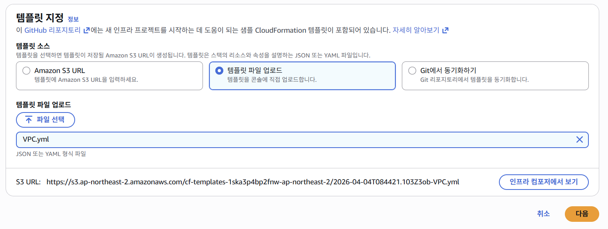
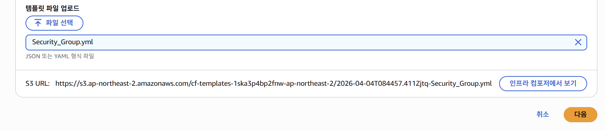
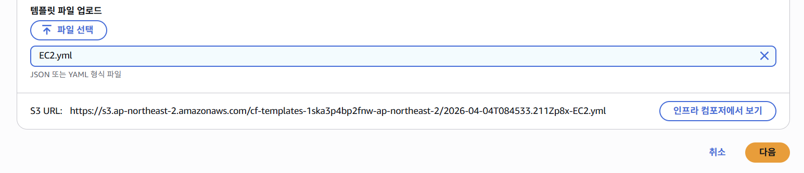
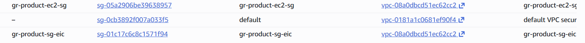


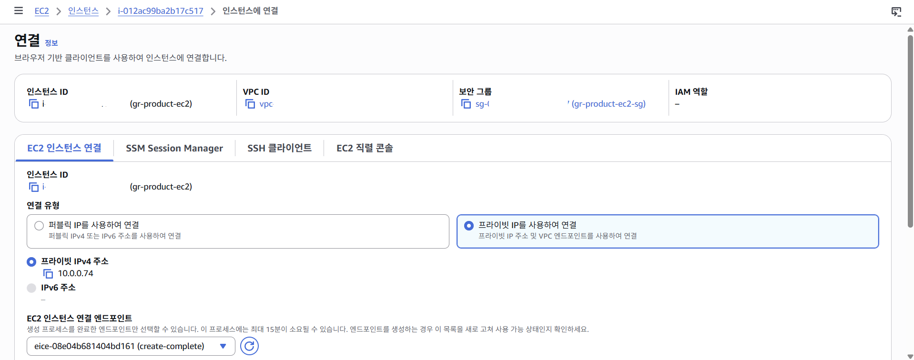
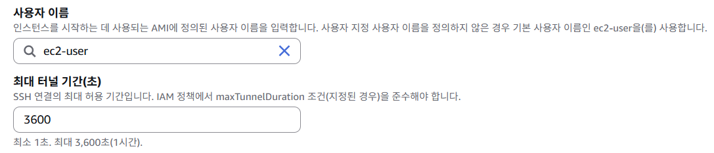
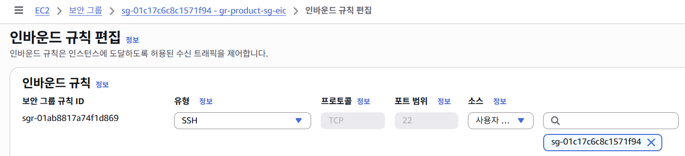
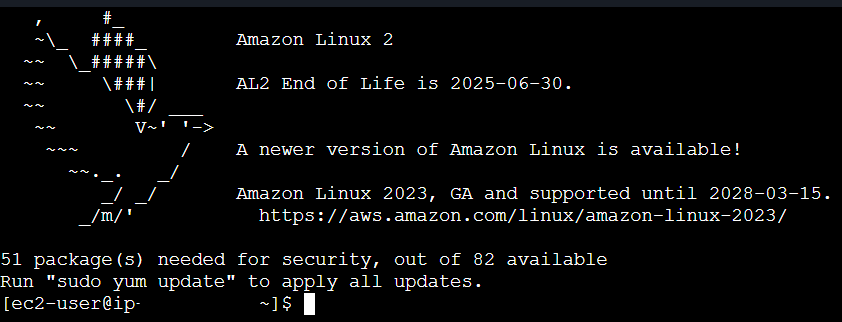


## 세션 관리자 이용한 콘솔에서의 접속

- 이번에는 퍼블릭 서브넷에 NAT 게이트웨이를 생성하고, EC2 인스턴스에서는 세션 관리자(Session Manager)를 사용할 수 있는 권한을 부여한다.

> 세션 관리자 : AWS 내 리소스 구성 및 변경 관리, 파라미터 중앙 집중식 관리와 같은 다양한 관리 시스템 기능이 집한된 서비스 내에서 운영되는 서비스


> EC2 인스턴스로의 접속을 도와준다.
>
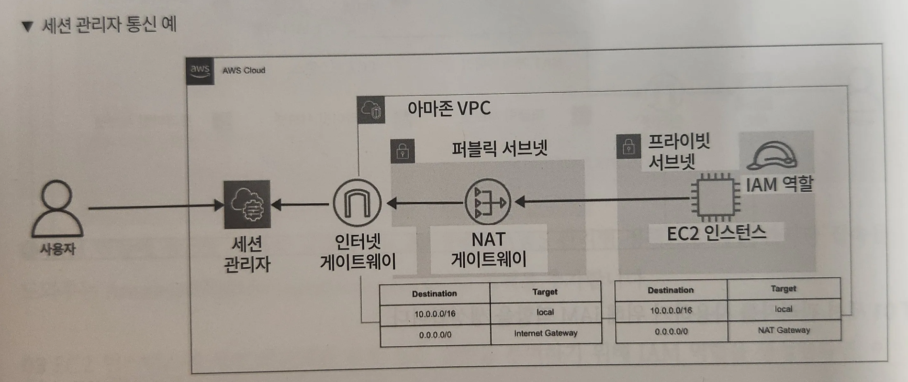

- 세션 관리자를 사용하려면 EC2 인스턴스에 권한을 부여해야 한다.
- 외부에서 인터넷을 통해 EC2 인스턴스에 직접 접속하는 것이 아닌, AWS 시스템 관리자의 세션 관리자를 통해 EC2 인스턴스에 안전하게 접속하는 것
- 세션 관리자를 사용한다면 EC2 인스턴스 내부에서 AWS 시스템 관리자와 통신할 수 있어야 한다.
- 인터넷 게이트웨이를 통해 EC2 인스턴스가 인터넷에 직접 연결되어 있거나, NAT 게이트웨이를 통해 인터넷에 연결할 수 있어야 한다.
- 퍼블릭 서브넷의 라우팅 테이블에는 인터넷 게이트웨이의 라우팅을 설정하고 있으며, 프라이빗 서브넷에서는 NAT 게이트웨이의 라우팅을 설정하고 있다.

https://github.com/classmethodjaewook/aws-developer/tree/main/chapter4/EC2/chapter4.4.3-Create-EC2-SessionManager

> VPC.yml → IAM.yml → Security_Group.yml → EC2.yml 순서로 클라우드포메이션 스택을 생성해야 한다.
>
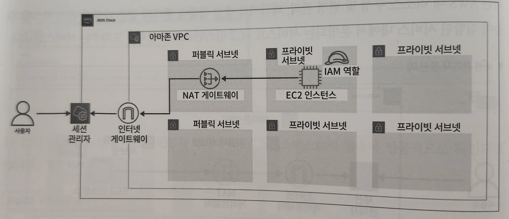

```yaml
# IAM.yml

    Type: AWS::IAM::Role # IAM 역할 생성
    DeletionPolicy: Delete # 생성한 스택을 삭제할 떄 리소스가 함께 삭제 -> Delete / 유지되기를 원하면 -> Retaion
    Properties:
      RoleName: !Sub ${SystemName}-${EnvName}-ec2-role
```

```yaml
# IAM.yml

      AssumeRolePolicyDocument: # IAM 역할에 추가할 정책 설정
        Version: "2012-10-17"
        Statement:
          - Effect: "Allow"
            Principal:
              Service:
                - "ec2.amazonaws.com"
            Action:
              - "sts:AssumeRole"
      Path: "/"
      ManagedPolicyArns: # AWS 관리형 정책
        - "arn:aws:iam::aws:policy/AmazonSSMManagedInstanceCore" # 세션 관리자 접속을 도와준다.
```

```yaml
# IAM.yml

  EC2InstanceProfile:
    Type: AWS::IAM::InstanceProfile # IAM 인스턴스 프로파일 생성
    Properties:
      InstanceProfileName: !Sub ${SystemName}-${EnvName}-ec2-role
      Path: "/"
      Roles:
        - Ref: EC2IAMRole
```

```yaml
# EC2.yml

      IamInstanceProfile: # EC2 인스턴스에 생성한 IAM 역할 추가
        Fn::ImportValue: !Sub ${EnvName}-ec2-role
```
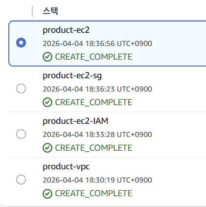
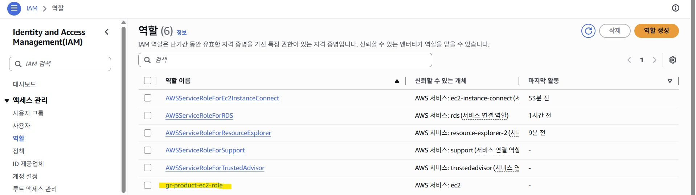
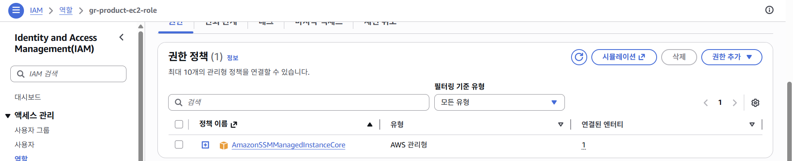
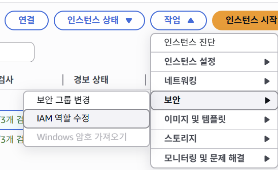
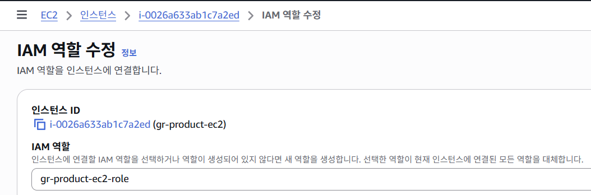
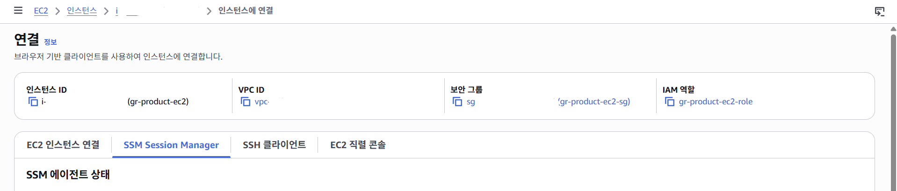
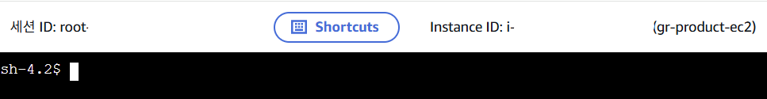

- 세션 관리자를 통해 EC2 인스턴스 접속 성공

## 세션 관리자 이용한 포트 포워딩 접속

- 포트 포워딩을 이용한다면, AWS 관리 콘솔에 로그인할 필요 없이 로컬 PC에서 EC2 인스턴스로 접속할 수 있다.

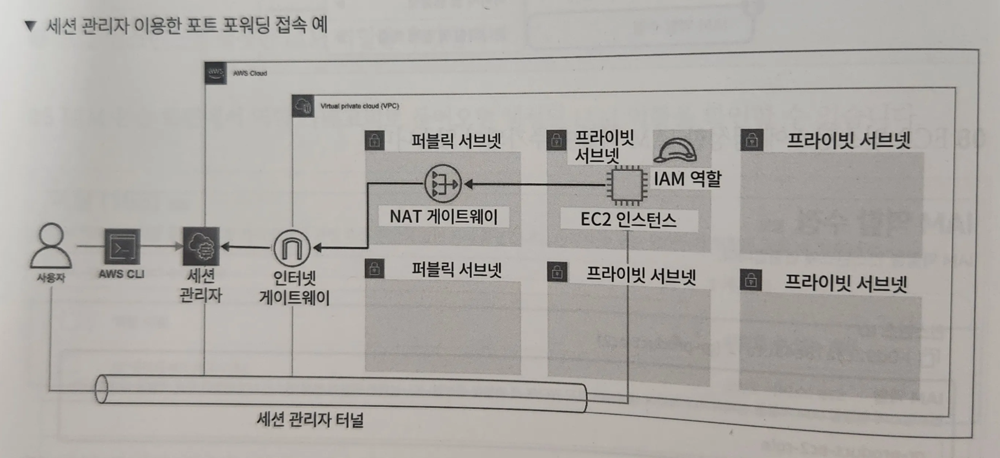
- AWS CLI를 이용하여 세션 관리자 포트 포워딩 세션을 생성하면 로컬 PC와 AWS를 이어주는 세션 관리자 터널이 생성되며 로컬 PC에서 EC2 인스턴스로 안전한 통신을 활성화할 수 있다.

```bash
aws sts get-caller-identity # 자격증명 호출
```

```bash
# 세션 생성
aws ssm start-session --target EC2인스턴스ID --document-name AWS-StartPortForwardingSession --parameters "portNumber=3389,localPortNumber=8080"
# 세션 시작
Starting session with SessionId: botocore-~~
```

[Session Manager 플러그인 설치](https://s3.amazonaws.com/session-manager-downloads/plugin/latest/windows/SessionManagerPluginSetup.exe)
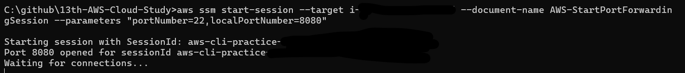
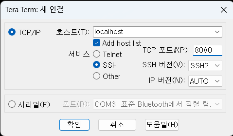
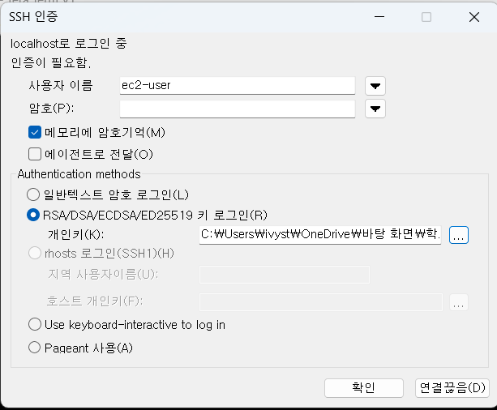
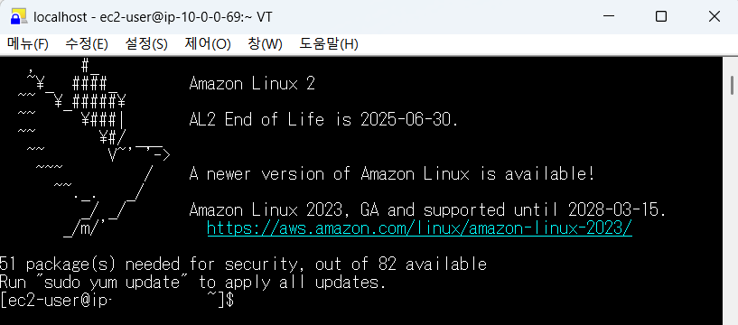

- 윈도우 환경에서 테러텀을 이용해 로컬 PC로 대상 EC2 인스턴스에 성공적으로 접속할 수 있다.