# 관계형 데이터베이스, 아마존 RDS란?

> 관계형 데이터베이스 : 테이블 형식의 복수 데이터를 관련지어 사용할 수 있는 데이터베이스


> 테이블에서 필요한 데이터를 조합하여 추출할 수 있다.
>
- 데이터베이스는 일정한 형식과 구조를 가진 데이터를 저장하고 관리하는 데 사용된다.
- 테이블 : 데이터베이스의 형식과 구조를 단위별로 나눈 것

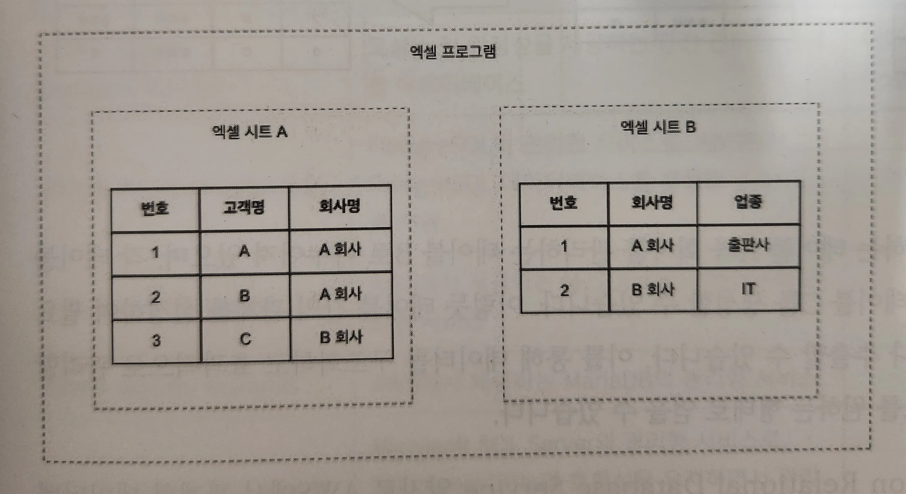
- ex. 고객 정보를 관리하는 테이블 → 고객 정보에는 회사명, 고객명이 담긴 데이터 보관
- 엑셀의 각 시트는 테이블과 유사한 형식으로 데이터를 저장하고 관리하며, 행과 열로 구성된 데이터를 포함
- 관계형 데이터베이스(Relational Database) :  MariaDB, MySQL, Oracle 등
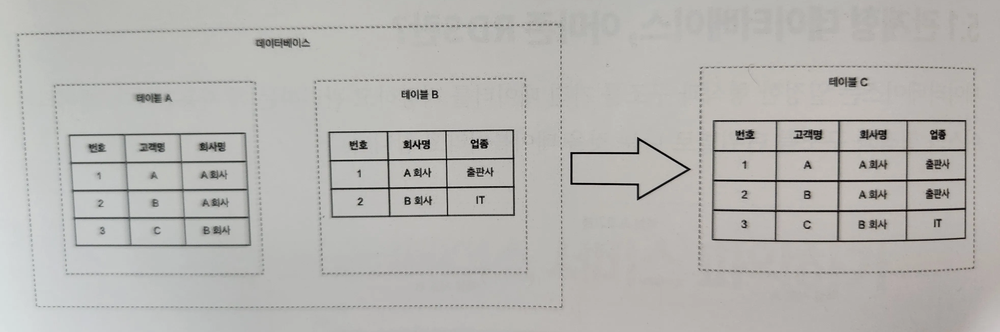

- ex. 고객을 관리하는 테이블 A, 회사를 관리하는 테이블 B
  → 각 테이블의 데이터를 조합하여 테이블 C를 생성
- 테이블 간의 관계를 설정하여 필요한 데이터를 결합하거나 추출할 수 있다.

> 아마존 RDS : AWS에서 관계형 데이터베이스를 제공하는 서비스


> Amazon Relation Database Service
>
- 데이터베이스의 백업, 소프트웨어의 패치, 장애 감지 및 복구를 자동으로 관리해주며, 사용자는 애플리케이션에만 집중할 수 있도록 도와준다.

# 관계형 데이터베이스, 아마존 RDS 살펴보기

## 아마존 RDS 엔진 유형

| 엔진 유형 | 특징 | 비고 |
| --- | --- | --- |
| 아마존 오로라 (Amazon Aurora) | 고성능 및 안정성을 제공하는 완전 관리형 관계형 데이터베이스 | 아마존 오로라에서는 MySQL, PostgreSQL만 지원 |
| 아마존 RDS for PostgreSQL | PostgreSQL의 관리형 서비스로, AWS에서 PostgreSQL 데이터베이스를 운영할 수 있도록 지원 |  |
| 아마존 RDS for MySQL | AWS에서 제공하는 MySQL 데이터베이스의 관리형 서비스 |  |
| 아마존 RDS for MariaDB | AWS에서 제공하는 MariaDB의 관리형 서비스 |  |
| 아마존 RDS for SQL Server | Microsoft SQL Server의 관리형 서비스로, SQL Server 기능과 호환성을 유지하면서 관리를 지원 |  |
| 아마존 RDS for 오라클 | 오라클 데이터베이스의 관리형 서비스로, 오라클의 기능과 안정성을 유지하면서 관리를 지원 |  |
| 아마존 RDS for Db2 | IBM Db2의 관리형 서비스로, Db2 데이터베이스의 기능과 호환성을 유지하면서 관리를 지원 |  |

- 아마존 오로라 : 아마존 RDS에서 선택할 수 있는 엔진 유형의 옵션 중 하나
    - 아마존 RDS for MySQL, 아마존 RDS for PostgreSQL보다 높은 성능
    - 각 엔진 유형보다 3배 혹은 5배 높은 초당 SELECT 수와 UPDATE 수를 제공
- 아마존 RDS와 아마존 오로라에서도 인스턴스 유형을 선택할 수 있으며, 인스턴스 유형만을 고려할 때는 오로라가 더 비용이 높게 책정된다.
- 오로라는 복제된 인스턴스를 추가해도 스토리지 비용에 영향을 주지 않기 때문에 스토리지 관점에서 보면 오로라를 더 저렴하게 이용할 수 있다.
- 스토리지 용량이 많을수록, RDS보다는 오로라를 더 저렴한 요금으로 활용할 수 있는 가능성이 있다.
- 현재 구성하고자 하는 데이터베이스를 충분히 검토 후 상황에 맞게 아마존 RDS, 아마존 오로라를 선택

## 아마존 RDS의 DB 인스턴스 클래스

- 사용할 수 있는 인스턴스 유형이 준비되어 있다.
- 사용 가능한 DB 인스턴스 클래스
    - 스탠다드 : 범용 DB 인스턴스 클래스
    - 메모리 최적화 : 메모리에서 대용량 데이터 집합을 처리하는 애플리케이션에 최적화된 DB 인스턴스 클래스
    - 버스터블 : 최대 CPU 사용량까지 버스트 가능한 DB 인스턴스 클래스

| DB 인스턴스 클래스 유형 | 인스턴스 클래스(인스턴스 유형) | 특징 |
| --- | --- | --- |
| 스탠다드 | db.m3, db.m4, db.m5와 같은 m 유형을 포함한 인스턴스 클래스 | 범용 DB 인스턴스 클래스 |
| 메모리 최적화 | db.r4, db.r5, db.r6i, db.x1, db.x2i, db.z1d와 같은 r, x, z 유형을 포함한 인스턴스 클래스 | 메모리 소비가 높은 애플리케이션에 최적화된 DB 인스턴스 클래스 |
| 버스터블 | db.t2, db.t3, db.t4g와 같은 t 유형을 포함한 인스턴스 클래스 | 최대 CPU 사용량까지 버스트 가능한 DB 인스턴스 클래스 |
- t 계열의 인스턴스 유형에서는 다른 인스턴스 유형과는 달리 미리 결정된 CPU 사용률이 정의된다.
- 버스트 기능(버스터블) : 기준선을 넘어 CPU를 사용할 수 있는 기능
- 버스트 기능을 사용하는데 CPU 크레딧이 필요하며, CPU 크레딧은 t 계열의 인스턴스를 실행시키면 시간당 6개의 크레딧이 모이며, 최대 144까지 모을 수 있다.
- 이렇게 모은 CPU 크레딧을 소모해서 CPU 성능을 높일 수 있다.


1. DB 인스턴스 유형 혹은 DB 인스턴스 클래스 유형
2. 크기

## 아마존 RDS의 스토리지 유형

1. 범용 SSD(gp2, gp3) : 비용, 성능 면에서 밸런스가 잡혀 있으며, 폭 넓게 사용 가능
2. 프로비저닝된 IOPS(io1) : 낮은 대기 시간과 높은 I/O 성능이 요구되는 데이터베이스에 적합
3. 마그네틱 : 데이터의 액세스 빈도가 낮은 상황에서 사용하지만 구 세대 유형이기 때문에 권장X
- 아마존 RDS의 스토리지 유형은 EC2 인스턴스에서 설명한 스토리지와 유사
- 범용 스토리지를 사용하고 싶다면 EC2 인스턴스와 동일하게 gp3를 사용하면 될까?
    - EC2 인스턴스에서는 비용, 성능면을 고려해 gp3 사용을 권장
- 서울 리전에서 계산된 gp2와 gp3의 요금표

| 스토리지 유형 | 요금 |
| --- | --- |
| 범용 SSD(gp2) | GB-월당 0.131 USD |
| 범용 SSD(gp3) | GB-월당 0.131 USD |
| 범용 SSD(gp3) IOPS | 기준 초과 시 IOPS-월당 0.023 USD |
| 범용 SSD(gp3) 처리량(throughput) | 기준 초과 시 MB/s-월당 0.091 USD |
- 범용 SSD에서 gp2와 gp3의 요금이 같다.
- gp3는 400GB의 스토리지 용량을 초과하면, IOPS 및 처리량(throughput)을 개별적으로 구성하여 추가 요금이 청구된다.
- 아마존 RDS에서는 gp3보다 gp2를 더 저렴하게 이용 가능

## 아마존 RDS를 구성하는 DB 그룹

- 서브넷 그룹 : 서브넷의 집합. 해당 그룹에 속한 서브넷에 아마존 RDS가 생성된다.
- 파라미터 그룹 : DB 엔진의 파라미터 집합. 시간(time_zone), 문자 집합(character set) 등을 관리
- 옵션 그룹 : 연결된 데이터베이스의 스냅샷 관리. 옵션을 추가해 다른 AWS 서비스와의 상호작용을 돕는다.
- 아마존 RDS를 생성할 때, 사용자가 별도로 생성하지 않으면 기본적으로 DB 그룹들이 생성된다.
- 되도록이면 DB 그룹은 직접 생성하는 것을 권장
- AWS 관리 콘솔에서는 PostgreSQL의 옵션 및 옵션 그룹 지원X → 디폴트 옵션 그룹 사용
    - 클라우드포메이션 사용하면 PostgreSQL의 옵션 그룹 생성 가능

## 확장성과 고가용성을 위한 옵션들

- 아마존 RDS에서는 확장성과 고가용성을 지원하는 읽기 전용 복제본(Read Replica)과 다중 AZ(Multi Availability Zone) 기능을 지원한다.
- 읽기 전용 복제본은 데이터베이스의 부하 분산을 위해 생성된 복제본
- 데이터베이스의 내용을 복제하여, 데이터의 읽기, 검색만 수행

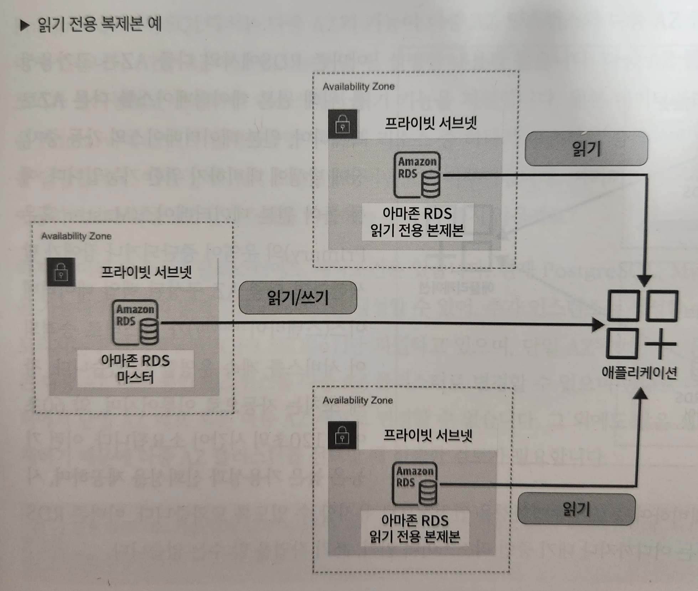
- 읽기 전용 복제본은 복제 대상이 되는 원본의 데이터베이스를 마스터(Master or Primary)라고 한다.
- 마스터를 기준으로 각 가용 영역에 읽기 전용 복제본을 생성할 수 있다.
- 읽기 전용 복제본을 통해 읽기 작업을 분산시킨다. → 성능 향상
- 각 가용 영역에 읽기 전용 복제본을 생성함으로써 고가용성도 실현

### 아마존 RDS에서의 다중 AZ

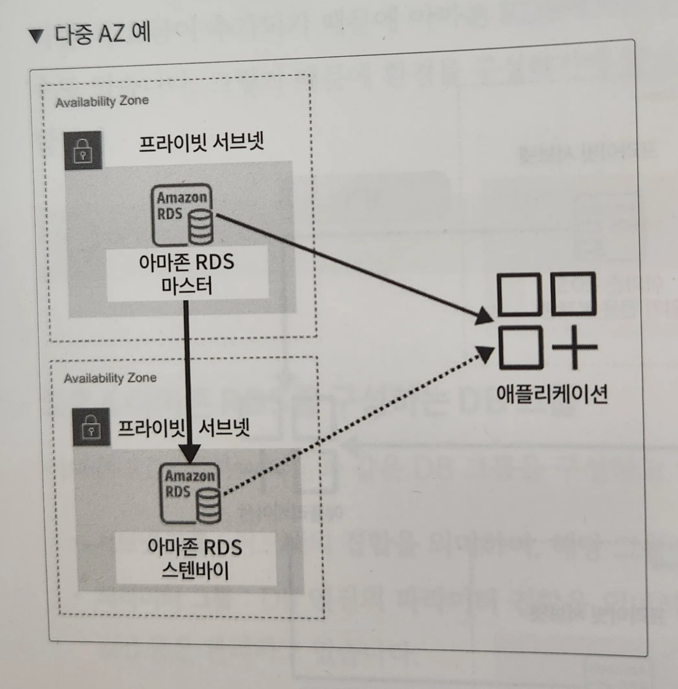
- 고가용성을 위해 원본 데이터베이스를 다른 AZ로 복제하여, 원본 데이터베이스의 가동 중지, 장애 발생에 대비한다.
- ex. 원본 데이터베이스의 운영이 중단된다면 다중 AZ 구성된 백업 데이터베이스(스텐바이)가 마스터로 승격하여 서비스를 계속 운영할 수 있다.
    - 장애 조치는 자동으로 이루어지며 약 60~120초 소요
- 아마존 RDS에서 스텐바이는 어디까지나 대기 중인 리소스이며 읽기, 쓰기 작업을 할 수는 없다.
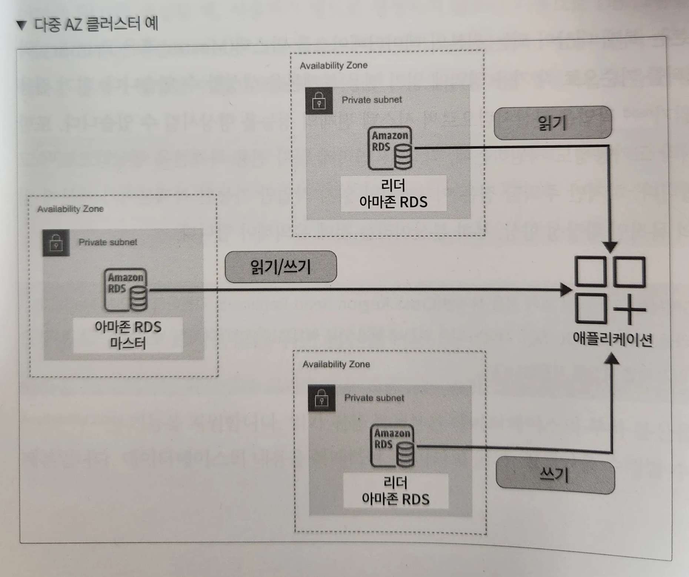

- PostgreSQL, MySQL에서는 다중 AZ의 기능이 다중 AZ 인스턴스와 다중 AZ 클러스터로 나누어져 있다.
- 다중 AZ 클러스터 : 읽기, 쓰기가 불가능했던 스텐바이 리소스에서 읽기 기능을 지원
- 원본 데이터베이스에 장애가 발생했다면 두 대의 리소스 중 하나가 마스터로 승격되어 읽기, 쓰기 작업을 담당
- 그러나 다중 AZ 클러스터는 PostgreSQL, MySQL에서만 이용 가능하며, 2대의 읽기 DB 인스턴스만 생성할 수 있어, 추가 인스턴스 생성 불가능
- 스토리지는 IOPS SSD(io1)만 지원, 단일 AZ 혹은 다중 AZ 배포 중인 인스턴스를 다중 AZ 클러스터로 변경할 수 없다.

# 아마존 RDS 구축하기

## 클라우드포메이션으로 아마존 RDS 구축하기

https://github.com/classmethodjaewook/aws-developer/tree/main/chapter5
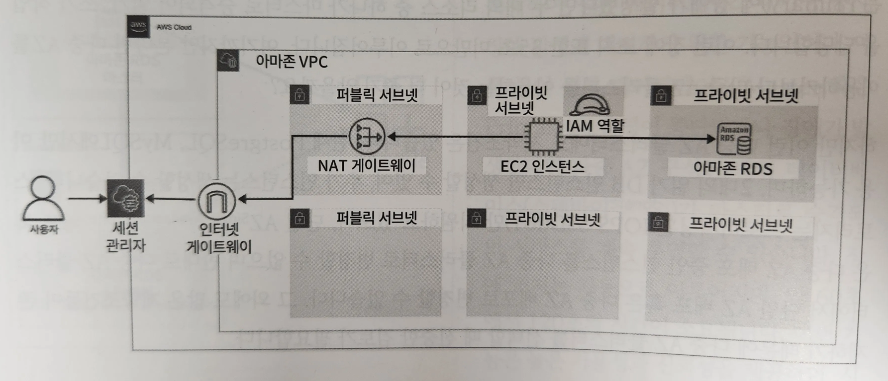

- 이번에 생성할 아마존 RDS는 EC2 인스턴스와 마찬가지로 프라이빗 서브넷에 배치된다.
- EC2 인스턴스는 NAT 게이트웨이를 통해 외부와의 소통이 가능하지만 RDS가 배치된 프라이빗 서브넷에는 외부와의 소통이 차단된 상태
- RDS와 같이 중요한 데이터를 포함하는 데이터베이스 혹은 서버는 외부와 차단된 서브넷에 배치

```yaml
**# Security_Group.yml**  
  
  # ------------------------------------------------------------#
  #  Create RDS Security Group
  # ------------------------------------------------------------#
  RDSSecurityGroup:
    Type: AWS::EC2::SecurityGroup
    Properties:
      GroupName: !Sub ${SystemName}-${EnvName}-rds-sg # 보안 그룹 이름
      GroupDescription: !Sub ${SystemName}-${EnvName}-rds-sg # 보안 그룹 설명
      SecurityGroupIngress: # RDS에서는 오라클을 이용하므로 오라클의 포트인 1521 포트 개방
        - IpProtocol: tcp
          FromPort: 1521
          ToPort: 1521
          SourceSecurityGroupId: !GetAtt EC2SecurityGroup.GroupId # EC2 인스턴스에서의 접속 허용
      VpcId:
        Fn::ImportValue: !Sub ${EnvName}-vpc
```

```yaml
**# RDS.yml**
  
  # ------------------------------------------------------------#
  #  Create SubnetGroup
  # ------------------------------------------------------------#
  RDSSubnetGroup:
    Type: AWS::RDS::DBSubnetGroup # 서브넷 그룹을 생성하기 위한 타입 이름
    Properties: # 서브넷 그룹의 이름과 설명, 아마존 RDS를 배치할 서브넷 설정
      DBSubnetGroupName: !Sub ${SystemName}-${EnvName}-dbsub
      DBSubnetGroupDescription: !Sub ${SystemName}-${EnvName}-dbsub Subnet Group
      SubnetIds: # 프라이빗 서브넷 지정
        - Fn::ImportValue: !Sub ${EnvName}-datastore-subnet-1a
        - Fn::ImportValue: !Sub ${EnvName}-datastore-subnet-1b
```

```yaml
**# RDS.yml**

  # ------------------------------------------------------------#
  #  Create ParameterGroup
  # ------------------------------------------------------------#
  RDSParameterGroup:
    Type: AWS::RDS::DBParameterGroup # 파라미터 그룹을 생성하는 타입 이름
    Properties: # 파라미터 그룹 이름과 설명, 패밀리 지정
      DBParameterGroupName: !Sub ${SystemName}-${EnvName}-dbpg8
      Description: !Sub ${SystemName}-${EnvName}-dbpg8 Parameter
      Family: 'mysql8.0' # 생성할 RDS 엔진 유형과 같은 패밀리 선택
```

```yaml
**# RDS.yml**

  # ------------------------------------------------------------#
  #  Create  OptionGroup
  # ------------------------------------------------------------#
  RDSOptionGroup:
    Type: AWS::RDS::OptionGroup # 옵션 그룹을 생성하기 위한 타입 이름
    Properties: # 옵션 그룹의 이름과 설명, 아마존 RDS에서 사용하는 엔진 유형과 엔진 버전 선택
      OptionGroupName: !Sub ${SystemName}-${EnvName}-dbog8
      OptionGroupDescription: !Sub ${SystemName}-${EnvName}-dbog8 Option Group
      EngineName: "mysql"
      MajorEngineVersion: "8.0"
```

```yaml
**# RDS.yml**

  RDSMasterUserName: # 아마존 RDS의 관리자 이름
    Description: Staging RDS DB Master User Name.
    Default: "grsys"
    Type: String
  RDSMasterPassword: # 비밀번호 설정
    Description: Staging RDS DB Master Password.
    Type: String
    NoEcho: true
  RDSMaintenanceWindow: # MaintenanceWindow : AWS에서 진행하는 패치 혹은 유저가 직접 설정한 값을 적용하기 위한 시간
    Description: Staging Enter MaintenanceWindow(UTC)
    Type: String
    Default: "sat:18:00-sat:19:00" # KST：[日] 03:00 - 04:00
```

```yaml
**# RDS.yml**

    Type: AWS::RDS::DBInstance # 아마존 RDS 생성을 위한 타입 입력
    Properties: # 아마존 RDS의 이름과 생성될 초기 데이터베이스 이름(grdb), 캐릭터 셋, DB 인스턴스 유형 지정
      DBInstanceIdentifier: !Sub ${SystemName}-${EnvName}-rds
      DBName: "grdb" # 초기 데이터베이스 이름
      DBInstanceClass: db.t4g.micro
```

```yaml
**# RDS.yml**

      Engine: mysql # 엔진과 엔진 버전 설정
      EngineVersion: '8.0'
      Port: 3306 # MySQL 디폴트 포트인 3306 이용
      MultiAZ: false #　multiAZ 설정 없음
      AutoMinorVersionUpgrade: false
      PubliclyAccessible: false # 외부와의 접근 차단
      AvailabilityZone: # 서브넷의 가용 영역 지정
        Fn::Select:
          - 0 # ap-northeast-2a 이용
          - Fn::GetAZs: ""
      StorageType: "gp2" # 스토리지 유형과 크기, 암호화 설정
      AllocatedStorage: "20"
      StorageEncrypted: true
      BackupRetentionPeriod: 0 # 자동 백업 무효화
      MasterUsername: !Ref RDSMasterUserName # 파라미터에서 지정한 관리자 이름과 비밀번호, MaintenanceWindow 시간 지정
      MasterUserPassword: !Ref RDSMasterPassword
      PreferredMaintenanceWindow: !Ref RDSMaintenanceWindow # 유지 보수
      VPCSecurityGroups: # 보안 그룹과 서브넷 그룹, 파라미터 그룹, 옵션 그룹 지정
        - Fn::ImportValue: !Sub ${EnvName}-rds-sg
      DBSubnetGroupName: !Ref RDSSubnetGroup
      DBParameterGroupName: !Ref RDSParameterGroup
      OptionGroupName: !Ref RDSOptionGroup
```

## UI로 불러와 RDS 리소스 생성하기

> VPC.yml → Security_Group.yml → IAM.yml → EC2.yml → RDS.yml 순서로 클라우드포메이션 스택을 생성해야 한다.
>
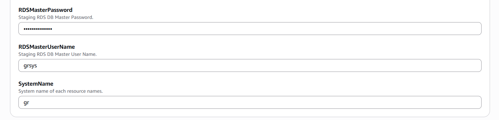
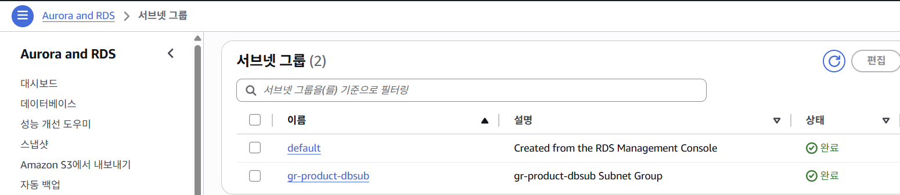
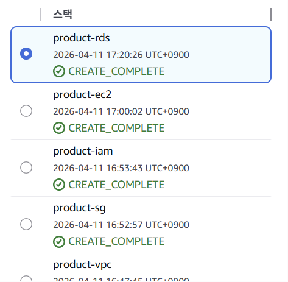
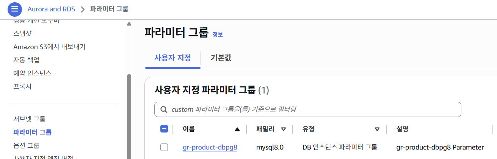
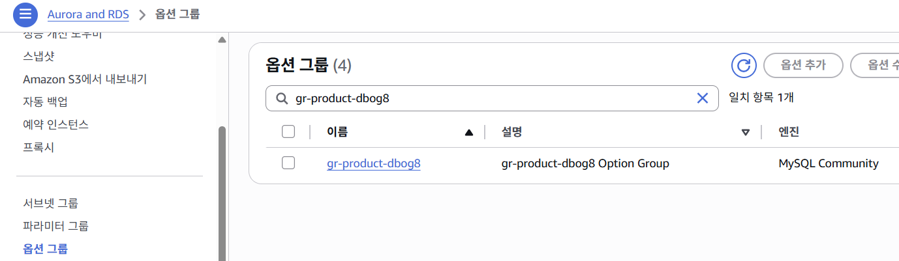
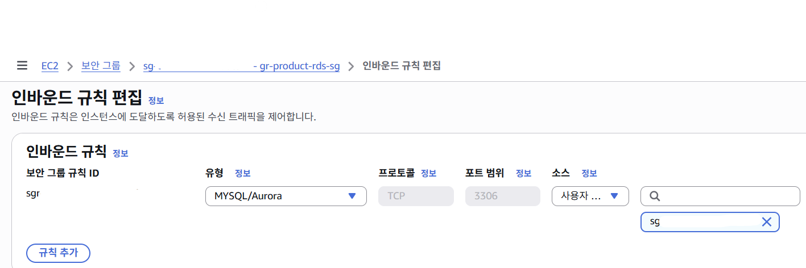
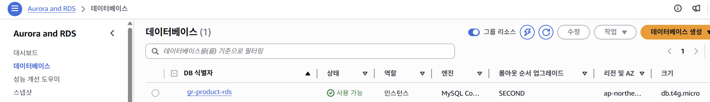

# 아마존 RDS 접속 패턴 살펴보기

## EC2 인스턴스를 이용한 RDS 접속
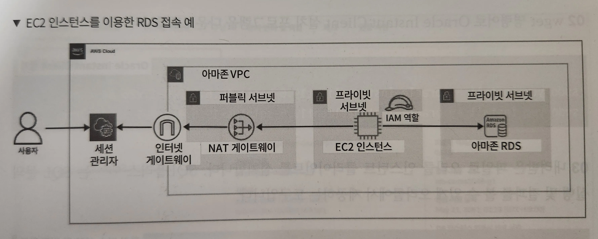

- RDS가 생성된 프라이빗 서브넷에는 NAT 게이트웨이, 인터넷 게이트웨이와 연결되어 있는 환경이 아니기 때문에 외부와의 접근이 완전히 차단된 상태
- 이런 환경에서 프라이빗 서브넷에 있는 EC2 인스턴스에서 RDS로 접근하는 것이 가장 이상적
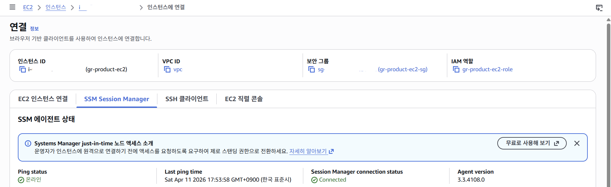

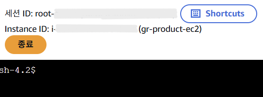

```bash
# 0. SSM Session Manager를 통해 연결 접속

# 1. 패키지 업데이트
sudo yum update -y
```
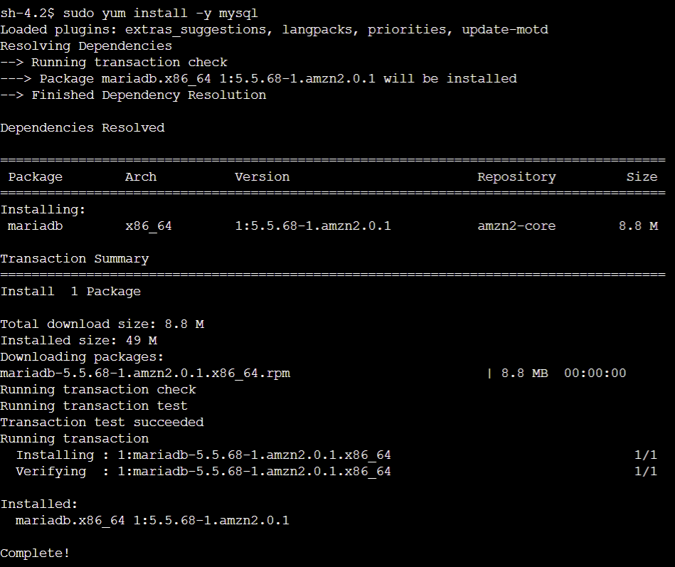

```bash
# 2. MySQL 클라이언트 설치
sudo yum install -y mysql
```
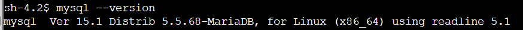

```bash
# 3. 설치 확인
mysql --version
```
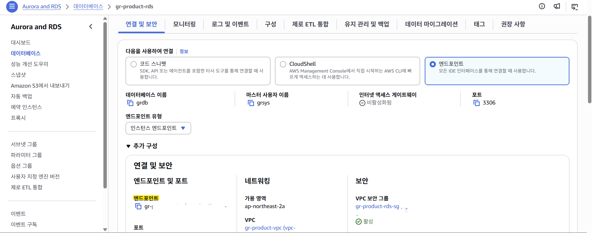

```
# 4. RDS 엔드포인트 준비

콘솔에서 RDS -> 데이터베이스 -> 엔드포인트 복사

ex. gr-product-rds.xxxxxx.ap-northeast-2.rds.amazonaws.com
```
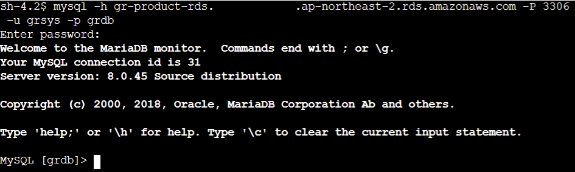

```bash
# 5. RDS 접속
mysql -h 엔드포인트 -P 3306 -u grsys -p grdb

ex. mysql -h gr-product-rds.xxxxx.ap-northeast-2.rds.amazonaws.com -P 3306 -u grsys -p grdb
```

```
# 6. 비밀번호 입력

CloudFormation에서 넣었던 RDSMasterPassword 입력

=> 성공하면 mysql> 이렇게 나온다.
```

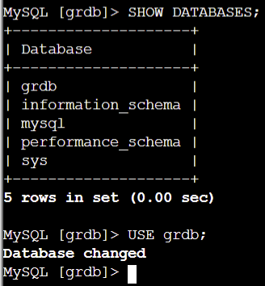
```sql
# 접속 확인

SHOW DATABASES;
USE grdb;
```

## 포트 포워딩을 이용한 RDS 접속

> EC2 인스턴스를 대상으로 포트 포워딩 세션을 생성하여 RDS로 접근
>

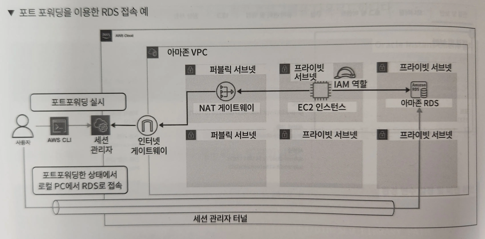
- 사용자는 AWS CLI를 이용하여 EC2 인스턴스를 대상으로 세션 관리자 포트 포워딩 세션을 생성
- 포트 포워딩 세션을 생성하면 세션 관리자 터널을 통해 로컬 PC에서 접속 클라이언트를 이용해 RDS로 접속 가능

```bash
# 자격증명 호출
aws sts get-caller-identity
```

```bash
# 포트 포워딩 실시 (MySQL)
aws ssm start-session ^
  --target EC2인스턴스ID ^
  --document-name AWS-StartPortForwardingSessionToRemoteHost ^
  --parameters "{\"host\":[\"RDS엔드포인트\"],\"portNumber\":[\"3306\"],\"localPortNumber\":[\"13306\"]}"
```

https://dev.mysql.com/downloads/installer/

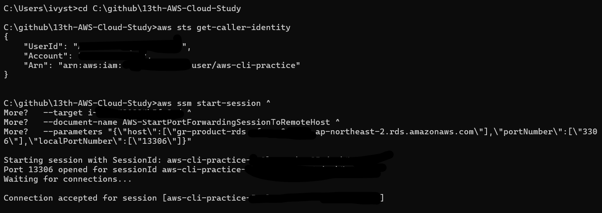
```
Waiting for connections... 가 뜨면 다른 CMD 창을 열어 아래 명령어 입력
```

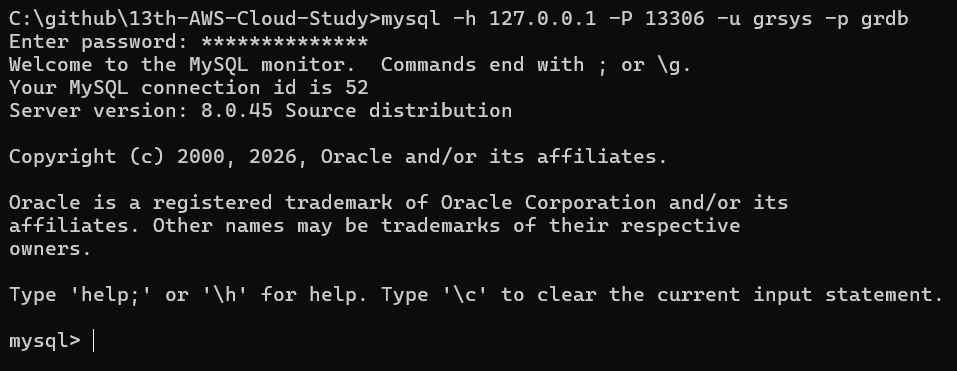
```bash
mysql -h 127.0.0.1 -P 13306 -u grsys -p grdb
```

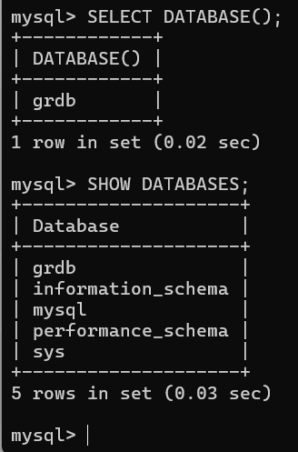
```sql
SELECT DATABASE();
SHOW DATABASES;
```

```
내 PC
  ↓  mysql -h 127.0.0.1 -P 13306
SSM 포트포워딩
  ↓
EC2 인스턴스
  ↓
RDS MySQL (grdb)
```

## 인터넷 게이트웨이를 통해 RDS로 접속

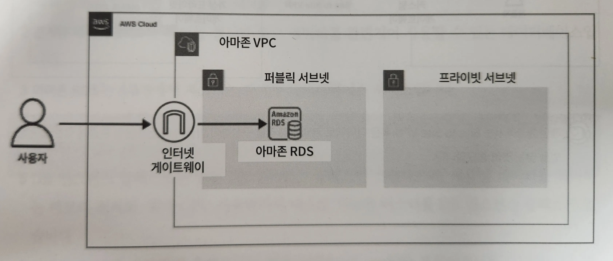
- 아마존 RDS를 퍼블릭 서브넷에 배치하여 퍼블릭 액세스를 허용할지 거부할지에 대한 옵션을 선택할 수 있다.
- 퍼블릭 액세스를 허용하면 데이터베이스에 퍼블릭 IP가 할당된다.
- 클라우드포메이션에서는 PubliclyAccessible를 추가하여 퍼블릭 액세스를 설정할 수 있다.
- 데이터베이스에 대한 액세스는 데이터베이스와 연결된 보안 그룹에 의해 제어된다.
  → 접속을 허용할 IP 주소를 설정하면 해당 IP 주소로만 접속할 수 있음.
- 간편하게 RDS로 접근할 수 있다는 장점이 있지만, 반대로 데이터베이스가 인터넷에 노출되기 때문에 보안상 문제가 발생할 수 있다.

## Site to Site VPN을 통해 RDS로 접속

- EC2 인스턴스를 경유하지 않고, Site to Site VPN 혹은 다이렉트 커넥트를 설정하여 프라이빗 네트워크를 통해 RDS에 접속할 수 있다.
- AWS 환경과 사용자 환경이 Site to Site VPN, 다이렉트 커넥트와 연결되어 있다면 로컬 PC에서 접속 클라이언트를 이용해 RDS로 접속할 수 있다.
- Site to Site VPN 혹은 다이렉트 커넥트를 도입하는 환경이라면 EC2 인스턴스 경유, 포트 포워딩을 통한 접속보다 간편하고 안전한 접속 방법을 제공한다.

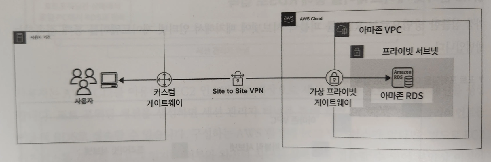
