# 객체 스토리지 서비스, 아마존 S3란?

> 객체 스토리지 : 객체(Object)라고 하는 일정한 형태나 형식, 틀이 정해지지 않은 비정형 형식의 데이터를 저장하고 관리하는 스토리지


- 비정형 데이터를 저장하기 때문에 어떠한 파일 형식이든 상관없이 저장할 수 있다.
  ex. 텍스트 파일, 이미지, 비디오, 음악 파일 등
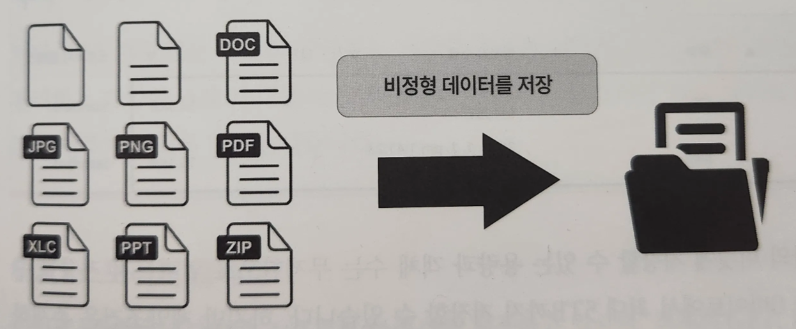

> 아마존 S3 : 비정형 데이터 즉 객체를 저장 및 관리하는 서비스


- 아마존 S3를 사용하면 객체를 안정적으로 저장하며 쉽게 검색하고 다양한 방법으로 관리할 수 있는 옵션들을 제공한다.

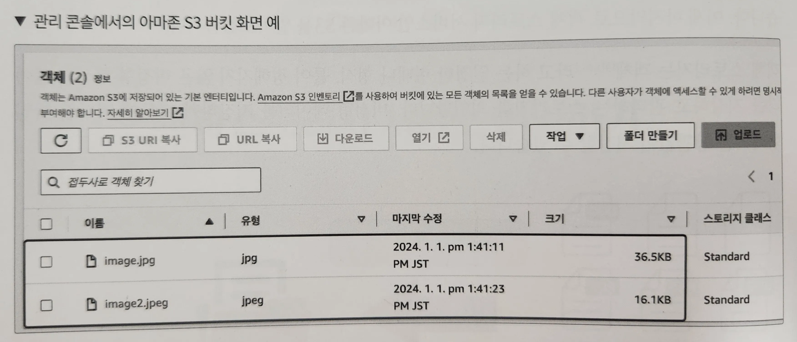
- 아마존 S3는 버킷(Bucket)이라는 스토리지에 객체를 저장한다.
- 버킷은 전 리전에 걸쳐 고유한 이름을 가지며, 다른 리전에서 같은 이름의 버킷을 사용할 수 없다.
- 객체 또한 버킷 내부에서 고유한 키를 가지며, 버킷 내부에서 같은 이름의 키 객체를 저장하면 덮어쓰기가 일어난다.
    - 객체의 고유한 키는 객체의 이름을 의미 (객체 이름, 객체 키, 키 이름)

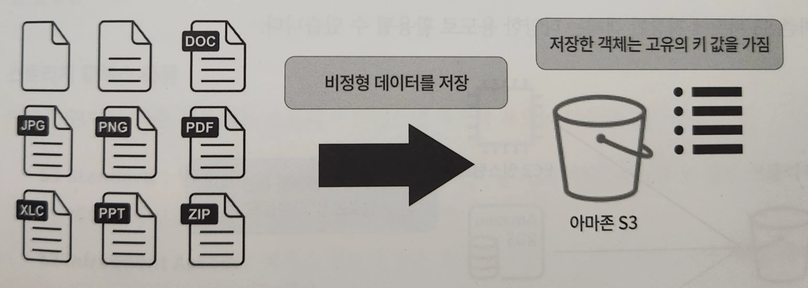
- 아마존 S3에는 하나의 버킷에 저장할 수 있는 용량과객체 수는 무제한으로 얼마든지 저장할 수 있으며, 객체는 최소 0바이트에서 최대 5TB까지 저장할 수 있다.
- 버킷은 계정당 최대 100개까지 생성할 수 있으며, 관리 콘솔 환경에서 버킷으로 객체를 저장한다면 160GB의 객체 크기만 저장할 수 있다. (160GB 이상의 객체 → AWS CLI)
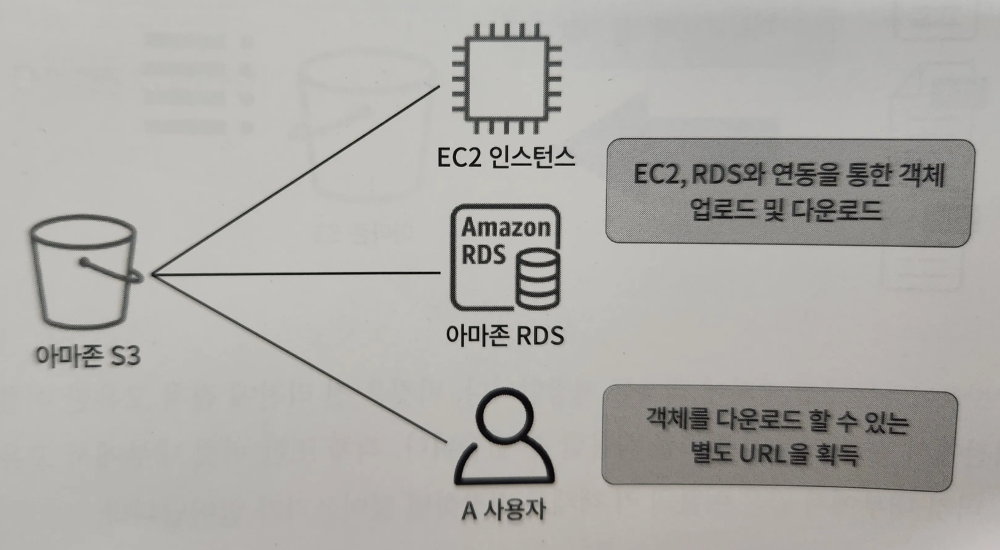

- 아마존 S3 버킷에 저장한 객체는 다양한 용도로 활용될 수 있다.
- EC2, RDS와의 연동을 통해 객체를 주고받을 수 있으며, 서버의 로그를 저장하거나, 서버의 백업을 S3 버킷에 저장해 안정적인 백업 솔루션으로 활용할 수도 있:다.
- 객체는 기본적으로 비공개이지만, 미리 서명된 URL(presigned URL)을 이용해 지정된 기간 동안 객체를 내려받을 수 있는 URL을 생성해 사용자에게 공유할 수 있다.

# 객체 스토리지 서비스, 아마존 S3 살펴보기

## 스토리지 클래스

- 아마존 S3에서는 다양한 스토리지 클래스를 제공하고 있으며, 객체의 GET, PUT, POST, LIST, COPY 등의 요청 수에 따른 요금이 발생한다.
- 객체에 대한 액세스 빈도가 높을수록 요청 수도 증가하므로 이에 따른 요금이 발생
- 액세스 빈도와 요청 수를 고려해 적절한 스토리지 클래스를 선택할 필요가 있으며, 액세스 빈도가 낮은 객체는 저렴한 스토리지 클래스로 이동해 요금을 절약할 수 있다.

### 스토리지 클래스 종류

- S3 Standard : 범용으로 사용되며, 동적 웹사이트, 콘텐츠 배포, 모바일 및 게임 애플리케이션, 빅데이터 분석 등의 다양한 사용 사례에 적합
- S3 Infrequent Access : 액세스 빈도가 낮은 객체를 위한 스토리지 클래스이며, 백업, 재해 대책 파일 등에 적합
- S3 One Zone-IA : 액세스 빈도가 낮은 객체를 위한 스토리지 클래스이며, 로그, 자주 액세스 하지 않는 데이터의 재생성 등에 적합
- S3 Glacier Instant Retrieval : S3 Infrequent Access와 비교해서 액세스 빈도가 현저히 낮으며, 의료 이미지, 미디어 자산 등에 적합
- S3 Glacier Flexible Retrieval : S3 Infrequent Access와 비교해서 액세스 빈도가 현저히 낮으며 백업, 재해 복구 사용 사례에 적합
- S3 Glacier Deep Archive : 규제 규정 준수 요건을 충족하기 위해 7~10년 이상 보관할 필요가 있는 객체 혹은 백업, 재해 복구 사용 사례에 적합
- S3 Intelligent-Tiering : 액세스 빈도에 따라 스토리지 요금을 최적화 함

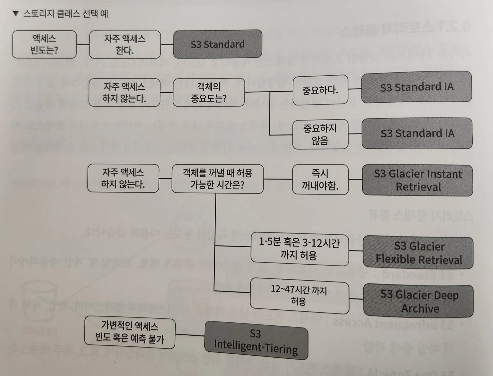
- 액세스 빈도와 객체의 중요도 그리고 꺼낼 때의 허용 시간으로 나누어 현재 상황에 맞는 스토리지 클래스를 선택

### 스토리지 클래스 설정

- 스토리지 클래스는 객체를 업로드할 때 혹은 업로드한 객체를 편집해서 스토리지 클래스를 설정
- 객체 업로드 시 속성에서 스토리지 클래스 설정 (기본적으로 S3 Standard 선택되어 있음)

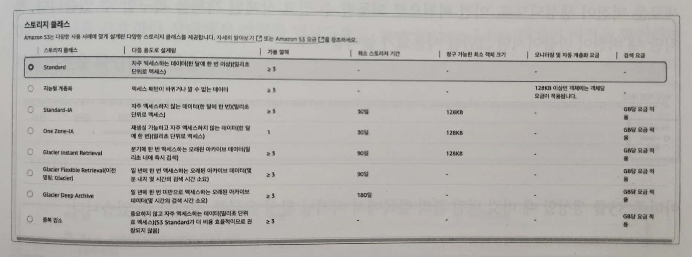
- 업로드한 객체에서 작업 → 스토리지 클래스 편집 을 선택해 스토리지 클래스를 변경
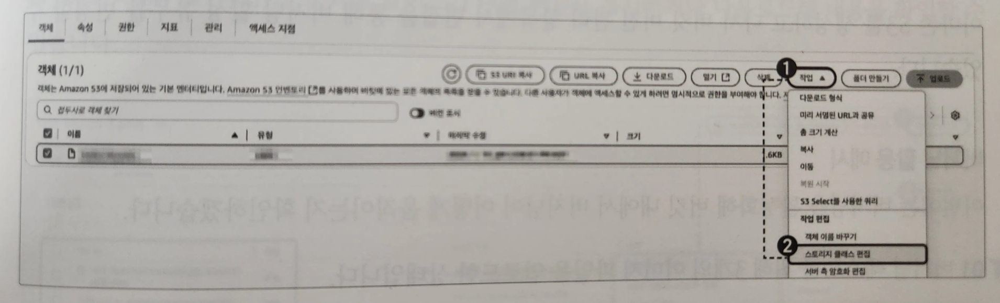

## 버전 관리를 위한 버저닝 기능

> 버저닝(Versioning) 즉 버전 관리를 사용하면 단일 객체의 여러 버전을 유지할 수 있다.


> 조작 미스로 삭제한 데이터도 간단하게 복구할 수 있는 수단을 제공
>
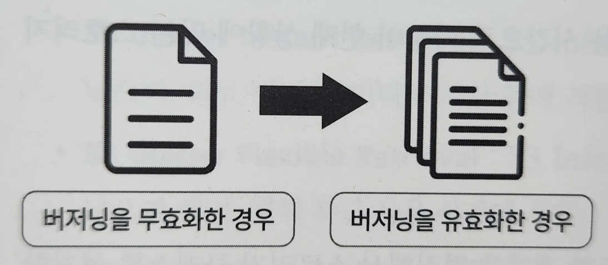

- 버저닝을 설정하지 않았다면 업로드한 객체는 단일 객체로 저장되며, 삭제 혹은 덮어쓰기가 발생할 시 객체를 복구하거나 되돌릴 수 없다.
- 버저닝을 유효화하면 객체를 업로드할 때마다 새로운 버전이 생성되므로, 이전 버전으로 되돌릴 수 있고 삭제된 객체를 복구할 수 있다.
- 새 버전이 만들어지면 그만큼 사용료가 늘어난다.
- 아마존 S3를 생성할 때 버킷 버전 관리 항목에서 버저닝 활성 유무를 선택할 수 있다.
- 아마존 S3를 생성하고 나서 버킷 버전 관리 항목에서 편집을 통해 버저닝 활성 유무를 변경할 수 있다.

### 버저닝 활용 예시

1. 버저닝 테스트를 위해 3개의 이미지 파일을 업로드한 상태

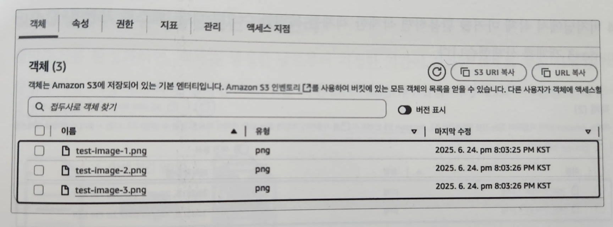
2. 버저닝을 유효화한 상태에서 객체를 업로드하고, test-image-1.jpg 객체의 버전을 확인하면 현재 버전 확인 가능

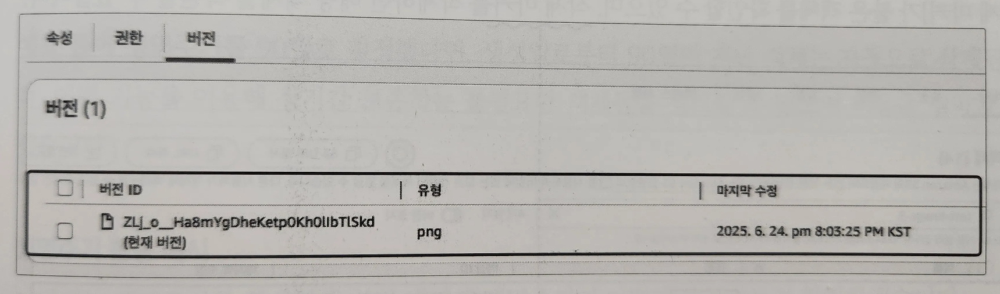
3. test-image-1 파일을 덮어쓰면 현재 덮어쓴 버전과 덮어쓰기 이전 버전으로 나누어진다. 객체 작업, 작업 을 클릭해 덮어쓰기 이전 버전을 복사하거나 다운로드해 내용 확인

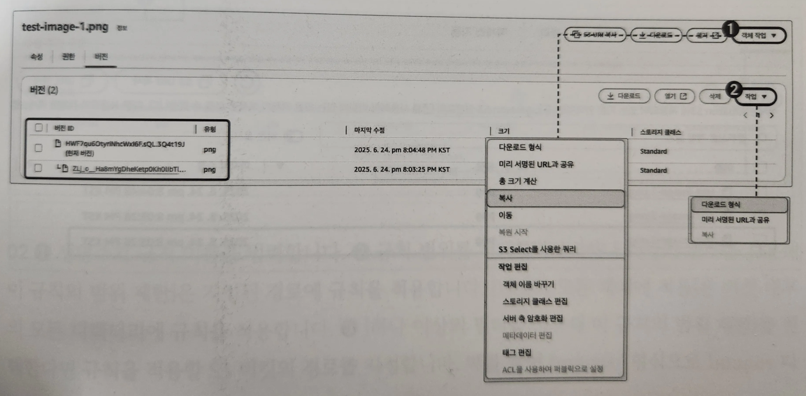

4. 버저닝에서 삭제마커를 활용하면 삭제한 객체를 복원할 수 있다.
   (테스트 차원에서 test-image-3 객체 삭제)

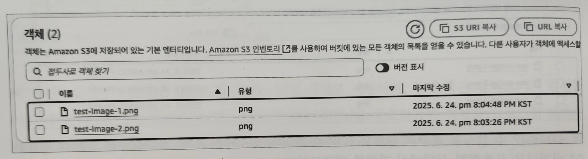

5. 버전 표시를 체크하면 객체의 모든 버전이 표시된다. 버저닝을 활성화한다면 삭제한 객체에 삭제 마커 가 붙은 객체 확인 가능. 삭제 마커를 삭제하면 해당 객체를 복원할 수 있다.

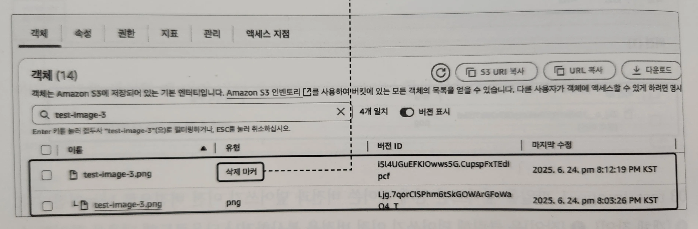

6. 삭제 마커를 삭제하면, 객체가 복원된다.

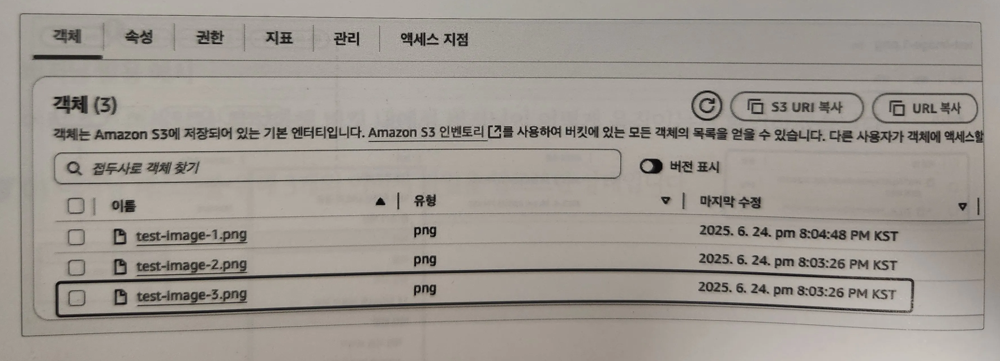
## 생명주기 규칙을 활용한 객체 관리

> 생명주기를 활성화하면 객체를 생성한 날로부터 지정한 기간이 경과한 객체를 자동 삭제한다.
>

- ex. 생명주기를 90일로 설정했다면, 생성일로부터 90일이 지난 객체는 자동으로 삭제된다.
- 장기간 보존하는 불필요한 객체들을 정리할 수 있으며 비용을 절약할 수 있다.
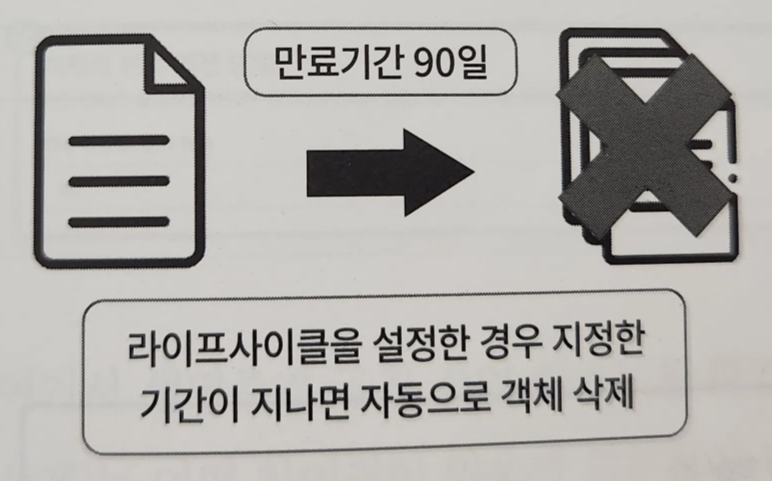

### 생명주기 활용 예시

- 생명주기는 S3 버킷 내 관리탭에서 확인가능, ‘생명주기 규칙 생성’ 클릭
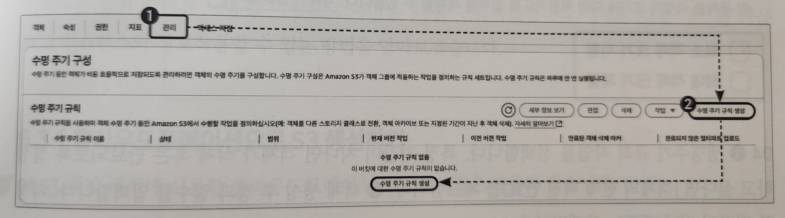

- 생명주기 규칙 이름 입력. 규칙 범위 선택.
- ‘하나 이상의 필터를 사용해 이 규칙의 범위 제한’은 지정된 경로에 규칙 적용 (규칙을 적용할 S3 버킷의 경로 지정)
    - ex. Images/ 형식으로 Images 디렉터리 내부에 규칙 지정
    - Images/test.txt와 같은 특정 객체는 지정 불가
- ‘버킷의 모든 객체에 적용’은 버킨 내부의 모든 디렉터리에 규칙 적용

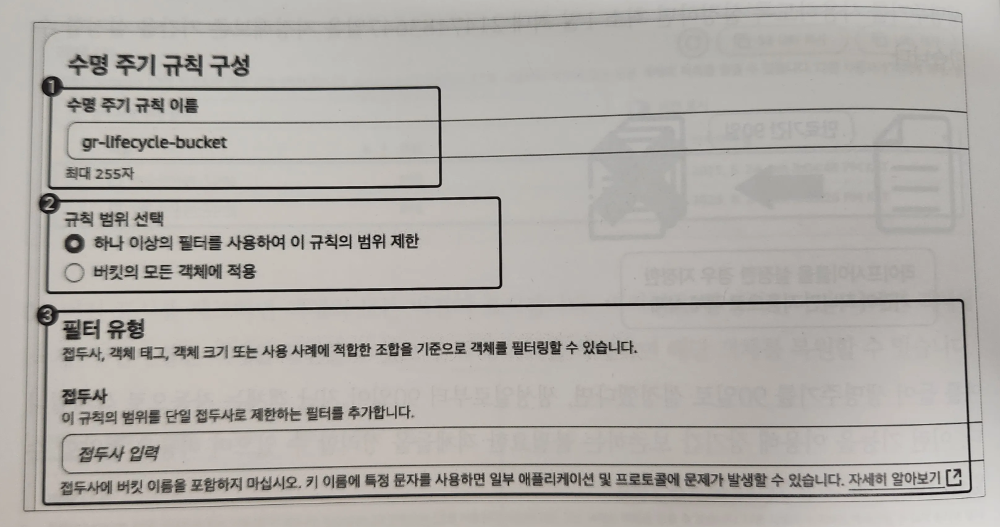

- ‘최소 객체 크기’ : 특정 크기 이상의 객체에만 생명주기 규칙이 적용되도록 지정
- ‘최대 객체 크기’ : 특정 크기 이하의 객체에만 생명주기 규칙이 적용되도록 지정

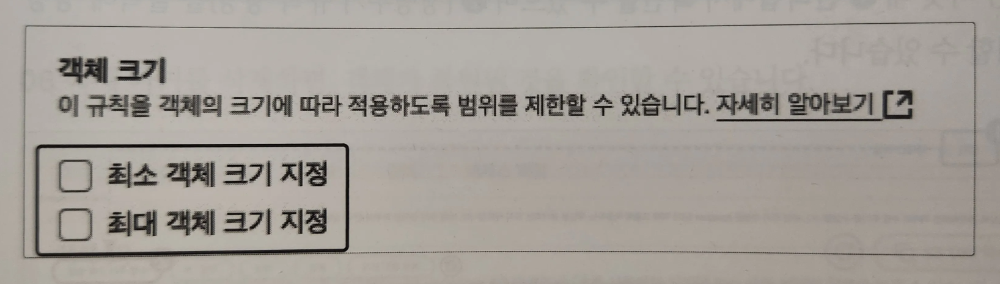
- 생명주기 규칙 작업 선택. 특정 기간이 지나면 객체가 삭제 혹은 만료되도록 설정하고 싶다면 ‘객체의 현재 버전 만료’ 클릭
- 객체 생성 후 경과 일수 입력. 지정한 기간이 지난 객체는 삭제된다.
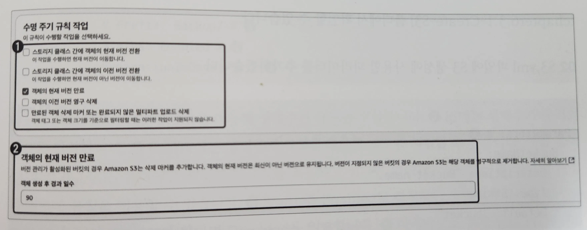

- ‘객체의 현재 버전 만료’ vs ‘객체의 이전 버전 영구 삭제’
- 버저닝을 유효화한 상태에서 ‘객체의 현재 버전 만료’만을 선택했다면, 일정 기간이 경과한 객체는 삭제되지 않고 이전 버전으로 유지된다.
- 이전 버전으로 설정된 객체를 삭제하려면 ‘객체의 이전 버전 영구 삭제’ 체크

# 아마존 S3 생성하기

> 아마존 S3를 구축하고 EC2 인스턴스와 상호작용하기
>

## 클라우드포메이션으로 S3 생성하기

https://github.com/classmethodjaewook/aws-developer/tree/main/chapter6/S3/chapter6.3.1-Create-S3

```yaml
Parameters: # 버킷 이름은 AWS의 모든 리전과 모든 계정에서 고유해야 하므로 클라우드포메이션 스택 생성 시 버킷 이름을 변경할 수 있도록 파라미터 지정
  BucketName:
    Description: "Bucket name."
    Type: String
    Default: "bucket"
```

```yaml
    Type: AWS::S3::Bucket # S3 버킷 생성에 사용할 AWS::S3::Bucket 타입 입력
    Properties: # 속성에는 S3 버킷 이름을 지정하는 BucketName 설정
      BucketName: !Sub ${SystemName}-${EnvName}-${BucketName}
      PublicAccessBlockConfiguration: # 외부 액세스 차단
        BlockPublicAcls: true
        BlockPublicPolicy: true
        IgnorePublicAcls: true
        RestrictPublicBuckets: true
```

```yaml
      LifecycleConfiguration: # 생명주기 규칙 설정
        Rules:
          - Id: !Sub ${SystemName}-lifecycle-bucket # 생명주기 규칙 이름 입력
            # Prefix: Backup/ # 생명주기 규칙을 적용할 경로 지정 (ex. S3 버킷 Backup 폴더에만 생명주기 규칙을 적용하고 싶으면 Prefix: Backup/를 입력해 지정한 경로에 규칙 적용)
            Status: Enabled # 생명주기 규칙 활성화 (Disabled : 비활성화)
            ExpirationInDays: 90 # 객체 만료 기간 90일
```

## UI로 불러와 S3 리소스 생성하기

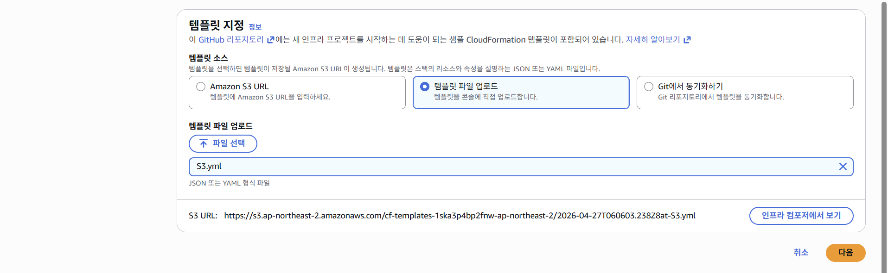
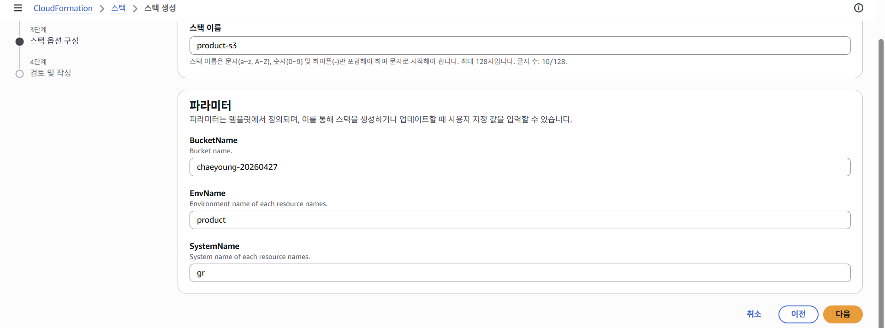
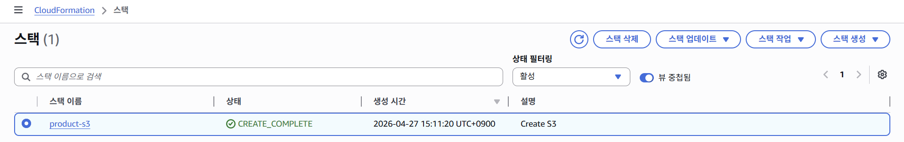
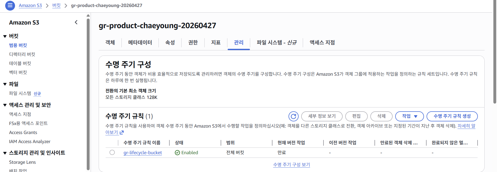

# 아마존 S3 활용하기

> 생성한 S3 버킷과 EC2 인스턴스와의 연동을 통해 객체를 다운로드 및 업로드하기
>

> VPC.yml → Security_Group.yml → IAM.yml → EC2.yml → S3.yml 순서로 클라우드포메이션 스택을 생성해야 한다.
>

https://github.com/classmethodjaewook/aws-developer/tree/main/chapter6/S3/chapter6.4-Integrating-EC2-S3

```yaml
# IAM.yml

    Type: AWS::IAM::ManagedPolicy # IAM 정책 생성
    Properties: # 속성에는 IAM 정책 이름을 지정하는 ManagedPolicyName과 권한을 설정하는 PolicyDocument가 있음
      ManagedPolicyName: !Sub ${SystemName}-${EnvName}-policy-ec2
      PolicyDocument:
        Version: "2012-10-17"
        Statement:
          - Effect: Allow # 지정한 Action을 허용할지 거부할지 선택
            Action: # 해당 권한이 어떤 AWS 서비스의 어떤 작업들을 수행할지 지정
              - s3:ListAllMyBuckets
            Resource: arn:aws:s3:::* # 권한을 적용할 리소스 지정 (여기서는 생성된 모든 S3 버킷의 리스트를 불러온다.)
```

```yaml
# IAM.yml

          - Effect: Allow
            Action: # S3 버킷에 대한 Get, Delete, Put 권한 지정
              - s3:Get*
              - s3:Delete*
              - s3:Put*
            Resource:
              - "arn:aws:s3:::gr-product-bucket/*"
      Roles: # 해당 정책을 IAM 역할에 추가
        - !Ref EC2IAMRole
```
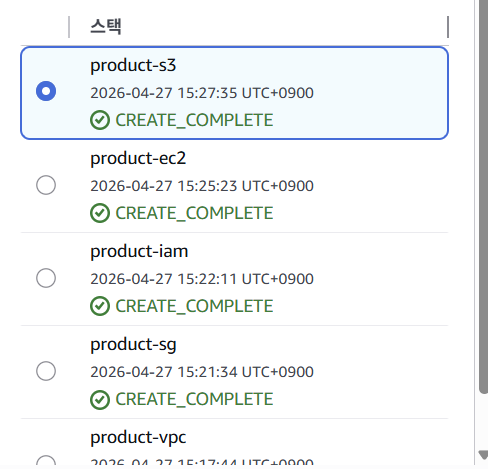
- SSM을 통해 EC2 인스턴스로 접속

```bash
# S3 버킷 리스트 출력
aws s3 ls
```

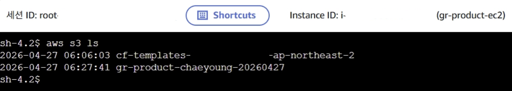
```bash
# 텍스트 파일 생성 및 업로드
sudo touch gr-text.txt # touch 명령어로 텍스트 파일 생성
aws s3 cp gr-text.txt s3://gr-product-chaeyoung-20260427/ # 생성한 텍스트 파일을 S3 버킷으로 업로드 / 'gr-product-bucket'에는 업로드할 버킷 이름 입력
```

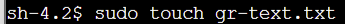
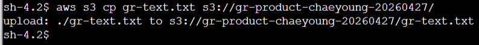
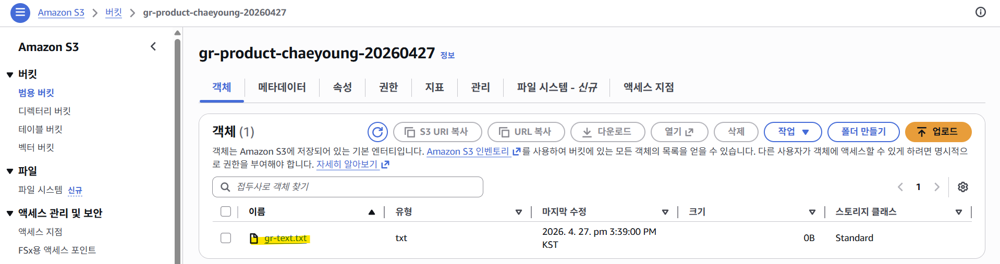

- EC2 인스턴스에서 S3 버킷의 객체를 내려받기 위해 임의의 테스트 파일 업로드

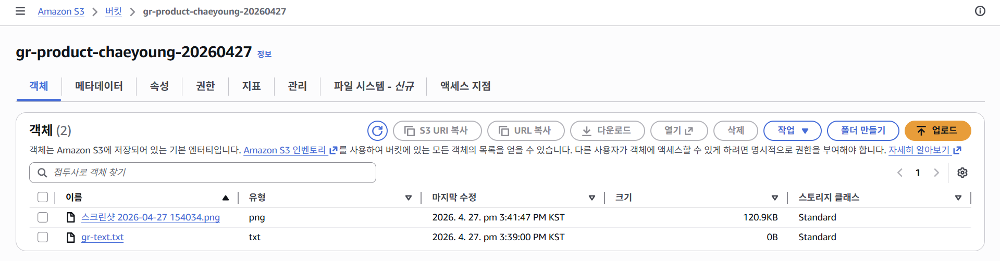

- EC2 인스턴스에서 S3 버킷의 객체 다운로드
- s3://버킷명/내려받을 객체 명 경로/다운로드 시 지정할 파일 이름

```bash
# EC2 인스턴스에 버킷에 저장된 객체 다운로드
sudo -i
sudo aws s3 cp "s3://gr-product-chaeyoung-20260427/스크린샷 2026-04-27 154034.png" ./test-image.png
ls
```
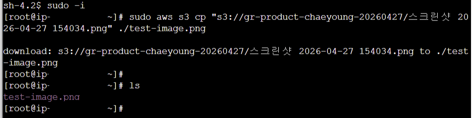

- S3 버킷에서 파일을 내려받은 것을 확인할 수 있다.