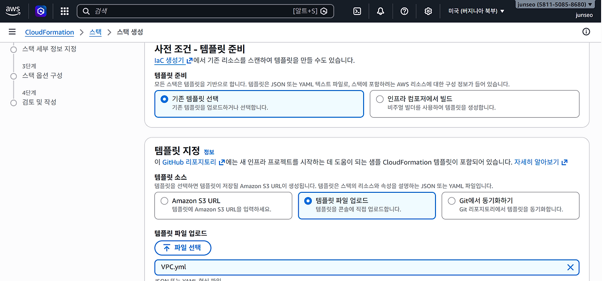
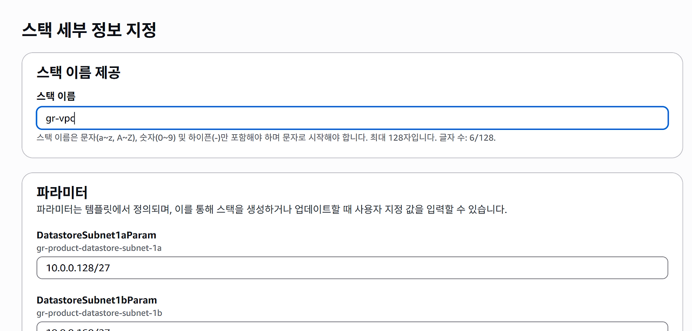
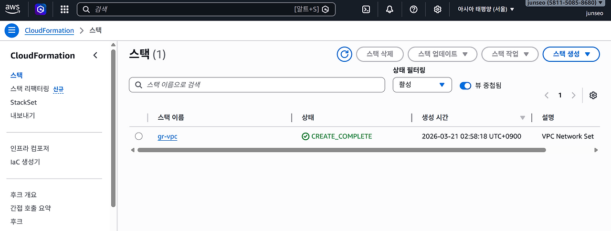
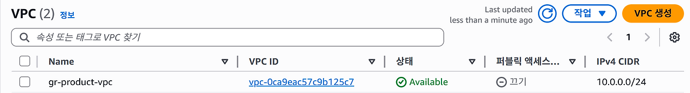

# 0장. AWS 시작하기
## 0.2 AWS 사용 방법
레벨 1 : UI 사용 가능한 AWS 관리 콘솔 - 직관적인 사용 가능하지만 리소스가 늘어날수록 관리 힘듦

레벨 2 : SDK, CLI 로 AWS 사용 가능

레벨 3 : IaC 툴인 클라우드 포메이션을 이용하여 JSON, YAML 형식으로 클라우드 인프라를 정의하여 다수의 AWS 리소스 생성 및 관리

레벨 4 : AWS CDK : 사용자가 익숙한 프로그래밍 언어를 사용하여 클라우드 인프라 정의

## 0.3 비주얼 스튜디오 코드로 클라우드포메이션 템플릿 관리하기
vs code 다운로드 -> 파이썬 다운로드 -> vs code 터미널에서 다음 명령어 실행하여 클라우드포메이션 린터 설치

pip install cfn-lint
## 0.4 예제 코드 저장소 위치
예제 코드 : https://github.com/classmethodjaewook/aws-developer
## 0.5 CloudFormation 사용
아마존 VPC : 클라우드의 네트워크 환경을 구축하고 관리할 수 있는 서비스

깃허브에 있는 코드를 다운받아서 업로드

이름을 gr-vpc로 설정 후 나머지는 그대로

생성 완료 된 스택

VPC 탭에서 클라우드포메이션으로 생성된 VPC 확인 가능
## 0.6 AWS에서 생성형 AI 활용
생성형 AI를 통해 코드 작성 및 솔루션과 트러블슈팅 가능

