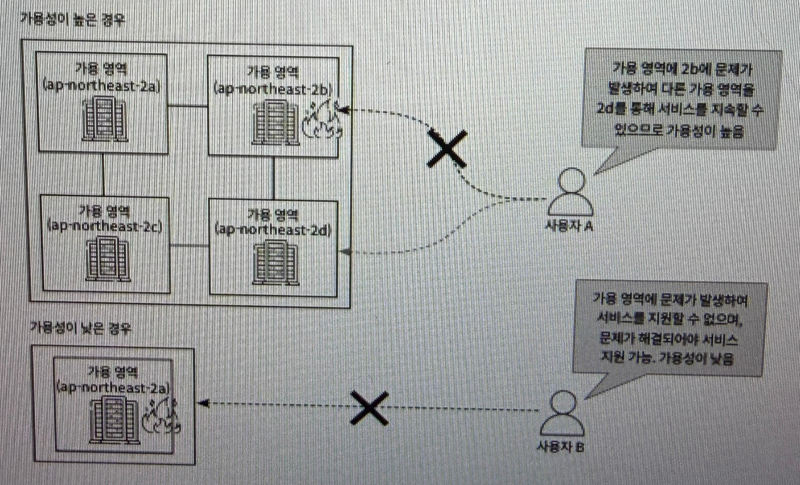
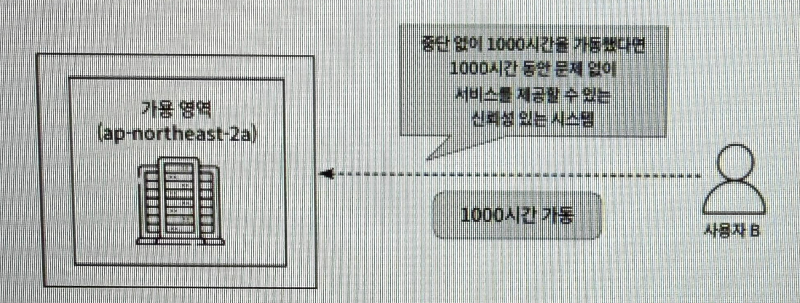
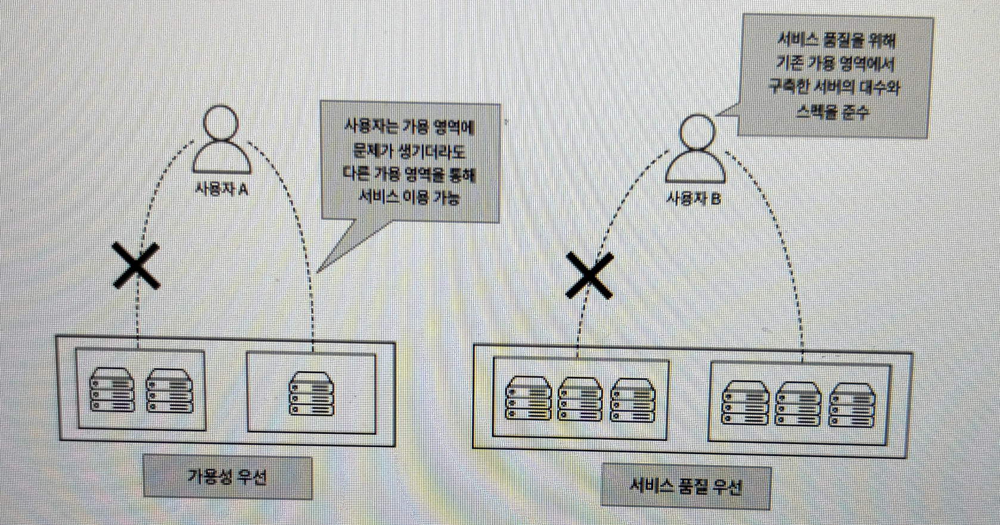
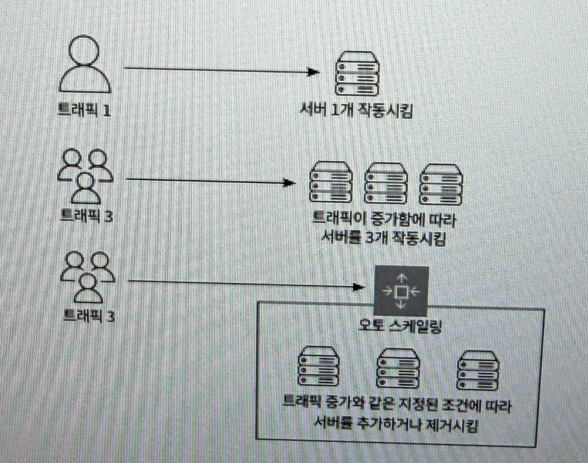
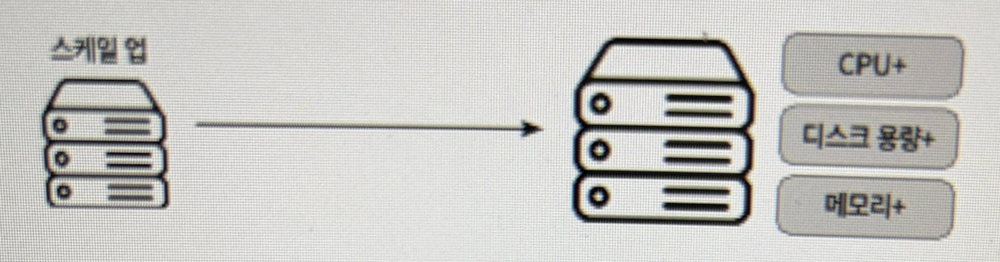
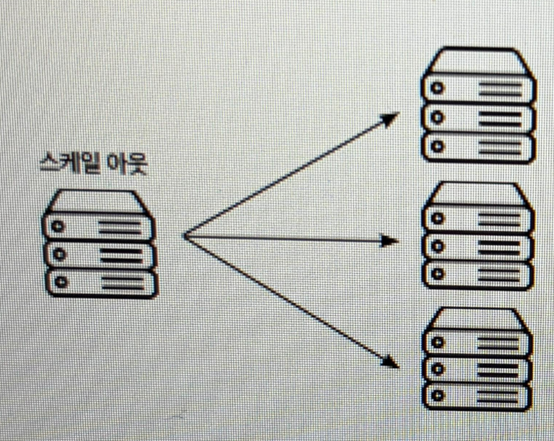

# 1장. AWS를 쓰려면 알아야 하는 넓고 얕은 배경지식
## 1.1 AWS 입문하기
### 1.1.1 AWS란 무엇인가?
AWS는 아마존에서 제공하는 클라우드 컴퓨팅으로 인프라 환경을 구축하고 운영하는 데 필요한 다양한 온라인 서비스를 제공한다.

### 1.1.2 AWS, 어떻게 탄생했고 왜 많은 사람이 이용하는가?
기존의 독립적인 데이터 센터 운영 -> 이용자 수 증가 -> 서버 과부하 의 과정에서 서버 과부하를 개선하기 위해 데이터 센터에 많은 비용을 투자해야 했는데, 종량 과금제를 통한 필요한 만큼만 사용하고 지불할 수 있도록 개선했다.

특히 S3와 EC2 라는 가상 클라우드 서버를 주축으로 성장해 나갔다.

### 1.1.3 AWS와 Amazon 접두사의 의미
- Amazon = 독립형 실행 서비스로 사용자에게 단독으로 실행 가능한 서비스 제공
- AWS = 유틸리티 서비스로 혼자 사용하지 않고 다른 서비스와 함께 쓰임
- 
## 1.2 AWS를 쓰려면 알아두면 유용한 클라우드 지식
### 1.2.1 온프레미스 (On-Premise)
- 온프레미스 : 조직이 자체적으로 IT 인프라를 소유하여 관리 및 운영하는 것
    - 많은 투자 비용과 시간 소요
    - 유지 비용 발생
### 1.2.2 클라우드 (Cloud)
  - 클라우드 : 서버를 가상화 하여 제3자가 사용자에게 저장소를 제공하는 형태
    - 단기간 내에 서버 구축 및 확자 가능
    - 운영 효율성 및 자원 활용성 증가
### 1.2.3 하이브리드 클라우드
- 온프레미스 + 클라우드 혼합 -> 온프레미스의 시스템 보안 및 기밀성 유지, 클라우드의 확장성과 유연성 활용
### 1.2.4 서버리스
- 서버리스 : 개발 및 운영 과정에서 서버를 관리하거나 배포할 필요 없이 기능을 구현하고 실행하는 클라우드 기반 서비스
- 개발자가 코드를 작성하고 배포하는 것에만 집중하고 서버 인프라 관리에 신경쓸 필요 없음
- 대량의 데이터를 처리하는 경우 서버리스 사용이 권장되지 않음
### 1.2.5 리전
- AWS 글로벌 인프라는 리전과 가용영역, 에지 로케이션으로 구성된다
  - 리전 : 서비스가 제공되는 물리적인 국가/도시 단위의 지역, 한국 서울 리전 : ap-northeast-2
### 1.2.6 가용 영역 (AZ)
- 리전 내에 서버, 스토리지, 네트워크 장비를 저장하는 하나 이상의 물리적인 개별 데이터센터로 구성되며 각각 독립적으로 운영된다
  - 예를 들어, 서울 리전은 [ ap-northeast-2a ], [ ap-northeast-2b ], [ ap-northeast-2c ], [ ap-northeast-2d ] 처럼 4개의 가용 영역을 운영중이다. 외부 영향을 최소화 하고, 시스템 가동 중지를 최소화하도록 보장한다.
### 1.2.7 에지 로케이션
- 에지 로케이션 : 오리진 서버의 콘텐츠를 서로 다른 지역에서 빠르게 접근할 수 있도록 만드는 캐시 서버 모음
- CDN 역할
### 1.2.8 ~ 1.2.13 핵심 특징
**가용성 (Availability)**
→ 서비스가 계속 동작하는 능력, 자연
재해 등 시스템 장애가 나도 정상적으로 작동할 수 있는 능력

**신뢰성 (Reliability)**
→ 안정적으로 동작하는지, 서버 혹은 시스템이 얼마나 오랫동안 가동되는 지, 가동 시간동안 시스템이 예상대로 작동하고 중단되지 않는 정도

→ 장애 발생해도 버티는 능력, 보통 우회하는 식으로 서비스 지속, 하위 시스템이나 중복 시스템 작동시킴

**탄력성 (Elasticity)**
→ 상황에 맞게 대처, 트래픽이나 부하에 대응하여 유연하게 자동으로 조정하는 능력

**확장성 (Scalability)**
→ 사용량 증가 시 확장 가능

스케일 업 : 서버 성능 향상

스케일아웃 : 비슷한 스펙 서버 추가하여 전체 시스템 성능 향상