# Chapter 11. 백엔드 서비스 이해하기

## 11.1 백엔드 서비스 유형 파악하기

프론트엔드가 사용자에게 보여지는 화면을 담당한다면, 백엔드는 사용자가 직접 볼 수 없는 부분(데이터 처리, 보안 등)을 담당한다.


사용자는 프론트엔드(웹 애플리케이션)에서 로그인 같은 화면을 통해 기능을 사용하지만, 그 뒤에서 백엔드는 데이터베이스로부터 데이터를 처리하거나 호출하는 등 사용자가 보지 못하는 작업을 수행한다.

AWS에서 제공하는 대표적인 백엔드 서비스는 다음과 같다.

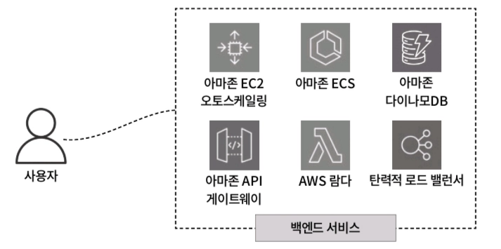

- 아마존 EC2 오토스케일링
- 아마존 ECS
- 아마존 다이나모DB
- 아마존 API 게이트웨이
- AWS 람다
- 탄력적 로드 밸런서

이런 서비스들을 통해 안정성, 효율성, 확장성을 보장할 수 있다. 이 챕터에서는 **부하 분산을 위한 탄력적 로드 밸런서**를 중점적으로 다룬다.

---

## 11.2 부하 분산 서비스, 탄력적 로드 밸런서란?

AWS에서는 부하 분산을 위해 **탄력적 로드 밸런서(Elastic Load Balancer, ELB)** 를 제공한다. 사용자가 급증하더라도 트래픽을 적절하게 분산해 안정적으로 서버를 운영할 수 있게 해준다.

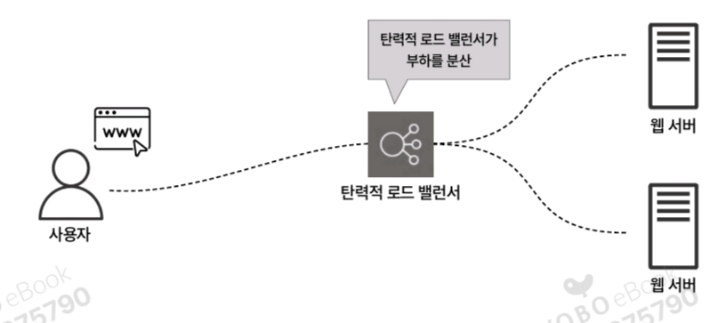

탄력적 로드 밸런서는 웹 서버 앞단에 배치된다. 사용자는 직접 웹 서버에 접근하지 않고 로드 밸런서를 거쳐서 접근하게 된다. 이렇게 하면:

- 웹 서버를 외부로 직접 공개할 필요가 없어 **보안이 강화**됨
- 사용자는 로드 밸런서를 통해서만 웹 서비스에 접근 가능
- 개발자는 웹 서버에서 안전하게 작업 수행 가능

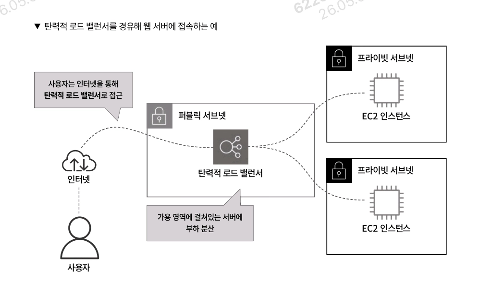

로드 밸런서는 **퍼블릭 서브넷**에 배치되며, DNS 이름을 별도로 제공한다. 아마존 라우트53과 연동해 도메인(예: `goldenrabbit.co.kr`)을 할당할 수 있다. 즉, EC2 인스턴스에 도메인을 직접 할당하는 것이 아니라 로드 밸런서에 도메인을 할당하므로 사용자와 EC2 인스턴스 간 직접적 접근을 차단할 수 있다.

또한 여러 가용 영역에 걸쳐 부하 분산이 가능해, 하나의 가용 영역이 무너져도 다른 영역에서 서비스를 지속할 수 있다.

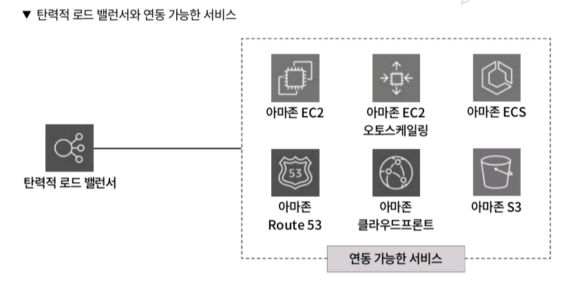

탄력적 로드 밸런서와 연동 가능한 서비스:

- 아마존 EC2 / EC2 오토스케일링
- 아마존 ECS
- 아마존 라우트53 (도메인 라우팅)
- 아마존 클라우드프론트 (고속 콘텐츠 전송)
- 아마존 S3 (접속 로그 기록)

---

## 11.3 탄력적 로드 밸런서 살펴보기

탄력적 로드 밸런서에서는 **ALB, NLB, GWLB** 세 가지 유형을 제공한다.

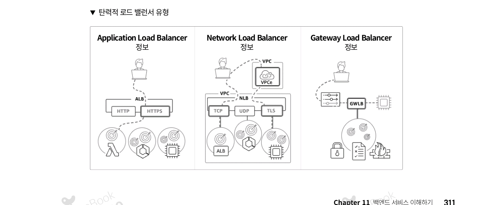

각 로드 밸런서의 특징은 다음과 같다.

| 종류 | 명칭 | OSI 계층 | 처리 트래픽 |
| --- | --- | --- | --- |
| ALB | Application Load Balancer | 7계층 (응용 계층) | HTTP / HTTPS |
| NLB | Network Load Balancer | 4계층 (전송 계층) | TCP / UDP |
| GWLB | Gateway Load Balancer | 3계층 (네트워크 계층) | 타사 제품 마이그레이션용 |

GWLB는 2020년 11월에 추가된 로드 밸런서로, 주로 타사 제품을 AWS로 마이그레이션할 때 사용한다. VPC Peering이나 Transit Gateway 등으로 네트워크를 연결해 라우팅을 수행한다. ALB, NLB와 달리 웹 애플리케이션이나 웹사이트 구축 용도에는 적합하지 않다.

> 참고: TCP/IP와 OSI 7계층 매핑
>

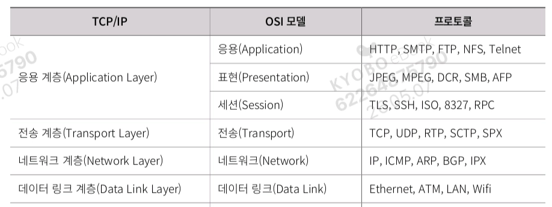

이 책에서는 가장 자주 사용되는 **ALB**와 **NLB**를 중점적으로 학습한다.

### 11.3.1 로드 밸런서의 작동 방식

로드 밸런서는 **퍼블릭 서브넷** 또는 **프라이빗 서브넷** 어디에든 생성할 수 있다.

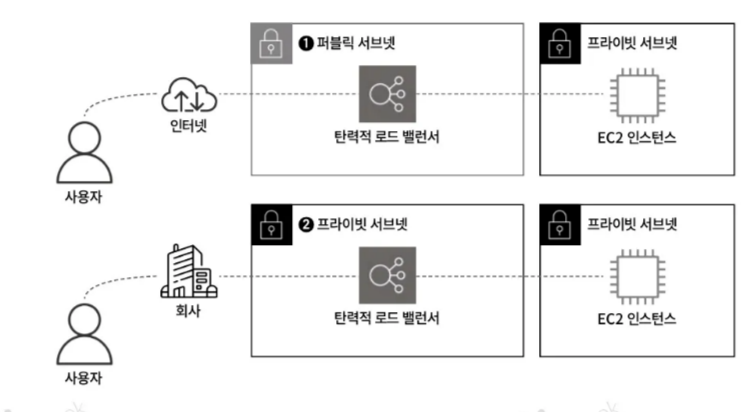

- ❶ **퍼블릭 서브넷에 생성**: `goldenrabbit.co.kr`처럼 외부 사용자에게 웹사이트를 공개하는 패턴 (인터넷으로 공개)
- ❷ **프라이빗 서브넷에 생성**: 사내에서만 특정 웹 서비스를 제공하는 패턴 (외부 인터넷 통신 불가)

로드 밸런서는 여러 가용 영역에 걸쳐 부하 분산을 실시한다. 각 가용 영역에 **로드 밸런서 노드**가 생성되어, 이 노드를 통해 가용 영역을 구분하고 부하 분산을 수행한다.

- ❶ 퍼블릭 서브넷 선택 → 로드 밸런서 노드가 퍼블릭 서브넷에 생성 → 인터넷을 통해 웹 서비스 접근 가능
- ❷ 프라이빗 서브넷 선택 → 로드 밸런서 노드가 프라이빗 서브넷에 생성 → 외부 통신 불가, 웹 서비스 접근 불가

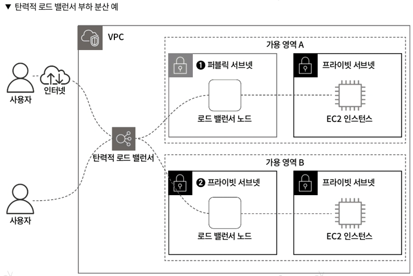

### 보안 그룹 설정

로드 밸런서도 EC2처럼 보안 그룹을 설정할 수 있다.

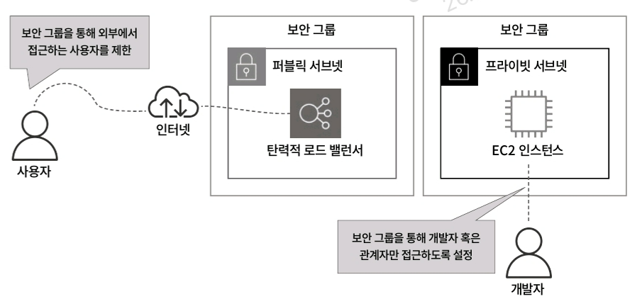

- 외부 공개 웹사이트: 보안 그룹을 완전히 오픈 → 모든 사용자 접근 허용
- EC2 인스턴스의 보안 그룹: 로드 밸런서의 접근만 허용 → 외부 사용자는 EC2에 직접 접근 불가
- EC2 인스턴스에 개발자/관리자만 접근하도록 보안 그룹 설정 시 보안성 강화

### 11.3.2 로드 밸런서의 대상 그룹과 리스너

로드 밸런서 노드는 가용 영역을 구분하는 용도일 뿐이고, 부하 분산할 EC2 인스턴스를 직접 선택할 수는 없다. 이 문제를 해결하는 것이 **대상 그룹(Target Group)** 이다.

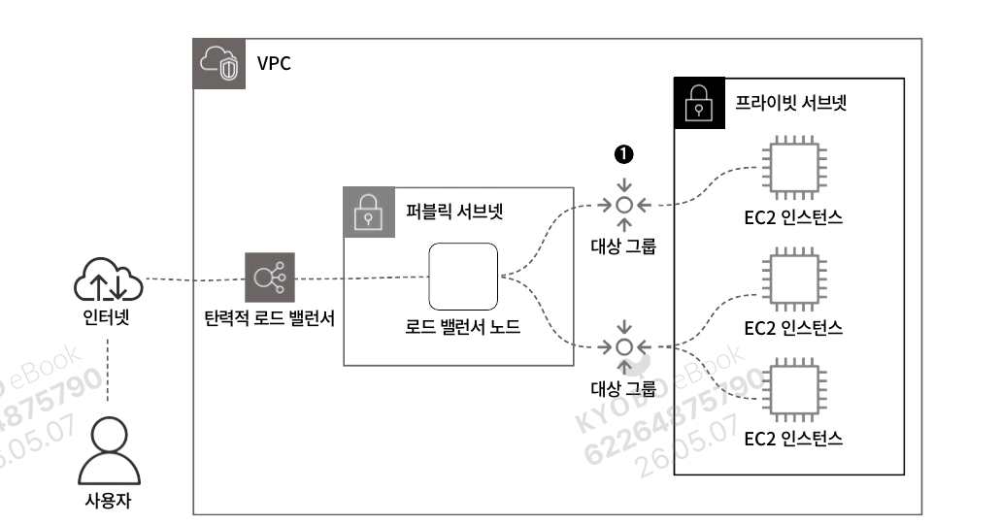

### 대상 그룹 (Target Group)

- 로드 밸런서 노드와 EC2 인스턴스 사이의 **중간 다리 역할**
- 부하 분산을 시도할 EC2 인스턴스를 등록하고 관리
- 대상 그룹은 n개로 나누어 생성 가능
- EC2 인스턴스의 역할에 따라 대상 그룹을 구분하는 것이 바람직 (예: 웹 서비스 제공 EC2 / API 처리 EC2)
- EC2 인스턴스의 **상태 확인(Health Check)** 수행

### Health Check

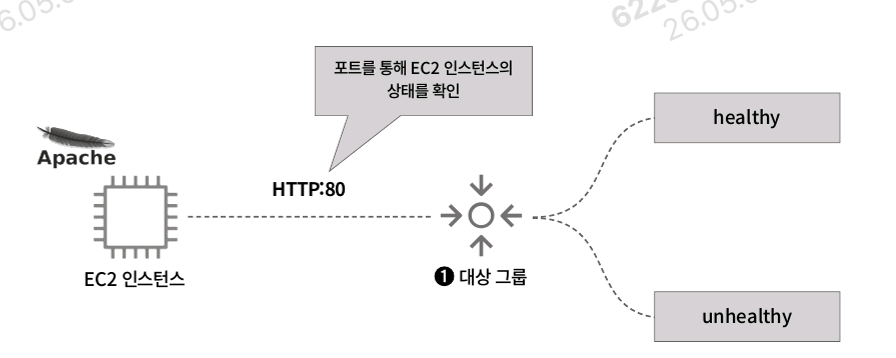

대상 그룹에 등록된 EC2 인스턴스의 상태를 포트를 통해 확인한다.

- 아파치(Apache)가 설치된 EC2 인스턴스는 기본 80번 포트 사용 → 대상 그룹도 80번 포트로 설정
- 정상: `healthy` 반환
- 비정상: `unhealthy` 반환

### 리스너 (Listener) 와 프로토콜

로드 밸런서는 더 안전한 통신인 **HTTPS(443 포트)** 사용을 지원한다.

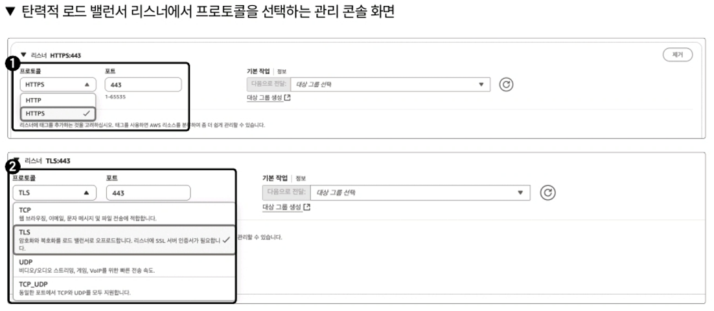

- ❶ **ALB**: 443 포트의 HTTPS 프로토콜 지정 가능
- ❷ **NLB**: 443 포트의 TLS 프로토콜 지정 가능

HTTPS/TLS를 사용하려면 SSL/TLS 인증서를 발급받아 로드 밸런서에 등록해야 한다. AWS에서는 **AWS ACM(AWS Certificate Manager)** 서비스로 SSL/TLS 인증서를 발급받을 수 있다.

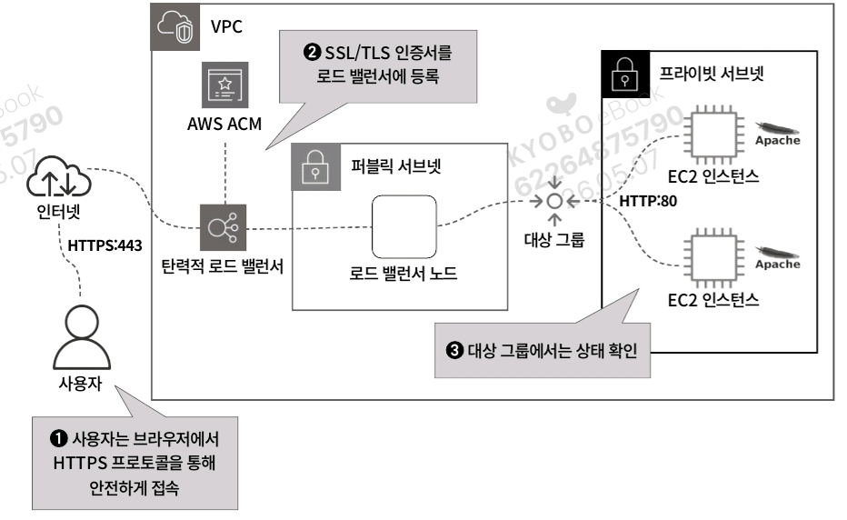

HTTPS/TLS 동작 흐름:

1. ❶ 사용자가 브라우저에서 HTTPS 프로토콜로 접근 (`https://goldenrabbit.co.kr`)
2. ❷ AWS ACM에서 발급한 SSL/TLS 인증서를 로드 밸런서에 등록
3. ❸ 로드 밸런서 노드가 가용 영역을 구분하여 부하 분산
4. 대상 그룹에서 EC2 인스턴스 상태 확인 후 라우팅

### 리스너 규칙

리스너에서는 프로토콜과 포트를 지정하고 대상 그룹을 연결한다.

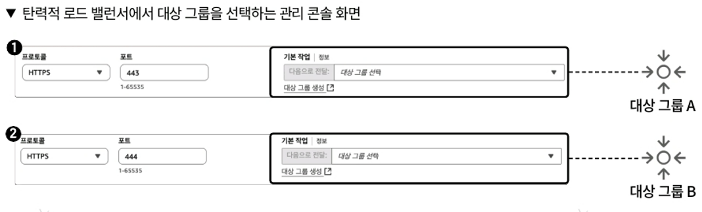

**1) 포트 기반 라우팅**

- ❶ HTTPS:443 → 대상 그룹 A의 EC2 인스턴스로 라우팅
- ❷ HTTPS:444 → 대상 그룹 B의 EC2 인스턴스로 라우팅

**2) 경로 기반 라우팅**

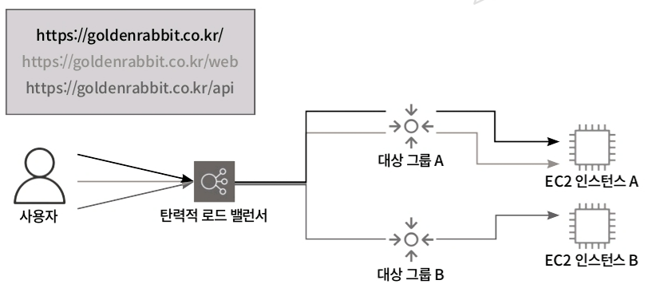

- `https://goldenrabbit.co.kr/` → EC2 인스턴스 A
- `https://goldenrabbit.co.kr/web` → EC2 인스턴스 A의 /web 경로
- `https://goldenrabbit.co.kr/api` → EC2 인스턴스 B의 /api 경로

`/admin` 경로를 관리자 전용으로 제한하는 등 **접근 권한 제어**도 가능하다.

**3) 고정 응답 반환 규칙**

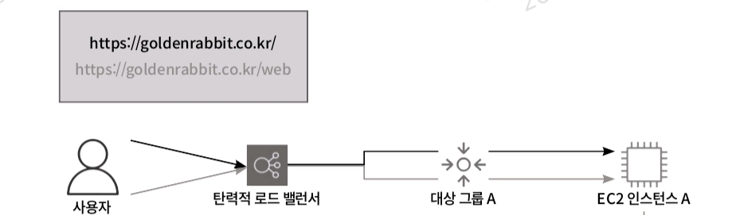

특정 경로에 접근한 사용자에게 응답 코드와 텍스트를 반환하는 규칙. 잘못된 URL 접근 또는 점검 중일 때 주로 사용된다. 반환 가능한 텍스트: HTML, JavaScript, JSON 등.

### 11.3.3 부하 분산을 위한 로드 밸런서의 알고리즘

로드 밸런서는 다양한 알고리즘으로 부하 분산을 수행한다.

### 1) 라운드 로빈 (Round Robin Method)

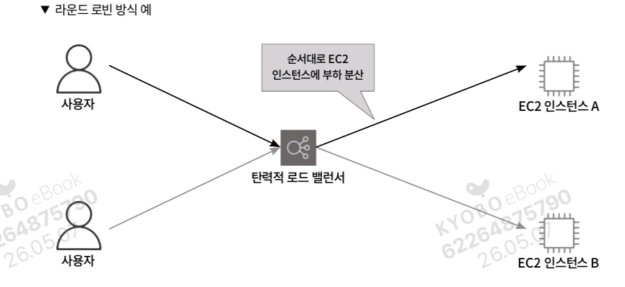

- 클라이언트로부터 받은 요청을 로드 밸런싱 대상 서버에 **순서대로** 할당
- 첫 번째 요청 → 첫 번째 서버, 두 번째 요청 → 두 번째 서버
- 서버 성능이 동일하고 처리 시간이 짧은 애플리케이션에 적합

### 2) 가중치 랜덤 (Weighted Random Method)

- 정상 작동하는 서버에 임의의 순서로 요청을 라우팅
- ATW(Automatic Target Weights)에 대응 → ALB 뒤의 대상 서버 장애/성능 저하를 감지해 다른 서버로 자동 트래픽 전달
- 비정상 대상 식별 후 트래픽 삭제

### 3) 최소 미해결 요청 (Least Outstanding Requests)

- 연결 수가 가장 적은 서버로 라우팅
- 동적 분산 알고리즘 → 각 서버의 현재 연결 수를 동적으로 카운트
- 동적으로 변하는 요청에 대한 부하 분산 가능

> 위 알고리즘들은 **ALB**에서 사용되며, NLB는 **AWS Hyperplane**이라는 AWS 독자 부하 분산 기술을 사용한다.
>

### 교차 영역 로드 밸런싱 (Cross Zone Load Balancer)

- **ALB**: 항상 교차 영역 로드 밸런싱이 유효화 (무효화 불가)
- **NLB**: 유효화/무효화 선택 가능

**무효화 상태**

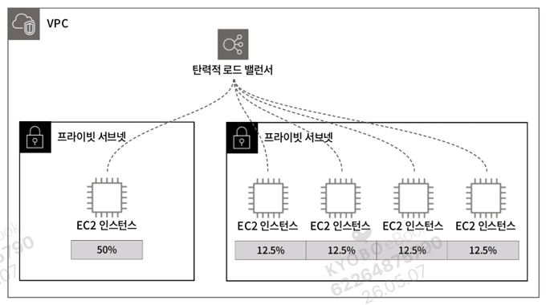

- 가용 영역별로 균등 분산
- 한 영역에 EC2 1개 → 50%, 다른 영역에 EC2 4개 → 각 12.5%
- 가용 영역 단위로는 균등하지만, 인스턴스 단위로는 불균형

**유효화 상태**


- 가용 영역과 무관하게 모든 EC2 인스턴스에 균등 분산
- 5개 인스턴스 → 각 25%

> 💡 **고정 IP 필요 시 NLB와 ALB의 활용**
NLB는 ALB와 달리 **고정 IP 주소**를 사용할 수 있다. 보안 요구사항으로 연결 대상을 IP로 제한하거나 고객이 항상 같은 IP로 액세스하는 상황에서 유용하다. NLB는 네트워크 레벨에서 동작해 TCP/UDP/TLS 트래픽을 처리하지만, ALB처럼 응용 계층 라우팅은 제공하지 않는다. 현재는 NLB를 ALB 앞단에 배치해 고정 IP로 접근하면서도 ALB의 고급 기능을 활용할 수 있다.
>

### 11.3.4 환경별 로드 밸런서 구성 패턴

서비스 제공 전에는 보통 개발/테스트 환경에서 먼저 검증한 후 실전 환경에 배포한다. 이때 로드 밸런서를 어떻게 구성할지 두 가지 패턴을 살펴본다.

### 패턴 1: 환경별 로드 밸런서 분리

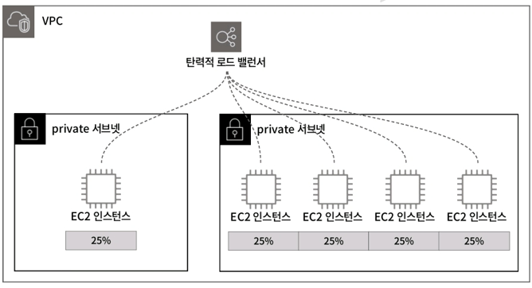

실전 환경과 개발 환경에 각각 로드 밸런서를 생성해 관리.

**장점**:

- 각 환경의 문제를 분리 → 개발 환경 문제가 실전 환경에 영향 미치지 않음
- 트래픽과 리소스 사용률 분리 관리 가능
- 환경에 맞는 액세스 제어 정책 적용 가능 (실전 환경은 더 엄격하게)
- 독립적 확장 가능 → 환경별 성능 조절 가능

가장 일반적이고 이상적인 패턴이다.

### 패턴 2: 단일 로드 밸런서로 환경 제어

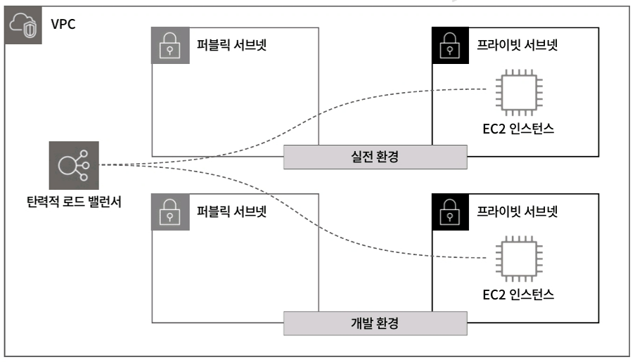

하나의 로드 밸런서로 실전/개발 환경 모두 제어.

- **포트 기반**: 실전 443번, 개발 444번 포트로 분리
- **경로 기반**: 개발 환경은 `goldenrabbit.co.kr/dev/`로 접속

**단점**:

- 로드 밸런서 장애 시 모든 환경에 영향
- 리스너 규칙이 복잡해지고 관리 어려움

> 두 방법 모두 가능하지만 **환경별 분리(패턴 1)** 가 더 이점이 있다.
>

---

## 11.4 탄력적 로드 밸런서 활용하기

### 11.4.1 탄력적 로드 밸런서를 생성하고 EC2 인스턴스와 연동하기

### 실습 환경 구성도

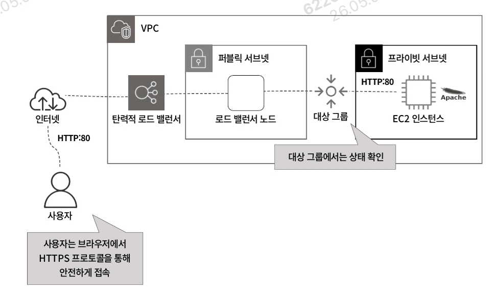

- 퍼블릭 서브넷에 로드 밸런서 생성
- 대상 그룹에 아파치(Apache)가 설치된 EC2 인스턴스 등록
- 사용자는 HTTP 80번 포트로 로드 밸런서 접근 → 아파치 웹페이지 출력

    ```bash
    클라우드포메이션 생성 순서
    VPC.yml -> IAM.yml -> Security_Group.yml -> EC2.yml -> ALB.yml
    ```


### Step 1. Security_Group.yml 작성

로드 밸런서와 EC2 인스턴스의 보안 그룹을 생성한다.

```yaml
# Security_Group.yml

ALBSecurityGroup:                                    # ❶ 로드 밸런서의 보안 그룹 리소스 이름
    Type: AWS::EC2::SecurityGroup                    # ❷ 보안 그룹 생성 타입 지정
    Properties:
        GroupName: !Sub ${SystemName}-${EnvName}-alb-sg
        GroupDescription: !Sub ${SystemName}-${EnvName}-alb-sg
        SecurityGroupIngress:                        # ❸ HTTP 80 포트로 인터넷 접근 허용
            - IpProtocol: tcp
              FromPort: 80
              ToPort: 80
              CidrIp: 0.0.0.0/0                      # 모든 IP에서 접근 허용

EC2SecurityGroup:                                    # ❹ EC2 인스턴스의 보안 그룹
    Type: AWS::EC2::SecurityGroup
    Properties:
        GroupName: !Sub ${SystemName}-${EnvName}-ec2-sg
        GroupDescription: !Sub ${SystemName}-${EnvName}-ec2-sg
        SecurityGroupIngress:                        # ❺ 로드 밸런서를 통한 접근만 허용
            - IpProtocol: tcp
              FromPort: 80
              ToPort: 80
              SourceSecurityGroupId: !GetAtt ALBSecurityGroup.GroupId  # 로드 밸런서 SG만 허용`
```

### Step 2. EC2.yml에 사용자 데이터 추가

EC2 인스턴스 생성 시 자동으로 아파치를 설치하도록 사용자 데이터를 작성.

```yaml
# EC2.yml

UserData:
    Fn::base64: |
        #!/bin/bash
        # Use this for your user data (script from top to bottom)
        # install httpd (Linux 2 version)
        sudo yum update -y
        sudo yum install httpd-2.4.51 -y          # 아파치 2.4.51 설치
        sudo systemctl start httpd                # 아파치 서비스 시작
        sudo systemctl enable httpd               # 부팅 시 자동 실행
        sudo httpd -v                             # 버전 확인
        # 기본 index.html을 웹 루트로 복사
        sudo cp /usr/share/httpd/noindex/index.html /var/www/html/index.html
```

이 사용자 데이터를 통해 EC2 인스턴스가 생성됨과 동시에 아파치가 자동 설치된다.

### Step 3. ALB.yml - 대상 그룹 작성

```yaml
# ALB.yml

ALBTargetGroup:                                      # ❶ 로드 밸런서의 대상 그룹 리소스 이름
    Type: AWS::ElasticLoadBalancingV2::TargetGroup   # ❷ 대상 그룹 타입 지정
    Properties:
        VpcId:                                       # ❸ 대상 그룹이 생성될 VPC 설정
            Fn::ImportValue: !Sub ${EnvName}-vpc
        Name: !Sub ${SystemName}-${EnvName}-tgp
        Protocol: HTTP                               # ❹ 대상 그룹의 프로토콜
        Port: 80
        HealthCheckProtocol: HTTP                    # 상태 확인 프로토콜
        HealthCheckPath: "/"                         # 웹 서버 메인 디렉터리 경로 (/var/www/html/)
        HealthCheckPort: "traffic-port"              # 전송 대상 포트 (서비스 실행 포트)
        HealthyThresholdCount: 5                     # 정상 임곗값 (성공 횟수)
        UnhealthyThresholdCount: 2                   # 비정상 임곗값 (실패 횟수)
        HealthCheckTimeoutSeconds: 5                 # 제한 시간 (응답 대기 시간)
        HealthCheckIntervalSeconds: 60               # 상태 확인 간격
        Matcher:
            HttpCode: 200                            # 성공 코드
        Tags:
            - Key: Name
              Value: !Sub ${SystemName}-${EnvName}-tgp
            - Key: Env
              Value: !Sub ${EnvName}
        Targets:                                     # ❺ 대상 그룹에 추가할 EC2 인스턴스
            - Id:
                Fn::ImportValue: !Sub ${EnvName}-ec2
              Port: 80
```

> 📌 **HealthCheckPath**: 웹 서버의 메인 디렉터리 경로. 아파치는 `/var/www/html/`이 메인이므로 `"/"` 지정 시 이 경로에서 상태 확인. 해당 경로에 `index.html`과 같은 파일이 없으면 상태 확인 실패.
>

### Step 4. ALB.yml - 로드 밸런서 작성

```yaml
# ALB.yml

InternetFacingALB:                                   # ❶ 로드 밸런서 리소스 이름
    Type: AWS::ElasticLoadBalancingV2::LoadBalancer  # ❷ 로드 밸런서 타입 지정
    Properties:
        Name: !Sub ${SystemName}-${EnvName}-alb
        Tags:
            - Key: Name
              Value: !Sub ${SystemName}-${EnvName}-alb
            - Key: Env
              Value: !Sub ${EnvName}
        Scheme: "internet-facing"                    # ❸ 외부 공개 (internet-facing) / 내부용 (internal)
        LoadBalancerAttributes:                      # ❹ 로드 밸런서 속성값
            - Key: "deletion_protection.enabled"
              Value: false                           # 실수로 인한 삭제 방지 (true 권장)
            - Key: "idle_timeout.timeout_seconds"
              Value: 60                              # 유휴 타임아웃 (해당 시간 동안 데이터 없으면 연결 종료)
        SecurityGroups:                              # ❺ 로드 밸런서 보안 그룹
            - Fn::ImportValue: !Sub ${EnvName}-alb-sg
        Subnets:                                     # ❻ 서브넷 (외부 공개이므로 퍼블릭 서브넷, 최소 2개 이상)
            - Fn::ImportValue: !Sub ${EnvName}-public-subnet-1a
            - Fn::ImportValue: !Sub ${EnvName}-public-subnet-1b
        Type: application                            # ❼ 로드 밸런서 타입 (application = ALB)
```

> 📌 외부 공개용으로 설정했기 때문에 **퍼블릭 서브넷**을 지정하며, **최소 두 개 이상의 서브넷** 지정 필요.
>

### Step 5. ALB.yml - 리스너 규칙 작성

```yaml
# ALB.yml

ALBListenerHTTP:                                     # ❶ 리스너 규칙 리소스 이름
    Type: AWS::ElasticLoadBalancingV2::Listener      # ❷ 리스너 규칙 타입
    Properties:                                      # ❸ 접속 포트와 프로토콜
        Port: 80                                     # HTTP 80번 포트
        Protocol: HTTP
        DefaultActions:                              # ❹ 기본 동작 - 대상 그룹으로 forward
            - TargetGroupArn: !Ref ALBTargetGroup
              Type: forward                          # 수신 요청을 대상 그룹으로 직접 전달
        LoadBalancerArn: !Ref InternetFacingALB     # ❺ 리스너 규칙을 추가할 로드 밸런서
```

> 📌 **forward**: 로드 밸런서가 수신한 요청을 지정된 대상 그룹으로 직접 전달. 즉, 요청을 받으면 대상 그룹 → EC2 인스턴스로 라우팅.
>

### 11.4.2 UI로 불러와 탄력적 로드 밸런서를 생성하고 EC2 인스턴스와 연동하기

### Step 1. 클라우드포메이션 스택 생성

스택 이름을 입력하고 파라미터를 확인한다. 이번에는 별다른 값 변경 없이 기본값(EnvName=product, SystemName=gr) 유지.

### Step 2. 보안 그룹 확인

EC2 콘솔 → [보안 그룹] 카테고리에서 EC2 인스턴스와 로드 밸런서의 보안 그룹 확인.

이미지 표시

- 로드 밸런서 보안 그룹 (`gr-product-alb-sg`): HTTP 80번 포트 → 누구나 접속 가능 (`0.0.0.0/0`)
- EC2 인스턴스 보안 그룹 (`gr-product-ec2-sg`): HTTP 80번 포트지만 소스는 **로드 밸런서 보안 그룹만 허용**

이런 설정으로 사용자는 외부에서 EC2 인스턴스로 직접 접근할 수 없다.

### Step 3. 대상 그룹 확인

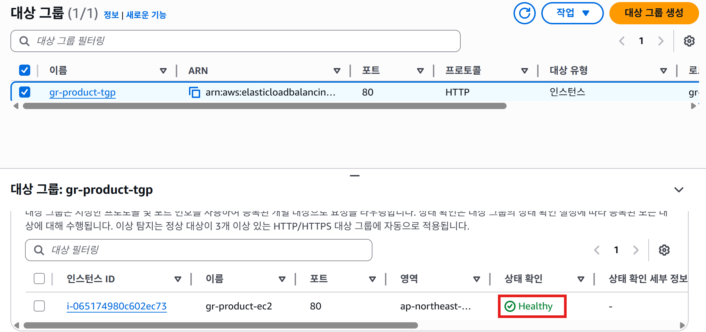

EC2 콘솔 → [대상 그룹] 카테고리에서 생성된 대상 그룹 확인.

- 등록된 대상 (EC2 인스턴스) 확인 가능
- 상태 확인 결과:
    - 성공: **Healthy**
    - 실패: **Unhealthy**

### Step 4. 로드 밸런서 확인

이미지 표시

EC2 콘솔 → [로드 밸런서] 카테고리 → 생성한 로드 밸런서 확인. [리스너 및 규칙] 탭에서 리스너 규칙 확인 가능.

### Step 5. 로드 밸런서를 통해 웹 서버 접근

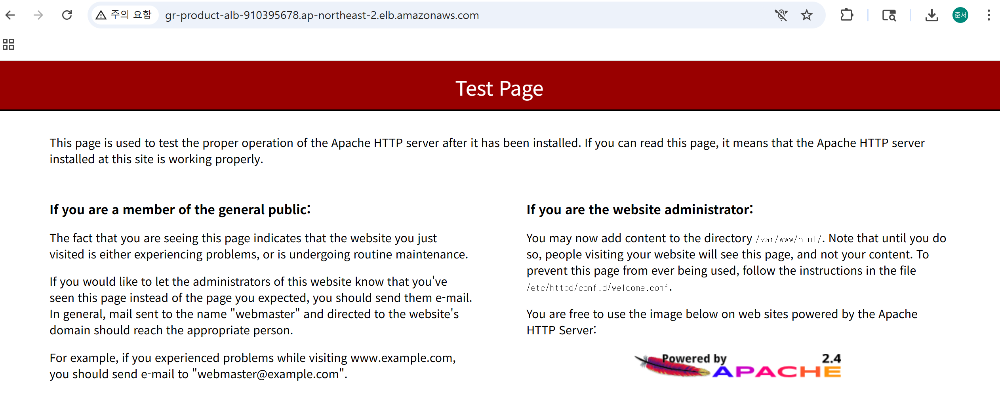

1. ❶ 로드 밸런서의 **DNS 이름** 복사
2. ❷ 브라우저에 입력
3. ❸ 아파치 페이지(Apache Test Page) 표시

EC2 인스턴스에 설정해놓은 아파치 테스트 페이지인 `index.html`이 화면에 표시되는 것으로 로드 밸런서를 통해 성공적으로 웹 서버에 접근했음을 확인할 수 있다.