# Chapter 12. 클라우드 서버 최적화를 위한 백엔드 서비스 파악하기

---

## 12.1 클라우드 서버 최적화, 아마존 EC2 오토스케일링이란?

오토 스케일링은 **스케일업(scale up)**, **스케일아웃(scale out)**, **스케일인(scale in)** 을 구현하는 데 사용되며, 클라우드 서버 최적화에 활용된다.

- **스케일업(Scale Up)**: 서버의 성능을 향상시킬 목적으로 기존 EC2 인스턴스의 사양(CPU, 메모리, 디스크 용량 등)을 업그레이드.
- **스케일아웃(Scale Out)**: 시스템의 성능을 향상시킬 목적으로 같은 사양의 추가 서버를 추가. 시스템 부하 분산과 가용성 향상에 도움.
- **스케일인(Scale In)**: 스케일아웃으로 생성된 서버가 더는 필요 없을 때 서버를 삭제.

오토스케일링은 EC2 인스턴스와 함께 사용되며, 스케일업/아웃/인을 조절해 클라우드 서버를 최적화한다.

### AWS 오토스케일링 vs 아마존 EC2 오토스케일링

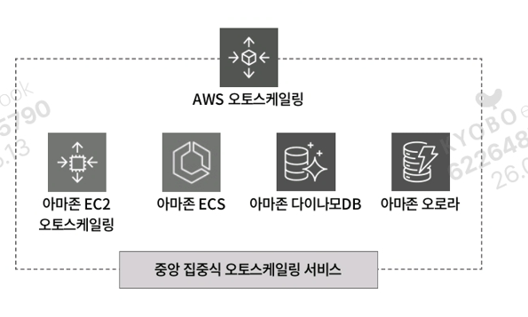

- **AWS 오토스케일링**: 아마존 EC2 오토스케일링을 포함해 ECS, 다이나모DB, 오로라 등 **다양한 서비스에 대한 스케일링 작업**을 수행하는 중앙 집중식 서비스. 일관된 스케일링 전략을 구현, 복잡성을 줄이고 운영을 간소화.
- **아마존 EC2 오토스케일링**: EC2 인스턴스에 특화된 스케일링 서비스.

본 챕터는 EC2 인스턴스의 스케일업/아웃/인에 초점을 맞춰 학습한다.

---

## 12.2 클라우드 서버 최적화 서비스, 아마존 EC2 오토스케일링 살펴보기

아마존 EC2 오토스케일링은 **오토스케일링 그룹**을 생성해 EC2 인스턴스에 대한 스케일업/아웃/인을 구현할 수 있다. 오토스케일링 그룹을 생성하려면 기본적인 EC2 인스턴스의 구성(인스턴스 유형, 보안 그룹, AMI 등)을 설정해야 하며, 이때 사용하는 것이 **시작 템플릿(Launch Template)** 이다.

오토스케일링 그룹 생성 과정:

1. **시작 템플릿**에서 EC2 인스턴스를 구성하는 설정(AMI, 인스턴스 유형, EBS 볼륨, 네트워크 설정 등)을 적용한다.
2. 생성된 시작 템플릿을 바탕으로 **오토스케일링 그룹**을 생성하면, 시작 템플릿의 설정값을 가진 EC2 인스턴스가 생성된다.
3. 오토스케일링 그룹은 **탄력적 로드 밸런서(ELB)** 와 함께 사용될 수 있다.

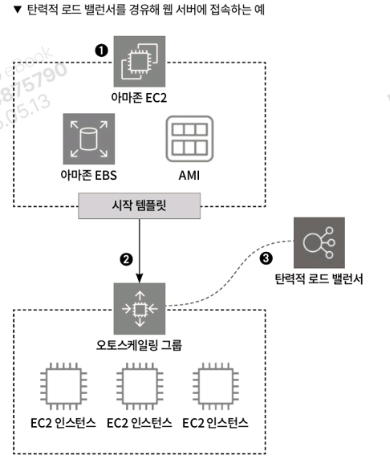

시작 템플릿은 **복수의 버전**을 만들어 관리할 수 있으며, 상황에 맞추어 오토스케일링 그룹에 적용할 수 있다. 이를 통해 스케일업으로 서버 인스턴스의 스펙을 업그레이드할 수 있다.

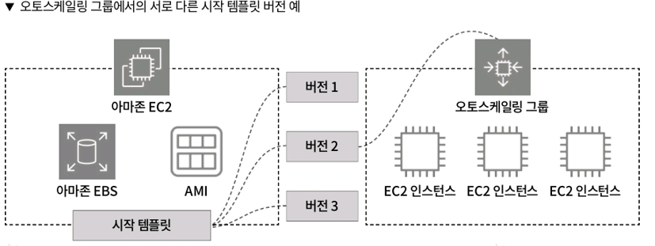

---

### 12.2.1 클라우드 서버 최적화 백엔드 서비스, 오토스케일링 그룹이란?

오토스케일링 그룹은 EC2 인스턴스를 관리하며, 다양한 기능을 제공해 효율적인 운영을 지원한다.

### 오토스케일링 그룹 크기

오토스케일링 그룹에서는 생성하고자 하는 EC2 인스턴스의 용량을 다음 세 가지로 설정한다.

- **원하는 용량(Desired capacity)**: 오토스케일링 그룹을 만들 때 생성할 **초기 EC2 인스턴스 수**.
- **최소 용량(Minimum capacity)**: **최소 EC2 인스턴스 수**. 수동/자동으로 최소 용량보다 작게 만들 수 없다.
- **최대 용량(Maximum capacity)**: **최대 EC2 인스턴스 수**. 수동/자동으로 최대 용량보다 늘릴 수 없다.

**예시**: 원하는 용량 2, 최소 용량 2, 최대 용량 3으로 설정하면

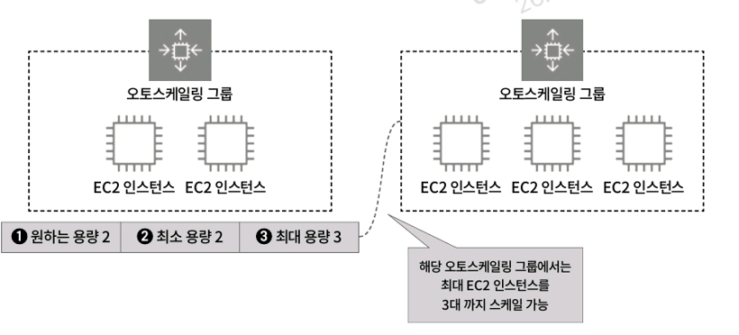

1. 원하는 용량이 2이므로 오토스케일링 그룹 생성 시 **2대의 EC2 인스턴스**가 생성된다.
2. 최소 용량이 2이므로 항상 두 대 이상의 EC2 인스턴스를 유지한다. 인스턴스 한 대 삭제 시 최소 용량 유지를 위해 새 EC2 인스턴스를 생성한다.
3. 최대 용량이 3이므로 수동/자동 어떤 방식으로도 3대를 초과해 생성될 수 없다.

> 💡 단, 용량 설정은 고정이 아니며 생성 이후에도 업데이트 가능하다.
>

### 오토스케일링 그룹과 로드 밸런서

오토스케일링 그룹은 로드 밸런서와 함께 사용 가능하며, **확장성과 가용성을 고려해 함께 사용하는 것을 권장**한다. 사용 방법은 두 가지:

- 로드 밸런서를 개별적으로 생성한 다음 연결
- 오토스케일링 그룹 생성 중에 새 로드 밸런서 생성 및 연결

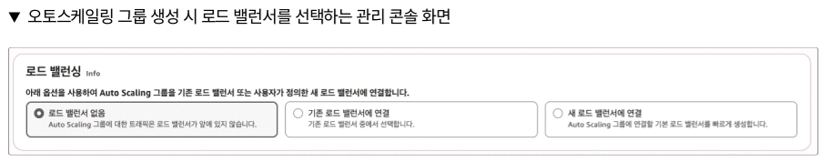

**탄력적 로드 밸런서 상태 확인 켜기 기능**:

- 로드 밸런서만 사용: 상태 확인 실패 시 `unhealthy`를 반환하지만 EC2 인스턴스 교체 작업은 이루어지지 않는다.
- 오토스케일링 그룹 + 로드 밸런서 연결: `unhealthy` 발생 시 해당 EC2 인스턴스를 오토스케일링 그룹에서 **제외시키고 새로운 EC2 인스턴스를 가동**하여 그룹에 추가.

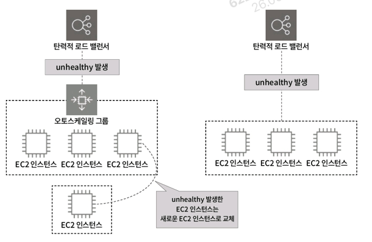

교체되어 그룹에서 빠져나온 EC2 인스턴스는 삭제되지 않고 하나의 EC2 인스턴스로 분류된다. 로드 밸런서 상태 확인은 필수이지만, 오토스케일링 그룹의 상태 확인 옵션은 사용자가 임의로 선택할 수 있다.

### 오토스케일링 그룹 스케일 정책

오토스케일링 그룹에서는 사용자가 용량을 편집해 수동으로 스케일할 수도 있고, 정책을 통해 자동으로 스케일할 수도 있다. 오토 스케일 정책은 크게:

- **동적 크기 조정 정책**
- **예측 크기 조정 정책**

### (1) 동적 크기 조정 정책

세 가지로 나뉜다.

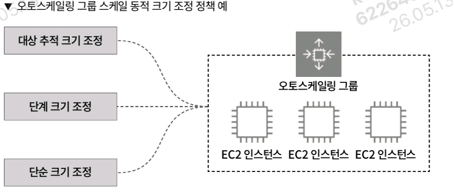

**① 대상 추적 크기 조정**

- 선택한 지표 유형을 기반으로 오토 스케일링 작업을 수행.
- 지표: 평균 CPU 사용률, 평균 네트워크 입력(바이트), 평균 네트워크 출력(바이트), 대상별 ALB 요청 수.
- 예: 평균 CPU 사용률이 70%를 초과하면 EC2 인스턴스 추가.

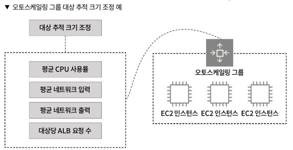

**② 단계 크기 조정**

- **클라우드워치 경보(CloudWatch Alarm)** 를 기반으로 스케일링 실행.
- 지정한 매트릭의 임계값을 초과해 클라우드워치 경보가 발생하면 n개의 EC2 인스턴스를 추가하거나 삭제할 수 있다.

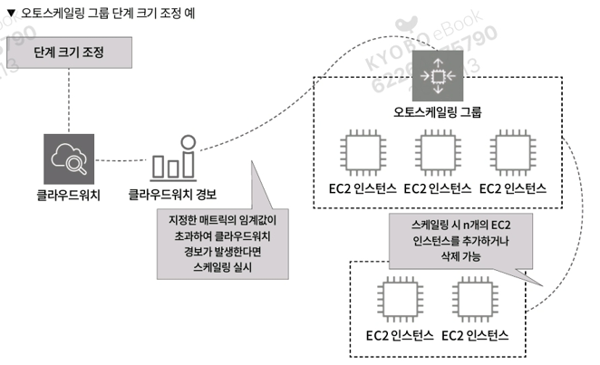

**③ 단순 크기 조정**

- 오토스케일링 그룹 서비스가 처음 만들어졌을 때부터 존재했던 정책.
- 클라우드워치 경보 기반이지만, 단계 크기 조정과 달리 **대기 시간**이 존재한다. 스케일링으로 EC2 생성 후 지정된 대기 시간이 끝날 때까지 스케일링 작업을 중지.
- **현재는 사용을 권장하지 않으며, 대기 시간이 없는 단계 조정 정책을 권장**한다.

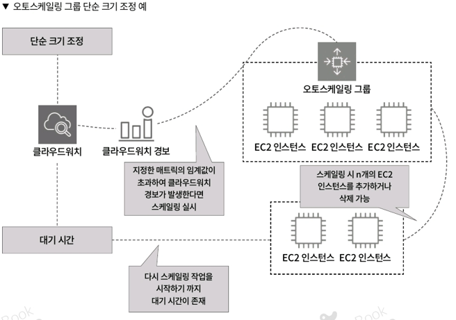

> ⚠️ 트래픽에 빠르게 대응해야 하는 만큼 대기 시간이 존재하는 것은 서비스 제공에 치명적일 수 있다.
>

### (2) 예측 크기 조정 정책

- 머신러닝을 사용해 클라우드워치의 **24시간 기록 데이터**를 기반으로 향후 필요한 수요를 미리 예측.
- 특정 요일 또는 시간에 트래픽이 증가하는 때에 적합한 정책.
- 단, 24시간 기록 기반이므로 예측보다 실제 트래픽이 적거나 부하가 높을 때 대응이 어려울 수 있다.
- **동적 크기 조정 정책과 함께 사용하면 더 최적의 스케일 정책을 구성 가능**.

### (3) 예약된 작업

- 특정 날짜와 시간을 정해 스케일링 작업을 실시.
- 24시간 기록 기반의 예측 크기 조정 정책과 달리, **지정한 날짜와 시간에 스케일링 작업을 실시**한다.
- 급격하게 트래픽이 증가하는 시간대를 알고 있는 경우 유용.
- 매일, 매주, 1시간마다 등 정기적인 반복 설정 가능.

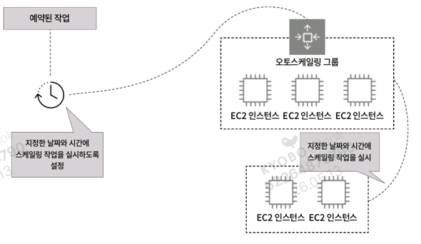

### 오토스케일링 그룹과 AMI

오토스케일링 그룹을 사용하면 한 가지 의문점이 생긴다.

1. 오토스케일링 그룹을 통해 EC2 인스턴스가 생성된다.
2. 각 EC2 인스턴스에 필요한 소프트웨어를 설치한다.
3. 이후 스케일 작업으로 추가 EC2 인스턴스가 생성된다면, **수동으로 설치한 소프트웨어는 새 인스턴스에 적용되지 않는다.**

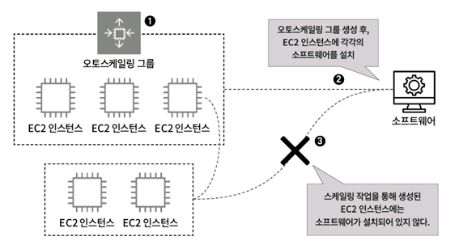

**해결 방법**: AMI를 교체한다.

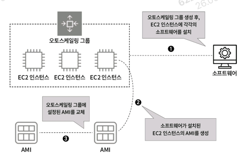

1. 오토스케일링 그룹으로 생성된 EC2 인스턴스에 소프트웨어를 설치한다.
2. 해당 EC2 인스턴스의 **AMI를 생성**한다. (설치한 소프트웨어 및 사용자가 설정한 값이 포함됨)
3. 이 AMI를 기존 오토스케일링 그룹의 AMI와 교체하면, 이후 스케일링으로 생성되는 EC2 인스턴스는 소프트웨어가 포함된 상태로 생성된다.

> 💡 AWS에서는 워드프레스가 설치된 AMI, MySQL이 설치된 AMI 등 미리 소프트웨어가 설치된 AMI를 배포하고 있다.
>

### 오토스케일링 그룹 종료 정책

스케일인 시 어떤 EC2 인스턴스부터 삭제될지를 결정하는 정책.

| 종료 정책 | 작업 | 비고 |
| --- | --- | --- |
| **기본값** | 순서대로 조건에 일치하는 EC2 인스턴스를 찾아내는 종료 정책. ① 가용 영역 내에서 종료 방지 기능이 설정되지 않은 EC2 인스턴스를 찾아 삭제. ② 가장 오래된 시작 템플릿이 있는 인스턴스를 찾아 삭제. ③ 조건에 해당하는 EC2 인스턴스가 여러 대 존재하면 결제 시간이 가장 가까운 EC2 인스턴스를 찾아 삭제. |  |
| **할당 전략** | 인스턴스의 유형(스팟 인스턴스 혹은 온디맨드 인스턴스)의 배포 전략에 맞추는 종료 정책. |  |
| **가장 오래된 시작 템플릿** | 가장 오래된 시작 템플릿을 사용하는 EC2 인스턴스를 삭제. |  |
| **가장 오래된 시작 구성** | 가장 오래된 시작 설정을 가진 EC2 인스턴스를 삭제. | 오래된 시작 설정 = 오래된 버전의 AMI, 인스턴스 유형, 보안 그룹 등 포함 |
| **다음 인스턴스 시간과 가장 가까움** | 결제 시간에 가장 가까운 EC2 인스턴스를 삭제. |  |
| **최신 인스턴스** | 오토스케일링 그룹 내에서 가장 최근 생성된 EC2 인스턴스를 찾아 삭제. |  |
| **가장 오래된 인스턴스** | 오토스케일링 그룹 내에서 생성 시간이 가장 오래된 EC2 인스턴스를 찾아 삭제. |  |

또한 **사용자 지정 종료 정책**을 선택해 임의로 설정할 수도 있다.

---

## 12.3 아마존 EC2 오토스케일링 생성해보기

이번 실습에서는 오토스케일링 그룹을 생성해보며, 어떻게 스케일 작업이 이루어지는지 확인한다.

### 12.3.1 오토스케일링 그룹 생성해보기

오토스케일링 그룹을 생성하는 클라우드포메이션 yml 파일은 다음과 같다.

> **오토스케일링 그룹을 생성하는 yml 파일**
>
> - 파일 이름: `VPC.yml`, `IAM.yml`, `Security_Group.yml`, `Auto_Scaling_Group.yml`
> - 클라우드포메이션 스택 생성 순서: `VPC.yml` → `IAM.yml` → `Security_Group.yml` → `Auto_Scaling_Group.yml`

이번에 구축할 환경:

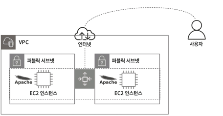

퍼블릭 서브넷에 EC2 인스턴스가 생성되도록 오토스케일링 그룹을 생성한다. 각 EC2 인스턴스에는 아파치가 설치되어 사용자는 EC2 인스턴스 접속 시 아파치 웹페이지가 표시된다.

---

### 02 Security_Group.yml - EC2 보안 그룹 생성

```yaml
# Security_Group.yml
EC2SecurityGroup:
  Type: AWS::EC2::SecurityGroup        # 보안 그룹을 생성
  Properties:
    GroupName: !Sub ${SystemName}-${EnvName}-ec2-sg          # 보안 그룹 이름 지정
    GroupDescription: !Sub ${SystemName}-${EnvName}-ec2-sg   # 보안 그룹 설명
    SecurityGroupIngress:              # ❶ 인바운드 규칙 설정
      - IpProtocol: tcp                # 프로토콜: TCP
        FromPort: 80                   # 시작 포트: 80
        ToPort: 80                     # 종료 포트: 80
        CidrIp: 0.0.0.0/0              # 모든 IP에서 접속 허용
```

❶ 아파치 설치된 EC2 인스턴스에 접속해 아파치 웹페이지 출력 확인 목적으로 **HTTP 80번 포트**를 열어두는 설정.

---

### 03 IAM.yml - IAM Arn 내보내기

```yaml
# IAM.yml
Outputs:
# IAM Profile
  InstanceProfile:                     # ❶ EC2InstanceProfile 자체를 출력
    Value: !Ref EC2InstanceProfile
    Export:
      Name: !Sub ${EnvName}-ec2-role
  InstanceProfileArn:                  # ❷ EC2InstanceProfile의 Arn을 출력
    Value: !GetAtt EC2InstanceProfile.Arn
    Export:
      Name: !Sub ${EnvName}-ec2-role-arn
```

EC2 인스턴스에 IAM 권한을 설정하는 방법은 두 가지:

- ❶ 내보낸 `EC2InstanceProfile`을 EC2 인스턴스에 적용
- ❷ `EC2InstanceProfile`의 Arn을 적용

> 💡 **Arn(Amazon Resource Name)**: 리소스의 이름을 의미하며 해당 리소스의 고유 식별자. `.Arn`으로 리소스의 Arn을 추출할 수 있다.
>

---

### 04 Auto_Scaling_Group.yml - 파라미터 정의

```yaml
# Auto_Scaling_Group.yml
Parameters:
  KeyPairName:                         # ❶ 키 페어 이름
    Description: gr-product-ec2 EC2 Key Pair
    Type: String
    Default: gr-product-ec2-key
  EC2AMI:                              # ❷ EC2 AMI
    Description: gr-product-ec2 EC2 AMI
    Type: String
    Default: ami-02d081c743d676996
  InstanceType:                        # ❸ EC2 인스턴스 유형
    Description: gr-product-ec2 EC2 instance type
    Type: String
    Default: t3.micro                  # ap-northeast-2b는 t2.micro 사용 불가, t3.micro 지정
```

> ⚠️ ap-northeast-2a, ap-northeast-2b 두 가용 영역에 EC2가 생성되는데, **ap-northeast-2b 가용 영역에서는 t2.micro를 사용할 수 없으므로 t3.micro를 지정**한다. 가용 영역마다 사용 가능한 인스턴스 유형이 다르므로 주의.
>

---

### 05 Auto_Scaling_Group.yml - 키 페어 생성

```yaml
# Auto_Scaling_Group.yml
NewKeyPair:
  Type: AWS::EC2::KeyPair
  Properties:
    KeyName: !Ref KeyPairName          # 파라미터에서 정의한 이름으로 키 페어 생성
```

---

### 06 Auto_Scaling_Group.yml - 시작 템플릿 구성

```yaml
# Auto_Scaling_Group.yml
WebLaunchTemplate:
  Type: AWS::EC2::LaunchTemplate       # ❶ 시작 템플릿 생성
  Properties:                          # ❷ 시작 템플릿 속성
    LaunchTemplateName: !Sub ${SystemName}-${EnvName}-AppLaunchConfiguration
    LaunchTemplateData:
      IamInstanceProfile:              # IAM 역할 설정
        Arn:
          Fn::ImportValue: !Sub ${EnvName}-ec2-role-arn
      BlockDeviceMappings:             # 볼륨 설정
        - DeviceName: /dev/sda1
          Ebs:
            VolumeType: gp3
            VolumeSize: 100
            DeleteOnTermination: true
            Encrypted: true
      NetworkInterfaces:               # 네트워크 설정
        - AssociatePublicIpAddress: true
          DeviceIndex: 0
          Groups:
            - Fn::ImportValue: !Sub ${EnvName}-ec2-sg
      ImageId: !Ref EC2AMI             # 사용할 AMI 지정
      InstanceType: !Ref InstanceType  # 인스턴스 유형 지정
      KeyName: !Ref KeyPairName        # 키 페어 지정
```

❶ 타입에 `AWS::EC2::LaunchTemplate`을 입력해 시작 템플릿 생성.
❷ 시작 템플릿 속성에는 EC2 인스턴스에서 사용할 IAM 역할, 볼륨 크기, 네트워크, 보안 그룹 등의 설정을 다룬다.

---

### 07 Auto_Scaling_Group.yml - 사용자 데이터로 아파치 설치

```yaml
# Auto_Scaling_Group.yml
UserData: !Base64 |
  #!/bin/bash
  # Use this for your user data (script from top to bottom)
  # install httpd (Linux 2 version)
  sudo yum update -y                                                  # 시스템 업데이트
  sudo yum install httpd-2.4.51 -y                                    # 아파치 설치
  sudo systemctl start httpd                                          # 아파치 시작
  sudo systemctl enable httpd                                         # 부팅 시 자동 실행
  sudo httpd -v                                                       # 버전 확인
  sudo cp /usr/share/httpd/noindex/index.html /var/www/html/index.html # 기본 페이지 복사
```

EC2 인스턴스 생성 시 아파치가 설치되도록 사용자 데이터를 활용한다. 이 설정으로 앞으로 스케일 작업에 의해 EC2 인스턴스가 생성될 때도 아파치가 설치된 EC2 인스턴스가 생성된다.

---

### 08 Auto_Scaling_Group.yml - 오토스케일링 그룹 생성

```yaml
# Auto_Scaling_Group.yml
WebAutoScalingGroup:
  Type: AWS::AutoScaling::AutoScalingGroup    # ❶ 오토스케일링 그룹 타입
  Properties:
    AutoScalingGroupName: !Sub ${SystemName}-${EnvName}-asg   # ❷ 오토스케일링 그룹 이름
    LaunchTemplate:                           # ❸ 사용할 시작 템플릿 지정
      LaunchTemplateId: !Ref WebLaunchTemplate
      Version: !GetAtt WebLaunchTemplate.LatestVersionNumber  # 최신 버전 사용
    MetricsCollection:                        # ❹ 클라우드워치 집계 설정
      - Granularity: 1Minute                  # 1분 간격으로 데이터 전송
        Metrics:
          - GroupMinSize                      # 최소 용량 집계
          - GroupMaxSize                      # 최대 용량 집계
    HealthCheckType: EC2                      # ❺ 상태 확인 타입 (EC2 또는 로드 밸런서)
    MaxSize: '3'                              # ❻ 최대 용량
    MinSize: '2'                              # 최소 용량
    DesiredCapacity: '2'                      # 원하는 용량
    HealthCheckGracePeriod: '300'             # 상태 확인 유예 시간(초)
    VPCZoneIdentifier:                        # ❼ EC2가 생성될 서브넷 지정
      - "Fn::ImportValue": !Sub ${EnvName}-public-subnet-1a
      - "Fn::ImportValue": !Sub ${EnvName}-public-subnet-1b
    Tags:                                     # ❽ 인스턴스에 추가할 태그
      - Key: Name
        Value: !Sub ${SystemName}-${EnvName}-ec2
        PropagateAtLaunch: true
      - Key: Env
        Value: !Sub ${EnvName}
        PropagateAtLaunch: true
```

**주요 설정 설명**:

- ❶ 오토스케일링 그룹을 생성할 타입 지정.
- ❷ 오토스케일링 그룹 이름 지정.
- ❸ 사용할 시작 템플릿 지정. 최신 버전 사용.
- ❹ **MetricsCollection**: 오토스케일링 그룹에서 집계된 데이터를 클라우드워치로 보낼 설정. `Granularity`로 클라우드워치로 보낼 빈도(1분 간격) 설정. `Metrics`에서는 최소/최대 용량을 집계 데이터로 전송.
- ❺ **HealthCheckType**: 상태 확인 진행 서비스. 기본적으로 EC2 인스턴스 선택, 로드 밸런서가 있다면 로드 밸런서 선택 가능.
- ❻ **용량 설정**: 원하는 용량, 최소 용량, 최대 용량 세 가지.
- ❼ EC2 인스턴스가 생성될 서브넷 지정.
- ❽ 마지막으로 생성된 EC2 인스턴스에 추가할 태그 지정.

---

### 12.3.2 UI로 불러와 오토스케일링 그룹 생성하기

오토스케일링 그룹을 생성하고, UI 기반에서 스케일 작업이 이루어지는지 확인한다.

### 01 클라우드포메이션 스택 생성

스택 이름을 입력하고 파라미터에 입력된 기본값을 유지하며 클라우드포메이션 스택을 생성한다.

- 스택 이름: `gr-asg`
- EC2AMI: `ami-02d081c743d676996`
- EnvName: `product`
- InstanceType: `t3.micro`
- KeyPairName: `gr-product-ec2-key`
- SystemName: `gr`

### 02 EC2 콘솔에서 시작 템플릿 확인

❶ EC2 콘솔 화면에서 [시작 템플릿] 카테고리 선택 → ❷ 생성된 시작 템플릿 확인 → ❸ 작업 메뉴에서 새로운 버전 생성 등 다양한 작업 수행 가능.

### 03 EC2 인스턴스 확인

❶ [인스턴스] 카테고리 클릭 → ❷ 두 대의 EC2 인스턴스가 ap-northeast-2a, ap-northeast-2b에 생성된 것 확인 → ❸ EC2 인스턴스의 퍼블릭 DNS 혹은 퍼블릭 IP를 브라우저에 입력하면 → ❹ 아파치 페이지 표시 확인.

### 04 오토스케일링 그룹 확인

❶ EC2 콘솔에서 [Auto Scaling 그룹] 선택 → ❷ 생성된 오토스케일링 그룹과 시작 템플릿, 버전, 인스턴스, 용량, 가용 영역 등을 확인.

### 05 오토스케일링 그룹 세부 정보 확인

오토스케일링 그룹 클릭 → ❶ [세부 정보] 탭에서 생성된 EC2 인스턴스 정보, 그룹 정책 등 확인. ❷ [편집]을 클릭하여 그룹 정책 생성, 시작 템플릿 버전 변경, EC2 인스턴스 용량 변경 가능.

### 06 예약된 작업 생성하기

스케일 작업 테스트를 위해 ❶ [Automatic scaling] 카테고리에서 ❷ [예약된 작업 생성] 클릭.

### 07 예약된 작업 설정

- ❶ **이름**: `test-scaling` 입력.
- ❷ **용량 설정**: 현재 오토스케일링 그룹은 원하는 용량 2, 최소 용량 2, 최대 용량 3으로 설정되어 있다. 예약된 작업에도 동일한 값을 설정하면 스케일링 작업이 실시되지 않으므로, EC2 인스턴스 한 대를 추가하려면 **최소 용량을 2 → 3으로 늘려야 한다**.
    - 원하는 용량 → 3
    - 최소 → 3
    - 최대 → 4 (3 유지도 가능, 4로 올리는 것도 가능)
- ❸ **반복**: 한 번만 실행되도록 설정.
- ❹ **표준 시간대**: `Asia/Seoul` 기준.
- ❺ **시작 시간**: 시작 날짜와 시간 지정.

> 💡 원하는 용량은 오토스케일링 그룹 생성 시 초기 EC2 인스턴스 수를 설정하는 값이므로 수정할 필요는 없지만, 최소 용량과 대수를 맞추고 싶다면 원하는 용량도 함께 수정한다.
>

### 08 예약된 작업을 통한 EC2 스케일 실시

❶ 지정한 시간이 되면 스케일 작업 실시 → ❷ EC2 인스턴스 한 대 추가 확인 → ❸ 오토스케일링 그룹의 용량 변경 확인.

결과:

- 예약된 작업 목록에 `test-scaling` 등록 확인.
- EC2 인스턴스 3대 실행 중 (`gr-product-ec2` × 3).
- 오토스케일링 그룹 용량: 원하는 용량 3, 최소 3, 최대 4.

---

## 정리

트래픽이 증가하는 시간대를 알고 있다면 **예약된 작업**을 사용해 EC2 인스턴스 대수를 추가하고, 해당 시간대 이후에는 원래의 용량으로 되돌리는 예약 작업을 통해 유연하게 사용자에게 서비스를 제공할 수 있다.

### 핵심 요약

| 구분 | 내용 |
| --- | --- |
| **오토스케일링** | 스케일업/아웃/인을 통한 클라우드 서버 최적화 |
| **시작 템플릿** | EC2 인스턴스 구성(AMI, 유형, EBS, 네트워크 등) 설정 |
| **오토스케일링 그룹** | EC2 인스턴스 관리 (원하는/최소/최대 용량) |
| **스케일 정책** | 동적(대상 추적/단계/단순), 예측, 예약된 작업 |
| **AMI 관리** | 소프트웨어 포함 AMI 생성 후 교체로 일관성 유지 |
| **종료 정책** | 스케일인 시 어떤 인스턴스부터 삭제할지 결정 |