# 17장. 서버 기반 워드프레스 구축해보기

## 17.1 서버 기반 워드프레스 구성도 이해하기

- 보안성 : 프라이빗 서브넷을 활용한 데이터 보호
- 성능 : ALB를 통한 부하 분산
- 확장성 : 트래픽 증가에 대비한 구조

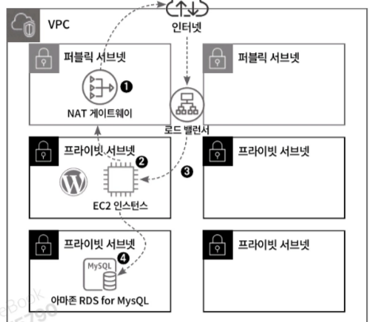

1. 퍼브릭 서브넷에 NAT 게이트웨이를 배치해 관리자가 SSM을 통해 EC2 인스턴스로 접속할 수 있게 함
2. EC2 인스턴스는 프라이빗 서브넷에 배치해 관리자 이외에는 접속 불가능
3. 사용자는 퍼블릭 서브넷에 생성된 로드 밸런서를 이용해 워드프레스에 접근
4. RDS가 생성된 프라이빗 서브넷에는 NAT 게이트웨이, 인터넷 게이트웨이로 통하는 경로가 없고 오직 EC2 인스턴스와만 상호작용 가능, 외부에서 접근 불가능

### 서버 기반 워드프레스 구축 순서

1. 클라우드포메이션으로 리소스 생성
2. EC2 인스턴스와 RDS for MySQL 연동
3. EC2 인스턴스에서 워드프레스 구성
4. 워드프레스 접속

---

## 17.2 클라우드포메이션으로 리소스 생성하기

- 클라우드포메이션 스택 생성 순서

```bash
VPC.yml -> IAM.yml -> Security_Group.yml -> EC2.yml -> ALB.yml -> RDS.yml
```

- RDS.yml 에서 사용자 암호 입력하기
- MySQL 버전 오류

  기존 코드의 8.0.35로 생성을 시도하면 오류가 발생하여 yml 코드에서
  `EngineVersion: 8.0.35` → `EngineVersion: 8.0.46` 로 수정


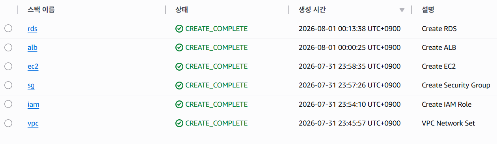

## 17.3 EC2 인스턴스와 RDS for MySQL 연동하기

1. 생성한 EC2 인스턴스에서 세션 매니저를 사용해 접속하기
2. EC2 인스턴스에서 MySQL 설치하기

    ```bash
    sudo yum install -y mysql
    ```

3. EC2 인스턴스에서 RDS for MySQL로 접근하기 위해 생성한 RDS 의 엔드포인트 확인

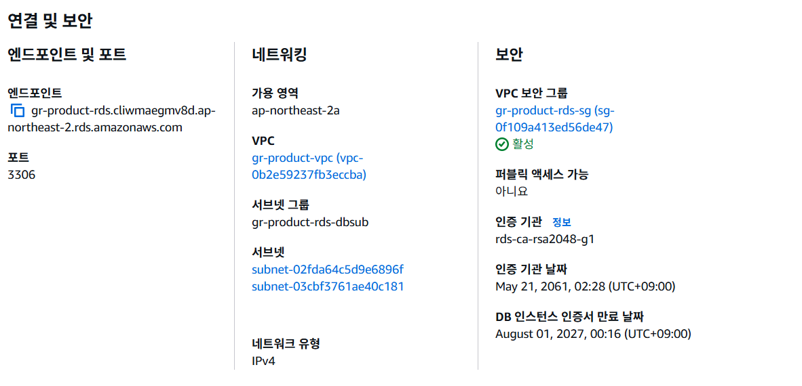

1. EC2 인스턴스에서 RDS로 접속 시도

    ```bash
    export MYSQL_HOST=gr-product-rds.cliwmaegmv8d.ap-northeast-2.rds.amazonaws.com
    mysql --user=admin --password=데이터베이스 사용자 암호 wordpress
    ```

   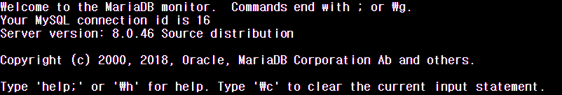


---

## 17.4 EC2 인스턴스에서 워드프레스 구성하기

1. EC2 인스턴스에서 Apache 설치 후 샘플 이미지를 아파치 웹 경로인 `/var/www/html`에 복사

    ```bash
    sudo yum install -y httpd
    sudo service httpd start
    sudo cp /usr/share/httpd/noindex/index.html /var/www/html/index.html
    ```

2. 로드밸런서의 DNS를 이용해 브라우저에 접근하면 아파치 샘플 페이지 표시 확인 가능
    1. https가 아닌 http로 접속해야함!

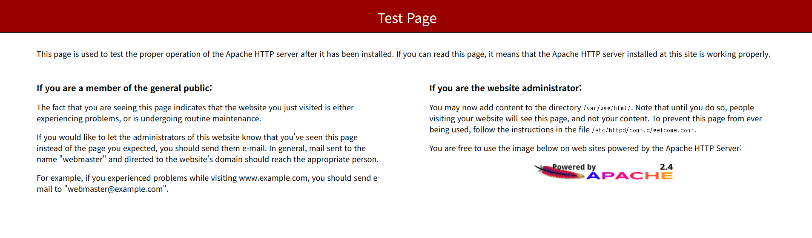

1. 워드프레스 소프트웨어 다운로드

    ```bash
    sudo wget https://wordpress.org/latest.tar.gz
    sudo tar -xzf latest.tar.gz
    cd wordpress
    
    sudo cp wp-config-sample.php wp-config.php
    ```

2. 워드프레스의 구성 정보 변경. wp-config.php 파일을 편집해 워드프레스의 구성 정보 변경

    ```bash
    sudo vi wp-config.php
    ```

    - php 파일 초기 상태

   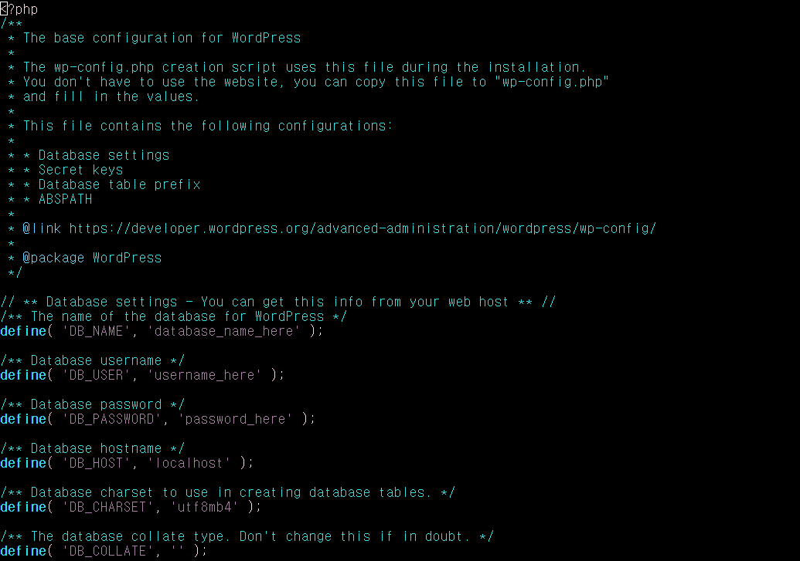


→ https://api.wordpress.org/secret-key/1.1/salt/

위 주소로 접속하여 보이는 값들을 define ~~ 절에 덮어써서 보안키 설정

define절의 DB 이름, 유저 이름, 비밀번호, 호스트 주소 등을 알맞게 설정

1. 워드프레스에 필요한 애플리케이션 종속성 설치

    ```bash
    sudo amazon-linux-extras install -y lamp-mariadb10.2-php7.2 php7.2
    cd ..
    sudo cp -r wordpress/* /var/www/html/
    cd /var/www/html
    sudo rm index.html
    sudo service httpd restart
    ```


---

## 17.5 밸런서의 DNS를 이용해 워드프레스로 접근하기

1. 워드프레스의 정보 입력
- php 버전 문제

  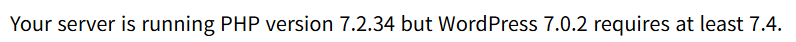

  DNS 서버로 접속했더니 이런 문구가 떠서 php 8.2 버전을 설치한 후 재시작

  https://docs.aws.amazon.com/linux/al2/ug/php.html 참고


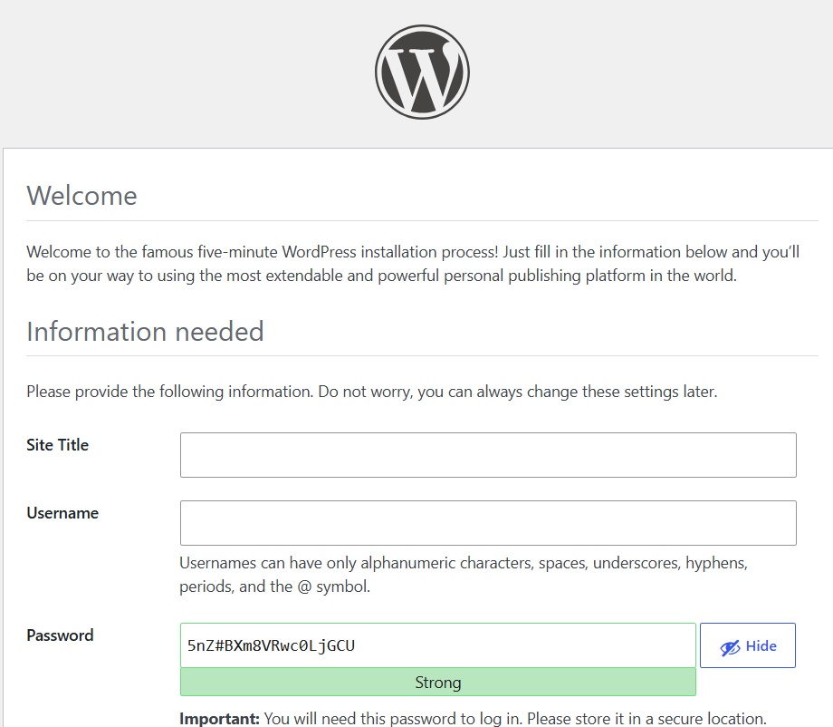

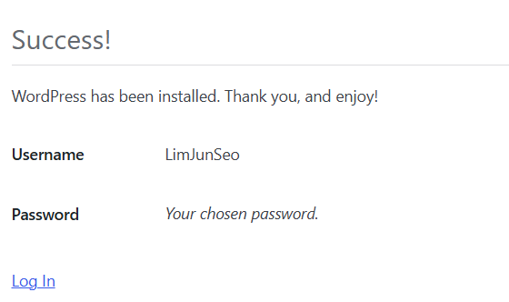

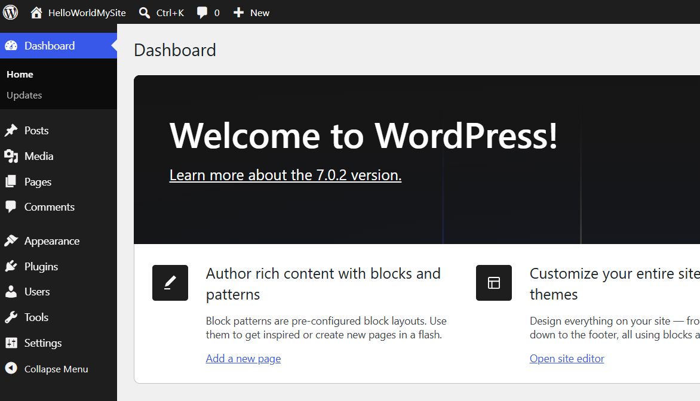

---

## 17.6 워드프레스에서 추가적으로 고려할 수 있는 사항들

### 17.6.1 도메인과 고속 콘텐츠 제공

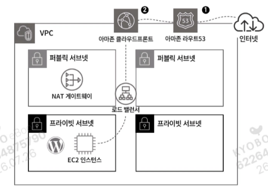

1. 사용자가 알아보기 쉽게 도메인으로 전환할 필요가 있으므로 아마존 라우트53 이용
2. 해외사용자가 있다면 고속 콘텐츠를 제공할 필요가 있기 때문에 아마존 클라우드프론트 이용

### 17.6.2 HTTPS와 로그 설정

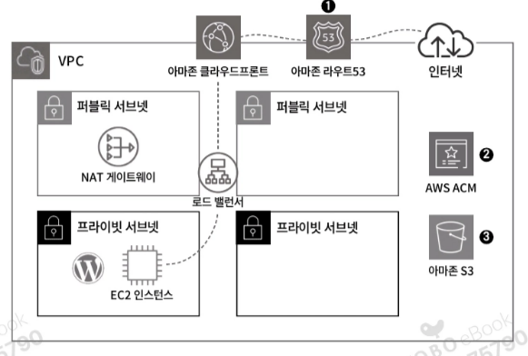

1. HTTPS를 사용하려면 라우트53에 도메인 등록
2. AWS ACM을 이용해 인증서를 발급받음 → HTTPS 접근 가능
3. 로드 밸런서에 액세스로그를 설정해 로드 밸런서를 통해 접근하는 모든 사용자의 액세스 정보를 아마존 S3에 보관해 관리

### 17.6.3 트래픽 분산과 오토 스케일 설정

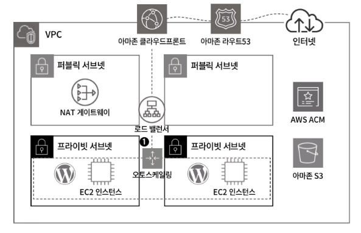

1. 오토스케일링을 생성해 각 AZ에 EC2 인스턴스에 적절하게 부하 분산을 하도록 실시

### 17.6.4 데이터베이스 고가용성

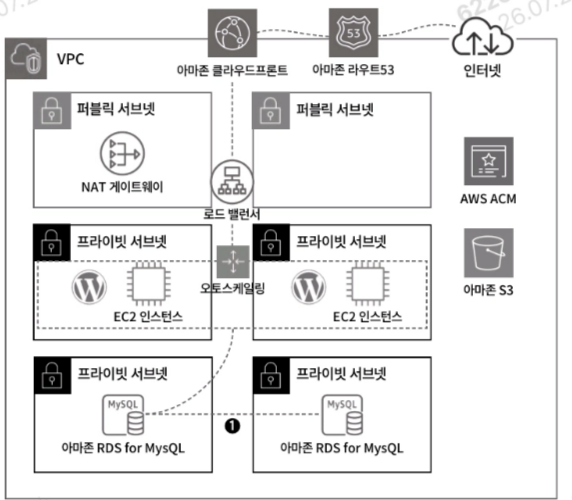

1. 데이터베이스 고갸용성을 위해 RDS for MySQL을 단일 AZ에서 다중 AZ로 변경

---