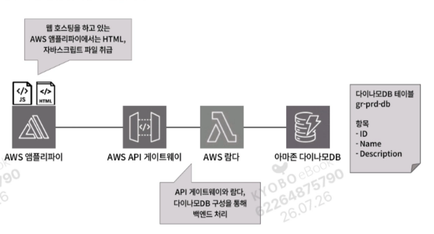
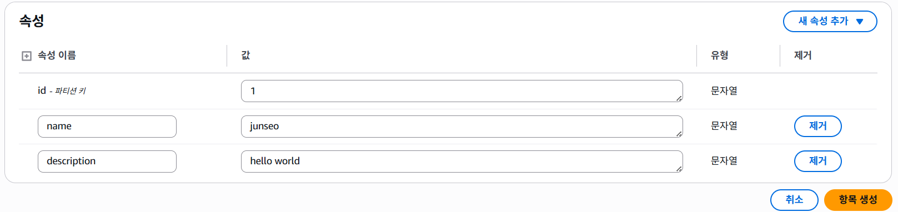
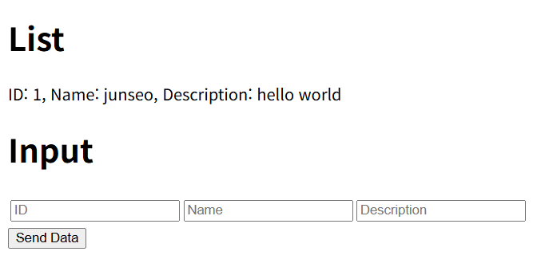
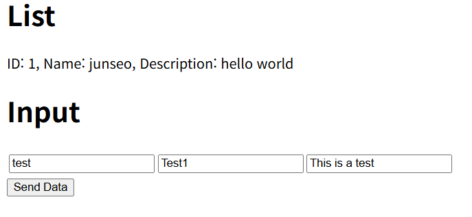
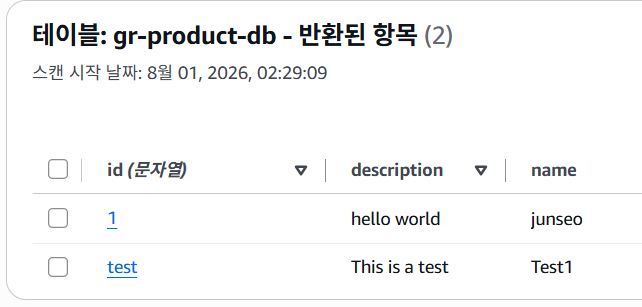

# 18장. 서버리스 기반 웹사이트 구축해보기

## 18.1 서버리스 기반 웹사이트 구성도 이해하기



- AWS 앰플리파이 : HTML과 JS 파일을 이용해 프론트 처리
- API 게이트웨이와 람다, 다이나모DB를 이용해 백엔드 처리
- 다이나모DB에 입력된 데이터를 AWS 앰플리파이 웹 호스팅을 통해 사용자에게 출력되고, 사용자가 입력한 데이터 값은 다이나모DB로 저장되는 기능 제공하는 웹사이트 만들기

---

## 18.2 클라우드포메이션으로 리소스 생성하기

- 클라우드포메이션 스택 생성 순서

```bash
DynamoDB.yml -> APIGateway.yml
```

1. 클라우드포메이션 스택 생성
2. 다이나모DB 테이블 생성

    ```yaml
    MyDynamoDBTable:
      Type: AWS::DynamoDB::Table # 다이나모DB 생성
      Properties: # 속성에 파티션키와 기본키를 id로 지정
        TableName: !Sub ${SystemName}-${EnvName}-db
    
        AttributeDefinitions:
          - AttributeName: id
            AttributeType: S
    
        KeySchema:
          - AttributeName: id
            KeyType: HASH
    
        BillingMode: PAY_PER_REQUEST
    ```

3. 데이터 조회용 Lambda 함수 생성

    ```yaml
    GetDataLambdaFunction:
      Type: AWS::Lambda::Function # 람다 생성
      Properties: # 지정한 테이블로 접근해 항목에 response에 저장하고 반환
        FunctionName: !Sub ${SystemName}-${EnvName}-GetData
    
        Code:
          ZipFile: |
            import boto3
    
            dynamodb = boto3.resource('dynamodb')
            table = dynamodb.Table('gr-product-db')
    
            def lambda_handler(event, context):
                response = table.scan()
                return response['Items']
    ```

4. 데이터 입력용 Lambda 함수 생성

    ```yaml
    InputDataLambdaFunction:
      Type: AWS::Lambda::Function # 람다 생성
      Properties: # 사용자에게 입력받은 값을 다이나모DB 테이블에 배포하늰 코드
        FunctionName: !Sub ${SystemName}-${EnvName}-InputData
    
        Code:
          ZipFile: |
            import boto3
            import json
    
            dynamodb = boto3.resource('dynamodb')
            table = dynamodb.Table('gr-product-db')
    
            def lambda_handler(event, context):
                inserted_data = {
                    'id': event['id'],
                    'name': event['name'],
                    'description': event['description']
                }
    
                table.put_item(Item=inserted_data)
    
                return {
                    'statusCode': 200,
                    'body': json.dumps(inserted_data)
                }
    ```

5. Lambda 의 DynamoDB 접근 권한 설정

    ```yaml
    ManagedPolicyArns: # 필요한 권한 : AmazonDynamoDBFullAccess와 AWSLambdaDynamoDBExecution
      - arn:aws:iam::aws:policy/AmazonDynamoDBFullAccess
      - arn:aws:iam::aws:policy/service-role/AWSLambdaDynamoDBExecutionRole
    ```

6. API 게이트웨이 생성

    ```yaml
    ApiGatewayRestApi: 
      Type: AWS::ApiGateway::RestApi # 웹사이트의 요청을 받아 람다 함수로 라우팅할 API 게이트웨이 생성
      Properties:
        Name: !Sub ${SystemName}-${EnvName}-api
    
        EndpointConfiguration:
          Types: # API 엔드포인트 유형은 지역으로 지정
            - REGIONAL
    ```

7. API 게이트웨이 메서드 생성

    ```yaml
    ApiGatewayGETMethod:
      Type: AWS::ApiGateway::Method # 웹사이트에서 요청을 받았을 때 생성한 람다 함수로 라우팅할 메서드 생성
      Properties:
        AuthorizationType: NONE
        HttpMethod: GET # GET 메서드 유형 생성
    
        ResourceId:
          Fn::GetAtt:
            - ApiGatewayRestApi
            - RootResourceId
    
        RestApiId:
          Ref: ApiGatewayRestApi
    
        Integration: # Integration 옵션을 지정해 람다와 API 게이트웨이 통합
          Type: AWS
          IntegrationHttpMethod: POST
          Uri: Lambda 함수 호출 URI
    ```

8. CORS 활성화 메서드 생성 → 오리진 간 리소스 공유

    ```yaml
    IntegrationResponses:
      - StatusCode: 200
        ResponseParameters:
        // 생략 //
          method.response.header.Access-Control-Allow-Origin: true
          method.response.header.Access-Control-Allow-Headers: true
          method.response.header.Access-Control-Allow-Methods: true
    ```

9. API 배포

    ```yaml
    ApiGatewayDeployment:
      Type: AWS::ApiGateway::Deployment # API 배포
      Properties:
        RestApiId: !Ref ApiGatewayRestApi
        StageName: !Sub ${SystemName}-${EnvName}-stage
    
      DependsOn: # DependsOn 옵션을 지정해 메서드 생성 후 배포 진행
        - ApiGatewayGETMethod
        - ApiGatewayPOSTMethod
        - ApiGatewayOptionsMethod
    ```


---

## 18.3 데이터를 관리하는 다이나모DB 테이블 항목 생성하기

1. 클라우드포메이션 스택 생성
2. 다이나모DB 테이블의 항목 생성 (다이나모DB 콘솔 화면 → 작업 → 항목 탐색 → 항목 생성)
3. id를 파티션 키, 추가 속성으로 name과 description 설정한 뒤 항목 생성

   


---

## 18.4 웹사이트를 호스팅하는 AWS 앰플리파이 생성하기

API 게이트웨이 → 스테이지 → URL 호출에서 URL 확인 가능

1. index.js에 API 게이트웨이 URL 입력. Send DataToLambda() 함수와 getDataToLambda() 함수에 API 게이트웨이 URL 입력

    ```jsx
    // send data from s3 -> lambda(dynamoDB)
    async function sendDataToLambda() {
        try {
            const htmlid = document.getElementById('id').value;
            const htmlname = document.getElementById('name').value;
            const htmldescription = document.getElementById('description').value;
    
            const dataToSend = {
                id: htmlid,
                name: htmlname,
                description: htmldescription
            };
    
            const response = await axios.post('API Gateway URL 입력', dataToSend);
            console.log('Response from Lambda:', response.data);
    
        } catch (error) {
            console.error('Error sending data:', error);
        }
    }
    
    // get data from lambda(dynamoDB)
    async function getDataToLambda() {
        try {
            const response = await axios.get('API Gateway URL 입력');
    
            const getData = response.data;
    
            const listContainer = document.getElementById('responseData');
    
            getData.forEach(item => {
            const listItem = document.createElement('p');
            listItem.textContent = `ID: ${item.id}, Name: ${item.name}, Description: ${item.description}`;
            listContainer.appendChild(listItem);
        });
        } catch (error) {
            console.error('Error reading data:', error);
        }
    }
    getDataToLambda();
    ```

2. AWS 앰플리파이 콘솔 화면으로 진입하여 앱 배포 클릭
3. AWS 앰플리파이 배포 진행 → Git 없이 배포 → 다음 → 앱 이름 설정 → 드래그앤 드롭 업로드 방식 → 저장 및 배포
4. 배포한 웹 호스팅 사이트로 접근

   

   이후 정보를 입력하여 데이터를 보내면

   

   dynamoDB에 데이터가 추가된 것을 확인할 수 있음


