# 2. AWS를 잘 쓰려면 알아야 하는 네트워크 지식

## 2.1 네트워크 동작 구조와 원리 파악하기

### **2.1.1 네트워크란 무엇인가?**

네트워크란, 두 대 이상의 컴퓨터가 연결되어 통신할 수 있는 형태를 의미한다. 서로 데이터 통신을 가능하게 하기 위해 다양한 프로토콜과 기술을 사용한다.

---

### **2.1.2 통신 규약, 프로토콜**

프로토콜이란, 컴퓨터에서 데이터를 교환하기 위해 정해진 순서나 규약, 신호의 전기적 규칙, 통신에서의 송수신 순서 등을 정한 규칙이다.

- 자주 사용되는 통신 프로토콜

    | 이름 | 용도 |
    | --- | --- |
    | IP (Internet Protocol) | 인터넷에서 데이터를 주고받는 프로토콜 |
    | FTP (File Transfer Protocol) | 파일 전송용 프로토콜 |
    | SMTP (Simple Mail Transfer Protocol) | 이메일을 주고받는 데 사용되는 프로토콜 |
    | HTTP (Hypertext Transfer Protocol) | 데이터를 주고받기 위해 사용되는 프로토콜 |
    | TCP (Transmission Control Protocol) | 서버와 클라이언트 간에 데이터를 안정적으로 전송하는 연결형 프로토콜, 신뢰성 중시 |
    | UDP (User Datagram Protocol) | 신속한 데이터 전송용 비연결형 프로토콜, 속도 중시 |
    | DHCP (Dynamic Host Configuration Protocol) | IP, 서버, 게이트웨이 주소 할당 프로토콜 |
    | ARP (Address Resolution Protocol) | IP 주소 → MAC 주소로 대응하는 프로토콜 |
    | RARP (Reverse Address Resolution Protocol) | MAC 주소 → IP 주소로 변환하는 프로토콜 |
    | NTP (Network Time Protocol) | 네트워크로 연결된 장치들이 같은 시간을 유지하는 데 사용되는 프로토콜 |

---

### **2.1.3 IP**

IP란, 인터넷에 연결된 장치를 식별할 수 있도록 각각에 부여된 고유 주소이다.

**IPv4와 IPv6**

IPv4는 32비트 주소로 약 43억 개의 IP 주소를 제공한다. 인터넷 사용자 수가 증가하면서 43억 개의 주소가 고갈될 위기에 처하자 128비트로 340간 개의 IP 주소를 제공할 수 있는 IPv6가 제안되었지만, 현재 대부분의 웹사이트가 아직은 IPv4를 주로 사용하고 있어서 기존의 인프라와 호환성 문제 등이 아직 많다.

AWS에서도 IPv4와 IPv6를 모두 지원하지만 아직 주로 IPv4 가 주를 이룬다.

**IP 주소 구조 살펴보기**
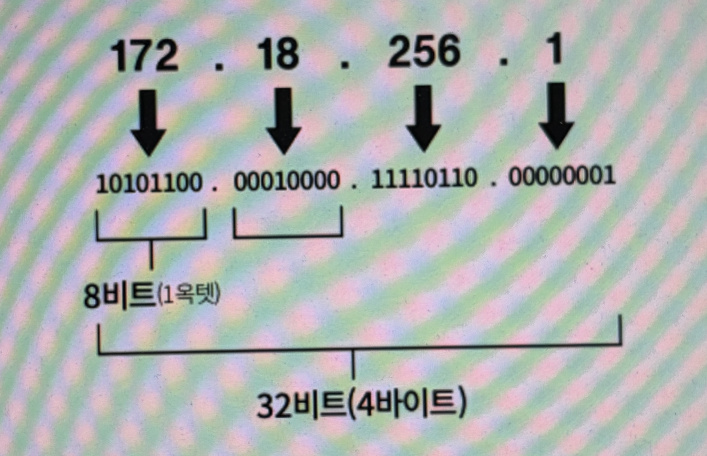

우리가 보는 IP주소는 사람이 이해하고 기억하기 쉽도록 10진수로 변환되어 사용되고 있지만, 이진수 32자리로 구성돼있다. 일반적으로 4개의 숫자 사이에 마침표로 구분해서 표시하며, 이 4개의 숫자는 각각 8비트씩 4 그룹으로 나누어진 것으로 이렇게 8개 비트가 모인 것을 옥텟 이라고 한다.

---

### 2.1.4 IP 주소 체계

IP 주소 체계에서는 네트워크 주소와 브로드캐스트 주소가 존재하며, 이 주소들은 사용할 수 없는 주소들이다.

- 네트워크 주소 : 해당 네트워크의 첫 번째 주소로 네트워크 전체 대역대를 의미한다. 예를 들어 192.168.1.0은 네트워크의 첫 번째 주소이다.
- 브로드캐스트 주소는 해당 네트워크의 마지막 주소를 나타내며, 이 주소는 해당 네트워크 상의 모든 장치에게 데이터를 전송하는 데 사용되는 주소이다. 예를 들어 192.168.1.255는 브로드캐스트 주소이다.

**IP의 종류**

IP 주소는 공인 IP 주소와 사설 IP 주소로 나누어지는데, 공인 IP 주소는 전 세계에서 유일한 주소이다. 사설 IP 주소는 IPv4 주소의 부족으로 공인 IP를 내부 사설 IP 주소로 바꿔서 사용한다. 사설 IP 주소는 비공개적인 네트워크에서 사용되며, 개인적인 네트워크나 회사 내부 네트워크에서 사용된다.

**네트워크 규모로 나눈 IP 클래스 이해하기**
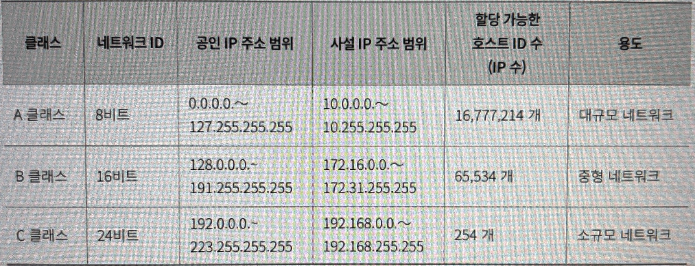

IP 주소는 규모에 따라 A~E 클래스로 나누어지는데, 보통 A~C 클래스까지 사용한다. D와 E 클래스는 멀티캐스크 등 특수 용도로 사용된다.

**클래스와 네트워크 ID와 호스트 ID 관계**

클래스에서 네트워크 ID는 특정 네트워크를 식별하는 데 사용되는 부분이다. 예를 들어 회사에서 C 클래스의 192.168.1.0 네트워크 주소를 할당했다면 이 네트워크를 식별하는 네트워크 ID는 192.168.1.0 이다. 호스트 ID는 네트워크 내에서 특정한 컴퓨터를 식별하는 데 사용된다.

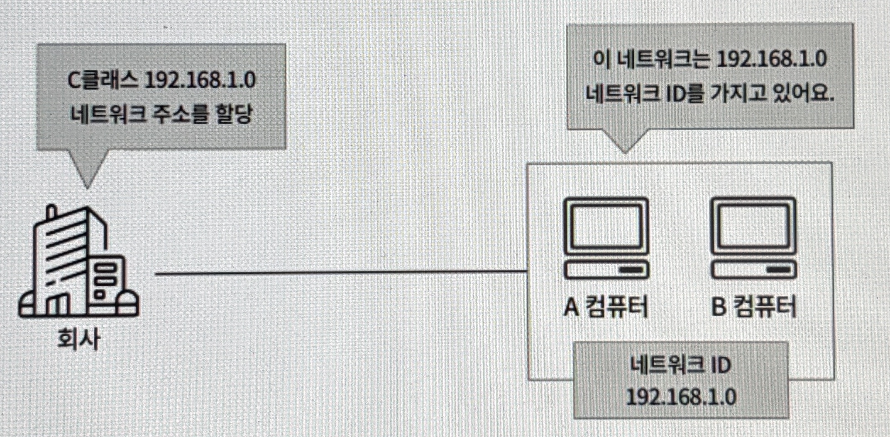

예를 들어 네트워크 주소가 192.168.1.0 이라면, 네트워크 주소와 브로드캐스트 주소를 제외하고 192.168.1.1 ~ 192.168.1.254 까지의 IP 주소를 호스트에 할당할 수 있다. A 컴퓨터에는 192.168.1.1, B 컴퓨터에는 192.168.1.2 주소를 할당해서 네트워크 내에서 각 컴퓨터를 식별할 때 사용할 수 있다.

---

### 2.1.5 서브넷팅

A 클래스의 네트워크 범위는 매우 크기 때문에 IP 주소 16,777,214 개를 할당할 수 있다. 하지만 실제로 하나의 네트워크에서 이렇게 많은 IP 주소를 사용하는 일을 드물고, 낭비되는 IP 주소가 발생할 수 있다. 각 클래스의 네트워크를 작은 단위로 나누어 운영해 이런 문제를 해결할 수 있고, 이를 서브넷팅 이라고 한다.
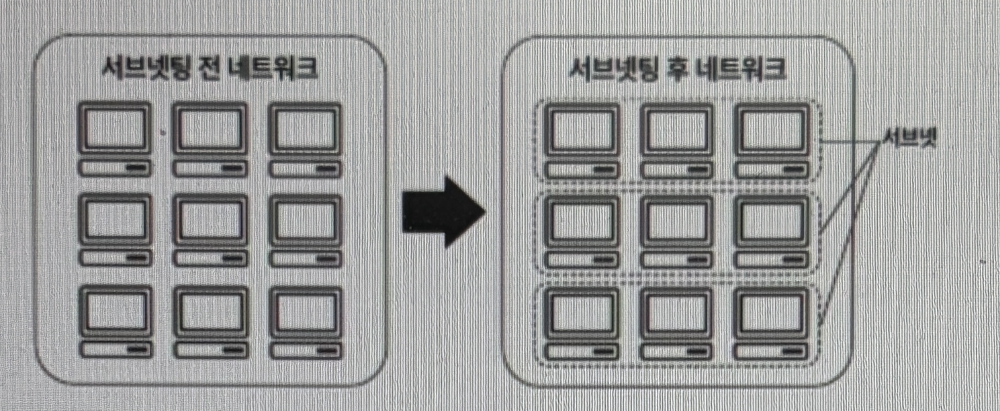
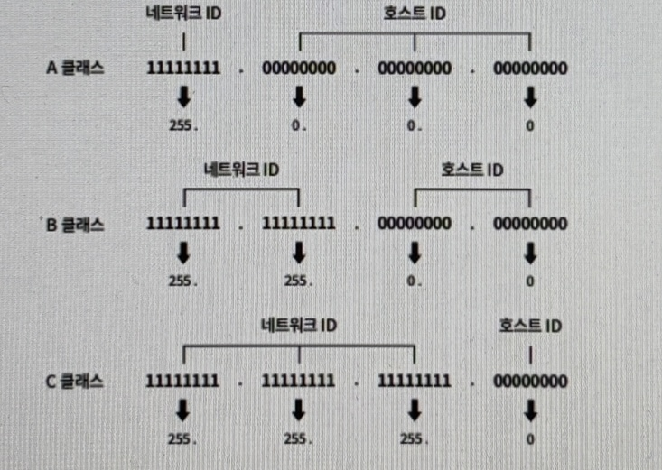

서브넷팅으로 인해 나누어진 각 네트워크를 서브넷이라고 한다. 서브넷 IP 주소로는 네트워크 ID와 호스트 ID를 구분하기 어려울 수 있기 때문에 CIDR 표기법을 사용하여 프리픽스의 비트 수를 나타내준다.

- **예시**

  ### (1) /24 — 가장 흔한 내부망

    - CIDR:
      192.168.1.0/24
    - 서브넷 마스크:
      255.255.255.0
    - 사용 가능한 IP 범위:
      192.168.1.1 ~ 192.168.1.254
    - 총 IP 개수:
      256개 (사용 가능 254개)

    ---

  ### (2) /30 — 매우 작은 네트워크

    - CIDR:
      10.0.0.0/30
    - 서브넷 마스크:
      255.255.255.252
    - 사용 가능한 IP 범위:
      10.0.0.1 ~ 10.0.0.2
    - 총 IP 개수:
      4개 (사용 가능 2개)

    ---

  ### (3) /16 — 큰 네트워크

    - CIDR:
      172.16.0.0/16
    - 서브넷 마스크:
      255.255.0.0
    - 사용 가능한 IP 범위:
      172.16.0.1 ~ 172.16.255.254
    - 총 IP 개수:
      약 65,536개

    ---

  ### (4) /32 — 단일 IP

    - CIDR:
      203.0.113.5/32
    - 서브넷 마스크:
      255.255.255.255
    - 사용 가능한 IP:
      203.0.113.5 (1개)

    ---

  ### (5) /0 — 전체 인터넷

    - CIDR:
      0.0.0.0/0
    - 의미:
      모든 IP 허용

**라우팅**

IP 만으로는 데이터를 주고받을 수 없다. 어떤 경로로 데이터를 보낼지 설정해야 하는데, 이를 라우팅이라고 한다. 라우터 라는 장비가 이 작업을 수행하며, 라우팅 테이블을 통해 경로를 저장하고 관리한다.

AWS에서는 라우터 장비 대신 라우팅 테이블을 별도로 생성하여 라우팅을 관리할 수 있다.

---

## 2.2 아마존 VPC란?

아마존 VPC(Virtual Private Cloud)는 사용자 전용 가상 네트워크로 AWS의 클라우드 환경에서 네트워크를 구성하고 관리할 수 있는 서비스이다. 사용자가 원하는 대로 라우팅 테이블 구성, IP 주소 범위 선택, 서브넷 생성 등으로 구성해 VPC를 생성할 수 있다.

### 2.2.1 아마존 VPC 구성 요소 살펴보기

**아마존 VPC 구성 요소**

| VPC 요소 이름 | 기능 |
| --- | --- |
| 서브넷 |  VPC 내에서 네트워크를 더 작은 단위로 나눈 부분 네트워크 |
| 인터넷 게이트웨이 | VPC와 인터넷 간의 통신을 가능하게 한다 |
| NAT 게이트웨이 | 프라이빗 서브넷 내의 리소스가 VPC 외부 서비스에는 연결할 수 있지만 외부 서비스에서 이 리소스와는 연결할 수 없도록 한다. |
| 라우팅 테이블 | VPC 안에서 발생한 네트워크 요청을 어디로 전송해야 하는 지 알려준다 |
| VPC 엔드포인트 | VPC 내 리소스들이 S3, 다이나모 DB 와 같이 다른 AWS나 외부 리소스에 접근할 때 내부 네트워크를 통해 안전하게 접근할 수 있도록 한다 |

---

### 2.2.2 서브넷
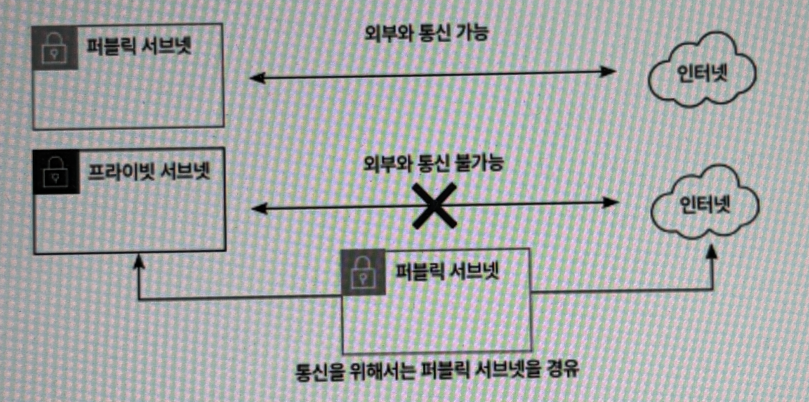

- 퍼블릭 서브넷 : 인터넷과 연결되어 있어 직접 통신 가능한 서브넷
- 프라이빗 서브넷 : 외부와의 통신이 불가능하며 주로 내부 서버나 데이터베이스 등 중요한 리소스 배치

서브넷은 한 가용 영역 내에서만 생성이 가능하여 여러 가용 영역에 걸쳐서 생성하는 것은 불가능하다. 한 가용 영역에서의 장애에 대응하기 위해 다음 사진과 같이 여러 가용 영역에 퍼블릭과 프라이빗 서브넷을 배치할 필요가 있다.
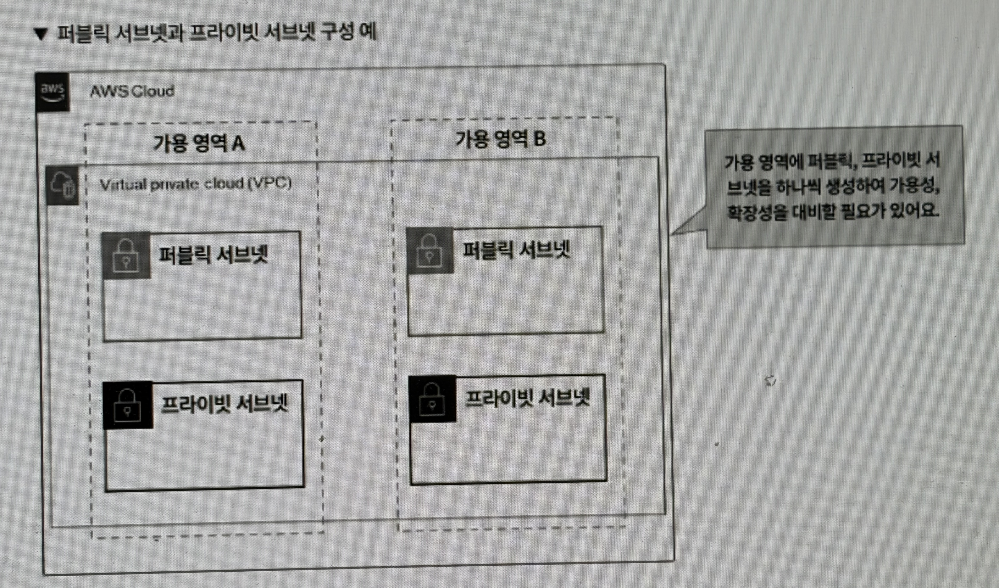

---

### 2.2.3 인터넷 게이트웨이

일반적으로 생성되는 서브넷은 외부와 통신이 불가능한 프라이빗 서브넷이다. 따라서 이를 퍼블릭으로 바꾸는 작업이 필요하다.
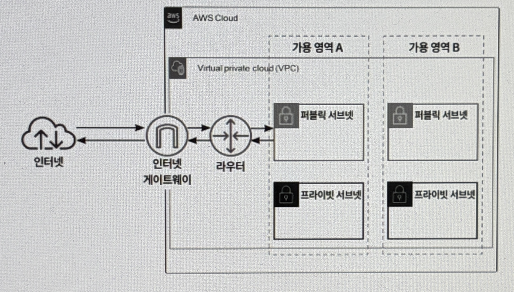

인터넷 게이트웨이를 생성하고 서브넷에 인터넷 게이트웨이의 라우팅을 설정하면 해당 서브넷은 인터넷과 통신 가능한 퍼블릭 서브넷이 된다. 즉, 서브넷이 인터넷 게이트웨이로 향하는 라우팅이 있는 경우 퍼블릭 서브넷이다.

---

### 2.2.4 NAT 게이트웨이

NAT(Network Address Transiation) 게이트웨이는 프라이빗 서브넷에 있는 리소스가 외부 인터넷과 통신하는 데 사용하는 퍼블릭 서브넷에 있는 서비스이다.
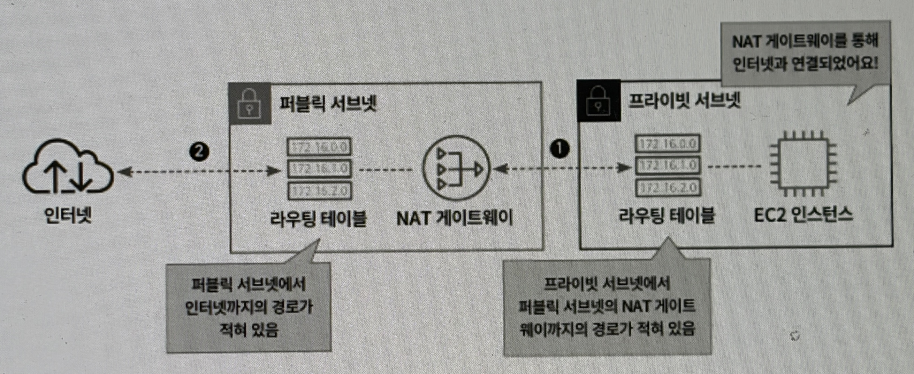

1. 프라이빗 서브넷에서 라우팅 테이블을 통해 NAT 게이트웨이로 접근하낟.
2. NAT 게이트웨이에서 다시 라우팅 테이블을 통해 인터넷과 연결한다.

보통 가용성을 위해 NAT 게이트웨이는 생성된 퍼블릭 서브넷마다 하나씩 생성하는 것이 권장되지만, NAT 게이트웨이는 기본 VPC 구성요소인 서브넷, 보안 그룹, NACL, 인터넷 게이트웨이와 달리 트래픽 발생 시 요금이 발생하므로 주의해야한다.

---

### 2.2.5 라우팅 테이블
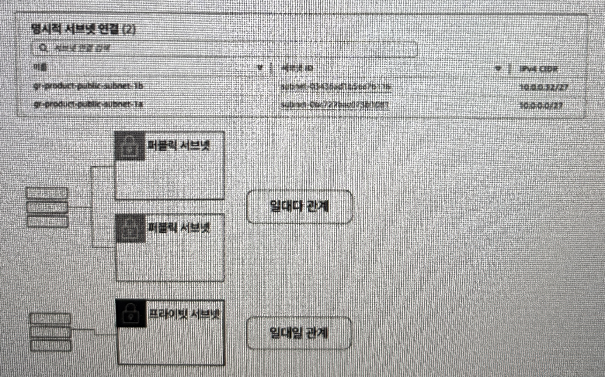

라우팅 테이블에서는 서브넷을 연결할 수 있다. 퍼블릭 서브넷을 해당 라우팅 테이블에 연결하고, 인터넷 게이트웨이로의 라우팅을 설정하면 이 라우팅 테이블에 연결된 서브넷은 퍼블릭 서브넷이 된다.

일반적으로 퍼블릭 서브넷은 인터넷 게이트웨이를 통해 외부 인터넷과 통신하며, 인터넷 게이트웨이 이외의 별도의 라우팅 설정이 없기 때문에 하나의 라우팅 테이블에 여러 퍼블릭 서브넷을 연결하여 일대다 관계를 유지하는 것이 일반적이다.

프라이빗 서브넷에는 서버, 데이터베이스 등 다양한 리소스가 존재하며 각 리소스마다 다른 라우팅 대상을 가질 수 있다. 이럴 때에는 각 서브넷에 대해 별도의 라우팅 설정을 할 수 있으며 일대일 관계를 유지하는 것이 일반적이다.

---

### 2.2.6 VPC 엔드포인트

**인터페이스 엔드포인트**

사설 IP 주소를 할당받아 AWS에서 제공하는 프라이빗 연결 공간인 프라이빗링크를 통해 VPC 내의 서버가 인터넷을 거치지 않고도 다른 AWS의 다른 서비스와 안전하게 통신할 수 있게 도와준다.

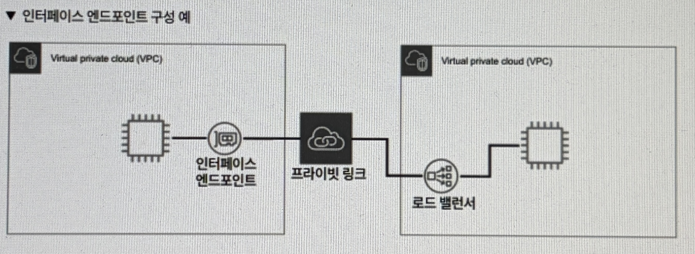
**게이트웨이 엔드포인트**

인터넷 게이트웨이와 NAT 게이트웨이 없이 아마존 S3와 아마존 다이나모DB에 연결하는 엔드포인트이다. 인터페이스 엔드포인트와 다른 점은 인터페이스 엔드포인트는 프라이빗 IP 주소를 사용하여 서비스에 접근하며, 온프레미스 네트워크와 다른 리전의 VPC에서도 접근할 수 있지만, 데이터 전송량에 따라 비용이 발생한지만, 게이트웨이 엔드포인트는 퍼블릭 IP가 할당되기 때문에 퍼블릭 IP로 접근한다.

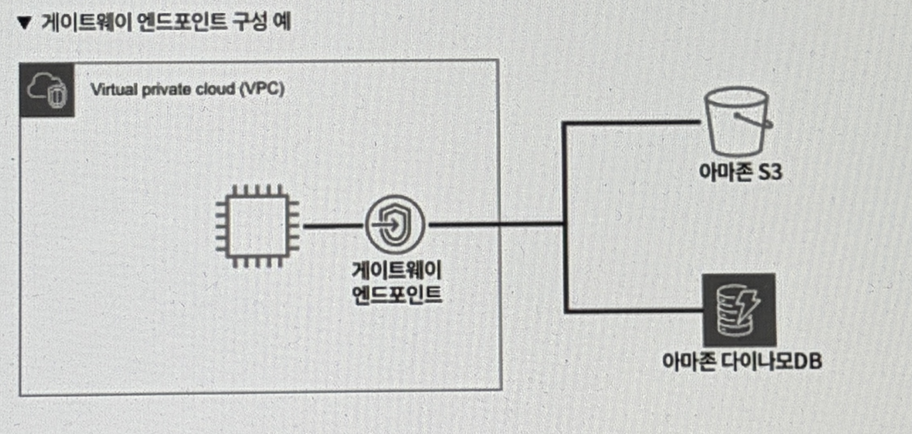
---

## 2.3 AWS 네트워크 설계 시 고려사항

### 2.3.1 CIDR은 어떻게 나누어야 할까?

항상 서브넷을 추가할 수 있도록 여유분을 생각해둬야 한다. 예를 들어 172.100.16.0/24 를 할당하고 이 VPC를 8개의 서브넷으로 나누고 싶다면 정확하게 8개 서브넷으로 나눌 수 있으며 각 서브넷은 27개 사용가능한 호스트 ID를 가질 수 있다. 하지만 서브넷을 추가해야 하는 상황이 생긴다면 문제가 있을 수 있기 때문에 /28로 설정하여 여유분을 가지고 만들어 두는 것이 좋다. 물론 서브넷을 추가할 일이 없다면 /27로 생성하여 IP 주소의 수를 확보하는 것이 더 좋은 방법일 것이다.
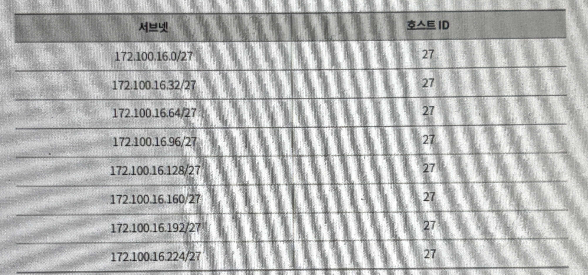
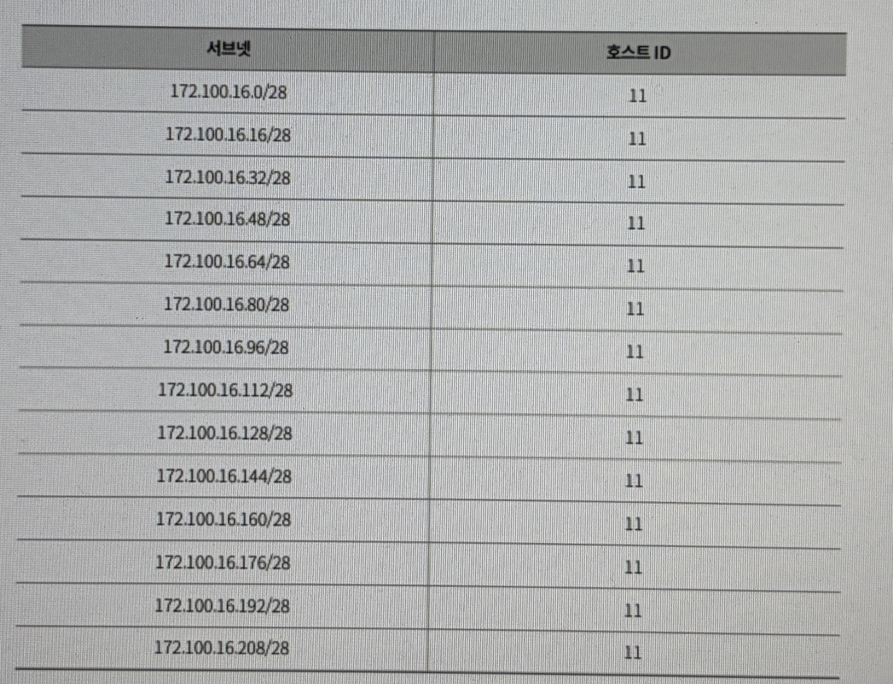

AWS에서 서브넷의 CIDR 중 사용할 수 없는 5가지

- 10.94.4.0 : 네트워크 주소
- 10.94.4.1 : AWS가 VPC 라우터용으로 예약
- 10.94.4.2 : AWS에서 예약
- 10.94.4.3 : 향후 사용을 위해 AWS에서 예약
- 10.94.4.255 : 네트워크 브로드캐스트 주소

이 외에, IP 사용이 필요한 케이스는 EC2 인스턴스 생성, Elastic IP 할당, NAT 게이트웨이 생성, VPC 엔드포인트 생성, 로드밸런서 생성 시에 IP 사용이 필요하다.

---

### 2.3.2 VPC 분할 패턴

VPC를 여러 개 구성하여 목적에 따라 나누거나 계정별로 나눌 필요가 있을 수 있다.

1. 단일 계정으로 VPC 분할

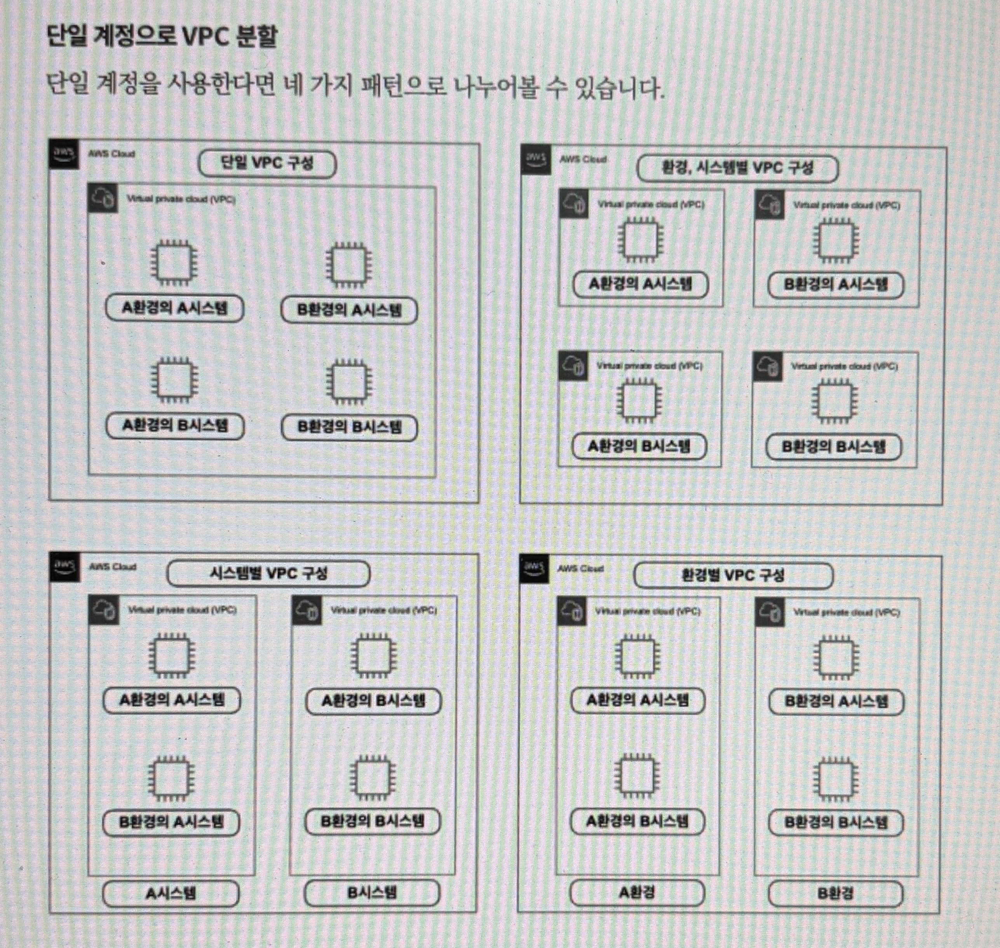
- 단일 VPC 구성 : 단일 VPC에 복수의 환경과 시스템 구성
- 환경, 시스템별 VPC 구성 : 환경, 시스템에 따라서 VPC를 나누어 구성
- 시스템별 VPC 구성 : 여러 시스템을 각 VPC로 나눔
- 환경별 VPC 구성 : 각 환경을 별도의 VPC로 나누어 구성하는 방법

1. 환경별 AWS 계정 분할

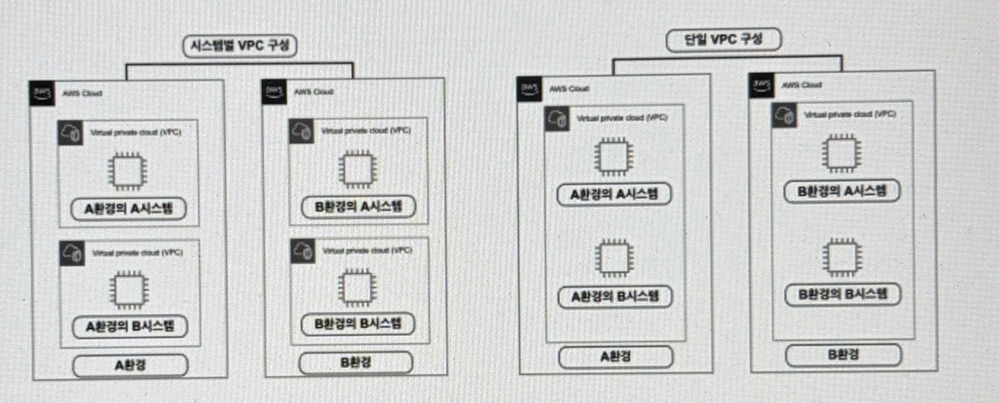
- 시스템별 VPC 구성 : 환경별로 AWS 계정을 나누고, 시스템별로 VPC를 나누어 구성
- 단일 VPC 구성 : 환경별로 AWS 계정을 나누고, 단일 VPC 에 시스템을 구성

1. 시스템별 AWS 계정 분할

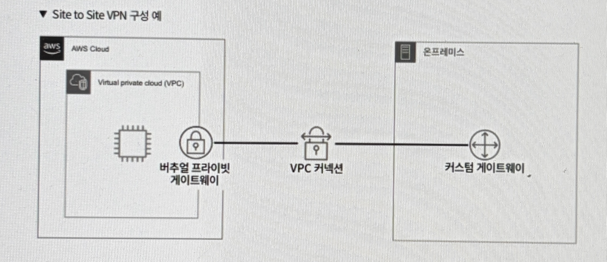
- 환경별 VPC 구성 : 시스템별로 AWS 계정을 나누고, 환경별로 VPC를 나누어 구성
- 단일 VPC 구성 : 시스템별로 AWS 계정을 나누고, 단일 VPC에 환경을 구성

---

## 2.4 AWS 네트워크 구축을 위한 다양한 서비스 알아보기

### 2.4.1 VPC 피어링

서로 다른 VPC를 연결하여 데이터 송수신을 도와주는 서비스로, 복수의 VPC를 연결할 수 없으며, 일대일 관계를 가진다. 같은 계정 내의 연결 및 계정과 계정 사이의 VPC 연결을 지원한다. 비용은 무료이며 피어링을 이용한 데이터 전송도 무료이다.
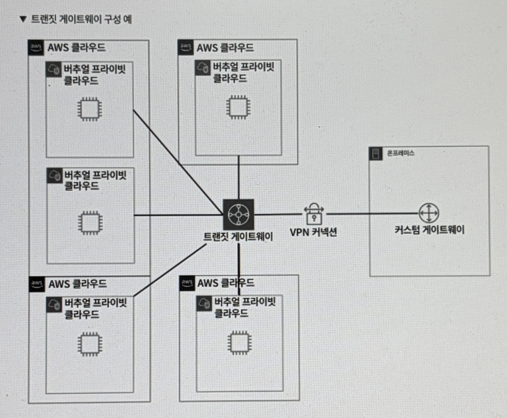

---

### 2.4.2 Site to Site VPN

AWS와 온프레미스 간의 안전한 연결을 생성하는 서비스로, 이 서비스를 통해 암호화된 터널을 설정하여 데이터를 안전하게 전송할 수 있다. IPsec 프로토콜을 사용하여 터널을 설정하며, 고유한 공인 IP 주소를 사용하여 두 지점간의 통신을 보호한다. 시간당 USD 0.05 요금이 발생한다.
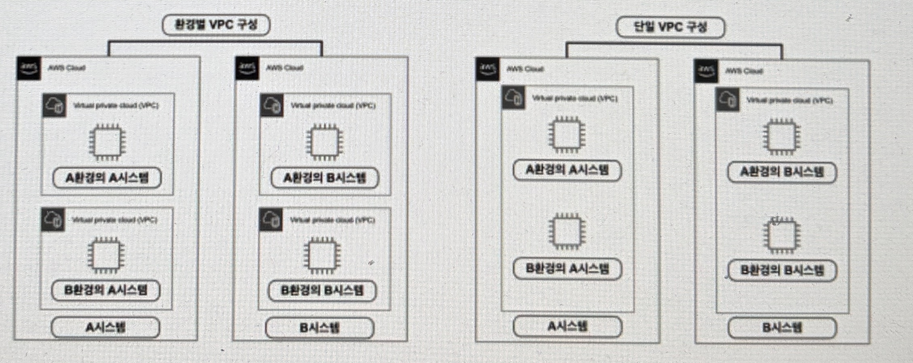

---

### 2.4.3 트랜짓 게이트웨이

여러 VPC들을 연결해주는 서비스이다. 여러 VPC 간의 연결을 중앙 집중화하여 관리할 수 있으며 Site to Site VPN을 이용하여 다수의 VPC와 온프레미스가 상호작용할 수도 있다. 연결당 0.07 USD 의 시간당 요금이 부과되며, 처리된 데이터는 GB당 0.02 USD 요금이 발생한다.
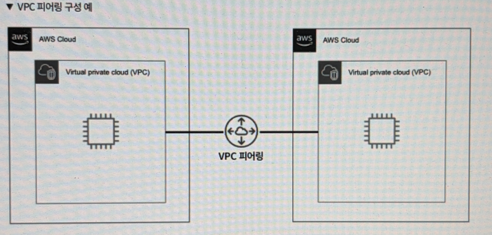

---

### 2.4.4 다이렉트 커넥트

Site to Site VPN과 유사하게 AWS 환경과 온프레미스 연결 서비스이다. 물리 전용선을 통해 비공개 접속을 시도하며, 고속 네트워크 대역에서 안정적인 통신을 제공한다. 물리 전용선을 사용해야 하므로 초기 설정 및 구축에 시간과 비용이 더 많이 소요될 수 있다. 다이렉트 커넥트의 접속 방식은 두 가지로 나눌 수 있다.

- 단일 가상 프라이빗 게이트웨이를 통한 다이렉트 커넥트 구성
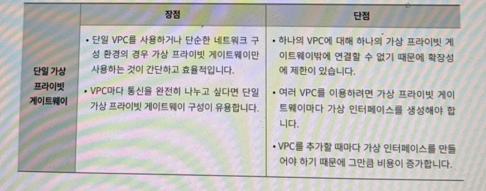
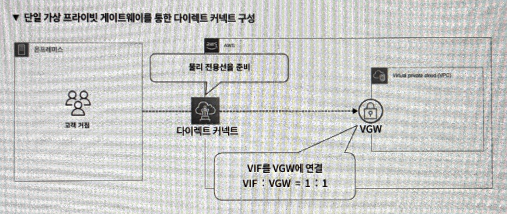

- 다이렉트 커넥트 게이트웨이와 가상 프라이빗 게이트웨이를 통한 다이렉트 커넥트 구성
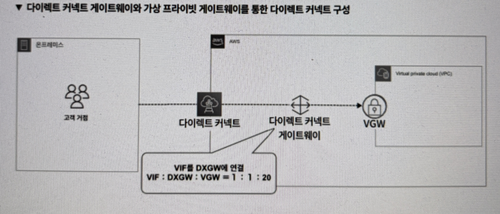
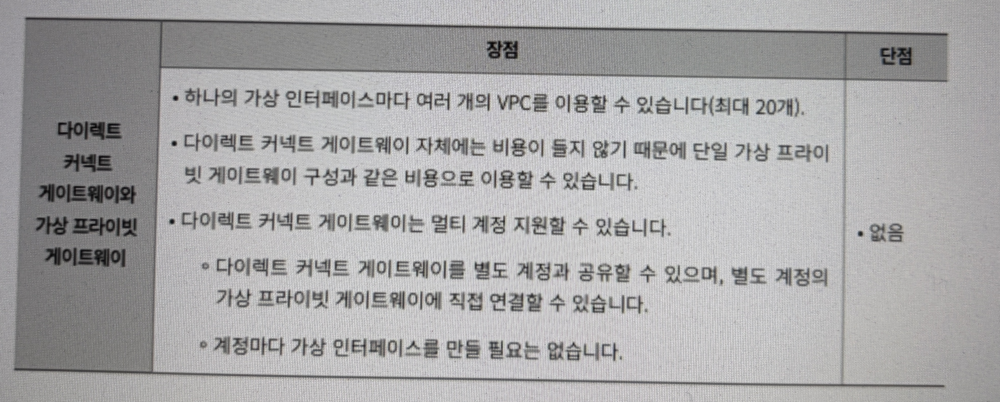

→ 다이렉트 커넥트 게이트웨이와 가상 프라이빗 게이트웨이를 통한 다이렉트 커넥트 구성을 권장한다.

---

## 2.5 AWS 네트워크 환경 구축하기

### 2.5.1 클라우드포메이션으로 네트워크 환경 구축하기

- VPC.yml

```yaml
AWSTemplateFormatVersion: "2010-09-09"
Description: VPC Network Set
# ------------------------------------------------------------
# Input Parameters
# ------------------------------------------------------------
Parameters:   # 파라미터를 이용해 각 항목에 사용자 지정 값 입력
  SystemName: # 구축할 환경의 시스템 이름 정의
    Description: "System name of each resource names."
    Type: String
    Default: "gr"
  EnvName:   # 구축할 환경의 이름을 정의
    Description: "Environment name of each resource names."
    Type: String
    Default: "product"
  VPCParam:  # VPCParam이라는 파라미터 이름 정의하여 VPC의 CIDR 정의
    Description: gr-product-vpc
    Type: String
    Default: 10.0.0.0/24
  PublicSubnet1aParam:  # 퍼블릭 서브넷의 CIDR 정의
    Description: gr-product-public-subnet-1a
    Type: String
    Default: 10.0.0.0/27
  PublicSubnet1bParam:  # 프라이빗 서브넷의 CIDR 정의
    Description: gr-product-public-subnet-1b
    Type: String
    Default: 10.0.0.32/27
  WebSubnet1aParam:
    Description: gr-product-web-subnet-1a
    Type: String
    Default: 10.0.0.64/27
  WebSubnet1bParam: 
    Description: gr-product-web-subnet-1b
    Type: String
    Default: 10.0.0.96/27
  DatastoreSubnet1aParam:  # 해당 프라이빗 서브넷은 외부와의 연결이 완전히 차단되어 있어서 주로 데이터베이스 등을 배치
    Description: gr-product-datastore-subnet-1a
    Type: String
    Default: 10.0.0.128/27
  DatastoreSubnet1bParam: 
    Description: gr-product-datastore-subnet-1b
    Type: String
    Default: 10.0.0.160/27
#-------------------------------------------------------------------
# Create VPC、Subnet
#-------------------------------------------------------------------
Resources:  # 생성하고자 하는 리소스 정의
  VPC:  # 생성할 리소스의 이름 지정
    Type: "AWS::EC2::VPC" # 리소스 내에서 Type을 이용해 생성할 서비스 정의
    Properties: # 생성할 리소스의 속성 정의, !Ref 내장함수를 사용하여 파라미터를 불러와서 CIDR 정의
      CidrBlock: !Ref VPCParam
      EnableDnsSupport: "true"
      EnableDnsHostnames: "true"
      InstanceTenancy: default
      Tags: # 생성할 리소스의 이름과 환경 이름 입력. 키밸류 형식, !Sub을 통해 파라미터 문자열 변수 불러옴
        - Key: Name
          Value: !Sub ${SystemName}-${EnvName}-vpc
        - Key: Env
          Value: !Sub ${EnvName}
  PublicSubnet1a: # PublicSubnet1a 서브넷 정의
    Type: "AWS::EC2::Subnet"
    Properties: # 서브넷 속성 지정
      AvailabilityZone:
        Fn::Select: 
        - 0
        - Fn::GetAZs: ""
      CidrBlock: !Ref PublicSubnet1aParam # 파라미터를 불러와 서브넷의 CIDR 지정
      VpcId: !Ref VPC # 속할 VPC 지정
      Tags:  # 서브넷의 이름과 환경명 지정
        - Key: Name
          Value: !Sub ${SystemName}-${EnvName}-public-subnet-1a
        - Key: Env
          Value: !Sub ${EnvName}
  PublicSubnet1b: 
    Type: "AWS::EC2::Subnet"
    Properties: 
      AvailabilityZone:
        Fn::Select: 
        - 1
        - Fn::GetAZs: ""
      CidrBlock: !Ref PublicSubnet1bParam
      VpcId: !Ref VPC 
      Tags: 
        - Key: Name
          Value: !Sub ${SystemName}-${EnvName}-public-subnet-1b
        - Key: Env
          Value: !Sub ${EnvName}
  WebSubnet1a: 
    Type: "AWS::EC2::Subnet"
    Properties: 
      AvailabilityZone:
        Fn::Select: 
        - 0
        - Fn::GetAZs: ""
      CidrBlock: !Ref WebSubnet1aParam
      VpcId: !Ref VPC
      Tags: 
        - Key: Name
          Value: !Sub ${SystemName}-${EnvName}-web-subnet-1a
        - Key: Env
          Value: !Sub ${EnvName}
  WebSubnet1b: 
    Type: "AWS::EC2::Subnet"
    Properties: 
      AvailabilityZone:
        Fn::Select: 
        - 1
        - Fn::GetAZs: ""
      CidrBlock: !Ref WebSubnet1bParam
      VpcId: !Ref VPC 
      Tags: 
        - Key: Name
          Value: !Sub ${SystemName}-${EnvName}-web-subnet-1b
        - Key: Env
          Value: !Sub ${EnvName}
  DatastoreSubnet1a: 
    Type: "AWS::EC2::Subnet"
    Properties: 
      AvailabilityZone:
        Fn::Select: 
        - 0
        - Fn::GetAZs: ""
      CidrBlock: !Ref DatastoreSubnet1aParam
      VpcId: !Ref VPC 
      Tags: 
        - Key: Name
          Value: !Sub ${SystemName}-${EnvName}-datastore-subnet-1a
        - Key: Env
          Value: !Sub ${EnvName}
  DatastoreSubnet1b: 
    Type: "AWS::EC2::Subnet"
    Properties: 
      AvailabilityZone:
        Fn::Select: 
        - 1
        - Fn::GetAZs: ""
      CidrBlock: !Ref DatastoreSubnet1bParam
      VpcId: !Ref VPC 
      Tags: 
        - Key: Name
          Value: !Sub ${SystemName}-${EnvName}-datastore-subnet-1b
        - Key: Env
          Value: !Sub ${EnvName}
#-------------------------------------------------------------------
# Create Internet Gateway
#-------------------------------------------------------------------
  InternetGateway: # 인터넷 게이트웨이로 리소스 이름 지정
    Type: "AWS::EC2::InternetGateway" # 생성할 인터넷 게이트웨이 정의
    Properties: # 태그를 이용해 이름과 환경명 지정
      Tags: 
        - Key: Name
          Value: !Sub ${SystemName}-${EnvName}-igw
        - Key: Env
          Value: !Sub ${EnvName}
  InternetGatewayAttachment: # VPC 연결 필요 없으므로 연결을 위한 리소스 별도 생성
    Type: "AWS::EC2::VPCGatewayAttachment" # 인터넷 게이트웨이 연결을 위한 VPCG 정의
    Properties: # 연결하고자 하늰 VPC 입력
      InternetGatewayId: !Ref InternetGateway
      VpcId: !Ref VPC
#-------------------------------------------------------------------
# Create Route Tables
#-------------------------------------------------------------------
  PublicRTB :  # 라우터 테이블을 생성하기 위한 리소스 이름 지정
      Type: "AWS::EC2::RouteTable" # Type을 이용해 라우팅 테이블 정의
      Properties:  # 라우팅 테이블 생성할 VPC 지정
        VpcId: !Ref VPC 
        Tags: # 라우팅 테이블 태그력
          - Key: Name
            Value: !Sub ${SystemName}-${EnvName}-public-rtb
          - Key: Env
            Value: !Sub ${EnvName}
  WebRTB : 
      Type: "AWS::EC2::RouteTable"
      Properties: 
        VpcId: !Ref VPC 
        Tags: 
          - Key: Name
            Value: !Sub ${SystemName}-${EnvName}-web-rtb
          - Key: Env
            Value: !Sub ${EnvName}
  DatastoreRTB : 
      Type: "AWS::EC2::RouteTable"
      Properties: 
        VpcId: !Ref VPC 
        Tags: 
          - Key: Name
            Value: !Sub ${SystemName}-${EnvName}-datastore-rtb
          - Key: Env
            Value: !Sub ${EnvName}
#-------------------------------------------------------------------
# Route Set
#-------------------------------------------------------------------
  PublicRoute: # 리소스 이름 지정
    Type: "AWS::EC2::Route" # Type을 이용해 라우팅 Route 정의
    Properties: # 라우팅 테이블 입력, 목적지 CIDR 입력, 인터넷 게이트웨이력
      RouteTableId: !Ref PublicRTB
      DestinationCidrBlock: "0.0.0.0/0"
      GatewayId: !Ref InternetGateway
#-------------------------------------------------------------------
# Route Tables Subnet Association
#-------------------------------------------------------------------
  PublicRTBAssociation1: # 리소스 이름 지정
    Type: "AWS::EC2::SubnetRouteTableAssociation" # Type에서 SubnetRouteTableAssociation 지정
    Properties: # 서로 연결할 서브넷과 라우팅 테이블 입력
      SubnetId: !Ref PublicSubnet1a
      RouteTableId: !Ref PublicRTB
  PublicRTBAssociation2: 
    Type: "AWS::EC2::SubnetRouteTableAssociation"
    Properties: 
      SubnetId: !Ref PublicSubnet1b
      RouteTableId: !Ref PublicRTB
  WebRTBAssociation1: 
    Type: "AWS::EC2::SubnetRouteTableAssociation"
    Properties: 
      SubnetId: !Ref WebSubnet1a
      RouteTableId: !Ref WebRTB
  WebRTBAssociation2: 
    Type: "AWS::EC2::SubnetRouteTableAssociation"
    Properties: 
      SubnetId: !Ref WebSubnet1b
      RouteTableId: !Ref WebRTB
  DatastoreRTBAssociation1: 
    Type: "AWS::EC2::SubnetRouteTableAssociation"
    Properties: 
      SubnetId: !Ref DatastoreSubnet1a
      RouteTableId: !Ref DatastoreRTB
  DatastoreRTBAssociation2: 
    Type: "AWS::EC2::SubnetRouteTableAssociation"
    Properties: 
      SubnetId: !Ref DatastoreSubnet1b
      RouteTableId: !Ref DatastoreRTB
# ------------------------------------------------------------
# Output Parameters
# ------------------------------------------------------------
Outputs: # 템플릿에서 생성한 리소스를 출력하고 반환
# VPC
  VPC: # 이름 지정
    Value: !Ref VPC # 출력할 리소스정
    Export: # 어떤 이름으로 리소스 출력할지 지정
      Name: !Sub ${EnvName}-vpc
# public-subnet
  PublicSubnet1a:
    Value: !Ref PublicSubnet1a
    Export:
      Name: !Sub ${EnvName}-public-subnet-1a
  PublicSubnet1b:
    Value: !Ref PublicSubnet1b
    Export:
      Name: !Sub ${EnvName}-public-subnet-1b
# Web-subnet
  WebSubnet1a:
    Value: !Ref WebSubnet1a
    Export:
      Name: !Sub ${EnvName}-web-subnet-1a
  WebSubnet1c:
    Value: !Ref WebSubnet1b
    Export:
      Name: !Sub ${EnvName}-web-subnet-1b
# Datastore-subnet
  DatastoreSubnet1a:
    Value: !Ref DatastoreSubnet1a
    Export:
      Name: !Sub ${EnvName}-datastore-subnet-1a
  DatastoreSubnet1c:
    Value: !Ref DatastoreSubnet1b
    Export:
      Name: !Sub ${EnvName}-datastore-subnet-1b
```

---

### 2.5.2 UI로 불러와 AWS 네트워크 환경 구축하기
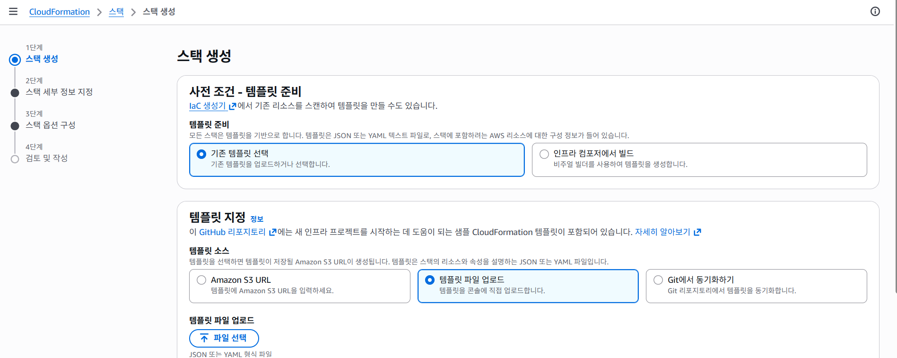

yml 파일 업로드해서 스택 생성한 뒤, 이벤트와 출력 탭 확인 가능
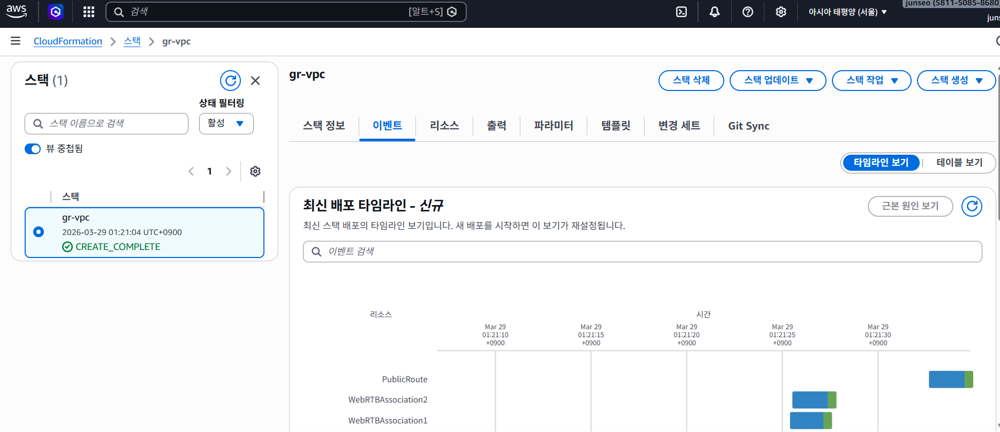
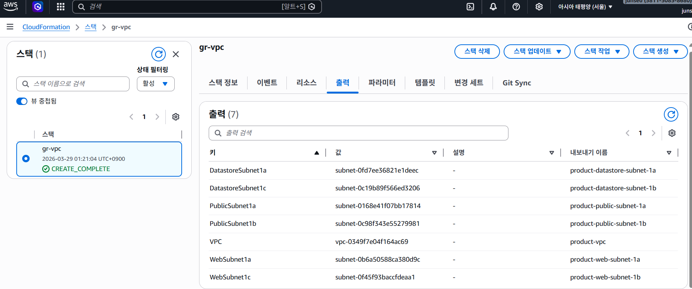
