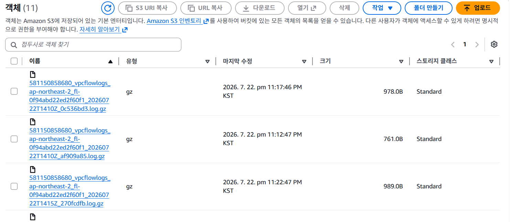

# Chapter 23 네트워크 트래픽 로깅 서비스 파악하기

## 개요

이번 장에서는 **VPC 플로우 로그(VPC Flow Logs)**를 이용하여 VPC에서 송수신되는 네트워크 트래픽 정보를 수집하고 분석하는 방법을 학습한다.

VPC 플로우 로그를 활용하면 다음과 같은 작업이 가능하다.

- VPC 내부 네트워크 트래픽 모니터링
- 보안 그룹 및 네트워크 설정 검증
- 허용되거나 거부된 트래픽 확인
- 비정상적인 IP 주소 및 포트 탐지
- 네트워크 통신 장애 원인 분석
- Amazon GuardDuty와 같은 보안 서비스의 데이터 소스로 활용

---

## 23.1 네트워크 트래픽 로깅 서비스, VPC 플로우 로그란?

### VPC 플로우 로그의 개념

VPC 플로우 로그는 VPC의 네트워크 인터페이스에서 송수신되는 **IP 트래픽에 대한 정보를 수집하는 기능**이다.

수집한 로그는 다음 저장소에 보관할 수 있다.

- Amazon S3
- Amazon CloudWatch Logs

VPC 플로우 로그는 실제 패킷의 전체 내용을 저장하는 것이 아니라, 다음과 같은 네트워크 통신의 요약 정보를 기록한다.

- 출발지 IP 주소
- 목적지 IP 주소
- 출발지 포트
- 목적지 포트
- 프로토콜
- 전송된 패킷 수
- 전송된 바이트 수
- 트래픽 허용 또는 거부 여부
- 통신 시작 및 종료 시간

---

### VPC 플로우 로그의 동작 흐름

```
사용자
  ↓
VPC 내부 EC2 인스턴스에 접근
  ↓
네트워크 인터페이스에서 트래픽 정보 수집
  ↓
VPC 플로우 로그 생성
  ↓
Amazon S3 또는 CloudWatch Logs에 저장
```

사용자가 VPC를 거쳐 EC2 인스턴스에 접속하면 해당 네트워크 통신 정보가 하나의 플로우 로그 레코드로 생성된다.

저장된 로그를 분석하면 AWS 네트워크 구성이 의도한 대로 동작하는지 확인할 수 있다.

---

### VPC 플로우 로그의 주요 활용 목적

#### 보안 진단

- 보안 그룹에서 의도한 트래픽만 허용하는지 확인
- 악성 IP 주소와의 통신 여부 탐지
- 의심스러운 포트 접근 확인
- 거부된 트래픽 분석
- DDoS 공격과 같은 비정상적인 트래픽 탐지

#### 네트워크 장애 분석

- 특정 서버에 접속할 수 없는 원인 확인
- 요청이 어느 지점까지 도달했는지 확인
- 보안 그룹 또는 네트워크 ACL에 의해 차단되었는지 분석
- 예상하지 못한 통신 경로 확인

#### 네트워크 모니터링

- 트래픽의 출발지와 목적지 확인
- 통신량이 많은 서버나 네트워크 인터페이스 탐지
- 특정 시간대의 비정상적인 활동 확인

---

### Amazon GuardDuty와의 관계

Amazon GuardDuty는 AWS 계정에서 악의적인 활동이나 비정상적인 동작이 있는지 지속적으로 모니터링하는 보안 서비스이다.

GuardDuty는 VPC 플로우 로그와 같은 데이터를 분석하여 다음과 같은 위협을 탐지할 수 있다.

- 비정상적인 외부 IP와의 통신
- 알려진 악성 IP 접근
- 비정상적인 포트 스캔
- 암호화폐 채굴과 관련된 네트워크 활동
- 계정 또는 리소스의 침해 가능성

---

## 23.2 VPC 플로우 로그 살펴보기

VPC 플로우 로그는 한 줄의 텍스트 형태로 기록된다.

```
version account-id interface-id srcaddr dstaddr srcport dstport protocol packets bytes start end action log-status
```

예시는 다음과 같다.

```
2 412213214 eni-xxxx xx.xx.xx.xx xx.xx.xx.xx 22 31587 6 4 333 1743813123 1743813123 ACCEPT OK
```

각 값은 공백을 기준으로 구분된다.

---

## 23.2.1 VPC 플로우 로그 필드

| 필드 | 의미 | 설명 |
| --- | --- | --- |
| `version` | VPC 플로우 로그 버전 | 로그 레코드의 형식을 지정한 버전 |
| `account-id` | AWS 계정 ID | 네트워크 인터페이스를 소유한 AWS 계정 ID |
| `interface-id` | 네트워크 인터페이스 ID | 트래픽이 기록된 ENI의 ID |
| `srcaddr` | 출발지 주소 | 트래픽을 시작한 소스 IP 주소 |
| `dstaddr` | 목적지 주소 | 트래픽이 향하는 대상 IP 주소 |
| `srcport` | 출발지 포트 | 트래픽을 시작한 소스 포트 번호 |
| `dstport` | 목적지 포트 | 트래픽이 향하는 대상 포트 번호 |
| `protocol` | 프로토콜 번호 | IANA에서 정의한 IP 프로토콜 번호 |
| `packets` | 패킷 수 | 해당 통신에서 전송된 패킷 수 |
| `bytes` | 바이트 수 | 해당 통신에서 전송된 데이터 크기 |
| `start` | 통신 시작 시간 | 플로우가 시작된 시각을 UNIX 시간으로 표시 |
| `end` | 통신 종료 시간 | 플로우가 종료된 시각을 UNIX 시간으로 표시 |
| `action` | 처리 결과 | 허용된 트래픽은 `ACCEPT`, 거부된 트래픽은 `REJECT` |
| `log-status` | 로그 처리 상태 | 로그가 정상적으로 생성되었는지 나타내는 값 |

---

### version

VPC 플로우 로그의 버전을 나타낸다.

기본 형식의 필드를 사용하는 경우 일반적으로 버전 2가 출력된다. 사용자 정의 형식으로 더 높은 버전의 필드를 포함하면 해당 버전에 맞는 값이 출력될 수 있다.

---

### account-id

트래픽이 기록된 네트워크 인터페이스를 소유한 AWS 계정의 ID이다.

AWS 계정 ID는 일반적으로 12자리 숫자로 구성된다.

---

### interface-id

트래픽이 기록된 네트워크 인터페이스의 ID이다.

예시는 다음과 같다.

```
eni-01dd0ee7c2c534304
```

EC2 인스턴스는 하나 이상의 Elastic Network Interface를 가질 수 있으므로, 해당 값을 통해 트래픽이 발생한 실제 인터페이스를 식별할 수 있다.

---

### srcaddr와 dstaddr

- `srcaddr`: 통신을 시작한 출발지 IP 주소
- `dstaddr`: 통신이 향하는 목적지 IP 주소

두 필드를 분석하면 어떤 IP 주소 사이에서 통신이 발생했는지 파악할 수 있다.

다음과 같은 상황을 확인하는 데 활용된다.

- 비정상적인 외부 IP 접근
- 내부 리소스 사이의 예상하지 못한 통신
- 특정 악성 IP 주소와의 연결
- 잘못 설정된 통신 경로

---

### srcport와 dstport

- `srcport`: 출발지 포트 번호
- `dstport`: 목적지 포트 번호

목적지 포트를 확인하면 어떤 서비스에 접근했는지 추정할 수 있다.

| 포트 | 일반적인 용도 |
| --- | --- |
| 22 | SSH |
| 25 | SMTP |
| 53 | DNS |
| 80 | HTTP |
| 443 | HTTPS |
| 3306 | MySQL |
| 5432 | PostgreSQL |

일반적으로 사용되지 않는 포트에 대한 반복적인 접근은 보안상 의심스러운 활동일 수 있다.

---

### protocol

IANA에서 정의한 프로토콜 번호이다.

| 프로토콜 번호 | 프로토콜 |
| --- | --- |
| 1 | ICMP |
| 6 | TCP |
| 17 | UDP |

예를 들어 `protocol` 값이 6이라면 TCP 통신이라는 의미이다.

---

### packets와 bytes

- `packets`: 전송된 패킷 수
- `bytes`: 전송된 데이터의 바이트 수

이 값을 이용하면 통신량을 추정할 수 있다.

비정상적으로 많은 패킷이나 데이터가 특정 IP 주소에서 발생한다면 다음 상황을 의심할 수 있다.

- DDoS 공격
- 비정상적인 파일 전송
- 데이터 유출
- 반복적인 포트 스캔
- 잘못된 애플리케이션의 과도한 요청

---

### start와 end

트래픽이 시작되고 종료된 시간을 나타낸다.

두 필드는 UNIX 시간 형식으로 저장된다.

```
start: 1719630709
end:   1719630768
```

두 값을 비교하면 통신이 유지된 시간을 계산할 수 있다.

```
통신 시간 = end - start
```

특정 시간대에 반복적으로 발생한 트래픽을 분석하면 비정상적인 네트워크 활동을 탐지할 수 있다.

---

### action

트래픽이 허용되었는지 거부되었는지를 나타낸다.

| 값 | 의미 |
| --- | --- |
| `ACCEPT` | 보안 그룹 또는 네트워크 ACL 규칙에 의해 트래픽이 허용됨 |
| `REJECT` | 보안 그룹 또는 네트워크 ACL 규칙에 의해 트래픽이 거부됨 |

`REJECT` 로그가 발생했다면 다음 항목을 점검할 수 있다.

- 보안 그룹 인바운드 규칙
- 보안 그룹 아웃바운드 규칙
- 네트워크 ACL
- 출발지 및 목적지 IP 주소
- 대상 포트 번호
- 통신 프로토콜

단, `ACCEPT`가 기록되었다고 해서 애플리케이션까지 정상적으로 응답했다는 의미는 아니다. 네트워크 계층에서 트래픽이 허용되었다는 의미이다.

---

### log-status

로그 생성 상태를 나타낸다.

| 값 | 의미 |
| --- | --- |
| `OK` | 로그가 정상적으로 생성됨 |
| `NODATA` | 해당 구간에 기록할 네트워크 트래픽이 없음 |
| `SKIPDATA` | 일부 레코드가 생략되었거나 로그 생성 과정에서 문제가 발생함 |

`SKIPDATA`가 반복적으로 나타난다면 로그 수집 환경이나 처리 한도를 확인할 필요가 있다.

---

## 보안 및 트래픽 분석에서 주목할 필드

### `srcaddr`, `dstaddr`

- 비정상적인 IP 주소와의 통신 확인
- 악성 IP 접근 탐지
- 내부 리소스 사이의 예상하지 못한 통신 확인

### `srcport`, `dstport`

- 일반적이지 않은 포트 사용 확인
- 공격자가 특정 포트를 스캔하는지 분석
- 의도한 서비스 포트로 통신하는지 검증

### `protocol`

- 서비스에서 허용하지 않은 프로토콜 사용 탐지
- TCP, UDP, ICMP 통신 구분

### `action`

- 보안 그룹이나 네트워크 ACL에 의해 거부된 요청 분석
- 의심스러운 트래픽 식별
- 접속 장애의 원인 확인

### `bytes`, `packets`

- 비정상적으로 많은 데이터 전송 탐지
- DDoS 공격 또는 데이터 유출 가능성 분석

### `start`, `end`

- 특정 시간대의 비정상적인 활동 확인
- 반복적인 접근 패턴 분석
- 통신 지속 시간 파악

---

## 23.3 VPC 플로우 로그 활용하기

이번 실습에서는 EC2 인스턴스가 존재하는 VPC에 플로우 로그를 생성하고, 수집된 로그를 Amazon S3에서 확인한다.

전체적인 실습 흐름은 다음과 같다.

```
EC2 인스턴스와 VPC 생성
  ↓
S3 버킷 생성
  ↓
VPC 플로우 로그 생성
  ↓
EC2 인스턴스로 트래픽 발생
  ↓
S3 버킷에서 로그 파일 확인
  ↓
로그 다운로드 및 분석
```

---

## 23.3.1 CloudFormation으로 VPC 플로우 로그 생성하기

CloudFormation에서 VPC 플로우 로그는 `AWS::EC2::FlowLog` 리소스로 생성한다.

```
VPCFlowLogs:
  Type: AWS::EC2::FlowLog
  Properties:
    LogDestinationType: s3
    LogDestination:!GetAtt FlowLogsBucket.Arn
    ResourceId:
      Ref: VpcId
    ResourceType: VPC
    TrafficType: ALL
    Tags:
      - Key: Name
        Value:!Sub ${SystemName}-${EnvName}-flowlogs
```

---

### Type

```
Type: AWS::EC2::FlowLog
```

VPC 플로우 로그 리소스를 생성한다.

---

### LogDestinationType

```
LogDestinationType: s3
```

수집한 로그를 저장할 리소스의 유형이다.

이번 실습에서는 Amazon S3를 로그 저장소로 사용한다.

---

### LogDestination

```
LogDestination:!GetAtt FlowLogsBucket.Arn
```

로그를 저장할 S3 버킷의 ARN을 지정한다.

---

### ResourceId

```
ResourceId:
  Ref: VpcId
```

트래픽을 모니터링할 AWS 리소스의 ID이다.

VPC 전체를 모니터링하는 경우 VPC ID를 지정한다.

---

### ResourceType

```
ResourceType: VPC
```

플로우 로그를 생성할 리소스 유형을 지정한다.

선택 가능한 대표적인 값은 다음과 같다.

- `VPC`
- `Subnet`
- `NetworkInterface`
- `TransitGateway`
- `TransitGatewayAttachment`

---

### TrafficType

```
TrafficType: ALL
```

어떤 트래픽을 기록할 것인지 지정한다.

| 값 | 설명 |
| --- | --- |
| `ACCEPT` | 허용된 트래픽만 기록 |
| `REJECT` | 거부된 트래픽만 기록 |
| `ALL` | 허용 및 거부된 모든 트래픽 기록 |

이번 실습에서는 전체 트래픽을 확인하기 위해 `ALL`을 사용한다.

---

## 23.3.2 AWS 콘솔에서 플로우 로그 확인하기

CloudFormation 스택이 생성된 후 다음 과정으로 VPC 플로우 로그를 확인할 수 있다.

1. AWS VPC 콘솔로 이동
2. 대상 VPC 선택
3. **플로우 로그** 탭 선택
4. 생성된 플로우 로그 확인
5. 대상 유형과 로그 저장 위치 확인

확인할 수 있는 정보는 다음과 같다.

- 플로우 로그 ID
- 필터 유형
- 로그 대상 유형
- 로그 대상
- 대상 리소스
- 생성 상태



---

## 트래픽 생성

플로우 로그는 실제 네트워크 통신이 발생해야 생성된다.

로그가 수집되지 않았다면 EC2 인스턴스에 접속하거나 다음과 같은 명령으로 트래픽을 발생시킬 수 있다.

```
curl http://example.com
```

또는 패키지 업데이트 명령을 실행할 수 있다.

```
sudo yum update-y
```

이러한 요청은 EC2 인스턴스와 외부 네트워크 사이의 트래픽을 발생시킨다.

---

## S3에서 수집 로그 확인하기

1. 생성된 VPC 플로우 로그의 대상 S3 버킷 확인
2. Amazon S3 콘솔에서 해당 버킷으로 이동
3. 생성된 로그 객체 확인
4. 로그 파일 다운로드
5. 압축된 `.gz` 파일 해제
6. 텍스트 로그 분석

다운로드된 로그는 다음과 같은 형식을 가진다.

```
version account-id interface-id srcaddr dstaddr srcport dstport protocol packets bytes start end action log-status
2 xxxxxxxx eni-01dd0ee7c2c534304 ... ACCEPT OK
2 xxxxxxxx eni-01dd0ee7c2c534304 ... REJECT OK
```

로그에는 앞에서 살펴본 각 필드가 포함되며, 이를 바탕으로 VPC에서 발생한 네트워크 통신을 분석할 수 있다.

---

## 23장 학습 마무리

VPC 플로우 로그는 VPC에서 송수신되는 트래픽에 대한 정보를 수집하는 기능이다.

수집된 로그를 분석하면 다음 작업을 수행할 수 있다.

- 보안 문제 진단
- 접속 실패 원인 분석
- 비정상적인 네트워크 활동 탐지
- 보안 그룹과 네트워크 ACL 설정 검증
- 트래픽 흐름 및 통신량 확인

각 로그 필드의 의미를 이해하면 단순히 로그를 수집하는 것을 넘어 실제 네트워크 문제를 해결하는 데 활용할 수 있다.

---

## Chapter 23 핵심 요약

1. VPC 플로우 로그는 VPC의 네트워크 인터페이스에서 송수신되는 IP 트래픽 정보를 수집하는 기능이다.
2. 수집한 로그는 Amazon S3 또는 CloudWatch Logs에 저장할 수 있다.
3. `srcaddr`, `dstaddr`, `srcport`, `dstport`를 통해 통신 주체와 대상 서비스를 파악할 수 있다.
4. `action` 필드의 `ACCEPT`와 `REJECT`를 통해 트래픽 허용 여부를 확인할 수 있다.
5. `bytes`와 `packets`를 분석하면 비정상적인 트래픽이나 대량 데이터 전송을 탐지할 수 있다.
6. VPC 플로우 로그는 네트워크 장애 분석과 보안 진단에 활용된다.
7. CloudFormation에서는 `AWS::EC2::FlowLog` 리소스로 생성할 수 있다.