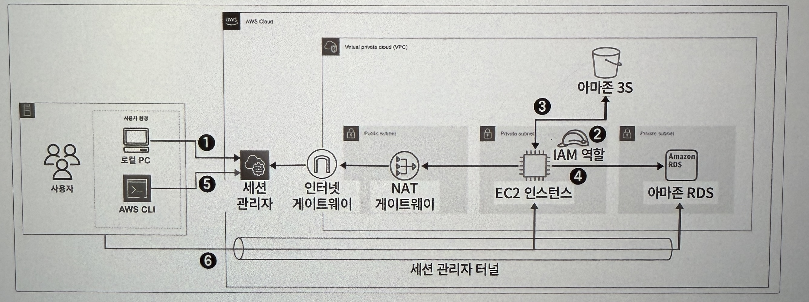
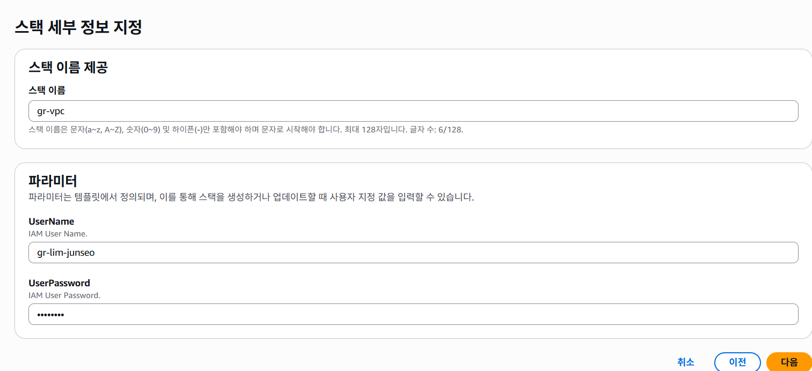
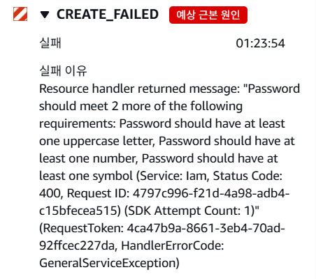
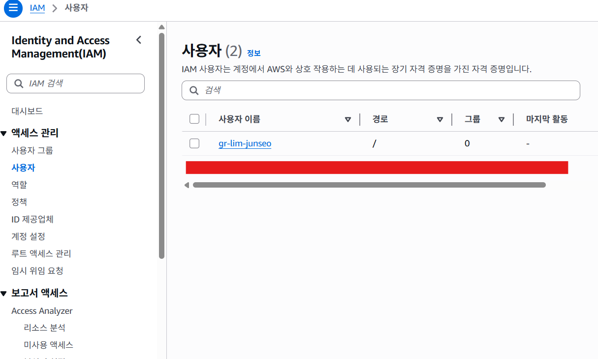

# 3. AWS를 잘 쓰려면 알아야 하는 기본 서비스

## 3.1 AWS에서 동작하는 웹 서비스 구조와 원리 파악하기

- AWS IAM : 사용자 및 AWS 리소스에 대한 액세스를 제어하는 권한 관리 서비스
- 아마존 EC2 : AWS에서 제공하는 가상 클라우드 서버
- 아마존 RDS : 다양한 데이터베이스 엔진을 제공하는 관계형 데이터베이스
- 아마존 S3 : 객체(파일 및 데이터)를 저장하는 객체 스토리지 서비스



---

## 3.2 권한 관리 서비스, AWS IAM 파악하기

### 3.2.1 AWS IAM이란?

- IAM : Identity and Access Management로 AWS 계정 내에서 각 사용자, 그룸 또는 리소스에 대한 권한을 중앙 집중적으로 관리한다.
    - 예를 들어 한 사용자에게는 EC2 인스턴스에만, 한 사용자에게는 RDS에만 접근 가능하도록 설정할 수도 있고, 특정 리소스가 특정 작업을 허용하도록 할 수도 있다.

---

### 3.2.2 AWS IAM 살펴보기

- IAM 사용자 : 개별적으로 식별되는 사용자로 AWS 리소스에 접근하는 자격증명을 보유한다.
- IAM 그룹 : IAM 사용자를 그룹으로 묶어서 관리하는 서비스이다.
- IAM 정책 : 어떤 사용자 혹은 리소스에 대해 어떤 작업이 허용되는지를 정의하는 서비스이다.
- IAM 역할 : IAM 정책을 담으며 AWS 서비스에 권한을 부여하는 데 사용되는 서비스이다.

---

## 3.3 AWS IAM 생성하기

### 3.3.1 클라우드포메이션으로 AWS 사용자 생성하기

```yaml
AWSTemplateFormatVersion: '2010-09-09'
Description: Create IAM User
# ------------------------------------------------------------#
# Input Parameters
# ------------------------------------------------------------#
Parameters: #유저 이름과 비밀번호 입력을 위한 파라미터
  UserName:
    Description: IAM User Name.
    Type: String
  UserPassword:# 비밀번호를 파라미터로 입력받는 것이 좋음
    Description: IAM User Password. 
    Type: String
    NoEcho: true # NoEcho로 파라미터를 숨길 수 있음
# ------------------------------------------------------------#
#  Create IAM User
# ------------------------------------------------------------#
Resources:
  IAMUser:
    Type: AWS::IAM::User # IAM 사용자 타입 = 유저
    Properties: # 사용자 이름, 비밀번호, 할당할 권한 지정
      UserName: !Ref UserName # 파라미터에서 입력한 유저 이름을 참조
      LoginProfile:
        Password: !Ref UserPassword # 파라미터에서 입력한 비밀번호를 참조
      ManagedPolicyArns:
        - arn:aws:iam::aws:policy/AdministratorAccess # IAM 사용자에게 관리자 권한을 할당
# ------------------------------------------------------------#
#  Create IAM AccessKey & SecretKey
# ------------------------------------------------------------#
  IAMUserAccessKey: 
    Type: AWS::IAM::AccessKey # CLI를 사용하기 위해 액세스 및 시크릿 키 생성
    Properties:
      UserName: !Ref IAMUser

  AccessKeySecretManager:
    Type: AWS::SecretsManager::Secret # 액세스 키 및 시크릿 키를 시크릿 매니저에 저장
    Properties: # 키 밸류 형태로 저장
      Name: !Sub ${IAMUser}-credentials
      SecretString: !Sub "{\"accessKeyId\":\"${IAMUserAccessKey}\",\"secretKeyId\":\"${IAMUserAccessKey.SecretAccessKey}\"}"
```

---

### 3.3.2 UI로 불러와 AWS 사용자 리소스 생성하기



클라우드포메이션에서 스택 생성하기에 위 yml 파일을 넣고 파라미터를 설정에서 UserName과 UserPassword를 설정한다.

- 스택 생성 작업 오류

  
  파라미터에 넣은 비밀번호가 조건을 만족하기 못해서 오류가 났다. 여기서 유저 비밀번호 만족 조건은 최소 하나의 대문자를 포함하며 최소 하나의 특수문자를 포함해야 한다고 한다..




스택을 생성한 뒤, IAM → 사용자에서 확인할 수 있다. 이후 액세스키와 계정 아이디를 통해 IAM 유저 로그인이 가능하다.

---

### 3.3.3 AWS CLI 환경 구성하기

https://awscli.amazonaws.com/AWSCLIV2.msi
위 주소에서 AWS CLI 를 설치할 수 있다.

설치한 뒤, powershell(windows 기준) 에서 `aws —version` 명령어를 통해 설치 여부를 확인할 수 있다.

이후 AWS 관리 콘솔에서 보안 자격증명 → 액세스 키 만들기 → 사용사례에서 CLI 선택하여 액세스키를 생성할 수 있다.

```bash
// AWS 설정 확인
aws configure list

// AWS 구성 설정 진행
aws configure

// 액세스 키, 시크릿 키, 리전, 포맷 형식 입력
	AWS Access Key ID [None] : 액세스 키
	AWS Secret Access Key [None] : 시크릿 키
	Default region name [None] : ap-northeast-2
	Default output format [None] : json
	
// AWS 구성 설정 확인
aws configure list
```

다시 powershell에서 위 명령어들을 통해 구성 및 자격증명 파일을 설정할 수 있다.

```bash
aws sts get-caller-identity
```

마지막으로 위 명령어를 통해 AWS CLI 환경 구성이 완료된 것을 확인할 수 있다.

---

### 3.3.4 AWS MFA 설정하기

```bash
aws sts get-caller-identity
```

AWS 사용자 호출을 위해 위 명령어를 입력해준 뒤,

```bash
aws iam create-virtual-mfa-device --virtual-mfa-device-name junseo-lim-mfa --bootstrap-method QRCodePNG --outfile C:\Users\Jun\Desktop\junseo-lim-mfa.png
```

위 명령어를 통해 가상 MFA 디바이스를 생성한 뒤, QR코드 이미지를 다운받을 경로를 설정하여 다운받는다.

그 결과로 나온 시리얼 넘버를 통해

```bash
aws iam enable-mfa-device --user-name junseo-lim --serial-number //시리얼 넘버 --authentication-code1 123456 --authentication-code2 789012
```

이런 명령어를 입력해주면 이제 AWS 로그인을 시도할 때 MFA 코드를 요구하게 된다.