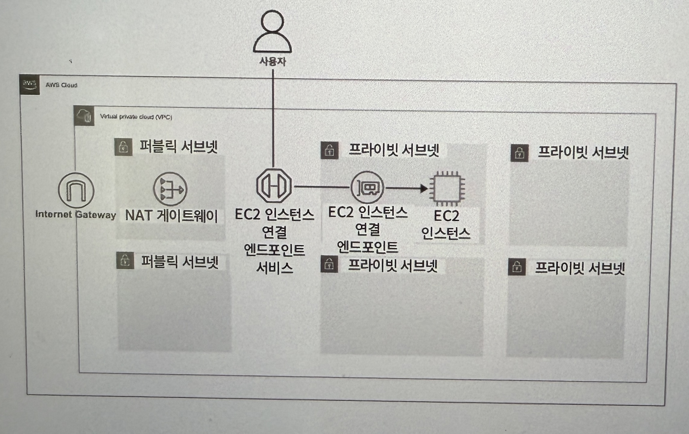
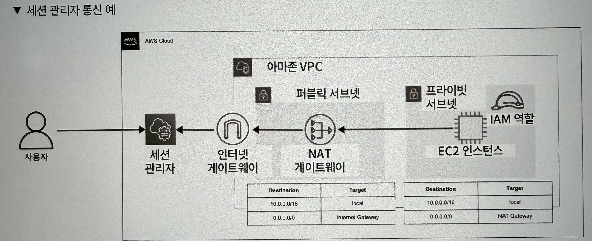
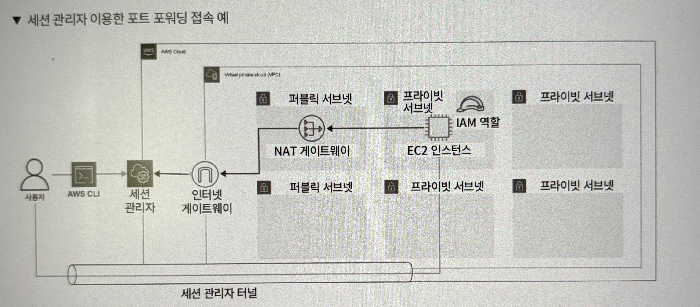

# 4. 가상 클라우드 서버 파악하기

## 4.1 가상 클라우드 서버, 아마존 EC2란?

- Amazon EC2 : Amazon Elastic Compute Cloud로, AWS에서 제공하는 가상 클라우드 서버

---

## 4.2 가상 클라우드 서버, 아마존 EC2 살펴보기

- AMI(Amazon Machine Image) : EC2 인스턴스를 시작하는 템플릿
- 인스턴스 유형 : CPU, 메모리와 같은 하드웨어의 조합
- 스토리지 옵션 : 인스턴스 스토어 볼륨, EBS 볼륨으로 구분, EC2 인스턴스의 저장 공간
- 보안 그룹 : EC2 인스턴스에 대한 네트워크 트래픽을 제어하는 가상 방화벽
- 키 페어 : EC2 인스턴스 접속에 사용되는 키

---

### 4.2.1 AMI

AMI는 EC2를 시작하는 데 필요한 소프트웨어 구성을 담고 있는 템플릿으로, OS, 애플리케이션 등을 구성하여 제공하고 있다. 대표적으로 윈동, 맥OS, 우분투, 레드햇 같은 OS를 제공한다.

AMI를 선택할 때에는 다음 4가지 분류로 나눌 수 있다.

- Quickstart AMIs : 빠른 아마존 EC2 구축을 위해 선택할 수 있는 AMI
- 내 AMI : 내가 직접 만든 AMI
- AWS Marketplace AMI : 기업이 만든 AMI이며, OS를 포함하여 워드프레스와 같은 다양한 소프트웨어가 설치된 AMI를 사용해볼 수 있다.
- 커뮤니티 AMI : 사용자가 만든 AMI로, AWS에 의해 검토를 받지 않았기 때문에 사용에 주의해야한다.

---

### 4.2.2 인스턴스 유형

| 인스턴스 유형 | 특징 | 사용 사례 |
| --- | --- | --- |
| m, t 계열 인스턴스 유형 제공 | 균형 있는 컴퓨팅, 메모리 및 네트워킹 리소스를 제공 | 범용 |
| c 계열 인스턴스 유형 제공 | 높은 계산 능력을 가지며, 일괄 처리, 동영상 인코딩에 적합 | 컴퓨팅 최적화 |
| r, x, z 계열 인스턴스 유형 제공 | 다른 인스턴스 유형에 비해 많은 메모리를 탑재하고 있으며, 고성능 DB, 빅데이터 처리와 같은 대규모 데이터 처리에 적합 | 메모리 최적화 |
| h, i, d 계열 인스턴스 유형 제공 | 높은 I/O(입출력)와 대용량 스토리지를 가지며, 높은 I/O가 요구되는 분산 파일시스템, NoSQL 데이터베이스 작업에 적합 | 스토리지 최적화 |
| p, g, f 계열 인스턴스 유형 제공 | CPU에서 실행되는 소프트웨어를 보다 효율적으로 처리하며, 기계 학습, 고성능 컴퓨팅, 실시간 비디오 처리에 적합 | 가속화된 컴퓨팅 |

| 인스턴스 옵션 | 특징 |
| --- | --- |
| a | AMD 프로세서 |
| g | AWS 그래비톤(Graviton) 프로세서 |
| i | 인텔 프로세서 |
| d | 인스턴스 스토어 볼륨(임시 스토리지) |
| n | 네트워크 및 EBS 최적화 |
| e | 추가 스토리지 또는 메모리 |
| z | 고성능 |
| flex | Flex 인스턴스(인스턴스의 저비용 버전, 예: M7iFlex) |

---

### 4.2.3 스토리지 옵션

아마존 EC2에서는 두 가지의 스토리지 옵션을 선택할 수 있는데, 인스턴스 스토어 볼륨과 EBS 볼륨이다.

- 인스턴스 볼륨 : 휘발성 스토리지이며, EBS보다 높은 IOPS 및 처리량, 낮은 대기시간으로 높은 I/O 성능이 필요한 스토리지에 이상적이다. 휘발성이기 때문에 임시로 활용되며, EC2 인스턴스에서 분리하는 것이 불가능하다.
- EBS 볼륨 : 인스턴스와 독립적으로 관리되는 서비스이며, 별도 비용이 발생한다. 백업 및 복원을 통해 데이터 손실을 방지할 수 있다. 특수한 상황이 아니라면 EBS 볼륨 사용이 권장된다.

**EBS 볼륨 유형**

EBS 볼륨 유형에서도 SSD와 HDD 로 크게 나눌 수 있으며 그 안에서도 다음처럼 분류할 수 있다.

| 볼륨 유형 | 특징 | 비고 |
| --- | --- | --- |
| 범용 SSD (gp2, gp3) | 기본 EBS 볼륨 유형이며, 비용과 성능 면에서 밸런스가 좋고 폭넓은 용도로 사용 가능 | SSD 볼륨 |
| 프로비저닝된 IOPS (io1, io2) | 미션 크리티컬하고 높은 I/O 성능이 요구되는 데이터베이스, 애플리케이션에 적합 | SSD 볼륨 |
| 처리량에 최적화된 HDD (st1) | 고속 HDD를 기반으로 사용하며 안정적인 처리량이 필요한 시스템에 적합, 로그 관리, 스트리밍, 빅데이터에 최적화 | HDD 볼륨 |
| Cold HDD (sc1) | 저비용 볼륨 유형으로 액세스 빈도가 적은 대용량 데이터를 저장하는 용도에 적합 | HDD 볼륨 |

일반적으로 범용 SSD(gp2 및 gp3)가 널리 사용된다.

**디바이스 이름**

| OS | 드라이버 타입 | 가상화 | 사용 기능 | 루트용으로 예약됨 | EBS 볼륨으로 권장 |
| --- | --- | --- | --- | --- | --- |
| 윈도우 | AWS PV | HVM | xvd[bz] <br> xvd[bc][az] <br> /dev/sda1 <br> /dev/sd[be] | /dev/sda1 | xvd[fz]* |
| 리눅스 | - | HVM | /dev/sd[az] <br> /dev/sd[az][1-15] <br> /dev/hd[az] <br> /dev/hd[az][1-15] | /dev/sda1 | /dev/sd[fp] <br> /dev/sd[fp][1-6] |
| 리눅스 | - | PV (paravirtual) | /dev/sd[a-z] <br> /dev/xvd[a-d][a-z] <br> /dev/xvd[e-z] | /dev/sda1 또는 /dev/xvda | /dev/sd[fp]* |

EBS 볼륨을 EC2 인스턴스에 연결할 때, 대상 인스턴스와 디바이스 이름을 지정할 수 있다. 디바이스 이름은 OS 및 드라이버 타입 혹은 가상화, AMI에 따라 다르며, 크게는 윈도우와 리눅스로 나눠진다.

---

### 4.2.4 보안 그룹

보안 그룹이란, 네트워크 트래픽을 관리하는 서비스로, 특정 IP 주소, IP 범위, 포트 및 프로토콜을 기반으로 특정 리소스에 대한 접근을 허용하거나 거부할 수 있다.

- 인바운드 규칙 : 외부에서 EC2 인스턴스로의 접근을 어떻게 허용 또는 제한할지 결정한다.
- 아웃바운드 규칙 : EC2 인스턴스에서 외부로 내보내는 트래픽을 어떻게 할 지 결정하며, 기본적으로 모든 트래픽이 허용으로 설정돼있다.

EC2는 프라이빗 IP주소와 퍼블릭 IP주소가 할당되는데, 퍼블릭 IP 주소는 동적으로 할당되며 가변적이다. Elastic IP를 통해 고정해서 사용할 수 있다.

---

### 4.2.5 키 페어

IP주소를 갖고 있어도 바로 EC2 서버에 접속할 수 있는 것은 아니다. 키 페어가 있어야만 EC2 인스턴스에 로그인하거나 접속하는 것이 가능하다.

키 페어에는 두 유형이 있는데, RSA와 ED25519이다. RSA가 더 범용적이고, ED25519는 빠르고 성능이 좋은 대신 윈도우에서 사용이 불가능하다.

키 파일 형식은 .pem과 .ppk로 나누어진다. pem은 OpenSSH 환경에서 사용되고, .ppk는 PuTTY에서 사용된다.

---

## 4.3 아마존 EC2 구축하기

### 4.3.1 클라우드포메이션으로 EC2 인스턴스 구축하기

- VPC.yml

    ```bash
    AWSTemplateFormatVersion: "2010-09-09"
    Description: VPC Network Set
    # ------------------------------------------------------------
    # Input Parameters
    # ------------------------------------------------------------
    Parameters:
      SystemName:
        Description: "System name of each resource names."
        Type: String
        Default: "gr"
      EnvName:
        Description: "Environment name of each resource names."
        Type: String
        Default: "product"
      VPCParam: 
        Description: gr-product-vpc
        Type: String
        Default: 10.0.0.0/24
      PublicSubnet1aParam: 
        Description: gr-product-public-subnet-1a
        Type: String
        Default: 10.0.0.0/27
      PublicSubnet1bParam: 
        Description: gr-product-public-subnet-1b
        Type: String
        Default: 10.0.0.32/27
      WebSubnet1aParam: 
        Description: gr-product-web-subnet-1a
        Type: String
        Default: 10.0.0.64/27
      WebSubnet1bParam: 
        Description: gr-product-web-subnet-1b
        Type: String
        Default: 10.0.0.96/27
      DatastoreSubnet1aParam: 
        Description: gr-product-datastore-subnet-1a
        Type: String
        Default: 10.0.0.128/27
      DatastoreSubnet1bParam: 
        Description: gr-product-datastore-subnet-1b
        Type: String
        Default: 10.0.0.160/27
    #-------------------------------------------------------------------
    # Create VPC、Subnet
    #-------------------------------------------------------------------
    Resources:
      VPC: 
        Type: AWS::EC2::VPC
        Properties: 
          CidrBlock: !Ref VPCParam
          EnableDnsSupport: "true"
          EnableDnsHostnames: "true"
          InstanceTenancy: default
          Tags: 
            - Key: Name
              Value: !Sub ${SystemName}-${EnvName}-vpc
            - Key: Env
              Value: !Sub ${EnvName}
      PublicSubnet1a: 
        Type: AWS::EC2::Subnet
        Properties: 
          AvailabilityZone:
            Fn::Select: 
            - 0
            - Fn::GetAZs: ""
          CidrBlock: !Ref PublicSubnet1aParam
          VpcId: !Ref VPC 
          Tags: 
            - Key: Name
              Value: !Sub ${SystemName}-${EnvName}-public-subnet-1a
            - Key: Env
              Value: !Sub ${EnvName}
      PublicSubnet1b: 
        Type: AWS::EC2::Subnet
        Properties: 
          AvailabilityZone:
            Fn::Select: 
            - 1
            - Fn::GetAZs: ""
          CidrBlock: !Ref PublicSubnet1bParam
          VpcId: !Ref VPC 
          Tags: 
            - Key: Name
              Value: !Sub ${SystemName}-${EnvName}-public-subnet-1b
            - Key: Env
              Value: !Sub ${EnvName}
      WebSubnet1a: 
        Type: AWS::EC2::Subnet
        Properties: 
          AvailabilityZone:
            Fn::Select: 
            - 0
            - Fn::GetAZs: ""
          CidrBlock: !Ref WebSubnet1aParam
          VpcId: !Ref VPC 
          Tags: 
            - Key: Name
              Value: !Sub ${SystemName}-${EnvName}-web-subnet-1a
            - Key: Env
              Value: !Sub ${EnvName}
      WebSubnet1b: 
        Type: AWS::EC2::Subnet
        Properties: 
          AvailabilityZone:
            Fn::Select: 
            - 1
            - Fn::GetAZs: ""
          CidrBlock: !Ref WebSubnet1bParam
          VpcId: !Ref VPC 
          Tags: 
            - Key: Name
              Value: !Sub ${SystemName}-${EnvName}-web-subnet-1b
            - Key: Env
              Value: !Sub ${EnvName}
      DatastoreSubnet1a: 
        Type: AWS::EC2::Subnet
        Properties: 
          AvailabilityZone:
            Fn::Select: 
            - 0
            - Fn::GetAZs: ""
          CidrBlock: !Ref DatastoreSubnet1aParam
          VpcId: !Ref VPC 
          Tags: 
            - Key: Name
              Value: !Sub ${SystemName}-${EnvName}-datastore-subnet-1a
            - Key: Env
              Value: !Sub ${EnvName}
      DatastoreSubnet1b: 
        Type: AWS::EC2::Subnet
        Properties: 
          AvailabilityZone:
            Fn::Select: 
            - 1
            - Fn::GetAZs: ""
          CidrBlock: !Ref DatastoreSubnet1bParam
          VpcId: !Ref VPC 
          Tags: 
            - Key: Name
              Value: !Sub ${SystemName}-${EnvName}-datastore-subnet-1b
            - Key: Env
              Value: !Sub ${EnvName}
    #-------------------------------------------------------------------
    # Create Internet Gateway
    #-------------------------------------------------------------------
      InternetGateway: 
        Type: AWS::EC2::InternetGateway
        Properties: 
          Tags: 
            - Key: Name
              Value: !Sub ${SystemName}-${EnvName}-igw
            - Key: Env
              Value: !Sub ${EnvName}
      InternetGatewayAttachment: 
        Type: AWS::EC2::VPCGatewayAttachment
        Properties: 
          InternetGatewayId: !Ref InternetGateway
          VpcId: !Ref VPC
    #-------------------------------------------------------------------
    # Create Route Tables
    #-------------------------------------------------------------------
      PublicRTB : 
          Type: AWS::EC2::RouteTable
          Properties: 
            VpcId: !Ref VPC 
            Tags: 
              - Key: Name
                Value: !Sub ${SystemName}-${EnvName}-public-rtb
              - Key: Env
                Value: !Sub ${EnvName}
      WebRTB : 
          Type: AWS::EC2::RouteTable
          Properties: 
            VpcId: !Ref VPC 
            Tags: 
              - Key: Name
                Value: !Sub ${SystemName}-${EnvName}-web-rtb
              - Key: Env
                Value: !Sub ${EnvName}
      DatastoreRTB : 
          Type: AWS::EC2::RouteTable
          Properties: 
            VpcId: !Ref VPC 
            Tags: 
              - Key: Name
                Value: !Sub ${SystemName}-${EnvName}-datastore-rtb
              - Key: Env
                Value: !Sub ${EnvName}
    #-------------------------------------------------------------------
    # Route Set
    #-------------------------------------------------------------------
      PublicRoute: 
        Type: AWS::EC2::Route
        Properties: 
          RouteTableId: !Ref PublicRTB
          DestinationCidrBlock: "0.0.0.0/0"
          GatewayId: !Ref InternetGateway
    #-------------------------------------------------------------------
    # Route Tables Subnet Association
    #-------------------------------------------------------------------
      PublicRTBAssociation1: 
        Type: AWS::EC2::SubnetRouteTableAssociation
        Properties: 
          SubnetId: !Ref PublicSubnet1a
          RouteTableId: !Ref PublicRTB
      PublicRTBAssociation2: 
        Type: AWS::EC2::SubnetRouteTableAssociation
        Properties: 
          SubnetId: !Ref PublicSubnet1b
          RouteTableId: !Ref PublicRTB
      WebRTBAssociation1: 
        Type: AWS::EC2::SubnetRouteTableAssociation
        Properties: 
          SubnetId: !Ref WebSubnet1a
          RouteTableId: !Ref WebRTB
      WebRTBAssociation2: 
        Type: AWS::EC2::SubnetRouteTableAssociation
        Properties: 
          SubnetId: !Ref WebSubnet1b
          RouteTableId: !Ref WebRTB
      DatastoreRTBAssociation1: 
        Type: AWS::EC2::SubnetRouteTableAssociation
        Properties: 
          SubnetId: !Ref DatastoreSubnet1a
          RouteTableId: !Ref DatastoreRTB
      DatastoreRTBAssociation2: 
        Type: AWS::EC2::SubnetRouteTableAssociation
        Properties: 
          SubnetId: !Ref DatastoreSubnet1b
          RouteTableId: !Ref DatastoreRTB
    # ------------------------------------------------------------
    # Output Parameters
    # ------------------------------------------------------------
    Outputs:
    # VPC
      VPC:
        Value: !Ref VPC
        Export:
          Name: !Sub ${EnvName}-vpc
    # public-subnet
      PublicSubnet1a:
        Value: !Ref PublicSubnet1a
        Export:
          Name: !Sub ${EnvName}-public-subnet-1a
      PublicSubnet1b:
        Value: !Ref PublicSubnet1b
        Export:
          Name: !Sub ${EnvName}-public-subnet-1b
    # Web-subnet
      WebSubnet1a:
        Value: !Ref WebSubnet1a
        Export:
          Name: !Sub ${EnvName}-web-subnet-1a
      WebSubnet1c:
        Value: !Ref WebSubnet1b
        Export:
          Name: !Sub ${EnvName}-web-subnet-1b
    # Datastore-subnet
      DatastoreSubnet1a:
        Value: !Ref DatastoreSubnet1a
        Export:
          Name: !Sub ${EnvName}-datastore-subnet-1a
      DatastoreSubnet1c:
        Value: !Ref DatastoreSubnet1b
        Export:
          Name: !Sub ${EnvName}-datastore-subnet-1b
    ```

- Security_Group.yml

    ```bash
    AWSTemplateFormatVersion: "2010-09-09"
    Description: Create Security Group
    # ------------------------------------------------------------#
    # Input Parameters
    # ------------------------------------------------------------# 
    Parameters:
      SystemName:
        Description: "System name of each resource names."
        Type: String
        Default: "gr"
      EnvName:
        Description: "Environment name of each resource names."
        Type: String
        Default: "product"
    # ------------------------------------------------------------#
    #  Create Security Group
    # ------------------------------------------------------------#
    Resources:
      EC2SecurityGroup:
        Type: AWS::EC2::SecurityGroup # 보안 그룹을 생성
        Properties:
          GroupName: !Sub ${SystemName}-${EnvName}-ec2-sg # 보안 그룹 이름을 지정
          GroupDescription: !Sub ${SystemName}-${EnvName}-ec2-sg # 보안 그룹 설명
          SecurityGroupIngress: # 허용할 IP 주소 설정
                - IpProtocol: tcp
                  FromPort: 22
                  ToPort: 22
                  CidrIp: 0.0.0.0/0
          VpcId:
            Fn::ImportValue: !Sub ${EnvName}-vpc
          Tags: 
            - Key: Name
              Value: !Sub ${SystemName}-${EnvName}-ec2-sg
            - Key: Env
              Value: !Sub ${EnvName}
    # ------------------------------------------------------------
    # Output Parameters
    # ------------------------------------------------------------
    Outputs:
    # Security Groups
      EC2SecurityGroup:
        Value: !Ref EC2SecurityGroup
        Export:
          Name: !Sub ${EnvName}-ec2-sg
    
    ```

- EC2.yml

    ```bash
    AWSTemplateFormatVersion: "2010-09-09"
    Description: Create EC2
    # ------------------------------------------------------------#
    # Input Parameters
    # ------------------------------------------------------------# 
    Parameters:
      SystemName:
        Description: "System name of each resource names."
        Type: String
        Default: "gr"
      EnvName:
        Description: "Environment name of each resource names."
        Type: String
        Default: "product"
      KeyPairName: 
        Description: gr-product-ec2 EC2 Key Pair
        Type: String
        Default: gr-product-ec2-key
      EC2AMI: 
        Description: gr-product-ec2 EC2 AMI
        Type: String
        Default: ami-02d081c743d676996
      InstanceType:
        Description: gr-product-ec2 EC2 instance type
        Type: String
        Default: t2.micro
    # ------------------------------------------------------------#
    #  Create EC2 Instance 
    # ------------------------------------------------------------#
    Resources:
      NewKeyPair:
        Type: AWS::EC2::KeyPair
        Properties:
          KeyName: !Ref KeyPairName
      EC2Instance:
        Type: AWS::EC2::Instance
        Properties:
          ImageId: !Ref EC2AMI
          InstanceType: !Ref InstanceType
          KeyName: !Ref NewKeyPair
          NetworkInterfaces:
            - DeviceIndex: 0
              SubnetId: { "Fn::ImportValue": !Sub "${EnvName}-public-subnet-1a" }
              GroupSet:
              - Fn::ImportValue: !Sub ${EnvName}-ec2-sg
              AssociatePublicIpAddress: true
          BlockDeviceMappings:
            - DeviceName: /dev/xvda
              Ebs:
                VolumeSize: 100
                VolumeType: gp3
                Encrypted : true
          Tags: 
            - Key: Name
              Value: !Sub ${SystemName}-${EnvName}-ec2
            - Key: Env
              Value: !Sub ${EnvName}
    # ------------------------------------------------------------
    # Output Parameters
    # ------------------------------------------------------------
    Outputs:
    # EC2
      EC2Instance:
        Value: !Ref EC2Instance
        Export:
          Name: !Sub ${EnvName}-ec2
    
    ```


위 세 yml파일을 통해 클라우드포메이션 스택을 생성한다.

이후 보안그룹과 EC2 인스턴스를 확인할 수 있다.

---

## 4.4 아마존 EC2 접속 패턴 살펴보기

### 4.4.1 인터넷을 통한 EC2 접속

사용자가 인터넷 게이트웨이를 통해 EC2 인스턴스로 접근하는 방식으로, 터미널 혹은 테라텀을 이용해서 접근하거나 EC2 인스턴스 화면에서 연결할 수 있다. 간단하지만 EC2 인스턴스를 인터넷에 노출시키고 있기 때문에 권장되지는 않는다.

---

### 4.4.2 EC2 인스턴스 연결 엔드포인트 이용

EIC(EC2 Instance Connect Endpoint)를 활용하여 인터넷 게이트웨이, NAT 게이트웨이 없이 EC2 인스턴스로 접속할 수 있는 서비스이다. 추가 비용은 없으며 표준 데이터 전송 요금만 적용된다.

- VPC.yml

    ```bash
    AWSTemplateFormatVersion: "2010-09-09"
    Description: VPC Network Set
    # ------------------------------------------------------------
    # Input Parameters
    # ------------------------------------------------------------
    Parameters:
      SystemName:
        Description: "System name of each resource names."
        Type: String
        Default: "gr"
      EnvName:
        Description: "Environment name of each resource names."
        Type: String
        Default: "product"
      VPCParam: 
        Description: gr-product-vpc
        Type: String
        Default: 10.0.0.0/24
      PublicSubnet1aParam: 
        Description: gr-product-public-subnet-1a
        Type: String
        Default: 10.0.0.0/27
      PublicSubnet1bParam: 
        Description: gr-product-public-subnet-1b
        Type: String
        Default: 10.0.0.32/27
      WebSubnet1aParam: 
        Description: gr-product-web-subnet-1a
        Type: String
        Default: 10.0.0.64/27
      WebSubnet1bParam: 
        Description: gr-product-web-subnet-1b
        Type: String
        Default: 10.0.0.96/27
      DatastoreSubnet1aParam: 
        Description: gr-product-datastore-subnet-1a
        Type: String
        Default: 10.0.0.128/27
      DatastoreSubnet1bParam: 
        Description: gr-product-datastore-subnet-1b
        Type: String
        Default: 10.0.0.160/27
    #-------------------------------------------------------------------
    # Create VPC、Subnet
    #-------------------------------------------------------------------
    Resources:
      VPC: 
        Type: AWS::EC2::VPC
        Properties: 
          CidrBlock: !Ref VPCParam
          EnableDnsSupport: "true"
          EnableDnsHostnames: "true"
          InstanceTenancy: default
          Tags: 
            - Key: Name
              Value: !Sub ${SystemName}-${EnvName}-vpc
            - Key: Env
              Value: !Sub ${EnvName}
      PublicSubnet1a: 
        Type: AWS::EC2::Subnet
        Properties: 
          AvailabilityZone:
            Fn::Select: 
            - 0
            - Fn::GetAZs: ""
          CidrBlock: !Ref PublicSubnet1aParam
          VpcId: !Ref VPC 
          Tags: 
            - Key: Name
              Value: !Sub ${SystemName}-${EnvName}-public-subnet-1a
            - Key: Env
              Value: !Sub ${EnvName}
      PublicSubnet1b: 
        Type: AWS::EC2::Subnet
        Properties: 
          AvailabilityZone:
            Fn::Select: 
            - 1
            - Fn::GetAZs: ""
          CidrBlock: !Ref PublicSubnet1bParam
          VpcId: !Ref VPC 
          Tags: 
            - Key: Name
              Value: !Sub ${SystemName}-${EnvName}-public-subnet-1b
            - Key: Env
              Value: !Sub ${EnvName}
      WebSubnet1a: 
        Type: AWS::EC2::Subnet
        Properties: 
          AvailabilityZone:
            Fn::Select: 
            - 0
            - Fn::GetAZs: ""
          CidrBlock: !Ref WebSubnet1aParam
          VpcId: !Ref VPC 
          Tags: 
            - Key: Name
              Value: !Sub ${SystemName}-${EnvName}-web-subnet-1a
            - Key: Env
              Value: !Sub ${EnvName}
      WebSubnet1b: 
        Type: AWS::EC2::Subnet
        Properties: 
          AvailabilityZone:
            Fn::Select: 
            - 1
            - Fn::GetAZs: ""
          CidrBlock: !Ref WebSubnet1bParam
          VpcId: !Ref VPC 
          Tags: 
            - Key: Name
              Value: !Sub ${SystemName}-${EnvName}-web-subnet-1b
            - Key: Env
              Value: !Sub ${EnvName}
      DatastoreSubnet1a: 
        Type: AWS::EC2::Subnet
        Properties: 
          AvailabilityZone:
            Fn::Select: 
            - 0
            - Fn::GetAZs: ""
          CidrBlock: !Ref DatastoreSubnet1aParam
          VpcId: !Ref VPC 
          Tags: 
            - Key: Name
              Value: !Sub ${SystemName}-${EnvName}-datastore-subnet-1a
            - Key: Env
              Value: !Sub ${EnvName}
      DatastoreSubnet1b: 
        Type: AWS::EC2::Subnet
        Properties: 
          AvailabilityZone:
            Fn::Select: 
            - 1
            - Fn::GetAZs: ""
          CidrBlock: !Ref DatastoreSubnet1bParam
          VpcId: !Ref VPC 
          Tags: 
            - Key: Name
              Value: !Sub ${SystemName}-${EnvName}-datastore-subnet-1b
            - Key: Env
              Value: !Sub ${EnvName}
    #-------------------------------------------------------------------
    # Create Internet Gateway
    #-------------------------------------------------------------------
      InternetGateway: 
        Type: AWS::EC2::InternetGateway
        Properties: 
          Tags: 
            - Key: Name
              Value: !Sub ${SystemName}-${EnvName}-igw
            - Key: Env
              Value: !Sub ${EnvName}
      InternetGatewayAttachment: 
        Type: AWS::EC2::VPCGatewayAttachment
        Properties: 
          InternetGatewayId: !Ref InternetGateway
          VpcId: !Ref VPC
    #-------------------------------------------------------------------
    # Create EIP、NAT Gateway
    #-------------------------------------------------------------------
      EIP:
        Type: AWS::EC2::EIP
        Properties:
          Tags: 
            - Key: Name
              Value: !Sub ${SystemName}-${EnvName}-eip
            - Key: Env
              Value: !Sub ${EnvName}
      NATGateway:
        Type: AWS::EC2::NatGateway
        DependsOn: InternetGatewayAttachment
        Properties:
          AllocationId: !GetAtt EIP.AllocationId
          SubnetId: !Ref PublicSubnet1a
          Tags: 
            - Key: Name
              Value: !Sub ${SystemName}-${EnvName}-nat
            - Key: Env
              Value: !Sub ${EnvName}
    # ------------------------------------------------------------
    # EC2 Instance Connect Endpoint
    # ------------------------------------------------------------
      EicSg:
        Type: AWS::EC2::SecurityGroup
        Properties:
          GroupName: !Sub ${SystemName}-${EnvName}-sg-eic
          GroupDescription: !Sub ${SystemName}-${EnvName}-sg-eic
          VpcId: !Ref VPC
          SecurityGroupEgress:
            - IpProtocol: -1
              CidrIp: 0.0.0.0/0
          Tags:
            - Key: Name
              Value: !Sub ${SystemName}-${EnvName}-sg-eic
      Eic:
        Type: AWS::EC2::InstanceConnectEndpoint
        Properties:
          SecurityGroupIds:
            - !Ref EicSg
          SubnetId: !Ref WebSubnet1a
          Tags:
            - Key: Name
              Value: !Sub ${SystemName}-${EnvName}-eic
    #-------------------------------------------------------------------
    # Create Route Tables
    #-------------------------------------------------------------------
      PublicRTB : 
          Type: AWS::EC2::RouteTable
          Properties: 
            VpcId: !Ref VPC 
            Tags: 
              - Key: Name
                Value: !Sub ${SystemName}-${EnvName}-public-rtb
              - Key: Env
                Value: !Sub ${EnvName}
      WebRTB : 
          Type: AWS::EC2::RouteTable
          Properties: 
            VpcId: !Ref VPC 
            Tags: 
              - Key: Name
                Value: !Sub ${SystemName}-${EnvName}-web-rtb
              - Key: Env
                Value: !Sub ${EnvName}
      DatastoreRTB : 
          Type: AWS::EC2::RouteTable
          Properties: 
            VpcId: !Ref VPC 
            Tags: 
              - Key: Name
                Value: !Sub ${SystemName}-${EnvName}-datastore-rtb
              - Key: Env
                Value: !Sub ${EnvName}
    #-------------------------------------------------------------------
    # Route Set
    #-------------------------------------------------------------------
      PublicRoute: 
        Type: AWS::EC2::Route
        Properties: 
          RouteTableId: !Ref PublicRTB
          DestinationCidrBlock: "0.0.0.0/0"
          GatewayId: !Ref InternetGateway
      WebRoute: 
        Type: AWS::EC2::Route
        Properties: 
          RouteTableId: !Ref WebRTB
          DestinationCidrBlock: "0.0.0.0/0"
          NatGatewayId: !Ref NATGateway
    #-------------------------------------------------------------------
    # Route Tables Subnet Association
    #-------------------------------------------------------------------
      PublicRTBAssociation1: 
        Type: AWS::EC2::SubnetRouteTableAssociation
        Properties: 
          SubnetId: !Ref PublicSubnet1a
          RouteTableId: !Ref PublicRTB
      PublicRTBAssociation2: 
        Type: AWS::EC2::SubnetRouteTableAssociation
        Properties: 
          SubnetId: !Ref PublicSubnet1b
          RouteTableId: !Ref PublicRTB
      WebRTBAssociation1: 
        Type: AWS::EC2::SubnetRouteTableAssociation
        Properties: 
          SubnetId: !Ref WebSubnet1a
          RouteTableId: !Ref WebRTB
      WebRTBAssociation2: 
        Type: AWS::EC2::SubnetRouteTableAssociation
        Properties: 
          SubnetId: !Ref WebSubnet1b
          RouteTableId: !Ref WebRTB
      DatastoreRTBAssociation1: 
        Type: AWS::EC2::SubnetRouteTableAssociation
        Properties: 
          SubnetId: !Ref DatastoreSubnet1a
          RouteTableId: !Ref DatastoreRTB
      DatastoreRTBAssociation2: 
        Type: AWS::EC2::SubnetRouteTableAssociation
        Properties: 
          SubnetId: !Ref DatastoreSubnet1b
          RouteTableId: !Ref DatastoreRTB
    # ------------------------------------------------------------
    # Output Parameters
    # ------------------------------------------------------------
    Outputs:
    # VPC
      VPC:
        Value: !Ref VPC
        Export:
          Name: !Sub ${EnvName}-vpc
    # public-subnet
      PublicSubnet1a:
        Value: !Ref PublicSubnet1a
        Export:
          Name: !Sub ${EnvName}-public-subnet-1a
      PublicSubnet1b:
        Value: !Ref PublicSubnet1b
        Export:
          Name: !Sub ${EnvName}-public-subnet-1b
    # Web-subnet
      WebSubnet1a:
        Value: !Ref WebSubnet1a
        Export:
          Name: !Sub ${EnvName}-web-subnet-1a
      WebSubnet1c:
        Value: !Ref WebSubnet1b
        Export:
          Name: !Sub ${EnvName}-web-subnet-1b
    # Datastore-subnet
      DatastoreSubnet1a:
        Value: !Ref DatastoreSubnet1a
        Export:
          Name: !Sub ${EnvName}-datastore-subnet-1a
      DatastoreSubnet1c:
        Value: !Ref DatastoreSubnet1b
        Export:
          Name: !Sub ${EnvName}-datastore-subnet-1b
    # EIC-sg
      EicSg:
        Value: !Ref EicSg
        Export:
          Name: !Sub ${EnvName}-sg-eic
    ```

- Security_Group.yml

    ```bash
    AWSTemplateFormatVersion: "2010-09-09"
    Description: Create Security Group
    # ------------------------------------------------------------#
    # Input Parameters
    # ------------------------------------------------------------# 
    Parameters:
      SystemName:
        Description: "System name of each resource names."
        Type: String
        Default: "gr"
      EnvName:
        Description: "Environment name of each resource names."
        Type: String
        Default: "product"
    # ------------------------------------------------------------#
    #  Create Security Group
    # ------------------------------------------------------------#
    Resources:
      EC2SecurityGroup:
        Type: AWS::EC2::SecurityGroup # 보안 그룹을 생성
        Properties:
          GroupName: !Sub ${SystemName}-${EnvName}-ec2-sg # 보안 그룹 이름을 지정
          GroupDescription: !Sub ${SystemName}-${EnvName}-ec2-sg # 보안 그룹 설명
          SecurityGroupIngress: # 허용할 IP 주소 설정
                - IpProtocol: tcp
                  FromPort: 22
                  ToPort: 22
                  SourceSecurityGroupId:
                    Fn::ImportValue: !Sub ${EnvName}-sg-eic
          VpcId:
            Fn::ImportValue: !Sub ${EnvName}-vpc
          Tags: 
            - Key: Name
              Value: !Sub ${SystemName}-${EnvName}-ec2-sg
            - Key: Env
              Value: !Sub ${EnvName}
    # ------------------------------------------------------------
    # Output Parameters
    # ------------------------------------------------------------
    Outputs:
    # Security Groups
      EC2SecurityGroup:
        Value: !Ref EC2SecurityGroup
        Export:
          Name: !Sub ${EnvName}-ec2-sg
    ```

- EC2.yml

    ```bash
    AWSTemplateFormatVersion: "2010-09-09"
    Description: Create EC2
    # ------------------------------------------------------------#
    # Input Parameters
    # ------------------------------------------------------------# 
    Parameters:
      SystemName:
        Description: "System name of each resource names."
        Type: String
        Default: "gr"
      EnvName:
        Description: "Environment name of each resource names."
        Type: String
        Default: "product"
      KeyPairName: 
        Description: gr-product-ec2 EC2 Key Pair
        Type: String
        Default: gr-product-ec2-key
      EC2AMI: 
        Description: gr-product-ec2 EC2 AMI
        Type: String
        Default: ami-02d081c743d676996
      InstanceType:
        Description: gr-product-ec2 EC2 instance type
        Type: String
        Default: t2.micro
    # ------------------------------------------------------------#
    #  Create EC2 Instance 
    # ------------------------------------------------------------#
    Resources:
      NewKeyPair:
        Type: AWS::EC2::KeyPair
        Properties:
          KeyName: !Ref KeyPairName
      EC2Instance:
        Type: AWS::EC2::Instance
        Properties:
          ImageId: !Ref EC2AMI
          InstanceType: !Ref InstanceType
          KeyName: !Ref NewKeyPair
          BlockDeviceMappings:
            - DeviceName: /dev/xvda
              Ebs:
                VolumeSize: 100
                VolumeType: gp3
                Encrypted : true
          SecurityGroupIds:
            - Fn::ImportValue: !Sub ${EnvName}-ec2-sg
          SubnetId:
            Fn::ImportValue: !Sub ${EnvName}-web-subnet-1a
          Tags: 
            - Key: Name
              Value: !Sub ${SystemName}-${EnvName}-ec2
            - Key: Env
              Value: !Sub ${EnvName}
    # ------------------------------------------------------------
    # Output Parameters
    # ------------------------------------------------------------
    Outputs:
    # EC2
      EC2Instance:
        Value: !Ref EC2Instance
        Export:
          Name: !Sub ${EnvName}-ec2
    ```




---

### 4.4.3 세션 관리자 이용한 콘솔에서의 접속

퍼블릭 서브넷에 NAT 게이트웨이를 생성하고, EC2 인스턴스에서는 세션 관리자를 사용할 수 있는 권한을 부여한다. 세션 관리자를 사용하려면 EC2 인스턴스에 권한을 부여해야 하며, 외부에서 인터넷을 통해 접속하는 것이 아닌 세션 관리자를 통해 안전하게 접속한다.

- VPC.yml

    ```bash
    AWSTemplateFormatVersion: "2010-09-09"
    Description: VPC Network Set
    # ------------------------------------------------------------
    # Input Parameters
    # ------------------------------------------------------------
    Parameters:
      SystemName:
        Description: "System name of each resource names."
        Type: String
        Default: "gr"
      EnvName:
        Description: "Environment name of each resource names."
        Type: String
        Default: "product"
      VPCParam: 
        Description: gr-product-vpc
        Type: String
        Default: 10.0.0.0/24
      PublicSubnet1aParam: 
        Description: gr-product-public-subnet-1a
        Type: String
        Default: 10.0.0.0/27
      PublicSubnet1bParam: 
        Description: gr-product-public-subnet-1b
        Type: String
        Default: 10.0.0.32/27
      WebSubnet1aParam: 
        Description: gr-product-web-subnet-1a
        Type: String
        Default: 10.0.0.64/27
      WebSubnet1bParam: 
        Description: gr-product-web-subnet-1b
        Type: String
        Default: 10.0.0.96/27
      DatastoreSubnet1aParam: 
        Description: gr-product-datastore-subnet-1a
        Type: String
        Default: 10.0.0.128/27
      DatastoreSubnet1bParam: 
        Description: gr-product-datastore-subnet-1b
        Type: String
        Default: 10.0.0.160/27
    #-------------------------------------------------------------------
    # Create VPC、Subnet
    #-------------------------------------------------------------------
    Resources:
      VPC: 
        Type: AWS::EC2::VPC
        Properties: 
          CidrBlock: !Ref VPCParam
          EnableDnsSupport: "true"
          EnableDnsHostnames: "true"
          InstanceTenancy: default
          Tags: 
            - Key: Name
              Value: !Sub ${SystemName}-${EnvName}-vpc
            - Key: Env
              Value: !Sub ${EnvName}
      PublicSubnet1a: 
        Type: AWS::EC2::Subnet
        Properties: 
          AvailabilityZone:
            Fn::Select: 
            - 0
            - Fn::GetAZs: ""
          CidrBlock: !Ref PublicSubnet1aParam
          VpcId: !Ref VPC 
          Tags: 
            - Key: Name
              Value: !Sub ${SystemName}-${EnvName}-public-subnet-1a
            - Key: Env
              Value: !Sub ${EnvName}
      PublicSubnet1b: 
        Type: AWS::EC2::Subnet
        Properties: 
          AvailabilityZone:
            Fn::Select: 
            - 1
            - Fn::GetAZs: ""
          CidrBlock: !Ref PublicSubnet1bParam
          VpcId: !Ref VPC 
          Tags: 
            - Key: Name
              Value: !Sub ${SystemName}-${EnvName}-public-subnet-1b
            - Key: Env
              Value: !Sub ${EnvName}
      WebSubnet1a: 
        Type: AWS::EC2::Subnet
        Properties: 
          AvailabilityZone:
            Fn::Select: 
            - 0
            - Fn::GetAZs: ""
          CidrBlock: !Ref WebSubnet1aParam
          VpcId: !Ref VPC 
          Tags: 
            - Key: Name
              Value: !Sub ${SystemName}-${EnvName}-web-subnet-1a
            - Key: Env
              Value: !Sub ${EnvName}
      WebSubnet1b: 
        Type: AWS::EC2::Subnet
        Properties: 
          AvailabilityZone:
            Fn::Select: 
            - 1
            - Fn::GetAZs: ""
          CidrBlock: !Ref WebSubnet1bParam
          VpcId: !Ref VPC 
          Tags: 
            - Key: Name
              Value: !Sub ${SystemName}-${EnvName}-web-subnet-1b
            - Key: Env
              Value: !Sub ${EnvName}
      DatastoreSubnet1a: 
        Type: AWS::EC2::Subnet
        Properties: 
          AvailabilityZone:
            Fn::Select: 
            - 0
            - Fn::GetAZs: ""
          CidrBlock: !Ref DatastoreSubnet1aParam
          VpcId: !Ref VPC 
          Tags: 
            - Key: Name
              Value: !Sub ${SystemName}-${EnvName}-datastore-subnet-1a
            - Key: Env
              Value: !Sub ${EnvName}
      DatastoreSubnet1b: 
        Type: AWS::EC2::Subnet
        Properties: 
          AvailabilityZone:
            Fn::Select: 
            - 1
            - Fn::GetAZs: ""
          CidrBlock: !Ref DatastoreSubnet1bParam
          VpcId: !Ref VPC 
          Tags: 
            - Key: Name
              Value: !Sub ${SystemName}-${EnvName}-datastore-subnet-1b
            - Key: Env
              Value: !Sub ${EnvName}
    #-------------------------------------------------------------------
    # Create Internet Gateway
    #-------------------------------------------------------------------
      InternetGateway: 
        Type: AWS::EC2::InternetGateway
        Properties: 
          Tags: 
            - Key: Name
              Value: !Sub ${SystemName}-${EnvName}-igw
            - Key: Env
              Value: !Sub ${EnvName}
      InternetGatewayAttachment: 
        Type: "AWS::EC2::VPCGatewayAttachment"
        Properties: 
          InternetGatewayId: !Ref InternetGateway
          VpcId: !Ref VPC
    #-------------------------------------------------------------------
    # Create EIP、NAT Gateway
    #-------------------------------------------------------------------
      EIP:
        Type: AWS::EC2::EIP
        Properties:
          Tags: 
            - Key: Name
              Value: !Sub ${SystemName}-${EnvName}-eip
            - Key: Env
              Value: !Sub ${EnvName}
      NATGateway:
        Type: AWS::EC2::NatGateway
        DependsOn: InternetGatewayAttachment
        Properties:
          AllocationId: !GetAtt EIP.AllocationId
          SubnetId: !Ref PublicSubnet1a
          Tags: 
            - Key: Name
              Value: !Sub ${SystemName}-${EnvName}-nat
            - Key: Env
              Value: !Sub ${EnvName}
    #-------------------------------------------------------------------
    # Create Route Tables
    #-------------------------------------------------------------------
      PublicRTB : 
          Type: AWS::EC2::RouteTable
          Properties: 
            VpcId: !Ref VPC 
            Tags: 
              - Key: Name
                Value: !Sub ${SystemName}-${EnvName}-public-rtb
              - Key: Env
                Value: !Sub ${EnvName}
      WebRTB : 
          Type: AWS::EC2::RouteTable
          Properties: 
            VpcId: !Ref VPC 
            Tags: 
              - Key: Name
                Value: !Sub ${SystemName}-${EnvName}-web-rtb
              - Key: Env
                Value: !Sub ${EnvName}
      DatastoreRTB : 
          Type: AWS::EC2::RouteTable
          Properties: 
            VpcId: !Ref VPC 
            Tags: 
              - Key: Name
                Value: !Sub ${SystemName}-${EnvName}-datastore-rtb
              - Key: Env
                Value: !Sub ${EnvName}
    #-------------------------------------------------------------------
    # Route Set
    #-------------------------------------------------------------------
      PublicRoute: 
        Type: AWS::EC2::Route
        Properties: 
          RouteTableId: !Ref PublicRTB
          DestinationCidrBlock: "0.0.0.0/0"
          GatewayId: !Ref InternetGateway
      WebRoute: 
        Type: AWS::EC2::Route
        Properties: 
          RouteTableId: !Ref WebRTB
          DestinationCidrBlock: "0.0.0.0/0"
          NatGatewayId: !Ref NATGateway
    #-------------------------------------------------------------------
    # Route Tables Subnet Association
    #-------------------------------------------------------------------
      PublicRTBAssociation1: 
        Type: AWS::EC2::SubnetRouteTableAssociation
        Properties: 
          SubnetId: !Ref PublicSubnet1a
          RouteTableId: !Ref PublicRTB
      PublicRTBAssociation2: 
        Type: AWS::EC2::SubnetRouteTableAssociation
        Properties: 
          SubnetId: !Ref PublicSubnet1b
          RouteTableId: !Ref PublicRTB
      WebRTBAssociation1: 
        Type: AWS::EC2::SubnetRouteTableAssociation
        Properties: 
          SubnetId: !Ref WebSubnet1a
          RouteTableId: !Ref WebRTB
      WebRTBAssociation2: 
        Type: AWS::EC2::SubnetRouteTableAssociation
        Properties: 
          SubnetId: !Ref WebSubnet1b
          RouteTableId: !Ref WebRTB
      DatastoreRTBAssociation1: 
        Type: AWS::EC2::SubnetRouteTableAssociation
        Properties: 
          SubnetId: !Ref DatastoreSubnet1a
          RouteTableId: !Ref DatastoreRTB
      DatastoreRTBAssociation2: 
        Type: AWS::EC2::SubnetRouteTableAssociation
        Properties: 
          SubnetId: !Ref DatastoreSubnet1b
          RouteTableId: !Ref DatastoreRTB
    # ------------------------------------------------------------
    # Output Parameters
    # ------------------------------------------------------------
    Outputs:
    # VPC
      VPC:
        Value: !Ref VPC
        Export:
          Name: !Sub ${EnvName}-vpc
    # public-subnet
      PublicSubnet1a:
        Value: !Ref PublicSubnet1a
        Export:
          Name: !Sub ${EnvName}-public-subnet-1a
      PublicSubnet1b:
        Value: !Ref PublicSubnet1b
        Export:
          Name: !Sub ${EnvName}-public-subnet-1b
    # Web-subnet
      WebSubnet1a:
        Value: !Ref WebSubnet1a
        Export:
          Name: !Sub ${EnvName}-web-subnet-1a
      WebSubnet1c:
        Value: !Ref WebSubnet1b
        Export:
          Name: !Sub ${EnvName}-web-subnet-1b
    # Datastore-subnet
      DatastoreSubnet1a:
        Value: !Ref DatastoreSubnet1a
        Export:
          Name: !Sub ${EnvName}-datastore-subnet-1a
      DatastoreSubnet1c:
        Value: !Ref DatastoreSubnet1b
        Export:
          Name: !Sub ${EnvName}-datastore-subnet-1b
    ```

- IAM.yml

    ```bash
    AWSTemplateFormatVersion: "2010-09-09"
    Description: Create IAM Role
    # ------------------------------------------------------------
    # Input Parameters
    # ------------------------------------------------------------
    Parameters:
      SystemName:
        Description: "System name of each resource names."
        Type: String
        Default: "gr"
      EnvName:
        Description: "Environment name of each resource names."
        Type: String
        Default: "product"
    # ------------------------------------------------------------#
    #  Create IAM Role
    # ------------------------------------------------------------#
    Resources:
      EC2IAMRole:
        Type: AWS::IAM::Role
        DeletionPolicy: Delete
        Properties:
          RoleName: !Sub ${SystemName}-${EnvName}-ec2-role
          AssumeRolePolicyDocument: 
            Version: "2012-10-17"
            Statement: 
              - Effect: "Allow"
                Principal: 
                  Service: 
                    - "ec2.amazonaws.com"
                Action: 
                  - "sts:AssumeRole"
          Path: "/"
          ManagedPolicyArns:
            - "arn:aws:iam::aws:policy/AmazonSSMManagedInstanceCore"
      EC2InstanceProfile:
        Type: AWS::IAM::InstanceProfile
        Properties:
          InstanceProfileName: !Sub ${SystemName}-${EnvName}-ec2-role
          Path: "/"
          Roles:
            - Ref: EC2IAMRole
    # ------------------------------------------------------------
    # Output Parameters
    # ------------------------------------------------------------
    Outputs:
    # IAM Profile
      InstanceProfile:
        Value: !Ref EC2InstanceProfile
        Export:
          Name: !Sub ${EnvName}-ec2-role
    
    ```

- Security_Group.yml

    ```bash
    AWSTemplateFormatVersion: "2010-09-09"
    Description: Create Security Group
    # ------------------------------------------------------------#
    # Input Parameters
    # ------------------------------------------------------------# 
    Parameters:
      SystemName:
        Description: "System name of each resource names."
        Type: String
        Default: "gr"
      EnvName:
        Description: "Environment name of each resource names."
        Type: String
        Default: "product"
    # ------------------------------------------------------------#
    #  Create Security Group
    # ------------------------------------------------------------#
    Resources:
      EC2SecurityGroup:
        Type: AWS::EC2::SecurityGroup # 보안 그룹을 생성
        Properties:
          GroupName: !Sub ${SystemName}-${EnvName}-ec2-sg # 보안 그룹 이름을 지정
          GroupDescription: !Sub ${SystemName}-${EnvName}-ec2-sg # 보안 그룹 설명
          VpcId:
            Fn::ImportValue: !Sub ${EnvName}-vpc
          Tags: 
            - Key: Name
              Value: !Sub ${SystemName}-${EnvName}-ec2-sg
            - Key: Env
              Value: !Sub ${EnvName}
    # ------------------------------------------------------------
    # Output Parameters
    # ------------------------------------------------------------
    Outputs:
    # Security Groups
      EC2SecurityGroup:
        Value: !Ref EC2SecurityGroup
        Export:
          Name: !Sub ${EnvName}-ec2-sg
    
    ```

- EC2.yml

    ```bash
    AWSTemplateFormatVersion: "2010-09-09"
    Description: Create EC2
    # ------------------------------------------------------------#
    # Input Parameters
    # ------------------------------------------------------------# 
    Parameters:
      SystemName:
        Description: "System name of each resource names."
        Type: String
        Default: "gr"
      EnvName:
        Description: "Environment name of each resource names."
        Type: String
        Default: "product"
      KeyPairName: 
        Description: gr-product-ec2 EC2 Key Pair
        Type: String
        Default: gr-product-ec2-key
      EC2AMI: 
        Description: gr-product-ec2 EC2 AMI
        Type: String
        Default: ami-02d081c743d676996
      InstanceType:
        Description: gr-product-ec2 EC2 instance type
        Type: String
        Default: t2.micro
    # ------------------------------------------------------------#
    #  Create EC2 Instance 
    # ------------------------------------------------------------#
    Resources:
      NewKeyPair:
        Type: AWS::EC2::KeyPair
        Properties:
          KeyName: !Ref KeyPairName
      EC2Instance:
        Type: AWS::EC2::Instance
        Properties:
          ImageId: !Ref EC2AMI
          InstanceType: !Ref InstanceType
          KeyName: !Ref NewKeyPair
          IamInstanceProfile: 
            Fn::ImportValue: !Sub ${EnvName}-ec2-role
          BlockDeviceMappings:
            - DeviceName: /dev/xvda
              Ebs:
                VolumeSize: 100
                VolumeType: gp3
                Encrypted : true
          SecurityGroupIds:
            - Fn::ImportValue: !Sub ${EnvName}-ec2-sg
          SubnetId:
            Fn::ImportValue: !Sub ${EnvName}-web-subnet-1a
          Tags: 
            - Key: Name
              Value: !Sub ${SystemName}-${EnvName}-ec2
            - Key: Env
              Value: !Sub ${EnvName}
    # ------------------------------------------------------------
    # Output Parameters
    # ------------------------------------------------------------
    Outputs:
    # EC2
      EC2Instance:
        Value: !Ref EC2Instance
        Export:
          Name: !Sub ${EnvName}-ec2
    ```




---

### 4.4.4 세션 관리자 이용한 포트 포워딩 접속

인터넷 접속을 제외하고는 AWS 관리 콘솔을 이용해 접속해야 하지만, 포트 포워딩을 이용한다면 AWS 관리 콘솔에 로그인할 필요 없이 로컬 PC에서 EC2 인스턴스로 접속할 수 있다.



1. 다음 명령어를 통해 자격증명을 호출한다.

```bash
aws sts get-caller-identity
```

2. AWS CLI를 이용하여 세션을 생성하고 포트 포워딩을 실시한다.
```bash
// 세션 설정
aws ssm start-session --target EC2인스턴스ID --document-name AWS-StartPortForwardingSession --parameters "portNumber=22, localPortNumber=8080" Amazon Linux 2
// 세션 시작
Starting session with SessionId: botocore-session-xxxxxxx
Port 8080 opened for sessionId botocore-session-xxxxxxx
Wating for connections...
```

3. 윈도우에서는 테라텀을 이용하여 호스트에는 localhost, 포트에는 8080을 입력하여 접속한다.
4. 사용자 이름을 입력한다. Amazon Linux 2의 경우 ec2-user를 입력한 뒤, 접속에 필요한 키 페어를 선택하여 확인을 누른다.