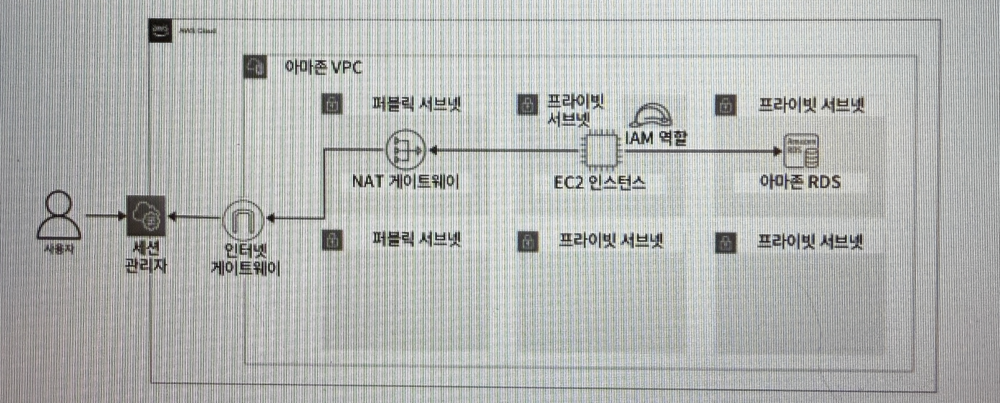
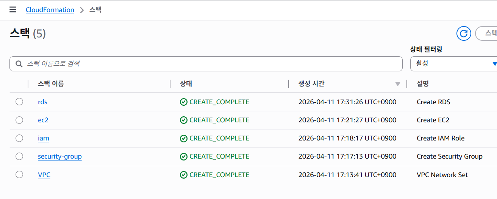
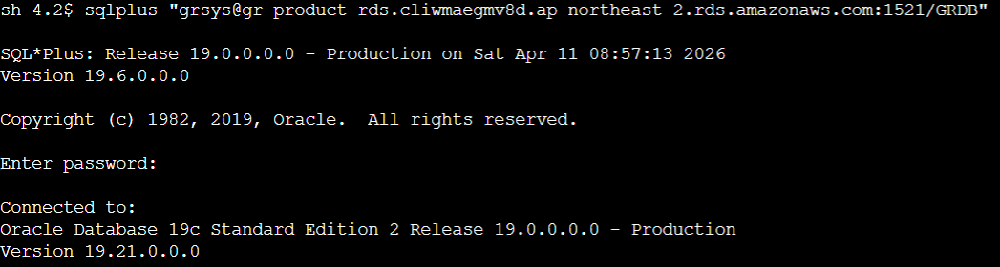
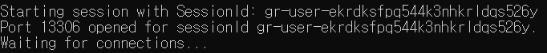

# 5. 관계형 데이터베이스 서비스 파악하기

## 5.1 관계형 데이터베이스, 아마존 RDS란?

- 데이터베이스 : 일정한 형식과 구조를 가진 데이터를 저장하고 관리
- 관계형 데이터베이스 : 테이블 형식의 복수 데이터를 관련지어 사용할 수 있는 데이터베이스
- RDS : Relational Database Service로 AWS에서 제공하는 관계형 데이터베이스 서비스

---

## 5.2 관계형 데이터베이스, 아마존 RDS 살펴보기

### 5.2.1 아마존 RDS 엔진 유형

| 엔진 유형 | 특징 | 비고 |
| --- | --- | --- |
| 아마존 오로라 | 고성능 및 안정성을 제공하는 완전 관리형 관계형 데이터베이스 | 아마존 오로라에서는 MySQL, PostgreSQL만 지원 |
| 아마존 RDS for PostgreSQL | PostgreSQL의 관리형 서비스로, AWS에서 PostgreSQL 데이터베이스를 운영할 수 있도록 지원 |  |
| 아마존 RDS for MySQL | AWS에서 제공하는 MySQL 데이터베이스의 관리형 서비스 |  |
| 아마존 RDS for MariaDB | AWS에서 제공하는 MariaDB의 관리형 서비스 |  |
| 아마존 RDS for SQL Server | Microsoft SQL Server의 관리형 서비스로, SQL Server 기능과 호환성을 유지하면서 관리를 지원 |  |
| 아마존 RDS for 오라클 | 오라클 데이터베이스의 관리형 서비스로, 오라클의 기능과 안정성을 유지하면서 관리를 지원 |  |
| 아마존 RDS for Db2 | IBM Db2의 관리형 서비스로, Db2 데이터베이스의 기능과 호환성을 유지하면서 관리를 지원 |

|

---

### 5.2.2 아마존 RDS의 DB 인스턴스 클래스

| DB 인스턴스 클래스 유형 | 인스턴스 클래스(인스턴스 유형) | 특징 |
| --- | --- | --- |
| 스탠다드 | db.m3, db.m4, db.m5와 같은 m 유형을 포함한 인스턴스 클래스 | 범용 DB 인스턴스 클래스 |
| 메모리 최적화 | db.r4, db.45, db.r6i, db.x1, db.x2i, db.z1d와 같은 r,x,z 유형을 포함한 인스턴스 클래스 | 메모리 소비가 높은 애플리케이션에 최적화된 DB 인스턴스 클래스 |
| 버스터블 | db.t2, db.t3, db.t4g와 같은 t 유형을 포함한 인스턴스 클래스 | 최대 CPU 사용량까지 버스트 가능한 DB 인스턴스 클래스 |

---

### 5.2.3 아마존 RDS의 스토리지 유형

- 범용 SSD(gp2, gp3) : 비용, 성능 면에서 밸런스가 잡혀 있으며, 폭 넓게 사용 가능
- 프로비저닝된 IOPS(io1) : 낮은 대기 시간과 높은 I/O 성능이 요구되는 데이터베이스에 적합
- 마그네틱 : 데이터의 액세스 빈도가 낮은 상황에서 사용하지만 구 세대 유형이기 때문에 권장하지 않음

| 스토리지 유형 | 요금 |
| --- | --- |
| 범용 SSD (gp2) | GB-월당 0.131 USD |
| 범용 SSD (gp3) | GB-월당 0.131 USD |
| 범용 SSD (gp3) IOPS | 기준 초과 시 IOPS-월당 0.023USD |
| 범용 SSD (gp3) 처리량 (throughput) | 기준 초과 시 MB/s-월당 0.091USD |

---

### 5.2.4 아마존 RDS를 구성하는 DB 그룹

- 서브넷 그룹 : 서브넷의 집합을 의미하며, 해당 그룹에 속한 서브넷에 아마존 RDS가 생성됨
- 파라미터 그룹 : DB 엔진의 파라미터 집합을 의미하며, 시간(time_zone), 문자 집합(character_set) 등을 관리함
- 옵션 그룹 : 연결된 데이터베이스의 스냅샷을 관리하고, 옵션을 추가해 다른 AWS 서비스와의 상호작용을 도우며, 데이터를 더 쉽게 관리하고 보안을 강화할 수 있음

→ RDS 생성 시, 별도로 생성하지 않으면 디폴트로 DB 그룹 생성됨. 퍼블릭 서브넷에 RDS가 생성될 수 있으므로 DB 그룹은 직접 생성하는 것이 권장됨

---

### 5.2.5 확장성과 고가용성을 위한 옵션들

아마존 RDS에서는 확장성과 고가용성을 지원하는 읽기 전용 복제본과 다중 AZ 기능을 지원한다.

- 읽기 전용 복제본 : 데이터베이스의 부하 분산을 위해 생성된 복제본으로, 데이터베이스의 내용을 복제하여, 데이터의 읽기, 검색만을 수행할 수 있다.
- 다중 AZ : 고가용성을 위해 원본 데이터베이스를 다른 AZ로 복제하여, 원본 데이터베이스의 가동 중지, 장애 발생에 대비하기 위한 기능이다. 예를 들어 원본 데이터베이스의 운영이 중단되거나 장애가 발생한다면 다중 AZ 구성된 백업 데이터베이스가 마스터로 승격되어 서비스를 계속 운영할 수 있다.
- 다중 AZ 클러스터 : PostgreSQL, MySQL에서 다중 AZ에서 분화된 기능으로, 읽기 쓰기가 불가능했던 스텐바이 리소스에서 읽기 기능을 지원한다. 원본 데이터베이스에 장애가 발생했다면 두 대의 리소스 중 하나가 마스터로 승격되어 읽기, 쓰기 작업을 담당한다.

---

## 5.3 아마존 RDS 구축하기

### 5.3.1 클라우드포메이션으로 아마존 RDS 구축하기

- 클라우드포메이션 스택 생성 순서 : VPC.yml → Security_Group.yml → IAM.yml → EC2.yml → RDS.yml
- 구성



- 코드
    - VPC.yml

        ```yaml
        AWSTemplateFormatVersion: "2010-09-09"
        Description: VPC Network Set
        # ------------------------------------------------------------
        # Input Parameters
        # ------------------------------------------------------------
        Parameters:
          SystemName:
            Description: "System name of each resource names."
            Type: String
            Default: "gr"
          EnvName:
            Description: "Environment name of each resource names."
            Type: String
            Default: "product"
          VPCParam: 
            Description: gr-product-vpc
            Type: String
            Default: 10.0.0.0/24
          PublicSubnet1aParam: 
            Description: gr-product-public-subnet-1a
            Type: String
            Default: 10.0.0.0/27
          PublicSubnet1bParam: 
            Description: gr-product-public-subnet-1b
            Type: String
            Default: 10.0.0.32/27
          WebSubnet1aParam: 
            Description: gr-product-web-subnet-1a
            Type: String
            Default: 10.0.0.64/27
          WebSubnet1bParam: 
            Description: gr-product-web-subnet-1b
            Type: String
            Default: 10.0.0.96/27
          DatastoreSubnet1aParam: 
            Description: gr-product-datastore-subnet-1a
            Type: String
            Default: 10.0.0.128/27
          DatastoreSubnet1bParam: 
            Description: gr-product-datastore-subnet-1b
            Type: String
            Default: 10.0.0.160/27
        #-------------------------------------------------------------------
        # Create VPC、Subnet
        #-------------------------------------------------------------------
        Resources:
          VPC: 
            Type: AWS::EC2::VPC
            Properties: 
              CidrBlock: !Ref VPCParam
              EnableDnsSupport: "true"
              EnableDnsHostnames: "true"
              InstanceTenancy: default
              Tags: 
                - Key: Name
                  Value: !Sub ${SystemName}-${EnvName}-vpc
                - Key: Env
                  Value: !Sub ${EnvName}
          PublicSubnet1a: 
            Type: AWS::EC2::Subnet
            Properties: 
              AvailabilityZone:
                Fn::Select: 
                - 0
                - Fn::GetAZs: ""
              CidrBlock: !Ref PublicSubnet1aParam
              VpcId: !Ref VPC 
              Tags: 
                - Key: Name
                  Value: !Sub ${SystemName}-${EnvName}-public-subnet-1a
                - Key: Env
                  Value: !Sub ${EnvName}
          PublicSubnet1b: 
            Type: AWS::EC2::Subnet
            Properties: 
              AvailabilityZone:
                Fn::Select: 
                - 1
                - Fn::GetAZs: ""
              CidrBlock: !Ref PublicSubnet1bParam
              VpcId: !Ref VPC 
              Tags: 
                - Key: Name
                  Value: !Sub ${SystemName}-${EnvName}-public-subnet-1b
                - Key: Env
                  Value: !Sub ${EnvName}
          WebSubnet1a: 
            Type: AWS::EC2::Subnet
            Properties: 
              AvailabilityZone:
                Fn::Select: 
                - 0
                - Fn::GetAZs: ""
              CidrBlock: !Ref WebSubnet1aParam
              VpcId: !Ref VPC 
              Tags: 
                - Key: Name
                  Value: !Sub ${SystemName}-${EnvName}-web-subnet-1a
                - Key: Env
                  Value: !Sub ${EnvName}
          WebSubnet1b: 
            Type: AWS::EC2::Subnet
            Properties: 
              AvailabilityZone:
                Fn::Select: 
                - 1
                - Fn::GetAZs: ""
              CidrBlock: !Ref WebSubnet1bParam
              VpcId: !Ref VPC 
              Tags: 
                - Key: Name
                  Value: !Sub ${SystemName}-${EnvName}-web-subnet-1b
                - Key: Env
                  Value: !Sub ${EnvName}
          DatastoreSubnet1a: 
            Type: AWS::EC2::Subnet
            Properties: 
              AvailabilityZone:
                Fn::Select: 
                - 0
                - Fn::GetAZs: ""
              CidrBlock: !Ref DatastoreSubnet1aParam
              VpcId: !Ref VPC 
              Tags: 
                - Key: Name
                  Value: !Sub ${SystemName}-${EnvName}-datastore-subnet-1a
                - Key: Env
                  Value: !Sub ${EnvName}
          DatastoreSubnet1b: 
            Type: AWS::EC2::Subnet
            Properties: 
              AvailabilityZone:
                Fn::Select: 
                - 1
                - Fn::GetAZs: ""
              CidrBlock: !Ref DatastoreSubnet1bParam
              VpcId: !Ref VPC 
              Tags: 
                - Key: Name
                  Value: !Sub ${SystemName}-${EnvName}-datastore-subnet-1b
                - Key: Env
                  Value: !Sub ${EnvName}
        #-------------------------------------------------------------------
        # Create Internet Gateway
        #-------------------------------------------------------------------
          InternetGateway: 
            Type: AWS::EC2::InternetGateway
            Properties: 
              Tags: 
                - Key: Name
                  Value: !Sub ${SystemName}-${EnvName}-igw
                - Key: Env
                  Value: !Sub ${EnvName}
          InternetGatewayAttachment: 
            Type: AWS::EC2::VPCGatewayAttachment
            Properties: 
              InternetGatewayId: !Ref InternetGateway
              VpcId: !Ref VPC
        #-------------------------------------------------------------------
        # Create EIP、NAT Gateway
        #-------------------------------------------------------------------
          EIP:
            Type: AWS::EC2::EIP
            Properties:
              Tags: 
                - Key: Name
                  Value: !Sub ${SystemName}-${EnvName}-eip
                - Key: Env
                  Value: !Sub ${EnvName}
          NATGateway:
            Type: AWS::EC2::NatGateway
            DependsOn: InternetGatewayAttachment
            Properties:
              AllocationId: !GetAtt EIP.AllocationId
              SubnetId: !Ref PublicSubnet1a
              Tags: 
                - Key: Name
                  Value: !Sub ${SystemName}-${EnvName}-nat
                - Key: Env
                  Value: !Sub ${EnvName}
        #-------------------------------------------------------------------
        # Create Route Tables
        #-------------------------------------------------------------------
          PublicRTB : 
              Type: AWS::EC2::RouteTable
              Properties: 
                VpcId: !Ref VPC 
                Tags: 
                  - Key: Name
                    Value: !Sub ${SystemName}-${EnvName}-public-rtb
                  - Key: Env
                    Value: !Sub ${EnvName}
          WebRTB : 
              Type: AWS::EC2::RouteTable
              Properties: 
                VpcId: !Ref VPC 
                Tags: 
                  - Key: Name
                    Value: !Sub ${SystemName}-${EnvName}-web-rtb
                  - Key: Env
                    Value: !Sub ${EnvName}
          DatastoreRTB : 
              Type: AWS::EC2::RouteTable
              Properties: 
                VpcId: !Ref VPC 
                Tags: 
                  - Key: Name
                    Value: !Sub ${SystemName}-${EnvName}-datastore-rtb
                  - Key: Env
                    Value: !Sub ${EnvName}
        #-------------------------------------------------------------------
        # Route Set
        #-------------------------------------------------------------------
          PublicRoute: 
            Type: AWS::EC2::Route
            Properties: 
              RouteTableId: !Ref PublicRTB
              DestinationCidrBlock: "0.0.0.0/0"
              GatewayId: !Ref InternetGateway
          WebRoute: 
            Type: AWS::EC2::Route
            Properties: 
              RouteTableId: !Ref WebRTB
              DestinationCidrBlock: "0.0.0.0/0"
              NatGatewayId: !Ref NATGateway
        #-------------------------------------------------------------------
        # Route Tables Subnet Association
        #-------------------------------------------------------------------
          PublicRTBAssociation1: 
            Type: AWS::EC2::SubnetRouteTableAssociation
            Properties: 
              SubnetId: !Ref PublicSubnet1a
              RouteTableId: !Ref PublicRTB
          PublicRTBAssociation2: 
            Type: AWS::EC2::SubnetRouteTableAssociation
            Properties: 
              SubnetId: !Ref PublicSubnet1b
              RouteTableId: !Ref PublicRTB
          WebRTBAssociation1: 
            Type: AWS::EC2::SubnetRouteTableAssociation
            Properties: 
              SubnetId: !Ref WebSubnet1a
              RouteTableId: !Ref WebRTB
          WebRTBAssociation2: 
            Type: AWS::EC2::SubnetRouteTableAssociation
            Properties: 
              SubnetId: !Ref WebSubnet1b
              RouteTableId: !Ref WebRTB
          DatastoreRTBAssociation1: 
            Type: AWS::EC2::SubnetRouteTableAssociation
            Properties: 
              SubnetId: !Ref DatastoreSubnet1a
              RouteTableId: !Ref DatastoreRTB
          DatastoreRTBAssociation2: 
            Type: AWS::EC2::SubnetRouteTableAssociation
            Properties: 
              SubnetId: !Ref DatastoreSubnet1b
              RouteTableId: !Ref DatastoreRTB
        # ------------------------------------------------------------
        # Output Parameters
        # ------------------------------------------------------------
        Outputs:
        # VPC
          VPC:
            Value: !Ref VPC
            Export:
              Name: !Sub ${EnvName}-vpc
        # public-subnet
          PublicSubnet1a:
            Value: !Ref PublicSubnet1a
            Export:
              Name: !Sub ${EnvName}-public-subnet-1a
          PublicSubnet1b:
            Value: !Ref PublicSubnet1b
            Export:
              Name: !Sub ${EnvName}-public-subnet-1b
        # Web-subnet
          WebSubnet1a:
            Value: !Ref WebSubnet1a
            Export:
              Name: !Sub ${EnvName}-web-subnet-1a
          WebSubnet1c:
            Value: !Ref WebSubnet1b
            Export:
              Name: !Sub ${EnvName}-web-subnet-1b
        # Datastore-subnet
          DatastoreSubnet1a:
            Value: !Ref DatastoreSubnet1a
            Export:
              Name: !Sub ${EnvName}-datastore-subnet-1a
          DatastoreSubnet1c:
            Value: !Ref DatastoreSubnet1b
            Export:
              Name: !Sub ${EnvName}-datastore-subnet-1b
        ```

    - Security_Group.yml

        ```groovy
        AWSTemplateFormatVersion: "2010-09-09"
        Description: Create Security Group
        # ------------------------------------------------------------#
        # Input Parameters
        # ------------------------------------------------------------# 
        Parameters:
          SystemName:
            Description: "System name of each resource names."
            Type: String
            Default: "gr"
          EnvName:
            Description: "Environment name of each resource names."
            Type: String
            Default: "product"
        # ------------------------------------------------------------#
        #  Create EC2 Security Group
        # ------------------------------------------------------------#
        Resources:
          EC2SecurityGroup:
            Type: AWS::EC2::SecurityGroup # 보안 그룹을 생성
            Properties:
              GroupName: !Sub ${SystemName}-${EnvName}-ec2-sg # 보안 그룹 이름을 지정
              GroupDescription: !Sub ${SystemName}-${EnvName}-ec2-sg # 보안 그룹 설명
              VpcId:
                Fn::ImportValue: !Sub ${EnvName}-vpc
              Tags: 
                - Key: Name
                  Value: !Sub ${SystemName}-${EnvName}-ec2-sg
                - Key: Env
                  Value: !Sub ${EnvName}
        # ------------------------------------------------------------#
        #  Create RDS Security Group
        # ------------------------------------------------------------#
          RDSSecurityGroup:
            Type: AWS::EC2::SecurityGroup
            Properties:
              GroupName: !Sub ${SystemName}-${EnvName}-rds-sg
              GroupDescription: !Sub ${SystemName}-${EnvName}-rds-sg
              SecurityGroupIngress:
                - IpProtocol: tcp
                  FromPort: 1521
                  ToPort: 1521
                  SourceSecurityGroupId: !GetAtt EC2SecurityGroup.GroupId
              VpcId:
                Fn::ImportValue: !Sub ${EnvName}-vpc
              Tags:
                - Key: Name
                  Value: !Sub ${SystemName}-${EnvName}-rds-sg
                - Key: Env
                  Value: !Sub ${EnvName}
        # ------------------------------------------------------------
        # Output Parameters
        # ------------------------------------------------------------
        Outputs:
        # Security Groups
          EC2SecurityGroup:
            Value: !Ref EC2SecurityGroup
            Export:
              Name: !Sub ${EnvName}-ec2-sg
          RDSSecurityGroup:
            Value: !Ref RDSSecurityGroup
            Export:
              Name: !Sub ${EnvName}-rds-sg
        ```

    - IAM.yml

        ```yaml
        AWSTemplateFormatVersion: "2010-09-09"
        Description: Create IAM Role
        # ------------------------------------------------------------
        # Input Parameters
        # ------------------------------------------------------------
        Parameters:
          SystemName:
            Description: "System name of each resource names."
            Type: String
            Default: "gr"
          EnvName:
            Description: "Environment name of each resource names."
            Type: String
            Default: "product"
        # ------------------------------------------------------------#
        #  Create IAM Role
        # ------------------------------------------------------------#
        Resources:
          EC2IAMRole:
            Type: AWS::IAM::Role
            DeletionPolicy: Delete
            Properties:
              RoleName: !Sub ${SystemName}-${EnvName}-ec2-role
              AssumeRolePolicyDocument: 
                Version: "2012-10-17"
                Statement: 
                  - Effect: "Allow"
                    Principal: 
                      Service: 
                        - "ec2.amazonaws.com"
                    Action: 
                      - "sts:AssumeRole"
              Path: "/"
              ManagedPolicyArns:
                - "arn:aws:iam::aws:policy/AmazonSSMManagedInstanceCore"
          EC2InstanceProfile:
            Type: AWS::IAM::InstanceProfile
            Properties:
              InstanceProfileName: !Sub ${SystemName}-${EnvName}-ec2-role
              Path: "/"
              Roles:
                - Ref: EC2IAMRole
        # ------------------------------------------------------------
        # Output Parameters
        # ------------------------------------------------------------
        Outputs:
        # IAM Profile
          InstanceProfile:
            Value: !Ref EC2InstanceProfile
            Export:
              Name: !Sub ${EnvName}-ec2-role
        ```

    - EC2.yml

        ```yaml
        AWSTemplateFormatVersion: "2010-09-09"
        Description: Create EC2
        # ------------------------------------------------------------#
        # Input Parameters
        # ------------------------------------------------------------# 
        Parameters:
          SystemName:
            Description: "System name of each resource names."
            Type: String
            Default: "gr"
          EnvName:
            Description: "Environment name of each resource names."
            Type: String
            Default: "product"
          KeyPairName: 
            Description: gr-product-ec2 EC2 Key Pair
            Type: String
            Default: gr-product-ec2-key
          EC2AMI: 
            Description: gr-product-ec2 EC2 AMI
            Type: String
            Default: ami-02d081c743d676996
          InstanceType:
            Description: gr-product-ec2 EC2 instance type
            Type: String
            Default: t2.micro
        # ------------------------------------------------------------#
        #  Create EC2 Instance 
        # ------------------------------------------------------------#
        Resources:
          NewKeyPair:
            Type: AWS::EC2::KeyPair
            Properties:
              KeyName: !Ref KeyPairName
          EC2Instance:
            Type: AWS::EC2::Instance
            Properties:
              ImageId: !Ref EC2AMI
              InstanceType: !Ref InstanceType
              KeyName: !Ref NewKeyPair
              IamInstanceProfile: 
                Fn::ImportValue: !Sub ${EnvName}-ec2-role
              BlockDeviceMappings:
                - DeviceName: /dev/xvda
                  Ebs:
                    VolumeSize: 100
                    VolumeType: gp3
                    Encrypted : true
              SecurityGroupIds:
                - Fn::ImportValue: !Sub ${EnvName}-ec2-sg
              SubnetId:
                Fn::ImportValue: !Sub ${EnvName}-web-subnet-1a
              Tags: 
                - Key: Name
                  Value: !Sub ${SystemName}-${EnvName}-ec2
                - Key: Env
                  Value: !Sub ${EnvName}
        # ------------------------------------------------------------
        # Output Parameters
        # ------------------------------------------------------------
        Outputs:
        # EC2
          EC2Instance:
            Value: !Ref EC2Instance
            Export:
              Name: !Sub ${EnvName}-ec2
        ```

    - RDS.yml

      비밀번호 조건 : 8-30자, 영어 + 숫자로 구성, 대문자와 특수문자 최소 1개 이상

        ```yaml
        AWSTemplateFormatVersion: "2010-09-09"
        Description: Create RDS
        # ------------------------------------------------------------#
        # Input Parameters
        # ------------------------------------------------------------#
        Parameters:
          SystemName:
            Description: "System name of each resource names."
            Type: String
            Default: "gr"
          EnvName:
            Description: "Environment name of each resource names."
            Type: String
            Default: "product"
          RDSMasterUserName:
            Description: Staging RDS DB Master User Name.
            Default: "grsys"
            Type: String
          RDSMasterPassword:
            Description: Staging RDS DB Master Password.
            Type: String
            NoEcho: true
          RDSMaintenanceWindow:
            Description: Staging Enter MaintenanceWindow(UTC)
            Type: String
            Default: "sat:18:00-sat:19:00" # KST：[日] 03:00 - 04:00
        # ------------------------------------------------------------#
        #  Create RDS
        # ------------------------------------------------------------#
        Resources:
          RDSInstance:
            Type: AWS::RDS::DBInstance
            Properties:
              DBInstanceIdentifier: !Sub ${SystemName}-${EnvName}-rds
              DBName: "grdb" # 초기 데이터베이스 이름
              CharacterSetName: KO16MSWIN949
              DBInstanceClass: db.t3.xlarge
              Engine: oracle-se2
              MultiAZ: false #　multiAZ 설정 없음
              EngineVersion: '19.0.0.0.ru-2023-10.rur-2023-10.r1'
              LicenseModel: 'license-included'
              Port: 1521
              AutoMinorVersionUpgrade: false
              PubliclyAccessible: false
              AvailabilityZone:
                Fn::Select: 
                - 0
                - Fn::GetAZs: ""
              StorageType: "gp3"
              AllocatedStorage: "200"
              StorageEncrypted: true
              EnablePerformanceInsights: true # Performance Insight
              PerformanceInsightsRetentionPeriod: 7 # Performance Insight(보존기간7日)
              BackupRetentionPeriod: 0 # 자동 백업 무효화
              MasterUsername: !Ref RDSMasterUserName
              MasterUserPassword: !Ref RDSMasterPassword
              PreferredMaintenanceWindow: !Ref RDSMaintenanceWindow # 유지 보수
              VPCSecurityGroups:
                - Fn::ImportValue: !Sub ${EnvName}-rds-sg
              DBSubnetGroupName: !Ref RDSSubnetGroup
              DBParameterGroupName: !Ref RDSParameterGroup
              OptionGroupName: !Ref RDSOptionGroup
              Tags:
                  - Key: Name
                    Value: !Sub ${SystemName}-${EnvName}-rds
                  - Key: Env
                    Value: !Sub ${EnvName}
        # ------------------------------------------------------------#
        #  Create SubnetGroup
        # ------------------------------------------------------------#
          RDSSubnetGroup:
            Type: AWS::RDS::DBSubnetGroup
            Properties:
              DBSubnetGroupName: !Sub ${SystemName}-${EnvName}-dbsub
              DBSubnetGroupDescription: !Sub ${SystemName}-${EnvName}-dbsub Subnet Group
              SubnetIds:
                - Fn::ImportValue: !Sub ${EnvName}-datastore-subnet-1a
                - Fn::ImportValue: !Sub ${EnvName}-datastore-subnet-1b
              Tags:
                - Key: Name
                  Value: !Sub ${SystemName}-${EnvName}-dbsub
                - Key: Env
                  Value: !Sub ${EnvName}
        # ------------------------------------------------------------#
        #  Create ParameterGroup
        # ------------------------------------------------------------#
          RDSParameterGroup:
            Type: AWS::RDS::DBParameterGroup
            Properties:
              DBParameterGroupName: !Sub ${SystemName}-${EnvName}-dbpg19
              Description: !Sub ${SystemName}-${EnvName}-dbpg19 Parameter
              Family: 'oracle-se2-19'
              Tags:
                - Key: Name
                  Value: !Sub ${SystemName}-${EnvName}-dbpg19
                - Key: Env
                  Value: !Sub ${EnvName}
        # ------------------------------------------------------------#
        #  Create  OptionGroup
        # ------------------------------------------------------------#
          RDSOptionGroup:
            Type: AWS::RDS::OptionGroup
            Properties:
              OptionGroupName: !Sub ${SystemName}-${EnvName}-dbog19
              OptionGroupDescription: !Sub ${SystemName}-${EnvName}-dbog19 Option Group
              EngineName: "oracle-se2"
              MajorEngineVersion: "19"
              Tags:
                - Key: Name
                  Value: !Sub ${SystemName}-${EnvName}-dbog19
                - Key: Env
                  Value: !Sub ${EnvName}
        # ------------------------------------------------------------
        # Output Parameters
        # ------------------------------------------------------------
        Outputs:
        # RDS
          RDSInstance:
            Value: !Ref RDSInstance
            Export:
              Name: !Sub ${SystemName}-rds
        ```


---

### 5.3.2 UI로 불러와 RDS 리소스 생성하기
- 생성 완료된 모습

---

## 5.4 아마존 RDS 접속 패턴 살펴보기

### 5.4.1 EC2 인스턴스를 이용한 RDS 접속

가장 기본적인 RDS 접속 방법으로, 프라이빗 서브넷에 있는 EC2 인스턴스에 오라클 클라이언트를 설치해 RDS로 접속하는 방법이다.

세션 매니저를 통해 EC2 접속 후 다음 과정을 진행하면 된다.

1. wget 설치 (리눅스에서는 이미 설치되어있으므로 생략)

```bash
sudo yum install wget
```

2. Oracle Instant Client 다운로드

```bash
sudo wget https://download.oracle.com/otn_software/linux/instantclient/19600/oracle-instantclient19.6-basic-19.6.0.0.0-1.x86_64.rpm

sudo wget https://download.oracle.com/otn_software/linux/instantclient/19600/oracle-instantclient19.6-sqlplus-19.6.0.0.0-1.x86_64.rpm
```

3. Oracle Instant Client 설치

```bash
sudo yum install -y oracle-instantclient19.6-basic-19.6.0.0.0-1.x86_64.rpm
sudo yum install -y oracle-instantclient19.6-sqlplus-19.6.0.0.0-1.x86_64.rpm
```

4. 환경 변수 설정 + 버전 확인

```bash
export PATH=/usr/lib/oracle/19.6/client64/bin:$PATH
export LD_LIBRARY_PATH=/usr/lib/oracle/19.6/client64/lib:$LD_LIBRARY_PATH

sqlplus64 -v
```

5. 라이브러리 에러 해결 + 재확인

```bash
sudo yum install libnsl

sqlplus64 -v
```

6. RDS 접근 시도

```bash
sqlplus "grsys@gr-product-rds.cliwmaegmv8d.ap-northeast-2.rds.amazonaws.com:1521/GRDB"
```

- grsys : RDS 생성할 때 입력한 관리자 이름
- grdb : 초기 데이터베이스 이름
7. 비밀번호 입력 후 접속 화면



---

### 5.4.2 포트 포워딩을 이용한 RDS 접속
1. 터미널 or 파워쉘에서 자격증명 호출

```bash
aws sts get-caller-identity
```

2. 포트 포워딩 실시. EC2 인스턴스를 경유하므로 target에는 경유할 EC2 인스턴스 ID, RDS의 엔드포인트, 포트 번호, 로컬 환경에서 사용할 임의의 포트 번호 입력

```bash
aws ssm start-session \
--target 인스턴스 ID \
--document-name AWS-StartPortForwardingSessionToRemoteHost \ 
--parameters '{"host":["RDS 엔드포인트"], "portNumber":["1521"],
"localPortNumber":["13306"]}'
```

3. 명령어를 입력했다면 다음과 같이 세션 시작되고, 로컬 PC에 설치한 클라이언트를 통해 RDS로 접속할 수 있다.
   
- 윈도우 파워쉘 명령어

    교재의 명령어를 입력했더니 오류가 나서 윈도우 파워쉘에서 작동하는 명령어를 따로 입력했다.

    json 형식의 파라미터 입력 때문에 오류가 발생하여 데이터를 json으로 묶지 않고 전송하는 방식을 사용했다.

    ```bash
    aws ssm start-session --target i-061f056ca69766ffe --document-name AWS-StartPortForwardingSessionToRemoteHost --parameters host="gr-product-rds.cliwmaegmv8d.ap-northeast-2.rds.amazonaws.com",portNumber="1521",localPortNumber="13306"
    ```



---

### 5.4.3 인터넷 게이트웨이를 통해 RDS로 접속

아마존 RDS를 퍼블릭 서브넷에 배치하여 퍼블릭 액세스를 허용할 지 거부할 지에 대한 옵션을 선택할 수 있다. 간편하게 RDS로 접근 가능하다는 장점이 있지만 데이터베이스가 인터넷에 노출되기 때문에 보안상 문제가 발생할 수 있다.

---

### 5.4.4 Site to Site VPN을 통해 RDS로 접속

EC2 인스턴스를 경유하지 않고 Site to Site VPN이나 다이렉트 커넥트를 설정하여 프라이빗 네트워크를 통해 RDS에 접속할 수 있다.