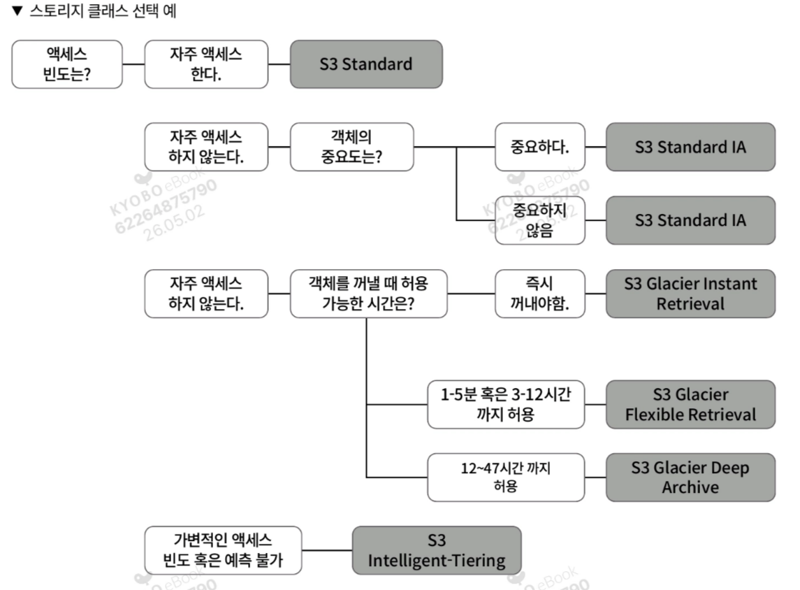
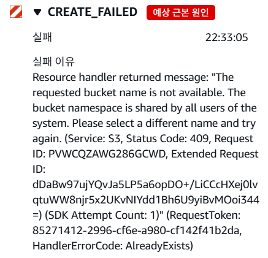
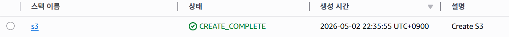

# 6. 객체 스토리지 서비스 파악하기

## 6.1 객체 스토리지 서비스, 아마존 S3란?

- 객체 스토리지 : 일정한 형태나 형식, 틀이 정해지지 않은 비정형 형식의 데이터를 저장하고 관리하는 스토리지로, 파일 형식 상관 없이 저장 가능하다.
- 버킷 : S3는 버킷이라는 스토리지에 객체를 저장하는데, 버킷은 전 리전에 걸쳐 고유한 이름을 가지며, 다른 리전에서 같은 이름의 버킷을 사용할 수 없다. 객체는 버킷 내부에서 고유한 키를 가지며, 같은 이름의 키 객체를 저장하면 덮어쓰기가 된다.

---

## 6.2 객체 스토리지 서비스, 아마존 S3 살펴보기

### 6.2.1 스토리지 클래스

- 스토리지 클래스 종류
    - **S3 Standard** : 범용으로 사용되며, 동적 웹사이트, 콘텐츠 배포, 모바일 및 게임 애플리케이션, 빅데이터 분석 등 다양한 사용 사례에 적합
    - **S3 Infrequent Access** : 액세스 빈도가 낮은 객체를 위한 스토리지 클래스이며, 백업, 재해 대책 파일 등에 적합
    - **S3 One Zone-IA :** 액세스 빈도가 낮은 객체를 위한 스토리지 클래스이며, 로그, 자주 액세스 하지 않는 데이터의 재생성 등에 적합
    - **S3 Glacier Instant Retrieval** : S3 Infrequent Access 와 비교해서 액세스 빈도가 현저히 낮으며, 의료 이미지, 미디어 자산 등에 적합
    - **S3 Glacier Flexibla Retrieval** : S3 Infrequent Access 와 비교해서 액세스 빈도가 현저히 낮으며, 백업, 재해 복구 사용 사례에 적합
    - **S3 Glacier Deep Archive** : 규제 규정 준수 요건을 충족하기 위해 7~10년 이상 보관할 필요가 있는 객체 혹은 백업, 재해 복구 사용 사례에 적합
    - **S3 Intelligent-Tiering** : 액세스 빈도에 따라 스토리지 요금을 최적화



### 6.2.2 버전 관리를 위한 버저닝 기능

- 버저닝 : 단일 객체의 여러 버전을 유지할 수 있으며, 설정하면 객체를 업로드할 때마다 새로운 버전이 생성되므로, 이전 버전으로 되돌리거나 삭제된 객체를 복구할 수 있다.

### 6.2.3 생명주기 규칙을 활용한 객체 관리

- 객체의 생성주기를 활성화하면 생성한 날로부터 지정한 기간이 경과한 객체를 자동 삭제한다. 이를 통해 비용을 절감할 수 있다.

---

## 6.3 아마존 S3 생성하기

### 6.3.1 클라우드포메이션으로 S3 생성하기

```bash
AWSTemplateFormatVersion: "2010-09-09"
Description: Create S3
# ------------------------------------------------------------
# Input Parameters
# ------------------------------------------------------------
Parameters:
  SystemName:
    Description: "System name of each resource names."
    Type: String
    Default: "gr"
  EnvName:
    Description: "Environment name of each resource names."
    Type: String
    Default: "product"
  BucketName:
    Description: "Bucket name."
    Type: String
    Default: "bucket"
# ------------------------------------------------------------#
# Create S3 Bucket
# ------------------------------------------------------------# 
Resources:
  S3Bucket:
    Type: AWS::S3::Bucket
    Properties:
      BucketName: !Sub ${SystemName}-${EnvName}-${BucketName}
      PublicAccessBlockConfiguration:
        BlockPublicAcls: true
        BlockPublicPolicy: true
        IgnorePublicAcls: true
        RestrictPublicBuckets: true
      LifecycleConfiguration:
        Rules:
          - Id: !Sub ${SystemName}-lifecycle-bucket
            # Prefix: Backup/
            Status: Enabled
            ExpirationInDays: 90
      Tags:
        - Key: Name
          Value: !Sub ${SystemName}-${EnvName}-${BucketName}
        - Key: Env
          Value: !Sub ${EnvName}
#------------------------------------------------------------
# Output Parameters
#------------------------------------------------------------
Outputs:
  S3Bucket:
    Value: !Ref S3Bucket
    Export:
      Name: !Sub ${EnvName}-${BucketName}
```

### 6.3.2 UI로 불러와 S3 리소스 생성하기

- 스택 생성 실패

  

  버킷 이름이 이미 존재해서 실패한 모습




스택 생성 완료된 상태

---

## 6.4 아마존 S3 활용하기

- 클라우드포메이션 스택 생성 순서

```bash
VPC.yml -> Security_Group.yml -> IAM.yml -> EC2.yml -> S3.yml
```

- VPC.yml

    ```bash
    AWSTemplateFormatVersion: "2010-09-09"
    Description: VPC Network Set
    # ------------------------------------------------------------
    # Input Parameters
    # ------------------------------------------------------------
    Parameters:
      SystemName:
        Description: "System name of each resource names."
        Type: String
        Default: "gr"
      EnvName:
        Description: "Environment name of each resource names."
        Type: String
        Default: "product"
      VPCParam: 
        Description: gr-product-vpc
        Type: String
        Default: 10.0.0.0/24
      PublicSubnet1aParam: 
        Description: gr-product-public-subnet-1a
        Type: String
        Default: 10.0.0.0/27
      PublicSubnet1bParam: 
        Description: gr-product-public-subnet-1b
        Type: String
        Default: 10.0.0.32/27
      WebSubnet1aParam: 
        Description: gr-product-web-subnet-1a
        Type: String
        Default: 10.0.0.64/27
      WebSubnet1bParam: 
        Description: gr-product-web-subnet-1b
        Type: String
        Default: 10.0.0.96/27
      DatastoreSubnet1aParam: 
        Description: gr-product-datastore-subnet-1a
        Type: String
        Default: 10.0.0.128/27
      DatastoreSubnet1bParam: 
        Description: gr-product-datastore-subnet-1b
        Type: String
        Default: 10.0.0.160/27
    #-------------------------------------------------------------------
    # Create VPC、Subnet
    #-------------------------------------------------------------------
    Resources:
      VPC: 
        Type: AWS::EC2::VPC
        Properties: 
          CidrBlock: !Ref VPCParam
          EnableDnsSupport: "true"
          EnableDnsHostnames: "true"
          InstanceTenancy: default
          Tags: 
            - Key: Name
              Value: !Sub ${SystemName}-${EnvName}-vpc
            - Key: Env
              Value: !Sub ${EnvName}
      PublicSubnet1a: 
        Type: AWS::EC2::Subnet
        Properties: 
          AvailabilityZone:
            Fn::Select: 
            - 0
            - Fn::GetAZs: ""
          CidrBlock: !Ref PublicSubnet1aParam
          VpcId: !Ref VPC 
          Tags: 
            - Key: Name
              Value: !Sub ${SystemName}-${EnvName}-public-subnet-1a
            - Key: Env
              Value: !Sub ${EnvName}
      PublicSubnet1b: 
        Type: AWS::EC2::Subnet
        Properties: 
          AvailabilityZone:
            Fn::Select: 
            - 1
            - Fn::GetAZs: ""
          CidrBlock: !Ref PublicSubnet1bParam
          VpcId: !Ref VPC 
          Tags: 
            - Key: Name
              Value: !Sub ${SystemName}-${EnvName}-public-subnet-1b
            - Key: Env
              Value: !Sub ${EnvName}
      WebSubnet1a: 
        Type: AWS::EC2::Subnet
        Properties: 
          AvailabilityZone:
            Fn::Select: 
            - 0
            - Fn::GetAZs: ""
          CidrBlock: !Ref WebSubnet1aParam
          VpcId: !Ref VPC 
          Tags: 
            - Key: Name
              Value: !Sub ${SystemName}-${EnvName}-web-subnet-1a
            - Key: Env
              Value: !Sub ${EnvName}
      WebSubnet1b: 
        Type: AWS::EC2::Subnet
        Properties: 
          AvailabilityZone:
            Fn::Select: 
            - 1
            - Fn::GetAZs: ""
          CidrBlock: !Ref WebSubnet1bParam
          VpcId: !Ref VPC 
          Tags: 
            - Key: Name
              Value: !Sub ${SystemName}-${EnvName}-web-subnet-1b
            - Key: Env
              Value: !Sub ${EnvName}
      DatastoreSubnet1a: 
        Type: AWS::EC2::Subnet
        Properties: 
          AvailabilityZone:
            Fn::Select: 
            - 0
            - Fn::GetAZs: ""
          CidrBlock: !Ref DatastoreSubnet1aParam
          VpcId: !Ref VPC 
          Tags: 
            - Key: Name
              Value: !Sub ${SystemName}-${EnvName}-datastore-subnet-1a
            - Key: Env
              Value: !Sub ${EnvName}
      DatastoreSubnet1b: 
        Type: AWS::EC2::Subnet
        Properties: 
          AvailabilityZone:
            Fn::Select: 
            - 1
            - Fn::GetAZs: ""
          CidrBlock: !Ref DatastoreSubnet1bParam
          VpcId: !Ref VPC 
          Tags: 
            - Key: Name
              Value: !Sub ${SystemName}-${EnvName}-datastore-subnet-1b
            - Key: Env
              Value: !Sub ${EnvName}
    #-------------------------------------------------------------------
    # Create Internet Gateway
    #-------------------------------------------------------------------
      InternetGateway: 
        Type: AWS::EC2::InternetGateway
        Properties: 
          Tags: 
            - Key: Name
              Value: !Sub ${SystemName}-${EnvName}-igw
            - Key: Env
              Value: !Sub ${EnvName}
      InternetGatewayAttachment: 
        Type: AWS::EC2::VPCGatewayAttachment
        Properties: 
          InternetGatewayId: !Ref InternetGateway
          VpcId: !Ref VPC
    #-------------------------------------------------------------------
    # Create EIP、NAT Gateway
    #-------------------------------------------------------------------
      EIP:
        Type: AWS::EC2::EIP
        Properties:
          Tags: 
            - Key: Name
              Value: !Sub ${SystemName}-${EnvName}-eip
            - Key: Env
              Value: !Sub ${EnvName}
      NATGateway:
        Type: AWS::EC2::NatGateway
        DependsOn: InternetGatewayAttachment
        Properties:
          AllocationId: !GetAtt EIP.AllocationId
          SubnetId: !Ref PublicSubnet1a
          Tags: 
            - Key: Name
              Value: !Sub ${SystemName}-${EnvName}-nat
            - Key: Env
              Value: !Sub ${EnvName}
    #-------------------------------------------------------------------
    # Create Route Tables
    #-------------------------------------------------------------------
      PublicRTB : 
          Type: AWS::EC2::RouteTable
          Properties: 
            VpcId: !Ref VPC 
            Tags: 
              - Key: Name
                Value: !Sub ${SystemName}-${EnvName}-public-rtb
              - Key: Env
                Value: !Sub ${EnvName}
      WebRTB : 
          Type: AWS::EC2::RouteTable
          Properties: 
            VpcId: !Ref VPC 
            Tags: 
              - Key: Name
                Value: !Sub ${SystemName}-${EnvName}-web-rtb
              - Key: Env
                Value: !Sub ${EnvName}
      DatastoreRTB : 
          Type: AWS::EC2::RouteTable
          Properties: 
            VpcId: !Ref VPC 
            Tags: 
              - Key: Name
                Value: !Sub ${SystemName}-${EnvName}-datastore-rtb
              - Key: Env
                Value: !Sub ${EnvName}
    #-------------------------------------------------------------------
    # Route Set
    #-------------------------------------------------------------------
      PublicRoute: 
        Type: AWS::EC2::Route
        Properties: 
          RouteTableId: !Ref PublicRTB
          DestinationCidrBlock: "0.0.0.0/0"
          GatewayId: !Ref InternetGateway
      WebRoute: 
        Type: AWS::EC2::Route
        Properties: 
          RouteTableId: !Ref WebRTB
          DestinationCidrBlock: "0.0.0.0/0"
          NatGatewayId: !Ref NATGateway
    #-------------------------------------------------------------------
    # Route Tables Subnet Association
    #-------------------------------------------------------------------
      PublicRTBAssociation1: 
        Type: AWS::EC2::SubnetRouteTableAssociation
        Properties: 
          SubnetId: !Ref PublicSubnet1a
          RouteTableId: !Ref PublicRTB
      PublicRTBAssociation2: 
        Type: AWS::EC2::SubnetRouteTableAssociation
        Properties: 
          SubnetId: !Ref PublicSubnet1b
          RouteTableId: !Ref PublicRTB
      WebRTBAssociation1: 
        Type: AWS::EC2::SubnetRouteTableAssociation
        Properties: 
          SubnetId: !Ref WebSubnet1a
          RouteTableId: !Ref WebRTB
      WebRTBAssociation2: 
        Type: AWS::EC2::SubnetRouteTableAssociation
        Properties: 
          SubnetId: !Ref WebSubnet1b
          RouteTableId: !Ref WebRTB
      DatastoreRTBAssociation1: 
        Type: AWS::EC2::SubnetRouteTableAssociation
        Properties: 
          SubnetId: !Ref DatastoreSubnet1a
          RouteTableId: !Ref DatastoreRTB
      DatastoreRTBAssociation2: 
        Type: AWS::EC2::SubnetRouteTableAssociation
        Properties: 
          SubnetId: !Ref DatastoreSubnet1b
          RouteTableId: !Ref DatastoreRTB
    # ------------------------------------------------------------
    # Output Parameters
    # ------------------------------------------------------------
    Outputs:
    # VPC
      VPC:
        Value: !Ref VPC
        Export:
          Name: !Sub ${EnvName}-vpc
    # public-subnet
      PublicSubnet1a:
        Value: !Ref PublicSubnet1a
        Export:
          Name: !Sub ${EnvName}-public-subnet-1a
      PublicSubnet1b:
        Value: !Ref PublicSubnet1b
        Export:
          Name: !Sub ${EnvName}-public-subnet-1b
    # Web-subnet
      WebSubnet1a:
        Value: !Ref WebSubnet1a
        Export:
          Name: !Sub ${EnvName}-web-subnet-1a
      WebSubnet1c:
        Value: !Ref WebSubnet1b
        Export:
          Name: !Sub ${EnvName}-web-subnet-1b
    # Datastore-subnet
      DatastoreSubnet1a:
        Value: !Ref DatastoreSubnet1a
        Export:
          Name: !Sub ${EnvName}-datastore-subnet-1a
      DatastoreSubnet1c:
        Value: !Ref DatastoreSubnet1b
        Export:
          Name: !Sub ${EnvName}-datastore-subnet-1b
    ```

- Security_Group.yml

    ```bash
    AWSTemplateFormatVersion: "2010-09-09"
    Description: Create Security Group
    # ------------------------------------------------------------#
    # Input Parameters
    # ------------------------------------------------------------# 
    Parameters:
      SystemName:
        Description: "System name of each resource names."
        Type: String
        Default: "gr"
      EnvName:
        Description: "Environment name of each resource names."
        Type: String
        Default: "product"
    # ------------------------------------------------------------#
    #  Create EC2 Security Group
    # ------------------------------------------------------------#
    Resources:
      EC2SecurityGroup:
        Type: AWS::EC2::SecurityGroup # 보안 그룹을 생성
        Properties:
          GroupName: !Sub ${SystemName}-${EnvName}-ec2-sg # 보안 그룹 이름을 지정
          GroupDescription: !Sub ${SystemName}-${EnvName}-ec2-sg # 보안 그룹 설명
          VpcId:
            Fn::ImportValue: !Sub ${EnvName}-vpc
          Tags: 
            - Key: Name
              Value: !Sub ${SystemName}-${EnvName}-ec2-sg
            - Key: Env
              Value: !Sub ${EnvName}
    # ------------------------------------------------------------
    # Output Parameters
    # ------------------------------------------------------------
    Outputs:
    # Security Groups
      EC2SecurityGroup:
        Value: !Ref EC2SecurityGroup
        Export:
          Name: !Sub ${EnvName}-ec2-sg
    ```

- IAM.yml

    ```bash
    AWSTemplateFormatVersion: "2010-09-09"
    Description: Create IAM Role
    # ------------------------------------------------------------
    # Input Parameters
    # ------------------------------------------------------------
    Parameters:
      SystemName:
        Description: "System name of each resource names."
        Type: String
        Default: "gr"
      EnvName:
        Description: "Environment name of each resource names."
        Type: String
        Default: "product"
    # ------------------------------------------------------------#
    #  Create IAM Role
    # ------------------------------------------------------------#
    Resources:
      EC2IAMRole:
        Type: AWS::IAM::Role
        DeletionPolicy: Delete
        Properties:
          RoleName: !Sub ${SystemName}-${EnvName}-ec2-role
          AssumeRolePolicyDocument: 
            Version: "2012-10-17"
            Statement: 
              - Effect: "Allow"
                Principal: 
                  Service: 
                    - "ec2.amazonaws.com"
                Action: 
                  - "sts:AssumeRole"
          Path: "/"
          ManagedPolicyArns:
            - "arn:aws:iam::aws:policy/AmazonSSMManagedInstanceCore"
      EC2InstanceProfile:
        Type: AWS::IAM::InstanceProfile
        Properties:
          InstanceProfileName: !Sub ${SystemName}-${EnvName}-ec2-role
          Path: "/"
          Roles:
            - Ref: EC2IAMRole
    #-------------------------------------------------------------------
    # Create IAM Policy (EC2)
    #-------------------------------------------------------------------
      EC2Policy:
        Type: AWS::IAM::ManagedPolicy
        Properties:
          ManagedPolicyName: !Sub ${SystemName}-${EnvName}-policy-ec2
          PolicyDocument:
            Version: "2012-10-17"
            Statement:
              - Effect: Allow
                Action:
                  - s3:ListAllMyBuckets
                Resource: arn:aws:s3:::*
              - Effect: Allow
                Action:
                  - s3:Get*
                  - s3:Delete*
                  - s3:Put*
                Resource:
                    - "arn:aws:s3:::gr-product-bucket/*"
          Roles:
            - !Ref EC2IAMRole
    # ------------------------------------------------------------
    # Output Parameters
    # ------------------------------------------------------------
    Outputs:
    # IAM Profile
      InstanceProfile:
        Value: !Ref EC2InstanceProfile
        Export:
          Name: !Sub ${EnvName}-ec2-role
    ```

- EC2.yml

    ```bash
    AWSTemplateFormatVersion: "2010-09-09"
    Description: Create EC2
    # ------------------------------------------------------------#
    # Input Parameters
    # ------------------------------------------------------------# 
    Parameters:
      SystemName:
        Description: "System name of each resource names."
        Type: String
        Default: "gr"
      EnvName:
        Description: "Environment name of each resource names."
        Type: String
        Default: "product"
      KeyPairName: 
        Description: gr-product-ec2 EC2 Key Pair
        Type: String
        Default: gr-product-ec2-key
      EC2AMI: 
        Description: gr-product-ec2 EC2 AMI
        Type: String
        Default: ami-02d081c743d676996
      InstanceType:
        Description: gr-product-ec2 EC2 instance type
        Type: String
        Default: t2.micro
    # ------------------------------------------------------------#
    #  Create EC2 Instance 
    # ------------------------------------------------------------#
    Resources:
      NewKeyPair:
        Type: AWS::EC2::KeyPair
        Properties:
          KeyName: !Ref KeyPairName
      EC2Instance:
        Type: AWS::EC2::Instance
        Properties:
          ImageId: !Ref EC2AMI
          InstanceType: !Ref InstanceType
          KeyName: !Ref NewKeyPair
          IamInstanceProfile: 
            Fn::ImportValue: !Sub ${EnvName}-ec2-role
          BlockDeviceMappings:
            - DeviceName: /dev/xvda
              Ebs:
                VolumeSize: 100
                VolumeType: gp3
                Encrypted : true
          SecurityGroupIds:
            - Fn::ImportValue: !Sub ${EnvName}-ec2-sg
          SubnetId:
            Fn::ImportValue: !Sub ${EnvName}-web-subnet-1a
          Tags: 
            - Key: Name
              Value: !Sub ${SystemName}-${EnvName}-ec2
            - Key: Env
              Value: !Sub ${EnvName}
    # ------------------------------------------------------------
    # Output Parameters
    # ------------------------------------------------------------
    Outputs:
    # EC2
      EC2Instance:
        Value: !Ref EC2Instance
        Export:
          Name: !Sub ${EnvName}-ec2
    ```

- S3.yml

    ```bash
    AWSTemplateFormatVersion: "2010-09-09"
    Description: Create S3
    # ------------------------------------------------------------
    # Input Parameters
    # ------------------------------------------------------------
    Parameters:
      SystemName:
        Description: "System name of each resource names."
        Type: String
        Default: "gr"
      EnvName:
        Description: "Environment name of each resource names."
        Type: String
        Default: "product"
      BucketName:
        Description: "Bucket name."
        Type: String
        Default: "bucket"
    # ------------------------------------------------------------#
    # Create S3 Bucket
    # ------------------------------------------------------------# 
    Resources:
      S3Bucket:
        Type: AWS::S3::Bucket
        Properties:
          BucketName: !Sub ${SystemName}-${EnvName}-${BucketName}
          PublicAccessBlockConfiguration:
            BlockPublicAcls: true
            BlockPublicPolicy: true
            IgnorePublicAcls: true
            RestrictPublicBuckets: true
          LifecycleConfiguration:
            Rules:
              - Id: !Sub ${SystemName}-lifecycle-bucket
                # Prefix: Backup/
                Status: Enabled
                ExpirationInDays: 90
          Tags:
            - Key: Name
              Value: !Sub ${SystemName}-${EnvName}-${BucketName}
            - Key: Env
              Value: !Sub ${EnvName}
    #------------------------------------------------------------
    # Output Parameters
    #------------------------------------------------------------
    Outputs:
      S3Bucket:
        Value: !Ref S3Bucket
        Export:
          Name: !Sub ${EnvName}-${BucketName}
    ```


- 스택을 모두 생성한 뒤, EC2 인스턴스로 접속하여 aws s3 ls 명령어를 통해 현재 생성된 모드 S3 버킷 리스트를 불러올 수 있다. 그 후 touch 명령어로 텍스트 파일을 생성하여 aws s3 cp 명령어를 이용하여 생성한 텍스트파일을 S3 버킷으로 업로드한다.

```bash
sudo touch gr-text.txt
aws s3 cp gr-text.txt s3://s
```

- sudo -i 명령어를 통해 관리자 권한으로 로그인한 뒤, `s3://버킷명/내려받을 객체 명/다운로드 시 지정할 파일 이름`  명령어로 객체를 다운받을 수 있다.