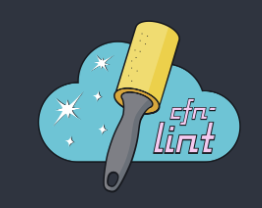
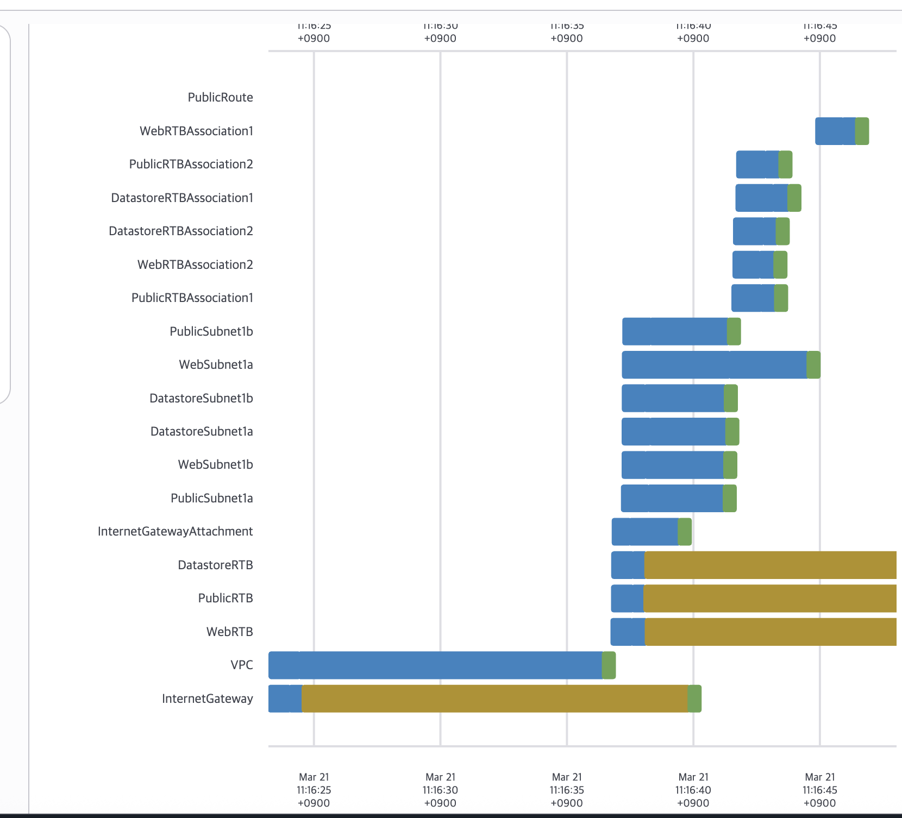

## 0.2 AWS 사용방법 살펴보기

### 0.2.1 AWS 루트 사용자

- AWS 계정 내 모든 서비스 및 리소스에 접근할 수 있는 권한을 가짐
- AWS관리 콘솔에 접근할 수 있음

### 0.2.2 레벨별 AWS를 사용하는 방법

- **레벨1 : AWS 관리 콘솔**
    - 사용자 UI 사용이 가능
    - AWS 리소스 양이 많을 경우 관리가 어려움
- **레벨2: AWS SDK와 AWS CLI**
    - 자주 사용되는 언어를 바탕으로 AWS를 호출하여 웹 애플리케이션 구현 가능
- **레벨3: AWS 클라우드포메이션**
    - IaC = **인프라를 코드로 관리한다**는 뜻
    - CloudFormation은 그냥 설정 파일이라서 YAML 조금만 알면 끝
        
        
        | 구분 | 버튼(콘솔) | 코드(IaC) |
        | --- | --- | --- |
        | 생성 방식 | 사람이 클릭 | 코드 실행 |
        | 재현성 | 거의 없음 | 완벽히 동일 |
        | 자동화 | 불가능 | 가능 |
        | 버전 관리 | 없음 | Git 관리 |
        | 협업 | 어려움 | 쉬움 |
        | 실수 가능성 | 높음 | 낮음 |
- **레벨4: AWS CDK**
    - CDK 방식는 개발자가 쓰던 방식(조건문, 함수) 그대로 인프라 만들 수 있음 = 직관적
    - 팀 마다 언어가 달라 해당 언어 문법 이해가 필요

- 해당 책에서는 **레벨 1,2,3 이용방법을 소개할** 예정

## 0.3 비주얼 스튜디오 코드로 클라우드 포메이션 템플릿 관리하기

- 레벨 3의 클라우드 포메이션 사용환경 구축

### 0.3.1 맥OS에서 클라우드 포메이션 관리하기

**설치 방법**

step 1. vscode 설치

step 2. macOs 로컬 환경에 **CloudFormation Linter 설치**

step 3. 비주얼 스튜디오 코드에 **CloudFormation Linter 확장 프로그램 설치**

 **CloudFormation Linter** 



- 클라우드포메이션 코드를 검사하여 문법오류나 잠재적인 문제를 찾아내는 도구

## 0.5 클라우드 포메이션 사용해보기

### 아마존 VPC

- 클라우드의 네트워크 환경을 구축하고 관리할 수 있는 서비스

### 클라우드포메이션을 이용하여 AWS 리소스 생성

- VPC.yml 파일을 이용하여 스택을 생성한 화면



## 0.6 AWS에서 생성형 AI 활용 방안

### 0.6.1 코드작성

**AWS에서의  코드 작성의 경우**

- 인프라 구축을 위한 IaC 코드
    - 요청 사항
        1. 클라우드 포메이션 코드를 YAML 언어로 작성
        2. 각 리소스의 이름 규칙을 명확히 전달
        3. 가용영역을 하드코딩하지 않고 동적으로 설정
        4. 필요한 최소한의 파라미터(네트워크 CIDR)를 안내
    - ChatGPT에게 클라우드포메이션 코드 작성을 부탁한 결과
        
        ```
        다음 파라미터를 이용해서 CloudFormation 코드(YAML)를 작성해줘
        
        각 리소스의 이름은 {EnvName}-{SystemName}-resourcename
        ex) {EnvName}-{SystemName}-vpc
        
        AvailabilityZone 값을 !Select와 !GetAZs를 활용해 하드코딩 없이 동적으로 설정하도록 해줘
        
        Region : seoul
        VPC CIDR : 10.0.0.0/16
        Public Subnet1 CIDR : 10.0.1.0/24
        Public Subnet2 CIDR : 10.0.2.0/24
        Private Subnet1 CIDR : 10.0.11.0/24
        Private Subnet2 CIDR : 10.0.12.0/24
        EnvName : gr
        SystemName : prd
        ```
        
        ```
        AWSTemplateFormatVersion: "2010-09-09"
        Description: VPC with Public and Private Subnets
        
        Parameters:
          EnvName:
            Type: String
            Default: gr
        
          SystemName:
            Type: String
            Default: prd
        
        Resources:
        
          # VPC
          VPC:
            Type: AWS::EC2::VPC
            Properties:
              CidrBlock: 10.0.0.0/16
              EnableDnsSupport: true
              EnableDnsHostnames: true
              Tags:
                - Key: Name
                  Value: !Sub "${EnvName}-${SystemName}-vpc"
        
          # Public Subnet 1
          PublicSubnet1:
            Type: AWS::EC2::Subnet
            Properties:
              VpcId: !Ref VPC
              CidrBlock: 10.0.1.0/24
              AvailabilityZone: !Select [0, !GetAZs ""]
              MapPublicIpOnLaunch: true
              Tags:
                - Key: Name
                  Value: !Sub "${EnvName}-${SystemName}-public-subnet-1"
        
          # Public Subnet 2
          PublicSubnet2:
            Type: AWS::EC2::Subnet
            Properties:
              VpcId: !Ref VPC
              CidrBlock: 10.0.2.0/24
              AvailabilityZone: !Select [1, !GetAZs ""]
              MapPublicIpOnLaunch: true
              Tags:
                - Key: Name
                  Value: !Sub "${EnvName}-${SystemName}-public-subnet-2"
        
          # Private Subnet 1
          PrivateSubnet1:
            Type: AWS::EC2::Subnet
            Properties:
              VpcId: !Ref VPC
              CidrBlock: 10.0.11.0/24
              AvailabilityZone: !Select [0, !GetAZs ""]
              Tags:
                - Key: Name
                  Value: !Sub "${EnvName}-${SystemName}-private-subnet-1"
        
          # Private Subnet 2
          PrivateSubnet2:
            Type: AWS::EC2::Subnet
            Properties:
              VpcId: !Ref VPC
              CidrBlock: 10.0.12.0/24
              AvailabilityZone: !Select [1, !GetAZs ""]
              Tags:
                - Key: Name
                  Value: !Sub "${EnvName}-${SystemName}-private-subnet-2"
        ```
        
- IAM 권한 설정을 위한 JSON 코드

### 0.6.2 솔루션과 트러블 슈팅

- 코드 작성보다는 AWS 관련 솔루션 설계와 트러블 슈팅에 더 많은 시간을 투자
- `퍼플렉시티`: 솔루션 설계와 트러블 슈팅에 자주 활용하는 생성형 AI 중 하나
    - 과거에 비해 AWS 공식 문서를 모두 일일히 확인하여 조사할 필요가 줄어들음