## 1. AWS 입문 핵심 정리

### 1.1.1 AWS란 무엇인가?

**AWS란?**

- Amazon Web Services에서 제공하는 클라우드 컴퓨팅 서비스
- 서버, 스토리지, 데이터베이스, 네트워크 등을 인터넷을 통해 제공
- 사용한 만큼 비용을 지불하는 방식(pay-as-you-go)

**AWS 특징**

- 전 세계 33개 지역(region)에서 서비스 운영
- 확장성: 트래픽 증가 시 리소스를 유연하게 확장 가능
- 안정성: 여러 지역과 가용 영역으로 장애 대응 가능
- 다양한 서비스 제공: 컴퓨팅, 스토리지, 데이터베이스, AI, 네트워크 등

---

### 1.1.2. AWS 탄생 배경

1. **대략적인 과정**
- **시작**
    - 아마존 쇼핑몰 운영 중 트래픽 증가와 인프라 문제 발생
- **해결**
    - 내부적으로 효율적인 인프라 시스템 구축
- **발전**
    - 해당 인프라를 외부 기업에도 제공하면서 AWS로 발전

> 아마존 내부 인프라를 외부 서비스로 확장한 것이 AWS
> 

1. **기본 구조**
    - 기업이 직접 데이터센터 운영
    - 서버, 스토리지, 네트워크 장비 직접 보유 및 관리

1. **기본구조의 문제점**

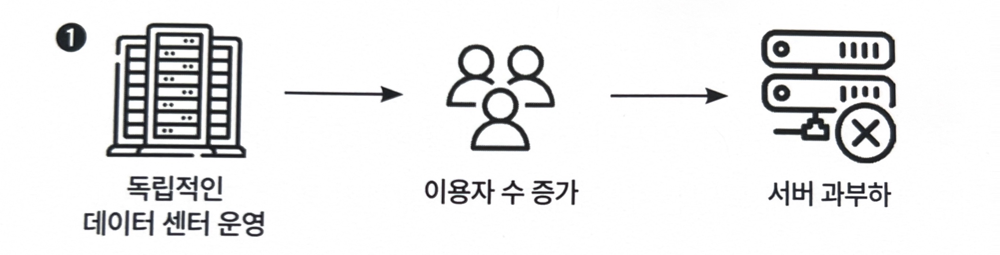

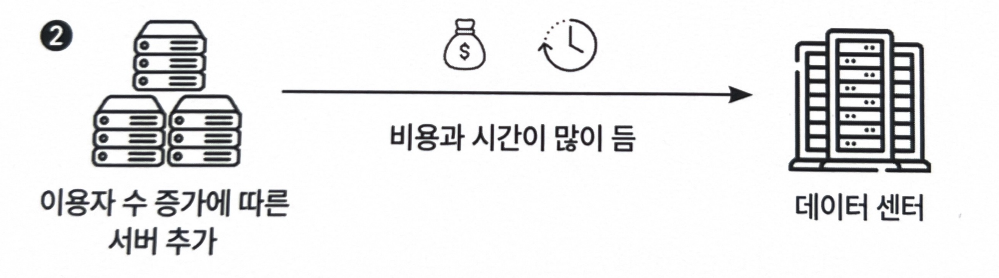

- **사용자 증가 → 서버 과부하**
- 서버 추가에 **수주 ~ 수개월 소요**

1. **클라우드의 등장을 통한 변화**
- **종량 과금제**
    - 사용한 만큼만 비용 지불
- **자동 확장**
    - 트래픽 증가 → 자동으로 서버 증가
    - 필요 없으면 축소 가능
- 결과
    - 비용 절감
    - 운영 부담 감소
    - 빠른 비즈니스 대응 가능

> `부하 분산`: 요청을 여러 서버에 나눠서 처리
> 

### 1.1.3 'AWS'와 'Amazon' 접두사는 무얼 의미하는가?

**AWS** 

- 다른 서비스와 함께 사용하는 **유틸리티 서비스**
- 관리/자동화 역할 (보조/관리 역할 )

예:

- `AWS CloudFormation` → 리소스 생성/관리
- `AWS Lambda` → 이벤트 기반 실행

**Amazon**

- 단독으로 사용 가능한 **독립형 서비스**
- 핵심 리소스 서비스

예:

- `Amazon EC2` → 가상 서버
- `Amazon S3` → 스토리지

## 1.2 AWS를 쓰려면 알아두면 유용한 클라우드 지식

### 1. 온프레미스

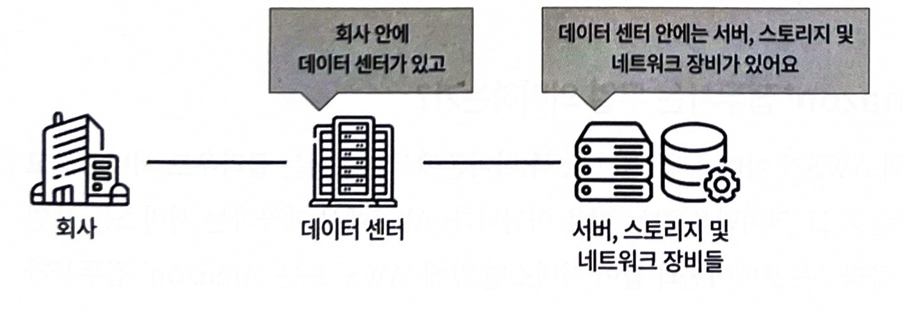

- 회사가 직접 서버 운영

단점:

- 초기 비용 큼
- 유지보수 부담
- 확장 어려움

### 2. 클라우드

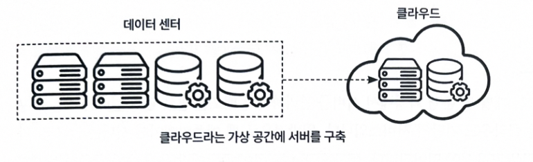

- 외부(AWS)가 인프라 제공

장점:

- 빠른 구축
- 비용 효율
- 확장 용이

### 3. 하이브리드 클라우드

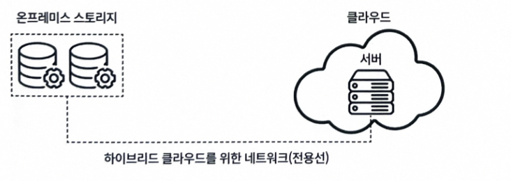

- 온프레미스 + 클라우드 결합

장점:

- 보안 + 확장성 동시에 확보

단점:

- 구조 복잡
- 네트워크(전용선) 필요

### 4. 서버리스

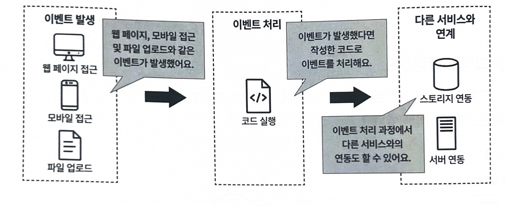

> 서버를 **직접 관리하지 않고** 코드만 실행
> 
- 기존 방식에서는 아래의 작업들을 다 직접했어야 했음
    - 서버 생성
    - OS 설정
    - 배포
    - 스케일링 설정
    - 장애 대응
- 서버는 존재함, AWS가 대신 운영해주고 개발자는 코드만 신경쓰면 된다는 의미
- **단점**
    - 실행 시간 제한
    - 상태 관리 어려움
- **`환경의 용도`와 `처리할 데이터의 양`** 등을 고려하여
    
    **직접 서버를 구축하는 방법**과 **서버리스** 중 선택하여 사용해야 함
    

### 5. 리전

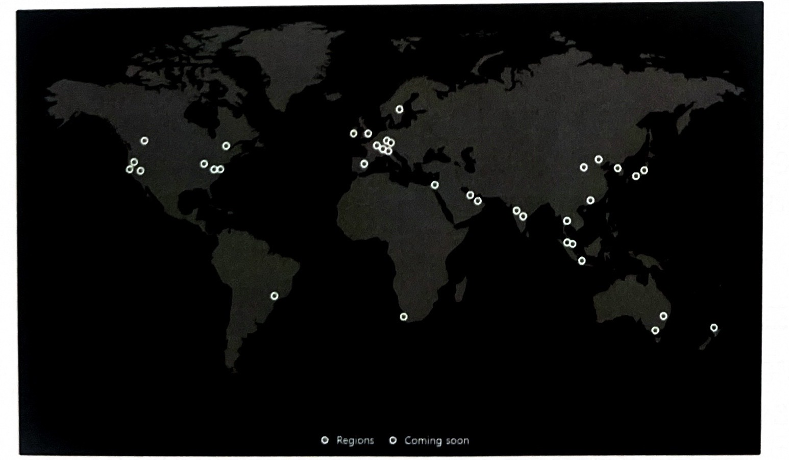

> AWS가 서비스를 제공하는 **지리적으로 분리된 하나의 지역 단위**
> 

예를 들어 서울 리전, 도쿄 리전, 버지니아 리전처럼 **국가/도시권 기준의 큰 인프라 권역을 의미함**

- **리전이 필요한 이유**
    
    리전은 단순히 “서버 위치”가 아니라, AWS에서 서비스를 설계할 때 기준이 되는 중요한 단위
    
    1. **사용자와 가까운 곳에서 서비스하기 위해**
        
        사용자와 물리적으로 가까운 리전을 선택하면 **`지연시간(latency)`**이 줄어들음 ↓
        
    2. **장애 대비를 위해**
        
        한 리전에 문제가 생길 경우, 다른 리전으로 서비스를 **분산하거나 백업** 가능
        

> 서울 리전 코드가 `ap-northeast-2`인 것도 AWS 공식 문서에서 확인 가능
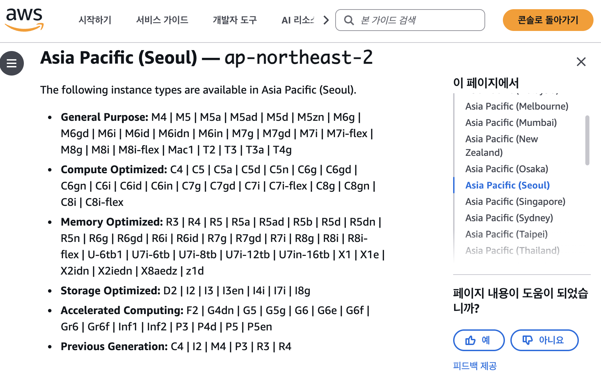

### 6. 가용영역(availability zone)
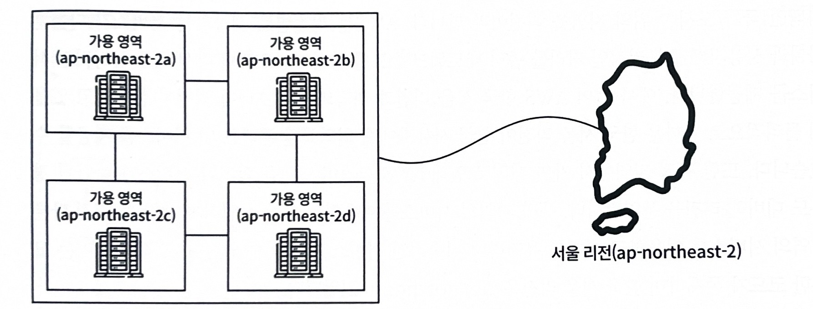

> 하나의 리전 내부 **물리적 데이터센터**
> 
- 서버, 스토리지, 네트워크 장비가 실제로 존재하는 물리적 공간
- 서로 **완전히 독립적으로 운영됨**
- 장애로부터 피해 최소화
    - 물리적으로 분리되어있지만 네트워크로 연결됨
    - 하나의 AZ가 다운되어도 다른 AZ는 정상,
        
        다른 가용 영역을 통해 시스템을 계속할 수 있음
        

### 7. 에지 로케이션(Edge Location)

> 사용자 가까이에 있는 캐시 서버(거점) 모음
> 
- 전 세계 곳곳에 분산되어 있음
- 사용자에게 **콘텐츠를 빠르게 전달하기 위한 서버**

**문제 상황**

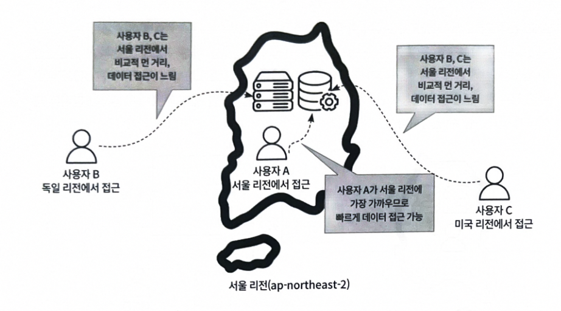

서버(리전)가 서울에 있음
B, C사용자는 미국에, A사용자는 서울에 있음
B, C사용자는 A사용자에 비해 데이터 접근이 느릴 것이다.

**해결**

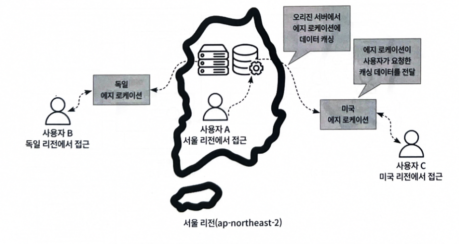

- **첫 요청
`사용자 → Edge → (캐시 없음) → 서울 리전 → 데이터 가져옴`**
가져온 데이터를 Edge에 저장 (캐싱)
- **이후 요청**
    
    **`사용자 → Edge → 바로 응답`**
    

### 에지 로케이션 vs 리전 vs AZ

| 구분 | 리전 | AZ | 에지 로케이션 |
| --- | --- | --- | --- |
| 역할 | 서비스 실행 | 장애 분산 | 빠른 전달 |
| 위치 | 국가/도시 | 데이터센터 | 사용자 근처 |
| 목적 | 인프라 제공 | 고가용성 | 속도 개선 |

### Amazon CloudFront (CDN)

AWS에서 제공하는 CDN 서비스

- CDN
    
    `Content Delivery Network`: 전 세계에 분산된 서버를 통해 사용자에게 가장 가까운 위치에서 웹 콘텐츠를 빠르게 전달하는 시스템
    

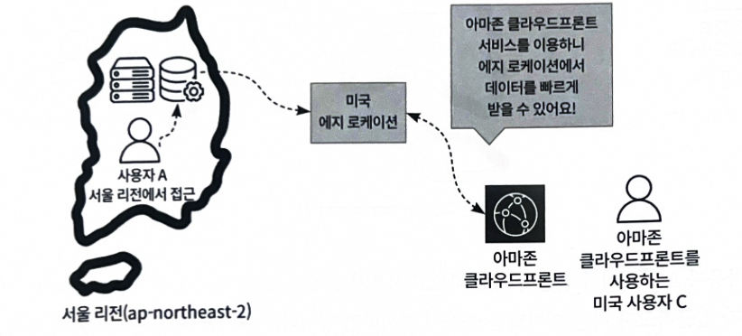

에지 로케이션에 캐시가 남아있지 않다면 오리진 서버에서 새롭게 요청을 해야 함.

그래서 오리진 서버와 에지 로케이션 사이에 `캐시 서버`를 둠

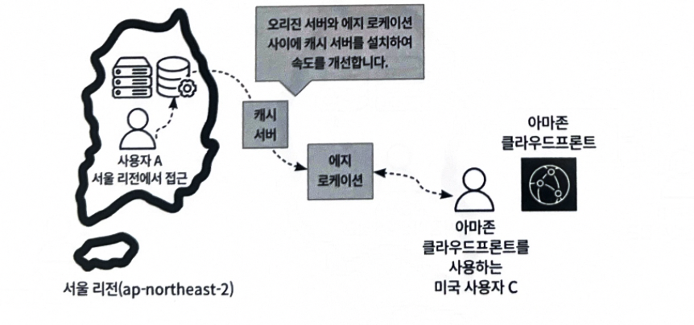

- 에지 로케이션에는 자주 접근하는 데이터만을 캐시
- 캐시 서버에는 더 큰 캐시를 저장

### 8. 가용성

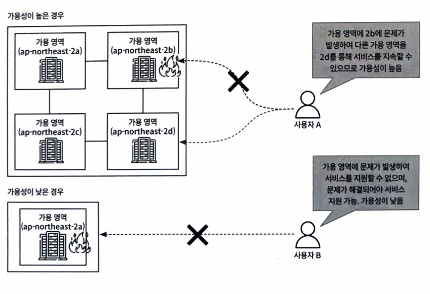

> 리전 내 자연 재해와 같은 여러 상황이 발생하여 시스템 장애가 나도 정상적으로 작동할 수 있는 정도를 의미함
> 

- 일반적으로 `일정 시간 동안의 가동 시간 비율`로 정의
    
    사용 가능 시간 ↑ 가용성 ↑
    
    중지 시간 ↓ 가용성 ↓
    
- `고가용성` : 시스템이나 서비스가 지속적으로 정상 운영이 되는 능력을 의미

### 9. 신뢰성

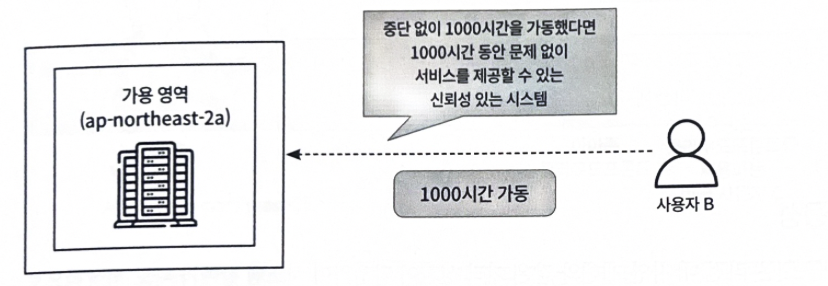

> 일반적으로 가동 시간 동안 시스템이 예상대로 작동하고 중단되지 않는 정도를 의미
> 

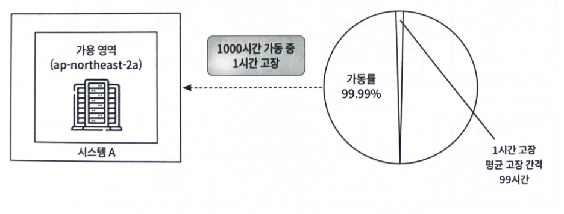

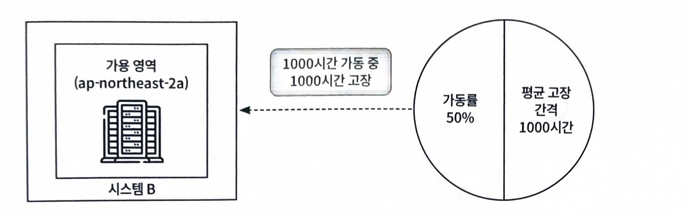

**가용성과 신뢰성 차이**

- **가용성은 “얼마나 자주 사용 가능한가”, 신뢰성은 “얼마나 오래 고장 없이 버티는가”**
    
    `가용성`은 시스템이 전체 시간 대비 얼마나 오랫동안 정상적으로 사용 가능한지를 나타내는 비율로 평가됨.
    반면, 시스템이 1000시간 동안 고장 없이 동작하는 것은 `신뢰성`과 관련된 지표로, 이는 고장 간격을 의미하며 가용성과는 직접적인 평가 기준이 다름
    

### 10. 내결함성

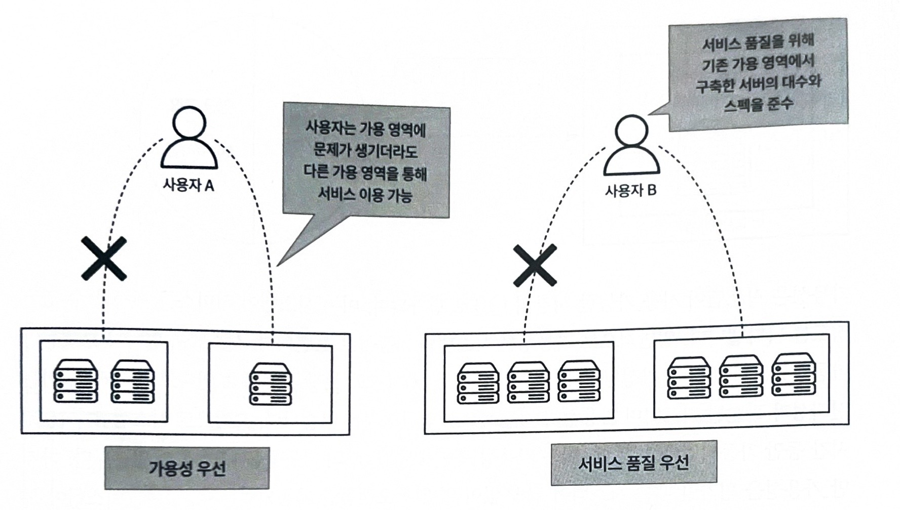

> 시스템에 장애가 발생하더라도 시스템 성능을 저하시키지 않고 서비스를 지속하게 하는 특성
> 
- 가용성과 내결함성의 차이점은 “서비스 지속성 우선”이냐, “서비스 품질 우선”이냐에 있음
- 내결함성은 기존 가용 영역에서 구축한 서버의 대수와 스펙을 준수해야 함

### 11. 탄력성

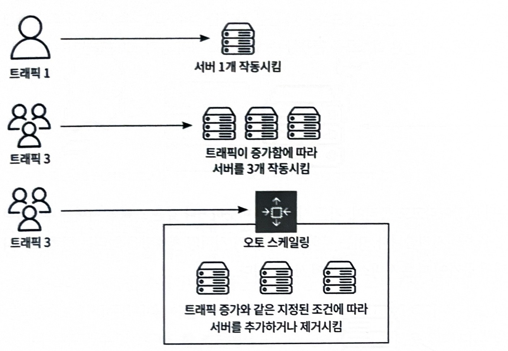

> 시스템이 비즈니스 상황에 따라 트래픽이나 부하에 대응하여 유연하게 자동으로 조정하는 능력
> 
- `오토 스케일링`
    - AWS에서 탄력성 유지를 위해 제공하는 서비스
    - CPU 사용률, 네트워크 트래픽 등 미리 정의된 조건에 따라 서버를 추가하거나 제거함

### 12. 확장성

> 비즈니스가 성장함에 따라 서버 용향이 한계에 도달할 때 인프라를 확장하는 것
> 

**서버를 확장하는 법 두 가지**

- **`스케일업`**
    
 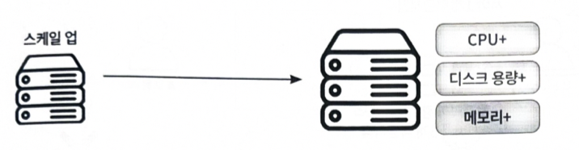

    
    - 기존 서버의 성능을 향상시키는 방법이며, 수직확장이라고도 불림
    - 디스크 용량, 메모리, CPU등을 업그레이드
- **`스케일아웃`**
    
  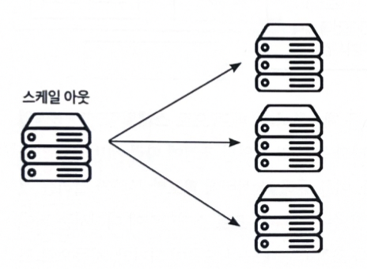

    
    - 비슷하거나 같은 스펙의 서버를 추가하여 전체 시스템 성능을 향상시키는 방법이며, 수평 확장이고도 불림
    - 사용자 증가나 트래픽 증가에 따른 서비스 확장에 사용

### 13. 비즈니스 연속성 계획

> BCP: 시스템 운영에 영향을 주는 재해와 장애를 방지하고 복구하는 대책
> 

 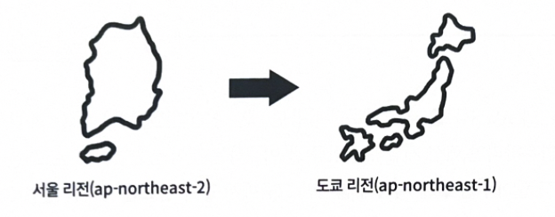

- AWS에서는 여러 리전을 제공하고 있기 때문에, 장애 발생 시 다른 리전을 활용한 재해 복구 DR환경을 구축할 수 있으며, 이를 기반하여 효과적인 BCP 수립이 가능