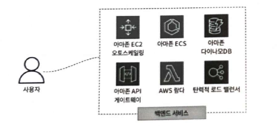
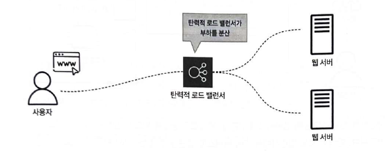
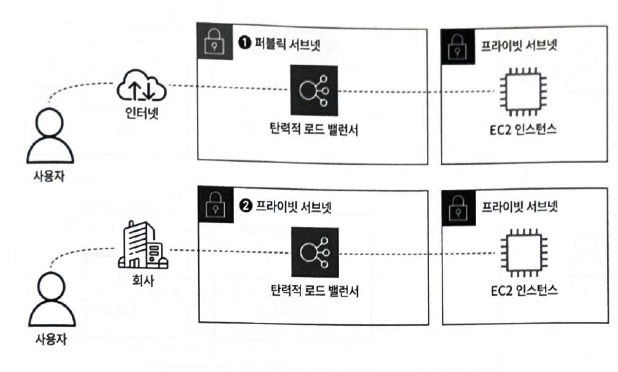
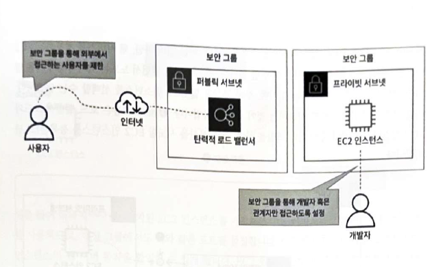
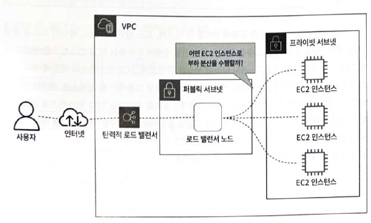
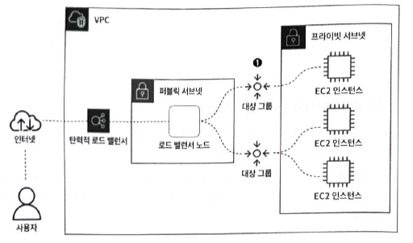
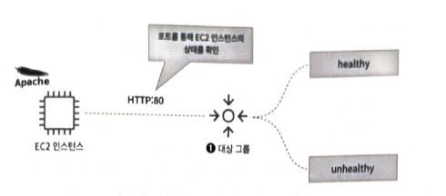
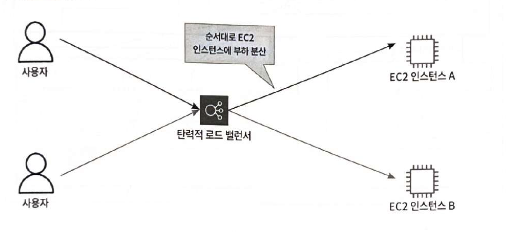

## **11.1 백엔드 서비스 유형 파악하기**

**백엔드**는 사용자가 직접 볼 수 없는 데이터 처리, 보안 등의 작업을 담당하는 서비스다. 
웹 애플리케이션의 프론트엔드가 사용자에게 시각적인 부분을 보여주는 반면, 백엔드는 데이터베이스와의 통신, 데이터 처리 등 눈에 보이지 않는 작업을 수행한다. 
AWS는 다양한 백엔드 서비스를 제공하며, 여기에는 Amazon EC2 오토 스케일링, Amazon ECS, Amazon DynamoDB, Amazon API Gateway, AWS Lambda, 그리고 탄력적 로드 밸런서(ELB) 등이 포함된다. 이러한 서비스들은 웹 애플리케이션의 안정성, 효율성, 확장성을 보장하여 사용자에게 안정적인 서비스를 제공하는 데 기여한다.

**AWS가 제공하는 백엔드 서비스들**

- **EC2 오토 스케일링:** 
갑자기 사진 올리는 사람이 많아지면, 자동으로 서버를 늘려줘서 시스템이 느려지지 않게 해줌
- **ECS (컨테이너 서비스):** 
앱을 작은 부품(컨테이너)으로 나누어 효율적으로 관리하고 실행할 수 있게 해줌.
- **DynamoDB:**
    
    사진 정보나 사용자 데이터 같은 것을 빠르게 저장하고 불러올 수 있는 특별한 데이터베이스
    
- **API Gateway:**
    
    앱이 백엔드 서비스와 안전하고 효율적으로 통신할 수 있는 통로를 만들어줌
    
- **Lambda:**
    
    서버를 직접 관리할 필요 없이 특정 코드를 실행시켜주는 서비스
    
- **탄력적 로드 밸런서 (ELB):**
    
    여러 서버에 사용자의 요청을 **분산**시켜줌
    

## **11.2 부하 분산 서비스, 탄력적 로드 밸런서란?**

> **탄력적 로드 밸런서(Elastic Load Balancer, ELB)**는 AWS에서 제공하는 부하 분산 서비스
> 

이는 사용자가 급증하더라도 트래픽을 여러 서버에 **분산**시켜 안정적으로 서비스를 운영할 수 있도록 돕는다. ELB는 웹 서버 앞에 배치되어 사용자의 모든 요청을 먼저 받아서, 미리 설정된 규칙에 따라 가장 적절한 웹 서버로 트래픽을 전달한다. 이를 통해 웹 서버를 외부에 직접 노출할 필요가 없어 보안이 강화되고, 개발자는 웹 서버에서 작업을 안전하게 수행할 수 있게 된다.

## **11.3 탄력적 로드 밸런서 살펴보기**

탄력적 로드 밸런서(ELB)는 1. **ALB(Application Load Balancer)**, 2. **NLB(Network Load Balancer)**, 3. **GWLB(Gateway Load Balancer)** 세 가지 유형을 제공한다.

### **로드 밸런서 유형별 특징**

각 로드 밸런서 유형은 OSI 7계층 모델 중 특정 계층에서 부하 분산을 수행한다.

- **ALB (Application Load Balancer)**
    - **OSI 계층:** 7계층 (응용 계층)
    - **트래픽 처리:** HTTP/HTTPS
    - **특징:** 웹 애플리케이션의 복잡한 요청 라우팅에 적합.
    URL 경로, 호스트 헤더, 쿼리 파라미터 등을 기반으로 트래픽을 라우팅할 수 있음.
- **NLB (Network Load Balancer)**
    - **OSI 계층:** 4계층 (전송 계층)
    - **트래픽 처리:** TCP/UDP/TLS
    - **특징:** 매우 높은 성능과 낮은 지연 시간을 요구하는 애플리케이션에 적합. 
    고정 IP 주소 할당이 가능.
- **GWLB (Gateway Load Balancer)**
    - **OSI 계층:** 3계층 (네트워크 계층)
    - **트래픽 처리:** 네트워크 트래픽
    - **특징:** 2020년 11월에 추가되었으며, 주로 타사 가상 어플라이언스(방화벽, 침입 탐지 시스템 등)를 AWS로 마이그레이션할 때 사용. 웹 애플리케이션 구축에는 적합하지 않다.

*이번 장에서는 주로 사용되는 **ALB와 NLB**에 중점을 둔다.*

### **11.3.1 로드 밸런서의 작동 방식**

로드 밸런서는 **퍼블릭 서브넷** 또는 **프라이빗 서브넷**에 생성될 수 있으며, 이는 서비스의 접근성을 결정한다.

- **퍼블릭 서브넷에 생성**
    - 외부 인터넷을 통해 웹 서비스를 공개할 때 사용. (예: `goldenrabbit.co.kr`처럼).
    - 로드 밸런서 노드가 퍼블릭 서브넷에 생성되어 인터넷을 통해 접근 가능
- **프라이빗 서브넷에 생성**
    - 사내에서만 특정 웹 서비스를 제공하고 싶을 때 사용
    - 로드 밸런서 노드가 프라이빗 서브넷에 생성되므로 인터넷을 통한 외부 통신은 불가능.

로드 밸런서는 여러 **가용 영역(Availability Zone)**에 걸쳐 부하 분산을 수행한다. 각 가용 영역에는 로드 밸런서의 부하 분산을 돕는 **로드 밸런서 노드**가 생성된다. 
이 노드들을 통해 가용 영역을 구분하고 부하 분산을 효율적으로 수행힌다. 

또한, 로드 밸런서에는 **보안 그룹**을 설정하여 접근 가능한 사용자를 제한할 수 있다. 외부에 공개되는 웹사이트의 경우 보안 그룹을 개방하여 모든 사용자가 접근할 수 있도록 설정하고, EC2 인스턴스의 보안 그룹을 수정하여 로드 밸런서의 접근만을 허용함으로써 직접적인 EC2 인스턴스 접근을 차단하여 보안을 강화할 수 있다. 

특정 사용자 그룹(예: 개발자, 관리자)만 접근하도록 보안 그룹을 설정할 수도 있다.

### **11.3.2 로드 밸런서의 대상 그룹과 리스너**

로드 밸런서의 핵심 구성 요소는 **대상 그룹(Target Group)**과 **리스너(Listener)이**다.

- **대상 그룹 (Target Group)**
    

    
    - 로드 밸런서가 부하를 분산할 EC2 인스턴스(혹은 다른 대상)들을 등록하고 관리하는 역할을 한다. 로드 밸런서 노드는 가용 영역을 구분하고, 대상 그룹을 통해 실제 부하 분산을 수행할 EC2 인스턴스를 선택한다.
    - 여러 개의 대상 그룹을 생성하여 EC2 인스턴스의 역할(예: 웹 서비스 제공, API 처리)에 따라 구분하여 등록하는 것이 좋다.
    - 대상 그룹은 등록된 EC2 인스턴스의 **상태 확인(Health Check)**을 수행한다. 지정된 포트(예: HTTP 80번 포트)를 통해 웹 서버가 정상적으로 동작하는지 확인하고, 건강한(healthy) 인스턴스에만 트래픽을 전달한다. 문제가 있는 인스턴스는 unhealthy로 판단하여 트래픽에서 제외시킨다.
- **리스너 (Listener)**
    

    
    - 로드 밸런서로 들어오는 클라이언트 요청을 수신하고, 이 요청을 어떤 대상 그룹으로 라우팅할지 결정하는 규칙(리스너 규칙)을 정의한다.
    - **프로토콜 및 포트 기반 라우팅:**
        - 예를 들어, HTTPS:443으로 들어오는 요청은 대상 그룹 A로, HTTPS:444로 들어오는 요청은 대상 그룹 B로 라우팅할 수 있다.
        - 로드 밸런서는 HTTPS (443 포트) 및 TLS (443 포트)와 같은 보안 프로토콜 사용을 지원하며, 이를 위해 **SSL/TLS 인증서**가 필요하다. AWS Certificate Manager(ACM)를 통해 인증서를 발급받거나 외부 인증서를 등록할 수 있다.
    - **경로 기반 라우팅:**
        - 특정 URL 경로(예: `/web`, `/api`)에 따라 다른 대상 그룹으로 트래픽을 라우팅할 수 있다. 예를 들어, `https://goldenrabbit.co.kr/web`으로 접근하면 웹 서비스 EC2 인스턴스로, `https://goldenrabbit.co.kr/api`로 접근하면 API 처리 EC2 인스턴스로 라우팅하는 식이다.
    - **고정 응답 반환 규칙:**
        - 잘못된 URL 접근이나 서버 점검 중일 때 특정 HTTP 응답 코드(예: 503 Service Unavailable)와 텍스트(HTML, JSON 등)를 반환하도록 설정할 수 있다.

### **11.3.3 부하 분산을 위한 로드 밸런서의 알고리즘**

> 로드 밸런서는 다양한 **부하 분산 알고리즘**을 사용하여 트래픽을 효율적으로 분산한다.
> 
- **라운드 로빈**
    

    
    - 클라이언트로부터 받은 요청을 대상 서버에 **순서대로** 할당하는 방식
        
        첫 번째 요청은 첫 번째 서버, 두 번째 요청은 두 번째 서버 등으로 할당된다.
        
    - 모든 대상 서버의 성능이 동일하고 요청 처리 시간이 짧은 애플리케이션에 적합하며, 균등한 부하 분산을 제공.
- **가중치 랜덤 (Weighted Random Method)**
    - 정상 작동하는 서버에 **임의의 순서로** 요청을 라우팅하지만, 각 서버에 할당된 '가중치'에 따라 요청을 더 많이 보낼지 적게 보낼지 결정.
    - AWS ALB는 이 기능을 ATW(Automatic Target Weights)를 통해 지원하며, 대상 서버의 장애나 성능 저하를 감지하여 비정상적인 대상에게는 트래픽을 보내지 않고 정상적인 대상에게만 전달하여 오류를 방지한다.
- **최소 미해결 요청 (Least Outstanding Requests)**
    - **현재 연결 수가 가장 적은 서버**로 요청을 라우팅하는 동적인 분산 알고리즘이다.
    - 각 서버에 대한 현재 활성 연결 수를 동적으로 카운트하여, 부하가 적은 서버에 더 많은 요청을 보내 부하를 균등하게 분산시킨다.

이러한 로드 밸런서 알고리즘은 주로 ALB에서 사용됩니다. NLB는 AWS의 독자적인 부하 분산 기술인 **AWS Hyperplane**을 사용한다.

**교차 영역 로드 밸런싱 (Cross Zone Load Balancer)**

> 여러 가용 영역에 분산된 서버들 간에 트래픽을 균등하게 분산하는 기능
> 
- **ALB:** 항상 교차 영역 로드 밸런싱이 유효화되어 있으며 비활성화할 수 없습니다. 즉, ALB는 기본적으로 모든 가용 영역의 서버에 트래픽을 균등하게 분산합니다.
- **NLB:** 교차 영역 로드 밸런싱을 유효화할지 무효화할지 선택할 수 있습니다. **p.16**
    - **무효화 시:** 각 가용 영역 내에서만 트래픽이 분산되며, 가용 영역별 서버 수에 따라 부하 분산이 불균등해질 수 있습니다 (예: 특정 가용 영역에 서버가 적으면 더 많은 부하를 받음). **p.16**
    - **유효화 시:** 모든 가용 영역의 서버에 트래픽을 균등하게 분산한다.
    - 

**고정 IP 필요 시 NLB와 ALB의 활용** 

NLB는 ALB와 달리 **고정 IP 주소**를 사용할 수 있어, 특정 IP로만 접근을 허용하거나 항상 같은 IP 주소로 액세스해야 하는 보안 요구사항이 있을 때 유용하다.
NLB는 네트워크 계층(4계층)에서 동작하여 TCP, UDP, TLS 트래픽을 처리하며 단순한 로드 밸런싱에 중점을 두는 반면, ALB는 응용 계층(7계층)에서 웹 요청을 해석하고 라우팅하는 고급 웹 기능을 제공한다. 현재는 NLB를 ALB 앞단에 배치하여 사용자들이 고정 IP로 접근하면서도 ALB의 고급 기능을 활용할 수 있도록 구성하는 것이 가능하다.

### **11.3.4 환경별 로드 밸런서 구성 패턴 살펴보기**

서비스를 개발하고 배포할 때는 일반적으로 **개발 환경**과 **실전 환경**을 분리하여 사용합니다. 로드 밸런서도 이러한 환경에 맞춰 다양한 구성 패턴을 가질 수 있다.

- **패턴 1: 환경별 로드 밸런서 분리** **p.17**
    - 실전 환경과 개발 환경에 각각 별도의 로드 밸런서를 생성하고 관리하는 방식.
    - **장점:**
        - **문제 분산:** 개발 환경에서 발생한 문제가 실전 환경에 영향을 미치지 않도록 한다.
        - **트래픽/리소스 분리:** 각 환경의 트래픽과 리소스 사용률을 독립적으로 관리할 수 있다.
        - **액세스 제어 정책:** 각 환경에 맞는 보안 등급과 액세스 제어 정책을 적용할 수 있다 (예: 실전 환경에 더 엄격한 보안).
        - **독립적 확장:** 각 로드 밸런서를 독립적으로 확장하고 성능을 조절할 수 있다.
    - 가장 일반적이고 이상적인 패턴으로 간주된다.
- **패턴 2: 하나의 로드 밸런서로 환경 제어**
    - 하나의 로드 밸런서로 실전 환경과 개발 환경을 모두 제어하는 방식이다.
    - **단점:** 로드 밸런서에 장애가 발생할 경우 두 환경 모두에 영향을 미칠 수 있다.
    - **접근 방법:** 리스너 규칙을 사용하여 포트 기반 라우팅(예: 실전 환경 443번 포트, 개발 환경 444번 포트) 또는 경로 기반 라우팅(예: `goldenrabbit.co.kr/dev/` 경로)을 통해 각 환경에 접근할 수 있다.
    - **고려 사항:** 리스너 규칙이 복잡해지고 관리가 어려워질 수 있습니다. 같은 EC2 인스턴스나 같은 환경에서 여러 경로로 나누고 싶을 때 유용하다.

**11.4 탄력적 로드 밸런서를 생성하고 EC2 인스턴스와 연동하기**

- **구축 환경 예시**
    - 퍼블릭 서브넷에 로드 밸런서를 생성
    - 대상 그룹에는 아파치 웹 서버가 설치된 EC2 인스턴스가 등록.
    - 사용자는 HTTP 80번 포트를 통해 로드 밸런서로 접근하며, 아파치 웹 페이지가 출력되는 것을 확인할 수 있다.
    - 사용자는 브라우저에서 HTTPS 프로토콜을 통해 안전하게 접속할 수 있도록 설정할 수 있다. (로드 밸런서의 리스너에서 HTTPS 443 포트와 인증서 설정 필요)