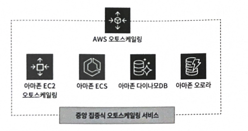
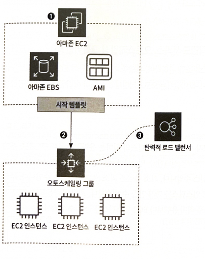
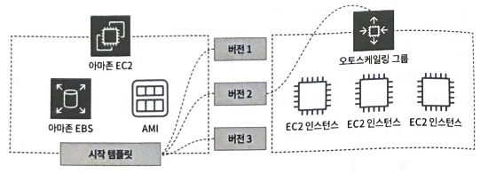
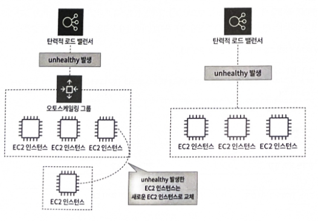
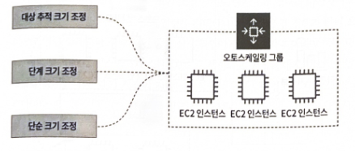
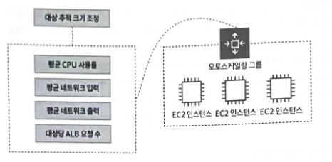
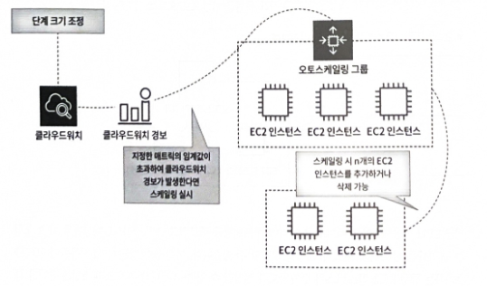
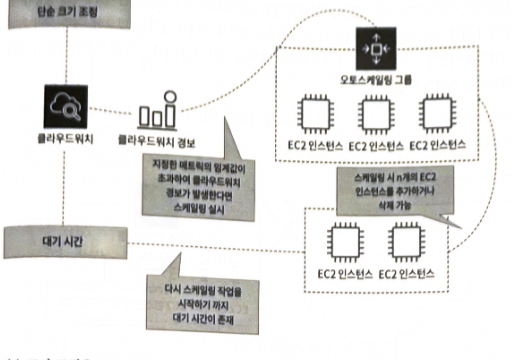
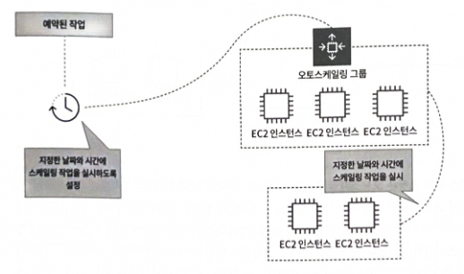
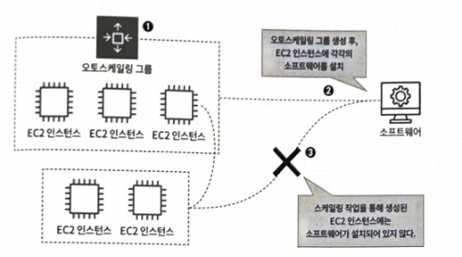

## **12.1 클라우드 서버 최적화, 아마존 EC2 오토스케일링이란?**

> 오토 스케일링은 스케일업, 스케일아웃, 스케일인을 통해 클라우드 서버를 최적화 하는 데 사용된다.
> 
- **스케일업**: 기존 EC2 인스턴스의 사양(CPU, 메모리, 디스크 용량 등)을 업그레이드하여 성능을 향상시키는 것을 의미
- **스케일아웃**: 같은 사양의 추가 서버를 더하여 시스템 부하를 분산시키고 가용성을 향상시키는 것을 의미
- **스케일인**: 스케일아웃으로 생성된 서버가 더 이상 필요 없을 때 서버를 삭제하는 것을 의미. AWS 오토 스케일링은 EC2 오토스케일링을 포함하여 아마존 EC2, 다이나모DB, 오로라 등 다양한 AWS 서비스에 대한 스케일링을 중앙 집중식으로 관리하고 통합하는 서비스이다.
    
    

    

## **12.2 클라우드 서버 최적화 서비스, 아마존 EC2 오토스케일링 살펴보기**

아마존 EC2 오토스케일링은 **오토스케일링 그룹을 생성**하여 EC2 인스턴스의 스케일업, 스케일아웃, 스케일인을 구현한다. 오토스케일링 그룹을 생성하려면 기본적인 EC2 인스턴스 구성(인스턴스 유형, 보안 그룹, AMI 등)을 설정해야 한다. 이 구성은 시작 템플릿을 사용하여 설정한다.

오토스케일링 그룹 생성 과정은 다음과 같다.

- **시작 템플릿 생성**: EC2 인스턴스를 생성할 때와 동일하게 AMI, 인스턴스 유형, EBS 볼륨, 네트워크 설정 등을 입력하여 시작 템플릿을 생성한다.
- **오토스케일링 그룹 생성**: 생성된 시작 템플릿을 바탕으로 오토스케일링 그룹을 생성하면 시작 템플릿에 설정된 값과 같은 EC2 인스턴스가 생성된다.
- **탄련적 로드 밸랜서와 연동**: 오토스케일링 그룹은 탄력적 로드 밸러서와 함께 사용될 수 있다.
    

    

EC2 인스턴스는 오토스케일링 그룹에 속하여 관리되며, 시작 템플릿은 여러 버전을 만들어 상황에 따라 오토스케일링 그룹에 적용할 수 있다. 이를 통해 서버 인스턴스의 스펙을 업그레이드하거나 다양한 설정을 적용할 수 있다.

### **12.2.1 클라우드 서버 최적화 백엔드 서비스, 오토스케일링 그룹이란?**

### **오토스케일링 그룹 크기**

오토스케일링 그룹의 크기는 세 가지 용량으로 설정할 수 있다.

- **원하는 용량:** 오토스케일링 그룹 생성 시 초기 EC2 인스턴스 수
- **최소 용량**: 오토스케일링 그룹이 유지해야 하는 최소 EC2 인스턴스 수
- **최대 용량**: 오토스케일링 그룹이 유지해야 하는 최대 EC2 인스턴스 수

***예시*: 원하는 용량 2, 최소 용량 2, 최대 용량 3으로 설정 시**

- 초기 2대의 EC2 인스턴스 생성
- 최소 2대를 유지하므로, 인스턴스 1대가 삭제되면 새로운 인스턴스를 생성하여 항상 2대를 유지한다.
- 최대 3대까지만 스케일 가능하며, 3대를 초과하는 인스턴스는 생성되지 않는다

#### **오토스케일링 그룹과 로드 밸런서**

오토스케일링 그룹은 로드 밸런서와 함께 사용하는 것이 확장성과 가용성을 위해 권장된다.

- 로드밸런서는 개별적으로 생성하여 오토스케일링 그룹에 연결하거나, 오토스케일링 그룹 생성 시 함께 생성하여 연결할 수 있다.
- 오토스케일링 그룹에 연결된 로드 밸런서는 **탄력적 로드 밸런서 상태 확인 기능**을 제공한다.
- 로드 밸런서의 상태 확인에서 EC2 인스턴스가 `unhealthy`로 감지되면, 해당 인스턴스는 오토스케일링 그룹에서 제외되고 새로운 EC2 인스턴스로 교체되어 서비스 중단을 방지한다.
- **오토스케일링 그룹 없이 로드 밸런서만** 사용하는 경우, `unhealthy` 인스턴스가 감지되어도 교체 작업은 이루어지지 않는다.
- 오토스케일링 그룹의 상태 확인 옵션은 사용자가 임의로 선택할 수 있으며, 해제 시 `unhealthy` 인스턴스가 발생해도 교체하지 않는다.

#### **오토스케일링 그룹 스케일 정책**

오토스케일링 그룹은 사용자가 수동으로 EC2 인스턴스를 스케일할 수 있지만, 정책을 통해 자동으로 스케일할 수도 있다.

자동 스케일 정책은 크게 **동적 크기 조정 정책**과 **예측 크기 조정 정책**으로 나뉜다.

**동적 크기 조정 정책**

- **대상 추적 크기 조정**
    

    
    - 선택한 지표(예: 평균 CPU 사용률, 네트워크 입/출력, ALB 요청 수) 유형을 기반으로 오토 스케일링 작업을 수행한다.
    - 예를 들어, 평균 CPU 사용률이 70%를 초과하면 EC2 인스턴스를 추가하도록 설정할 수 있다.
- **단계 크기 조정**
    

    
    - 클라우드워치 경보를 기반으로 스케일링 작업을 실행한다.
    - 클라우드 워치 경보는 특정 지표(예: CPU 사용률, 메모리 사용량)가 지정된 임계값을 초과하면 경고를 보내는 서비스다.
    - 이 경보를 바탕으로 EC2 인스턴스를 추가하거나 삭제하며, 추가 또는 삭제할 인스턴스 수를 설정할 수 있다.
- **단순 크기 조정**
    

    
    - 오토스케일링 그룹 서비스 초기부터 존재했던 정책으로, 단계 조정 정책과 마찬가지로 클라우드워치 경보를 기반으로 스케일링을 진행한다.
    - 하지만 스케일링 작업 후 지정된 대기 시간이 존재하여, 대기 시간이 끝나야 다음 스케일링 작업을 진행할 수 있다.
    - 현재는 대기 시간이 없는 단계 크기 조정 정책 사용을 권장한다.

**예측 크기 조정 정책**

- 머신러닝을 사용하여 클라우드워치 24시간 기록 데이터를 기반으로 향후 필요한 수요를 미리 예측한다.
- 특정 요일 또는 시간에 트래픽이 증가하는 패턴에 적합하다.
- 예측보다 실제 트래픽이 적거나 많을 경우 스케일링이 제대로 이루어지지 않을 수 있으므로, 동적 크기 조정 정책과 함께 사용하는 것이 좋다.

**예약된 작업**

- 특정 날짜와 시간을 정해 스케일링 작업을 실시하는 정책이다.
- 예측 크기 조정 정책과 달리 지정된 시간에 스케일링 작업을 실시하므로, 급격한 트래픽 증가 시간대를 미리 알고 있는 경우 유용하다.
- 매일, 매주 또는 1시간마다와 같이 정기적으로 반복 설정할 수 있다.

#### **오토스케일링 그룹과 AMI**

오토스케일링 그룹을 사용할 때 중요한 고려 사항은 **AMI이다**

- 오토스케일링 그룹은 시작 템플릿에 설정된 값을 바탕으로 EC2 인스턴스를 생성하므로, 사용자가 수동으로 설치한 소프트웨어는 스케일 작업을 통해 생성된 EC2 인스턴스에 적용되지 않는다.
- 이 문제를 해결하기 위해, 처음 EC2 인스턴스에 필요한 소프트웨어를 설치한 후, 그 상태에서 **새로운 AMI를 생성한다.**
- 이렇게 생성된 AMI에는 설치된 소프트웨어와 사용자 설정 값이 모두 포함되어 있으므로, 이 AMI를 기반으로 새로운 EC2 인스턴스를 생성하면 이전 인스턴스와 동일한 구성과 소프트웨어 환경을 가진 인스턴스가 생성된다.
- 기존 오토스케일링 그룹의 AMI를 이 새로운 AMI로 교체하면, 앞으로 생성되는 모든 EC2 인스턴스에 소프트웨어가 자동으로 설치된 상태로 배포된다.

#### **오토스케일링 그룹 종료 정책**

> 오토스케일링 그룹에서 스케일인 작업을 수행하여 EC2 인스턴스를 삭제할 때, 어떤 인스턴스부터 삭제할지 결정하는 정책
> 

**기본값:**

- 가용 영역 내에서 종료 방지 기능이 설정되지 않은 인스턴스 중, 가장 오래된 시작 템플릿이 있는 인스턴스를 삭제한다.
- 해당 조건의 인스턴스가 여러 대인 경우, 결제 시간이 가장 가까운 인스턴스를 삭제한다.

**할당 전략:** 

- 인스턴스 유형(스팟 인스턴스 또는 온디맨드 인스턴스)의 배포 전략에 맞추어 종료한다.

**가장 오래된 시작 템플릿:**

- 가장 오래된 시작 템플릿을 사용하는 EC2 인스턴스를 삭제한다.

**다음 인스턴스 시간과 가장 가까움:**

- 결제 시간에 가장 가까운 EC2 인스턴스를 삭제하여 비용 효율성을 높인다.

**최신 인스턴스:**

- 가장 최근에 생성된 EC2 인스턴스를 삭제한다.

**가장 오래된 인스턴스:**

- 생성 시간이 가장 오래된 EC2 인스턴스를 삭제한다.

## **12.3 아마존 EC2 오토스케일링 생성해보기**

이 실습에서는 오토스케일링 그룹을 생성하고 스케일 작업이 어떻게 이루어지는지 확인한다.

**12.3.1 오토스케일링 그룹 생성해보기** 

클라우드포메이션(CloudFormation) YAML 파일을 사용하여 오토스케일링 그룹을 생성

**12.3.2 UI로 불러와 오토스케일링 그룹 생성하기**

**클라우드포메이션 스택 생성,** UI 기반으로 오토스케일링 그룹을 생성하고 스케일 작업이 이루어지는 과정을 확인