[13.1 컨테이너 서비스, 아마존 ECS란?]

[13.2 컨테이너 서비스, 아마존 ECS 살펴보기]

[13.3 아마존 ECS on 파게이트 생성해보기]

## **13.1 컨테이너 서비스, 아마존 ECS란?**

아마존 ECS(Elastic Container Service)는 AWS에서 도커 컨테이너를 배포, 운영, 관리하는 완전 관리형 컨테이너 서비스. 
도커는 **환경 불일치(Environment Disparity)** 문제를 해결하는 오픈 소스 프로젝트이다.

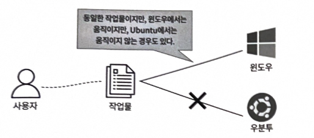

환경 불일치 예

**환경 불일치란**

> 개발한 프로그램이 개발 환경에서는 잘 돌아가는데, 다른 컴퓨터 (운영 환경)에서는 제대로 작동하지 않는 문제
> 

**도커가 환경 불일치를 해결하는 법**

도커는 **컨테이너**라는 기술을 사용해서 해당 문제를 해결한다.

컨테이너는 애플리케이션과 그 애플리케이션을 실행하는 데 필요한 모든 것(코드, 런타임, 시스템 도구, 라이브러리 등)을 하나로 묶어주는 가상의 상자 같은 것이다.

- **동일한 개발 환경 구성**
    
    **도커는 어떤 컴퓨터에서든 똑같은 개발 환경을 만들 수 있도록 도와준다.**
    
- **도커 파일**
    
    도커 파일에는 어떤 운영체제를 기반으로 할지, 어떤 프로그램을 설치할지, 어떻게 실행할지 등 개발 환경을 구성하는 모든 단계가 적혀있다.
    
    ```docker
    FROM nginx:latest # 최신 Nginx 이미지를 기반으로 시작
    MAINTAINER "kim.jaewook" # 작성자 정보
    COPY ./index.html /usr/share/nginx/html/index.html # 로컬 파일을 컨테이너로 복사
    EXPOSE 80 # 컨테이너의 80번 포트를 외부에 노출
    CMD ["nginx", "-g", "daemon off;"] # 컨테이너 시작 시 Nginx 실행
    ```
    
- **도커 허브**
    
    도커 이미지를 공유하는 공간
    

**컨테이너 생성 과정**

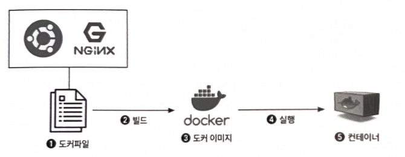

- **도커 파일 작성**
- **빌드**
    
    도커 파일을 이용해서 **도커 이미지**를 만든다.
    
    이 이미지는 애플리케이션과 모든 종속성이 포함된 정적인 상태의 스냅샷
    
- **실행**
    
    도커 이미지를 실행하면 **컨테이너**가 된다.
    
    이 컨테이너는 독립적인 환경에서 애플리케이션을 실행한다.
    

**컨테이너의 특징**

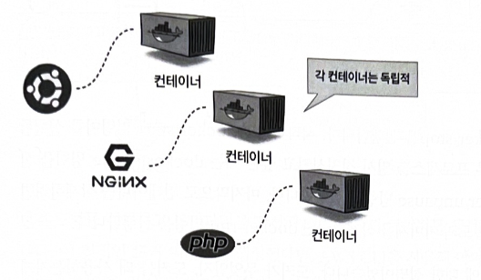

- **독립적**
- **재사용성**
    
    한 번 만든 도커 이미지는 여러 서버에서 동일한 환경을 구축하는 데 사용 가능
    
    새로운 프로젝트를 시작할 때 마다 EC2 인스턴스를 생성하거나 물리서버를 설정할 필요가 없어 효율적
    

**도커 생명주기**

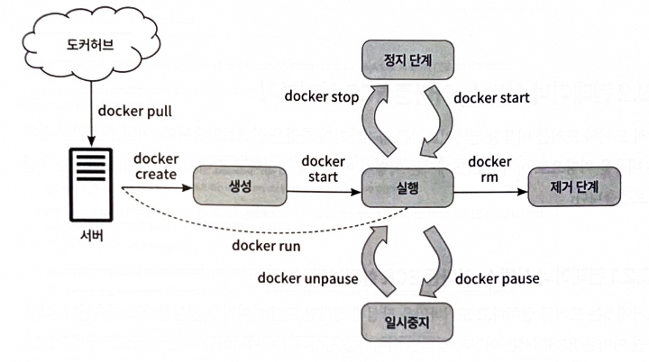

- **Pull(다운로드)**
    
    `docker pull [이미지 이름]` 명령어로 도커 허브에서 도커 이미지를 다운로드한다. `docker run` 명령어를 사용하면 이미지를 다운로드하고 바로 컨테이너를 시작할 수 있다.
    
- **Create(생성)**
    
    `docker create [이미지 이름]` 명령어로 다운로드한 이미지를 기반으로 컨테이너를 생성한다. (아직 실행 전)
    
- **Start(시작)**
    
    `docker start [컨테이너 ID]` 명령어로 생성된 컨테이너를 실행한다.
    
- **Stop(중지)**
    
    `docker stop [컨테이너 ID]` 명령어로 실행 중인 컨테이너를 중지한다.
    
- **Pause (일시 정지)**
    
    `docker pause [컨테이너 ID]` 명령어로 컨테이너 내부 프로세스를 일시 정지한다
    
- **Unpause (재시작)**
    
     `docker unpause [컨테이너 ID]` 명령어로 일시 정지된 컨테이너를 재시작한다.
    
- **Remove (삭제)**
    
    `docker rm [컨테이너 ID]` 명령어로 중지된 컨테이너를 삭제한다. `docker rmi [이미지 이름]` 명령어로 도커 이미지를 삭제할 수 있다
    

요약하자면 도커는 환경불일치를 해결해주는 도구이다. 개발 환경을 컨테이너라는 표준화된 상자에 넣어 어디서든 동일하게 작동하도록 해준다. 컨테이너를 만들 때는 도커파일을 사용하고, 컨테이너들을 공유하는 도커허브도 활용 가능하다. 

이 모든 과정을 통해 개발자는 복잡한 환경 설정 대신 애플리케이션 개발에만 집중할 수 있다.

## **13.2 컨테이너 서비스, 아마존 ECS 살펴보기**

아마존 EC2는 도커 컨테이너를 AWS에서 효율적으로 관리하고 실행하기 위한 서비스이다.

도커에서 정적이미지를 생성하고 컨테이너화하는 과정을 배웠으니 AWS에서는 이 과정을 어떻게 처리하는지 알아본다.

### **13.2.1 컨테이너 서비스, 아마존 ECR 살펴보기**

**아마존 ECR(Elastic Container Registry)**

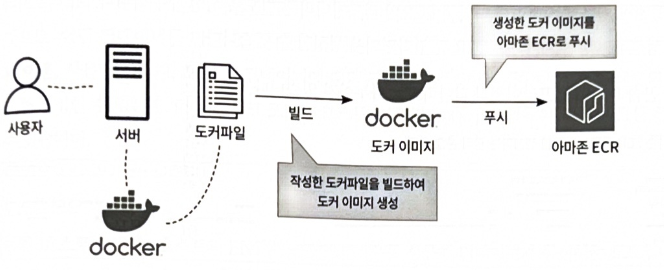

> 도커 이미지를 보관하고 관리하는 AWS 서비스다. 
도커에서 만든 정적 이미지를 아마존 ECR로 푸시하여 중앙에서 관리할 수 있다.
> 

**아마존 ECR 사용 과정**

- **도커 이미지 생성**
    
    도커가 설치된 환경에서 도커파일을 작성하고 빌드하여 정적인 도커 이미지를 생성 (예: `docker build -t ecs-nginx .` )
    
- **ECR 리포지토리 생성**
    
    아마존 ECR 콘솔에서 이미지를 저장할 리포지토리(저장소)를 생성한다. 
    
    리포지토리는 프라이빗과 퍼블릭으로 나눌 수 있다.
    
    - **프라이빗 리포지토리:** IAM 권한이 있는 사용자만 접근 가능
    - **퍼블릭 리포지토리:** 누구나 접근 가능
    - *생성 후에는 리포지토리 유형을 변경할 수 없으므로 신중하게 결정해야 함*
- **ECR로 이미지 푸시**
    
    AWS CLI를 사용하여 생성된 도커 이미지를 ECR 리포지토리로 업로드한다.
    
    ECR 콘솔에서 제공하는 명령어를 사용하면 쉽게 푸시할 수 있다.
    
    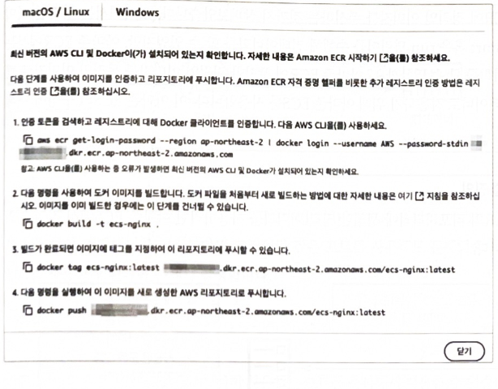
    
    - **인증:** `aws ecr get-login-password --region ap-northeast-2 | docker login --username AWS --password-stdin [ECR 주소]` 명령어로 도커 클라이언트를 ECR에 인증
    - **태그 지정:** `docker tag ecs-nginx:latest [ECR 주소]/ecs-nginx:latest` 명령어로 이미지에 태그를 지정
    - **푸시:** `docker push [ECR 주소]/ecs-nginx:latest` 명령어로 이미지를 ECR로 푸시

---

### **13.2.2 컨테이너 서비스, 아마존 ECS 구성 요소**

아마존 ECR에 푸시된 정적인 이미지를 동적인 컨테이너로 변환하여 사용하려면 아마존 ECS의 구성 요소를 이해해야 한다.

**아마존 EC2 작업 정의**

> 작업 정의는 아마존 ECR의 이미지를 비롯한 컨테이너의 전체적인 구성을 정의하는 설계도
> 


- **포함되는 설정**
    
    작업 이름, 컨테이너 이름, 사용할 이미지, 포트, 환경 변수, 볼륨, 실행 역할, 네트워크 모드 등 컨테이너에 대한 전반적인 설정이 포함
    
- **네트워크 모드**
    
    > 컨테이너가 외부와 어떻게 소통할지 결정하는 부분
    > 
    
    - **호스트 모드**
        
        > 컨테이너가 호스트(EC2 인스턴스)의 네트워크를 그대로 쓴다. 
        만약 호스트에 80번 포트를 쓰는 다른 프로그램이 있다면 컨테이너도 80번 포트를 쓸 수 없다.
        > 
        
       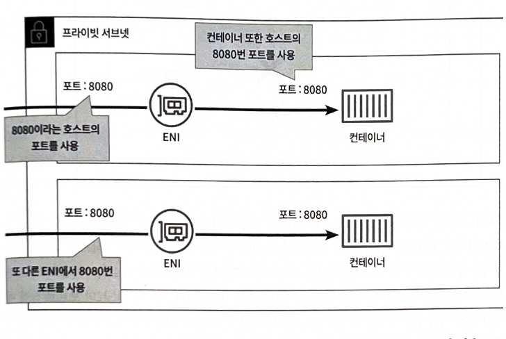
        
        - 컨테이너가 호스트(EC2 인스턴스)의 ENI((Elastic Network Interface)를 직접 사용
        - 컨테이너 포트가 호스트 포트로 직접 매핑됨
        - **단점:** 동일한 ENI를 사용하는 경우 같은 포트를 중복해서 사용할 수 없다. 따라서 로드 밸런서를 통한 여러 컨테이너 간의 부하 분산이 어렵다
            
            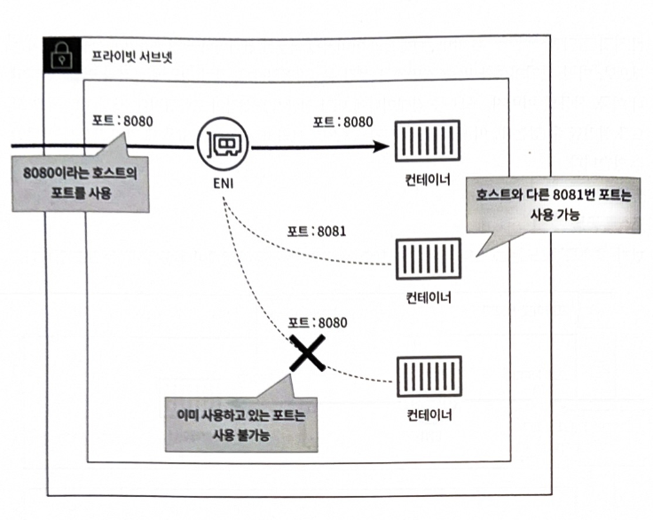
            
            
    - **브리지 모드**
        
        > 호스트와 컨테이너 사이에 다리(브리지)를 놓아준다. 컨테이너는 자기만의 포트를 가지고, 호스트는 이 포트를 외부 포트에 연결해줄 수 있다. 이 덕분에 여러 컨테이너가 같은 서비스(예: 웹 서버)를 제공하더라도 충돌 없이 로드 밸런서로 트래픽을 분산할 수 있다.
        > 
        
        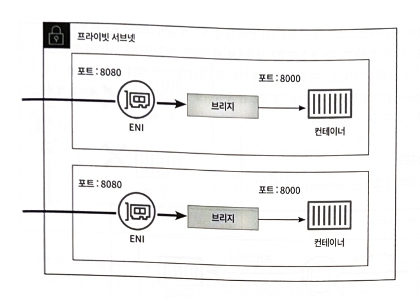        
        - ENI와 컨테이너 사이에 브리지 레이어를 추가하여 호스트와 컨테이너를 다른 포트로 연결할 수 있게 함
        - 호스트와 컨테이너의 포트가 구분되어 있어 같은 포트로 여러 컨테이너를 가동시킬 수 있음
        - **장점:** 로드 밸런서를 사용해 부하 분산이 가능하며, 호스트 포트를 `0`으로 지정하면 임시 포트 범위(32768~61000, 에페메랄 포트)에서 동적으로 포트가 매핑됨
            
            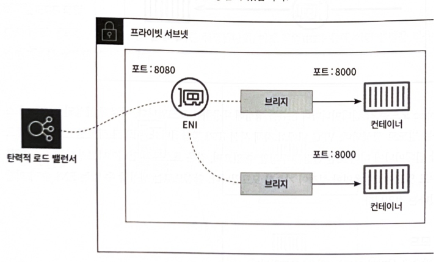
        - **주의**: 임시 포트는 제어하기 어려울 수 있음
    - **awsvpc 모드**
        
        > 각 컨테이너에게 전용 네트워크 인터페이스(ENI)를 부여해서 독립적인 IP 주소를 준다. 마치 컨테이너 하나하나가 자기만의 전용선과 전화번호를 갖는 것과 같다.
        > 
        
        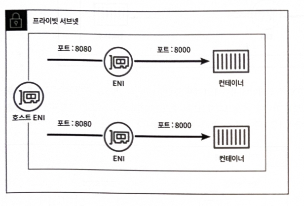
        - 각 컨테이너마다 ENI를 생성하여 자체 사설 IP를 할당하는 모드
        - **장점:** 컨테이너별로 독립적인 보안 그룹 설정, 같은 호스트 내 컨테이너 통신 제한 등 유연한 네트워크 설정이 가능
        - **단점:** 생성할 수 있는 ENI 수에 제한이 있음
    - **없음 모드**
        
        > 네트워크를 전혀 사용하지 않는 컨테이너에 사용하며, 외부와 소통할 필요없이 내부적으로만 작업하는 컨테이너에 적합하다.
        > 
        
        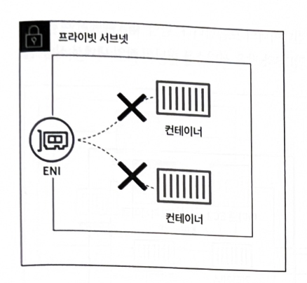
        
        - 포트 매핑이 불가능하며 외부와의 연결이 차단된 모드
        - 네트워크 기능이 불필요한 로그 수집, 데이터 교환, 데이터베이스 등의 작업에 사용됨

**아마존 ECS 작업 (Task)**

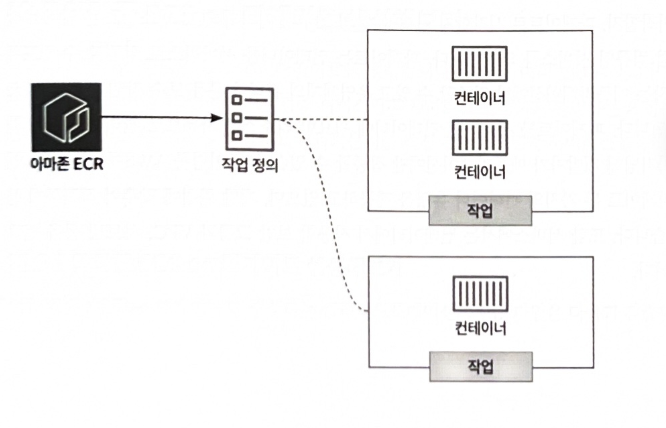

> 작업은 작업 정의를 기반으로 시작된 컨테이너의 모음 (실제 인스턴스)
> 

하나의 작업 내에서 여러 컨테이너(예:  Nginx와 MariaDB)를 함께 실행할 수 있다. 

**아마존 ECS 서비스 (Service)**

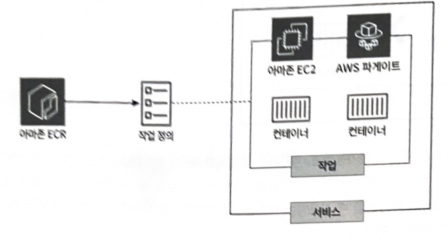

> 아마존 ECS 작업를 관리하고 유지하는 서비스
> 
- 설정된 원하는 작업 수에 따라 자동으로 새 작업을 시작하여 **지정된 수의 작업이 항상 유지**되도록 관리한다.
    
    (예: 작업 수를 2로 설정하면 2개가 항상 유지)
    
- **컨테이너 시작 유형 선택**
    - **EC2 인스턴스**: **사용자가 직접** EC2 인스턴스를 프로비저닝하고 관리하는 방식
    - **AWS 파게이트: 서버리스 방식으로** 컨테이너를 실행한다. 사용자는 운영체제 관리나 서버 유지보수 작업에 신경 쓸 필요가 없다.
- **추가 설정:** 보안그룹, VPC, 서브넷 등을 선택하여 서비스에 적용할 수 있다.

**아마존 EC2 클러스터**

 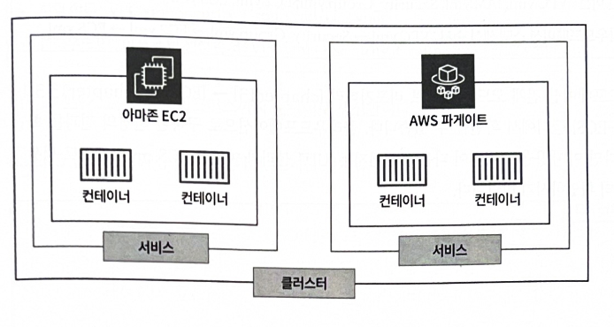

> 클러스터는 서비스와 작업을 포함하는 컨테이너 관리 및 배포를 위한 컴퓨팅 자원의 집합
> 
- 여러 EC2 인스턴스나 파게이트 작업으로 구성될 수 있으며, 이를 통해 여러 서비스 및 작업을 실행하고 관리한다.

---

## **13.3 아마존 ECS on 파게이트 생성해보기**

 AWS 파게이트를 사용하여 아마존 ECS를 생성하고 관리하는 과정