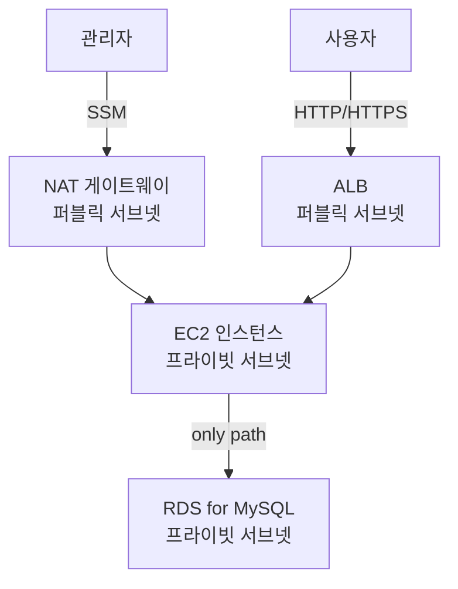

# Chapter 17: 서버 기반 워드프레스 구축해보기

**워드프레스 개념**

> 세계에서 가장 많이 사용되는 오픈소스 웹 콘텐츠 관리 시스템.
프로그래밍 지식이 없이도 웹사이트, 블로그, 쇼핑몰 등을 구축하고 관리할 수 있는 플랫폼이다.
> 

### 17.1 아키텍처 개요

**목표**

- 보안성(프라이빗 서브넷)
- 성능(ALB 부하분산)
- 확장성(트래픽 대응)



<aside>

**RDS는 NAT/IGW로 가는 경로 자체가 없음 → 오직 EC2를 통해서만 접근 가능**

**관리자도 RDS 직접 접근 불가, EC2 경유 필수**

**구축 순서**는 다음과 같다.

 CloudFormation 리소스 생성 → EC2-RDS 연동 → EC2에서 워드프레스 구성 → 접속

</aside>

### **17.2 CloudFormation 스택 생성**

스택 생성 순서 고정: `VPC → IAM → Security_Group → EC2 → ALB → RDS`

!스크린샷 2026-08-01 오후 9.35.09.png

### **17.3 EC2 – RDS 연동**

1. Session Manager로 EC2 접속
2. `sudo yum install -y mysql`
3. RDS 엔드포인트 확인 후 접속 테스트

!스크린샷 2026-08-01 오후 9.36.15.png

!스크린샷 2026-08-01 오후 9.40.03.png

### **17.4 EC2에서 워드프레스 구성**

1. Apache 설치 → 샘플 페이지로 동작 확인 
2. 워드프레스 다운로드/압축해제, `wp-config-sample.php` → `wp-config.php` 복사
3. `wp-config.php` 수정: DB_NAME/USER/PASSWORD/HOST 입력 + 보안키 생성기로 define 절 값 덮어쓰기
4. 종속성 설치 후 `/var/www/html`로 배포

```bash
sudo amazon-linux-extras install -y lamp-mariadb10.2-php7.2 php7.2
sudo cp -r wordpress/* /var/www/html/
sudo rm index.html
sudo service httpd restart
```

!스크린샷 2026-08-01 오후 9.42.56.png

브라우저에서 **DNS 이름** 항목으로 접속

!스크린샷 2026-08-01 오후 9.43.40.png

### **17.5 워드프레스 초기 설정**

ALB DNS로 접속 → Site Title/Username/Password/Email 입력 → Install → 로그인

**wp-config.php 수정 완료**

!스크린샷 2026-08-01 오후 9.46.05.png

**브라우저에서 ALB DNS로 접속**

!스크린샷 2026-08-01 오후 9.56.53.png

**Apache 재시작**

!스크린샷 2026-08-01 오후 9.57.07.png

**Success!** 화면 → **Log in** 클릭해서 관리자 페이지 진입 확인

!스크린샷 2026-08-01 오후 9.58.13.png

!스크린샷 2026-08-01 오후 9.58.38.png

### **17.6 확장 고려사항**

| 항목 | 내용 |
| --- | --- |
| 도메인/CDN | Route53로 도메인 연결, CloudFront로 해외 사용자 대상 고속 전송 |
| HTTPS/로그 | ACM 인증서 발급 → ALB 등록, ALB 액세스 로그를 S3에 저장 |
| 트래픽/확장성 | Auto Scaling으로 AZ별 EC2 부하 분산 |
| DB 고가용성 | RDS 단일 AZ → 다중 AZ 전환, 장애 시 복제본이 마스터로 자동 승격 |