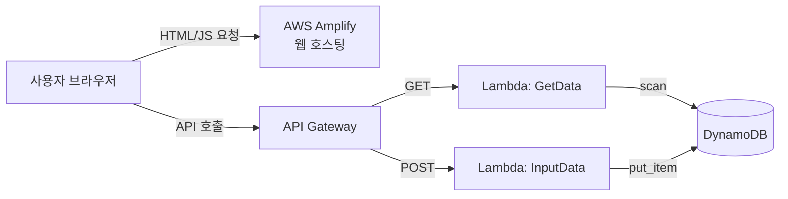

# Chapter 18: 서버리스 기반 웹사이트 구축해보기

### 18.1 아키텍처 개요

> 서버리스(Serverless)란 서버를 직접 프로비저닝/관리하지 않고, AWS가 관리하는 완전관리형 컴퓨팅 자원(Lambda 등)을 사용해 애플리케이션을 구축하는 방식이다.
17장의 EC2 기반 워드프레스와 대비되는 접근.
> 

**적합한 사용처**

- 실시간 투표 시스템처럼 즉각적인 상호작용이 필요한 서비스
- 게시판, 온라인 학습 플랫폼 같은 이벤트 기반 애플리케이션
- 간단한 To-Do 리스트 앱



**구성 요소별 역할**

| 서비스 | 역할 |
| --- | --- |
| AWS Amplify | HTML/JS 정적 파일 프론트엔드 호스팅 |
| API Gateway | 사용자 요청을 받아 Lambda로 라우팅 (REST API) |
| Lambda | 비즈니스 로직 실행 (조회/입력) — 서버 없이 코드만 실행 |
| DynamoDB | NoSQL 데이터 저장소 |

<aside>

이 구조는 흔히 "3-tier serverless" 패턴이라고 부르고, 

실무에서도 스타트업 MVP나 이벤트성 캠페인 페이지에 정말 많이 쓰인다.

 EC2/RDS 방식(17장) 대비 장점은 트래픽이 없을 때 비용이 거의 0에 수렴한다는 점(Lambda는 호출당 과금, DynamoDB는 PAY_PER_REQUEST면 읽기/쓰기당 과금)이고, 

단점은 콜드 스타트 지연, 그리고 복잡한 트랜잭션/조인 로직에는 RDS 기반보다 불리하다는 점이다.

</aside>

### **18.2 CloudFormation으로 리소스 생성하기**

**스택 생성 순서**

```
DynamoDB.yml → APIGateway.yml
```

(17장의 6단계보다 훨씬 단순 — VPC/보안그룹/ALB 같은 네트워크 계층이 아예 없음. 

서버리스라 관리형 서비스들이 알아서 네트워크를 처리해주기 때문)

---

#### ① DynamoDB 테이블 생성

```yaml
MyDynamoDBTable:
  Type: AWS::DynamoDB::Table
  Properties:
    TableName: !Sub ${SystemName}-${EnvName}-db
    AttributeDefinitions:
      - AttributeName: id
        AttributeType: S   # 문자열
    KeySchema:
      - AttributeName: id
        KeyType: HASH      # 파티션 키
    BillingMode: PAY_PER_REQUEST   # 온디맨드 모드
```

- 파티션 키는 `id` (문자열)
- `BillingMode: PAY_PER_REQUEST`는 트래픽에 따라 자동 확장되는 요금제로, 사전에 용량(RCU/WCU)을 프로비저닝할 필요가 없어 이런 실습/저트래픽 환경에 적합
- ⚠️ 테이블의 id, name, description 등 **실제 데이터 항목은 콘솔에서 별도 생성** (템플릿은 테이블 스키마만 정의)

!스크린샷 2026-08-01 오후 10.22.57.png

#### ② 데이터 조회용 Lambda (GET)

```yaml
GetDataLambdaFunction:
  Type: AWS::Lambda::Function
  Properties:
    FunctionName: !Sub ${SystemName}-${EnvName}-GetData
    Code:
      ZipFile: |
        import boto3
        dynamodb = boto3.resource('dynamodb')
        table = dynamodb.Table('gr-product-db')
        def lambda_handler(event, context):
            response = table.scan()
            return response['Items']
```

- `table.scan()`으로 테이블 전체 항목을 가져와 반환
- 배포 후 [Test]로 정상 작동 확인 (이벤트 값은 특별히 지정할 필요 없음)

<aside>

**[참고 지식]**
`scan()`은 테이블 전체를 훑는 연산이라 데이터가 많아지면 비용/속도 면에서 비효율적이야. 실무에서는 조건 조회가 필요하면 `query()` + 인덱스(GSI)를 쓰는 게 정석.

</aside>

#### ③ 데이터 입력용 Lambda (POST)

```yaml
InputDataLambdaFunction:
  Type: AWS::Lambda::Function
  Properties:
    FunctionName: !Sub ${SystemName}-${EnvName}-InputData
    Code:
      ZipFile: |
        import boto3
        import json
        dynamodb = boto3.resource('dynamodb')
        table = dynamodb.Table('gr-product-db')
        def lambda_handler(event, context):
            inserted_data = {
                'id': event['id'],
                'name': event['name'],
                'description': event['description']
            }
            table.put_item(Item=inserted_data)
            return {
                'statusCode': 200,
                'body': json.dumps(inserted_data)
            }
```

- `event`에서 id/name/description을 받아 `put_item()`으로 저장
- ⚠️ 입력 데이터 없이 [Test]하면 에러 발생 → **정상**이므로 별도 테스트 불필요
    
    (실제 데이터는 프론트엔드에서 넘어옴)
    

#### ④ Lambda IAM 권한 설정

```yaml
ManagedPolicyArns:
  - arn:aws:iam::aws:policy/AmazonDynamoDBFullAccess
  - arn:aws:iam::aws:policy/service-role/AWSLambdaDynamoDBExecutionRole
```

- Lambda가 DynamoDB를 읽고 쓰려면 이 두 관리형 정책 필요

<aside>

**[참고]**
`AmazonDynamoDBFullAccess`는 실습용으로는 편하지만, 실무에서는 최소 권한 원칙(Least Privilege)에 따라 해당 테이블에 한정된 커스텀 정책(GetItem/PutItem/Scan만 허용)을 만드는 게 정석이야.

</aside>

#### ⑤ API Gateway 생성

```yaml
ApiGatewayRestApi:
  Type: AWS::ApiGateway::RestApi
  Properties:
    Name: !Sub ${SystemName}-${EnvName}-api
    EndpointConfiguration:
      Types:
        - REGIONAL
```

- `REGIONAL` = 해당 리전 내에서만 최적화된 엔드포인트 (Edge-optimized 대비 지연시간 ↓)

#### ⑥ GET 메서드 생성 (Lambda 프록시 통합)

```yaml
ApiGatewayGETMethod:
  Type: AWS::ApiGateway::Method
  Properties:
    AuthorizationType: NONE
    HttpMethod: GET
    ResourceId:
      Fn::GetAtt: [ApiGatewayRestApi, RootResourceId]
    RestApiId:
      Ref: ApiGatewayRestApi
    Integration:
      Type: AWS
      IntegrationHttpMethod: POST   # Lambda 호출은 항상 내부적으로 POST
      Uri: <Lambda 함수 호출 ARN URI>
```

- `AuthorizationType: NONE` → 인증 없이 누구나 호출 가능 (실습용, 실무라면 API Key나 Cognito Authorizer 필요)
- 사용자는 GET으로 호출하지만, API Gateway → Lambda 내부 통합은 `IntegrationHttpMethod: POST`로 고정돼 있음. 
이건 AWS Lambda 통합의 기본 규격 (Lambda 호출 자체가 POST 방식의 invoke API이기 때문)

#### ⑦ CORS 활성화

```yaml
IntegrationResponses:
  - StatusCode: 200
    ResponseParameters:
      method.response.header.Access-Control-Allow-Origin: "'*'"
      method.response.header.Access-Control-Allow-Headers: "'Content-Type,X-Amz-Date,Authorization,X-Api-Key,X-Amz-Security-Token'"
      method.response.header.Access-Control-Allow-Methods: "'GET,OPTIONS'"
MethodResponses:
  - StatusCode: 200
    ResponseParameters:
      method.response.header.Access-Control-Allow-Origin: true
      method.response.header.Access-Control-Allow-Headers: true
      method.response.header.Access-Control-Allow-Methods: true
```

- CORS(Cross-Origin Resource Sharing)는 Amplify에 호스팅된 프론트엔드(도메인 A)가 API Gateway(도메인 B)로 요청을 보낼 때 브라우저의 same-origin 정책을 우회하기 위해 필수
- `Access-Control-Allow-Origin: '*'`는 모든 도메인 허용 (실습용. 실무에선 특정 도메인만 허용 권장)

#### ⑧ API 배포

```yaml
ApiGatewayDeployment:
  Type: AWS::ApiGateway::Deployment
  Properties:
    RestApiId: !Ref ApiGatewayRestApi
    StageName: !Sub ${SystemName}-${EnvName}-stage
  DependsOn:
    - ApiGatewayGETMethod
    - ApiGatewayPOSTMethod
    - ApiGatewayOptionsMethod
```

- `DependsOn`으로 GET/POST/OPTIONS 메서드가 모두 생성된 후에 배포되도록 순서 보장
- 배포되면 `https://{api-id}.execute-api.{region}.amazonaws.com/{stage}` 형태의 호출 URL 생성됨

---

### **18.3 DynamoDB 테이블 항목(더미 데이터) 생성하기**

1. DynamoDB 콘솔 → 생성한 테이블 선택 → **[작업] → [항목 탐색]**
2. **[항목 생성]** 클릭
3. 항목 구성:
    - `id` (파티션 키, 문자열)
    - `name` (추가 속성, [새 속성 추가] → 문자열로 추가)
    - `description` (추가 속성)
4. 값 입력 후 항목 생성

→ 이 더미 데이터는 웹사이트 최초 접근 시 리스트에 표시될 초기 데이터 역할

---

### 18.4 AWS Amplify로 프론트엔드 호스팅하기

#### ① index.js에 API Gateway URL 삽입

API Gateway 콘솔 → **스테이지 → URL 호출**에서 실제 엔드포인트 URL 확인 가능

!스크린샷 2026-08-01 오후 10.27.34.png

```jsx
// 데이터 저장 (프론트 → Lambda → DynamoDB)
async function sendDataToLambda() {
    try {
        const htmlid = document.getElementById('id').value;
        const htmlname = document.getElementById('name').value;
        const htmldescription = document.getElementById('description').value;

        const dataToSend = { id: htmlid, name: htmlname, description: htmldescription };
        const response = await axios.post('API Gateway URL 입력', dataToSend);
        console.log('Response from Lambda:', response.data);
    } catch (error) {
        console.error('Error sending data:', error);
    }
}

// 데이터 조회 (DynamoDB → Lambda → 프론트)
async function getDataToLambda() {
    try {
        const response = await axios.get('API Gateway URL 입력');
        const getData = response.data;
        const listContainer = document.getElementById('responseData');

        getData.forEach(item => {
            const listItem = document.createElement('p');
            listItem.textContent = `ID:${item.id}, Name:${item.name}, Description:${item.description}`;
            listContainer.appendChild(listItem);
        });
    } catch (error) {
        console.error('Error reading data:', error);
    }
}
getDataToLambda();  // 페이지 로드 시 자동 호출
```

- `sendDataToLambda()` = POST 엔드포인트에 URL 입력
- `getDataToLambda()` = GET 엔드포인트에 URL 입력
- `getDataToLambda()`가 스크립트 최하단에서 즉시 호출되므로, **페이지 로드 시점에 자동으로 목록이 렌더링됨**

#### ② Amplify 배포

1. Amplify 콘솔 → **[앱 배포]** 클릭
2. **[Git 없이 배포]** → 다음
3. 앱 이름 입력, 업로드 방식은 **드래그 앤 드롭** 선택
4. `index.html`, `index.js`를 **zip으로 압축**해서 업로드 
    
    (⚠️ 개별 파일이 아니라 압축 파일로 업로드)
    
5. **[저장 및 배포]**
    
    !스크린샷 2026-08-01 오후 10.30.40.png
    

#### ③ 결과 확인

- 배포된 도메인으로 접속하면 웹사이트 정상 출력
    
    !스크린샷 2026-08-01 오후 10.31.06.png
    
- **List**: DynamoDB에 저장된 항목들이 자동으로 나열됨 (`getDataToLambda()` 동작 결과)
- **Input**: id/Name/Description 입력 후 **Send Data** 클릭 → 새로고침하면 방금 입력한 데이터가 DynamoDB에 저장되고 리스트에 추가로 출력됨
    
    !스크린샷 2026-08-01 오후 10.32.48.png
    

---

### 17장(EC2 기반) 18장 비교표

| 항목 | 17장 (서버 기반) | 18장 (서버리스) |
| --- | --- | --- |
| 컴퓨팅 | EC2 (상시 실행) | Lambda (호출 시에만 실행) |
| 데이터베이스 | RDS (관계형, MySQL) | DynamoDB (NoSQL) |
| 네트워크 구성 | VPC/서브넷/보안그룹 직접 설계 | 별도 네트워크 구성 불필요 |
| 확장 방식 | Auto Scaling + ALB 수동 설정 | 완전 자동 확장 (관리 불필요) |
| 과금 | 인스턴스 가동시간 기준 | 호출/요청 횟수 기준 (PAY_PER_REQUEST) |
| 적합한 워크로드 | 지속적 트래픽, 복잡한 관계형 데이터 | 이벤트성, 간헐적 트래픽, 단순 데이터 구조 |