# 2.1 네트워크 동작 구조와 원리 파악하기

 **AWS를 쓰는데 네트워크에 대한 이해가 필요한 이유?**

AWS가 제공하는 서비스는 클라우드 네트워킹이기 때문!

### 2.1.1 네트워크란

> 여러 대의 컴퓨터가 통신 기술을 이용하여 그물망처럼 상호 연결되어 있는 구조
> 

네트워크 상에 있는 컴퓨터가 데이터 통신을 가능하게 하기 위해서 네트워크에서는 다양한 프로토콜과 기술을 사용함

### 2.1.2 프로토콜이란
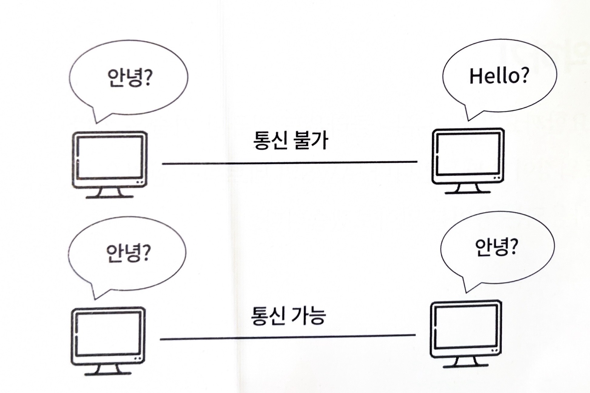

> 컴퓨터에서 데이터를 교환하기 위해 정해진 순서나 규약, 신호의 전기적 규칙, 통신에서의 송수신 순서 등을 정한 체계
즉, **통신하기 위해 지켜야할 약속이자 규칙**
> 

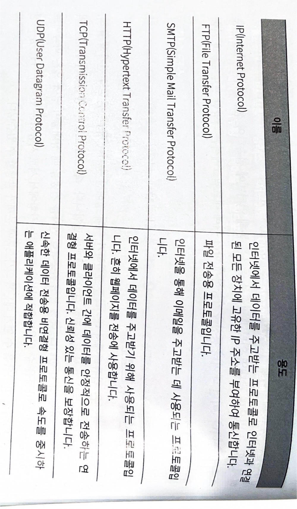

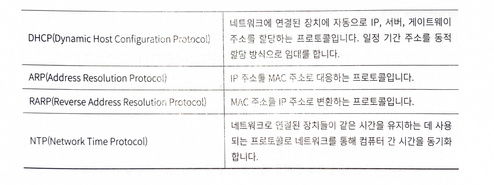

*필요한 상황과 요구사항을 고혀하여 적절한 프로토콜을 선택하고 활용해야 함

### 2.1.3 IP

> 인터넷에 연결된 장치를 식별할 수 있도록 각각에 부여된 고유 주소
> 

**IP 주소 두 가지 버전**

- IPv4
    - 32비트 주소
    - 전세계적으로 사용된 첫 번째 인터넷 프로토콜
- IPv6
    - IPv4 고갈 문제를 해결하기 위해 도입
    - 128비트 주소
    - 현재 대다수 웹사이트와 네트워크가 아직은 IPv4를 사용하고 있어, 호환성 문제가 있음
        
        **AWS도 주로 IPv4 주소 사용**
        

**IP 주소 구조**

IP 주소 = **32비트 이진수 → 8비트씩 4개(옥텟) → 10진수로 표현**

이 32비트는 보통 **8비트씩 4개의 그룹으로 나뉘며**, 각 그룹은 **마침표(.)로 구분하여 표시**

위에서 8비트로 이루어진 하나의 단위를 ‘`옥텟(octet)`’이라 함

### 2.1.4 IP 주소 체계

**네트워크 주소 & 브로드캐스트 주소**

1. **네트워크 주소 (Network Address)**
    - **하나의 네트워크를 식별하기 위한 주소**
    - 해당 네트워크의 **시작 주소**
    - ex) IP: 192.168.1.0 /24
        
        → **네트워크 주소: 192.168.1.0**
        
2. **브로드캐스트 주소 (Broadcast Address)**
    - 해당 네트워크에 속한 **모든 호스트에게 데이터를 전송하기 위한 주소**
    - 네트워크의 **마지막 주소**
    - ex) IP: 192.168.1.0 /24
    → **브로드캐스트 주소: 192.168.1.255**

**IP의 종류**

- **공인 IP 주소**
    - **인터넷에서 직접 사용 가능한 IP 주소**
    - 전 세계에서 **유일**하게 사용됨 ( 중복 X )
    - 인터넷 할당 번호 관리 기관(IANA) 및 ISP가 할당
- **사설 IP 주소**
    - IPv4 고갈 문제로 도입
    - **내부 네트워크(LAN)에서만 사용되는 IP 주소**
    - 같은 주소를 **여러 네트워크에서 중복 사용 가능**
    - 인터넷과 직접 통신 X → **NAT를 통해 공인 IP로 변환 필요**

**네트워크 규모로 나눈 IP 클래스 이해하기**

네트워크 규모에 따라 A~E 클래스로 나뉘어 있음.

**클래스와 네트워크 ID와 호스트 ID 관계**

> IP 클래스: 주소를 **네트워크 ID + 호스트 ID로 나누는 기준**
> 

**네트워크 ID** :  어떤 네트워크인지 식별

**호스트 ID** : 그 네트워크 안에서 개별 장치 식별

예를 들어, 회사에서 C클래스의 192.168.1.0 네트워크 주소를 할당했다면,

이 네트워크를 식별하는 네트워크 IP는 192.168.1.0

네트워크 주소(192.168.1.0)와 브로드캐스트 주소(192.168.1.255)를 제외하고,

192.168.1.1 ~. 192.168.1.254 사이의 IP주소를 호스트에 할당할 수 있음

### 2.1.5 서브넷팅

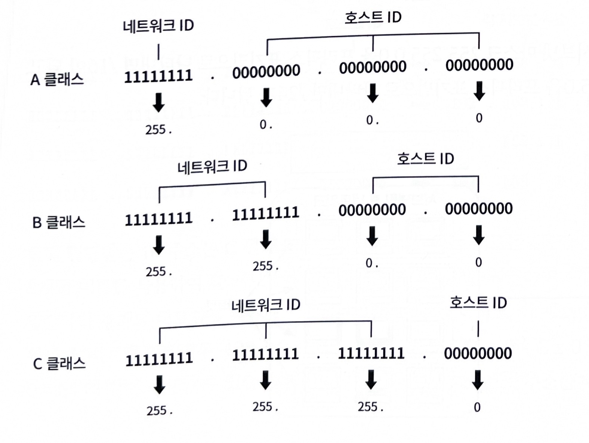

> 하나의 네트워크를 **여러 개의 작은 네트워크로 나누는 것**
> 

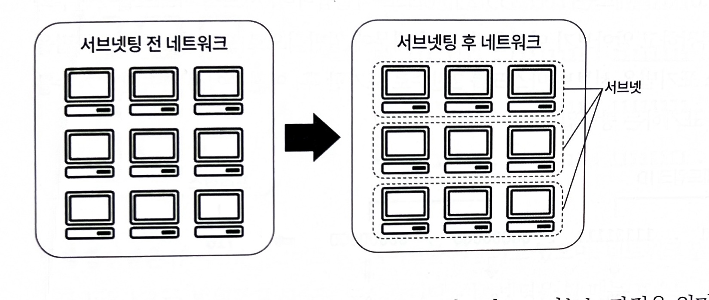

**서브넷을 사용하게 되면?**

- 네트워크를 더욱 효율적으로 관리 가능
- 네트워크를 보안성 있게 구성 가능
- 트래픽을 분산시켜 성능을 향상

**서브넷 마스크**

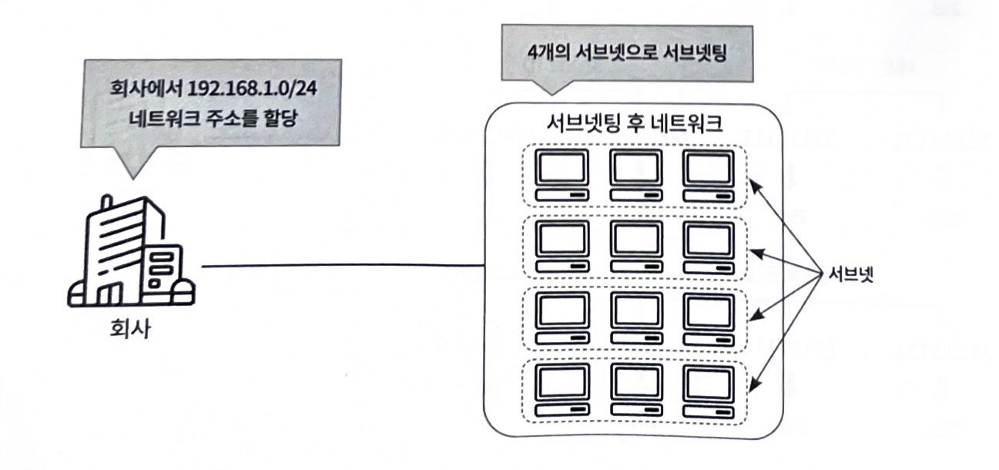

> IP 주소에서 **네트워크 영역과 호스트 영역을 구분하기 위한 값**
> 

서브넷 마스크:

- **1 → 네트워크 부분**
- **0 → 호스트 부분**

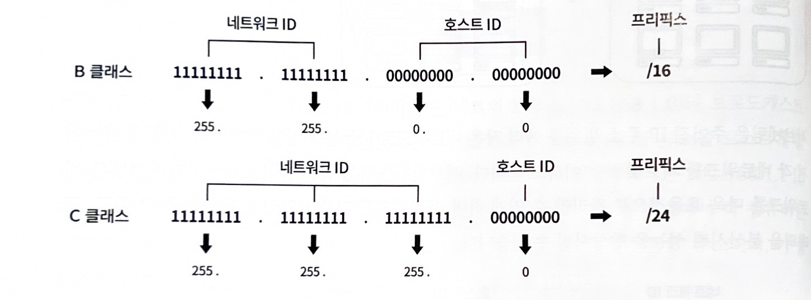

IP 주소: `192.168.1.10`

서브넷 마스크: `255.255.255.0`

이진수로 보면

- 255 = `11111111` (네트워크)
- 0 = `00000000` (호스트)

그래서 `/24`라고도 표현

| 표기 | 의미 |
| --- | --- |
| 255.0.0.0 | /8 |
| 255.255.0.0 | /16 |
| 255.255.255.0 | /24 |

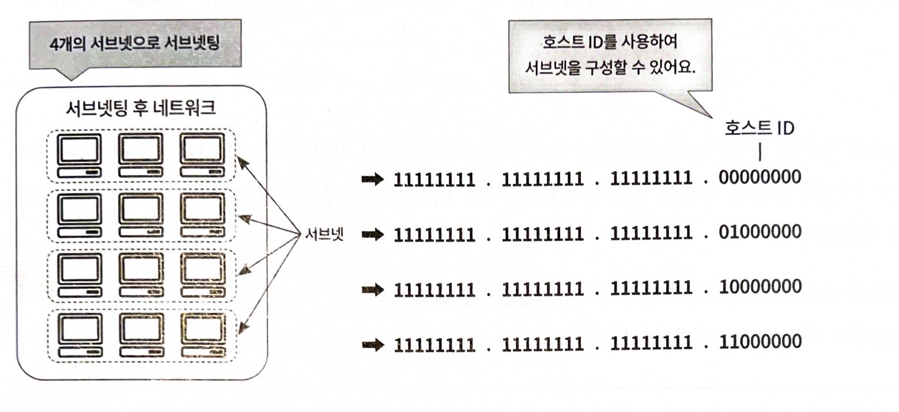

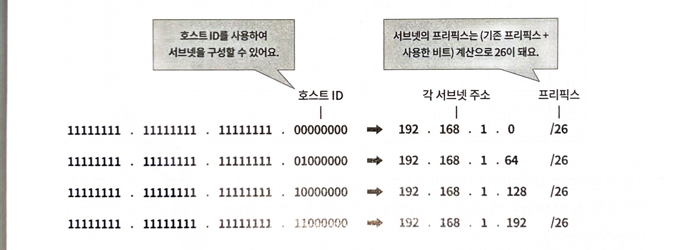

         **1. 기본 개념**

- IP: 192.168.1.0 /24
- 전체 IP 개수: 256개 (0 ~ 255)

이 네트워크를 4개의 서브넷으로 나누는 상황

**2. 서브넷 생성 원리**

- 호스트 비트 일부를 서브넷으로 사용
- 기존: /24 → 서브넷팅 후: /26
- 2비트를 빌렸기 때문에 2² = 4개의 서브넷 생성

**3. 서브넷 마스크 변화**

- /24 → 255.255.255.0
- /26 → 255.255.255.192

마지막 옥텟의 이진수:

- 11000000 → 192

**4. 서브넷 크기**

- 전체 256개를 4개로 나눔 → 각 서브넷당 64개

**5. 서브넷 범위**

| 서브넷 | IP 범위 |
| --- | --- |
| A | 0 ~ 63 |
| B | 64 ~ 127 |
| C | 128 ~ 191 |
| D | 192 ~ 255 |

**6. 실제 네트워크 주소**

| 서브넷 | 네트워크 주소 |
| --- | --- |
| A | 192.168.1.0 |
| B | 192.168.1.64 |
| C | 192.168.1.128 |
| D | 192.168.1.192 |

**8. CIDR 개념**

- 클래스 기반 방식의 비효율 문제 해결
- 비트 단위로 유연하게 네트워크를 나누는 방식
- 예: /23, /26 등

**라우팅**

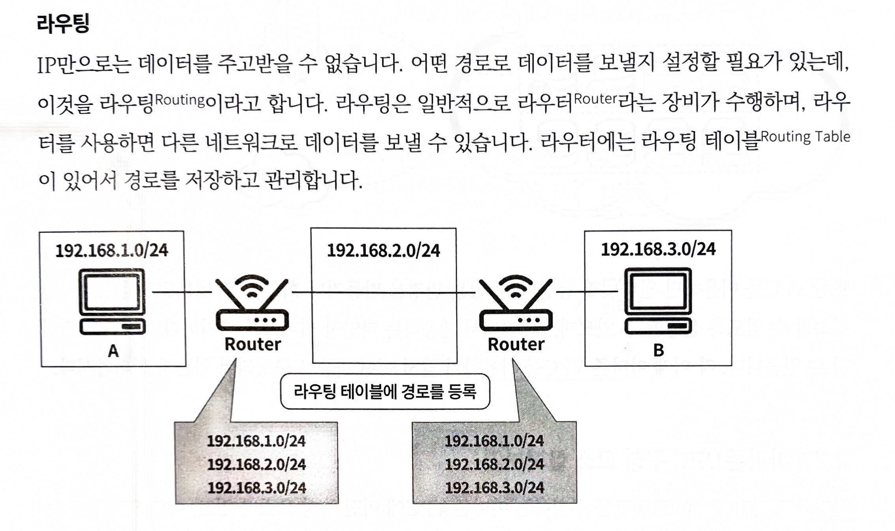

> 어떤 경로로 데이터를 보낼지 설정하는 것
> 
- 라우터를 사용하여 다른 네트워크로 데이터를 보낼 수 있음
- AWS에서는 라우터 장비 대신 라우팅 테이블을 별도로 생성하여 라우팅을 관리할 수 있음

# 2.2 아마존 VPC

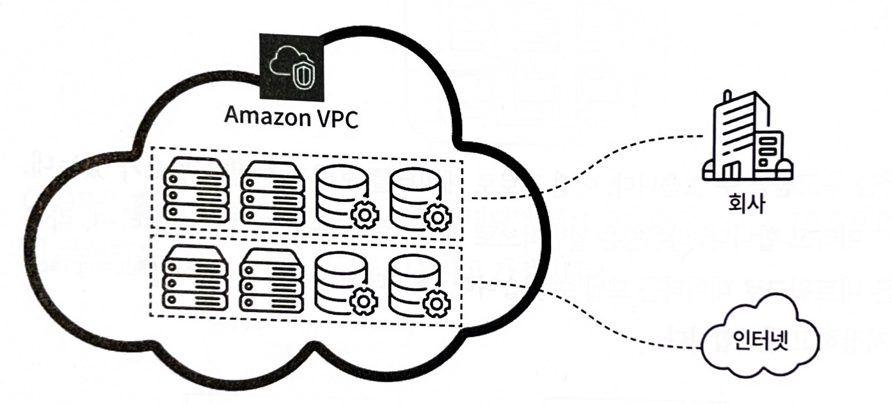

> AWS의 클라우드 환경에서 네트워크를 구성하고 관리할 수 있는 서비스
> 
- 사용자가 원하는 대로 라우팅 테이블 구성, IP 주소 범위 선택, 서브넷 생성 등으로 구성해 가상 네트워크 환경인 VPC를 생성할 수 있음

### 2.2.1 아마존 VPC 구성 요소 살펴보기

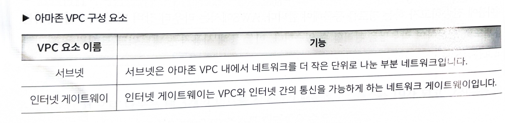

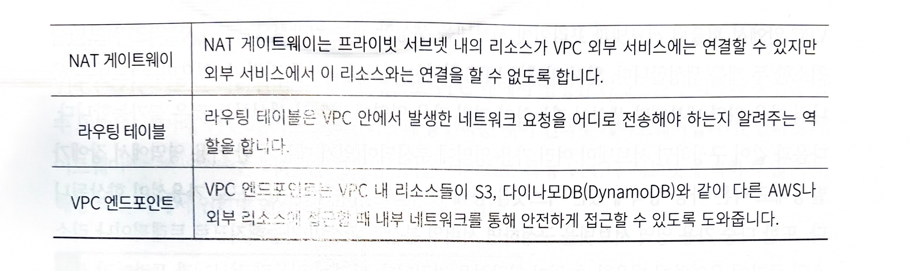

### 2.2.2 서브넷

AWS의 VPC 안에서도 네트워크를 부분으로 나눌 수 있으며 VPC 하나는 서브넷 N개를 가질 수 있음

AWS에서 VPC를 생성할 때 사용자는 VPC에 할당할 CIDR 범위를 지정하고 이를 기반으로 서브넷을 나눌 수 있음

**서브넷 종류**

- **퍼블릭 서브넷**
    - 인터넷과 연결 되어 있어, 직접 통신이 가능
    - 보안 관리 필요
- **프라이빗 서브넷**
    - 주로 내부 서버나 데이터베이스와 같은 중요한 리소스 배치
    - 내부 시스템이나 데이터 보안을 유지

**AWS VPC 안에서의 서브넷**

AWS에서 서브넷을 생성할 때가  퍼블릿, 프라이빗으로 직접 지정하여 생성할 수 없고,

서브넷에 대한 네트워크 설정을 통해 퍼블릿, 프라이빗 서브넷으로 동작하도록 설정할 수 있음.

### 2.2.3 인터넷 게이트웨이

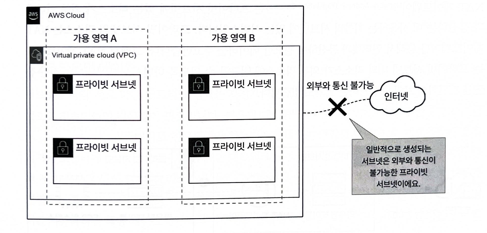

> 리전 단위로 생성되는 서비스로 특정 VPC나 서브넷에 속하지 않으며, 해당 리전 내에서 인터넷 연결을 제공하는 역할
> 

VPC는 기본적으로 외부와 격리된 네트워크 환경이지만, 인터넷 게이트웨이를 연결하면 VPC 내부의 리소스가 인터넷과 통신할 수 있음

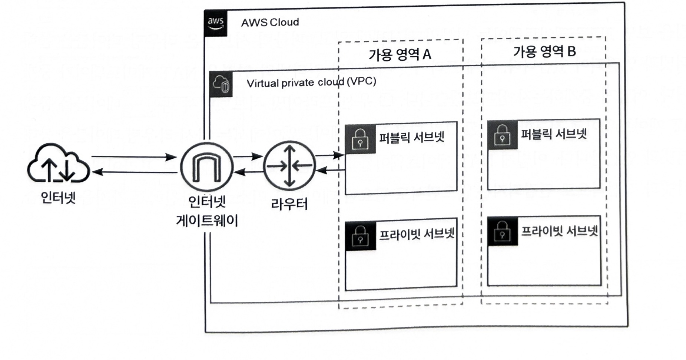

- VPC에서 생성한 서브넷은 모두 프라이빗 서브넷
    
    AWS에서 인터넷 게이트웨이를 생성하고 서브넷에 라우팅을 설정하면 해당 서브넷은 인터넷과 통신이 가능한 퍼블릿 서브넷이 됨
    

### 2.2.4 NAT 게이트웨이

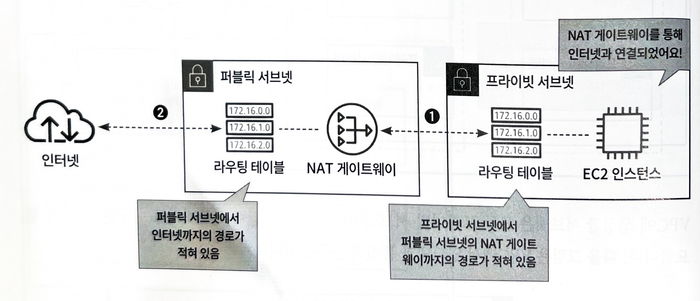

> 프라이빗 서브넷에 있는 리소스가 외부 인터넷과 통신하는 데 사용하는 퍼블릭 서브넷에 있는 서비스
> 

**프라이빗 서브넷 - 인터넷 연결 중개 과정**

1. **프라이빗 서브넷**에서 라우팅 테이블을 통해 **NAT 게이트웨이** 접근
2. **NAT 게이트웨이**에서 다시 라우팅 테이블을 통해 **인터넷**과 연결

- NAT 게이트웨이는 기본적으로 트래픽이 발생할 때 데이터 처리 요금이 발생하여 계속 돌려놓고만 있어도 시간당 요금이 청구되는 서비스
- 비용과 가용성 중 어떤 것을 더 우선할지에 따라 균형있게 고려한 최적의 결정 필요
    
    

### 2.2.5 라우팅 테이블

> VPC 안에서 발생한 네트워크 요청이 서브넷 내의 어디로 전송되어야 하는지를 알려주는 역할
> 

**라우팅 내의 서브넷 연결**

- 퍼블릿 서브넷
    - 인터넷 게이트웨이 이외의 별도의 라우팅 설정이 없기 때문에
        
        하나의 라우팅 테이블에 여러 퍼블릿 서브넷을 연결하여 **일대다** 관계를 유지
        
- 프라이빗 서브넷
    - 다양한 리소스가 존재하며, 각 리소스마다 다른 라우팅 대상을 가질 수 있음
    - **일대일 관계**를 유지하는 것이 일반적

**`0.0.0.0/0`**

모든 통신을 허용하겠다는 의미

### 2.2.6 VPC 엔드포인트

> VPC의 외부 서비스나 다른 서비스와 안전하게 연결하는데 도움을 주는 서비스
> 
- `프라이빗링크` : 사설 IP 주소를 할당받아 AWS에서 제공하는 프라이빗 연결 공간

- **인터페이스 엔드포인트**
    
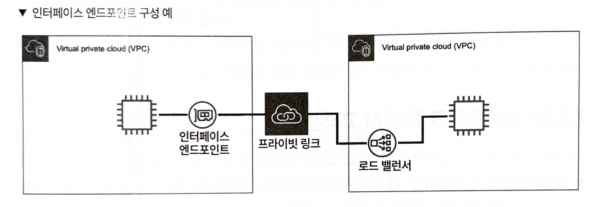
    
    - 프라이빗 링크를 통해 VPC 내의 서버가 인터넷을 거치지 않고도 AWS의 다른 서비스와 통신할 수 있게 도와줌
    - **사설 IP를 통해 서비스 접근**

- **게이트웨이 엔드포인트**
    
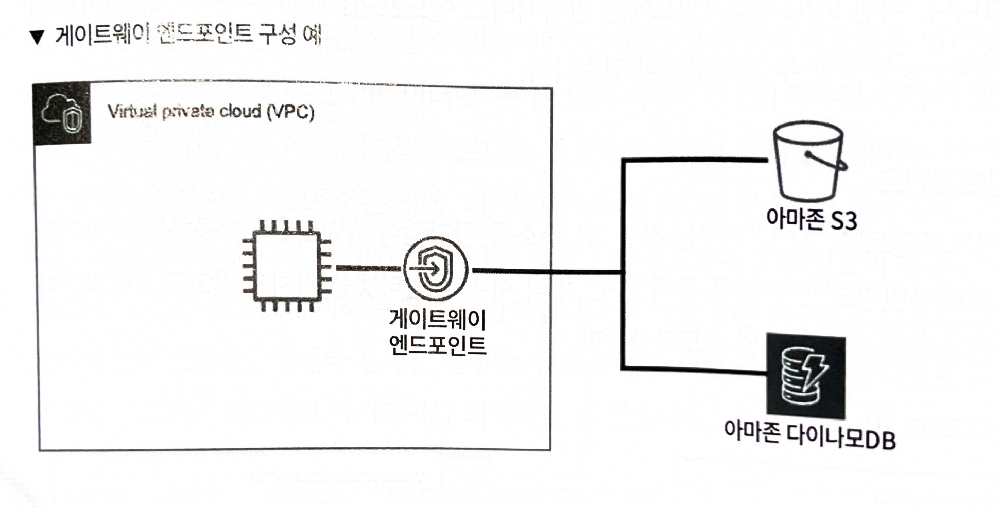
    
    - 인터넷 게이트웨이와 NAT 게이트웨이 없이
        
        아마존 S3와 아마존 다이나모 DB에 퍼블릭 IP로 연결하는 엔드포인트
        
    - 비용: **무료**

2. CIDR 설계

# 2.3 AWS 네트워크 설계 시 고려사항

- 한 번 생성한 VPC/서브넷은 **수정이 어려움**
- 잘못 설계하면
→ IP 부족
→ 구조 변경 어려움
→ 서비스 영향 발생

따라서 초기 설계가 매우 중요

### 2.3.1 CIDR

- VPC 생성 시 CIDR 범위를 먼저 설정
- 이후 서브넷 개수와 크기를 고려하여 나눔

예:

- 172.100.16.0 /24 → 8개 서브넷
- /27 사용 시
→ 각 서브넷 약 32개 IP

**AWS 예약 IP (중요)**

서브넷에서 다음 5개 IP는 사용 불가

- x.x.x.0 → 네트워크 주소
- x.x.x.1 → VPC 라우터
- x.x.x.2 → AWS 예약
- x.x.x.3 → AWS 예약
- x.x.x.255 → 브로드캐스트

**IP가 필요한 서비스**

- EC2
- Elastic IP
- NAT Gateway
- VPC Endpoint
- Load Balancer

**VPC CIDR 설계 주의**

- 다른 VPC와 **CIDR 겹치면 안 됨**
- 겹치면 → 연결(VPC Peering 등) 불가능

### 2.3.2 VPC 분할 패턴

1.  **단일 VPC 구성**
- 하나의 VPC에 모든 시스템 구성
- 단순하지만 확장/격리 어려움

1.  **분리 방식**
- 시스템별 VPC
    - 시스템마다 VPC 분리
    - 독립성 높음
- 환경별 VPC
    - dev / test / prod 분리
    - 운영 안정성 높음
1. **혼합 방식**
    - 시스템 + 환경 기준으로 분리

# 2.4 AWS 네트워크 구축을 위한 다양한 서비스 알아보기

### 2.4.1 VPC 피어링

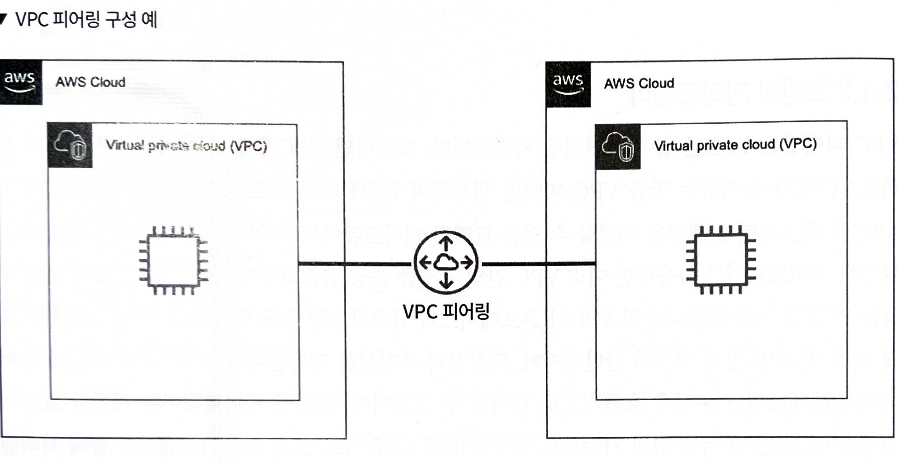

> 서로 다른 VPC를 연결하여 데이터 송수신을 도와주는 서비스
> 
- VPC 간 직접 연결
- 1:1 연결만 가능
- 비용: 무료

### 2.4.2 Site-to-Site VPN

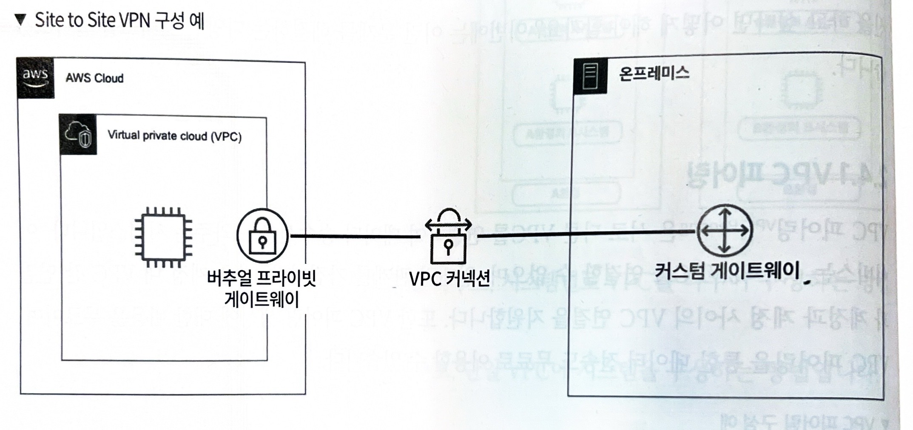

> 온프레미스 ↔ AWS 연결을 제공하는 서비스
> 
- 인터넷 기반 (IPSec)
- 장점: 빠르게 구축, 비용 저렴

### 2.4.3 트랜짓 게이트웨이

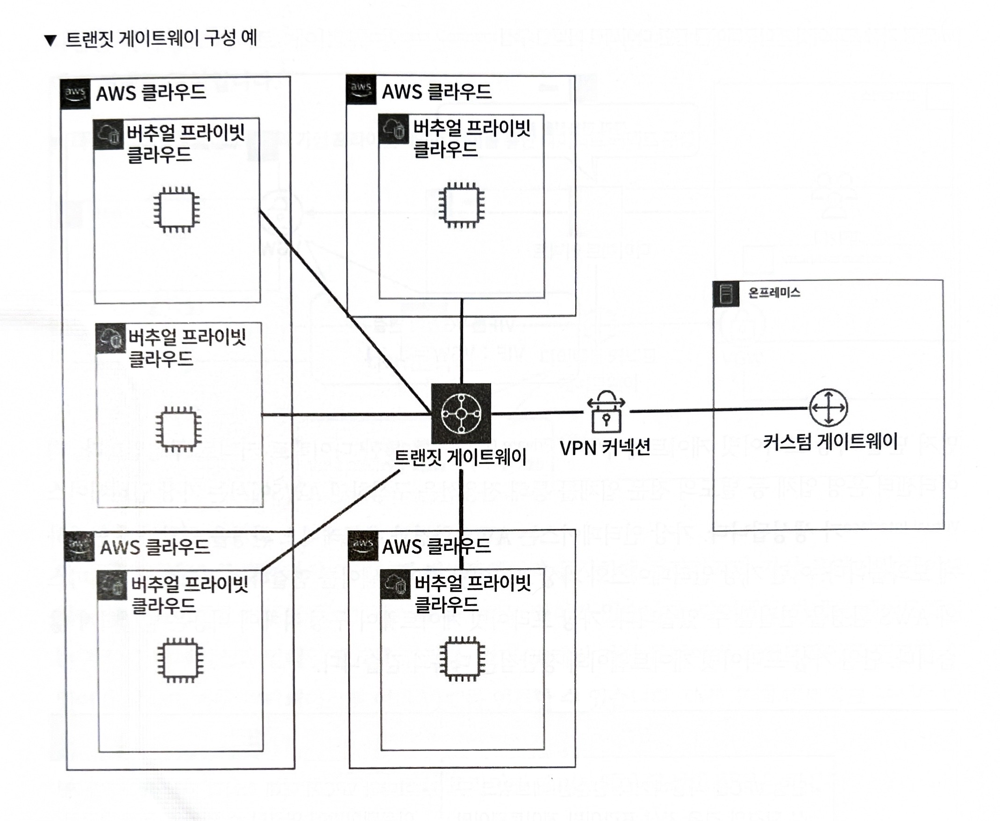

- 여러 VPC를 **중앙에서 연결**
- 허브 역할

### 2.4.4 Direct Connect

- 전용선으로 AWS 연결
- 장점: 고속, 안정성 높음
- 단점: 구축 비용 높음
    
    
    | 방식 | 특징 |
    | --- | --- |
    | VPN | 인터넷 기반 |
    | Direct Connect | 전용선 |

**단일 가상 프라이빗 게이트웨이(VGW)를 통한 다이렉트 커넥트**

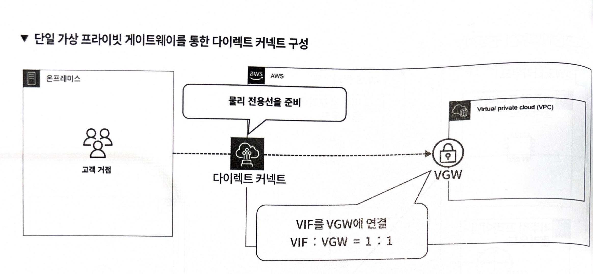

> 
> 
> 
> 온프레미스 ↔ AWS VPC를**Direct Connect + VGW**로 연결하는 구조
> 
- 하나의 VPC와 1:1 연결

**다이렉트 커넥트 게이트웨이 + VGW를 통한 구성**

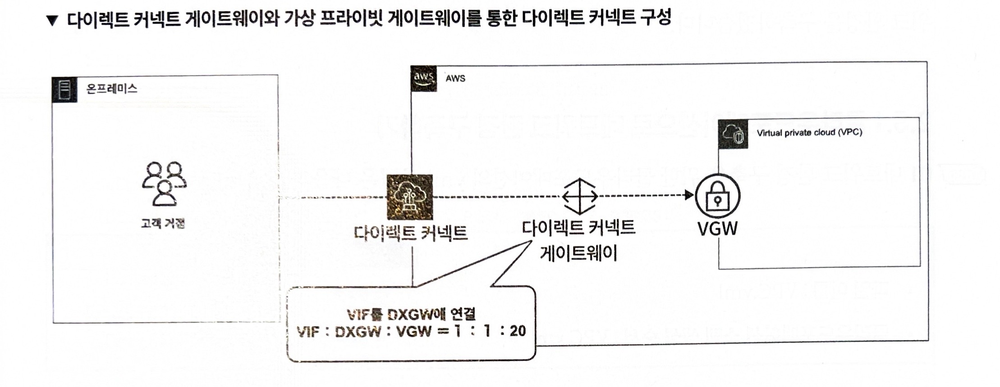
> 
> 
> 
> Direct Connect Gateway를 사용하여**여러 VPC를 하나의 Direct Connect로 연결**
> 
- 중앙 집중형 구조 → 하나의 연결로 **여러 VPC 연결 가능**

