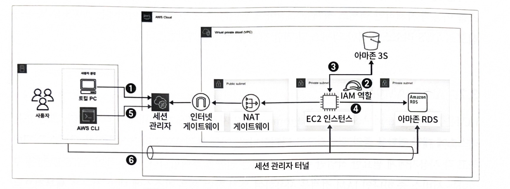
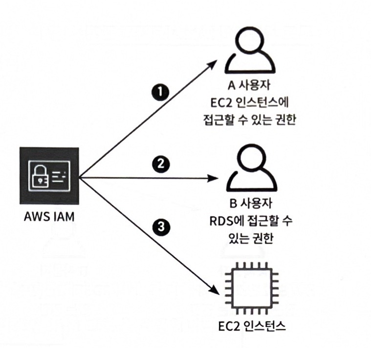
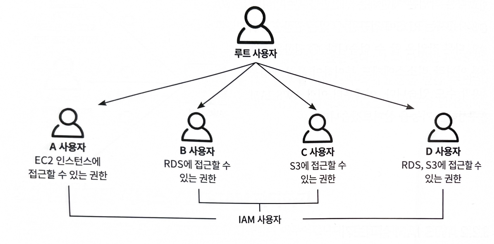
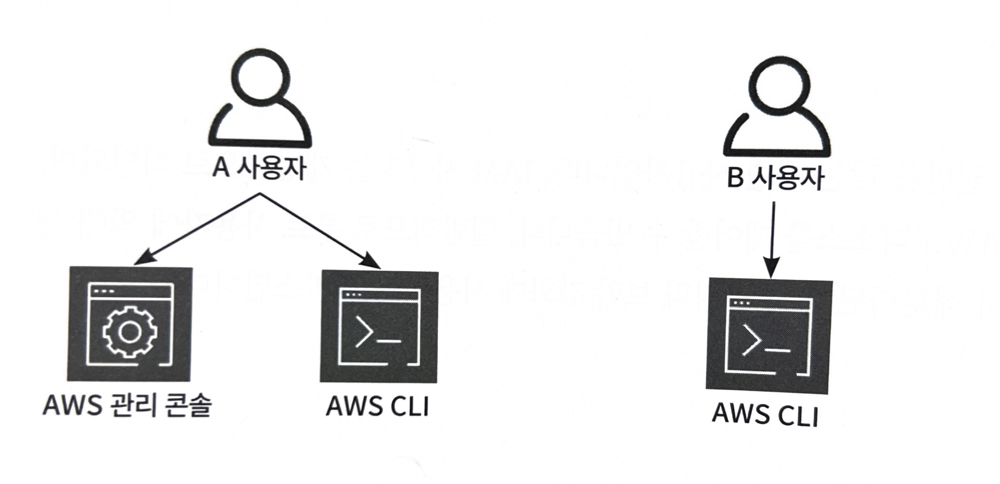
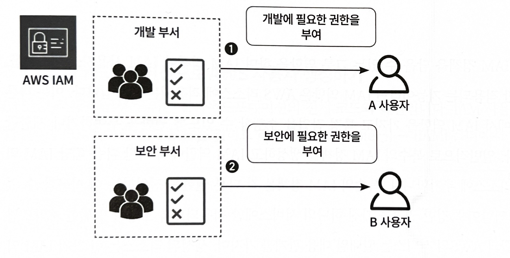
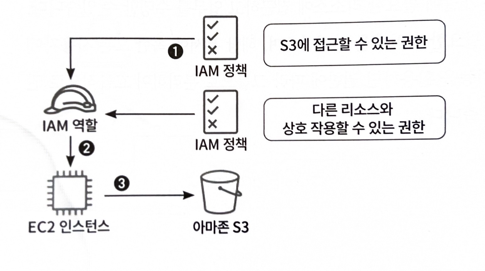
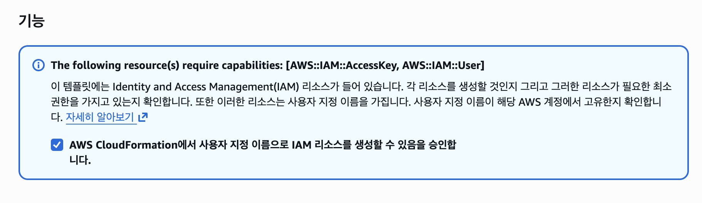
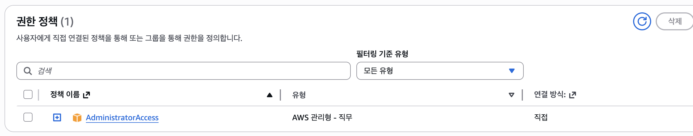
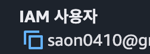
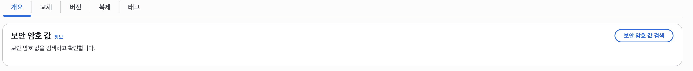

## 1. AWS에서 동작하는 웹서비스 구조와 원리 파악하기

**AWS의 중심이 되는 서비스 4가지**

- **AWS IAM**
    - 사용자 및 AWS 리소스에 대한 액세스를 제어하는 권한 관리 서비스
- **아마존 EC2**
    - AWS에서 제공하는 가상 클라우드 서버
- **아마존 RDS**
    - 다양한 데이터베이스 엔진을 제공하는 관계형 데이터베이스
- **아마존 S3**
    - 객체를 저장하는 객체 스토리지 서비스

**그림으로 AWS 서비스 이해**



1. 사용자가 AWS의 세션 관리자(Session Manager)를 이용하여 EC2 인스턴스로 접속 시도
2. EC2 인스턴스에서는 
    - 세션관리자를 이용할 수 있는 권한
    - 아마존 S3에 대한 액세스 권한
    
    을 포함한 IAM 역할이 부여되어 있음
    
3. 아마존 S3는 
    - 정적 데이터(이미지, 파일 등)을 저장하고
    - EC2 인스턴스와의 연동되어 통해 데이터를 주고받는 역할을 함
4. EC2 인스턴스에서 RDS로 접근하여 데이터베이스를 관리하거나 쿼리를 수행
5. 사용자는 로컬 환경에 설치한 AWS CLI를 이용해 접속하려는 AWS 환경에 대한 세션관리자 포트 포워딩 세션을 생성
6. 포트 포워딩을 세션을 생성하면 사용자 환경에서 EC2 인스턴스 혹은 RDS로 접속 가능

## 2. 권한 관리 서비스, AWS IAM 파악하기

### 2.1 AWS IAM

> AWS 계정 내 사용자, 그룹, 리소스의 **접근 권한을 중앙에서 관리하는 서비스**
> 

**AWS IAM에서 사용자 혹은 리소스에 권한 할당하는 로직**



1. A 사용자에게 **EC2 인스턴스에만 접속**할 수 있는 제한적인 권한 부여
2. B 사용자는 RDS에 **접근할 수 있는 권한** 부여받음
3. 권한을 사용자 뿐만 아니라 **리소스에도 부여 가능**

### 2.2 AWS IAM 서비스

- **IAM 사용자**
    
    > 개별적으로 식별되는 사용자
    > 
    
    일반적으로 루트 사용자에 의해 생성 및 관리되며 AWS 내에서 세분화된 권한 권리와 보안 강화에 사용됨
    
    **루트 사용자와 IAM 사용자의 관계**
    

    
    - 루트 사용자
        - AWS IAM 구조의 최상위 계정
        - 모든 리소스에 대해 **전체 권한** 보유
    - IAM 사용자
        - 루트 사용자가 생성하는 **하위 사용자**
        - 필요한 권한만 부여받는 **제한된 계정**
        - 특정 서비스(EC2, S3 등)에만 접근 가능하도록 설정 가능
    
    **IAM 사용자 접속 방법**
    

    
    - **AWS CLI 접속**
        - 로컬에 AWS CLI 설치 후 사용
        - Access Key / Secret Key 기반 인증
        - 주로 개발자, 서버 환경에서 사용
    - **AWS 관리 콘솔 접속**
        - 웹 브라우저에서 로그인
        - IAM 사용자 계정(ID/PW)으로 로그인
        - AWS 서비스들을 UI로 관리 가능
- **IAM 그룹**
    
    > IAM 사용자를 그룹으로 묶어 **권한을 효율적으로 관리하는 기능**
    > 
    

    
    1. **개발 부서**
    → 개발에 필요한 권한만 그룹에 부여
    → 그룹에 속한 사용자 모두 동일 권한 적용
    2. **보안 부서**
    → 보안 관련 권한만 그룹에 부여
    → 그룹 구성원 전체가 해당 권한을 상속받음
- **IAM 정책**
    
    > 어떤 작업이 허용되는지 정의하는 서비스
    > 
    
    **핵심 개념**
    
    - JSON 형태로 작성된 권한 문서
    - “누가(Who) → 무엇을(Action) → 어디에(Resource)” 할 수 있는지 정의
    - Allow / Deny로 권한 제어
    
    **예시 개념**
    
    - S3 읽기만 허용
    - EC2 생성은 금지
    - 특정 버킷에만 접근 허용
- **IAM 역할**
    
    > IAM 정책을 담고 있으며, AWS 서비스에 권한을 부여하는 사용되는 서비스
    > 
    
    **동작 흐름**
    

    
1. Amazon S3 접근 권한 및
다른 리소스와 상호작용할 수 있는 IAM 정책을 생성하고 IAM 역할에 추가한다.
2. 생성한 IAM 역할을Amazon EC2 인스턴스에 연결한다.
3. 해당 EC2 인스턴스는
별도의 키 없이 S3에 접근할 수 있게 된다.

## 3. AWS IAM 생성하기

## 3.1 클라우드 포메이션으로 AWS 사용자 생성하기

```yaml
AWSTemplateFormatVersion: '2010-09-09'
Description: Create IAM User
# ------------------------------------------------------------#
# Input Parameters
# ------------------------------------------------------------#
Parameters: #유저 이름과 비밀번호 입력을 위한 파라미터
  UserName:
    Description: IAM User Name.
    Type: String
  UserPassword:
    Description: IAM User Password.
    Type: String
    NoEcho: true
# ------------------------------------------------------------#
#  Create IAM User
# ------------------------------------------------------------#
Resources:
  IAMUser:
    Type: AWS::IAM::User
    Properties:
      UserName: !Ref UserName # 파라미터에서 입력한 유저 이름을 참조
      LoginProfile:
        Password: !Ref UserPassword # 파라미터에서 입력한 비밀번호를 참조
      ManagedPolicyArns:
        - arn:aws:iam::aws:policy/AdministratorAccess # IAM 사용자에게 관리자 권한을 할당
# ------------------------------------------------------------#
#  Create IAM AccessKey & SecretKey
# ------------------------------------------------------------#
  IAMUserAccessKey: 
    Type: AWS::IAM::AccessKey # CLI를 사용하기 위해 액세스 및 시크릿 키 생성
    Properties:
      UserName: !Ref IAMUser

  AccessKeySecretManager:
    Type: AWS::SecretsManager::Secret # 액세스 키 및 시크릿 키를 시크릿 매니저에 저장
    Properties:
      Name: !Sub ${IAMUser}-credentials
      SecretString: !Sub "{\"accessKeyId\":\"${IAMUserAccessKey}\",\"secretKeyId\":\"${IAMUserAccessKey.SecretAccessKey}\"}"
```

## **1. Parameters (입력값 받는 부분)**

```
Parameters:
  UserName:
  UserPassword:
```

- 사용자 생성 시 **외부에서 값 입력**
- `NoEcho: true` → 비밀번호 숨김 처리

## **2. IAM User 생성**

```
IAMUser:
  Type: AWS::IAM::User
```

- `UserName`: 입력값 사용 (`!Ref UserName`)
- `LoginProfile`: 콘솔 로그인 가능하게 설정
- `ManagedPolicyArns`:
→ `AdministratorAccess` (관리자 권한)

## **3. Access Key 생성 (CLI용)**

```
IAMUserAccessKey:
  Type: AWS::IAM::AccessKey
```

- AWS CLI 접속용 키 생성
    - Access Key ID
    - Secret Access Key

---

## **4. Secrets Manager에 키 저장**

```
AccessKeySecretManager:
  Type: AWS::SecretsManager::Secret
```

- 생성된 키를AWS Secrets Manager에 저장

### 3.2 UI로 불러와 AWS 사용자 리소스 생성

- AWS 관리 콘솔 접속
- CloudFormation 서비스 선택
- **스택(Stack) 생성** 클릭
- 템플릿 업로드 (YAML/JSON 파일)
- Parameters 값 입력 (UserName, Password 등)
- 스택 생성 실행
- 자동으로 IAM 사용자 및 리소스 생성됨

1. 스택 생성 시. IAM 리소스 생성 허용



1. 권한 정책 (AdministratorAccess)
    
    생성될 IAM 사용자가 
    
    → AWS 전체 리소스에 **모든 권한** 가짐
    



1. Secrets Manager 영역 확인


- Access Key / Secret Key를
→ 안전하게 저장하는 서비스
1. 4. IAM 사용자 생성 결과 화면



IAM 사용자 생성 완료



### 3.3 **AWS CLI 환경 구성하기**

1. **AWS CLI 설치**

```bash
// AWS 공식 설치 파일(.pkg)을 다운로드
curl "https://awscli.amazonaws.com/AWSCLIV2.pkg" -o "AWSCLIV2.pkg"
// 다운로드한 pkg 파일을 Mac에 설치
sudo installer -pkg AWSCLIV2.pkg -target /
aws --version
```

1. **IAM 사용자 Access Key 설정**
    - Access Key ID
    - Secret Access Key
2. **AWS Configure CLI 설정**
    
    ```bash
    AWS Access Key ID: ********
    AWS Secret Access Key: ********
    Default region name: ap-northeast-2
    Default output format: json
    ```
    

### 3.4 AWS MFA 설정하기

루크 사용자 또는 IAM 사용자 이용시 보안을 고려하여,

**비밀번호 + 추가 인증 수단(OTP)**을 함께 사용하는 방식

1. **AWS 사용자 호출**
    
    ```bash
    aws sts get-caller-identity
    ```
    
2. **자격 증명 파일 설정**
    
    ```bash
    aws iam create-virtual-mfa-device \
      --virtual-mfa-device-name my-mfa-device \
      --outfile qr-code.png \
      --bootstrap-method QRCodePNG
    ```
    
3. MFA 디바이스 활성화
    
    가상 MFA 디바이스의 시리얼 넘버 확인 후 IAM 사용자에게 MFA 디바이스 설정
    
    ```bash
    aws iam enable-mfa-device \
      --user-name USER_NAME \
      --serial-number arn:aws:iam::ACCOUNT_ID:mfa/my-mfa-device \
      --authentication-code1 123456 \
      --authentication-code2 789012
    ```