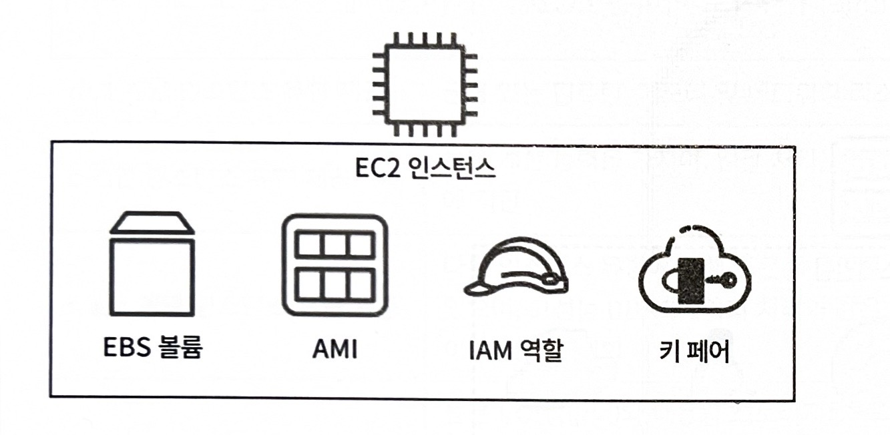
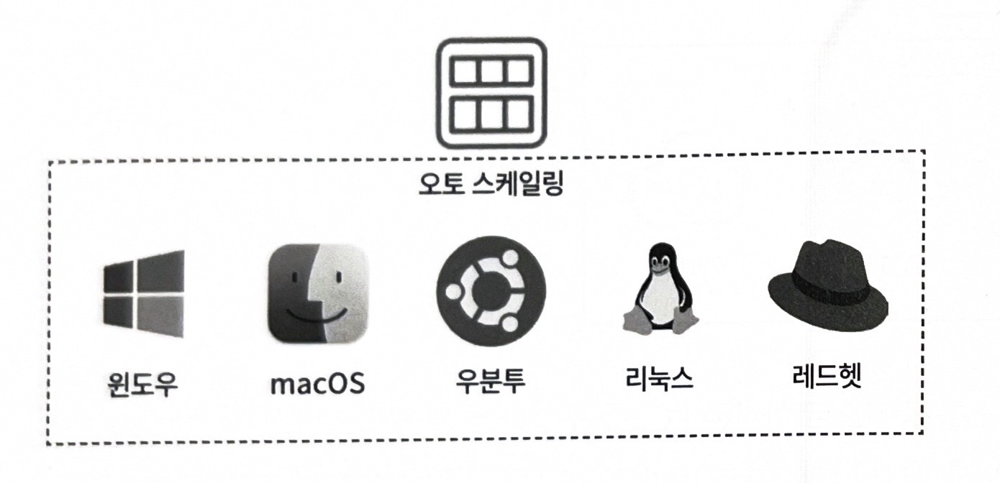
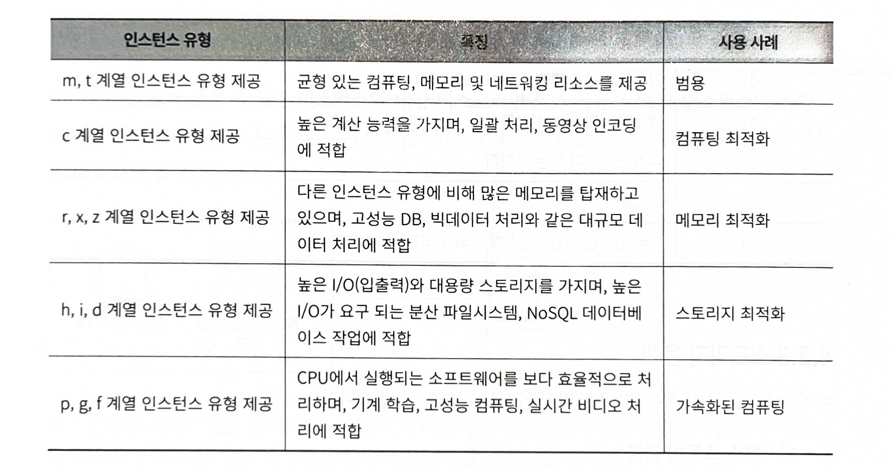
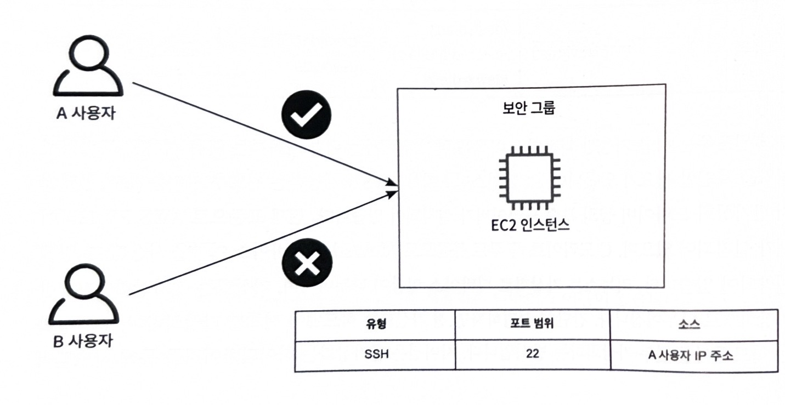

## 1. 가상 클라우드 서버, 아마존 EC2란

> AWS에서 제공하는 **가상 서버(컴퓨터)를 생성하고 사용하는 서비스**
> 

AWS에서의 서버관리는 주로 가상 클라우드 서버인 아마존 EC2를 활용해 이루어짐



## 2. 가상 클라우드 서버, 아마존 EC2 살펴보기

### 2.1 AMI

> 아마존 EC2 인스턴스 실행에 필요한 소프트웨어 구성을 담은 템플릿
> 

EC2 인스턴스를 시작하는 데 필요한 **운영체제(OS), 애플리케이션, 설정 정보**를 포함한 이미지



**AMI 선택 방법**

- Quickstart AMIs
- 내 AMI
- AWS Marketplace AMI
- 커뮤니티 AMI

### 2.2 인스턴스 유형

> 인스턴스에 할당되는 **CPU, 메모리, 네트워크 성능 등의 사양을 결정하는 유형**
> 



**1. 범용 (General Purpose)**

- `t`, `m`
- CPU + 메모리 균형
일반 웹 서버, API 서버

**2. 컴퓨팅 최적화 (Compute Optimized)**

- `c`
- CPU 성능 강함
게임 서버, 고성능 연산

**3. 메모리 최적화 (Memory Optimized)**

- `r`
- RAM 많음
 대용량 DB, 캐싱 서버

**4. 스토리지 최적화 (Storage Optimized)**

- `i`, `d`
- 디스크 성능 특화
 로그 처리, 데이터 분석

### 2.3 스토리지 옵션

- **인스턴스 스토어 볼륨**
    
    > Amazon EC2에 물리적으로 연결된 **임시 저장소**
    > 
    - 인스턴스가 종료되면 데이터 삭제 X → **완전히 사라짐**
    - 매우 빠른 속도 (로컬 디스크)
    - 일시적인 데이터 저장에 적합
- **EBS 볼륨**
    
    > EC2에 연결해서 사용하는 **영구 저장소**
    > 
    - 인스턴스를 종료해도 데이터 유지
    - 네트워크 기반 스토리지
    - 스냅샷(백업) 가능
    
    **유형**
    
    1. **SSD**
        
        반도체(플래시 메모리) 기반 저장장치
        
        - 매우 빠른 속도
        - 소음 없음
        - 충격에 강함
        - 가격 비쌈
    2. **HDD**
        
        디스크(플래터)를 회전시켜 데이터를 읽는 저장장치
        
        - 속도 느림
        - 소음 있음
        - 충격에 약함
        - 가격 저렴
    
    ### 2.4 보안 그룹
    
    > **네트워크 트래픽을 제어하는 가상 방화벽 서비스**
    > 
    

    
    **접속 제어 예시**
    
    보안 그룹에서 **22번 포트(SSH)**에 대해 특정 IP(A 사용자)만 허용한 경우
    
    - A 사용자 → 접속 가능
    - B 사용자 → 접속 차단
    
    **인바운드 / 아웃바운드 개념**
    
    - **인바운드 (Inbound)**
    • 외부 → EC2 들어오는 트래픽
    - **아웃바운드 (Outbound)**
    • EC2 → 외부로 나가는 트래픽
    
    ****

### 2.5 키 페어

> 
> 
> 
> Amazon EC2에서 인스턴스 접속 시 사용하는
> 
> **공개키(Public Key)와 개인키(Private Key)로 이루어진 인증 방식**
> 
- **공개키 (Public Key)**
→ EC2 인스턴스 내부에 저장됨
- **개인키 (Private Key)**
→ 사용자 PC에 보관 (.pem 파일)

## 3. 아마존 EC2 구축하기

### 3.1 클라우드포메이션으로 EC2 인스턴스 구축하기

```yaml
AWSTemplateFormatVersion: "2010-09-09"
Description: Create EC2
# ------------------------------------------------------------#
# Input Parameters
# ------------------------------------------------------------# 
Parameters:
  SystemName:
    Description: "System name of each resource names."
    Type: String
    Default: "gr"
  EnvName:
    Description: "Environment name of each resource names."
    Type: String
    Default: "product"
  KeyPairName: 
    Description: gr-product-ec2 EC2 Key Pair
    Type: String
    Default: gr-product-ec2-key
  EC2AMI: 
    Description: gr-product-ec2 EC2 AMI
    Type: String
    Default: ami-02d081c743d676996
  InstanceType:
    Description: gr-product-ec2 EC2 instance type
    Type: String
    Default: t2.micro
# ------------------------------------------------------------#
#  Create EC2 Instance 
# ------------------------------------------------------------#
Resources:
  NewKeyPair:
    Type: AWS::EC2::KeyPair
    Properties:
      KeyName: !Ref KeyPairName
  EC2Instance:
    Type: AWS::EC2::Instance
    Properties:
      ImageId: !Ref EC2AMI
      InstanceType: !Ref InstanceType
      KeyName: !Ref NewKeyPair
      NetworkInterfaces:
        - DeviceIndex: 0
          SubnetId: { "Fn::ImportValue": !Sub "${EnvName}-public-subnet-1a" }
          GroupSet:
          - Fn::ImportValue: !Sub ${EnvName}-ec2-sg
          AssociatePublicIpAddress: true
      BlockDeviceMappings:
        - DeviceName: /dev/xvda
          Ebs:
            VolumeSize: 100
            VolumeType: gp3
            Encrypted : true
      Tags: 
        - Key: Name
          Value: !Sub ${SystemName}-${EnvName}-ec2
        - Key: Env
          Value: !Sub ${EnvName}
# ------------------------------------------------------------
# Output Parameters
# ------------------------------------------------------------
Outputs:
# EC2
  EC2Instance:
    Value: !Ref EC2Instance
    Export:
      Name: !Sub ${EnvName}-ec2
```

### 3.2 EC2 인스턴스 연결 엔드포인트 이용

CloudFormation에서 기존 네트워크 리소스를 활용해 EC2를 생성하는 템플릿

`SecurityGroupIds`, `SubnetId` 직접 지정하는 방식

```yaml

AWSTemplateFormatVersion: "2010-09-09"
Description: Create EC2
# ------------------------------------------------------------#
# Input Parameters
# ------------------------------------------------------------# 
Parameters:
  SystemName:
    Description: "System name of each resource names."
    Type: String
    Default: "gr"
  EnvName:
    Description: "Environment name of each resource names."
    Type: String
    Default: "product"
  KeyPairName: 
    Description: gr-product-ec2 EC2 Key Pair
    Type: String
    Default: gr-product-ec2-key
  EC2AMI: 
    Description: gr-product-ec2 EC2 AMI
    Type: String
    Default: ami-02d081c743d676996
  InstanceType:
    Description: gr-product-ec2 EC2 instance type
    Type: String
    Default: t2.micro
# ------------------------------------------------------------#
#  Create EC2 Instance 
# ------------------------------------------------------------#
Resources:
  NewKeyPair:
    Type: AWS::EC2::KeyPair
    Properties:
      KeyName: !Ref KeyPairName
  EC2Instance:
    Type: AWS::EC2::Instance
    Properties:
      ImageId: !Ref EC2AMI
      InstanceType: !Ref InstanceType
      KeyName: !Ref NewKeyPair
      BlockDeviceMappings:
        - DeviceName: /dev/xvda
          Ebs:
            VolumeSize: 100
            VolumeType: gp3
            Encrypted : true
      SecurityGroupIds:
        - Fn::ImportValue: !Sub ${EnvName}-ec2-sg
      SubnetId:
        Fn::ImportValue: !Sub ${EnvName}-web-subnet-1a
      Tags: 
        - Key: Name
          Value: !Sub ${SystemName}-${EnvName}-ec2
        - Key: Env
          Value: !Sub ${EnvName}
# ------------------------------------------------------------
# Output Parameters
# ------------------------------------------------------------
Outputs:
# EC2
  EC2Instance:
    Value: !Ref EC2Instance
    Export:
      Name: !Sub ${EnvName}-ec2

```

### 3.3 EC2에 **IAM 역할(Role)**을 연결

```yaml
AWSTemplateFormatVersion: "2010-09-09"
Description: Create EC2
# ------------------------------------------------------------#
# Input Parameters
# ------------------------------------------------------------# 
Parameters:
  SystemName:
    Description: "System name of each resource names."
    Type: String
    Default: "gr"
  EnvName:
    Description: "Environment name of each resource names."
    Type: String
    Default: "product"
  KeyPairName: 
    Description: gr-product-ec2 EC2 Key Pair
    Type: String
    Default: gr-product-ec2-key
  EC2AMI: 
    Description: gr-product-ec2 EC2 AMI
    Type: String
    Default: ami-02d081c743d676996
  InstanceType:
    Description: gr-product-ec2 EC2 instance type
    Type: String
    Default: t2.micro
# ------------------------------------------------------------#
#  Create EC2 Instance 
# ------------------------------------------------------------#
Resources:
  NewKeyPair:
    Type: AWS::EC2::KeyPair
    Properties:
      KeyName: !Ref KeyPairName
  EC2Instance:
    Type: AWS::EC2::Instance
    Properties:
      ImageId: !Ref EC2AMI
      InstanceType: !Ref InstanceType
      KeyName: !Ref NewKeyPair
      IamInstanceProfile: 
        Fn::ImportValue: !Sub ${EnvName}-ec2-role
      BlockDeviceMappings:
        - DeviceName: /dev/xvda
          Ebs:
            VolumeSize: 100
            VolumeType: gp3
            Encrypted : true
      SecurityGroupIds:
        - Fn::ImportValue: !Sub ${EnvName}-ec2-sg
      SubnetId:
        Fn::ImportValue: !Sub ${EnvName}-web-subnet-1a
      Tags: 
        - Key: Name
          Value: !Sub ${SystemName}-${EnvName}-ec2
        - Key: Env
          Value: !Sub ${EnvName}
# ------------------------------------------------------------
# Output Parameters
# ------------------------------------------------------------
Outputs:
# EC2
  EC2Instance:
    Value: !Ref EC2Instance
    Export:
      Name: !Sub ${EnvName}-ec2
```