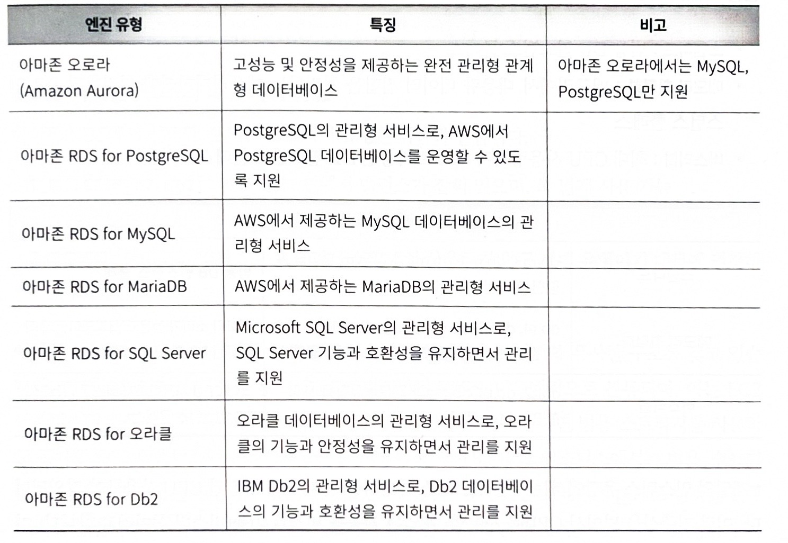

## 5.1 관계형 데이터베이스, 아마존 RDS

데이터베이스는 데이터를 일정한 형식과 구조를 갖추고 저장하고 관리하는데 사용한다. 이때 데이터베이스의 형식과 구조를 **단위**별로 나눈 것을 `테이블`이라고 한다.

데이터베이스는 엑셀과 유사하게 **행과 열**로 구성된 데이터를 포함한다.

데이터베이스에서 흔히 사용되는 **MariaDB, MySQL, Oracle**과 같은 유형의 데이터베이스를 **관계형 데이터베이스(RDBMS)**라고 한다.

> **관계형 DB가 많이 쓰이는 이유?**

1.  데이터 구조가 명확함
테이블(행, 열) 형태라서 이해하기 쉽다
2. 데이터 무결성 보장
기본키(PK), 외래키(FK)로 데이터 관계를 유지한다
3. SQL로 쉽게 조회 가능
표준 언어(SQL) 사용한다는 점이 있다
4. 데이터 조합 및 조회 용이
여러 테이블의 데이터를 조합(Join)하여 원하는 정보를 쉽게 추출할 수 있다
> 

**아마존 RDS**

> AWS에서 제공하는 관리형 관계형 데이터베이스 서비스
> 

서버에 DB를 직접 설치하지 않고, AWS가 대신 **설치·운영·관리** 해주기 때문에, 사용자는 DB**만 쓰면 된다**

## 5.2 DS 주요 구성 요소

### 1. 엔진 유형 (DB Engine)

> 
> 

아마존 RDS는 다양한 관계형 데이터베이스 엔진을 지원하는 관리형 서비스로, 사용자는 목적에 따라 적절한 데이터베이스 엔진을 선택하여 사용할 수 있다.



먼저, **Amazon Aurora는 AWS에서 자체적으로 개발한 관계형 데이터베이스로, 기존 MySQL이나 PostgreSQL과 호환되면서도 더 높은 성능과 안정성을 제공하는 것이 특징이다. 따라서 대용량 데이터 처리나 고성능이 필요한 서비스에 적합하다.**

그 외의 엔진들은 기존에 널리 사용되던 데이터베이스를 AWS 환경에서 관리형으로 제공하는 형태이다.

예를 들어, **RDS for PostgreSQL**은 PostgreSQL 데이터베이스를 AWS에서 쉽게 운영할 수 있도록 지원하며,

**RDS for MySQL**과 **RDS for MariaDB**는 각각 MySQL과 MariaDB를 관리형 서비스로 제공한다.

또한, 기업 환경에서 많이 사용되는 **Microsoft SQL Server**와 **Oracle 데이터베이스** 역시 RDS에서 지원되며, 기존 데이터베이스의 기능과 호환성을 유지하면서도 AWS의 자동 관리 기능을 함께 제공한다.

마찬가지로 **IBM Db2**도 RDS에서 관리형 서비스로 제공되어, 기존 Db2 환경을 클라우드에서 운영할 수 있다.

결론적으로, 아마존 RDS는 다양한 데이터베이스 엔진을 지원하여 사용자가 필요에 따라 선택할 수 있도록 하며, 특히 Aurora는 AWS에서 자체 개발한 고성능 데이터베이스라는 점에서 다른 엔진들과 차별화된다.

- MySQL, MariaDB, PostgreSQL, Oracle, SQL Server 등

### 2. DB 인스턴스 클래스

> **데이터베이스 서버의 성능 크기**를 정하는 것
> 

CPU와 메모리 자원이 어느 정도인지 결정하는 항목이라고 보면 된다.

RDS에서는 여러 종류의 인스턴스 클래스를 제공하는데, 교재에서는 크게 다음과 같이 구분하고 있다.

- **스탠다드**: 범용으로 사용할 수 있는 인스턴스
- **메모리 최적화**: 메모리를 많이 사용하는 애플리케이션에 적합한 인스턴스
- **버스터블**: 평소에는 적당한 자원을 쓰다가 필요할 때 CPU를 순간적으로 더 사용할 수 있는 인스턴스

특히 버스터블 인스턴스는 `db.t3.small` 같은 형태로 표현되는데, 여기서 `t3`는 버스터블 계열을 의미하고 `small`은 크기를 의미한다.

버스터블은 항상 높은 성능이 필요한 것이 아니라, 일시적으로 부하가 올라가는 환경에서 비용 효율적으로 사용할 수 있다는 장점이 있다.

### 3. 스토리지 유형

RDS는 데이터를 저장할 디스크 종류도 선택할 수 있다.

교재에서 소개한 스토리지 유형은 크게 다음과 같다.

- **범용 SSD(gp2, gp3)**: 비용과 성능의 균형이 잘 맞아서 가장 널리 사용됨
- **프로비저닝된 IOPS(io1)**: 매우 높은 I/O 성능이 필요한 경우 사용
- **마그네틱**: 구세대 방식이라 일반적으로 권장되지 않음

이 중에서 보통 많이 사용하는 것은 **gp2, gp3 같은 범용 SSD**이다.

특히 gp3는 성능과 처리량을 별도로 조정할 수 있는 특징이 있어서 유연하게 사용할 수 있다.

다만 교재에서도 언급하듯이, EC2에서는 gp3가 많이 권장되지만 RDS에서는 요금 구조를 잘 비교해야 한다. 어떤 경우에는 gp2가 더 유리할 수도 있기 때문이다.

즉, 스토리지는 무조건 최신 유형을 고르는 것이 아니라, **비용과 성능을 함께 고려해서 선택해야 하는 요소**이다.

### 4. DB 파라미터 그룹 (DB 그룹)

RDS에서는 데이터베이스 자체만 만드는 것이 아니라, 이를 둘러싼 설정을 여러 그룹 단위로 관리한다.

교재에서는 이를 **서브넷 그룹, 파라미터 그룹, 옵션 그룹**으로 설명하고 있다.

### 1. 서브넷 그룹

서브넷 그룹은 **RDS가 배치될 서브넷들의 묶음**이다.

즉, 데이터베이스를 네트워크 상 어디에 둘 것인지 정하는 개념이다.

EC2는 단순히 특정 SubnetId를 직접 지정하면 되지만, RDS는 관련된 서브넷들을 그룹으로 묶어서 사용한다.

보통 중요한 데이터베이스는 외부에 직접 노출되지 않도록 **프라이빗 서브넷**에 배치하는 것이 일반적이다.

교재에서도 RDS는 프라이빗 서브넷에 두고, 외부와 직접 통신하지 않도록 구성하는 예를 보여준다.

즉, 사용자는 인터넷에서 바로 RDS에 접속하지 않고, 내부의 EC2 같은 애플리케이션 서버를 통해 접근하게 된다.

### 2. 파라미터 그룹

파라미터 그룹은 **DB 엔진 설정값의 집합**이다.

예를 들어 시간대(time zone), 문자 집합(character set), 각종 데이터베이스 동작 옵션 등을 관리한다.

즉, 데이터베이스의 세부 동작 방식을 정하는 설정 파일 같은 역할을 한다고 보면 된다.

엔진 종류에 따라 맞는 패밀리를 사용해야 하며, 예를 들어 Oracle을 사용한다면 Oracle 계열에 맞는 파라미터 그룹 패밀리를 지정해야 한다.

### 3. 옵션 그룹

옵션 그룹은 **RDS에서 사용할 추가 기능이나 연동 옵션을 관리하는 그룹**이다.

예를 들어 특정 기능을 켜거나, 다른 AWS 서비스와의 연동과 관련된 옵션을 설정할 수 있다.

즉, 파라미터 그룹이 데이터베이스의 내부 설정값을 담당한다면, 옵션 그룹은 **추가 기능 확장**에 더 가깝다고 이해하면 된다.

### 5.2.5 RDS의 확장성과 가용성을 위한 기능

> 
> 
> 
> RDS는 단순히 데이터베이스를 저장하는 역할만 하는 것이 아니라, 서비스가 커졌을 때와 장애가 났을 때를 대비한 기능도 제공한다. 
> 대표적인 것이 **읽기 전용 복제**와 **다중 AZ**
> 

### 1. 읽기 전용 복제(Read Replica)

읽기 전용 복제는 원본 데이터베이스의 데이터를 복사한 **읽기 전용 복제본**을 추가로 만드는 기능이다.

원본 데이터베이스는 보통 **마스터(Master) 또는 프라이머리(Primary)**라고 하고,

복제본은 읽기 작업만 처리한다.

이 기능의 핵심 목적은 **읽기 부하를 분산해서 성능을 높이는 것**이다.

예를 들어 사용자가 많은 서비스에서는 조회 요청이 매우 많을 수 있는데, 이때 모든 읽기 요청을 하나의 DB가 처리하면 부담이 커진다.

그래서 읽기 전용 복제본을 여러 개 두고 조회를 분산하면, 시스템 전체 성능을 향상시킬 수 있다.

다만 중요한 점은 읽기 전용 복제본은 이름 그대로 **읽기만 가능**하다는 것이다.

즉, 쓰기 작업은 여전히 원본 DB에서 처리해야 한다.

따라서 이 기능은 **성능 확장**을 위한 것이지, 장애 대비용 주 기능이라고 보기는 어렵다.

또한 교재에서는 다른 리전에 읽기 전용 복제본을 만드는 **교차 리전 읽기 전용 복제본(Cross-Region Read Replica)**도 소개하고 있다.

이 기능은 읽기 작업을 다른 지역으로 확장하거나, 재해 복구 능력을 높이는 데 도움이 된다.

### 2. 다중 AZ(Multi-AZ)

다중 AZ는 **고가용성**을 위한 기능이다.

여기서 AZ는 Availability Zone, 즉 가용 영역을 의미한다.

하나의 데이터베이스만 운영하면 해당 AZ에 장애가 발생했을 때 서비스 전체가 멈출 위험이 있다.

그래서 RDS는 다른 AZ에 **스탠바이 데이터베이스**를 복제해 두고, 원본 DB에 장애가 발생하면 자동으로 스탠바이가 새로운 마스터로 승격되도록 할 수 있다.

즉, 다중 AZ의 목적은 **장애 발생 시에도 서비스를 계속 유지하는 것**이다.

읽기 전용 복제와 비교하면 차이가 더 분명해진다.

- **읽기 전용 복제**: 성능 향상을 위한 읽기 분산
- **다중 AZ**: 장애 대응과 고가용성 확보

교재에서는 다중 AZ 인스턴스와 다중 AZ 클러스터도 설명하고 있다.

다중 AZ 인스턴스는 기본 DB와 스탠바이 DB로 이루어져 있고, 장애가 나면 스탠바이로 자동 전환된다.

이때 스탠바이는 평소에 읽기나 쓰기를 직접 처리하는 용도가 아니라, **대기 상태**로 존재한다.

반면 다중 AZ 클러스터는 더 발전된 형태로, 읽기와 쓰기 처리 구조가 조금 더 확장된 형태를 가진다.

다만 지원 엔진이나 구성 방식에 제약이 있으므로 상황에 맞게 선택해야 한다.

결국 다중 AZ는 **중요한 운영 환경에서 안정성을 높이기 위한 기능**이라고 정리할 수 있다.

보안 측면에서의 RDS

## 5.3 클라우드포메이션으로 RDS를 구성하는 흐름

이 과정은 RDS를 수동으로 클릭해서 만드는 것이 아니라, YAML 파일에 필요한 설정을 적어서 **코드로 인프라를 관리하는 방식**

**`Security_Group.yml`**

```java
AWSTemplateFormatVersion: "2010-09-09"
Description: Create Security Group
# ------------------------------------------------------------#
# Input Parameters
# ------------------------------------------------------------# 
Parameters:
  SystemName:
    Description: "System name of each resource names."
    Type: String
    Default: "gr"
  EnvName:
    Description: "Environment name of each resource names."
    Type: String
    Default: "product"
# ------------------------------------------------------------#
#  Create EC2 Security Group
# ------------------------------------------------------------#
Resources:
  EC2SecurityGroup:
    Type: AWS::EC2::SecurityGroup # 보안 그룹을 생성
    Properties:
      GroupName: !Sub ${SystemName}-${EnvName}-ec2-sg # 보안 그룹 이름을 지정
      GroupDescription: !Sub ${SystemName}-${EnvName}-ec2-sg # 보안 그룹 설명
      VpcId:
        Fn::ImportValue: !Sub ${EnvName}-vpc
      Tags: 
        - Key: Name
          Value: !Sub ${SystemName}-${EnvName}-ec2-sg
        - Key: Env
          Value: !Sub ${EnvName}
# ------------------------------------------------------------#
#  Create RDS Security Group
# ------------------------------------------------------------#
  RDSSecurityGroup:
    Type: AWS::EC2::SecurityGroup
    Properties:
      GroupName: !Sub ${SystemName}-${EnvName}-rds-sg
      GroupDescription: !Sub ${SystemName}-${EnvName}-rds-sg
      SecurityGroupIngress:
        - IpProtocol: tcp
          FromPort: 1521
          ToPort: 1521
          SourceSecurityGroupId: !GetAtt EC2SecurityGroup.GroupId
      VpcId:
        Fn::ImportValue: !Sub ${EnvName}-vpc
      Tags:
        - Key: Name
          Value: !Sub ${SystemName}-${EnvName}-rds-sg
        - Key: Env
          Value: !Sub ${EnvName}
# ------------------------------------------------------------
# Output Parameters
# ------------------------------------------------------------
Outputs:
# Security Groups
  EC2SecurityGroup:
    Value: !Ref EC2SecurityGroup
    Export:
      Name: !Sub ${EnvName}-ec2-sg
  RDSSecurityGroup:
    Value: !Ref RDSSecurityGroup
    Export:
      Name: !Sub ${EnvName}-rds-sg
```

EC2용 보안 그룹 + RDS용 보안 그룹을 생성하고 연결하는 코드

**`RDS.yml`**

```java
AWSTemplateFormatVersion: "2010-09-09"
Description: Create RDS
# ------------------------------------------------------------#
# Input Parameters
# ------------------------------------------------------------#
Parameters:
  SystemName:
    Description: "System name of each resource names."
    Type: String
    Default: "gr"
  EnvName:
    Description: "Environment name of each resource names."
    Type: String
    Default: "product"
  RDSMasterUserName:
    Description: Staging RDS DB Master User Name.
    Default: "grsys"
    Type: String
  RDSMasterPassword:
    Description: Staging RDS DB Master Password.
    Type: String
    NoEcho: true
  RDSMaintenanceWindow:
    Description: Staging Enter MaintenanceWindow(UTC)
    Type: String
    Default: "sat:18:00-sat:19:00" # KST：[日] 03:00 - 04:00
# ------------------------------------------------------------#
#  Create RDS
# ------------------------------------------------------------#
Resources:
  RDSInstance:
    Type: AWS::RDS::DBInstance
    Properties:
      DBInstanceIdentifier: !Sub ${SystemName}-${EnvName}-rds
      DBName: "grdb" # 초기 데이터베이스 이름
      CharacterSetName: KO16MSWIN949
      DBInstanceClass: db.t3.xlarge
      Engine: oracle-se2
      MultiAZ: false #　multiAZ 설정 없음
      EngineVersion: '19.0.0.0.ru-2023-10.rur-2023-10.r1'
      LicenseModel: 'license-included'
      Port: 1521
      AutoMinorVersionUpgrade: false
      PubliclyAccessible: false
      AvailabilityZone:
        Fn::Select: 
        - 0
        - Fn::GetAZs: ""
      StorageType: "gp3"
      AllocatedStorage: "200"
      StorageEncrypted: true
      EnablePerformanceInsights: true # Performance Insight
      PerformanceInsightsRetentionPeriod: 7 # Performance Insight(보존기간7日)
      BackupRetentionPeriod: 0 # 자동 백업 무효화
      MasterUsername: !Ref RDSMasterUserName
      MasterUserPassword: !Ref RDSMasterPassword
      PreferredMaintenanceWindow: !Ref RDSMaintenanceWindow # 유지 보수
      VPCSecurityGroups:
        - Fn::ImportValue: !Sub ${EnvName}-rds-sg
      DBSubnetGroupName: !Ref RDSSubnetGroup
      DBParameterGroupName: !Ref RDSParameterGroup
      OptionGroupName: !Ref RDSOptionGroup
      Tags:
          - Key: Name
            Value: !Sub ${SystemName}-${EnvName}-rds
          - Key: Env
            Value: !Sub ${EnvName}
# ------------------------------------------------------------#
#  Create SubnetGroup
# ------------------------------------------------------------#
  RDSSubnetGroup:
    Type: AWS::RDS::DBSubnetGroup
    Properties:
      DBSubnetGroupName: !Sub ${SystemName}-${EnvName}-dbsub
      DBSubnetGroupDescription: !Sub ${SystemName}-${EnvName}-dbsub Subnet Group
      SubnetIds:
        - Fn::ImportValue: !Sub ${EnvName}-datastore-subnet-1a
        - Fn::ImportValue: !Sub ${EnvName}-datastore-subnet-1b
      Tags:
        - Key: Name
          Value: !Sub ${SystemName}-${EnvName}-dbsub
        - Key: Env
          Value: !Sub ${EnvName}
# ------------------------------------------------------------#
#  Create ParameterGroup
# ------------------------------------------------------------#
  RDSParameterGroup:
    Type: AWS::RDS::DBParameterGroup
    Properties:
      DBParameterGroupName: !Sub ${SystemName}-${EnvName}-dbpg19
      Description: !Sub ${SystemName}-${EnvName}-dbpg19 Parameter
      Family: 'oracle-se2-19'
      Tags:
        - Key: Name
          Value: !Sub ${SystemName}-${EnvName}-dbpg19
        - Key: Env
          Value: !Sub ${EnvName}
# ------------------------------------------------------------#
#  Create  OptionGroup
# ------------------------------------------------------------#
  RDSOptionGroup:
    Type: AWS::RDS::OptionGroup
    Properties:
      OptionGroupName: !Sub ${SystemName}-${EnvName}-dbog19
      OptionGroupDescription: !Sub ${SystemName}-${EnvName}-dbog19 Option Group
      EngineName: "oracle-se2"
      MajorEngineVersion: "19"
      Tags:
        - Key: Name
          Value: !Sub ${SystemName}-${EnvName}-dbog19
        - Key: Env
          Value: !Sub ${EnvName}
# ------------------------------------------------------------
# Output Parameters
# ------------------------------------------------------------
Outputs:
# RDS
  RDSInstance:
    Value: !Ref RDSInstance
    Export:
      Name: !Sub ${SystemName}-rds
```

프라이빗 환경에서 EC2만 접근 가능한 Oracle RDS를 생성하는 CloudFormation 코드

**`IAM.yml`**

```java
AWSTemplateFormatVersion: "2010-09-09"
Description: Create IAM Role
# ------------------------------------------------------------
# Input Parameters
# ------------------------------------------------------------
Parameters:
  SystemName:
    Description: "System name of each resource names."
    Type: String
    Default: "gr"
  EnvName:
    Description: "Environment name of each resource names."
    Type: String
    Default: "product"
# ------------------------------------------------------------#
#  Create IAM Role
# ------------------------------------------------------------#
Resources:
  EC2IAMRole:
    Type: AWS::IAM::Role
    DeletionPolicy: Delete
    Properties:
      RoleName: !Sub ${SystemName}-${EnvName}-ec2-role
      AssumeRolePolicyDocument: 
        Version: "2012-10-17"
        Statement: 
          - Effect: "Allow"
            Principal: 
              Service: 
                - "ec2.amazonaws.com"
            Action: 
              - "sts:AssumeRole"
      Path: "/"
      ManagedPolicyArns:
        - "arn:aws:iam::aws:policy/AmazonSSMManagedInstanceCore"
  EC2InstanceProfile:
    Type: AWS::IAM::InstanceProfile
    Properties:
      InstanceProfileName: !Sub ${SystemName}-${EnvName}-ec2-role
      Path: "/"
      Roles:
        - Ref: EC2IAMRole
# ------------------------------------------------------------
# Output Parameters
# ------------------------------------------------------------
Outputs:
# IAM Profile
  InstanceProfile:
    Value: !Ref EC2InstanceProfile
    Export:
      Name: !Sub ${EnvName}-ec2-role
```