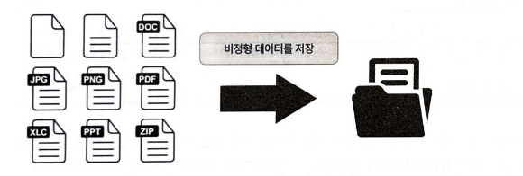
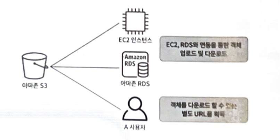
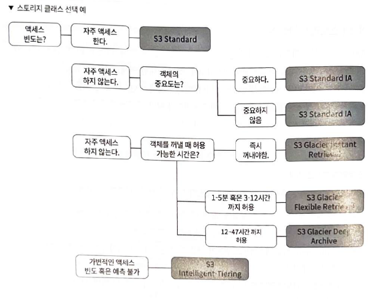
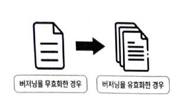
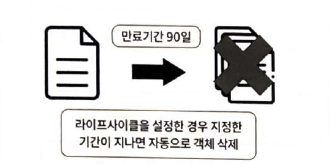

# 요약
이 문서는 AWS 객체 스토리지 서비스의 핵심인 Amazon S3의 구조, 관리 방법, 구축 및 활용 방법을 다루어 학생들이 효과적으로 학습하고 시험을 준비할 수 있도록 돕는 것이 목표이다.

## 6.1 객체 스토리지 서비스, 아마존 S3란? 

객체 스토리지는 객체(Object)라는 형태를 가지며, 틀이 정해지지 않은 **비정형 데이터**를 저장하고 관리하는 서비스이다. 이는 어떠한 파일 형식이든 상관없이 저장할 수 있도록 한다. AWS에서는 이 객체 스토리지 서비스를 **아마존 S3(Simple Storage Service)**라는 이름으로 제공하고 있으며, 객체를 안정적으로 저장하고, 쉽게 검색하며, 다양한 방법으로 관리할 수 있는 옵션을 제공한다. 

아마존 S3는 **버킷(Bucket)**이라는 스토리지에 객체를 저장한다. 버킷은 전 리전에 걸쳐 고유한 이름을 가져야 하며, 다른 리전에서 같은 이름의 버킷을 사용할 수 없다. 객체 또한 버킷 내부에서 고유한 **키(Key)** 값을 가지며, 같은 이름의 키 객체를 저장할 경우 덮어쓰기가 발생한다. 

S3 버킷은 무제한의 용량과 객체 수를 저장할 수 있으며, 각 객체는 최소 0바이트에서 최대 5TB까지 저장 가능하다. 계정당 최대 100개의 버킷을 생성할 수 있으며, 관리 콘솔에서는 최대 160GB의 객체만 저장할 수 있지만, AWS CLI를 사용하면 160GB 이상의 객체도 저장할 수 있다. 

저장된 객체는 EC2 인스턴스, Amazon RDS와 연동하여 업로드/다운로드하거나, 별도 URL을 통해 다운로드하는 등 다양한 용도로 활용될 수 있다. 

🔍 **객체 스토리지란?**

객체 스토리지는 일반적인 파일 저장 방식과는 조금 다르다. 텍스트 파일, 이미지, 비디오처럼 형식이 정해져 있지 않은 데이터를 '객체'라는 형태로 저장하고 관리하는 서비스이다. 예를 들어, 사진 앨범을 생각해보자. 사진 한 장 한 장이 '객체'이고, 이 사진들을 담는 앨범이 '버킷'이라고 볼 수 있을 것이다. 어떤 종류의 사진이든 (JPG, PNG 등) 앨범에 저장할 수 있는 것과 같이, 객체 스토리지는 어떤 형식의 파일이든 저장할 수 있는 것이다.

**아마존 S3의 특징**:

1.  **무제한 저장**: S3는 이론적으로 무한한 데이터를 저장할 수 있다. 마치 끝없는 앨범에 사진을 계속 넣을 수 있는 것과 같은 것이다.
2.  **안정성**: 아마존 S3는 매우 높은 안정성을 자랑한다. 데이터를 여러 곳에 복제하여 보관하므로 데이터 손실 걱정을 덜 수 있을 것이다.
3.  **고유한 이름**: 모든 버킷과 객체는 고유한 이름을 가진다. 예를 들어, 전 세계에 수많은 "홍길동"이 있더라도, 각자의 주민등록번호는 고유한 것과 비슷하다. 이 고유한 이름을 통해 원하는 데이터를 정확히 찾을 수 있다.
4.  **다양한 활용**: S3에 저장된 데이터는 웹사이트 호스팅, 백업, 분석 등 다양한 용도로 사용될 수 있다. 마치 앨범 속 사진을 친구와 공유하거나, 액자로 만들거나, 슬라이드 쇼를 만드는 것과 같다고 볼 수 있을 것이다.

 **주의사항**:
*   버킷 이름은 전 세계 AWS에서 **고유**해야 한다.
*   버킷 내 객체 이름도 **고유**해야 하며, 같은 이름으로 저장 시 **덮어쓰기**가 일어난다.

이러한 특징들 덕분에 아마존 S3는 웹 애플리케이션, 데이터 백업, 빅데이터 분석 등 다양한 분야에서 핵심적인 역할을 하는 서비스가 될 것이다.

### 스토리지 클래스 

아마존 S3는 객체의 액세스 빈도와 중요도, 그리고 데이터를 가져올 때 허용되는 시간에 따라 다양한 스토리지 클래스를 제공한다. 이를 통해 사용자는 스토리지 비용을 최적화할 수 있을 것이다.

주요 스토리지 클래스는 다음과 같다.
*   **S3 Standard**: 자주 액세스하는 데이터에 적합하며, 가장 빠른 액세스 속도를 제공하는 클래스이다.
*   **S3 Standard-IA (Infrequent Access)**: 자주 액세스하지 않지만 필요할 때 빠르게 액세스해야 하는 데이터에 적합하다. 스토리지 비용은 낮지만, 검색 수수료가 부과될 것이다.
*   **S3 Glacier Instant Retrieval**: S3 Infrequent Access보다 액세스 빈도가 현저히 낮고, 밀리초 단위의 검색이 필요한 의료 이미지나 미디어 자산에 적합하다.
*   **S3 Glacier Flexible Retrieval**: 액세스 빈도가 매우 낮고, 백업 및 재해 복구 사례에 적합하다. 1분에서 12시간 이내에 데이터를 검색할 수 있는 유연성을 제공할 것이다.
*   **S3 Glacier Deep Archive**: 규제 준수 요구 사항을 위해 7~10년 이상 보관해야 하는 장기 보관용 데이터나 대규모 백업 및 재해 복구에 적합하다. 12~48시간 이내에 데이터를 검색할 수 있을 것이다.
*   **S3 Intelligent-Tiering**: 액세스 패턴이 변경됨에 따라 자동으로 스토리지 클래스를 옮겨 스토리지 비용을 최적화한다.

스토리지 클래스 설정은 객체 업로드 시 속성에서 지정하거나, 업로드된 객체를 편집하여 변경할 수 있다. 기본값으로는 S3 Standard가 선택되어 있을 것이다. 

 **스토리지 클래스란?**

사진 앨범의 비유를 다시 가져와 보자. 모든 사진을 항상 손이 닿는 곳에 두지는 않을 것이다. 어제 찍은 사진은 쉽게 볼 수 있는 곳에, 1년 전 사진은 서랍에, 10년 전 사진은 창고에 보관하는 것처럼, 데이터도 얼마나 자주 보느냐, 얼마나 빨리 찾아야 하느냐에 따라 다른 곳에 보관해야 효율적이다. 아마존 S3의 **스토리지 클래스**는 바로 이러한 필요에 맞춰 데이터를 보관하는 다양한 방법을 제공하는 것이다.

### 6.2.2 버전 관리를 위한 버저닝 기능 

**버저닝(Versioning)** 기능은 단일 객체의 여러 버전을 유지할 수 있도록 하는 기능이다. 이 기능을 활성화하면 조작 실수로 인한 데이터 삭제나 덮어쓰기 발생 시 이전 버전으로 복구하거나 되돌릴 수 있는 수단을 제공할 것이다.

*   **버저닝 무효화 시**: 업로드된 객체는 단일 객체로 저장되며, 삭제 또는 덮어쓰기 발생 시 복구 또는 되돌리기가 불가능하다.
*   **버저닝 유효화 시**: 객체를 업로드할 때마다 새로운 버전이 생성되어 이전 버전으로 되돌리거나 삭제된 객체를 복구할 수 있다. 다만, 새 버전이 만들어질 때마다 스토리지 사용량이 증가하여 비용이 늘어날 수 있다는 점을 유의해야 할 것이다.

버저닝은 S3 버킷 생성 시 활성화하거나, 생성 후 버킷의 버전 관리 항목에서 활성 유무를 변경할 수 있다. 

 **버저닝이란?**

버저닝은 마치 문서 작업 중 **'실행 취소(Ctrl+Z)'** 기능을 떠올리게 하는 것이다. 어떤 파일을 수정하거나 실수로 지웠을 때, 그 이전 상태로 되돌릴 수 있다면 얼마나 좋을까? S3의 **버저닝 기능**이 바로 그 역할을 하는 것이다. 

**버저닝의 작동 방식**:
1.  **여러 버전 저장**: 버저닝을 활성화하면, 예를 들어 `document.txt`라는 파일을 수정하고 다시 업로드할 때, 기존의 `document.txt`를 덮어쓰지 않고 **새로운 버전**으로 저장한다. 이렇게 되면 `document.txt`는 "첫 번째 버전", "두 번째 버전" 등 여러 버전을 가지게 될 것이다.
2.  **실수 복구**: 만약 최신 버전에 문제가 생기거나 실수로 파일을 삭제했더라도, 걱정할 필요가 없다. 이전 버전을 선택하여 복구하거나, 삭제된 파일을 찾아 되살릴 수 있을 것이다. 마치 실수로 지워버린 사진을 휴지통에서 다시 꺼내는 것과 비슷하다.
3.  **삭제 마커**: 객체를 삭제하면 실제 데이터가 바로 지워지는 것이 아니라, '삭제 마커'라는 것이 붙는다. 이 마커를 제거하면 객체가 다시 복원될 것이다. 

**장점과 단점**:
*   **장점**: 데이터 손실 위험을 크게 줄여주며, 변경 이력을 관리하기 용이하다. 협업 환경에서도 유용하게 사용될 것이다.
*   **단점**: 새로운 버전이 생성될 때마다 스토리지 공간을 더 많이 사용하게 되므로, **비용이 증가**할 수 있다. 따라서 오래된 버전을 자동으로 삭제하는 '생명주기 규칙'과 함께 사용하는 것이 일반적이다.

버저닝은 S3 버킷 생성 시 또는 생성 후 언제든지 활성화/비활성화할 수 있다. 이 기능을 통해 중요한 데이터의 안정성을 높일 수 있을 것이다.

### 6.2.3 생명주기 규칙을 활용한 객체 관리 

생명주기 규칙(Lifecycle Rules)은 객체 생성일로부터 지정된 기간이 경과한 객체를 자동으로 삭제하거나, 다른 스토리지 클래스로 전환하는 등 객체의 수명 주기를 관리하는 기능이다. 이 기능을 통해 장기간 보존할 필요가 없는 불필요한 객체들을 정리하고, 스토리지 비용을 절약할 수 있을 것이다. 

*   **자동 삭제/만료**: 객체 생성 후 지정된 일수가 지나면 객체를 자동으로 삭제하거나, 객체의 현재 버전을 만료시킬 수 있다. 최소 1일에서 최대 2147483647일까지 보존 기간을 설정할 수 있다.
*   **스토리지 클래스 전환**: 특정 기간이 경과한 객체를 더 저렴한 스토리지 클래스(예: S3 Standard-IA, Glacier)로 자동 전환하여 비용을 절감할 수 있다.
*   **규칙 범위 지정**: 생명주기 규칙은 버킷의 모든 객체에 적용할 수도 있고, 특정 접두사(폴더)나 객체 태그, 객체 크기 등 필터를 사용하여 특정 범위의 객체에만 적용할 수도 있다.  

**객체의 현재 버전 만료**와 **객체의 이전 버전 영구 삭제**는 버저닝 기능과 관련이 있다. 

*   **객체의 현재 버전 만료**: 버저닝이 활성화된 상태에서 이 옵션을 체크하면, 지정된 기간이 경과한 객체는 현재 버전이 만료되어 이전 버전으로 전환되지만, 실제 데이터는 삭제되지 않고 이전 버전으로 유지될 것이다.
*   **객체의 이전 버전 영구 삭제**: 이전 버전으로 전환된 객체를 완전히 삭제하려면 이 옵션을 체크해야 이전 버전이 영구적으로 삭제될 것이다.

**생명주기 규칙이란?**

생명주기 규칙은 마치 냉장고 속 식료품 관리를 자동화하는 것과 비슷하다. 신선한 채소는 짧은 시간 안에 먹어야 하고, 유제품은 유통기한이 지나면 버려야 하며, 오래 보관할 수 있는 김치는 김치냉장고로 옮겨야 하는 것처럼, 데이터도 사용 기한과 중요도에 따라 자동으로 관리할 필요가 있을 것이다. S3의 **생명주기 규칙**은 이러한 데이터 관리를 자동화하여 비용을 절약하고 효율성을 높이는 기능이다. 

**생명주기 규칙의 주요 기능**:

1.  **자동 삭제/만료**: "이 파일은 생성된 지 30일이 지나면 자동으로 지워라!"와 같이 설정할 수 있다. 예를 들어, 임시 로그 파일이나 테스트 데이터처럼 일정 기간이 지나면 필요 없어지는 데이터를 자동으로 정리하여 스토리지 공간을 확보할 수 있을 것이다.
2.  **스토리지 클래스 자동 전환**: "이 파일은 처음 30일 동안은 자주 접근할 수 있는 곳에 두다가, 30일이 지나면 잘 안 쓰는 저렴한 저장소(Glacier 같은)로 옮겨라!"와 같이 설정할 수 있다. 이렇게 하면 데이터의 사용 빈도에 맞춰 자동으로 비용을 최적화할 수 있을 것이다.
    *   **예시**: 처음에는 S3 Standard에 보관하다가, 한 달 후에는 S3 Standard-IA로, 1년 후에는 S3 Glacier로 자동 이동시키는 것이다.
3.  **특정 객체에만 적용**: 모든 데이터에 똑같은 규칙을 적용하는 것이 아니라, 특정 폴더(`Images/` 폴더 안의 파일만)나 특정 확장자(`.log` 파일만) 또는 특정 크기(1GB보다 큰 파일만)의 객체에만 규칙을 적용할 수 있다.  

**버저닝과의 관계**:
생명주기 규칙은 버저닝과 함께 사용할 때 더욱 강력해질 것이다. 예를 들어, 버저닝으로 여러 버전을 보관하다가, "이전 버전들은 생성된 지 90일이 지나면 영구적으로 삭제해라!"와 같은 규칙을 추가하여 불필요한 과거 버전들이 쌓이는 것을 방지하고 스토리지 비용을 효율적으로 관리할 수 있을 것이다. 

이처럼 생명주기 규칙은 데이터의 양이 많고, 데이터 수명 주기가 복잡한 환경에서 매우 유용한 기능이 될 것이다.

## 6.3 아마존 S3 생성하기 
아마존 S3 버킷은 **클라우드포메이션(CloudFormation)**을 통해 YAML 파일로 정의하여 생성할 수 있다. 클라우드포메이션은 AWS 리소스를 코드로 관리하는 서비스로, S3 버킷 생성 과정을 자동화하고 일관성을 유지하는 데 유용할 것이다. 

S3 버킷 생성용 `S3.yml` 파일의 주요 구성 요소는 다음과 같다.
*   **Parameters**:
    *   `BucketName`: 버킷 이름을 정의한다. 이 이름은 AWS의 모든 리전과 계정에서 고유해야 하므로, 스택 생성 시 변경 가능하도록 파라미터로 지정하는 것이 일반적이다. 
*   **Resources**:
    *   `Type: AWS::S3::Bucket`: S3 버킷 리소스를 선언한다.
    *   `Properties`:
        *   `BucketName`: 실제 버킷 이름을 지정한다. `!Sub ${BucketName}-${EnvName}-${BucketName}`과 같이 환경 변수를 활용하여 동적으로 이름을 생성할 수 있을 것이다.
        *   `PublicAccessBlockConfiguration`: 퍼블릭 액세스를 차단하는 설정을 포함한다. 기본적으로 `BlockPublicAcls: true`, `BlockPublicPolicy: true`, `IgnorePublicAcls: true`, `RestrictPublicBuckets: true`로 설정하여 모든 퍼블릭 액세스를 차단하는 것이 보안상 권장될 것이다.
        *   `LifecycleConfiguration`: 생명주기 규칙을 정의한다. 
            *   `Id`: 생명주기 규칙의 이름을 지정한다.
            *   `Prefix`: 규칙을 적용할 경로(폴더)를 지정한다. (예: `Backup/`)
            *   `Status`: 규칙의 활성화 여부(`Enabled` 또는 `Disabled`)를 설정한다.
            *   `ExpirationInDays`: 객체 만료 기간(일수)을 지정한다. (예: 90일) 

클라우드포메이션 스택을 생성하고 S3 버킷의 이름을 입력하면, 스택이 생성되며 S3 버킷도 함께 생성될 것이다. 생성된 S3 버킷은 AWS 콘솔에서 확인할 수 있으며, 정의된 생명주기 규칙 또한 확인할 수 있을 것이다.  

**코드로 S3 버킷을 만드는 이유**:
1.  **자동화와 반복**: 똑같은 S3 버킷을 여러 개 만들어야 할 때, 매번 수동으로 설정하는 것은 번거롭고 실수할 확률이 높다. 코드로 작성해두면 버튼 하나만 누르면 원하는 대로 자동으로 버킷이 생성될 것이다.
2.  **일관성 유지**: 개발 환경, 테스트 환경, 운영 환경 등 여러 환경에서 동일한 설정의 버킷이 필요할 때, 클라우드포메이션을 사용하면 모든 환경에서 완벽히 동일한 버킷을 만들 수 있어 일관성을 유지할 수 있을 것이다.
3.  **버전 관리**: 버킷 설정 자체를 코드(S3.yml 파일)로 관리하므로, 이 코드를 Git과 같은 버전 관리 시스템에 저장할 수 있다. 누가 언제 무엇을 변경했는지 추적하기 쉽고, 문제가 생겼을 때 이전 버전으로 쉽게 되돌릴 수 있을 것이다.
4.  **보안 강화**: `PublicAccessBlockConfiguration` 설정을 통해 퍼블릭 액세스를 기본적으로 차단하여 보안을 강화할 수 있다. 코드로 명시적으로 설정하기 때문에 실수를 줄일 수 있을 것이다. 

**생명주기 규칙도 함께**: 버킷을 생성할 때부터 특정 파일은 90일이 지나면 자동으로 삭제되도록 `LifecycleConfiguration`을 함께 정의할 수 있다. 이는 수동으로 관리하는 것보다 훨씬 효율적이며, 불필요한 스토리지 비용을 줄이는 데 도움이 될 것이다. 

결론적으로, 클라우드포메이션을 이용한 S3 버킷 생성은 효율성, 일관성, 보안성을 높이는 현명한 방법이 될 것이다.

## 6.4 아마존 S3 활용하기 
EC2 인스턴스에서 S3 버킷에 저장된 객체를 업로드하고 다운로드하는 방법을 알아보는 것이 목표이다. 이를 위해서는 **IAM(Identity and Access Management) 정책**을 설정하여 EC2 인스턴스에 S3 버킷에 대한 적절한 접근 권한을 부여해야 한다. 권한이 없으면 `Access Denied` 에러가 발생할 것이다. 

연동을 위한 클라우드포메이션 YAML 파일들은 다음과 같은 순서로 스택을 생성해야 한다.
1.  `VPC.yml` (네트워크 환경 설정)
2.  `Security_Group.yml` (보안 그룹 설정)
3.  `IAM.yml` (권한 관리 설정)
4.  `EC2.yml` (EC2 인스턴스 생성)
5.  `S3.yml` (S3 버킷 생성) 

### IAM 정책 설정 
S3 버킷에 대한 EC2 인스턴스의 접근 권한을 부여하기 위해 IAM 정책을 생성해야 할 것이다.
`IAM.yml` 파일의 주요 구성 요소는 다음과 같다.
*   `Type: AWS::IAM::ManagedPolicy`: IAM 관리형 정책 리소스를 선언한다.
*   `Properties`:
    *   `ManagedPolicyName`: 정책 이름을 지정한다.
    *   `PolicyDocument`: 정책 내용을 정의한다. 
        *   `Version: "2012-10-17"`: 정책 문서의 버전을 지정한다.
        *   `Statement`: 권한 규칙들을 정의한다.
            *   `Effect: Allow` 또는 `Deny`: 해당 Action을 허용할지 거부할지 지정한다.
            *   `Action`: AWS 서비스의 어떤 작업을 수행할지 지정한다.
                *   `s3:ListAllMyBuckets`: EC2 인스턴스에서 모든 S3 버킷 목록을 불러올 수 있는 권한이다.
                *   `s3:Get*`, `s3:Delete*`, `s3:Put*`: 특정 S3 버킷에 대한 객체 읽기(Get), 삭제(Delete), 쓰기(Put) 작업을 허용하는 권한이다.
            *   `Resource`: 권한을 적용할 리소스를 지정한다. (예: `arn:aws:s3:::*`는 모든 S3 버킷, `arn:aws:s3:::gr-product-bucket/*`는 특정 버킷의 모든 객체) 
    *   `Roles`: 생성된 정책을 EC2 인스턴스가 사용할 IAM 역할에 연결한다. 

### S3 객체 업로드 및 다운로드 
IAM 정책을 통해 권한이 부여된 EC2 인스턴스에서 S3 객체를 다음과 같이 관리할 수 있다.
1.  **S3 버킷 리스트 확인**: EC2 인스턴스에 접속하여 `aws s3 ls` 명령어를 입력하면 생성된 모든 S3 버킷 리스트를 확인할 수 있을 것이다.
2.  **객체 업로드**:
    *   `touch gr-text.txt`: 로컬에 `gr-text.txt` 파일을 생성한다.
    *   `aws s3 cp gr-text.txt s3://gr-product-bucket/`: 생성된 텍스트 파일을 지정된 S3 버킷(`gr-product-bucket`)으로 업로드한다.
3.  **객체 다운로드**:
    *   `sudo aws s3 cp s3://gr-product-bucket/test-image.png ./test-image.png`: S3 버킷(`gr-product-bucket`)에 저장된 `test-image.png` 객체를 EC2 인스턴스의 현재 디렉토리로 다운로드한다. EC2 인스턴스에 파일을 쓸 권한이 필요하므로 `sudo` 명령어를 사용하거나 관리자 권한으로 로그인해야 할 것이다. 
4.  `ls` 명령어를 통해 다운로드된 객체를 확인할 수 있을 것이다. 

 **EC2와 S3, 어떻게 손발을 맞출까요?**
S3에 파일을 저장하는 것은 좋은데, 실제 프로그램을 실행하는 **EC2 인스턴스(가상 서버)**에서 이 파일들을 사용하려면 어떻게 해야 할까? 마치 회사에서 중요한 서류를 금고(S3)에 보관했는데, 실제 업무를 처리하는 직원(EC2)이 금고를 열어 서류를 가져가고 다시 넣어둘 수 있어야 하는 것과 같다. 이 '금고 열쇠' 역할을 하는 것이 바로 **IAM 정책**이다. 

**EC2가 S3에 접근하는 과정**:
1.  **금고 열쇠 만들기 (IAM 정책)**:
    *   EC2 인스턴스에게 "S3 버킷 목록을 볼 수 있고, 특정 버킷의 파일을 읽고(Get), 쓰고(Put), 지울(Delete) 수 있는 권한을 주겠다"는 **정책 문서**를 만든다. 이 정책은 **`IAM.yml`** 파일에 코드로 작성될 것이다. 
    *   이 정책은 EC2 인스턴스에 부여되는 **IAM 역할**에 연결된다. 마치 직원에게 금고 열쇠를 주는 것과 같다.
2.  **파일 목록 보기**:
    *   EC2 인스턴스에서 `aws s3 ls` 명령어를 입력하면, 금고(S3)에 어떤 버킷들이 있는지 목록을 볼 수 있을 것이다.
3.  **파일 업로드**:
    *   EC2 인스턴스에서 `touch gr-text.txt`로 새 서류를 만든 다음, `aws s3 cp gr-text.txt s3://gr-product-bucket/` 명령어로 금고 안의 특정 서류함(`gr-product-bucket`)에 서류를 넣을 수 있을 것이다. 
4.  **파일 다운로드**:
    *   금고 안의 `test-image.png`라는 서류가 필요하면, `sudo aws s3 cp s3://gr-product-bucket/test-image.png ./test-image.png` 명령어로 서류를 내 컴퓨터(EC2 인스턴스)로 복사해올 수 있을 것이다. `sudo`는 관리자 권한으로 서류를 가져오는 것이라고 생각하면 된다. 

**핵심**: IAM 정책은 EC2 인스턴스가 S3 버킷에 접근할 수 있는 **최소한의 필요한 권한**만 부여하여 보안을 강화하는 것이 매우 중요하다. 불필요하게 많은 권한을 주면 보안 위험이 커질 것이다. 이처럼 IAM을 통해 AWS 서비스 간의 안전하고 효율적인 상호작용이 가능해질 것이다.
